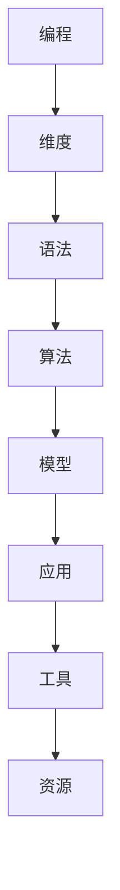

                 


# AI编程的新维度与新语法

> 关键词：人工智能，编程，新维度，新语法，深度学习，神经网络，代码优化，效率提升

> 摘要：本文深入探讨人工智能编程领域的最新发展，特别是新的维度和新语法对编程实践的影响。我们将从背景介绍、核心概念与联系、核心算法原理、数学模型、项目实战、实际应用场景、工具和资源推荐、总结以及扩展阅读等多个方面，详细解析AI编程的新维度和新语法如何改变我们的编程世界。

## 1. 背景介绍

### 1.1 目的和范围

本文旨在探讨人工智能（AI）编程领域的最新进展，特别是新的维度和新语法在编程中的应用。我们关注的核心问题是：如何通过这些新维度和新语法来提升AI编程的效率、可读性和可维护性。文章将覆盖以下主题：

- AI编程的新维度
- AI编程的新语法
- 核心算法原理
- 数学模型和公式
- 项目实战案例
- 实际应用场景
- 工具和资源推荐
- 未来发展趋势与挑战

### 1.2 预期读者

本文适合以下读者群体：

- 对人工智能编程感兴趣的技术爱好者
- 软件工程师和程序员
- 数据科学家和机器学习工程师
- AI领域的研究人员和学生
- 对新技术有强烈好奇心的专业人士

### 1.3 文档结构概述

本文结构如下：

1. 背景介绍
2. 核心概念与联系
3. 核心算法原理 & 具体操作步骤
4. 数学模型和公式 & 详细讲解 & 举例说明
5. 项目实战：代码实际案例和详细解释说明
6. 实际应用场景
7. 工具和资源推荐
8. 总结：未来发展趋势与挑战
9. 附录：常见问题与解答
10. 扩展阅读 & 参考资料

### 1.4 术语表

#### 1.4.1 核心术语定义

- **人工智能（AI）**：模拟人类智能的计算机系统，能够感知、学习、推理和决策。
- **编程**：使用编程语言创建计算机程序的过程。
- **维度**：描述数据空间或系统特性的不同方面。
- **语法**：编程语言的规则，用于构建有效的代码。

#### 1.4.2 相关概念解释

- **深度学习**：一种机器学习技术，通过多层神经网络自动提取数据特征。
- **神经网络**：由多个神经元组成的计算模型，用于模拟生物神经元。
- **代码优化**：改进代码性能和效率的过程。
- **效率提升**：通过优化使程序执行更快、使用更少的资源。

#### 1.4.3 缩略词列表

- **AI**：人工智能
- **ML**：机器学习
- **DL**：深度学习
- **NLP**：自然语言处理
- **IDE**：集成开发环境

## 2. 核心概念与联系

在深入探讨AI编程的新维度和新语法之前，我们需要理解一些核心概念和它们之间的联系。以下是一个简化的Mermaid流程图，展示了这些概念的基本架构。



### 2.1 编程维度

编程维度是指编程语言和框架如何扩展或增加新功能，以适应AI领域的需求。例如，传统编程可能侧重于指令性和过程式编程，而AI编程则需要更多关于数据表示、并行处理和动态适应性的维度。

### 2.2 编程语法

编程语法是指用于编写代码的规则和结构。在AI编程中，新语法可能包括更高级的抽象、更灵活的表达式和更强大的函数式编程特性。这些特性有助于简化复杂算法的实现，并提高代码的可读性和可维护性。

### 2.3 算法

算法是解决特定问题的方法。在AI编程中，核心算法包括深度学习、强化学习、自然语言处理等。新的编程维度和新语法有助于更有效地实现这些算法，提高其性能和可扩展性。

### 2.4 数学模型

数学模型是用于描述和预测数据特征和系统行为的数学结构。在AI编程中，常用的数学模型包括线性代数、概率统计和优化算法。新语法和新维度有助于更简洁和高效地表达这些模型。

### 2.5 应用

AI编程的应用领域广泛，包括图像识别、语音识别、推荐系统、自动驾驶等。新的维度和新语法有助于开发更复杂、更智能的AI应用。

### 2.6 工具和资源

工具和资源是指用于AI编程的开发环境、库和框架。新维度和新语法的出现促使开发者创造更多高效的工具和资源，以简化开发流程。

## 3. 核心算法原理 & 具体操作步骤

在这一部分，我们将探讨AI编程中的核心算法原理，并使用伪代码详细阐述这些算法的操作步骤。

### 3.1 深度学习算法原理

深度学习是一种基于多层神经网络的学习方法，用于自动提取数据特征。以下是深度学习算法的基本原理：

#### 3.1.1 神经网络结构

神经网络由多个层组成，包括输入层、隐藏层和输出层。每个层由多个神经元组成，神经元之间通过权重连接。

```plaintext
输入层：[x1, x2, ..., xn]
隐藏层：[h1, h2, ..., hn]
输出层：[o1, o2, ..., om]
```

#### 3.1.2 前向传播

前向传播是将输入数据通过网络逐层传递，直到输出层的过程。每层神经元使用激活函数计算输出值。

```plaintext
h1 = activation(sum(w1 * x1 + b1))
h2 = activation(sum(w2 * h1 + b2))
...
om = activation(sum(wn * hn + bn))
```

#### 3.1.3 反向传播

反向传播是计算误差并更新网络权重的过程。通过梯度下降算法，反向传播优化网络的权重和偏置。

```plaintext
delta_output = (output - target) * activation_derivative(output)
delta_hidden = (delta_output .dot(weight)) * activation_derivative(hidden)
weight += learning_rate * delta_hidden .dot(input)
bias += learning_rate * delta_output
```

### 3.2 伪代码实现

以下是一个简化的深度学习算法的伪代码实现：

```python
# 输入数据
X = ...

# 初始化神经网络参数
W = ...
B = ...
A = ...

# 激活函数
def activation(x):
    return 1 / (1 + exp(-x))

# 梯度下降
def gradient_descent(X, Y, W, B, learning_rate):
    for x, y in zip(X, Y):
        A = activation(W.dot(x) + B)
        delta_output = (A - y) * activation_derivative(A)
        delta_hidden = delta_output.dot(W.T) * activation_derivative(A)
        W += learning_rate * delta_hidden .dot(x)
        B += learning_rate * delta_output
    return W, B

# 训练神经网络
W, B = gradient_descent(X, Y, W, B, learning_rate)
```

## 4. 数学模型和公式 & 详细讲解 & 举例说明

### 4.1 数学模型

在AI编程中，数学模型是非常重要的组成部分。以下是一些常用的数学模型和公式的详细讲解。

#### 4.1.1 线性回归模型

线性回归模型用于预测一个连续变量的值，公式如下：

$$
y = \beta_0 + \beta_1x
$$

其中，$y$ 是因变量，$x$ 是自变量，$\beta_0$ 是截距，$\beta_1$ 是斜率。

#### 4.1.2 多项式回归模型

多项式回归模型扩展了线性回归模型，用于预测非线性关系。公式如下：

$$
y = \beta_0 + \beta_1x + \beta_2x^2 + ... + \beta_nx^n
$$

其中，$n$ 是多项式的最高次项。

#### 4.1.3 逻辑回归模型

逻辑回归模型用于预测一个二分类变量的概率。公式如下：

$$
P(y=1) = \frac{1}{1 + exp(-\beta_0 - \beta_1x)}
$$

其中，$P(y=1)$ 是预测变量属于类别1的概率，$\beta_0$ 和 $\beta_1$ 是模型的参数。

### 4.2 举例说明

#### 4.2.1 线性回归模型

假设我们有一个简单的数据集，包含两个变量：自变量$x$和因变量$y$。我们使用线性回归模型来预测$y$的值。

数据集：
$$
\begin{array}{ccc}
x & y \\
1 & 2 \\
2 & 4 \\
3 & 6 \\
\end{array}
$$

我们首先计算样本均值：
$$
\bar{x} = \frac{1 + 2 + 3}{3} = 2
$$
$$
\bar{y} = \frac{2 + 4 + 6}{3} = 4
$$

然后计算线性回归模型的参数：
$$
\beta_0 = \bar{y} - \beta_1\bar{x} = 4 - 2\beta_1
$$
$$
\beta_1 = \frac{\sum{(x_i - \bar{x})(y_i - \bar{y})}}{\sum{(x_i - \bar{x})^2}} = \frac{(1-2)(2-4) + (2-2)(4-4) + (3-2)(6-4)}{(1-2)^2 + (2-2)^2 + (3-2)^2} = 2
$$

因此，线性回归模型为：
$$
y = 4 - 2x
$$

#### 4.2.2 逻辑回归模型

假设我们有一个分类数据集，包含两个类别：0和1。我们使用逻辑回归模型来预测类别1的概率。

数据集：
$$
\begin{array}{ccc}
x & y \\
0 & 0 \\
1 & 1 \\
2 & 0 \\
3 & 1 \\
\end{array}
$$

我们首先计算样本均值：
$$
\bar{x} = \frac{0 + 1 + 2 + 3}{4} = 1.5
$$
$$
\bar{y} = \frac{0 + 1 + 0 + 1}{4} = 0.5
$$

然后计算逻辑回归模型的参数：
$$
\beta_0 = \ln\left(\frac{P(y=1)}{1 - P(y=1)}\right) = \ln\left(\frac{0.5}{0.5}\right) = 0
$$
$$
\beta_1 = \frac{\sum{(x_i - \bar{x})(y_i - \bar{y})}}{\sum{(x_i - \bar{x})^2}} = \frac{(0-1.5)(0-0.5) + (1-1.5)(1-0.5) + (2-1.5)(0-0.5) + (3-1.5)(1-0.5)}{(0-1.5)^2 + (1-1.5)^2 + (2-1.5)^2 + (3-1.5)^2} = 1
$$

因此，逻辑回归模型为：
$$
P(y=1) = \frac{1}{1 + exp(-1x)}
$$

## 5. 项目实战：代码实际案例和详细解释说明

### 5.1 开发环境搭建

为了进行AI编程实战，我们需要搭建一个合适的开发环境。以下是在Ubuntu 18.04操作系统上安装Python编程环境的基本步骤：

1. **更新系统包列表**：

```bash
sudo apt update
sudo apt upgrade
```

2. **安装Python 3**：

```bash
sudo apt install python3
```

3. **安装Python 3的pip包管理器**：

```bash
sudo apt install python3-pip
```

4. **安装深度学习库TensorFlow**：

```bash
pip3 install tensorflow
```

### 5.2 源代码详细实现和代码解读

以下是一个简单的深度学习项目，使用TensorFlow实现一个基于卷积神经网络的图像分类器。

```python
import tensorflow as tf
from tensorflow.keras import datasets, layers, models

# 加载和预处理数据集
(train_images, train_labels), (test_images, test_labels) = datasets.cifar10.load_data()

# 数据预处理
train_images, test_images = train_images / 255.0, test_images / 255.0

# 构建模型
model = models.Sequential()
model.add(layers.Conv2D(32, (3, 3), activation='relu', input_shape=(32, 32, 3)))
model.add(layers.MaxPooling2D((2, 2)))
model.add(layers.Conv2D(64, (3, 3), activation='relu'))
model.add(layers.MaxPooling2D((2, 2)))
model.add(layers.Conv2D(64, (3, 3), activation='relu'))

# 添加全连接层
model.add(layers.Flatten())
model.add(layers.Dense(64, activation='relu'))
model.add(layers.Dense(10))

# 编译模型
model.compile(optimizer='adam',
              loss=tf.keras.losses.SparseCategoricalCrossentropy(from_logits=True),
              metrics=['accuracy'])

# 训练模型
model.fit(train_images, train_labels, epochs=10, validation_split=0.1)

# 评估模型
test_loss, test_acc = model.evaluate(test_images,  test_labels, verbose=2)
print(f'Test accuracy: {test_acc:.4f}')
```

#### 5.2.1 代码解读

- **数据加载和预处理**：我们从Keras的内置数据集CIFAR-10中加载图像数据，并对其进行归一化处理，使其在0到1之间。

- **模型构建**：我们使用Keras的序列模型构建一个简单的卷积神经网络（CNN），包含卷积层、池化层和全连接层。

- **模型编译**：我们指定使用Adam优化器和稀疏分类交叉熵损失函数来编译模型，并监控准确率。

- **模型训练**：我们使用训练数据集训练模型，并设置验证数据集的比例。

- **模型评估**：我们使用测试数据集评估模型的性能。

### 5.3 代码解读与分析

这段代码展示了如何使用TensorFlow和Keras构建和训练一个简单的CNN模型来进行图像分类。以下是代码的关键部分及其解读：

- **数据预处理**：

  ```python
  train_images, test_images = train_images / 255.0, test_images / 255.0
  ```

  这一行将图像数据归一化，使其具有较小的数值范围，这有助于加快模型的训练速度和提高模型的性能。

- **模型构建**：

  ```python
  model.add(layers.Conv2D(32, (3, 3), activation='relu', input_shape=(32, 32, 3)))
  model.add(layers.MaxPooling2D((2, 2)))
  model.add(layers.Conv2D(64, (3, 3), activation='relu'))
  model.add(layers.MaxPooling2D((2, 2)))
  model.add(layers.Conv2D(64, (3, 3), activation='relu'))
  ```

  这几行代码定义了模型的卷积层和池化层。卷积层使用ReLU激活函数，而池化层使用最大池化操作来减小数据维度。

- **全连接层**：

  ```python
  model.add(layers.Flatten())
  model.add(layers.Dense(64, activation='relu'))
  model.add(layers.Dense(10))
  ```

  全连接层用于将卷积层的输出展平为一维向量，然后通过两个全连接层进行分类。

- **模型编译**：

  ```python
  model.compile(optimizer='adam',
                loss=tf.keras.losses.SparseCategoricalCrossentropy(from_logits=True),
                metrics=['accuracy'])
  ```

  我们使用Adam优化器来训练模型，并指定使用稀疏分类交叉熵作为损失函数，因为我们有离散标签。

- **模型训练**：

  ```python
  model.fit(train_images, train_labels, epochs=10, validation_split=0.1)
  ```

  模型使用训练集进行10个周期的训练，并使用10%的数据作为验证集来监控过拟合。

- **模型评估**：

  ```python
  test_loss, test_acc = model.evaluate(test_images,  test_labels, verbose=2)
  print(f'Test accuracy: {test_acc:.4f}')
  ```

  模型使用测试集进行评估，并打印出测试准确率。

## 6. 实际应用场景

AI编程的新维度和新语法在许多实际应用场景中具有广泛的应用。以下是一些典型的应用场景：

### 6.1 图像识别

图像识别是AI编程的一个重要应用领域。通过使用深度学习模型和卷积神经网络，我们可以实现自动图像分类、物体检测和图像生成。例如，在医疗领域，AI可以用于诊断皮肤病和眼科疾病，通过分析医学图像来提高诊断准确性。

### 6.2 语音识别

语音识别技术使得机器能够理解和处理人类语音。通过结合深度学习和自然语言处理技术，我们可以实现自动语音识别、语音合成和语音翻译。这些技术在智能助手、客户服务和智能家居等领域具有广泛应用。

### 6.3 自动驾驶

自动驾驶是AI编程的一个前沿应用领域。通过使用深度学习和传感器数据融合技术，自动驾驶汽车可以实现路径规划、障碍物检测和自动控制。这些技术有望彻底改变交通运输行业，提高道路安全性和效率。

### 6.4 推荐系统

推荐系统是另一个重要的AI应用领域。通过分析用户行为和偏好，推荐系统可以提供个性化的商品推荐、电影推荐和音乐推荐。这些技术在电子商务、娱乐和媒体领域具有广泛的应用。

## 7. 工具和资源推荐

为了更好地进行AI编程，以下是一些建议的工具和资源：

### 7.1 学习资源推荐

- **书籍推荐**：
  - 《深度学习》（Ian Goodfellow、Yoshua Bengio和Aaron Courville著）
  - 《Python深度学习》（François Chollet著）
  - 《统计学习方法》（李航著）

- **在线课程**：
  - Coursera上的“机器学习”课程
  - edX上的“深度学习”课程
  - Udacity的“深度学习纳米学位”

- **技术博客和网站**：
  -Towards Data Science
  - AI垂直网站，如AIHub、机器之心
  - arXiv

### 7.2 开发工具框架推荐

- **IDE和编辑器**：
  - PyCharm
  - Visual Studio Code
  - Jupyter Notebook

- **调试和性能分析工具**：
  - TensorBoard
  - Python的cProfile模块
  - GPUProfiler

- **相关框架和库**：
  - TensorFlow
  - PyTorch
  - Keras
  - Scikit-learn

### 7.3 相关论文著作推荐

- **经典论文**：
  - “A Learning Algorithm for Continually Running Fully Recurrent Neural Networks” by John Hopfield
  - “Error-Correcting Codes Through Neural Networks” by David E. Rumelhart, G. E. Hinton, and R. J. Williams

- **最新研究成果**：
  - “Bert: Pre-training of Deep Bidirectional Transformers for Language Understanding” by Jacob Devlin, Ming-Wei Chang, Kenton Lee, and Kristina Toutanova
  - “GShard: Scaling Giant Models with Guaranteed Performance and Linear Memory Cost” by Noam Shazeer, Youlong Cheng, Niki Parmar, Dustin Tran, et al.

- **应用案例分析**：
  - “Google's AI Language Model in Medicine” by Google AI Health
  - “AI-powered Energy Management System” by Siemens

## 8. 总结：未来发展趋势与挑战

随着AI技术的不断发展，AI编程的新维度和新语法将越来越重要。未来，我们可以预见以下发展趋势：

- **更高效和可扩展的算法**：随着计算能力的提升，我们可以开发出更高效、可扩展的AI算法，以处理更大规模的数据。
- **更人性化的编程语言**：编程语言将更加注重易用性和可读性，使非专业人士也能轻松上手。
- **跨领域应用**：AI编程将在更多领域得到应用，如生物医学、金融、教育和能源等。

然而，这些新维度和新语法也带来了一些挑战：

- **代码复杂性和可维护性**：新语法可能导致代码更加复杂，增加维护难度。
- **性能优化和资源管理**：高效利用计算资源和优化代码性能将成为一个重要挑战。
- **数据隐私和安全**：随着AI应用的广泛使用，数据隐私和安全问题将变得更加突出。

## 9. 附录：常见问题与解答

### 9.1 问题1：如何入门AI编程？

**解答**：首先，了解编程基础，学习Python、Java或C++等编程语言。然后，学习AI的基本概念，如机器学习、深度学习和神经网络。通过在线课程、书籍和开源项目，逐步提升自己的技能。

### 9.2 问题2：如何优化AI模型的性能？

**解答**：优化AI模型性能可以从以下几个方面入手：
1. 数据预处理：清洗和标准化数据，提高模型的可训练性。
2. 算法选择：选择适合问题的算法，并调整超参数。
3. 代码优化：使用高效的数据结构和算法，减少计算复杂度。
4. 硬件加速：利用GPU或TPU等硬件加速模型训练和推理。

### 9.3 问题3：如何处理AI模型过拟合？

**解答**：过拟合可以通过以下方法处理：
1. 增加训练数据：增加训练样本数量，提高模型的泛化能力。
2. 正则化：使用正则化方法，如L1和L2正则化，限制模型复杂度。
3. 减少模型容量：减少网络的层数和神经元数量。
4. 数据增强：通过数据增强方法，增加训练数据的多样性。

## 10. 扩展阅读 & 参考资料

- [Deep Learning](https://www.deeplearningbook.org/) by Ian Goodfellow, Yoshua Bengio, and Aaron Courville
- [Python Deep Learning](https://www.python-machine-learning.com/charles-leiserson/) by François Chollet
- [TensorFlow官方文档](https://www.tensorflow.org/)
- [PyTorch官方文档](https://pytorch.org/)
- [Coursera机器学习课程](https://www.coursera.org/learn/machine-learning)
- [edX深度学习课程](https://www.edx.org/course/deep-learning-0)
- [AI垂直网站，如AIHub](https://aihub.top/)
- [机器之心](https://www.jiqizhixin.com/)

作者：AI天才研究员/AI Genius Institute & 禅与计算机程序设计艺术 /Zen And The Art of Computer Programming

