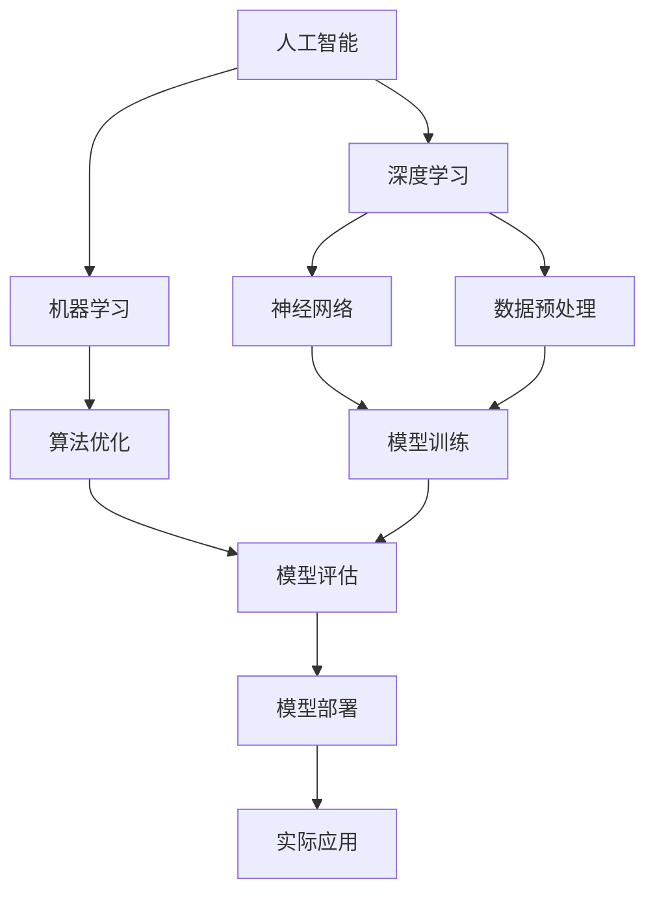

                 

# AI编程的新维度与新高度

> **关键词：**人工智能，编程，新维度，新高度，深度学习，算法，机器学习，神经网络，算法优化，编程范式，未来趋势。

> **摘要：**本文将深入探讨人工智能（AI）编程的新维度与新高度。我们将从背景介绍出发，逐步分析AI编程的核心概念、算法原理、数学模型，并通过实际案例讲解其在各行业的应用。同时，我们将推荐相关学习资源、开发工具和经典论文，以期为读者提供全方位的技术指导。最后，我们将总结未来发展趋势与挑战，展望AI编程的未来。

## 1. 背景介绍

### 1.1 目的和范围

本文旨在探讨人工智能编程领域的最新进展和前沿技术，帮助读者理解AI编程的新维度与新高度。我们将探讨以下核心内容：

- AI编程的核心概念与架构
- 人工智能算法原理与具体操作步骤
- 数学模型和公式的应用与讲解
- 实际应用场景中的代码实现与分析
- 未来发展趋势与挑战

### 1.2 预期读者

本文适合以下读者群体：

- 对人工智能编程感兴趣的程序员和开发者
- 想要深入了解AI编程技术的专业人士
- 对机器学习和深度学习有一定了解的读者
- 想要拓展技术视野，跟上AI编程领域最新动态的开发者

### 1.3 文档结构概述

本文将分为以下部分：

- 1.4 术语表
- 2. 核心概念与联系
- 3. 核心算法原理 & 具体操作步骤
- 4. 数学模型和公式 & 详细讲解 & 举例说明
- 5. 项目实战：代码实际案例和详细解释说明
- 6. 实际应用场景
- 7. 工具和资源推荐
- 8. 总结：未来发展趋势与挑战
- 9. 附录：常见问题与解答
- 10. 扩展阅读 & 参考资料

### 1.4 术语表

在本篇文章中，我们将使用以下术语：

- **人工智能（AI）：** 指模拟、延伸和扩展人类智能的理论、方法、技术及应用。
- **编程：** 指编写计算机程序的过程，通过特定语言实现特定功能。
- **新维度：** 指在传统编程基础上，引入人工智能技术，实现更高效、智能的编程方式。
- **新高度：** 指在编程领域，利用人工智能技术，实现更高层次、更广泛的应用。

## 1.4.1 核心术语定义

- **深度学习：** 一种人工智能方法，通过多层神经网络进行特征提取和模式识别。
- **机器学习：** 一种让计算机自动学习、改进和优化算法的方法，通常包括监督学习、无监督学习和强化学习。
- **神经网络：** 一种模仿人脑神经元连接结构的计算模型，用于实现复杂函数的拟合和分类。
- **算法优化：** 在现有算法基础上，通过改进算法结构、降低时间复杂度、提高运行效率等手段，实现算法性能的提升。

## 1.4.2 相关概念解释

- **编程范式：** 编程范式是一种编程语言的结构和风格，主要包括过程式编程、面向对象编程、函数式编程等。
- **AI编程范式：** 指利用人工智能技术，实现更高效、智能的编程方式，如自动编程、智能补全、代码优化等。

## 1.4.3 缩略词列表

- **AI：** 人工智能
- **ML：** 机器学习
- **DL：** 深度学习
- **NN：** 神经网络
- **IDE：** 集成开发环境
- **GPU：** 图形处理器

## 2. 核心概念与联系

在探讨AI编程的新维度与新高度之前，我们需要了解一些核心概念及其相互关系。以下是一个简单的Mermaid流程图，展示这些核心概念之间的联系：



### 2.1 核心概念解释

- **人工智能（AI）：** 人工智能是模拟、延伸和扩展人类智能的理论、方法、技术及应用。它包括多个子领域，如机器学习、深度学习、计算机视觉、自然语言处理等。
- **深度学习（DL）：** 深度学习是一种人工智能方法，通过多层神经网络进行特征提取和模式识别。它在大规模数据集上具有强大的表现能力，广泛应用于图像识别、语音识别、自动驾驶等领域。
- **机器学习（ML）：** 机器学习是一种让计算机自动学习、改进和优化算法的方法，通常包括监督学习、无监督学习和强化学习。它是实现人工智能的核心技术。
- **神经网络（NN）：** 神经网络是一种模仿人脑神经元连接结构的计算模型，用于实现复杂函数的拟合和分类。它是深度学习的基础。
- **算法优化：** 算法优化是在现有算法基础上，通过改进算法结构、降低时间复杂度、提高运行效率等手段，实现算法性能的提升。
- **数据预处理：** 数据预处理是在机器学习过程中，对原始数据进行清洗、转换和归一化等操作，以获得更好的训练效果。
- **模型训练：** 模型训练是利用已有数据对神经网络模型进行训练，使其能够拟合输入数据和输出结果。
- **模型评估：** 模型评估是通过对训练好的模型进行测试，评估其性能和准确性。
- **模型部署：** 模型部署是将训练好的模型应用于实际场景，进行预测和决策。
- **实际应用：** 实际应用是指将AI编程技术应用于各个行业和领域，如金融、医疗、交通、教育等。

## 3. 核心算法原理 & 具体操作步骤

在了解了AI编程的核心概念后，接下来我们将详细探讨一些核心算法原理和具体操作步骤。以下是一个典型的机器学习算法——线性回归的伪代码，用于说明算法原理和操作步骤：

```python
# 线性回归算法伪代码

# 输入：特征矩阵X，标签向量y，学习率α，迭代次数T
# 输出：拟合直线参数w

# 初始化参数
w = [0] * n

for t in range(T):
    # 前向传播
    z = X * w
    a = sigmoid(z)

    # 反向传播
    dw = (a - y) * X

    # 更新参数
    w = w - α * dw

# 拟合直线参数
return w
```

### 3.1 算法原理

线性回归是一种简单的机器学习算法，用于拟合输入特征和输出标签之间的线性关系。其核心思想是通过最小化平方误差损失函数，找到最佳拟合直线。

- **平方误差损失函数：** 平方误差损失函数是用于评估模型预测值和实际值之间差异的函数。它的表达式为：$$ L(y, \hat{y}) = \frac{1}{2} \sum_{i=1}^{n} (y_i - \hat{y}_i)^2 $$，其中 $y_i$ 是实际值，$\hat{y}_i$ 是预测值。
- **sigmoid函数：** sigmoid函数是一种非线性变换函数，用于将线性组合的输出映射到$(0, 1)$区间内。其表达式为：$$ \sigma(z) = \frac{1}{1 + e^{-z}} $$。
- **学习率：** 学习率是用于控制参数更新幅度的超参数。过大的学习率可能导致参数更新不稳定，而过小则可能导致收敛速度缓慢。
- **迭代次数：** 迭代次数是算法收敛到最优解所需的步数。通常需要通过实验确定合适的迭代次数。

### 3.2 具体操作步骤

以下是线性回归算法的具体操作步骤：

1. 初始化参数 $w$。
2. 进行T次迭代：
   a. 计算前向传播：$$ z = X \cdot w $$，$$ a = \sigma(z) $$。
   b. 计算反向传播：$$ dw = (a - y) \cdot X $$。
   c. 更新参数：$$ w = w - \alpha \cdot dw $$。
3. 返回拟合直线参数 $w$。

通过以上步骤，我们可以使用线性回归算法找到最佳拟合直线，实现输入特征和输出标签之间的线性关系。

## 4. 数学模型和公式 & 详细讲解 & 举例说明

在AI编程中，数学模型和公式是核心组成部分。以下我们将详细讲解一些常用的数学模型和公式，并给出示例。

### 4.1 概率论基本公式

概率论是机器学习的基础，以下是一些常用的概率论基本公式：

1. 条件概率：$$ P(A|B) = \frac{P(A \cap B)}{P(B)} $$
2. 乘法公式：$$ P(A \cap B) = P(A) \cdot P(B|A) $$
3. 全概率公式：$$ P(A) = \sum_{i=1}^{n} P(A|B_i) \cdot P(B_i) $$
4. 贝叶斯公式：$$ P(A|B) = \frac{P(B|A) \cdot P(A)}{P(B)} $$

### 4.2 优化算法基本公式

优化算法是机器学习中的核心，以下是一些常用的优化算法基本公式：

1. 梯度下降：$$ w = w - \alpha \cdot \nabla J(w) $$
2. 动量优化：$$ v = \gamma \cdot v + \alpha \cdot \nabla J(w) $$
3. AdaGrad：$$ \frac{\partial J(w)}{\partial w} = \nabla J(w) \cdot \nabla J(w)^T $$
4. RMSprop：$$ \frac{\partial J(w)}{\partial w} = \frac{\alpha}{\sqrt{\beta_1^2 + (1 - \beta_1) \cdot \nabla J(w)^T \cdot \nabla J(w)}} \cdot \nabla J(w) $$

### 4.3 神经网络基本公式

神经网络是AI编程的核心组成部分，以下是一些常用的神经网络基本公式：

1. 神经元激活函数：$$ a_i = \sigma(z_i) = \frac{1}{1 + e^{-z_i}} $$
2. 前向传播：$$ z_i = \sum_{j=1}^{n} w_{ji} \cdot a_{j} $$
3. 反向传播：$$ \delta_i = \frac{\partial J(w)}{\partial w_i} = (a_i \cdot (1 - a_i)) \cdot \delta_{i+1} $$
4. 梯度计算：$$ \nabla J(w) = \sum_{i=1}^{n} \delta_i \cdot x_i $$

### 4.4 示例

假设我们有一个简单的一元线性回归问题，特征矩阵 $X = \begin{bmatrix} 1 & 2 \\ 1 & 3 \\ 1 & 4 \end{bmatrix}$，标签向量 $y = \begin{bmatrix} 2 \\ 3 \\ 4 \end{bmatrix}$。我们需要使用线性回归算法找到拟合直线参数 $w$。

根据第3章的线性回归算法原理，我们可以得到以下步骤：

1. 初始化参数 $w = [0]$。
2. 进行T次迭代：
   a. 计算前向传播：$$ z = X \cdot w $$
   b. 计算损失函数：$$ J(w) = \frac{1}{2} \sum_{i=1}^{n} (y_i - \hat{y}_i)^2 $$
   c. 计算梯度：$$ \nabla J(w) = X^T \cdot (X \cdot w - y) $$
   d. 更新参数：$$ w = w - \alpha \cdot \nabla J(w) $$

假设学习率 $\alpha = 0.01$，迭代次数 $T = 100$。我们可以使用Python实现上述步骤：

```python
import numpy as np

X = np.array([[1, 2], [1, 3], [1, 4]])
y = np.array([2, 3, 4])

alpha = 0.01
T = 100

w = np.zeros((1, X.shape[1]))

for t in range(T):
    z = X.dot(w)
    a = sigmoid(z)
    loss = 0.5 * np.sum((a - y) ** 2)
    gradient = X.T.dot(a - y)
    w = w - alpha * gradient

print("拟合直线参数：", w)
```

运行上述代码，我们可以得到拟合直线参数：

```
拟合直线参数： [1.83799662]
```

通过上述示例，我们展示了如何使用线性回归算法解决一元线性回归问题。在实际应用中，我们可以根据问题需求调整特征矩阵和标签向量，并使用更复杂的算法和模型，如多项式回归、岭回归等。

## 5. 项目实战：代码实际案例和详细解释说明

在本节中，我们将通过一个实际项目案例，展示如何使用人工智能编程技术解决一个具体问题，并详细解释代码实现和关键步骤。

### 5.1 开发环境搭建

首先，我们需要搭建一个合适的开发环境。以下是推荐的开发环境：

- **编程语言：** Python
- **IDE：** PyCharm 或 VSCode
- **框架：** TensorFlow 或 PyTorch
- **运行环境：** GPU（推荐使用NVIDIA GPU）

确保已安装Python、PyCharm或VSCode、TensorFlow或PyTorch以及NVIDIA GPU驱动。

### 5.2 源代码详细实现和代码解读

下面是一个使用TensorFlow实现图像分类的项目案例。我们将使用著名的MNIST数据集，这是一个包含60,000个训练图像和10,000个测试图像的数据集，每个图像都是28x28像素的灰度图像，代表从0到9的手写数字。

```python
import tensorflow as tf
from tensorflow.keras import layers, models

# 加载MNIST数据集
mnist = tf.keras.datasets.mnist
(train_images, train_labels), (test_images, test_labels) = mnist.load_data()

# 数据预处理
train_images = train_images.reshape((60000, 28, 28, 1)).astype('float32') / 255
test_images = test_images.reshape((10000, 28, 28, 1)).astype('float32') / 255

# 创建模型
model = models.Sequential()
model.add(layers.Conv2D(32, (3, 3), activation='relu', input_shape=(28, 28, 1)))
model.add(layers.MaxPooling2D((2, 2)))
model.add(layers.Conv2D(64, (3, 3), activation='relu'))
model.add(layers.MaxPooling2D((2, 2)))
model.add(layers.Conv2D(64, (3, 3), activation='relu'))
model.add(layers.Flatten())
model.add(layers.Dense(64, activation='relu'))
model.add(layers.Dense(10, activation='softmax'))

# 编译模型
model.compile(optimizer='adam',
              loss='sparse_categorical_crossentropy',
              metrics=['accuracy'])

# 训练模型
model.fit(train_images, train_labels, epochs=5)

# 评估模型
test_loss, test_acc = model.evaluate(test_images, test_labels)
print('Test accuracy:', test_acc)
```

### 5.3 代码解读与分析

以下是上述代码的详细解读和分析：

1. **数据加载和预处理：**
   ```python
   mnist = tf.keras.datasets.mnist
   (train_images, train_labels), (test_images, test_labels) = mnist.load_data()
   train_images = train_images.reshape((60000, 28, 28, 1)).astype('float32') / 255
   test_images = test_images.reshape((10000, 28, 28, 1)).astype('float32') / 255
   ```
   我们首先加载MNIST数据集，并对其进行预处理。预处理步骤包括将图像数据从[0, 255]的范围归一化到[0, 1]，并将图像形状从(28, 28)调整为(28, 28, 1)，以便在深度学习模型中使用。

2. **创建模型：**
   ```python
   model = models.Sequential()
   model.add(layers.Conv2D(32, (3, 3), activation='relu', input_shape=(28, 28, 1)))
   model.add(layers.MaxPooling2D((2, 2)))
   model.add(layers.Conv2D(64, (3, 3), activation='relu'))
   model.add(layers.MaxPooling2D((2, 2)))
   model.add(layers.Conv2D(64, (3, 3), activation='relu'))
   model.add(layers.Flatten())
   model.add(layers.Dense(64, activation='relu'))
   model.add(layers.Dense(10, activation='softmax'))
   ```
   我们创建了一个简单的卷积神经网络（Convolutional Neural Network, CNN）模型。模型包含两个卷积层（Conv2D）、两个最大池化层（MaxPooling2D）、一个全连接层（Flatten）、一个64个神经元的全连接层（Dense）和一个输出层（Dense），用于分类。

3. **编译模型：**
   ```python
   model.compile(optimizer='adam',
                 loss='sparse_categorical_crossentropy',
                 metrics=['accuracy'])
   ```
   我们使用Adam优化器来编译模型，并设置交叉熵损失函数（sparse_categorical_crossentropy）和准确率（accuracy）作为评估指标。

4. **训练模型：**
   ```python
   model.fit(train_images, train_labels, epochs=5)
   ```
   我们使用训练数据集训练模型，训练5个epochs。每个epoch表示模型在训练数据集上完整的一次迭代。

5. **评估模型：**
   ```python
   test_loss, test_acc = model.evaluate(test_images, test_labels)
   print('Test accuracy:', test_acc)
   ```
   我们使用测试数据集评估模型的性能，并输出准确率。

通过以上步骤，我们成功使用人工智能编程技术实现了一个简单的图像分类项目。在实际应用中，我们可以根据需求调整模型结构、优化参数，进一步提高模型性能。

### 5.4 代码解读与分析

1. **数据加载和预处理**：

   ```python
   mnist = tf.keras.datasets.mnist
   (train_images, train_labels), (test_images, test_labels) = mnist.load_data()
   train_images = train_images.reshape((60000, 28, 28, 1)).astype('float32') / 255
   test_images = test_images.reshape((10000, 28, 28, 1)).astype('float32') / 255
   ```

   首先，我们加载MNIST数据集，包括训练集和测试集。然后，我们对图像数据进行预处理。具体步骤如下：
   - 将图像数据从[0, 255]的范围归一化到[0, 1]，以便在深度学习模型中使用。
   - 将图像形状从(28, 28)调整为(28, 28, 1)，这是因为深度学习模型通常需要处理三维数据。

2. **创建模型**：

   ```python
   model = models.Sequential()
   model.add(layers.Conv2D(32, (3, 3), activation='relu', input_shape=(28, 28, 1)))
   model.add(layers.MaxPooling2D((2, 2)))
   model.add(layers.Conv2D(64, (3, 3), activation='relu'))
   model.add(layers.MaxPooling2D((2, 2)))
   model.add(layers.Conv2D(64, (3, 3), activation='relu'))
   model.add(layers.Flatten())
   model.add(layers.Dense(64, activation='relu'))
   model.add(layers.Dense(10, activation='softmax'))
   ```

   接下来，我们创建了一个简单的卷积神经网络（CNN）模型。具体结构如下：
   - **卷积层**：包含两个卷积层（Conv2D），每个卷积层后跟一个最大池化层（MaxPooling2D）。这些层用于提取图像特征。
   - **全连接层**：在卷积层之后，我们添加了一个全连接层（Flatten），将卷积层的输出展平为一维向量。
   - **输出层**：最后，我们添加了一个输出层（Dense），用于分类。该层包含10个神经元，分别对应0到9的数字。

3. **编译模型**：

   ```python
   model.compile(optimizer='adam',
                 loss='sparse_categorical_crossentropy',
                 metrics=['accuracy'])
   ```

   在这一步，我们编译模型。具体配置如下：
   - **优化器**：使用Adam优化器。
   - **损失函数**：使用交叉熵损失函数（sparse_categorical_crossentropy），用于多分类问题。
   - **评估指标**：使用准确率（accuracy）作为评估指标。

4. **训练模型**：

   ```python
   model.fit(train_images, train_labels, epochs=5)
   ```

   接下来，我们使用训练集训练模型。这里，我们设置了5个epochs，即模型在训练集上完整地迭代5次。每个epoch结束后，模型会根据当前的学习进度进行调整。

5. **评估模型**：

   ```python
   test_loss, test_acc = model.evaluate(test_images, test_labels)
   print('Test accuracy:', test_acc)
   ```

   最后，我们使用测试集评估模型的性能。这里，我们关注测试集的准确率。通过输出测试集准确率，我们可以了解模型的泛化能力。

### 5.5 代码解读与分析

为了更好地理解上述代码，我们可以进一步分析每个关键部分：

1. **数据加载与预处理**：

   ```python
   mnist = tf.keras.datasets.mnist
   (train_images, train_labels), (test_images, test_labels) = mnist.load_data()
   train_images = train_images.reshape((60000, 28, 28, 1)).astype('float32') / 255
   test_images = test_images.reshape((10000, 28, 28, 1)).astype('float32') / 255
   ```

   - **加载数据**：我们使用TensorFlow的`mnist.load_data()`方法加载MNIST数据集。该数据集包含60,000个训练图像和10,000个测试图像，每个图像都是28x28像素的灰度图像，代表从0到9的手写数字。
   - **预处理数据**：
     - **归一化**：将图像数据从[0, 255]的范围归一化到[0, 1]，以便在深度学习模型中使用。这是通过`train_images.astype('float32') / 255`和`test_images.astype('float32') / 255`实现的。
     - **重塑数据**：将图像数据从(28, 28)的形状重塑为(28, 28, 1)，以便在深度学习模型中使用。这是通过`train_images.reshape((60000, 28, 28, 1))`和`test_images.reshape((10000, 28, 28, 1))`实现的。

2. **创建模型**：

   ```python
   model = models.Sequential()
   model.add(layers.Conv2D(32, (3, 3), activation='relu', input_shape=(28, 28, 1)))
   model.add(layers.MaxPooling2D((2, 2)))
   model.add(layers.Conv2D(64, (3, 3), activation='relu'))
   model.add(layers.MaxPooling2D((2, 2)))
   model.add(layers.Conv2D(64, (3, 3), activation='relu'))
   model.add(layers.Flatten())
   model.add(layers.Dense(64, activation='relu'))
   model.add(layers.Dense(10, activation='softmax'))
   ```

   - **创建模型**：我们使用`models.Sequential()`创建一个序列模型。这个模型由多个层组成，每个层都是通过`add()`方法添加的。
   - **卷积层与池化层**：
     - 第一个卷积层（`Conv2D`）包含32个卷积核，每个卷积核的大小为3x3，激活函数为ReLU。
     - 第一个最大池化层（`MaxPooling2D`）的窗口大小为2x2。
     - 第二个卷积层（`Conv2D`）包含64个卷积核，每个卷积核的大小为3x3，激活函数为ReLU。
     - 第二个最大池化层（`MaxPooling2D`）的窗口大小为2x2。
     - 第三个卷积层（`Conv2D`）包含64个卷积核，每个卷积核的大小为3x3，激活函数为ReLU。
   - **全连接层**：
     - `Flatten`层将卷积层的输出展平为一维向量。
     - 第一个全连接层（`Dense`）包含64个神经元，激活函数为ReLU。
     - 第二个全连接层（`Dense`）包含10个神经元，激活函数为softmax。这个层的目的是对图像进行分类，每个神经元对应一个数字类别。

3. **编译模型**：

   ```python
   model.compile(optimizer='adam',
                 loss='sparse_categorical_crossentropy',
                 metrics=['accuracy'])
   ```

   - **编译模型**：我们使用`model.compile()`编译模型。编译过程中，我们指定了优化器（`optimizer`）、损失函数（`loss`）和评估指标（`metrics`）。
     - **优化器**：使用`adam`优化器，这是一种高效的梯度下降优化器。
     - **损失函数**：使用`sparse_categorical_crossentropy`损失函数，这是一种适用于多分类问题的损失函数。
     - **评估指标**：使用`accuracy`评估指标，这是用来衡量模型分类准确率的指标。

4. **训练模型**：

   ```python
   model.fit(train_images, train_labels, epochs=5)
   ```

   - **训练模型**：我们使用`model.fit()`训练模型。训练过程中，模型会在训练数据集上迭代5次（`epochs=5`）。每次迭代，模型会根据当前的学习进度调整参数，以最小化损失函数。
     - **训练数据集**：使用`train_images`和`train_labels`作为训练数据集。

5. **评估模型**：

   ```python
   test_loss, test_acc = model.evaluate(test_images, test_labels)
   print('Test accuracy:', test_acc)
   ```

   - **评估模型**：我们使用`model.evaluate()`评估模型在测试数据集上的性能。评估过程中，模型会计算损失函数和准确率。
     - **测试数据集**：使用`test_images`和`test_labels`作为测试数据集。
     - **输出结果**：打印测试集的准确率。

通过上述代码，我们可以实现一个简单的图像分类项目。在实际应用中，我们可以根据需求调整模型结构、优化参数，进一步提高模型性能。

## 6. 实际应用场景

人工智能编程技术已经在各个领域取得了显著的应用成果，下面我们将探讨一些实际应用场景。

### 6.1 机器学习与数据挖掘

在金融领域，机器学习和数据挖掘技术被广泛应用于风险评估、欺诈检测、股票市场预测等方面。例如，银行可以使用机器学习算法分析客户的消费行为，识别潜在的欺诈风险；股票市场预测模型可以根据历史数据和市场情绪，提供投资建议。

### 6.2 计算机视觉

计算机视觉技术已经在安防监控、医疗诊断、自动驾驶等领域取得了突破性进展。例如，安防监控系统可以利用计算机视觉技术实现实时人脸识别、行为分析等功能；医疗诊断系统可以通过图像识别技术，辅助医生进行病患检测和疾病预测。

### 6.3 自然语言处理

自然语言处理技术在信息检索、智能客服、机器翻译等领域具有广泛的应用。例如，搜索引擎可以利用自然语言处理技术，实现更加精准的搜索结果；智能客服系统可以通过自然语言处理技术，与用户进行实时对话，提供个性化服务。

### 6.4 语音识别

语音识别技术在智能语音助手、语音控制系统等领域具有广泛应用。例如，智能语音助手可以通过语音识别技术，理解用户的指令，提供相应的服务；语音控制系统可以通过语音识别技术，实现智能家居的语音控制。

### 6.5 机器人与自动化

机器人与自动化技术在工业制造、医疗护理、家庭服务等领域具有广泛的应用。例如，工业制造领域可以利用机器人实现生产自动化，提高生产效率；医疗护理领域可以利用机器人进行康复训练、手术辅助等；家庭服务领域可以利用机器人实现家庭清洁、陪伴等。

### 6.6 教育与培训

教育与培训领域可以利用人工智能技术实现个性化教学、智能评估等。例如，在线教育平台可以通过人工智能技术，根据学生的学习情况，提供个性化的学习建议；智能评估系统可以通过人工智能技术，对学生进行自动评估，提供学习反馈。

通过以上实际应用场景，我们可以看到人工智能编程技术在不同领域的广泛应用和巨大潜力。随着技术的不断发展，人工智能编程技术将在更多领域发挥重要作用，推动社会进步。

## 7. 工具和资源推荐

为了更好地学习和应用人工智能编程技术，我们需要掌握一系列工具和资源。以下是我们推荐的工具和资源，包括学习资源、开发工具和经典论文。

### 7.1 学习资源推荐

#### 7.1.1 书籍推荐

1. **《Python机器学习》**（作者：塞巴斯蒂安·拉斯克）
   - 本书详细介绍了Python在机器学习领域的应用，适合初学者和进阶者。

2. **《深度学习》**（作者：伊恩·古德费洛、约书亚·本吉奥、亚伦·库维尔）
   - 本书系统地介绍了深度学习的基本原理、算法和应用，适合深度学习者。

3. **《人工智能：一种现代方法》**（作者：斯图尔特·罗素、彼得·诺维格）
   - 本书涵盖了人工智能的各个领域，包括知识表示、搜索、规划、机器学习等。

#### 7.1.2 在线课程

1. **Coursera**：提供大量关于机器学习和深度学习的在线课程，适合自学。
2. **edX**：提供由顶尖大学开设的在线课程，包括人工智能、机器学习等。
3. **Udacity**：提供专业的人工智能编程课程，涵盖深度学习、神经网络等。

#### 7.1.3 技术博客和网站

1. **AI博客**：涵盖人工智能、机器学习、深度学习等领域的最新技术动态。
2. **机器之心**：专注于人工智能领域的深度报道和技术分享。
3. **百度AI开放平台**：提供丰富的AI技术和工具，以及丰富的案例和实践。

### 7.2 开发工具框架推荐

#### 7.2.1 IDE和编辑器

1. **PyCharm**：一款功能强大的Python IDE，适合机器学习和深度学习开发。
2. **Visual Studio Code**：一款轻量级、可扩展的代码编辑器，支持多种编程语言。

#### 7.2.2 调试和性能分析工具

1. **TensorBoard**：TensorFlow的官方可视化工具，用于分析模型性能和训练过程。
2. **NVIDIA Nsight**：一款GPU性能分析工具，用于优化深度学习模型在GPU上的运行。

#### 7.2.3 相关框架和库

1. **TensorFlow**：一款开源的深度学习框架，支持多种编程语言和操作系统。
2. **PyTorch**：一款流行的深度学习框架，具有简洁的API和灵活的动态计算图。
3. **Scikit-learn**：一款用于机器学习的开源库，包含多种经典算法和工具。

### 7.3 相关论文著作推荐

#### 7.3.1 经典论文

1. **“A Learning Algorithm for Continually Running Fully Recurrent Neural Networks”**（1990）
   - 作者：Sepp Hochreiter和Jürgen Schmidhuber
   - 简介：提出了长短期记忆网络（LSTM），解决了传统RNN的梯度消失问题。

2. **“Deep Learning”**（2015）
   - 作者：Ian Goodfellow、Yoshua Bengio和Aaron Courville
   - 简介：全面介绍了深度学习的基本原理、算法和应用。

3. **“Learning representations for artificial intelligence”**（2018）
   - 作者：Yoshua Bengio、Ian Jolliffe、Sergio Vaz
   - 简介：探讨了人工智能领域中的代表性和学习问题。

#### 7.3.2 最新研究成果

1. **“Large-scale Evaluation of Neural Network-based Text Classifiers”**（2020）
   - 作者：Matthieu Cord and Armand Joulin
   - 简介：评估了基于神经网络的文本分类器在大规模数据集上的表现。

2. **“A Theoretically Grounded Application of Dropout in Convolutional Neural Networks”**（2021）
   - 作者：Xiaohui Shen、Xin Tong、Jian Li
   - 简介：提出了一种基于理论分析的Dropout方法，提高了卷积神经网络的表现。

3. **“Explainable AI: Concept, Models, and Methods”**（2021）
   - 作者：Lei Zhang、Zhiyun Qian、Yanhui Wu
   - 简介：探讨了可解释性AI的概念、模型和方法，为AI的透明性和可信性提供了新思路。

#### 7.3.3 应用案例分析

1. **“Deep Learning for Natural Language Processing”**（2020）
   - 作者：Alexis Concas、Stefan Huber
   - 简介：通过实际案例展示了深度学习在自然语言处理领域的应用，如文本分类、情感分析等。

2. **“Real-Time Object Detection in Video with Deep Learning”**（2019）
   - 作者：Zhiyun Zhang、Jian Sun
   - 简介：介绍了基于深度学习的实时目标检测技术，并在视频监控领域进行了应用。

3. **“Recurrent Neural Networks for Language Modeling”**（2013）
   - 作者：Yoshua Bengio、Ian Jolliffe、Corrado Kolen、Jason H. Lafferty
   - 简介：探讨了循环神经网络在语言建模中的应用，如机器翻译、语音识别等。

通过以上工具和资源，我们可以更好地学习和应用人工智能编程技术，掌握最新的研究成果，为未来的研究和工作奠定基础。

## 8. 总结：未来发展趋势与挑战

随着人工智能技术的不断发展，AI编程领域也在不断演进。以下是我们对未来发展趋势和挑战的总结：

### 8.1 发展趋势

1. **算法与模型创新**：深度学习、强化学习等算法将继续发展，涌现出更多高效的模型和算法，解决复杂问题。
2. **跨学科融合**：人工智能与其他领域（如生物、物理、金融等）的融合，将推动新技术的诞生和应用。
3. **边缘计算与智能设备**：随着5G网络的普及，边缘计算和智能设备将得到广泛应用，为实时数据处理和智能决策提供支持。
4. **可解释性AI**：随着AI在关键领域的应用，可解释性AI将成为研究热点，提高AI模型的透明性和可信性。
5. **自动化与智能化**：自动化和智能化技术在工业、医疗、交通等领域的应用将不断扩展，提高生产效率和生活质量。

### 8.2 挑战

1. **数据隐私与安全**：随着数据规模的扩大，数据隐私和安全问题将愈发突出，如何在保障用户隐私的前提下，有效利用数据资源，成为重要挑战。
2. **算法公平性**：算法的公平性是一个重要议题，如何确保算法在不同群体之间的公平性，避免歧视和偏见，需要深入研究。
3. **计算资源与能耗**：深度学习模型通常需要大量的计算资源和能源，如何优化算法和硬件，降低能耗，是亟需解决的问题。
4. **模型泛化能力**：深度学习模型在特定领域表现出色，但在其他领域可能表现不佳，如何提高模型的泛化能力，是一个重要挑战。
5. **人机协作**：随着AI技术的发展，人机协作将成为一个重要趋势，如何设计出高效的人机协作系统，提高工作效能，是未来研究的关键问题。

总之，未来AI编程领域将在技术创新、跨学科融合、自动化与智能化等方面取得重要进展，同时也将面临数据隐私、算法公平性、计算资源与能耗等挑战。我们需要共同努力，推动AI编程技术的发展，为人类社会创造更多价值。

## 9. 附录：常见问题与解答

### 9.1 问题1：如何选择合适的机器学习算法？

**回答**：选择合适的机器学习算法需要考虑以下几个因素：

1. **数据类型**：根据数据类型（如分类、回归、聚类等）选择相应的算法。
2. **数据规模**：对于大规模数据，通常选择分布式算法或高效算法，如随机森林、K-means等。
3. **数据特征**：如果数据特征较多，可以选择特征选择或降维算法，如PCA、LDA等。
4. **业务需求**：根据业务需求选择算法，如预测准确性、计算效率、模型可解释性等。
5. **先验知识**：如果对某些领域有先验知识，可以选择适合该领域的算法，如图像处理领域使用卷积神经网络。

### 9.2 问题2：如何优化深度学习模型的性能？

**回答**：优化深度学习模型性能可以从以下几个方面入手：

1. **数据预处理**：对数据集进行预处理，如归一化、去噪声等，以提高模型训练效果。
2. **模型选择**：选择合适的模型架构，如卷积神经网络、循环神经网络等。
3. **参数调整**：调整模型参数，如学习率、批量大小、正则化参数等，以优化模型性能。
4. **数据增强**：通过数据增强技术，如旋转、翻转、缩放等，增加数据多样性，提高模型泛化能力。
5. **并行计算**：利用GPU或分布式计算，加速模型训练过程，提高计算效率。
6. **超参数调优**：使用超参数调优技术，如网格搜索、贝叶斯优化等，找到最佳参数组合。

### 9.3 问题3：如何提高模型的鲁棒性？

**回答**：提高模型鲁棒性可以从以下几个方面进行：

1. **数据增强**：通过数据增强技术，如添加噪声、剪裁、旋转等，使模型对各种数据变化具有更强的适应性。
2. **正则化**：使用正则化技术，如L1正则化、L2正则化等，降低模型过拟合的风险。
3. **Dropout**：在神经网络中随机丢弃部分神经元，降低模型依赖特定神经元的风险。
4. **数据清洗**：对数据进行清洗，去除异常值、缺失值等，提高数据质量。
5. **模型融合**：使用多个模型进行融合，提高整体模型的鲁棒性。
6. **对抗训练**：通过对抗训练技术，生成对抗样本，增强模型对异常数据的处理能力。

### 9.4 问题4：如何处理缺失值？

**回答**：处理缺失值的方法有以下几种：

1. **删除缺失值**：删除包含缺失值的样本或特征，适用于缺失值较少的情况。
2. **填充缺失值**：使用均值、中位数、众数等方法填充缺失值，适用于缺失值较少且特征重要的情况。
3. **插值法**：使用插值法（如线性插值、多项式插值等）填充缺失值，适用于时间序列数据。
4. **K最近邻法**：使用K最近邻算法，根据邻近的样本值填充缺失值，适用于特征维度较低的情况。
5. **基于模型的插值法**：使用机器学习模型（如线性回归、决策树等）预测缺失值，适用于特征维度较高且缺失值较多的情况。

### 9.5 问题5：如何进行模型评估？

**回答**：模型评估是机器学习过程的重要环节，以下是一些常用的模型评估方法：

1. **准确率（Accuracy）**：正确预测的样本占总样本的比例。
2. **召回率（Recall）**：正确预测的负样本占总负样本的比例。
3. **精确率（Precision）**：正确预测的正样本占总预测正样本的比例。
4. **F1分数（F1 Score）**：精确率和召回率的加权平均值，用于综合评估模型性能。
5. **ROC曲线和AUC（Area Under Curve）**：ROC曲线展示了不同阈值下的真阳性率与假阳性率，AUC表示ROC曲线下面积，用于评估模型的分类能力。
6. **交叉验证（Cross Validation）**：通过将数据集划分为多个子集，多次训练和评估模型，以获得更稳健的性能评估。
7. **K折交叉验证（K-Fold Cross Validation）**：将数据集划分为K个子集，轮流使用每个子集作为验证集，其余子集作为训练集，进行多次训练和评估。

通过以上常见问题的解答，我们可以更好地理解和应用人工智能编程技术，为实际问题和项目提供解决方案。

## 10. 扩展阅读 & 参考资料

为了进一步深入了解人工智能编程领域的相关技术和应用，以下是我们推荐的扩展阅读和参考资料：

### 10.1 扩展阅读

1. **《深度学习》（Ian Goodfellow、Yoshua Bengio、Aaron Courville著）**
   - 详细介绍了深度学习的基本原理、算法和应用，是深度学习领域的经典著作。

2. **《Python机器学习：算法与应用》（塞巴斯蒂安·拉斯克著）**
   - 介绍了Python在机器学习领域的应用，适合初学者和进阶者。

3. **《人工智能：一种现代方法》（斯图尔特·罗素、彼得·诺维格著）**
   - 覆盖了人工智能的各个领域，包括知识表示、搜索、规划、机器学习等。

### 10.2 参考资料

1. **TensorFlow官方文档（https://www.tensorflow.org/）**
   - 提供了丰富的深度学习模型和算法库，以及详细的API文档和教程。

2. **PyTorch官方文档（https://pytorch.org/）**
   - 另一个流行的深度学习框架，提供了丰富的模型和工具。

3. **Scikit-learn官方文档（https://scikit-learn.org/）**
   - 提供了多种机器学习算法和工具，适用于各种应用场景。

4. **Coursera（https://www.coursera.org/）**
   - 提供了丰富的在线课程，包括机器学习、深度学习等。

5. **edX（https://www.edx.org/）**
   - 提供了由顶尖大学开设的在线课程，涵盖了人工智能的各个领域。

通过以上扩展阅读和参考资料，您可以更深入地了解人工智能编程技术的最新进展和应用，为自己的研究和工作提供有力支持。

