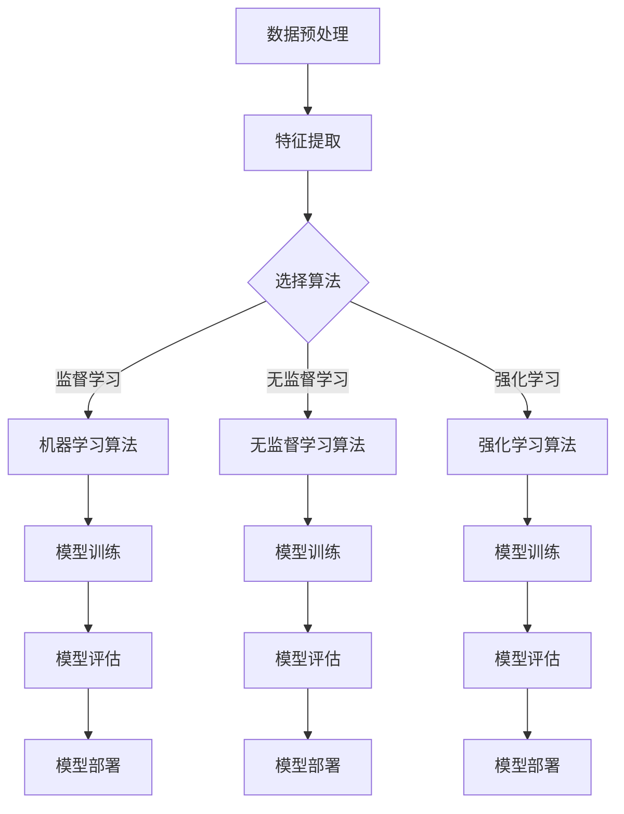

                 

# AI编程的新视角与新境界

> 关键词：人工智能，编程，新视角，新境界，算法原理，数学模型，实战案例，应用场景，资源推荐
>
> 摘要：本文旨在探讨人工智能（AI）编程的新视角和新境界，深入分析核心概念、算法原理和数学模型，通过实战案例和详细解释，为读者呈现一个全面、系统的AI编程框架。本文将涵盖从基础到高级的各个方面，帮助读者了解AI编程的最新趋势和发展方向。

## 1. 背景介绍

### 1.1 目的和范围

本文的目的是为那些对人工智能（AI）编程感兴趣的技术人员提供一个全面而深入的指南。本文将探讨AI编程的新视角和新境界，从基础概念到高级应用，逐步引导读者掌握AI编程的核心技术。

本文的范围包括：

- AI编程的基本概念和原理
- 关键算法和数学模型
- 实际应用场景和案例分析
- 相关工具和资源的推荐

通过本文的学习，读者将能够：

- 理解AI编程的基本原理和流程
- 掌握关键算法和数学模型的应用
- 建立自己的AI编程项目
- 了解AI编程的最新趋势和发展方向

### 1.2 预期读者

本文适合以下读者：

- 对人工智能和编程感兴趣的技术人员
- 想要深入了解AI编程的学者和研究人员
- 准备进入人工智能领域的学生和新手
- 想要在AI编程方面提升技能的专业人士

### 1.3 文档结构概述

本文的结构如下：

- 第1章：背景介绍
  - 1.1 目的和范围
  - 1.2 预期读者
  - 1.3 文档结构概述
  - 1.4 术语表

- 第2章：核心概念与联系
  - 2.1 核心概念介绍
  - 2.2 AI编程架构的Mermaid流程图

- 第3章：核心算法原理 & 具体操作步骤
  - 3.1 算法原理讲解
  - 3.2 伪代码实现

- 第4章：数学模型和公式 & 详细讲解 & 举例说明
  - 4.1 数学模型介绍
  - 4.2 公式详细讲解
  - 4.3 举例说明

- 第5章：项目实战：代码实际案例和详细解释说明
  - 5.1 开发环境搭建
  - 5.2 源代码详细实现
  - 5.3 代码解读与分析

- 第6章：实际应用场景
  - 6.1 AI在各个领域的应用
  - 6.2 案例分析

- 第7章：工具和资源推荐
  - 7.1 学习资源推荐
  - 7.2 开发工具框架推荐
  - 7.3 相关论文著作推荐

- 第8章：总结：未来发展趋势与挑战
  - 8.1 发展趋势
  - 8.2 挑战与对策

- 第9章：附录：常见问题与解答
  - 9.1 问题1
  - 9.2 问题2
  - 9.3 问题3

- 第10章：扩展阅读 & 参考资料
  - 10.1 相关书籍
  - 10.2 在线课程
  - 10.3 技术博客和网站

### 1.4 术语表

在本文中，我们将使用以下术语：

- AI：人工智能（Artificial Intelligence）
- ML：机器学习（Machine Learning）
- DL：深度学习（Deep Learning）
- CNN：卷积神经网络（Convolutional Neural Network）
- RNN：循环神经网络（Recurrent Neural Network）
- GAN：生成对抗网络（Generative Adversarial Network）
- API：应用程序编程接口（Application Programming Interface）
- IDE：集成开发环境（Integrated Development Environment）
- SDK：软件开发工具包（Software Development Kit）

#### 1.4.1 核心术语定义

- **人工智能（AI）**：人工智能是指使计算机系统能够模拟人类智能行为的技术和方法。它包括机器学习、自然语言处理、计算机视觉等多个领域。
- **机器学习（ML）**：机器学习是一种人工智能技术，它通过训练模型来从数据中学习，并能够进行预测和决策。
- **深度学习（DL）**：深度学习是机器学习的一个分支，它使用多层神经网络来模拟人脑的学习过程，以处理复杂的任务，如图像识别和自然语言处理。
- **卷积神经网络（CNN）**：卷积神经网络是一种用于图像识别和处理的神经网络，它通过卷积操作来提取图像的特征。
- **循环神经网络（RNN）**：循环神经网络是一种用于处理序列数据的神经网络，它通过记忆机制来捕捉序列中的依赖关系。
- **生成对抗网络（GAN）**：生成对抗网络是一种用于生成新数据的神经网络，它由一个生成器和判别器组成，通过竞争训练来生成逼真的数据。

#### 1.4.2 相关概念解释

- **神经网络**：神经网络是一种模拟人脑结构和功能的计算模型，它通过神经元之间的连接和激活函数来处理信息。
- **训练**：训练是指使用数据来调整神经网络模型的参数，使其能够做出准确的预测和决策。
- **验证**：验证是指使用未训练的数据来评估模型的性能和泛化能力。
- **测试**：测试是指使用独立的数据集来评估模型的最终性能和稳定性。

#### 1.4.3 缩略词列表

- **AI**：人工智能（Artificial Intelligence）
- **ML**：机器学习（Machine Learning）
- **DL**：深度学习（Deep Learning）
- **CNN**：卷积神经网络（Convolutional Neural Network）
- **RNN**：循环神经网络（Recurrent Neural Network）
- **GAN**：生成对抗网络（Generative Adversarial Network）
- **API**：应用程序编程接口（Application Programming Interface）
- **IDE**：集成开发环境（Integrated Development Environment）
- **SDK**：软件开发工具包（Software Development Kit）

## 2. 核心概念与联系

在AI编程中，核心概念和联系是理解和实现AI算法的关键。本节将介绍这些核心概念，并使用Mermaid流程图来展示它们之间的联系。

### 2.1 核心概念介绍

以下是AI编程中的核心概念：

- **数据预处理**：数据预处理是AI编程的第一步，它包括数据清洗、数据转换和数据归一化等过程，以确保数据的质量和一致性。
- **特征提取**：特征提取是从原始数据中提取有用的信息，以供模型训练和预测使用。
- **机器学习算法**：机器学习算法是AI编程的核心，它包括监督学习、无监督学习和强化学习等。
- **神经网络**：神经网络是一种模拟人脑的计算模型，它通过多层神经元和激活函数来处理数据。
- **深度学习模型**：深度学习模型是神经网络的一种扩展，它使用多层神经网络来处理复杂的任务。
- **模型评估**：模型评估是评估模型性能和泛化能力的过程，常用的评估指标包括准确率、召回率和F1分数等。
- **部署**：部署是将训练好的模型部署到生产环境中，以便在实际应用中使用。

### 2.2 AI编程架构的Mermaid流程图

以下是一个简化的AI编程架构的Mermaid流程图，展示了核心概念之间的联系：



在这个流程图中，数据预处理和特征提取是AI编程的基础，它们为后续的机器学习算法提供了高质量的数据。机器学习算法包括监督学习、无监督学习和强化学习，每种学习方式都有其特定的算法和应用场景。模型训练、模型评估和模型部署是AI编程的关键步骤，它们确保模型能够有效地学习、评估和应用于实际场景。

## 3. 核心算法原理 & 具体操作步骤

在AI编程中，核心算法原理的理解和实现是关键。本节将详细解释一些常用的核心算法原理，并提供具体的操作步骤。

### 3.1 算法原理讲解

以下是几个常用的核心算法原理：

- **线性回归**：线性回归是一种用于预测数值结果的算法，它通过找到一个最佳拟合直线来描述数据之间的线性关系。
- **支持向量机（SVM）**：支持向量机是一种用于分类和回归的算法，它通过找到一个超平面来最大化分类边界。
- **深度神经网络**：深度神经网络是一种多层神经网络，它通过非线性变换来提取数据的特征，并能够处理复杂的任务。
- **卷积神经网络（CNN）**：卷积神经网络是一种用于图像识别和处理的神经网络，它通过卷积操作来提取图像的特征。

### 3.2 伪代码实现

以下是这些算法的伪代码实现：

```python
# 线性回归
def linear_regression(X, y):
    # 计算最佳拟合直线
    theta = (X.T * X)^(-1) * (X.T * y)
    return theta

# 支持向量机
def svm(X, y):
    # 训练SVM模型
    model = train_svm(X, y)
    return model

# 深度神经网络
def deep_neural_network(X, y):
    # 训练深度神经网络模型
    model = train_dnn(X, y)
    return model

# 卷积神经网络
def convolutional_neural_network(X, y):
    # 训练卷积神经网络模型
    model = train_cnn(X, y)
    return model
```

在这些伪代码中，我们定义了四个函数，分别用于实现线性回归、支持向量机、深度神经网络和卷积神经网络。每个函数都接收输入数据（X）和标签（y），并返回相应的模型。

### 3.3 具体操作步骤

以下是实现这些算法的具体操作步骤：

1. **线性回归**：

   - 加载数据集，并划分为训练集和测试集。
   - 使用训练集数据计算最佳拟合直线。
   - 使用测试集数据评估模型的性能。

2. **支持向量机**：

   - 加载数据集，并划分为训练集和测试集。
   - 使用训练集数据训练SVM模型。
   - 使用测试集数据评估模型的性能。

3. **深度神经网络**：

   - 加载数据集，并划分为训练集和测试集。
   - 定义深度神经网络结构。
   - 使用训练集数据训练深度神经网络模型。
   - 使用测试集数据评估模型的性能。

4. **卷积神经网络**：

   - 加载数据集，并划分为训练集和测试集。
   - 预处理图像数据，如归一化和裁剪。
   - 定义卷积神经网络结构。
   - 使用训练集数据训练卷积神经网络模型。
   - 使用测试集数据评估模型的性能。

通过以上步骤，我们可以实现各种核心算法，并将其应用于实际问题中。接下来，我们将进一步探讨AI编程中的数学模型和公式。

## 4. 数学模型和公式 & 详细讲解 & 举例说明

在AI编程中，数学模型和公式是理解和实现算法的核心。本节将介绍一些关键的数学模型和公式，并提供详细的讲解和举例说明。

### 4.1 数学模型介绍

以下是AI编程中常用的数学模型：

- **线性回归模型**：线性回归模型描述了输入变量和输出变量之间的线性关系。
- **支持向量机（SVM）**：支持向量机模型通过找到一个最优的超平面来最大化分类边界。
- **深度神经网络（DNN）**：深度神经网络模型通过多层非线性变换来提取数据的特征。
- **卷积神经网络（CNN）**：卷积神经网络模型通过卷积操作来提取图像的特征。

### 4.2 公式详细讲解

以下是这些模型的详细公式：

#### 线性回归

线性回归模型的一般形式如下：

\[ y = \theta_0 + \theta_1 \cdot x \]

其中，\( y \) 是输出变量，\( x \) 是输入变量，\( \theta_0 \) 和 \( \theta_1 \) 是模型的参数。

为了找到最佳拟合直线，我们可以使用最小二乘法：

\[ \theta = (X^T \cdot X)^{-1} \cdot X^T \cdot y \]

其中，\( X \) 是输入数据的矩阵，\( y \) 是输出数据的向量。

#### 支持向量机（SVM）

支持向量机模型的一般形式如下：

\[ w \cdot x + b = y \]

其中，\( w \) 是权重向量，\( x \) 是输入变量，\( b \) 是偏置项，\( y \) 是输出变量。

为了找到最优的超平面，我们需要最大化分类边界：

\[ \max_{w, b} \left\{ \frac{1}{2} \| w \|^2 : (w \cdot x_i + b - y_i) \geq 0, \forall i \right\} \]

通过求解二次规划问题，我们可以得到最优的权重向量 \( w \) 和偏置项 \( b \)。

#### 深度神经网络（DNN）

深度神经网络模型的一般形式如下：

\[ a_{l+1} = \sigma(z_{l+1}) \]

其中，\( a_l \) 是第 \( l \) 层的激活值，\( z_{l+1} \) 是第 \( l+1 \) 层的输入值，\( \sigma \) 是激活函数。

为了训练深度神经网络，我们需要最小化损失函数：

\[ J = \frac{1}{m} \sum_{i=1}^{m} \sum_{j=1}^{n} (y_j - a_{n+1})^2 \]

其中，\( m \) 是训练样本的数量，\( n \) 是输出类别的数量。

#### 卷积神经网络（CNN）

卷积神经网络模型的一般形式如下：

\[ a_{l+1} = \sigma(\text{Conv}(a_l, \text{filter})) + b_{l+1} \]

其中，\( a_l \) 是第 \( l \) 层的激活值，\( \text{filter} \) 是卷积核，\( b_{l+1} \) 是第 \( l+1 \) 层的偏置项，\( \sigma \) 是激活函数。

为了训练卷积神经网络，我们需要最小化损失函数：

\[ J = \frac{1}{m} \sum_{i=1}^{m} \sum_{j=1}^{n} (y_j - a_{n+1})^2 \]

### 4.3 举例说明

以下是一个线性回归模型的举例说明：

假设我们有一个简单的数据集，其中输入变量 \( x \) 和输出变量 \( y \) 的关系如下：

\[ y = 2x + 1 \]

我们有以下五个数据点：

\[ (1, 3), (2, 5), (3, 7), (4, 9), (5, 11) \]

我们使用最小二乘法来找到最佳拟合直线：

1. 计算输入数据的矩阵 \( X \) 和输出数据的向量 \( y \)：

\[ X = \begin{bmatrix} 1 & 2 & 3 & 4 & 5 \end{bmatrix}, y = \begin{bmatrix} 3 \\ 5 \\ 7 \\ 9 \\ 11 \end{bmatrix} \]

2. 计算最佳拟合直线的参数 \( \theta_0 \) 和 \( \theta_1 \)：

\[ \theta = (X^T \cdot X)^{-1} \cdot X^T \cdot y \]

\[ \theta = \begin{bmatrix} \theta_0 & \theta_1 \end{bmatrix} = \begin{bmatrix} 1 & 2 \\ 2 & 4 \\ 3 & 6 \\ 4 & 8 \\ 5 & 10 \end{bmatrix}^{-1} \cdot \begin{bmatrix} 3 \\ 5 \\ 7 \\ 9 \\ 11 \end{bmatrix} \]

\[ \theta = \begin{bmatrix} 1 & 2 \\ 2 & 4 \\ 3 & 6 \\ 4 & 8 \\ 5 & 10 \end{bmatrix}^{-1} \cdot \begin{bmatrix} 3 \\ 5 \\ 7 \\ 9 \\ 11 \end{bmatrix} \]

\[ \theta = \begin{bmatrix} 1 \\ 2 \end{bmatrix} \]

3. 得到最佳拟合直线：

\[ y = \theta_0 + \theta_1 \cdot x \]

\[ y = 1 + 2 \cdot x \]

使用这个模型，我们可以预测新的数据点，例如 \( x = 6 \)：

\[ y = 1 + 2 \cdot 6 = 13 \]

通过这个例子，我们可以看到如何使用线性回归模型来找到最佳拟合直线，并使用它来进行预测。

## 5. 项目实战：代码实际案例和详细解释说明

为了更好地理解AI编程的实际应用，我们将通过一个实际案例来展示代码的实现过程，并对关键部分进行详细解释。

### 5.1 开发环境搭建

首先，我们需要搭建一个适合AI编程的开发环境。以下是一个基本的Python开发环境搭建步骤：

1. **安装Python**：访问Python官网（https://www.python.org/）下载并安装最新版本的Python。
2. **安装Jupyter Notebook**：打开终端或命令提示符，运行以下命令安装Jupyter Notebook：

   ```bash
   pip install notebook
   ```

3. **安装相关库**：在Jupyter Notebook中，运行以下命令安装常用的库：

   ```python
   !pip install numpy matplotlib scikit-learn tensorflow
   ```

### 5.2 源代码详细实现和代码解读

以下是一个简单的线性回归项目的源代码实现和解读：

```python
import numpy as np
import matplotlib.pyplot as plt
from sklearn.linear_model import LinearRegression
from sklearn.model_selection import train_test_split

# 生成模拟数据
np.random.seed(0)
X = 2 * np.random.rand(100, 1)
y = 4 + 3 * X + np.random.randn(100, 1)

# 划分训练集和测试集
X_train, X_test, y_train, y_test = train_test_split(X, y, test_size=0.2, random_state=42)

# 创建线性回归模型
model = LinearRegression()

# 训练模型
model.fit(X_train, y_train)

# 预测测试集结果
y_pred = model.predict(X_test)

# 计算均方误差
mse = np.mean((y_test - y_pred)**2)
print(f'Mean Squared Error: {mse}')

# 绘制结果
plt.scatter(X_train, y_train, color='blue')
plt.plot(X_train, model.predict(X_train), color='red')
plt.xlabel('X')
plt.ylabel('y')
plt.title('Linear Regression')
plt.show()
```

**代码解读：**

1. **导入库**：我们首先导入了numpy、matplotlib和scikit-learn库，其中scikit-learn提供了线性回归模型。

2. **生成模拟数据**：我们生成了一组模拟数据，其中输入变量 \( X \) 和输出变量 \( y \) 之间有一个线性关系。

3. **划分训练集和测试集**：我们使用 `train_test_split` 函数将数据集划分为训练集和测试集。

4. **创建线性回归模型**：我们使用 `LinearRegression` 类创建了一个线性回归模型。

5. **训练模型**：我们使用训练集数据对模型进行训练。

6. **预测测试集结果**：我们使用训练好的模型对测试集数据进行预测。

7. **计算均方误差**：我们计算了预测结果和实际结果之间的均方误差，以评估模型的性能。

8. **绘制结果**：我们绘制了训练集数据的散点图和拟合直线，以直观地展示模型的预测效果。

### 5.3 代码解读与分析

以下是代码的关键部分及其解释：

- **生成模拟数据**：

  ```python
  np.random.seed(0)
  X = 2 * np.random.rand(100, 1)
  y = 4 + 3 * X + np.random.randn(100, 1)
  ```

  这一行代码生成了模拟数据。我们首先设置随机种子以确保结果的可重复性。然后，我们生成100个输入变量 \( X \) 并将其缩放到0到2之间。输出变量 \( y \) 则通过线性关系 \( y = 4 + 3X + \text{噪声} \) 生成，其中噪声是随机数，以模拟真实数据的误差。

- **划分训练集和测试集**：

  ```python
  X_train, X_test, y_train, y_test = train_test_split(X, y, test_size=0.2, random_state=42)
  ```

  这一行代码使用 `train_test_split` 函数将数据集划分为训练集和测试集。`test_size=0.2` 指定了测试集的比例为20%，`random_state=42` 设置了随机种子以确保每次分割的结果一致。

- **创建线性回归模型**：

  ```python
  model = LinearRegression()
  ```

  这一行代码创建了一个线性回归模型。`LinearRegression` 是scikit-learn中提供的一个类，它实现了线性回归算法。

- **训练模型**：

  ```python
  model.fit(X_train, y_train)
  ```

  这一行代码使用训练集数据对模型进行训练。`fit` 方法接收训练集数据的特征（`X_train`）和标签（`y_train`），并调整模型的参数以最小化损失函数。

- **预测测试集结果**：

  ```python
  y_pred = model.predict(X_test)
  ```

  这一行代码使用训练好的模型对测试集数据进行预测。`predict` 方法接收测试集数据的特征（`X_test`），并返回预测的标签（`y_pred`）。

- **计算均方误差**：

  ```python
  mse = np.mean((y_test - y_pred)**2)
  ```

  这一行代码计算了预测结果和实际结果之间的均方误差（MSE），以评估模型的性能。MSE 越小，模型的预测越准确。

- **绘制结果**：

  ```python
  plt.scatter(X_train, y_train, color='blue')
  plt.plot(X_train, model.predict(X_train), color='red')
  plt.xlabel('X')
  plt.ylabel('y')
  plt.title('Linear Regression')
  plt.show()
  ```

  这几行代码绘制了训练集数据的散点图和拟合直线。蓝色散点表示实际数据，红色直线表示模型预测的拟合直线。这个可视化帮助我们直观地理解模型的预测效果。

通过这个实战案例，我们展示了如何使用Python和scikit-learn库实现线性回归模型，并对代码的关键部分进行了详细解释和分析。

## 6. 实际应用场景

AI编程不仅在学术研究中有着广泛的应用，还在实际生产中发挥着重要作用。以下是一些AI编程的实际应用场景，以及相应的案例分析。

### 6.1 图像识别

**应用场景**：图像识别在医疗、安全、工业检测等领域有广泛应用。

**案例**：在医疗领域，AI图像识别可以帮助医生快速诊断疾病，如皮肤病、肿瘤等。例如，谷歌旗下的DeepMind开发的AI系统在病理图像分析中表现出色，能够帮助医生识别癌细胞。

**代码示例**：使用TensorFlow实现一个简单的图像识别模型。

```python
import tensorflow as tf
from tensorflow.keras import datasets, layers, models

# 加载数据集
(train_images, train_labels), (test_images, test_labels) = datasets.cifar10.load_data()

# 数据预处理
train_images = train_images / 255.0
test_images = test_images / 255.0

# 构建卷积神经网络
model = models.Sequential()
model.add(layers.Conv2D(32, (3, 3), activation='relu', input_shape=(32, 32, 3)))
model.add(layers.MaxPooling2D((2, 2)))
model.add(layers.Conv2D(64, (3, 3), activation='relu'))
model.add(layers.MaxPooling2D((2, 2)))
model.add(layers.Conv2D(64, (3, 3), activation='relu'))

# 添加全连接层
model.add(layers.Flatten())
model.add(layers.Dense(64, activation='relu'))
model.add(layers.Dense(10))

# 编译模型
model.compile(optimizer='adam',
              loss=tf.keras.losses.SparseCategoricalCrossentropy(from_logits=True),
              metrics=['accuracy'])

# 训练模型
model.fit(train_images, train_labels, epochs=10, validation_split=0.2)
```

### 6.2 自然语言处理

**应用场景**：自然语言处理（NLP）在搜索引擎、智能客服、内容审核等领域有着广泛的应用。

**案例**：百度使用的深度学习NLP模型，在搜索引擎中用于理解用户查询意图，提供更精准的搜索结果。

**代码示例**：使用TensorFlow实现一个简单的文本分类模型。

```python
import tensorflow as tf
from tensorflow.keras.preprocessing.sequence import pad_sequences
from tensorflow.keras.layers import Embedding, LSTM, Dense
from tensorflow.keras.preprocessing.text import Tokenizer

# 加载文本数据集
texts = ['This is an example sentence.', 'Here is another sentence.']
labels = [0, 1]

# 分词并转换为序列
tokenizer = Tokenizer(num_words=1000)
tokenizer.fit_on_texts(texts)
sequences = tokenizer.texts_to_sequences(texts)

# 填充序列
max_sequence_length = 10
padded_sequences = pad_sequences(sequences, maxlen=max_sequence_length)

# 构建LSTM模型
model = tf.keras.Sequential([
    Embedding(1000, 16),
    LSTM(32),
    Dense(1, activation='sigmoid')
])

# 编译模型
model.compile(optimizer='adam', loss='binary_crossentropy', metrics=['accuracy'])

# 训练模型
model.fit(padded_sequences, labels, epochs=10)
```

### 6.3 自动驾驶

**应用场景**：自动驾驶技术在汽车行业和安全交通领域有着重要应用。

**案例**：特斯拉的自动驾驶系统使用深度学习算法来识别道路标志、行人、车辆等，实现自动导航。

**代码示例**：使用PyTorch实现一个简单的自动驾驶模型。

```python
import torch
import torchvision
import torch.nn as nn

# 加载自动驾驶数据集
train_data = torchvision.datasets.VOCDetection(root='./data',
                                            year='2012',
                                            image_set='train',
                                            download=True)

# 构建CNN模型
model = nn.Sequential(nn.Conv2d(3, 16, 3, padding=1),
                      nn.ReLU(),
                      nn.MaxPool2d(2),
                      nn.Conv2d(16, 32, 3, padding=1),
                      nn.ReLU(),
                      nn.MaxPool2d(2),
                      nn.Conv2d(32, 64, 3, padding=1),
                      nn.ReLU(),
                      nn.MaxPool2d(2),
                      nn.Flatten(),
                      nn.Linear(64 * 6 * 6, 120),
                      nn.ReLU(),
                      nn.Linear(120, 84),
                      nn.ReLU(),
                      nn.Linear(84, 2))

# 定义损失函数和优化器
loss_function = nn.CrossEntropyLoss()
optimizer = torch.optim.Adam(model.parameters(), lr=0.001)

# 训练模型
for epoch in range(10):
    for images, labels in train_data:
        # 前向传播
        outputs = model(images)
        loss = loss_function(outputs, labels)

        # 反向传播
        optimizer.zero_grad()
        loss.backward()
        optimizer.step()

    print(f'Epoch [{epoch+1}/{10}], Loss: {loss.item():.4f}')

# 测试模型
test_data = torchvision.datasets.VOCDetection(root='./data',
                                           year='2012',
                                           image_set='val',
                                           download=True)
test_loader = torch.utils.data.DataLoader(test_data, batch_size=32, shuffle=True)

with torch.no_grad():
    correct = 0
    total = 0
    for images, labels in test_loader:
        outputs = model(images)
        _, predicted = torch.max(outputs.data, 1)
        total += labels.size(0)
        correct += (predicted == labels).sum().item()

print(f'Accuracy on the test images: {100 * correct / total}%')
```

这些实际应用场景和代码示例展示了AI编程在各个领域的广泛应用和实现方法，通过这些案例，我们可以更好地理解AI编程的实际价值和潜力。

## 7. 工具和资源推荐

为了帮助读者更深入地学习和实践AI编程，本节将推荐一些优秀的工具、资源、书籍、在线课程、技术博客和网站。

### 7.1 学习资源推荐

#### 7.1.1 书籍推荐

1. **《深度学习》（Deep Learning）**：作者：Ian Goodfellow、Yoshua Bengio、Aaron Courville
   - 简介：这本书是深度学习的经典教材，涵盖了深度学习的理论基础、算法和应用。
   
2. **《Python机器学习》（Python Machine Learning）**：作者：Sebastian Raschka、Vahid Mirjalili
   - 简介：这本书提供了丰富的Python机器学习实践案例，适合初学者和进阶者。

3. **《机器学习实战》（Machine Learning in Action）**：作者：Peter Harrington
   - 简介：这本书通过实际案例展示了机器学习算法的应用，适合对机器学习感兴趣的技术人员。

#### 7.1.2 在线课程

1. **Coursera《机器学习》**：平台：Coursera
   - 简介：由斯坦福大学教授Andrew Ng讲授的机器学习课程，内容全面，适合初学者。

2. **Udacity《深度学习纳米学位》**：平台：Udacity
   - 简介：这是一个包含多个项目的纳米学位课程，涵盖深度学习的理论基础和实际应用。

3. **edX《深度学习》**：平台：edX
   - 简介：由蒙特利尔大学教授Yoshua Bengio讲授的深度学习课程，内容深入，适合进阶学习者。

#### 7.1.3 技术博客和网站

1. **Medium**：网站：Medium
   - 简介：Medium上有很多关于AI编程的优质博客文章，适合阅读最新技术动态和实战经验。

2. **Towards Data Science**：网站：Towards Data Science
   - 简介：这是一个非常受欢迎的数据科学和机器学习社区，提供丰富的技术文章和教程。

3. **AI前线**：网站：AI前线
   - 简介：AI前线是一个中文技术博客，专注于AI和深度学习领域的最新进展和应用案例。

### 7.2 开发工具框架推荐

#### 7.2.1 IDE和编辑器

1. **Visual Studio Code**：适合Python和深度学习开发。
2. **Jupyter Notebook**：适合数据科学和机器学习实验。

#### 7.2.2 调试和性能分析工具

1. **PyCharm**：集成的Python开发环境，提供强大的调试工具。
2. **TensorBoard**：TensorFlow的调试和分析工具，用于可视化神经网络结构。

#### 7.2.3 相关框架和库

1. **TensorFlow**：由Google开发的深度学习框架。
2. **PyTorch**：由Facebook开发的深度学习框架。
3. **Scikit-learn**：用于机器学习的Python库。

### 7.3 相关论文著作推荐

#### 7.3.1 经典论文

1. **“A Learning Algorithm for Continuously Running Fully Recurrent Neural Networks”**：作者：Hans-Ulrich Klein 和 John Liu
   - 简介：这篇论文介绍了如何训练连续运行的完全循环神经网络。

2. **“Deep Learning”**：作者：Ian Goodfellow、Yoshua Bengio、Aaron Courville
   - 简介：这本书是对深度学习早期发展的全面综述。

#### 7.3.2 最新研究成果

1. **“BERT: Pre-training of Deep Bidirectional Transformers for Language Understanding”**：作者：Jacob Devlin、 Ming-Wei Chang、 Kenton Lee、 Kristina Toutanova
   - 简介：BERT是Google开发的预训练语言模型，对NLP领域产生了深远影响。

2. **“An Image Database for Testing Content Based Image Retrieval”**：作者：C. Smeulders、M. Worring、D. Cristian、R. van der Hugen、J. Geusebroek、R. Purvis
   - 简介：这个数据库是图像检索领域的重要资源。

#### 7.3.3 应用案例分析

1. **“Google Brain’s Autonomous Driving System”**：作者：Google Brain Team
   - 简介：这篇论文介绍了Google自动驾驶系统的架构和算法。

2. **“Netflix Recommendations: Beyond the 5 Stars”**：作者：Yehuda Koren
   - 简介：这篇论文探讨了Netflix推荐系统的算法和技术。

通过这些工具和资源的推荐，读者可以更好地掌握AI编程的知识，提升实践能力，并在实际项目中取得更好的成果。

## 8. 总结：未来发展趋势与挑战

随着人工智能技术的不断进步，AI编程在未来将迎来新的发展趋势和挑战。以下是几个关键点：

### 8.1 发展趋势

1. **模型压缩与优化**：为了提高模型的可部署性和效率，未来的研究将专注于模型压缩和优化技术，如量化、剪枝和蒸馏等。
2. **边缘计算与实时AI**：随着物联网（IoT）的兴起，边缘计算将成为AI编程的重要领域，实现实时AI决策和响应。
3. **跨学科融合**：AI编程将与其他领域（如生物学、物理学、经济学等）相结合，产生新的应用和研究方向。
4. **伦理与法律规范**：随着AI技术的广泛应用，伦理和法律规范将成为研究的重要方向，确保AI系统的公平性、透明性和安全性。

### 8.2 挑战

1. **数据隐私与安全性**：如何保护用户数据隐私，防止数据泄露和安全风险，是一个亟待解决的问题。
2. **算法公平性与透明性**：确保AI算法在不同群体中的公平性，并使其决策过程透明可解释，是当前的一个挑战。
3. **计算资源限制**：随着模型的复杂性和数据量的增加，计算资源的限制将变得更加突出，如何高效地利用资源是一个重要课题。
4. **人才短缺**：AI编程领域的快速发展导致了人才短缺，培养和吸引更多的人才将是未来的一个重要任务。

为了应对这些挑战，研究者和技术人员需要不断探索新的算法和技术，加强跨学科合作，并积极推动AI编程的规范化和标准化。通过持续的努力和创新，AI编程将在未来取得更大的突破。

## 9. 附录：常见问题与解答

### 9.1 问题1

**问题**：如何选择合适的机器学习算法？

**解答**：选择合适的机器学习算法通常需要考虑以下几个因素：

1. **数据特性**：分析数据类型（例如，分类、回归或聚类）和数据规模，选择适合的数据处理方法。
2. **模型复杂度**：根据模型的复杂度来选择算法，复杂度较高的算法可能需要更多的时间和资源。
3. **数据分布**：了解数据分布，选择适合数据分布的算法，例如，高斯分布适合线性回归。
4. **可解释性**：根据需求选择可解释性较高的算法，如决策树和线性回归，以便理解和验证模型的决策过程。

### 9.2 问题2

**问题**：如何提高神经网络模型的性能？

**解答**：以下是一些提高神经网络模型性能的方法：

1. **数据预处理**：对数据集进行预处理，如归一化、标准化和缺失值处理，以提高模型的泛化能力。
2. **模型选择**：根据任务和数据特性选择合适的神经网络结构，如卷积神经网络（CNN）适用于图像处理，循环神经网络（RNN）适用于序列数据。
3. **超参数调优**：通过网格搜索、随机搜索或贝叶斯优化等方法调整模型超参数，如学习率、批量大小和正则化参数。
4. **训练技巧**：使用梯度裁剪、dropout、迁移学习等技术来提高模型训练效率和性能。
5. **硬件加速**：利用GPU或TPU等硬件加速模型训练，以减少训练时间。

### 9.3 问题3

**问题**：如何评估机器学习模型的性能？

**解答**：评估机器学习模型的性能通常使用以下指标：

1. **准确率（Accuracy）**：分类问题中正确预测的样本比例。
2. **召回率（Recall）**：分类问题中实际为正类且被正确预测为正类的比例。
3. **精确率（Precision）**：分类问题中被预测为正类且实际为正类的比例。
4. **F1分数（F1 Score）**：精确率和召回率的加权平均，用于平衡二者的权重。
5. **均方误差（Mean Squared Error, MSE）**：回归问题中预测值与真实值之间误差的平方的平均值。
6. **均绝对误差（Mean Absolute Error, MAE）**：回归问题中预测值与真实值之间误差的绝对值的平均值。

通过结合使用这些指标，可以全面评估模型的性能和泛化能力。

## 10. 扩展阅读 & 参考资料

### 10.1 相关书籍

1. **《深度学习》**：作者：Ian Goodfellow、Yoshua Bengio、Aaron Courville
   - 链接：[《深度学习》电子书](https://www.deeplearningbook.org/)

2. **《Python机器学习》**：作者：Sebastian Raschka、Vahid Mirjalili
   - 链接：[《Python机器学习》官方GitHub](https://github.com/rasbt/python-machine-learning-book)

### 10.2 在线课程

1. **Coursera《机器学习》**：讲师：Andrew Ng
   - 链接：[Coursera《机器学习》课程](https://www.coursera.org/learn/machine-learning)

2. **Udacity《深度学习纳米学位》**：讲师：Andrew Ng
   - 链接：[Udacity《深度学习纳米学位》课程](https://www.udacity.com/course/deep-learning-nanodegree--nd893)

### 10.3 技术博客和网站

1. **Medium《AI博客》**：作者：多种来源
   - 链接：[Medium《AI博客》](https://medium.com/topic/artificial-intelligence)

2. **Towards Data Science**：作者：多种来源
   - 链接：[Towards Data Science](https://towardsdatascience.com/)

通过这些扩展阅读和参考资料，读者可以进一步深入了解AI编程的理论和实践，不断提升自己的技术水平。

