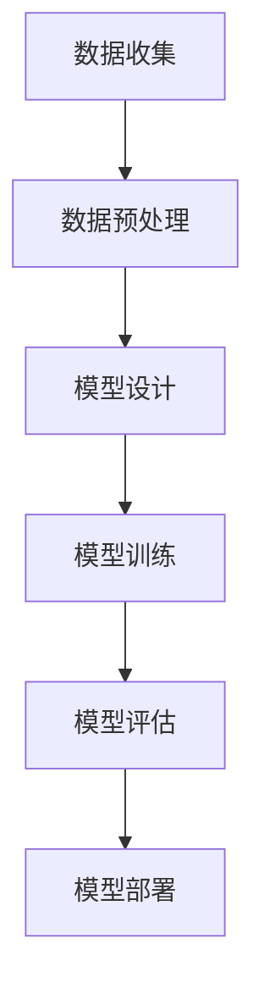

                 


# AI编程的新视角与新思维

> **关键词：** AI编程、新视角、新思维、编程范式、深度学习、机器学习、算法优化、代码复用、软件架构、智能开发工具
> 
> **摘要：** 本文从AI编程的全新视角出发，探讨了AI编程领域的新思维、新范式和新方法。通过对AI编程的核心概念、算法原理、数学模型和实际应用场景的深入分析，文章旨在为读者提供一套系统化、结构化的AI编程知识体系，帮助开发者更好地理解和掌握AI编程的核心技术和未来发展趋势。

## 1. 背景介绍

### 1.1 目的和范围

随着人工智能技术的迅猛发展，AI编程逐渐成为计算机科学领域的一个重要分支。本文旨在为AI编程领域的新手和资深开发者提供一个新的视角和思维框架，帮助读者深入了解AI编程的核心概念和技术原理。文章将涵盖以下几个方面：

- AI编程的基本概念和核心原理
- AI编程的新范式和新方法
- AI编程的数学模型和算法优化
- AI编程的实际应用场景和案例分析
- AI编程的未来发展趋势和挑战

### 1.2 预期读者

本文适用于以下读者群体：

- 对AI编程感兴趣的计算机科学专业学生和研究生
- 资深开发者，希望深入了解AI编程领域的最新动态和技术趋势
- AI领域的研究人员，希望了解AI编程的实际应用和实现方法

### 1.3 文档结构概述

本文结构如下：

- 第1章：背景介绍，包括目的和范围、预期读者、文档结构概述等
- 第2章：核心概念与联系，介绍AI编程的核心概念、原理和架构
- 第3章：核心算法原理 & 具体操作步骤，详细讲解AI编程的核心算法
- 第4章：数学模型和公式 & 详细讲解 & 举例说明，分析AI编程中的数学模型
- 第5章：项目实战：代码实际案例和详细解释说明，展示AI编程的实际应用
- 第6章：实际应用场景，探讨AI编程在不同领域的应用
- 第7章：工具和资源推荐，介绍AI编程的学习资源、开发工具和框架
- 第8章：总结：未来发展趋势与挑战，展望AI编程的未来
- 第9章：附录：常见问题与解答，回答读者可能遇到的问题
- 第10章：扩展阅读 & 参考资料，提供更多AI编程的学习资源

### 1.4 术语表

#### 1.4.1 核心术语定义

- **AI编程**：利用人工智能技术，实现计算机程序的自适应、学习和推理能力。
- **机器学习**：一种通过训练数据自动改进性能的人工智能方法。
- **深度学习**：一种基于多层神经网络的人工智能方法。
- **算法优化**：通过改进算法设计或参数调整，提高算法性能的过程。
- **代码复用**：在软件开发过程中，重复使用已有代码或模块的过程。

#### 1.4.2 相关概念解释

- **神经网络**：一种由大量神经元组成的计算模型，用于模拟人脑的神经网络结构和功能。
- **反向传播**：一种用于训练神经网络的基本算法，通过计算输出误差来更新网络权重。
- **数据集**：一组用于训练、测试和评估模型的样本数据。

#### 1.4.3 缩略词列表

- **AI**：人工智能
- **ML**：机器学习
- **DL**：深度学习
- **IDE**：集成开发环境
- **GPU**：图形处理单元

## 2. 核心概念与联系

在AI编程领域，核心概念和联系构成了理解该领域的基础。本节将介绍AI编程的核心概念、原理和架构，并通过Mermaid流程图展示各概念之间的联系。

### 2.1 AI编程的核心概念

AI编程涉及多个核心概念，包括：

- **神经网络**：一种模拟人脑神经元结构和功能的计算模型。
- **机器学习**：一种通过训练数据自动改进性能的人工智能方法。
- **深度学习**：一种基于多层神经网络的人工智能方法。
- **数据预处理**：将原始数据转换为适合模型训练的数据过程。
- **模型评估**：通过测试数据评估模型性能的过程。
- **模型部署**：将训练好的模型部署到实际应用环境的过程。

### 2.2 AI编程的原理和架构

AI编程的原理和架构可以分为以下几个部分：

1. **数据收集**：收集用于训练模型的原始数据。
2. **数据预处理**：对原始数据进行清洗、归一化和特征提取等操作。
3. **模型设计**：选择合适的神经网络架构和优化算法。
4. **模型训练**：通过训练数据训练模型，并调整模型参数。
5. **模型评估**：使用测试数据评估模型性能，并调整模型参数。
6. **模型部署**：将训练好的模型部署到实际应用环境。

### 2.3 Mermaid流程图

以下是一个简化的Mermaid流程图，展示AI编程的核心概念和原理之间的联系：



## 3. 核心算法原理 & 具体操作步骤

AI编程的核心在于算法的设计和实现。本节将介绍AI编程中的核心算法原理，并通过伪代码详细阐述具体操作步骤。

### 3.1 机器学习算法原理

机器学习算法的核心是建立模型，并通过训练数据优化模型参数。以下是一个简单的线性回归算法的伪代码：

```plaintext
算法：线性回归
输入：训练数据集（x, y），模型参数（w, b）
输出：优化后的模型参数（w', b')

初始化模型参数（w, b）
对于每个训练样本（x_i, y_i）：
  计算预测值 y_i' = w * x_i + b
  计算损失函数 L(w, b) = (y_i - y_i')^2
  更新模型参数 w = w - 学习率 * ∂L/∂w
  更新模型参数 b = b - 学习率 * ∂L/∂b

返回优化后的模型参数（w', b')
```

### 3.2 深度学习算法原理

深度学习算法是基于多层神经网络的设计。以下是一个简单的多层感知机（MLP）算法的伪代码：

```plaintext
算法：多层感知机
输入：训练数据集（x, y），网络结构（层数，每层神经元数），学习率
输出：训练好的神经网络模型

初始化神经网络模型
对于每个训练样本（x_i, y_i）：
  前向传播：
    输入层 -> 隐藏层1 -> 隐藏层2 -> ... -> 输出层
    计算每层的输出值（z_l, a_l）
  计算损失函数 L = 1/N * Σ(y_i - a_N)^2
  反向传播：
    计算梯度 ∂L/∂w_N, ∂L/∂b_N
    递推计算每层的梯度 ∂L/∂w_l, ∂L/∂b_l
    更新模型参数 w_l = w_l - 学习率 * ∂L/∂w_l
    更新模型参数 b_l = b_l - 学习率 * ∂L/∂b_l

返回训练好的神经网络模型
```

### 3.3 算法优化原理

算法优化通常涉及以下两个方面：

1. **模型结构优化**：通过调整网络结构（层数、神经元数、激活函数等）来提高模型性能。
2. **优化算法选择**：选择合适的优化算法（如随机梯度下降、Adam等）来提高训练效率和收敛速度。

以上是AI编程中的核心算法原理和具体操作步骤。通过这些算法，开发者可以设计出高性能、高精度的AI模型，并在实际应用中取得良好的效果。

## 4. 数学模型和公式 & 详细讲解 & 举例说明

AI编程中的数学模型和公式是理解和实现算法的关键。本节将详细介绍AI编程中常用的数学模型和公式，并通过具体例子说明其应用。

### 4.1 线性回归模型

线性回归是一种简单的机器学习算法，用于预测一个连续值输出。其数学模型可以表示为：

$$
y = w_1x_1 + w_2x_2 + ... + w_nx_n + b
$$

其中，$y$ 是预测的输出值，$x_1, x_2, ..., x_n$ 是输入特征值，$w_1, w_2, ..., w_n$ 是模型参数，$b$ 是偏置项。

#### 4.1.1 损失函数

线性回归的损失函数通常采用平方误差损失函数（Squ

