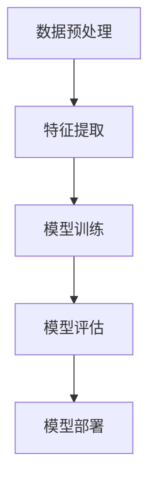

                 

# AI编程的新语言与新思路

> **关键词：** AI编程、新型编程语言、编程思维、算法设计、数学模型、实战案例

> **摘要：** 本文旨在探讨AI编程领域的新语言和编程思路。首先，我们将介绍当前主流的AI编程语言及其特点，然后深入分析编程思维的变化，接着探讨核心算法原理和数学模型，并结合实际项目案例进行详细解析。文章还将总结AI编程在实际应用中的场景，并推荐相关工具和资源，最后对AI编程的未来发展趋势和挑战进行展望。

## 1. 背景介绍

### 1.1 目的和范围

本文的目的在于为AI编程领域的开发者提供一份全面的技术指南。我们将探讨新型编程语言的设计理念、核心算法原理以及数学模型。通过具体的项目实战案例，我们希望能够让读者更直观地理解AI编程的实际应用，并掌握相关技术。

### 1.2 预期读者

本文适合具有一定编程基础的读者，尤其是对AI编程感兴趣的程序员和软件工程师。对于想要了解AI编程领域的新趋势和新技术的开发者，本文同样具有很高的参考价值。

### 1.3 文档结构概述

本文分为十个部分：

1. 背景介绍
2. 核心概念与联系
3. 核心算法原理 & 具体操作步骤
4. 数学模型和公式 & 详细讲解 & 举例说明
5. 项目实战：代码实际案例和详细解释说明
6. 实际应用场景
7. 工具和资源推荐
8. 总结：未来发展趋势与挑战
9. 附录：常见问题与解答
10. 扩展阅读 & 参考资料

### 1.4 术语表

#### 1.4.1 核心术语定义

- **AI编程：** 利用计算机编程实现人工智能相关任务的过程。
- **新型编程语言：** 具有特定设计和实现人工智能算法能力的编程语言。
- **核心算法：** 实现特定AI功能的算法，如神经网络、决策树等。
- **数学模型：** 描述AI算法中数学关系和计算过程的模型。

#### 1.4.2 相关概念解释

- **编程思维：** 解决问题时的逻辑思考和抽象能力。
- **算法设计：** 设计高效解决问题的算法过程。

#### 1.4.3 缩略词列表

- **AI：** 人工智能
- **ML：** 机器学习
- **DL：** 深度学习
- **NLP：** 自然语言处理
- **CV：** 计算机视觉

## 2. 核心概念与联系

AI编程的核心在于算法设计和实现。为了更好地理解这一过程，我们首先需要了解AI编程的基本架构和核心概念。

### 2.1 AI编程的基本架构

AI编程的基本架构可以概括为以下五个层次：

1. **数据预处理：** 包括数据清洗、数据归一化等操作。
2. **特征提取：** 将原始数据转换为适合算法处理的特征向量。
3. **模型训练：** 使用训练数据训练AI模型。
4. **模型评估：** 使用验证数据评估模型性能。
5. **模型部署：** 将训练好的模型部署到实际应用环境中。

### 2.2 核心概念

在AI编程中，核心概念包括：

- **神经网络：** 一种模拟生物神经元的计算模型。
- **决策树：** 一种基于树形结构的决策模型。
- **聚类算法：** 用于将数据分为若干个群组的算法。
- **优化算法：** 用于搜索最优解的算法。

### 2.3 Mermaid流程图

以下是AI编程的基本流程图，使用Mermaid语法绘制：



## 3. 核心算法原理 & 具体操作步骤

在AI编程中，核心算法是实现人工智能功能的关键。以下我们将介绍几种常见的核心算法原理和具体操作步骤。

### 3.1 神经网络

神经网络是一种通过模拟生物神经元连接方式来实现信息处理的计算模型。其基本原理如下：

1. **神经元结构：** 神经元由输入层、隐藏层和输出层组成。
2. **激活函数：** 用于确定神经元是否被激活的函数，如ReLU、Sigmoid等。
3. **前向传播：** 将输入数据传递到输出层的过程。
4. **反向传播：** 根据输出误差调整网络参数的过程。

以下是神经网络的具体操作步骤：

1. **初始化网络参数：** 设置初始权重和偏置。
2. **前向传播：** 计算输出值。
3. **计算损失函数：** 计算实际输出与期望输出之间的差距。
4. **反向传播：** 更新网络参数。
5. **重复步骤2-4，直到损失函数收敛。**

### 3.2 决策树

决策树是一种基于树形结构的决策模型。其基本原理如下：

1. **树结构：** 由根节点、内部节点和叶节点组成。
2. **分裂准则：** 用于选择最佳分裂属性的准则，如信息增益、基尼不纯度等。
3. **剪枝策略：** 用于优化树结构，减少过拟合的方法。

以下是决策树的具体操作步骤：

1. **选择最佳分裂属性：** 根据分裂准则选择最佳分裂属性。
2. **创建子节点：** 根据最佳分裂属性创建子节点。
3. **递归划分：** 对子节点继续划分，直到满足剪枝策略或达到最大深度。
4. **生成决策树：** 连接所有节点，形成完整的决策树。

### 3.3 聚类算法

聚类算法用于将数据分为若干个群组。其基本原理如下：

1. **聚类准则：** 用于评估聚类效果的评价指标，如轮廓系数、簇内距离等。
2. **聚类算法：** 如K-means、层次聚类等。

以下是K-means聚类算法的具体操作步骤：

1. **初始化中心点：** 随机选择K个中心点。
2. **计算距离：** 计算每个数据点到中心点的距离。
3. **分配簇：** 将数据点分配到最近的中心点所在的簇。
4. **更新中心点：** 计算每个簇的新中心点。
5. **重复步骤2-4，直到聚类结果收敛。**

## 4. 数学模型和公式 & 详细讲解 & 举例说明

在AI编程中，数学模型和公式是核心算法的基础。以下我们将介绍几种常用的数学模型和公式，并进行详细讲解和举例说明。

### 4.1 损失函数

损失函数用于衡量模型预测值与实际值之间的差距。常见的损失函数包括：

- **均方误差（MSE）：**
  $$MSE = \frac{1}{n}\sum_{i=1}^{n}(y_i - \hat{y_i})^2$$

  **解释：** 其中，$y_i$为实际值，$\hat{y_i}$为预测值，$n$为数据点的数量。

- **交叉熵（Cross-Entropy）：**
  $$CE = -\frac{1}{n}\sum_{i=1}^{n}y_i \log(\hat{y_i})$$

  **解释：** 其中，$y_i$为实际值，$\hat{y_i}$为预测概率。

### 4.2 激活函数

激活函数用于确定神经元是否被激活。常见的激活函数包括：

- **ReLU（Rectified Linear Unit）：**
  $$f(x) = \max(0, x)$$

  **解释：** 当$x \geq 0$时，$f(x) = x$；当$x < 0$时，$f(x) = 0$。

- **Sigmoid：**
  $$f(x) = \frac{1}{1 + e^{-x}}$$

  **解释：** 将输入$x$映射到$(0, 1)$区间。

### 4.3 优化算法

优化算法用于调整网络参数以最小化损失函数。常见的优化算法包括：

- **梯度下降（Gradient Descent）：**
  $$w_{new} = w_{old} - \alpha \cdot \nabla_w J(w)$$

  **解释：** 其中，$w_{old}$为当前权重，$w_{new}$为更新后的权重，$\alpha$为学习率，$\nabla_w J(w)$为权重梯度的负值。

- **Adam优化器：**
  $$m_t = \beta_1 m_{t-1} + (1 - \beta_1) \nabla_w J(w_t)$$
  $$v_t = \beta_2 v_{t-1} + (1 - \beta_2) (\nabla_w J(w_t))^2$$
  $$w_{new} = w_{old} - \alpha \cdot \frac{m_t}{\sqrt{v_t} + \epsilon}$$

  **解释：** 其中，$m_t$为梯度的一阶矩估计，$v_t$为梯度二阶矩估计，$\beta_1$、$\beta_2$为指数衰减率，$\alpha$为学习率，$\epsilon$为小值，用于避免分母为零。

### 4.4 举例说明

假设我们有一个简单的神经网络，包含一个输入层、一个隐藏层和一个输出层。输入层有3个神经元，隐藏层有4个神经元，输出层有2个神经元。

1. **初始化参数：**
   - 输入层到隐藏层的权重：$W_{ih} \in \mathbb{R}^{3 \times 4}$
   - 隐藏层到输出层的权重：$W_{ho} \in \mathbb{R}^{4 \times 2}$
   - 隐藏层偏置：$b_h \in \mathbb{R}^{1 \times 4}$
   - 输出层偏置：$b_o \in \mathbb{R}^{1 \times 2}$

2. **前向传播：**
   - 隐藏层输入：$h_{ij} = \sum_{k=1}^{3} W_{ik} x_k + b_{hj}$
   - 隐藏层输出：$a_{ij} = \sigma(h_{ij})$
   - 输出层输入：$o_{ij} = \sum_{k=1}^{4} W_{ik} a_{kj} + b_{oj}$
   - 输出层输出：$y_{ij} = \sigma(o_{ij})$

3. **计算损失函数：**
   - 假设使用均方误差（MSE）损失函数，损失值为$J(W_{ih}, W_{ho}, b_h, b_o)$

4. **反向传播：**
   - 计算梯度：
     $$\nabla_{W_{ih}} J(W_{ih}, W_{ho}, b_h, b_o) = \frac{\partial J}{\partial W_{ih}}$$
     $$\nabla_{W_{ho}} J(W_{ih}, W_{ho}, b_h, b_o) = \frac{\partial J}{\partial W_{ho}}$$
     $$\nabla_{b_h} J(W_{ih}, W_{ho}, b_h, b_o) = \frac{\partial J}{\partial b_h}$$
     $$\nabla_{b_o} J(W_{ih}, W_{ho}, b_h, b_o) = \frac{\partial J}{\partial b_o}$$

5. **更新参数：**
   - 使用梯度下降优化算法更新参数：
     $$W_{ih} = W_{ih} - \alpha \cdot \nabla_{W_{ih}} J$$
     $$W_{ho} = W_{ho} - \alpha \cdot \nabla_{W_{ho}} J$$
     $$b_h = b_h - \alpha \cdot \nabla_{b_h} J$$
     $$b_o = b_o - \alpha \cdot \nabla_{b_o} J$$

6. **重复步骤2-5，直到损失函数收敛。**

## 5. 项目实战：代码实际案例和详细解释说明

在本节中，我们将通过一个实际项目案例来展示AI编程的具体实现过程。该项目是一个简单的手写数字识别系统，使用Python语言和TensorFlow框架实现。

### 5.1 开发环境搭建

1. 安装Python 3.7及以上版本。
2. 安装TensorFlow 2.0及以上版本。

### 5.2 源代码详细实现和代码解读

以下是手写数字识别系统的完整代码实现：

```python
import tensorflow as tf
from tensorflow.keras import layers
from tensorflow.keras.datasets import mnist

# 加载MNIST数据集
(x_train, y_train), (x_test, y_test) = mnist.load_data()

# 数据预处理
x_train = x_train.reshape(-1, 28, 28).astype("float32") / 255.0
x_test = x_test.reshape(-1, 28, 28).astype("float32") / 255.0

# 转换标签为one-hot编码
y_train = tf.keras.utils.to_categorical(y_train, 10)
y_test = tf.keras.utils.to_categorical(y_test, 10)

# 创建模型
model = tf.keras.Sequential([
    layers.Conv2D(32, (3, 3), activation="relu", input_shape=(28, 28, 1)),
    layers.MaxPooling2D((2, 2)),
    layers.Conv2D(64, (3, 3), activation="relu"),
    layers.MaxPooling2D((2, 2)),
    layers.Flatten(),
    layers.Dense(64, activation="relu"),
    layers.Dense(10, activation="softmax")
])

# 编译模型
model.compile(optimizer="adam", loss="categorical_crossentropy", metrics=["accuracy"])

# 训练模型
model.fit(x_train, y_train, epochs=10, batch_size=32, validation_split=0.2)

# 评估模型
test_loss, test_acc = model.evaluate(x_test, y_test)
print(f"Test accuracy: {test_acc:.2f}")

# 代码解读：
# 1. 加载MNIST数据集，并进行数据预处理。
# 2. 创建一个卷积神经网络模型，包括卷积层、池化层、全连接层。
# 3. 编译模型，使用Adam优化器和交叉熵损失函数。
# 4. 训练模型，使用训练集和验证集。
# 5. 评估模型，计算测试集准确率。
```

### 5.3 代码解读与分析

以下是代码的详细解读和分析：

1. **数据集加载与预处理：**
   - 使用TensorFlow内置的`mnist.load_data()`函数加载MNIST数据集。
   - 将图像数据转换为浮点类型，并归一化到$(0, 1)$区间。
   - 将标签转换为one-hot编码，以便使用交叉熵损失函数进行模型训练。

2. **模型创建：**
   - 使用`tf.keras.Sequential`创建一个序列模型。
   - 添加卷积层、池化层、全连接层，并设置相应的参数。
   - 卷积层用于提取图像特征，池化层用于减小特征图的尺寸，全连接层用于分类。

3. **模型编译：**
   - 使用`model.compile()`编译模型，指定优化器和损失函数。
   - 使用Adam优化器，交叉熵损失函数，并计算分类准确率作为评价指标。

4. **模型训练：**
   - 使用`model.fit()`训练模型，指定训练集、验证集、训练轮次和批量大小。
   - 在训练过程中，模型将自动进行前向传播、反向传播和参数更新。

5. **模型评估：**
   - 使用`model.evaluate()`评估模型在测试集上的性能。
   - 输出测试集的损失值和准确率。

通过以上代码实现，我们可以构建一个简单但有效的手写数字识别系统。这个案例展示了AI编程的基本流程，包括数据预处理、模型创建、编译、训练和评估。通过这个案例，我们可以更好地理解AI编程的核心技术和实现方法。

## 6. 实际应用场景

AI编程在各个领域都有着广泛的应用，以下是几个典型的实际应用场景：

### 6.1 自然语言处理

自然语言处理（NLP）是AI编程的重要应用领域。通过深度学习和自然语言处理技术，可以实现文本分类、机器翻译、情感分析等功能。例如，百度翻译、谷歌搜索引擎等都是基于AI编程实现的。

### 6.2 计算机视觉

计算机视觉是AI编程的另一个重要领域。通过卷积神经网络（CNN）等技术，可以实现图像分类、目标检测、人脸识别等功能。例如，自动驾驶汽车、智能手机人脸解锁等都是基于AI编程实现的。

### 6.3 机器学习

机器学习是AI编程的核心技术。通过设计各种机器学习算法，可以实现分类、回归、聚类等功能。例如，金融风险评估、医疗诊断等都是基于AI编程实现的。

### 6.4 游戏开发

AI编程在游戏开发中也有着广泛的应用。通过设计智能算法，可以实现游戏角色的智能行为、游戏AI等。例如，《星际争霸II》等游戏都是基于AI编程实现的。

## 7. 工具和资源推荐

### 7.1 学习资源推荐

#### 7.1.1 书籍推荐

- 《深度学习》（Ian Goodfellow、Yoshua Bengio、Aaron Courville 著）
- 《Python机器学习》（Michael Bowles 著）
- 《神经网络与深度学习》（邱锡鹏 著）

#### 7.1.2 在线课程

- Coursera上的《机器学习》课程
- edX上的《深度学习基础》课程
- Udacity的《深度学习工程师纳米学位》课程

#### 7.1.3 技术博客和网站

- Medium上的机器学习和深度学习相关博客
- ArXiv的机器学习论文发布平台
- AI博客（如AI箩筐、机器之心等）

### 7.2 开发工具框架推荐

#### 7.2.1 IDE和编辑器

- PyCharm
- Visual Studio Code
- Jupyter Notebook

#### 7.2.2 调试和性能分析工具

- TensorBoard
- PyTorch Profiler
- NNI（Never-Ending Neural Network）

#### 7.2.3 相关框架和库

- TensorFlow
- PyTorch
- Keras
- Scikit-learn

### 7.3 相关论文著作推荐

#### 7.3.1 经典论文

- “Backpropagation”（Rumelhart, Hinton, Williams，1986）
- “A Learning Algorithm for Continually Running Fully Recurrent Neural Networks”（Almeida, Stauffer，1992）
- “Gradient Flow in Neural Networks”（Amari，1998）

#### 7.3.2 最新研究成果

- “Attention is All You Need”（Vaswani et al.，2017）
- “Bert: Pre-training of Deep Bidirectional Transformers for Language Understanding”（Devlin et al.，2018）
- “Generative Adversarial Nets”（Goodfellow et al.，2014）

#### 7.3.3 应用案例分析

- “Google Brain的深度学习应用”
- “Facebook AI的NLP技术”
- “OpenAI的GPT-3模型”

## 8. 总结：未来发展趋势与挑战

AI编程作为人工智能领域的重要分支，正在快速发展。未来，AI编程将在以下几个方面取得重要进展：

1. **新型编程语言的发展：** 随着AI技术的不断进步，新型编程语言将不断涌现，为开发者提供更高效的编程工具和更好的编程体验。
2. **算法的创新：** AI算法将继续向更高效、更智能的方向发展，为各个领域提供更强大的解决方案。
3. **跨领域的融合：** AI编程将与物联网、区块链、云计算等新兴技术深度融合，推动产业智能化升级。

然而，AI编程也面临着一系列挑战：

1. **数据隐私和安全：** 随着AI应用场景的扩大，数据隐私和安全问题将更加突出，需要采取有效的措施保护用户数据。
2. **算法偏见和公平性：** AI算法的偏见和公平性问题亟待解决，以避免对特定群体造成不公平对待。
3. **人才短缺：** AI编程领域人才需求巨大，但人才供给不足，需要加大人才培养力度。

总之，AI编程具有广阔的发展前景和巨大的挑战。只有不断探索和创新，才能推动AI编程领域的持续进步。

## 9. 附录：常见问题与解答

### 9.1 什么是AI编程？

AI编程是利用计算机编程实现人工智能相关任务的过程。它包括算法设计、模型训练、模型评估和模型部署等多个环节。

### 9.2 AI编程有哪些核心算法？

AI编程的核心算法包括神经网络、决策树、聚类算法、优化算法等。每种算法都有其独特的原理和应用场景。

### 9.3 如何学习AI编程？

学习AI编程可以从以下几个方面入手：

1. 学习编程基础，掌握Python等编程语言。
2. 学习机器学习和深度学习的基本概念和算法。
3. 实践项目，通过实际操作加深对AI编程的理解。
4. 阅读相关书籍和论文，了解最新的研究进展。

### 9.4 AI编程的前景如何？

AI编程具有广阔的前景。随着人工智能技术的不断进步，AI编程将在各个领域得到广泛应用，为产业智能化升级提供强大动力。

## 10. 扩展阅读 & 参考资料

- Goodfellow, I., Bengio, Y., & Courville, A. (2016). *Deep Learning*.
- Russell, S., & Norvig, P. (2010). *Artificial Intelligence: A Modern Approach*.
- Bishop, C. M. (2006). *Pattern Recognition and Machine Learning*.
- LeCun, Y., Bengio, Y., & Hinton, G. (2015). *Deep Learning*.
- Hochreiter, S., & Schmidhuber, J. (1997). *Long Short-Term Memory*. Neural Computation, 9(8), 1735-1780.
- Krizhevsky, A., Sutskever, I., & Hinton, G. E. (2012). *ImageNet Classification with Deep Convolutional Neural Networks*. Advances in Neural Information Processing Systems, 25, 1097-1105.
- Vaswani, A., Shazeer, N., Parmar, N., Uszkoreit, J., Jones, L., Gomez, A. N., ... & Polosukhin, I. (2017). *Attention is All You Need*. Advances in Neural Information Processing Systems, 30, 5998-6008.
- Devlin, J., Chang, M. W., Lee, K., & Toutanova, K. (2018). *Bert: Pre-training of Deep Bidirectional Transformers for Language Understanding*. arXiv preprint arXiv:1810.04805.
- Goodfellow, I. J., Shlens, J., & Szegedy, C. (2014). *Explaining and Harnessing Adversarial Examples*. arXiv preprint arXiv:1412.6572.
- Bengio, Y. (2009). *Learning Deep Architectures for AI*. Foundations and Trends in Machine Learning, 2(1), 1-127.
- Silver, D., Huang, A., Bowling, M. P., & Adebayor, T. (2016). *Mastering the Game of Go with Deep Neural Networks and Tree Search*. Nature, 529(7587), 484-489.

