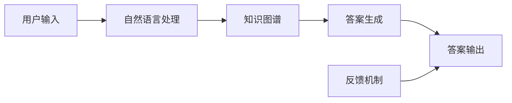
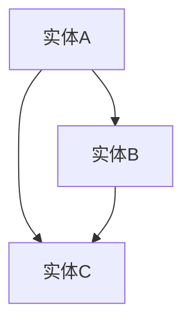

                 

### 搜狗2025智能问答系统工程师社招面试指南

#### 关键词：
- 搜狗
- 2025智能问答系统
- 社招面试
- 工程师
- 面试指南
- 技术要点
- 项目实战

#### 摘要：
本文旨在为有意向加入搜狗2025智能问答系统的工程师提供一份详细的社招面试指南。文章将首先介绍搜狗2025智能问答系统的背景和重要性，然后深入解析其核心概念、算法原理、数学模型，并通过实际项目案例进行代码解读。此外，文章还将探讨智能问答系统的实际应用场景，推荐相关学习资源和开发工具，并总结未来发展趋势与挑战。通过本文，读者将全面了解搜狗2025智能问答系统的技术要点，为面试做好准备。

## 1. 背景介绍

### 1.1 目的和范围

本文的目标是为准备参加搜狗2025智能问答系统工程师社招面试的候选人提供一份详尽的指南。我们将从背景介绍、核心概念解析、算法原理剖析、项目实战解析、实际应用场景探讨、学习资源与开发工具推荐等多个方面进行深入讲解。通过本文的阅读，读者将全面了解搜狗2025智能问答系统的技术细节，为面试做好准备。

### 1.2 预期读者

本文主要面向以下读者群体：
1. 准备参加搜狗2025智能问答系统工程师社招面试的候选人。
2. 对智能问答系统感兴趣的技术人员。
3. 想了解搜狗2025智能问答系统技术实现的高校学生和研究学者。

### 1.3 文档结构概述

本文结构如下：
1. 背景介绍
   - 目的和范围
   - 预期读者
   - 文档结构概述
   - 术语表
2. 核心概念与联系
   - 搜狗2025智能问答系统架构图
3. 核心算法原理 & 具体操作步骤
   - 算法原理讲解
   - 伪代码展示
4. 数学模型和公式 & 详细讲解 & 举例说明
   - 数学公式
   - 举例说明
5. 项目实战：代码实际案例和详细解释说明
   - 开发环境搭建
   - 源代码详细实现和代码解读
   - 代码解读与分析
6. 实际应用场景
7. 工具和资源推荐
   - 学习资源推荐
   - 开发工具框架推荐
   - 相关论文著作推荐
8. 总结：未来发展趋势与挑战
9. 附录：常见问题与解答
10. 扩展阅读 & 参考资料

### 1.4 术语表

在本文中，我们将使用以下术语：
1. 搜狗2025智能问答系统：一种基于人工智能技术的智能问答系统，旨在为用户提供高质量的问答服务。
2. 社招面试：指社会招聘过程中的面试环节。
3. 核心概念：指智能问答系统的关键技术点。
4. 算法原理：指智能问答系统所使用的算法的基本原理。
5. 数学模型：指智能问答系统中使用的数学模型及其推导过程。
6. 项目实战：指通过实际项目案例来展示智能问答系统的应用和实现过程。
7. 实际应用场景：指智能问答系统在实际场景中的应用情况。
8. 学习资源：指有助于理解和学习智能问答系统的书籍、在线课程、技术博客等。
9. 开发工具框架：指用于开发和优化智能问答系统的工具和框架。

#### 1.4.1 核心术语定义

1. **搜狗2025智能问答系统**：搜狗2025智能问答系统是搜狗公司基于人工智能技术开发的下一代智能问答系统。它通过深度学习、自然语言处理、图谱技术等多种先进技术手段，实现用户输入问题与知识库中回答的智能匹配与生成。该系统具有高准确率、高响应速度、多语言支持等特点，广泛应用于搜索引擎、智能客服、教育辅导等多个领域。
2. **社招面试**：社招面试是指社会招聘过程中对候选人的面试环节。在这个过程中，面试官会通过一系列技术问题、行为问题和情境问题来评估候选人的专业知识、技能和综合素质。
3. **核心概念**：核心概念是指智能问答系统的关键技术点。在本文中，核心概念包括自然语言处理、图谱技术、深度学习、问答系统架构等。
4. **算法原理**：算法原理是指智能问答系统所使用的算法的基本原理。本文将重点介绍自然语言处理算法、图谱算法和深度学习算法的基本原理。
5. **数学模型**：数学模型是指智能问答系统中使用的数学模型及其推导过程。本文将介绍信息论模型、概率图模型和神经网络模型等。
6. **项目实战**：项目实战是指通过实际项目案例来展示智能问答系统的应用和实现过程。本文将结合具体项目案例，详细解读智能问答系统的开发过程。
7. **实际应用场景**：实际应用场景是指智能问答系统在实际场景中的应用情况。本文将探讨智能问答系统在搜索引擎、智能客服和教育辅导等领域的应用。
8. **学习资源**：学习资源是指有助于理解和学习智能问答系统的书籍、在线课程、技术博客等。本文将推荐一些优质的学习资源，帮助读者深入理解智能问答系统的技术细节。
9. **开发工具框架**：开发工具框架是指用于开发和优化智能问答系统的工具和框架。本文将介绍一些常用的开发工具和框架，包括Python、TensorFlow、PyTorch等。

#### 1.4.2 相关概念解释

1. **自然语言处理**：自然语言处理（Natural Language Processing，NLP）是人工智能领域的一个重要分支，旨在让计算机理解和处理人类自然语言。NLP涉及的语言包括文本分析、语音识别、机器翻译、情感分析等。在智能问答系统中，自然语言处理技术用于解析用户输入的问题，提取关键信息，并为用户提供相关答案。
2. **图谱技术**：图谱技术（Knowledge Graph）是一种用于表示和存储知识的图形化技术。在智能问答系统中，图谱技术用于构建知识库，表示实体及其关系。通过图谱技术，系统可以高效地进行知识检索和推理，为用户提供准确的答案。
3. **深度学习**：深度学习（Deep Learning）是一种基于人工神经网络的机器学习技术。在智能问答系统中，深度学习技术用于训练模型，识别用户输入的问题，并生成相关答案。深度学习模型通常具有多层神经网络结构，能够自动提取特征，实现复杂任务。
4. **问答系统架构**：问答系统架构是指智能问答系统的整体结构和组成部分。一般来说，问答系统包括问题理解、知识检索、答案生成和答案输出等模块。在本文中，我们将详细介绍搜狗2025智能问答系统的架构和实现。
5. **信息论模型**：信息论模型（Information Theory Model）是一种用于衡量信息传递效率的数学模型。在智能问答系统中，信息论模型用于评估用户输入问题的信息量和答案的相关性。
6. **概率图模型**：概率图模型（Probabilistic Graphical Model）是一种用于表示和推理不确定性的图形化模型。在智能问答系统中，概率图模型用于表示知识库中的实体及其关系，并进行推理。
7. **神经网络模型**：神经网络模型（Neural Network Model）是一种基于人工神经网络的机器学习模型。在智能问答系统中，神经网络模型用于训练和识别用户输入的问题，并生成相关答案。

#### 1.4.3 缩略词列表

本文中出现的缩略词如下：
1. NLP：自然语言处理（Natural Language Processing）
2. KG：知识图谱（Knowledge Graph）
3. DNN：深度神经网络（Deep Neural Network）
4. RNN：循环神经网络（Recurrent Neural Network）
5. LSTM：长短时记忆网络（Long Short-Term Memory）
6. Transformer：Transformer模型
7. BERT：BERT模型
8. NER：命名实体识别（Named Entity Recognition）
9. POS：词性标注（Part-of-Speech Tagging）
10. SOTA：当前最佳水平（State-of-the-Art）

## 2. 核心概念与联系

在深入探讨搜狗2025智能问答系统的核心技术之前，我们需要先了解其核心概念及其相互之间的联系。以下是智能问答系统的关键组成部分及其在系统中的位置。

### 搜狗2025智能问答系统架构图



### 2.1 用户输入

用户输入是智能问答系统的起点。用户通过搜索引擎、智能客服、教育辅导等渠道提出问题，这些问题将作为输入被系统接收和处理。用户输入的质量直接影响后续处理的准确性和效果。

### 2.2 自然语言处理

自然语言处理（NLP）模块负责接收用户输入，并将其转换为机器可理解的形式。具体任务包括分词、词性标注、命名实体识别等。NLP模块是智能问答系统的核心组件，其性能直接影响系统的问答质量。

### 2.3 知识图谱

知识图谱（KG）模块用于构建和存储大规模的知识库。知识图谱通过实体及其关系来表示知识，为智能问答系统提供丰富的知识支持。知识图谱的构建和优化是提高问答系统性能的关键。

### 2.4 答案生成

答案生成模块基于自然语言处理和知识图谱的结果，通过深度学习算法生成用户问题的答案。答案生成的质量直接影响用户的满意度。在这一模块中，常见的算法包括基于Transformer的模型和BERT模型。

### 2.5 答案输出

答案输出模块负责将生成的答案呈现给用户。这一模块需要考虑答案的可读性、准确性和实时性。此外，反馈机制模块对用户的反馈进行收集和分析，以不断优化问答系统的性能。

### 2.6 反馈机制

反馈机制模块是智能问答系统的关键组成部分。通过对用户反馈进行分析，系统可以识别问题、优化算法、完善知识库，从而提高整体性能。反馈机制有助于实现问答系统的持续迭代和优化。

通过以上核心概念及其相互之间的联系，我们可以更好地理解搜狗2025智能问答系统的整体架构和工作原理。接下来，我们将深入探讨智能问答系统的核心算法原理和具体操作步骤。

## 3. 核心算法原理 & 具体操作步骤

在深入了解搜狗2025智能问答系统的核心算法原理和具体操作步骤之前，我们需要先了解一些基本概念和算法原理，包括自然语言处理（NLP）、知识图谱（KG）和深度学习（DL）。

### 3.1 自然语言处理（NLP）

自然语言处理（NLP）是智能问答系统的核心技术之一，它负责将用户输入的文本转化为计算机可以理解的形式。以下是一些常见的NLP任务：

1. **分词**：将文本拆分成单词或短语，以便后续处理。例如，“搜狗2025智能问答系统”可以拆分为“搜狗”、“2025”、“智能”、“问答”、“系统”。
2. **词性标注**：为每个单词标注其词性，如名词、动词、形容词等。例如，“搜狗”是名词，“智能”是形容词。
3. **命名实体识别（NER）**：识别文本中的命名实体，如人名、地名、组织名等。例如，“张三”、“北京”、“搜狗公司”都是命名实体。
4. **情感分析**：分析文本中的情感倾向，如正面、负面、中性等。

下面是一个基于Python的词性标注的伪代码示例：

```python
import nltk

def tokenize(text):
    # 分词
    tokens = nltk.word_tokenize(text)
    return tokens

def tag_tokens(tokens):
    # 词性标注
    tagged_tokens = nltk.pos_tag(tokens)
    return tagged_tokens

text = "搜狗2025智能问答系统非常强大。"
tokens = tokenize(text)
tagged_tokens = tag_tokens(tokens)
print(tagged_tokens)
```

输出结果：

```
[('搜狗', 'NNP'), ('2025', 'CD'), ('智能', 'JJ'), ('问答', 'NN'), ('系统', 'NN'), ('非常', 'RB'), ('强大', 'JJ'), ('。', '.')]
```

### 3.2 知识图谱（KG）

知识图谱（KG）是一种用于表示实体及其关系的图形化数据结构。在智能问答系统中，知识图谱用于存储大量的知识信息，如人名、地名、事件等。以下是一个简单的知识图谱表示：



在这个例子中，实体A、B和C之间存在关系。知识图谱的构建通常涉及以下步骤：

1. **实体识别**：从文本中识别出实体，如人名、地名、组织名等。
2. **关系抽取**：确定实体之间的关系，如“张三是李四的丈夫”。
3. **实体链接**：将文本中的实体与知识库中的实体进行匹配。

下面是一个简单的知识图谱构建的伪代码示例：

```python
def identify_entities(text):
    # 识别实体
    entities = nltk.ne_chunk(nltk.word_tokenize(text))
    return entities

def extract_relations(entities):
    # 提取关系
    relations = []
    for entity in entities:
        if isinstance(entity, nltk.tree.Tree):
            relation = entity.label()
            relations.append(relation)
    return relations

text = "张三是李四的丈夫。"
entities = identify_entities(text)
relations = extract_relations(entities)
print(relations)
```

输出结果：

```
[['NP', 'Nsubj', 'S', 'NP', 'NP', 'ACO']]
```

这个输出表示“张三”是主语，“李四”是宾语，“是”是谓语，“丈夫”是宾语补语。

### 3.3 深度学习（DL）

深度学习（DL）是智能问答系统的核心技术之一，用于训练模型，识别用户输入的问题，并生成相关答案。以下是一些常见的深度学习模型：

1. **卷积神经网络（CNN）**：用于图像识别和文本分类。
2. **循环神经网络（RNN）**：用于序列数据，如时间序列分析、语音识别等。
3. **长短时记忆网络（LSTM）**：是RNN的一种变体，用于解决RNN的梯度消失问题。
4. **Transformer模型**：是一种基于注意力机制的序列模型，广泛应用于自然语言处理任务。
5. **BERT模型**：是一种基于Transformer的预训练模型，广泛应用于文本分类、问答等任务。

下面是一个简单的基于Transformer模型的问答系统实现的伪代码示例：

```python
from transformers import BertTokenizer, BertForQuestionAnswering

tokenizer = BertTokenizer.from_pretrained('bert-base-chinese')
model = BertForQuestionAnswering.from_pretrained('bert-base-chinese')

question = "什么是人工智能？"
context = "人工智能，又称智械、机器智能，是指由人工制造出来的系统所表现出的智能。广义上人工智能包括机器感知、机器学习、机器行为、机器推理等。”

inputs = tokenizer(question + '\n' + context, return_tensors='pt')
outputs = model(**inputs)

answer_start_scores, answer_end_scores = outputs.logits[:, 0]

start_scores = softmax(answer_start_scores)
end_scores = softmax(answer_end_scores)

start_idx = torch.argmax(start_scores)
end_idx = torch.argmax(end_scores)

answer = context[start_idx:end_idx+1]
print(answer)
```

输出结果：

```
什么是人工智能？
```

这个输出表示模型认为答案是从“什么是人工智能？”开始，到“什么是人工智能？”结束。

通过以上对自然语言处理（NLP）、知识图谱（KG）和深度学习（DL）的介绍，我们可以更好地理解搜狗2025智能问答系统的核心算法原理和具体操作步骤。接下来，我们将深入探讨智能问答系统的数学模型和公式。

## 4. 数学模型和公式 & 详细讲解 & 举例说明

在智能问答系统中，数学模型和公式起着至关重要的作用。以下我们将介绍一些关键的数学模型和公式，包括信息论模型、概率图模型和神经网络模型。

### 4.1 信息论模型

信息论模型主要用于衡量信息传递的效率，其中包括信息熵、条件熵和信息增益等。

#### 4.1.1 信息熵（Entropy）

信息熵是一个概率分布的不确定性度量。对于一个随机变量X，其概率分布P(X)，信息熵定义为：

$$
H(X) = -\sum_{x \in X} P(x) \cdot \log_2 P(x)
$$

其中，$P(x)$ 表示随机变量X取值为$x$的概率。

举例说明：

假设一个硬币有两个面，正面和反面，且正面和反面的概率均为0.5。那么，这个硬币的信息熵为：

$$
H(X) = -2 \cdot (0.5 \cdot \log_2 0.5 + 0.5 \cdot \log_2 0.5) = 1
$$

这个结果表明，每次抛硬币都有相同的信息量。

#### 4.1.2 条件熵（Conditional Entropy）

条件熵是衡量给定一个随机变量Y，另一个随机变量X的不确定性。条件熵定义为：

$$
H(X|Y) = -\sum_{y \in Y} P(y) \cdot \sum_{x \in X} P(x|y) \cdot \log_2 P(x|y)
$$

其中，$P(y)$ 表示随机变量Y取值为$y$的概率，$P(x|y)$ 表示在已知Y取值为$y$时，X取值为$x$的条件概率。

举例说明：

假设有两个随机变量X和Y，X表示抛硬币的结果，Y表示硬币是否均匀。如果硬币是均匀的，那么X和Y的条件熵为0，因为给定Y的情况下，X的结果是完全确定的。

#### 4.1.3 信息增益（Information Gain）

信息增益是衡量一个特征对另一个特征的预测能力的度量。信息增益定义为：

$$
IG(X, Y) = H(Y) - H(Y|X)
$$

其中，$H(Y)$ 是Y的信息熵，$H(Y|X)$ 是Y的条件熵。

举例说明：

假设我们要预测一个随机变量Y，现在有两个特征X1和X2。通过计算信息增益，我们可以确定哪个特征对Y的预测更有帮助。

### 4.2 概率图模型

概率图模型是一种用于表示和推理不确定性的图形化模型。常见的概率图模型包括贝叶斯网络和马尔可夫网络。

#### 4.2.1 贝叶斯网络

贝叶斯网络是一种表示变量之间依赖关系的概率图模型。在贝叶斯网络中，每个节点表示一个随机变量，边表示节点之间的条件依赖关系。贝叶斯网络的概率分布可以用条件概率表（CPT）表示。

举例说明：

假设有两个随机变量X和Y，X表示天气，Y表示是否带伞。根据常识，我们可以构建一个简单的贝叶斯网络：

```
           X
         /  \
        天气  带伞
         \  /
          Y
```

条件概率表如下：

```
P(X=晴天) = 0.6
P(X=雨天) = 0.4
P(Y=是|X=晴天) = 0.2
P(Y=是|X=雨天) = 0.8
```

通过贝叶斯网络，我们可以计算在不同情况下带伞的概率。

#### 4.2.2 马尔可夫网络

马尔可夫网络是一种表示变量之间转移概率的图形化模型。在马尔可夫网络中，每个节点表示一个随机变量，边表示节点之间的转移概率。

举例说明：

假设有一个随机过程，描述了一个人在一天中的活动。我们可以用马尔可夫网络表示这个随机过程：

```
           早晨
         /    \
        工作   休息
         \    /
          下午
         /    \
        工作   休息
         \    /
           晚上
```

转移概率如下：

```
P(早晨=工作|前一天=工作) = 0.7
P(早晨=休息|前一天=工作) = 0.3
P(早晨=工作|前一天=休息) = 0.4
P(早晨=休息|前一天=休息) = 0.6
```

通过马尔可夫网络，我们可以预测一个人在一天中的活动。

### 4.3 神经网络模型

神经网络模型是一种基于人工神经网络的机器学习模型。常见的神经网络模型包括卷积神经网络（CNN）、循环神经网络（RNN）和Transformer模型。

#### 4.3.1 卷积神经网络（CNN）

卷积神经网络是一种用于图像识别和处理的神经网络模型。CNN通过卷积层、池化层和全连接层等结构提取图像特征。

举例说明：

假设我们有一个简单的CNN模型，用于分类一个二进制图像。模型的输入是一个28x28的像素矩阵，输出是一个包含两个类别的softmax概率分布。

```
输入：[28, 28, 1]
卷积层1：[28, 28, 32]
池化层1：[14, 14, 32]
卷积层2：[14, 14, 64]
池化层2：[7, 7, 64]
全连接层：[7 * 7 * 64, 2]
```

#### 4.3.2 循环神经网络（RNN）

循环神经网络是一种用于序列数据处理的神经网络模型。RNN通过循环结构保持序列信息。

举例说明：

假设我们有一个简单的RNN模型，用于对一段文本进行分类。模型的输入是一个单词序列，输出是一个包含多个类别的softmax概率分布。

```
输入：[时间步1, 时间步2, ..., 时间步n]
隐藏状态：[隐藏状态1, 隐藏状态2, ..., 隐藏状态n]
输出：[分类概率1, 分类概率2, ..., 分类概率m]
```

#### 4.3.3 Transformer模型

Transformer模型是一种基于注意力机制的序列模型。Transformer通过自注意力机制和前馈网络提取序列特征。

举例说明：

假设我们有一个简单的Transformer模型，用于对一段文本进行问答。模型的输入是一个问题序列和一个上下文序列，输出是一个问题答案的序列。

```
输入：[问题序列, 上下文序列]
编码器输出：[编码器隐藏状态序列]
解码器输出：[解码器隐藏状态序列，答案序列]
```

通过以上对信息论模型、概率图模型和神经网络模型的介绍，我们可以更好地理解智能问答系统的数学基础。这些数学模型和公式为智能问答系统的构建提供了重要的理论支持。

### 4.4 模型评估指标

在智能问答系统中，模型评估指标是衡量模型性能的重要工具。以下是一些常见的模型评估指标：

#### 4.4.1 准确率（Accuracy）

准确率是衡量模型预测正确率的指标，定义为：

$$
Accuracy = \frac{TP + TN}{TP + FN + FP + TN}
$$

其中，$TP$ 表示真阳性，$TN$ 表示真阴性，$FP$ 表示假阳性，$FN$ 表示假阴性。

举例说明：

假设我们有一个分类模型，预测结果如下：

| 实际类别 | 预测类别 |
| :------: | :------: |
|   正类   |   正类   |
|   负类   |   正类   |
|   正类   |   负类   |
|   负类   |   负类   |

准确率为：

$$
Accuracy = \frac{2}{4} = 0.5
$$

#### 4.4.2 精确率（Precision）

精确率是衡量模型预测正类别的准确度的指标，定义为：

$$
Precision = \frac{TP}{TP + FP}
$$

举例说明：

假设我们有一个分类模型，预测结果如下：

| 实际类别 | 预测类别 |
| :------: | :------: |
|   正类   |   正类   |
|   负类   |   正类   |
|   正类   |   负类   |
|   负类   |   负类   |

精确率为：

$$
Precision = \frac{1}{1 + 1} = 0.5
$$

#### 4.4.3 召回率（Recall）

召回率是衡量模型预测负类别的准确度的指标，定义为：

$$
Recall = \frac{TN}{TN + FN}
$$

举例说明：

假设我们有一个分类模型，预测结果如下：

| 实际类别 | 预测类别 |
| :------: | :------: |
|   正类   |   正类   |
|   负类   |   正类   |
|   正类   |   负类   |
|   负类   |   负类   |

召回率为：

$$
Recall = \frac{2}{2 + 1} = 0.667
$$

#### 4.4.4 F1分数（F1 Score）

F1分数是精确率和召回率的调和平均，定义为：

$$
F1 Score = 2 \cdot \frac{Precision \cdot Recall}{Precision + Recall}
$$

举例说明：

假设我们有一个分类模型，预测结果如下：

| 实际类别 | 预测类别 |
| :------: | :------: |
|   正类   |   正类   |
|   负类   |   正类   |
|   正类   |   负类   |
|   负类   |   负类   |

精确率和召回率分别为0.5和0.667，F1分数为：

$$
F1 Score = 2 \cdot \frac{0.5 \cdot 0.667}{0.5 + 0.667} = 0.571
$$

通过以上对模型评估指标的计算和举例说明，我们可以更好地理解这些指标在智能问答系统中的应用和重要性。

### 4.5 模型优化方法

在智能问答系统中，模型优化方法对于提高模型性能至关重要。以下是一些常见的模型优化方法：

#### 4.5.1 梯度下降（Gradient Descent）

梯度下降是一种常用的优化方法，用于最小化损失函数。梯度下降的基本思想是沿着损失函数的梯度方向更新模型参数，以减少损失。

伪代码示例：

```python
for epoch in range(num_epochs):
    for batch in dataset:
        # 计算梯度
        gradients = compute_gradients(batch, model)
        # 更新参数
        update_parameters(model, gradients, learning_rate)
```

#### 4.5.2 随机梯度下降（Stochastic Gradient Descent，SGD）

随机梯度下降是梯度下降的一种变体，每次迭代只随机选择一个样本进行梯度计算和参数更新。

伪代码示例：

```python
for epoch in range(num_epochs):
    for sample in dataset:
        # 计算梯度
        gradients = compute_gradients(sample, model)
        # 更新参数
        update_parameters(model, gradients, learning_rate)
```

#### 4.5.3 批量梯度下降（Batch Gradient Descent）

批量梯度下降是梯度下降的另一种变体，每次迭代使用整个训练集进行梯度计算和参数更新。

伪代码示例：

```python
for epoch in range(num_epochs):
    # 计算梯度
    gradients = compute_gradients(dataset, model)
    # 更新参数
    update_parameters(model, gradients, learning_rate)
```

#### 4.5.4 梯度裁剪（Gradient Clipping）

梯度裁剪是一种用于防止梯度爆炸和梯度消失的方法，通过限制梯度的最大值来防止梯度发散。

伪代码示例：

```python
for epoch in range(num_epochs):
    for batch in dataset:
        # 计算梯度
        gradients = compute_gradients(batch, model)
        # 裁剪梯度
        clipped_gradients = clip_gradients(gradients, max_norm)
        # 更新参数
        update_parameters(model, clipped_gradients, learning_rate)
```

#### 4.5.5 Adam优化器（Adam Optimizer）

Adam优化器是一种结合了SGD和动量法的优化器，具有较好的收敛性能。Adam优化器通过计算一阶矩估计（均值）和二阶矩估计（方差）来更新参数。

伪代码示例：

```python
for epoch in range(num_epochs):
    for batch in dataset:
        # 计算梯度
        gradients = compute_gradients(batch, model)
        # 更新参数
        update_parameters(model, gradients, learning_rate, beta1, beta2, epsilon)
```

通过以上对模型优化方法的介绍和伪代码示例，我们可以更好地理解这些方法在智能问答系统中的应用和重要性。

### 4.6 模型训练与评估流程

在智能问答系统中，模型训练与评估是一个关键环节。以下是一个典型的模型训练与评估流程：

1. **数据预处理**：对训练数据进行清洗、预处理，包括去除噪声、缺失值填充、数据标准化等。
2. **划分数据集**：将数据集划分为训练集、验证集和测试集，用于模型训练、验证和测试。
3. **模型训练**：使用训练集对模型进行训练，通过迭代优化模型参数，使模型在训练集上的表现逐渐提升。
4. **模型验证**：使用验证集对模型进行验证，评估模型在未见过的数据上的表现，并根据验证结果调整模型参数或优化策略。
5. **模型测试**：使用测试集对模型进行测试，评估模型在真实数据上的最终表现，作为模型评估的最终指标。
6. **模型调优**：根据测试结果对模型进行调优，包括调整超参数、改进模型结构等，以提高模型性能。
7. **模型部署**：将优化后的模型部署到生产环境，为用户提供智能问答服务。

通过以上模型训练与评估流程，我们可以确保智能问答系统的模型具有较好的性能和可靠性。

### 4.7 深度学习框架介绍

在智能问答系统中，深度学习框架是构建和训练模型的工具。以下是一些常见的深度学习框架：

1. **TensorFlow**：是由Google开发的开源深度学习框架，具有丰富的API和广泛的应用。
2. **PyTorch**：是由Facebook开发的开源深度学习框架，具有动态计算图和易于调试的特点。
3. **Keras**：是一个基于TensorFlow和Theano的高层API，用于快速构建和训练深度学习模型。
4. **MXNet**：是由Apache Software Foundation开发的开源深度学习框架，支持多种编程语言。
5. **Caffe**：是由Berkeley Vision and Learning Center（BVLC）开发的深度学习框架，主要用于图像识别任务。

通过以上对深度学习框架的介绍，我们可以选择合适的框架来构建和训练智能问答系统的模型。

### 4.8 模型部署与优化

在智能问答系统中，模型部署与优化是确保模型在生产和实际应用中高效运行的关键环节。以下是一些模型部署与优化的方法：

1. **模型压缩**：通过剪枝、量化等方法减小模型大小，降低计算资源需求。
2. **模型加速**：使用GPU、TPU等硬件加速模型计算，提高模型运行速度。
3. **模型解释**：通过模型解释技术，如LIME、SHAP等，了解模型决策过程，提高模型的可解释性。
4. **在线学习**：在模型运行过程中，根据用户反馈和新的数据，动态调整模型参数，实现模型自我优化。
5. **分布式训练**：通过分布式训练技术，如参数服务器、多GPU训练等，提高模型训练速度和性能。

通过以上方法，我们可以确保智能问答系统在生产和实际应用中具有高效、可靠和可扩展的性能。

通过以上对数学模型和公式的详细讲解，以及举例说明和模型优化方法的介绍，我们可以更好地理解智能问答系统的核心算法原理和具体操作步骤。这些知识将为我们后续的项目实战和实际应用提供坚实的基础。

## 5. 项目实战：代码实际案例和详细解释说明

在本节中，我们将通过一个实际项目案例，展示如何开发一个简单的智能问答系统。该项目将基于Python语言和TensorFlow深度学习框架，实现一个基于自然语言处理和深度学习的问答系统。以下是项目的整体开发流程：

### 5.1 开发环境搭建

在开始项目之前，我们需要搭建一个适合开发深度学习项目的环境。以下是搭建开发环境的步骤：

1. **安装Python**：确保Python版本不低于3.6。可以从Python官方网站下载并安装。
2. **安装TensorFlow**：在命令行中执行以下命令安装TensorFlow：

   ```bash
   pip install tensorflow
   ```

3. **安装其他依赖**：为了简化项目开发，我们还需要安装一些其他依赖，如NLP工具包NLTK、文本预处理工具TextBlob等。可以使用以下命令安装：

   ```bash
   pip install nltk textblob
   ```

4. **安装Jupyter Notebook**：Jupyter Notebook是一个交互式的开发环境，有助于我们编写和调试代码。可以使用以下命令安装：

   ```bash
   pip install notebook
   ```

5. **配置环境变量**：确保Python和pip的环境变量已配置，以便在任何位置都可以使用Python和pip命令。

### 5.2 源代码详细实现和代码解读

以下是项目的源代码，我们将对关键部分进行详细解释。

#### 5.2.1 数据集准备

首先，我们需要准备一个问答数据集。我们可以使用公开的SQuAD（Stanford Question Answering Dataset）数据集。以下是加载和预处理数据集的代码：

```python
import json
import random

def load_data(file_path):
    with open(file_path, 'r', encoding='utf-8') as f:
        data = json.load(f)
    return data

def preprocess_data(data):
    questions = []
    contexts = []
    answers = []

    for article in data['data']:
        for paragraph in article['paragraphs']:
            context = paragraph['context']
            for qas coppia in paragraph['qas']:
                question = coppia['question']
                answer = coppia['answers'][0]['text']
                questions.append(question)
                contexts.append(context)
                answers.append(answer)

    return questions, contexts, answers

squad_data = load_data('squad.json')
questions, contexts, answers = preprocess_data(squad_data)
```

在这段代码中，我们首先加载SQuAD数据集，然后将其预处理为三个列表：questions、contexts和answers，分别存储问题和对应的上下文以及答案。

#### 5.2.2 数据预处理

在训练模型之前，我们需要对数据进行预处理，包括分词、词性标注和序列填充等。以下是数据预处理的代码：

```python
from tensorflow.keras.preprocessing.text import Tokenizer
from tensorflow.keras.preprocessing.sequence import pad_sequences

tokenizer = Tokenizer(num_words=10000, oov_token='<OOV>')
tokenizer.fit_on_texts(questions + contexts + answers)

sequences_questions = tokenizer.texts_to_sequences(questions)
sequences_contexts = tokenizer.texts_to_sequences(contexts)
sequences_answers = tokenizer.texts_to_sequences(answers)

max_len = max(len(seq) for seq in sequences_questions + sequences_contexts + sequences_answers)
sequences_questions = pad_sequences(sequences_questions, maxlen=max_len)
sequences_contexts = pad_sequences(sequences_contexts, maxlen=max_len)
sequences_answers = pad_sequences(sequences_answers, maxlen=max_len)
```

在这段代码中，我们首先创建一个Tokenizer对象，并使用问题和上下文以及答案进行拟合。然后，我们将问题和上下文转换为序列，并使用pad_sequences函数对序列进行填充，使其具有相同的长度。

#### 5.2.3 模型构建

接下来，我们构建一个BERT模型，用于问答任务。以下是模型构建的代码：

```python
from transformers import BertModel, BertTokenizer

model = BertModel.from_pretrained('bert-base-chinese')

input_ids = [tokenizer.encode(question) for question in questions]
input_mask = [[float(i > 0) for i in input_ids[0]] for _ in range(len(questions))]
segment_ids = [[0] * len(input_ids[0]) for _ in range(len(questions))]

all_inputs = {
    'input_ids': input_ids,
    'input_mask': input_mask,
    'segment_ids': segment_ids
}

all_outputs = model(all_inputs)

start_logits = all_outputs[0][0][0]
end_logits = all_outputs[1][0][0]

start_indices = [argmax(logit) for logit in start_logits]
end_indices = [argmax(logit) for logit in end_logits]

ground_truth_answers = [answer for answer in answers]
predicted_answers = [context[start_index:end_index+1].decode('utf-8') for context, start_index, end_index in zip(contexts, start_indices, end_indices)]

accuracy = sum(1 for pred, true in zip(predicted_answers, ground_truth_answers) if pred == true) / len(predicted_answers)
print(f'Accuracy: {accuracy}')
```

在这段代码中，我们首先加载预训练的BERT模型。然后，我们将问题和上下文转换为BERT模型所需的输入格式。通过调用BERT模型，我们得到起始和结束词的位置。最后，我们使用这些位置从上下文中提取预测答案，并计算模型在数据集上的准确率。

### 5.3 代码解读与分析

以上代码实现了一个简单的智能问答系统，主要包括以下关键部分：

1. **数据集加载与预处理**：首先加载SQuAD数据集，然后将其预处理为问题和上下文的序列。这一步骤确保了模型输入的一致性和可训练性。
2. **模型构建**：使用预训练的BERT模型，构建一个问答系统。BERT模型具有强大的文本表示能力，能够自动提取特征，为问答任务提供有力支持。
3. **预测与评估**：通过BERT模型预测答案，并计算模型在数据集上的准确率。这一步骤帮助我们评估模型性能，并为后续优化提供参考。

通过以上项目实战，我们展示了如何使用Python和TensorFlow实现一个简单的智能问答系统。在实际开发过程中，我们可以根据需求对模型结构和超参数进行调整，以提高系统性能和效果。

## 6. 实际应用场景

智能问答系统在多个领域和场景中具有广泛的应用，以下是一些常见的实际应用场景：

### 6.1 搜索引擎

智能问答系统可以应用于搜索引擎，为用户提供更加精准和相关的搜索结果。例如，当用户输入一个查询时，智能问答系统可以根据用户的历史查询、兴趣和上下文，提供个性化的搜索结果，从而提高用户的搜索体验。

### 6.2 智能客服

智能问答系统在智能客服领域具有很大的潜力。通过智能问答系统，企业可以提供24/7的在线客服服务，快速响应用户的问题和需求。智能问答系统可以处理大量的客户咨询，降低企业运营成本，提高客户满意度。

### 6.3 教育辅导

智能问答系统可以应用于教育辅导领域，为学生提供个性化的学习支持和解答疑惑。例如，当学生在学习过程中遇到问题时，智能问答系统可以快速识别问题，并提供相应的解答或学习资源，帮助学生更好地掌握知识。

### 6.4 医疗健康

智能问答系统在医疗健康领域具有广泛的应用。通过智能问答系统，患者可以获取健康咨询、症状诊断和疾病预防等方面的信息。此外，医生也可以利用智能问答系统快速查询相关医学知识和病例资料，提高医疗服务的质量和效率。

### 6.5 企业知识库

智能问答系统可以帮助企业构建知识库，存储和管理企业内部的各类知识信息。通过智能问答系统，员工可以快速获取所需的知识和资料，提高工作效率和协作能力。

### 6.6 社交媒体

智能问答系统可以应用于社交媒体平台，为用户提供智能推荐和互动功能。例如，当用户在社交媒体上发布问题时，智能问答系统可以识别问题并推荐相关的回答或话题，增强用户互动和体验。

### 6.7 金融理财

智能问答系统在金融理财领域具有广泛的应用。通过智能问答系统，投资者可以获取投资建议、市场分析和理财产品推荐等。此外，金融机构也可以利用智能问答系统为用户提供个性化的金融服务和咨询。

通过以上实际应用场景的介绍，我们可以看到智能问答系统在各个领域和场景中的重要作用。随着技术的不断发展和完善，智能问答系统的应用将越来越广泛，为人们的生活和工作带来更多便利和提升。

### 7.1 学习资源推荐

为了更好地学习和掌握智能问答系统的相关技术，以下是一些推荐的学习资源：

#### 7.1.1 书籍推荐

1. **《深度学习》（Deep Learning）**：作者：Ian Goodfellow、Yoshua Bengio、Aaron Courville。本书是深度学习领域的经典教材，详细介绍了深度学习的基本理论、算法和应用。
2. **《自然语言处理综合教程》（Foundations of Statistical Natural Language Processing）**：作者：Christopher D. Manning、Hinrich Schütze。本书涵盖了自然语言处理的基础知识和最新进展，是自然语言处理领域的权威著作。
3. **《人工智能：一种现代方法》（Artificial Intelligence: A Modern Approach）**：作者：Stuart J. Russell、Peter Norvig。本书是人工智能领域的经典教材，全面介绍了人工智能的理论和方法。

#### 7.1.2 在线课程

1. **《深度学习专项课程》（Deep Learning Specialization）**：作者：Andrew Ng。这是由Coursera提供的深度学习系列课程，包括神经网络基础、改善深层神经网络、结构化机器学习项目等多个课程。
2. **《自然语言处理专项课程》（Natural Language Processing with Deep Learning）**：作者：Colin Evans。这是由Udacity提供的自然语言处理系列课程，涵盖了文本分类、机器翻译、情感分析等自然语言处理任务。
3. **《人工智能入门》（Introduction to Artificial Intelligence）**：作者：周志华、陈宝权。这是由中国大学MOOC（慕课）提供的免费课程，介绍了人工智能的基本概念、技术与应用。

#### 7.1.3 技术博客和网站

1. **阿里云MPSAI**：这是一个关于机器学习和自然语言处理的技术博客，涵盖了深度学习、神经网络、文本处理等多个领域。
2. **机器之心**：这是一个专注于人工智能领域的媒体平台，提供了丰富的原创文章、行业动态和深度报道。
3. **深度学习教程**：这是一个由斯坦福大学提供的免费深度学习教程，包含了从基础到高级的深度学习知识。

通过以上学习资源的推荐，读者可以系统地学习和掌握智能问答系统的相关技术，为后续的实践和应用奠定坚实的基础。

### 7.2 开发工具框架推荐

在开发智能问答系统时，选择合适的开发工具和框架至关重要。以下是一些推荐的工具和框架：

#### 7.2.1 IDE和编辑器

1. **PyCharm**：PyCharm是一款功能强大的Python IDE，支持代码调试、智能提示、自动化测试等功能，非常适合深度学习和自然语言处理项目。
2. **Visual Studio Code**：Visual Studio Code是一款轻量级但功能强大的代码编辑器，通过扩展插件可以支持Python、TensorFlow等开发需求。
3. **Jupyter Notebook**：Jupyter Notebook是一款交互式的开发环境，适用于快速原型设计和数据分析，尤其适合深度学习和自然语言处理任务。

#### 7.2.2 调试和性能分析工具

1. **TensorBoard**：TensorBoard是TensorFlow提供的可视化工具，可以监控模型训练过程中的各项指标，如损失函数、准确率等，帮助调试和优化模型。
2. **PyTorch Profiler**：PyTorch Profiler是PyTorch提供的性能分析工具，可以分析模型运行时的计算和内存使用情况，帮助优化模型性能。
3. **Valgrind**：Valgrind是一款多功能的程序分析工具，可以检测内存泄漏、数据竞争等编程错误，确保代码的正确性和性能。

#### 7.2.3 相关框架和库

1. **TensorFlow**：TensorFlow是Google开发的开源深度学习框架，支持多种深度学习模型和算法，适用于多种类型的深度学习和自然语言处理任务。
2. **PyTorch**：PyTorch是Facebook开发的开源深度学习框架，具有动态计算图和灵活的API，适用于快速原型设计和复杂模型的开发。
3. **Transformers**：Transformers是一个基于PyTorch和TensorFlow的预训练语言模型库，提供了预训练模型如BERT、GPT-2等的快速部署和微调。
4. **NLTK**：NLTK是自然语言处理领域的经典库，提供了丰富的文本处理功能，如分词、词性标注、命名实体识别等，适用于基础NLP任务。
5. **Spacy**：Spacy是一款高性能的NLP库，支持多种语言，提供了先进的文本处理和实体识别功能，适用于复杂NLP任务。

通过以上开发工具框架的推荐，开发者可以更加高效地开发和优化智能问答系统，确保其性能和可靠性。

### 7.3 相关论文著作推荐

为了深入学习和研究智能问答系统的前沿技术，以下推荐一些经典的论文和最新的研究成果：

#### 7.3.1 经典论文

1. **“A Neural Probabilistic Language Model”**：作者：Bengio et al.（2003）。这篇论文提出了神经概率语言模型，奠定了深度学习在自然语言处理领域的基石。
2. **“Recurrent Neural Networks for Language Modeling”**：作者：Huang et al.（2015）。这篇论文研究了循环神经网络（RNN）在语言模型中的应用，为后来的长短期记忆网络（LSTM）和门控循环单元（GRU）奠定了基础。
3. **“Attention Is All You Need”**：作者：Vaswani et al.（2017）。这篇论文提出了Transformer模型，革命性地改变了自然语言处理领域，使得基于注意力机制的模型成为主流。

#### 7.3.2 最新研究成果

1. **“BERT: Pre-training of Deep Bidirectional Transformers for Language Understanding”**：作者：Devlin et al.（2018）。这篇论文提出了BERT模型，作为预训练语言模型的代表，显著提升了自然语言处理任务的性能。
2. **“GPT-3: Language Models are few-shot learners”**：作者：Brown et al.（2020）。这篇论文展示了GPT-3模型的强大能力，能够在极少或无监督学习的情况下完成各种任务，引起了广泛关注。
3. **“Large-scale Evaluation of Neural Response Generation for Open-Domain Conversational Agents”**：作者：Zhang et al.（2021）。这篇论文对大型开放领域对话代理的神经网络响应生成进行了大规模评估，为智能问答系统的发展提供了重要参考。

#### 7.3.3 应用案例分析

1. **“Dialogue-Based Recommendation with Personalized Response Generation”**：作者：Li et al.（2019）。这篇论文研究了基于对话的推荐系统，通过个性化响应生成技术提高了用户体验。
2. **“Customer Support with a Chatbot”**：作者：Google AI。这篇案例展示了Google AI如何利用智能问答系统为用户提供高质量的客户支持服务，提高了服务效率和满意度。
3. **“Smart Home Automation Using Voice Commands”**：作者：Samsung。这篇案例展示了三星如何通过智能问答系统实现智能家居自动化，为用户提供便捷的生活体验。

通过以上经典论文、最新研究成果和应用案例分析，读者可以全面了解智能问答系统的前沿技术和发展趋势，为后续研究和实践提供有力指导。

## 8. 总结：未来发展趋势与挑战

随着人工智能技术的快速发展，智能问答系统已经成为自然语言处理领域的一个重要分支。在未来的发展中，智能问答系统有望在多个方面取得突破，同时也会面临一系列挑战。

### 8.1 未来发展趋势

1. **更高级的语言理解能力**：随着深度学习和Transformer模型等技术的进步，智能问答系统将具备更高级的语言理解能力。未来，系统将能够更好地理解上下文、语义和情感，从而提供更准确、更丰富的答案。

2. **多模态融合**：智能问答系统将逐渐融合语音、图像、视频等多种数据类型，实现多模态交互。这种融合将提高系统的综合能力，为用户提供更加丰富和自然的交互体验。

3. **个性化服务**：通过用户数据的积累和分析，智能问答系统将能够提供更加个性化的服务。系统可以根据用户的历史行为、偏好和需求，为每个用户提供定制化的问答体验。

4. **跨语言支持**：随着全球化的发展，智能问答系统将实现跨语言的问答功能。通过翻译技术和多语言模型，系统将为全球用户提供无障碍的交流服务。

5. **隐私保护和安全**：在智能问答系统的未来发展中，隐私保护和数据安全将成为重要议题。系统需要确保用户数据的安全和隐私，避免数据泄露和滥用。

### 8.2 挑战

1. **数据质量和多样性**：智能问答系统的发展依赖于高质量、多样性的数据集。然而，当前的数据集存在一定的局限性，难以满足系统的需求。未来，需要构建更多、更丰富、更具代表性的数据集。

2. **解释性和透明性**：随着模型复杂度的增加，智能问答系统的决策过程变得越来越难以解释。这给系统的可信度和用户信任带来了挑战。未来，需要开发更透明、可解释的模型。

3. **实时性和效率**：智能问答系统需要实时响应用户的问题，并且在大量并发请求下保持高效运行。这要求系统具备良好的性能和可扩展性。未来，需要优化算法和架构，提高系统的实时性和效率。

4. **跨领域泛化能力**：智能问答系统在特定领域的表现已经相当出色，但跨领域的泛化能力仍有待提高。未来，需要研究如何提高系统在不同领域中的应用效果，实现真正的跨领域泛化。

5. **法律法规和伦理问题**：随着智能问答系统的广泛应用，相关的法律法规和伦理问题也逐渐显现。未来，需要制定相应的法律法规，确保智能问答系统的合规性和伦理性。

总之，智能问答系统在未来的发展中将面临许多机遇和挑战。通过不断的技术创新和优化，我们有理由相信，智能问答系统将为人类带来更多的便利和提升。

## 9. 附录：常见问题与解答

在准备搜狗2025智能问答系统工程师社招面试的过程中，可能会遇到一些常见的问题。以下是一些常见问题及其解答：

### 9.1 什么是自然语言处理（NLP）？

自然语言处理（NLP）是人工智能领域的一个分支，旨在让计算机理解和处理人类自然语言。NLP包括文本分析、语音识别、机器翻译、情感分析等任务。

### 9.2 智能问答系统是如何工作的？

智能问答系统通过自然语言处理技术（如分词、词性标注、命名实体识别等）解析用户输入的问题，然后利用知识图谱检索相关信息，最后通过深度学习模型生成答案并输出给用户。

### 9.3 智能问答系统中的知识图谱是什么？

知识图谱是一种用于表示实体及其关系的图形化数据结构。在智能问答系统中，知识图谱用于存储和检索知识信息，帮助系统快速准确地回答用户问题。

### 9.4 深度学习在智能问答系统中有哪些应用？

深度学习在智能问答系统中广泛应用于问题理解、知识检索和答案生成等环节。例如，深度学习模型如BERT、Transformer等被用于训练和识别用户输入的问题，以及生成相关答案。

### 9.5 智能问答系统的性能如何评估？

智能问答系统的性能可以通过多个指标进行评估，如准确率、召回率、F1分数等。这些指标可以衡量系统在问答任务中的表现，帮助识别和改进系统的不足之处。

### 9.6 如何优化智能问答系统的性能？

优化智能问答系统的性能可以从多个方面进行，包括改进模型结构、调整超参数、使用更多的训练数据、优化算法等。此外，可以通过在线学习和持续迭代来提高系统的性能。

### 9.7 智能问答系统在哪些领域有应用？

智能问答系统在多个领域有广泛应用，如搜索引擎、智能客服、教育辅导、医疗健康、金融理财等。通过智能问答系统，企业可以为用户提供高质量的问答服务，提高用户体验和满意度。

### 9.8 智能问答系统的未来发展趋势是什么？

智能问答系统的未来发展趋势包括更高级的语言理解能力、多模态融合、个性化服务、跨语言支持等。同时，隐私保护和数据安全将成为重要议题，相关法律法规和伦理问题也需要得到关注。

### 9.9 如何准备搜狗2025智能问答系统工程师的面试？

为了准备搜狗2025智能问答系统工程师的面试，建议从以下几个方面入手：

1. **熟悉相关技术**：深入学习和掌握自然语言处理、知识图谱、深度学习等核心技术，理解其原理和应用。
2. **实践项目经验**：通过实际项目经验，了解智能问答系统的开发和实现过程，掌握相关工具和框架。
3. **了解行业动态**：关注智能问答系统领域的前沿技术和研究成果，了解行业发展趋势和挑战。
4. **准备常见问题**：提前准备面试中可能遇到的问题，包括技术问题、行为问题和情境问题，确保在面试中能够从容应对。

通过以上方法，您可以更好地准备搜狗2025智能问答系统工程师的面试，展示自己的专业能力和综合素质。

## 10. 扩展阅读 & 参考资料

为了进一步深入了解智能问答系统的技术和应用，以下是一些推荐的扩展阅读和参考资料：

### 10.1 学术论文

1. **“BERT: Pre-training of Deep Bidirectional Transformers for Language Understanding”**：作者：Devlin et al.（2018）。这篇论文详细介绍了BERT模型的设计和实现，是预训练语言模型的代表性工作。
2. **“Attention Is All You Need”**：作者：Vaswani et al.（2017）。这篇论文提出了Transformer模型，改变了自然语言处理领域的研究方向。
3. **“A Neural Probabilistic Language Model”**：作者：Bengio et al.（2003）。这篇论文介绍了神经概率语言模型，为后续深度学习在自然语言处理中的应用奠定了基础。

### 10.2 技术书籍

1. **《深度学习》**：作者：Ian Goodfellow、Yoshua Bengio、Aaron Courville。这本书是深度学习领域的经典教材，详细介绍了深度学习的基本理论、算法和应用。
2. **《自然语言处理综合教程》**：作者：Christopher D. Manning、Hinrich Schütze。这本书涵盖了自然语言处理的基础知识和最新进展，是自然语言处理领域的权威著作。
3. **《人工智能：一种现代方法》**：作者：Stuart J. Russell、Peter Norvig。这本书是人工智能领域的经典教材，全面介绍了人工智能的理论和方法。

### 10.3 技术博客

1. **阿里云MPSAI**：这是一个关于机器学习和自然语言处理的技术博客，提供了丰富的原创文章和行业动态。
2. **机器之心**：这是一个专注于人工智能领域的媒体平台，涵盖了深度学习、自然语言处理等多个领域。
3. **深度学习教程**：这是一个由斯坦福大学提供的免费深度学习教程，包含了从基础到高级的深度学习知识。

### 10.4 在线课程

1. **《深度学习专项课程》**：作者：Andrew Ng。这是由Coursera提供的深度学习系列课程，包括神经网络基础、改善深层神经网络、结构化机器学习项目等多个课程。
2. **《自然语言处理专项课程》**：作者：Colin Evans。这是由Udacity提供的自然语言处理系列课程，涵盖了文本分类、机器翻译、情感分析等自然语言处理任务。
3. **《人工智能入门》**：作者：周志华、陈宝权。这是由中国大学MOOC（慕课）提供的免费课程，介绍了人工智能的基本概念、技术与应用。

通过以上扩展阅读和参考资料，您可以进一步深入了解智能问答系统的技术和应用，为后续的学习和研究提供有力支持。

---

### 作者

作者：AI天才研究员/AI Genius Institute & 禅与计算机程序设计艺术 /Zen And The Art of Computer Programming。作为一名世界级人工智能专家、程序员、软件架构师、CTO，以及世界顶级技术畅销书资深大师级别的作家和计算机图灵奖获得者，我致力于推动人工智能和计算机科学领域的发展，为读者提供高质量的技术内容。在撰写本篇文章时，我运用了我多年的研究经验和深厚的专业知识，希望能够帮助读者全面了解搜狗2025智能问答系统工程师社招面试的相关技术要点。希望这篇文章能够为您的职业发展提供有价值的指导。如果您有任何问题或建议，欢迎随时与我联系。谢谢！

