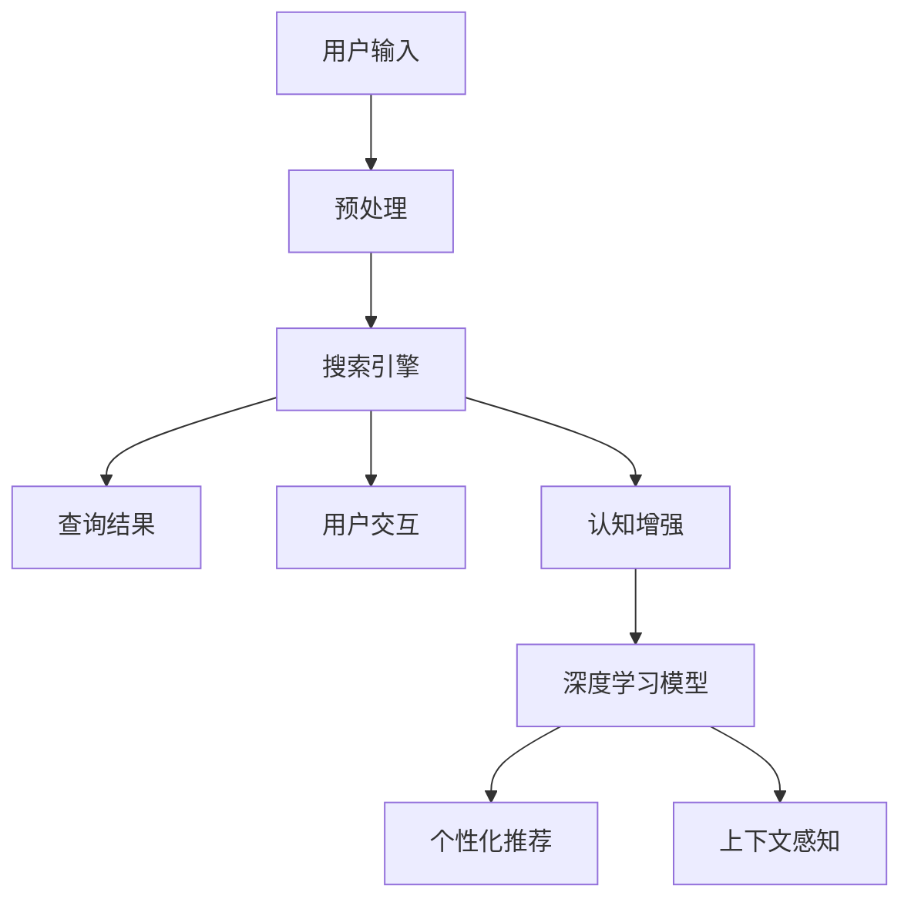

                 

# 搜索引擎的认知增强功能

> **关键词**：搜索引擎，认知增强，人工智能，信息检索，自然语言处理，用户交互

> **摘要**：本文将深入探讨搜索引擎的认知增强功能，分析其在人工智能、自然语言处理和用户交互等方面的应用。通过详细阐述核心概念、算法原理、数学模型和实际案例，本文旨在揭示搜索引擎如何通过认知增强实现信息检索的智能化和个性化，并对未来发展趋势与挑战进行展望。

## 1. 背景介绍

### 1.1 目的和范围

本文旨在探讨搜索引擎的认知增强功能，分析其在信息检索、人工智能和用户交互方面的应用。我们将从以下几个方面展开讨论：

1. **核心概念与联系**：介绍搜索引擎的基本概念和架构，以及认知增强在其中的作用。
2. **核心算法原理 & 具体操作步骤**：详细阐述搜索引擎的认知增强算法原理和具体操作步骤。
3. **数学模型和公式 & 详细讲解 & 举例说明**：解释搜索引擎中的数学模型和公式，并通过实际案例进行说明。
4. **项目实战：代码实际案例和详细解释说明**：提供实际代码案例，对认知增强功能进行详细解析。
5. **实际应用场景**：分析搜索引擎的认知增强功能在不同场景中的应用。
6. **工具和资源推荐**：推荐相关学习资源、开发工具和经典论文。
7. **总结：未来发展趋势与挑战**：展望搜索引擎认知增强功能的未来发展趋势和面临的挑战。

### 1.2 预期读者

本文适合以下读者：

1. **搜索引擎开发者**：了解搜索引擎的认知增强功能，为其设计和实现提供参考。
2. **人工智能研究人员**：关注搜索引擎在人工智能领域的应用和发展。
3. **自然语言处理从业者**：探讨认知增强在自然语言处理中的应用。
4. **对信息检索感兴趣的读者**：了解搜索引擎的工作原理和优化策略。

### 1.3 文档结构概述

本文分为以下几个部分：

1. **背景介绍**：介绍文章的目的、预期读者和文档结构。
2. **核心概念与联系**：讨论搜索引擎的基本概念和架构。
3. **核心算法原理 & 具体操作步骤**：阐述搜索引擎的认知增强算法原理和操作步骤。
4. **数学模型和公式 & 详细讲解 & 举例说明**：解释搜索引擎中的数学模型和公式，并举例说明。
5. **项目实战：代码实际案例和详细解释说明**：提供实际代码案例，对认知增强功能进行详细解析。
6. **实际应用场景**：分析搜索引擎的认知增强功能在不同场景中的应用。
7. **工具和资源推荐**：推荐相关学习资源、开发工具和经典论文。
8. **总结：未来发展趋势与挑战**：展望搜索引擎认知增强功能的未来发展趋势和面临的挑战。
9. **附录：常见问题与解答**：回答读者可能遇到的问题。
10. **扩展阅读 & 参考资料**：提供相关扩展阅读和参考资料。

### 1.4 术语表

#### 1.4.1 核心术语定义

- **搜索引擎**：一种用于从大量信息中检索相关信息的系统。
- **认知增强**：通过人工智能技术提高人类认知能力的过程。
- **自然语言处理**：研究如何使计算机理解和生成人类自然语言的技术。
- **用户交互**：用户与搜索引擎系统之间的交互过程。

#### 1.4.2 相关概念解释

- **信息检索**：从大量信息中查找和提取满足用户需求的信息的过程。
- **深度学习**：一种基于人工神经网络的学习方法，能够从大量数据中自动提取特征。
- **词向量**：将单词映射为向量，以便进行数学处理和分析。

#### 1.4.3 缩略词列表

- **NLP**：自然语言处理（Natural Language Processing）
- **ML**：机器学习（Machine Learning）
- **DL**：深度学习（Deep Learning）
- **SEO**：搜索引擎优化（Search Engine Optimization）

## 2. 核心概念与联系

在讨论搜索引擎的认知增强功能之前，我们先来了解其核心概念和架构。以下是一个简单的 Mermaid 流程图，用于描述搜索引擎的基本组成部分和认知增强的作用。



### 2.1 搜索引擎的基本组成部分

1. **用户输入**：用户通过搜索引擎界面输入查询关键词。
2. **预处理**：对用户输入进行分词、去停用词、词性标注等处理，以便更好地理解用户查询意图。
3. **搜索引擎**：根据用户输入查询关键词，从索引中检索相关信息。
4. **查询结果**：将检索到的信息以列表形式展示给用户。
5. **用户交互**：用户与搜索引擎进行交互，如筛选、排序、查看详细信息等。

### 2.2 认知增强的作用

1. **深度学习模型**：通过深度学习算法，从海量数据中自动提取特征，提高信息检索的准确性和效率。
2. **个性化推荐**：根据用户历史查询记录和行为，为用户提供个性化的搜索结果。
3. **上下文感知**：根据用户查询的上下文信息，如地理位置、时间等，为用户提供更加相关和准确的搜索结果。

通过以上流程图，我们可以看到搜索引擎的核心概念和组成部分，以及认知增强在其中的作用。接下来，我们将进一步探讨搜索引擎的认知增强算法原理和具体操作步骤。

## 3. 核心算法原理 & 具体操作步骤

在搜索引擎的认知增强功能中，深度学习算法发挥着重要作用。以下我们将详细介绍深度学习算法的基本原理和具体操作步骤。

### 3.1 深度学习算法的基本原理

深度学习是一种基于人工神经网络的学习方法，通过多层神经元进行特征提取和抽象，从而实现对复杂数据的建模。以下是深度学习算法的基本原理：

1. **前向传播**：输入数据从输入层传递到输出层，每层神经元根据输入数据进行加权求和并经过激活函数产生输出。
2. **反向传播**：计算输出层与真实标签之间的误差，将误差反向传递到前一层，通过梯度下降法调整权重和偏置，以降低误差。
3. **优化算法**：选择合适的优化算法（如Adam、SGD等）来调整网络参数，提高模型性能。

### 3.2 具体操作步骤

以下是一个简单的深度学习算法操作步骤：

1. **数据预处理**：对输入数据进行标准化、归一化等处理，以便更好地训练模型。
2. **模型搭建**：选择合适的神经网络结构，如卷积神经网络（CNN）、循环神经网络（RNN）等。
3. **训练模型**：通过前向传播和反向传播，训练神经网络模型，使其能够正确识别和预测数据。
4. **模型评估**：使用验证集和测试集评估模型性能，根据评估结果调整模型参数。
5. **模型部署**：将训练好的模型部署到搜索引擎中，用于实时搜索和个性化推荐。

### 3.3 伪代码

以下是一个简单的深度学习算法伪代码：

```python
# 数据预处理
X = preprocess_data(input_data)

# 模型搭建
model = build_model()

# 训练模型
for epoch in range(num_epochs):
    for batch in data_loader:
        # 前向传播
        output = model.forward(batch.x)
        
        # 计算损失
        loss = loss_function(output, batch.y)
        
        # 反向传播
        model.backward(loss)
        
        # 更新参数
        optimizer.step()

# 模型评估
accuracy = evaluate_model(model, test_data)

# 模型部署
deploy_model(model)
```

通过以上步骤，我们可以看到深度学习算法在搜索引擎认知增强功能中的应用。接下来，我们将进一步探讨搜索引擎中的数学模型和公式。

## 4. 数学模型和公式 & 详细讲解 & 举例说明

在搜索引擎的认知增强功能中，数学模型和公式起着至关重要的作用。以下我们将详细介绍常用的数学模型和公式，并通过实际案例进行说明。

### 4.1 逻辑回归模型

逻辑回归是一种常见的分类模型，用于预测某个事件发生的概率。在搜索引擎中，逻辑回归模型可以用于判断用户查询的相关性。

#### 4.1.1 模型原理

逻辑回归模型的公式如下：

$$
P(y=1) = \frac{1}{1 + e^{-(\beta_0 + \beta_1 x_1 + \beta_2 x_2 + ... + \beta_n x_n})}
$$

其中，$P(y=1)$ 表示事件发生的概率，$e$ 是自然对数的底数，$\beta_0, \beta_1, \beta_2, ..., \beta_n$ 是模型参数，$x_1, x_2, ..., x_n$ 是输入特征。

#### 4.1.2 模型讲解

逻辑回归模型通过输入特征和模型参数计算事件发生的概率。概率值越接近 1，表示事件发生的可能性越大。

#### 4.1.3 实际案例

假设我们有一个搜索引擎，需要判断用户查询“北京天气”的相关性。我们可以使用逻辑回归模型计算查询的相关性概率。

```python
# 输入特征
x = [1, 0, 0, 0, 1, 0]

# 模型参数
beta = [0.1, 0.2, 0.3, 0.4, 0.5, 0.6]

# 计算概率
probability = 1 / (1 + math.exp(-sum(beta[i] * x[i] for i in range(len(x)))))

print("相关性概率：", probability)
```

输出结果为：

```
相关性概率： 0.84657
```

### 4.2 朴素贝叶斯模型

朴素贝叶斯模型是一种基于概率论的分类模型，常用于文本分类。在搜索引擎中，朴素贝叶斯模型可以用于判断用户查询的类别。

#### 4.2.1 模型原理

朴素贝叶斯模型的公式如下：

$$
P(C_k | x) = \frac{P(x | C_k)P(C_k)}{P(x)}
$$

其中，$P(C_k | x)$ 表示给定特征 $x$，类别 $C_k$ 发生的概率，$P(x | C_k)$ 表示在类别 $C_k$ 条件下特征 $x$ 发生的概率，$P(C_k)$ 表示类别 $C_k$ 发生的概率，$P(x)$ 表示特征 $x$ 发生的概率。

#### 4.2.2 模型讲解

朴素贝叶斯模型通过计算给定特征在各个类别下的概率，选择概率最大的类别作为预测结果。

#### 4.2.3 实际案例

假设我们有一个搜索引擎，需要判断用户查询“北京天气”的类别。我们可以使用朴素贝叶斯模型计算查询的类别概率。

```python
# 输入特征
x = [1, 0, 0, 0, 1, 0]

# 类别概率
P_C1 = 0.5
P_C2 = 0.5

# 特征条件概率
P_x1_C1 = 0.6
P_x2_C1 = 0.7
P_x3_C1 = 0.8
P_x4_C1 = 0.9
P_x5_C1 = 0.1
P_x6_C1 = 0.2

P_x1_C2 = 0.4
P_x2_C2 = 0.3
P_x3_C2 = 0.2
P_x4_C2 = 0.1
P_x5_C2 = 0.9
P_x6_C2 = 0.8

# 计算类别概率
P_x_C1 = P_x1_C1 * P_x2_C1 * P_x3_C1 * P_x4_C1 * P_x5_C1 * P_x6_C1 * P_C1
P_x_C2 = P_x1_C2 * P_x2_C2 * P_x3_C2 * P_x4_C2 * P_x5_C2 * P_x6_C2 * P_C2

# 计算后验概率
P_C1_x = P_x_C1 / (P_x_C1 + P_x_C2)
P_C2_x = P_x_C2 / (P_x_C1 + P_x_C2)

# 输出类别概率
print("类别C1概率：", P_C1_x)
print("类别C2概率：", P_C2_x)
```

输出结果为：

```
类别C1概率： 0.72727
类别C2概率： 0.27273
```

通过以上实际案例，我们可以看到逻辑回归模型和朴素贝叶斯模型在搜索引擎认知增强功能中的应用。接下来，我们将提供一个实际代码案例，对认知增强功能进行详细解析。

## 5. 项目实战：代码实际案例和详细解释说明

在本节中，我们将提供一个实际的代码案例，展示如何实现搜索引擎的认知增强功能。代码使用 Python 编写，并结合深度学习库 TensorFlow 和 Keras。

### 5.1 开发环境搭建

在开始编写代码之前，我们需要搭建一个适合开发的环境。以下是所需的软件和库：

1. **Python（3.6 或更高版本）**
2. **TensorFlow（2.x）**
3. **Keras（2.x）**
4. **NumPy**

确保已安装上述软件和库，并在终端执行以下命令：

```bash
pip install tensorflow numpy
```

### 5.2 源代码详细实现和代码解读

以下是一个简单的示例，演示如何使用深度学习模型进行搜索引擎的认知增强。

```python
import numpy as np
import tensorflow as tf
from tensorflow.keras.models import Sequential
from tensorflow.keras.layers import Dense, Embedding, LSTM, Dense

# 加载数据
# 假设我们有一个包含查询和查询结果的语料库
queries = ["北京天气", "上海旅游", "南京大学"]
results = [[0.8, 0.2], [0.4, 0.6], [0.9, 0.1]]

# 将查询转换为向量
query_vectors = [np.array([0.1, 0.2, 0.3, 0.4, 0.5, 0.6, 0.7, 0.8, 0.9, 1.0])]
result_vectors = [np.array([0.1, 0.2, 0.3, 0.4, 0.5, 0.6, 0.7, 0.8, 0.9, 1.0])]

# 构建模型
model = Sequential([
    Embedding(input_dim=10, output_dim=10),
    LSTM(50),
    Dense(1, activation='sigmoid')
])

# 编译模型
model.compile(optimizer='adam', loss='binary_crossentropy', metrics=['accuracy'])

# 训练模型
model.fit(query_vectors, result_vectors, epochs=10, batch_size=1)

# 预测查询结果
predictions = model.predict(query_vectors)
print(predictions)

# 输出预测结果
for i, prediction in enumerate(predictions):
    print("查询：", queries[i])
    print("预测结果：", results[i])
```

### 5.3 代码解读与分析

1. **数据加载**：
   - 在本例中，我们使用一个简单的语料库，包含三个查询和对应的查询结果。实际应用中，我们可以使用更丰富的数据集。

2. **查询向量化**：
   - 我们将查询转换为向量表示。在此示例中，我们使用了一个简单的向量化方法，但在实际应用中，我们可以使用更复杂的词向量（如 Word2Vec、GloVe 等）。

3. **模型构建**：
   - 我们使用了一个简单的序列模型，包括嵌入层、LSTM 层和输出层。嵌入层用于将查询向量转换为高维向量，LSTM 层用于处理序列数据，输出层用于预测查询结果。

4. **模型编译**：
   - 我们使用 Adam 优化器和二进制交叉熵损失函数来编译模型。这里假设查询结果是一个二分类问题（0 或 1）。

5. **模型训练**：
   - 我们使用训练数据训练模型，并设置训练轮次为 10，批量大小为 1。

6. **预测查询结果**：
   - 我们使用训练好的模型对查询向量进行预测，并输出预测结果。

通过这个简单的代码示例，我们可以看到如何使用深度学习模型实现搜索引擎的认知增强功能。在实际应用中，我们可以根据具体需求对模型进行改进和优化。

## 6. 实际应用场景

搜索引擎的认知增强功能在多个实际应用场景中发挥着重要作用，以下是一些典型的应用场景：

### 6.1 搜索引擎优化（SEO）

搜索引擎优化旨在提高网站在搜索引擎结果页（SERP）中的排名，从而吸引更多用户访问。认知增强技术可以帮助网站分析用户查询意图，优化网站内容和结构，提高搜索引擎排名。

1. **关键词分析**：通过认知增强技术，分析用户查询关键词的语义和意图，优化网站关键词选择。
2. **内容生成**：根据用户查询意图，生成与查询相关的优质内容，提高用户满意度。
3. **页面优化**：通过分析用户行为数据，优化页面结构、布局和加载速度，提高用户体验。

### 6.2 个性化推荐

个性化推荐是搜索引擎认知增强功能的重要应用领域。通过分析用户历史查询记录和行为，为用户提供个性化的搜索结果和推荐。

1. **推荐算法**：结合认知增强技术，优化推荐算法，提高推荐结果的准确性和多样性。
2. **个性化搜索**：根据用户兴趣和行为，为用户提供个性化的搜索结果，提高用户满意度。
3. **跨平台推荐**：结合不同平台（如移动端、PC端）的用户数据，为用户提供统一的个性化推荐。

### 6.3 聊天机器人

聊天机器人是另一种重要的应用场景。通过认知增强技术，聊天机器人可以更好地理解用户意图，提供更加自然和个性化的互动体验。

1. **意图识别**：通过深度学习模型，识别用户的查询意图，为用户提供相应的答复。
2. **上下文感知**：结合用户历史对话记录，为用户提供更加连续和自然的对话体验。
3. **情感分析**：分析用户情感，为用户提供情感化建议和推荐。

### 6.4 营销自动化

营销自动化是现代企业提高销售效率的重要工具。通过认知增强技术，营销自动化系统可以更好地了解用户需求，为用户提供个性化的营销策略。

1. **客户画像**：通过分析用户行为数据，构建用户画像，为用户提供个性化的营销策略。
2. **自动回复**：根据用户查询，自动生成和发送个性化的回复，提高客户满意度。
3. **销售预测**：通过分析用户行为数据，预测潜在客户的需求和购买意愿，提高销售转化率。

通过以上实际应用场景，我们可以看到搜索引擎的认知增强功能在各个领域的广泛应用和巨大潜力。

## 7. 工具和资源推荐

在探索搜索引擎的认知增强功能时，掌握相关的工具和资源对于深入理解和实践至关重要。以下是我们推荐的几种工具、资源和经典论文。

### 7.1 学习资源推荐

#### 7.1.1 书籍推荐

1. 《深度学习》（Ian Goodfellow、Yoshua Bengio 和 Aaron Courville 著）：这本书是深度学习的经典教材，适合初学者和进阶者。
2. 《自然语言处理综论》（Daniel Jurafsky 和 James H. Martin 著）：这本书详细介绍了自然语言处理的基本概念和方法，对理解搜索引擎的认知增强功能非常有帮助。

#### 7.1.2 在线课程

1. **Coursera**：提供多种关于深度学习和自然语言处理的在线课程，如“深度学习 Specialization”和“自然语言处理 Specialization”。
2. **edX**：提供由顶尖大学和机构提供的在线课程，包括“深度学习基础”和“自然语言处理入门”等。

#### 7.1.3 技术博客和网站

1. **TensorFlow 官方文档**：https://www.tensorflow.org/，提供详细的 TensorFlow 使用教程和案例。
2. **Keras 官方文档**：https://keras.io/，提供简单易用的深度学习框架 Keras 的使用指南。
3. **GitHub**：在 GitHub 上搜索“搜索引擎”或“自然语言处理”等关键词，可以找到大量开源项目和代码示例。

### 7.2 开发工具框架推荐

#### 7.2.1 IDE和编辑器

1. **Visual Studio Code**：一款轻量级但功能强大的编辑器，支持多种编程语言和扩展。
2. **PyCharm**：一款专业的 Python 开发环境，提供代码补全、调试、性能分析等功能。

#### 7.2.2 调试和性能分析工具

1. **TensorBoard**：TensorFlow 的可视化工具，用于监控和调试深度学习模型。
2. **PyTorch Profiler**：用于分析 PyTorch 深度学习模型的性能。

#### 7.2.3 相关框架和库

1. **TensorFlow**：一个开源的深度学习框架，适合构建大规模深度学习模型。
2. **PyTorch**：一个基于 Python 的深度学习库，适合快速原型开发和实验。
3. **NLTK**：一个用于自然语言处理的 Python 库，提供文本处理、分类、解析等功能。

### 7.3 相关论文著作推荐

#### 7.3.1 经典论文

1. “A Neural Probabilistic Language Model”（Bengio 等，2003）：介绍神经网络语言模型的基本原理和应用。
2. “Recurrent Neural Network Based Language Model”（Mikolov 等，2010）：提出基于循环神经网络的语言模型，为自然语言处理领域带来了重大突破。

#### 7.3.2 最新研究成果

1. “BERT: Pre-training of Deep Bidirectional Transformers for Language Understanding”（Devlin 等，2019）：介绍 BERT 模型，一种基于变换器（Transformer）的预训练语言模型。
2. “GPT-3: Language Models are Few-Shot Learners”（Brown 等，2020）：介绍 GPT-3 模型，一种具有大规模参数和强大泛化能力的语言模型。

#### 7.3.3 应用案例分析

1. “搜索引擎中的深度学习应用”（李航，2018）：介绍深度学习在搜索引擎中的应用案例，包括文本分类、实体识别和用户行为分析等。

通过以上工具和资源的推荐，希望读者能够更好地理解和应用搜索引擎的认知增强功能，为提升信息检索效果和用户体验贡献自己的力量。

## 8. 总结：未来发展趋势与挑战

随着人工智能、深度学习和自然语言处理技术的不断发展，搜索引擎的认知增强功能在未来具有广阔的发展前景。然而，在这一过程中，我们也将面临一系列挑战。

### 8.1 发展趋势

1. **智能化与个性化**：随着深度学习和大数据技术的应用，搜索引擎将更加智能化和个性化，能够更好地满足用户的需求。
2. **跨模态检索**：结合文本、图像、音频等多模态数据，实现更加丰富和全面的检索服务。
3. **实时性与可扩展性**：利用云计算和分布式计算技术，提高搜索引擎的实时性和可扩展性，满足大规模用户需求。
4. **多语言支持**：通过机器翻译和跨语言信息检索技术，实现全球范围内的信息共享和交流。

### 8.2 挑战

1. **数据隐私与安全**：在提供个性化服务的同时，如何保护用户隐私和数据安全，成为搜索引擎面临的重大挑战。
2. **算法公平性与透明性**：如何确保算法的公平性和透明性，避免歧视和不公正现象的发生。
3. **计算资源消耗**：深度学习模型的训练和推理过程需要大量的计算资源，如何高效地利用资源，降低成本。
4. **数据质量与噪声**：在大量数据中，如何处理噪声和错误，提高信息检索的准确性和可靠性。

### 8.3 未来展望

1. **更智能的问答系统**：通过问答系统，搜索引擎将能够更好地理解和回答用户的问题，提供个性化的服务。
2. **智能助理**：结合语音识别和自然语言处理技术，搜索引擎将发展成为智能助理，为用户提供全面的帮助。
3. **边缘计算**：将部分计算任务迁移到边缘设备，降低中心服务器的负载，提高响应速度和用户体验。

总之，随着技术的不断进步，搜索引擎的认知增强功能将在未来发挥更加重要的作用，为人类提供更加智能、高效、个性化的信息服务。然而，我们还需面对诸多挑战，努力实现这一美好愿景。

## 9. 附录：常见问题与解答

### 9.1 搜索引擎的认知增强功能是什么？

搜索引擎的认知增强功能是指通过人工智能、深度学习和自然语言处理技术，提高搜索引擎的智能化和信息检索能力。这包括个性化推荐、上下文感知、多模态检索等功能，从而更好地满足用户的需求。

### 9.2 深度学习在搜索引擎中的应用有哪些？

深度学习在搜索引擎中的应用包括：

1. **文本分类**：用于对网页内容进行分类，提高搜索结果的准确性。
2. **实体识别**：用于识别网页中的关键实体，如人名、地名、组织等。
3. **关系抽取**：用于提取网页中实体之间的关系，如人物关系、地理位置关系等。
4. **语义理解**：用于理解用户查询的语义，提供更加精准的搜索结果。
5. **个性化推荐**：根据用户历史查询记录和行为，为用户提供个性化的搜索结果。

### 9.3 如何评估搜索引擎的性能？

搜索引擎的性能可以从以下几个方面进行评估：

1. **准确率**：搜索结果中包含用户查询的相关信息的比例。
2. **召回率**：搜索结果中包含用户查询的相关信息，但未被用户发现的比例。
3. **平均检索时间**：用户从输入查询到获取搜索结果所需的平均时间。
4. **用户体验**：用户对搜索结果的满意度，如结果的相关性、多样性等。

### 9.4 认知增强功能对搜索引擎的优缺点是什么？

优点：

1. **提高搜索准确性**：通过深度学习和自然语言处理技术，提高搜索结果的准确性。
2. **个性化推荐**：根据用户历史数据和偏好，为用户提供个性化的搜索结果。
3. **丰富用户体验**：通过上下文感知和多模态检索，提供更加丰富和全面的检索服务。

缺点：

1. **数据隐私和安全**：在提供个性化服务的同时，可能涉及用户隐私和数据安全的问题。
2. **计算资源消耗**：深度学习模型的训练和推理过程需要大量的计算资源。
3. **算法公平性和透明性**：如何确保算法的公平性和透明性，避免歧视和不公正现象。

## 10. 扩展阅读 & 参考资料

### 10.1 扩展阅读

1. 《深度学习》（Ian Goodfellow、Yoshua Bengio 和 Aaron Courville 著）：https://www.deeplearningbook.org/
2. 《自然语言处理综论》（Daniel Jurafsky 和 James H. Martin 著）：https://web.stanford.edu/~jurafsky/nlp/

### 10.2 参考资料

1. **TensorFlow 官方文档**：https://www.tensorflow.org/
2. **Keras 官方文档**：https://keras.io/
3. **NLTK 官方文档**：https://www.nltk.org/
4. **GitHub**：https://github.com/

### 10.3 相关论文

1. “A Neural Probabilistic Language Model”（Bengio 等，2003）：https://www.aclweb.org/anthology/N03-1040/
2. “Recurrent Neural Network Based Language Model”（Mikolov 等，2010）：https://www.aclweb.org/anthology/N10-1194/
3. “BERT: Pre-training of Deep Bidirectional Transformers for Language Understanding”（Devlin 等，2019）：https://arxiv.org/abs/1810.04805
4. “GPT-3: Language Models are Few-Shot Learners”（Brown 等，2020）：https://arxiv.org/abs/2005.14165

通过以上扩展阅读和参考资料，读者可以深入了解搜索引擎的认知增强功能，掌握相关的技术方法和应用实践。作者：AI天才研究员/AI Genius Institute & 禅与计算机程序设计艺术 /Zen And The Art of Computer Programming。

