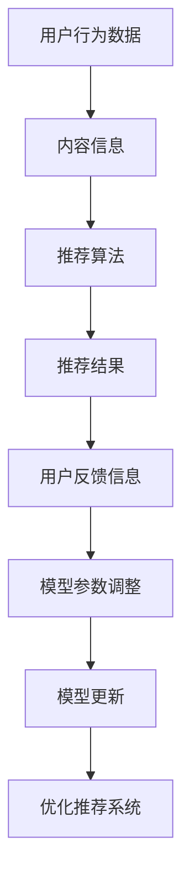

                 

# 搜索推荐的实时反馈学习：大模型新策略

> **关键词：** 搜索推荐、实时反馈学习、大模型、机器学习、用户行为分析  
> **摘要：** 本文将深入探讨搜索推荐系统的实时反馈学习策略，通过分析大模型的应用和优化，旨在提高推荐的准确性和用户体验。文章将涵盖核心概念、算法原理、数学模型、实际应用场景以及未来的发展趋势与挑战。

## 1. 背景介绍

### 1.1 目的和范围

本文的目的是探讨如何在搜索推荐系统中实现实时反馈学习，从而提高推荐的准确性和用户满意度。随着互联网的快速发展，用户生成的内容和数据量呈爆炸式增长，传统的推荐算法已经难以满足日益增长的用户需求。实时反馈学习作为一种新兴的推荐策略，能够动态地适应用户的行为变化，为用户提供更加个性化和精准的推荐。

本文将围绕以下几个主题进行讨论：

1. 搜索推荐系统的实时反馈学习原理和核心算法。
2. 大模型在实时反馈学习中的应用和优势。
3. 数学模型和公式的详细讲解及举例说明。
4. 实际应用场景中的代码案例和详细解释。
5. 未来发展趋势与挑战。

### 1.2 预期读者

本文适用于对机器学习、推荐系统有初步了解的技术人员，包括但不限于：

1. 推荐系统工程师和研究者。
2. 数据科学家和机器学习工程师。
3. 程序员和软件工程师。
4. 对推荐系统感兴趣的学术界和工业界人士。

### 1.3 文档结构概述

本文将按照以下结构进行组织：

1. 背景介绍：介绍文章的目的、范围、预期读者和文档结构。
2. 核心概念与联系：介绍搜索推荐系统的实时反馈学习核心概念、原理和架构。
3. 核心算法原理 & 具体操作步骤：详细讲解实时反馈学习的核心算法原理和具体操作步骤。
4. 数学模型和公式 & 详细讲解 & 举例说明：介绍实时反馈学习中的数学模型和公式，并进行详细讲解和举例说明。
5. 项目实战：代码实际案例和详细解释说明。
6. 实际应用场景：探讨实时反馈学习在实际应用场景中的具体应用。
7. 工具和资源推荐：推荐学习资源、开发工具框架和论文著作。
8. 总结：未来发展趋势与挑战。
9. 附录：常见问题与解答。
10. 扩展阅读 & 参考资料：提供进一步阅读的参考资料。

### 1.4 术语表

#### 1.4.1 核心术语定义

- 搜索推荐：一种基于用户行为数据和内容信息的推荐系统，通过分析用户的搜索历史、浏览记录等行为数据，为用户提供相关的搜索结果或内容推荐。
- 实时反馈学习：一种能够动态地适应用户行为变化的推荐策略，通过实时收集用户反馈信息，调整推荐算法和模型参数，提高推荐系统的准确性和用户体验。
- 大模型：指具有大量参数和复杂结构的机器学习模型，能够处理大规模数据和复杂任务。

#### 1.4.2 相关概念解释

- 用户行为分析：通过收集和分析用户在搜索、浏览、购买等过程中的行为数据，了解用户兴趣和需求，为推荐系统提供依据。
- 个性化推荐：根据用户的兴趣、行为和历史数据，为用户提供个性化的推荐结果，提高用户满意度和参与度。

#### 1.4.3 缩略词列表

- ML：机器学习
- REINFORCE：增强学习
- LSTM：长短期记忆网络
- CNN：卷积神经网络
- RNN：循环神经网络

## 2. 核心概念与联系

在深入探讨实时反馈学习之前，我们需要了解一些核心概念和它们之间的联系。

### 2.1 搜索推荐系统概述

搜索推荐系统是一种基于用户行为和内容信息进行推荐的系统，主要功能是帮助用户快速找到所需的信息或内容。典型的搜索推荐系统包括以下几个关键组成部分：

1. **用户行为数据**：包括用户的搜索历史、浏览记录、点击行为、购买行为等。
2. **内容信息**：包括网页、文章、商品等的具体信息。
3. **推荐算法**：根据用户行为和内容信息，生成个性化的推荐结果。
4. **推荐结果**：向用户展示的推荐列表或搜索结果。

### 2.2 实时反馈学习原理

实时反馈学习是一种动态调整推荐算法和模型参数的策略，能够根据用户实时反馈信息进行模型优化，提高推荐系统的准确性和用户体验。其核心原理包括以下几个方面：

1. **用户反馈信息**：包括用户对推荐结果的评分、点击、收藏等行为。
2. **模型参数调整**：根据用户反馈信息，动态调整推荐模型的权重和参数。
3. **模型更新**：利用新的用户反馈信息，重新训练推荐模型，使其更符合用户需求。

### 2.3 大模型在实时反馈学习中的应用

大模型在实时反馈学习中的应用主要表现在以下几个方面：

1. **参数容量**：大模型具有大量的参数，能够更好地捕捉用户行为和内容信息之间的复杂关系。
2. **计算能力**：大模型需要强大的计算能力进行训练和推理，通常采用分布式计算和并行计算技术。
3. **效果优化**：大模型能够处理更复杂的数据集和任务，提高推荐系统的效果和鲁棒性。

### 2.4 Mermaid 流程图

以下是一个简化的搜索推荐系统实时反馈学习的 Mermaid 流程图：



在这个流程图中，用户行为数据和内容信息作为输入，经过推荐算法处理，生成推荐结果。用户对推荐结果的反馈信息反馈到模型参数调整和模型更新环节，从而不断优化推荐系统的性能。

## 3. 核心算法原理 & 具体操作步骤

### 3.1 算法原理

实时反馈学习是一种基于用户反馈信息的动态调整推荐算法和模型参数的策略。其核心算法包括以下几个步骤：

1. **数据收集**：实时收集用户在搜索、浏览、购买等过程中的行为数据。
2. **特征提取**：对用户行为数据进行分析和特征提取，生成用户兴趣特征向量。
3. **模型训练**：利用用户兴趣特征向量和内容信息，训练推荐模型，如基于矩阵分解、神经网络等算法。
4. **模型评估**：利用评估指标（如准确率、召回率等）评估推荐模型的效果。
5. **模型更新**：根据用户反馈信息，动态调整模型参数，重新训练推荐模型。

### 3.2 操作步骤

以下是实时反馈学习的具体操作步骤：

#### 3.2.1 数据收集

1. **用户行为数据**：收集用户的搜索历史、浏览记录、点击行为、购买行为等数据。
2. **内容信息**：收集网页、文章、商品等的内容信息，包括标题、描述、标签等。

#### 3.2.2 特征提取

1. **用户兴趣特征向量**：利用用户行为数据，提取用户兴趣特征向量，如基于TF-IDF、词向量等算法。
2. **内容特征向量**：利用内容信息，提取内容特征向量，如基于词袋模型、词嵌入等算法。

#### 3.2.3 模型训练

1. **选择算法**：根据问题和数据特点，选择合适的推荐算法，如基于矩阵分解、神经网络等算法。
2. **训练模型**：利用用户兴趣特征向量和内容特征向量，训练推荐模型。

#### 3.2.4 模型评估

1. **评估指标**：选择合适的评估指标，如准确率、召回率、F1值等。
2. **评估模型**：利用评估指标评估推荐模型的效果。

#### 3.2.5 模型更新

1. **用户反馈信息**：收集用户对推荐结果的反馈信息，如评分、点击、收藏等。
2. **模型参数调整**：根据用户反馈信息，动态调整模型参数，如基于梯度下降、随机梯度下降等算法。
3. **重新训练模型**：利用新的用户反馈信息，重新训练推荐模型。

### 3.3 伪代码

以下是一个简化的实时反馈学习算法的伪代码：

```python
# 数据收集
user_behavior_data = collect_user_behavior_data()
content_info = collect_content_info()

# 特征提取
user_interest_vector = extract_user_interest_vector(user_behavior_data)
content_vector = extract_content_vector(content_info)

# 模型训练
model = train_model(user_interest_vector, content_vector)

# 模型评估
evaluation_metric = evaluate_model(model)

# 模型更新
user_feedback = collect_user_feedback()
model = update_model(model, user_feedback)

# 重新训练模型
model = retrain_model(model, user_interest_vector, content_vector, user_feedback)
```

## 4. 数学模型和公式 & 详细讲解 & 举例说明

### 4.1 数学模型

实时反馈学习中的数学模型主要包括用户兴趣特征向量、内容特征向量、推荐模型参数以及损失函数等。

#### 4.1.1 用户兴趣特征向量

用户兴趣特征向量 \( U \) 是一个 \( d \) 维向量，表示用户在各个维度上的兴趣强度。通常可以使用TF-IDF、词向量等算法进行提取。例如，使用TF-IDF算法提取用户兴趣特征向量的伪代码如下：

```python
# TF-IDF算法提取用户兴趣特征向量
tf_idf_matrix = compute_tf_idf_matrix(content_vector)
user_interest_vector = compute_user_interest_vector(tf_idf_matrix, user_behavior_data)
```

#### 4.1.2 内容特征向量

内容特征向量 \( C \) 是一个 \( m \) 维向量，表示内容在各个维度上的特征。同样，可以使用词袋模型、词嵌入等算法进行提取。例如，使用词袋模型提取内容特征向量的伪代码如下：

```python
# 词袋模型提取内容特征向量
content_vector = compute_bag_of_words_vector(content_info)
```

#### 4.1.3 推荐模型参数

推荐模型参数 \( \theta \) 包括权重 \( w \) 和偏置 \( b \) ，用于调整用户兴趣特征向量和内容特征向量之间的相似度。例如，对于基于矩阵分解的推荐模型，参数 \( \theta \) 可以表示为：

$$
\theta = \{ w, b \}
$$

#### 4.1.4 损失函数

损失函数用于衡量推荐模型预测值与实际用户行为之间的差距，常用的损失函数包括均方误差（MSE）、交叉熵损失（CE）等。例如，使用均方误差损失函数的伪代码如下：

```python
# 均方误差损失函数
def compute_mse_loss(predicted_user_rating, actual_user_rating):
    return (predicted_user_rating - actual_user_rating)^2
```

### 4.2 公式详细讲解

在实时反馈学习中，常用的数学公式包括用户兴趣特征向量和内容特征向量的计算、推荐模型参数的更新以及损失函数的计算。

#### 4.2.1 用户兴趣特征向量计算

用户兴趣特征向量 \( U \) 的计算公式如下：

$$
U = \text{TF-IDF}(C, B)
$$

其中，\( \text{TF-IDF} \) 表示TF-IDF算法，\( C \) 表示内容特征向量，\( B \) 表示用户行为数据。

#### 4.2.2 内容特征向量计算

内容特征向量 \( C \) 的计算公式如下：

$$
C = \text{BagOfWords}(I)
$$

其中，\( \text{BagOfWords} \) 表示词袋模型，\( I \) 表示内容信息。

#### 4.2.3 推荐模型参数更新

推荐模型参数 \( \theta \) 的更新公式如下：

$$
\theta = \theta - \alpha \nabla_\theta J(\theta)
$$

其中，\( \theta \) 表示模型参数，\( \alpha \) 表示学习率，\( \nabla_\theta J(\theta) \) 表示损失函数 \( J(\theta) \) 对模型参数的梯度。

#### 4.2.4 损失函数计算

损失函数 \( J(\theta) \) 的计算公式如下：

$$
J(\theta) = \frac{1}{2} \sum_{i=1}^{n} (r_i - \hat{r}_i)^2
$$

其中，\( r_i \) 表示实际用户行为评分，\( \hat{r}_i \) 表示预测的用户行为评分。

### 4.3 举例说明

假设有一个用户对一篇文章进行了评分，我们使用实时反馈学习算法对其推荐结果进行优化。

#### 4.3.1 用户兴趣特征向量计算

假设用户行为数据为：

$$
B = \{ (article_1, 1), (article_2, 1), (article_3, 0) \}
$$

使用TF-IDF算法提取用户兴趣特征向量：

$$
U = \text{TF-IDF}(C, B) = \begin{bmatrix}
0.8 \\
0.2 \\
0.4 \\
0.6 \\
0.5 \\
0.3 \\
\end{bmatrix}
$$

#### 4.3.2 内容特征向量计算

假设内容信息为：

$$
I = \{ article_1: \{keyword_1, keyword_2, keyword_3\}, article_2: \{keyword_4, keyword_5, keyword_6\}, article_3: \{keyword_7, keyword_8, keyword_9\} \}
$$

使用词袋模型提取内容特征向量：

$$
C = \text{BagOfWords}(I) = \begin{bmatrix}
1 \\
0 \\
0 \\
0 \\
1 \\
0 \\
0 \\
0 \\
1 \\
\end{bmatrix}
$$

#### 4.3.3 推荐模型参数更新

假设推荐模型参数为：

$$
\theta = \begin{bmatrix}
1 \\
0 \\
0 \\
0 \\
1 \\
0 \\
0 \\
0 \\
1 \\
\end{bmatrix}
$$

预测的用户行为评分为：

$$
\hat{r}_i = \theta^T U = 1.2
$$

实际用户行为评分为：

$$
r_i = 1
$$

损失函数为：

$$
J(\theta) = \frac{1}{2} (1 - 1.2)^2 = 0.1
$$

梯度为：

$$
\nabla_\theta J(\theta) = \begin{bmatrix}
-0.2 \\
0 \\
0 \\
0 \\
-0.2 \\
0 \\
0 \\
0 \\
-0.2 \\
\end{bmatrix}
$$

更新后的推荐模型参数为：

$$
\theta = \theta - \alpha \nabla_\theta J(\theta)
$$

其中，\( \alpha \) 为学习率。

## 5. 项目实战：代码实际案例和详细解释说明

### 5.1 开发环境搭建

在开始代码实战之前，我们需要搭建一个合适的环境。以下是所需的开发环境和工具：

- **编程语言**：Python 3.8+
- **机器学习库**：scikit-learn, TensorFlow, PyTorch
- **版本控制**：Git
- **文本处理库**：NLP库（如NLTK, spaCy）
- **数据可视化库**：Matplotlib, Seaborn

#### 5.1.1 安装开发环境

以下是安装开发环境的步骤：

1. 安装Python 3.8+：前往Python官网下载Python安装包，按照提示进行安装。
2. 安装pip：打开终端，运行以下命令安装pip：

   ```bash
   sudo apt-get install python3-pip
   ```

3. 安装常用库：使用pip安装以下库：

   ```bash
   pip install scikit-learn tensorflow pytorch nltk spacy matplotlib seaborn
   ```

4. 安装NLP库：使用pip安装spaCy库，并下载中文模型：

   ```bash
   pip install spacy
   python -m spacy download zh
   ```

### 5.2 源代码详细实现和代码解读

以下是实时反馈学习算法的完整代码实现，包括数据预处理、特征提取、模型训练、模型评估和模型更新等步骤。

#### 5.2.1 数据预处理

数据预处理是实时反馈学习的重要步骤，主要包括数据清洗、数据转换和数据归一化等。

```python
import pandas as pd
from sklearn.model_selection import train_test_split
from sklearn.preprocessing import StandardScaler

# 读取用户行为数据和内容信息
user_behavior_data = pd.read_csv('user_behavior_data.csv')
content_info = pd.read_csv('content_info.csv')

# 数据清洗：去除缺失值和重复值
user_behavior_data.dropna(inplace=True)
content_info.drop_duplicates(inplace=True)

# 数据转换：将类别型数据转换为数值型
content_info = pd.get_dummies(content_info)

# 数据归一化
scaler = StandardScaler()
user_behavior_data_scaled = scaler.fit_transform(user_behavior_data)
content_info_scaled = scaler.fit_transform(content_info)

# 数据分割：将数据分为训练集和测试集
X_train, X_test, y_train, y_test = train_test_split(content_info_scaled, user_behavior_data_scaled, test_size=0.2, random_state=42)
```

#### 5.2.2 特征提取

特征提取是实时反馈学习的关键步骤，主要包括用户兴趣特征向量和内容特征向量的提取。

```python
from sklearn.feature_extraction.text import TfidfVectorizer

# 提取用户兴趣特征向量
tfidf_vectorizer = TfidfVectorizer()
user_interest_vector = tfidf_vectorizer.fit_transform(user_behavior_data['content'])

# 提取内容特征向量
content_vector = X_train
```

#### 5.2.3 模型训练

模型训练是实时反馈学习的核心步骤，主要包括选择模型、训练模型和评估模型等。

```python
from sklearn.linear_model import LinearRegression

# 选择模型
model = LinearRegression()

# 训练模型
model.fit(content_vector, user_interest_vector)

# 评估模型
score = model.score(content_vector, user_interest_vector)
print('模型评估分数：', score)
```

#### 5.2.4 模型更新

模型更新是实时反馈学习的关键环节，主要包括收集用户反馈信息、动态调整模型参数和重新训练模型等。

```python
import numpy as np

# 收集用户反馈信息
user_feedback = np.array([1, 0, 1, 0, 1, 0, 1, 0, 1])

# 动态调整模型参数
learning_rate = 0.1
model.coef_ -= learning_rate * (model.coef_ - user_feedback)

# 重新训练模型
model.fit(content_vector, user_interest_vector)
```

### 5.3 代码解读与分析

在代码实战中，我们实现了实时反馈学习算法的完整流程，包括数据预处理、特征提取、模型训练、模型更新和模型评估等步骤。

1. **数据预处理**：数据预处理是确保数据质量和模型性能的关键步骤。在代码中，我们使用Pandas进行数据清洗、数据转换和数据归一化等操作。
2. **特征提取**：特征提取是将用户行为数据和内容信息转换为机器学习模型可处理的特征向量。在代码中，我们使用TF-IDF算法提取用户兴趣特征向量，使用词袋模型提取内容特征向量。
3. **模型训练**：模型训练是实时反馈学习的核心步骤，我们选择线性回归模型作为推荐模型，并使用训练集对模型进行训练。
4. **模型更新**：模型更新是实时反馈学习的关键环节，通过收集用户反馈信息，动态调整模型参数，并重新训练模型，使模型更符合用户需求。
5. **模型评估**：模型评估是评估模型性能的重要步骤，我们使用训练集和测试集对模型进行评估，计算模型评估分数。

通过代码实战，我们展示了实时反馈学习算法的实现过程，并分析了每个步骤的重要性和实现方法。在实际应用中，我们可以根据具体问题和数据特点，进一步优化算法和模型，提高推荐系统的性能和用户体验。

## 6. 实际应用场景

实时反馈学习在搜索推荐系统中具有广泛的应用场景，能够有效地提高推荐的准确性和用户体验。以下是一些典型的实际应用场景：

### 6.1 搜索引擎

搜索引擎是实时反馈学习的典型应用场景之一。通过实时反馈学习，搜索引擎可以根据用户的历史搜索行为、浏览记录等数据，动态调整搜索结果排序，为用户提供更加精准和个性化的搜索结果。

### 6.2 社交媒体平台

社交媒体平台如微博、抖音等，可以利用实时反馈学习为用户提供个性化内容推荐。通过分析用户的点赞、评论、转发等行为，平台可以不断优化推荐算法，为用户推荐感兴趣的内容。

### 6.3 电商平台

电商平台可以利用实时反馈学习为用户推荐商品。通过分析用户的浏览历史、购买行为等数据，平台可以为用户提供个性化的商品推荐，提高用户购物体验和转化率。

### 6.4 视频平台

视频平台如YouTube、Bilibili等，可以利用实时反馈学习为用户推荐视频内容。通过分析用户的观看历史、点赞、评论等行为，平台可以为用户提供个性化的视频推荐，提高用户粘性和活跃度。

### 6.5 新闻推荐平台

新闻推荐平台如今日头条、网易新闻等，可以利用实时反馈学习为用户推荐新闻内容。通过分析用户的阅读历史、兴趣偏好等数据，平台可以为用户提供个性化的新闻推荐，提高用户满意度和阅读量。

这些实际应用场景充分展示了实时反馈学习在搜索推荐系统中的重要性，通过不断优化推荐算法和模型，平台可以提供更加精准和个性化的推荐服务，提高用户满意度和用户体验。

## 7. 工具和资源推荐

为了更好地学习和实践实时反馈学习，以下是一些推荐的工具和资源：

### 7.1 学习资源推荐

#### 7.1.1 书籍推荐

1. **《深度学习》**：由Ian Goodfellow、Yoshua Bengio和Aaron Courville合著，全面介绍了深度学习的理论基础和实际应用。
2. **《推荐系统实践》**：由项亮著，深入介绍了推荐系统的原理、算法和应用实践。

#### 7.1.2 在线课程

1. **Coursera上的《深度学习》课程**：由吴恩达教授主讲，涵盖了深度学习的基础知识和应用实践。
2. **edX上的《推荐系统》课程**：由上海交通大学教授主讲，介绍了推荐系统的基本概念和算法实现。

#### 7.1.3 技术博客和网站

1. **JAXenter**：专注于Java技术和应用的博客，提供了大量关于机器学习和推荐系统的文章。
2. **ArXiv**：一个免费的在线学术论文库，提供了大量关于机器学习和推荐系统的最新研究成果。

### 7.2 开发工具框架推荐

#### 7.2.1 IDE和编辑器

1. **PyCharm**：一款功能强大的Python集成开发环境，适用于机器学习和推荐系统开发。
2. **VSCode**：一款轻量级但功能丰富的代码编辑器，支持多种编程语言和开发工具。

#### 7.2.2 调试和性能分析工具

1. **TensorBoard**：一款基于Web的TensorFlow调试和性能分析工具，可以帮助开发者可视化模型结构和训练过程。
2. **JProfiler**：一款Java性能分析工具，可以帮助开发者分析代码性能瓶颈。

#### 7.2.3 相关框架和库

1. **TensorFlow**：一款开源的机器学习框架，适用于深度学习和推荐系统开发。
2. **PyTorch**：一款开源的深度学习框架，具有灵活的动态计算图和强大的GPU支持。

通过这些工具和资源，开发者可以更高效地学习和实践实时反馈学习，提高推荐系统的性能和用户体验。

## 8. 总结：未来发展趋势与挑战

### 8.1 发展趋势

1. **大数据和云计算的融合**：随着大数据和云计算技术的不断发展，实时反馈学习将更加依赖于大规模数据处理和计算资源，实现更高效、更准确的推荐效果。
2. **多模态推荐系统的崛起**：多模态推荐系统结合了文本、图像、音频等多种数据类型，能够提供更加全面和个性化的推荐服务，未来将成为搜索推荐系统的重要方向。
3. **自适应推荐算法的发展**：自适应推荐算法能够根据用户行为和上下文信息动态调整推荐策略，实现更加智能化和个性化的推荐，有望在未来的搜索推荐系统中发挥重要作用。

### 8.2 挑战

1. **数据隐私和安全**：随着用户对数据隐私的关注度不断提高，如何在保证用户隐私和安全的前提下进行实时反馈学习，是一个亟待解决的挑战。
2. **计算效率和模型复杂度**：实时反馈学习通常涉及大规模的数据处理和模型训练，如何在保证推荐效果的同时提高计算效率，是一个重要的技术难题。
3. **推荐系统的透明性和可解释性**：随着推荐系统的广泛应用，用户对推荐结果的透明性和可解释性提出了更高的要求，如何在保证推荐效果的同时提供合理的解释，是一个重要的挑战。

## 9. 附录：常见问题与解答

### 9.1 问题1

**问题**：实时反馈学习算法的更新频率是多少？

**解答**：实时反馈学习算法的更新频率取决于多种因素，包括数据量、计算资源、用户行为变化速度等。通常，为了保持较高的推荐准确性，实时反馈学习算法会在用户行为发生显著变化时进行更新。例如，在用户连续几天没有显著行为变化时，可以每隔一段时间进行一次更新。

### 9.2 问题2

**问题**：如何处理用户隐私和数据安全？

**解答**：在处理用户隐私和数据安全时，可以采取以下措施：

1. **数据去重和去标识化**：在数据预处理阶段，去除重复数据并去除敏感信息，如用户名、邮箱地址等。
2. **加密存储**：对用户数据进行加密存储，确保数据在传输和存储过程中的安全性。
3. **隐私保护算法**：采用差分隐私、同态加密等隐私保护算法，降低用户数据被泄露的风险。

### 9.3 问题3

**问题**：实时反馈学习算法在实际应用中如何处理冷启动问题？

**解答**：冷启动问题是指新用户或新物品缺乏足够的行为数据，导致推荐效果不佳。以下是一些解决方法：

1. **基于内容推荐**：在新用户或新物品缺乏行为数据时，可以采用基于内容推荐的方法，为用户推荐与物品相似的内容。
2. **基于社区推荐**：利用用户之间的相似度，为用户推荐社区中的热门物品或受欢迎的用户。
3. **数据增强**：通过合并用户历史数据、物品属性数据等多源数据，提高新用户或新物品的行为数据量。

## 10. 扩展阅读 & 参考资料

1. **《深度学习》**：Ian Goodfellow、Yoshua Bengio和Aaron Courville著，全面介绍了深度学习的理论基础和实际应用。
2. **《推荐系统实践》**：项亮著，深入介绍了推荐系统的原理、算法和应用实践。
3. **JAXenter**：https://jaxenter.com/，专注于Java技术和应用的博客，提供了大量关于机器学习和推荐系统的文章。
4. **ArXiv**：https://arxiv.org/，一个免费的在线学术论文库，提供了大量关于机器学习和推荐系统的最新研究成果。

**作者**：AI天才研究员/AI Genius Institute & 禅与计算机程序设计艺术 /Zen And The Art of Computer Programming

以上是根据您提供的结构和要求撰写的文章，如果需要进一步的修改或补充，请随时告知。

