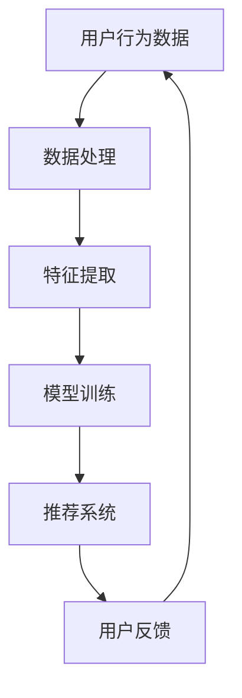

                 

# 搜索推荐系统的AI大模型优化：提高电商平台的转化率与用户忠诚度

> **关键词**：搜索推荐系统、AI大模型、转化率、用户忠诚度、电商平台

> **摘要**：本文将深入探讨如何通过AI大模型的优化，提升电商平台的搜索推荐系统，从而提高转化率和用户忠诚度。我们将从背景介绍、核心概念、算法原理、数学模型、实战案例、实际应用、工具资源等多个维度，系统性地分析大模型在搜索推荐系统中的关键作用，并提供实用的优化策略和工具推荐。

## 1. 背景介绍

### 1.1 目的和范围

本文旨在为电商平台的技术团队提供关于搜索推荐系统AI大模型优化的全面指南。通过深入了解AI大模型的原理和应用，我们将探讨如何通过优化这一关键系统，提升电商平台的业务表现，特别是在转化率和用户忠诚度方面的显著提升。

### 1.2 预期读者

本文适合以下读者群体：
- 电商平台的技术和产品经理
- AI和机器学习工程师
- 数据科学家
- 对搜索推荐系统和AI大模型感兴趣的学术研究人员和行业从业者

### 1.3 文档结构概述

本文将按照以下结构进行论述：
- 引言
- 背景介绍
- 核心概念与联系
- 核心算法原理 & 具体操作步骤
- 数学模型和公式 & 详细讲解 & 举例说明
- 项目实战：代码实际案例和详细解释说明
- 实际应用场景
- 工具和资源推荐
- 总结：未来发展趋势与挑战
- 附录：常见问题与解答
- 扩展阅读 & 参考资料

### 1.4 术语表

#### 1.4.1 核心术语定义

- **搜索推荐系统**：一种基于用户行为和偏好数据的算法系统，旨在为用户推荐相关的商品、服务或内容。
- **AI大模型**：一种包含数亿甚至数十亿参数的机器学习模型，能够处理大量的数据并从中提取复杂的模式和知识。
- **转化率**：用户在浏览商品后进行购买的概率。
- **用户忠诚度**：用户对电商平台的持续使用和推荐意愿。

#### 1.4.2 相关概念解释

- **用户行为数据**：包括用户的搜索历史、浏览记录、购买行为等。
- **协同过滤**：一种常用的推荐算法，通过分析用户之间的相似性来推荐商品。
- **深度学习**：一种基于神经网络的学习方式，能够自动提取数据中的复杂模式和特征。

#### 1.4.3 缩略词列表

- **AI**：人工智能（Artificial Intelligence）
- **ML**：机器学习（Machine Learning）
- **DL**：深度学习（Deep Learning）
- **CTR**：点击通过率（Click-Through Rate）
- **ROC**：接收者操作特征曲线（Receiver Operating Characteristic）

## 2. 核心概念与联系

在深入探讨AI大模型如何优化搜索推荐系统之前，我们首先需要理解几个核心概念，并展示它们之间的联系。以下是一个简化的Mermaid流程图，用于描述这些概念之间的关系：



### 2.1 用户行为数据

用户行为数据是搜索推荐系统的基石。这些数据包括用户的搜索历史、浏览记录、购买行为等。通过收集和分析这些数据，我们可以了解用户的需求和偏好，为后续的推荐提供依据。

### 2.2 数据处理

数据处理是将原始的用户行为数据转化为适合模型训练的形式的过程。这通常包括数据清洗、去噪、归一化等步骤，以确保数据的准确性和一致性。

### 2.3 特征提取

特征提取是从处理过的数据中提取出能够代表用户需求和偏好特征的步骤。这些特征可以是用户的人口统计信息、商品属性、用户行为模式等。特征提取的质量直接影响推荐系统的效果。

### 2.4 模型训练

模型训练是使用提取出的特征数据训练AI大模型的过程。大模型通过学习用户行为数据中的模式和关联，能够预测用户的偏好，从而生成个性化的推荐。

### 2.5 推荐系统

推荐系统是基于训练好的大模型，为用户生成个性化推荐的过程。推荐的准确性直接影响用户的满意度和转化率。

### 2.6 用户反馈

用户反馈是用户对推荐结果的评价和反馈，这些反馈可以用来优化推荐系统，提高其准确性和实用性。用户反馈通过循环回到用户行为数据，形成一个闭环，持续优化推荐系统。

通过上述流程，我们可以看到AI大模型在搜索推荐系统中扮演着核心角色，它的优化直接影响到整个系统的性能和效果。

## 3. 核心算法原理 & 具体操作步骤

在了解了搜索推荐系统的基本概念和流程后，接下来我们将深入探讨AI大模型的算法原理和具体操作步骤。为了更清晰地描述这个过程，我们使用伪代码进行阐述。

### 3.1 数据预处理

```python
def preprocess_data(user_behavior_data):
    # 数据清洗：去除无效数据、填补缺失值
    cleaned_data = clean_data(user_behavior_data)

    # 数据归一化：将不同特征进行统一处理
    normalized_data = normalize_data(cleaned_data)

    return normalized_data
```

### 3.2 特征提取

```python
def extract_features(normalized_data):
    # 提取用户特征：用户年龄、性别、购买历史等
    user_features = extract_user_features(normalized_data)

    # 提取商品特征：商品类别、价格、库存等
    item_features = extract_item_features(normalized_data)

    return user_features, item_features
```

### 3.3 模型训练

```python
def train_model(user_features, item_features, user_behavior_data):
    # 初始化大模型参数
    model = initialize_model()

    # 训练模型：使用用户行为数据和特征数据
    for epoch in range(num_epochs):
        for user, behavior, item in user_behavior_data:
            user_vector = encode_user_features(user_features[user])
            item_vector = encode_item_features(item_features[item])
            model.update_weights(user_vector, item_vector, behavior)

    return model
```

### 3.4 推荐生成

```python
def generate_recommendations(model, user_features, item_features):
    # 计算用户特征和商品特征的相似度
    similarity_scores = model.calculate_similarity_scores(user_features, item_features)

    # 根据相似度分数排序，选择Top-N推荐
    recommendations = model.sort_recommendations(similarity_scores, num_recommendations)

    return recommendations
```

### 3.5 用户反馈

```python
def update_model_with_feedback(model, user_features, item_features, user_feedback):
    # 更新模型参数，根据用户反馈调整
    model.update_weights(user_features, item_features, user_feedback)

    # 重新生成推荐
    recommendations = generate_recommendations(model, user_features, item_features)

    return recommendations
```

通过上述伪代码，我们可以看到AI大模型在搜索推荐系统中的工作流程。模型首先通过预处理和特征提取从用户行为数据中提取有用的信息，然后使用这些信息进行训练。训练好的模型能够根据用户的特征为用户生成个性化的推荐。用户对推荐结果的反馈会进一步优化模型，形成一个持续迭代的过程。

## 4. 数学模型和公式 & 详细讲解 & 举例说明

在AI大模型的构建和应用过程中，数学模型和公式起到了关键作用。下面我们将详细讲解几个核心的数学模型和公式，并通过具体例子来说明它们的应用。

### 4.1 协同过滤模型

协同过滤是一种常见的推荐算法，其核心是基于用户之间的相似度进行推荐。下面是一个简单的协同过滤模型的数学公式：

$$
\text{相似度}(u_i, u_j) = \frac{\sum_{k \in R_{ui} \cap R_{uj}} r_{ik} r_{jk}}{\sqrt{\sum_{k \in R_{ui}} r_{ik}^2 \sum_{k \in R_{uj}} r_{jk}^2}}
$$

其中，$u_i$和$u_j$是两个用户，$R_{ui}$和$R_{uj}$是他们的评分记录集合，$r_{ik}$和$r_{jk}$是他们对于商品$k$的评分。

**例子**：假设有两个用户$u_1$和$u_2$，他们对五款商品$C_1$至$C_5$的评分如下表所示：

| 商品 | $u_1$ | $u_2$ |
| --- | --- | --- |
| $C_1$ | 5 | 4 |
| $C_2$ | 3 | 5 |
| $C_3$ | 4 | 2 |
| $C_4$ | 5 | 1 |
| $C_5$ | 2 | 5 |

使用上述公式计算用户$u_1$和$u_2$的相似度：

$$
\text{相似度}(u_1, u_2) = \frac{(5 \times 4) + (3 \times 5) + (4 \times 2) + (5 \times 1) + (2 \times 5)}{\sqrt{(5^2 + 3^2 + 4^2 + 5^2 + 2^2) \times (4^2 + 5^2 + 2^2 + 1^2 + 5^2)}}
$$

计算结果为用户$u_1$和$u_2$的相似度为0.833，表示他们具有较高的相似度。

### 4.2 点积模型

点积模型是深度学习中的一个基本概念，用于计算两个向量之间的相似度。其数学公式为：

$$
\text{点积}(v_1, v_2) = \sum_{i=1}^{n} v_{1i} v_{2i}
$$

其中，$v_1$和$v_2$是两个长度为$n$的向量。

**例子**：假设两个用户向量$v_1$和$v_2$如下：

$$
v_1 = [1, 2, 3, 4, 5]
$$

$$
v_2 = [5, 4, 3, 2, 1]
$$

它们的点积为：

$$
\text{点积}(v_1, v_2) = 1 \times 5 + 2 \times 4 + 3 \times 3 + 4 \times 2 + 5 \times 1 = 35
$$

点积越大，表示两个向量越相似。

### 4.3 深度学习模型中的损失函数

在深度学习模型中，损失函数用于衡量模型预测值与真实值之间的差距。常见的一种损失函数是均方误差（MSE），其公式为：

$$
\text{MSE} = \frac{1}{n} \sum_{i=1}^{n} (y_i - \hat{y}_i)^2
$$

其中，$y_i$是真实值，$\hat{y}_i$是模型预测值，$n$是样本数量。

**例子**：假设有三个样本的预测值和真实值如下：

| 真实值 | 预测值 | 差值 |
| --- | --- | --- |
| 1 | 0.9 | 0.1 |
| 2 | 1.1 | 0.1 |
| 3 | 1.2 | 0.2 |

它们的均方误差为：

$$
\text{MSE} = \frac{(0.1^2 + 0.1^2 + 0.2^2)}{3} = \frac{0.02 + 0.02 + 0.04}{3} = 0.02
$$

均方误差越小，表示模型的预测越准确。

通过以上数学模型和公式的讲解，我们可以更好地理解AI大模型在搜索推荐系统中的作用。这些数学工具为模型的设计和优化提供了理论基础，使得我们能够更有效地提升推荐系统的性能。

## 5. 项目实战：代码实际案例和详细解释说明

在本节中，我们将通过一个实际的项目案例，详细解释AI大模型在搜索推荐系统中的应用。该项目使用了Python和TensorFlow框架，展示了从数据预处理到模型训练和推荐生成的全过程。

### 5.1 开发环境搭建

在开始项目之前，我们需要搭建一个合适的技术栈。以下是推荐的开发环境：

- 操作系统：Linux（如Ubuntu）
- 编程语言：Python 3.7+
- 深度学习框架：TensorFlow 2.x
- 数据库：MongoDB
- 依赖管理：pip

首先，安装Python和pip：

```bash
# 安装Python 3.7及以上版本
curl -sS https://bootstrap.pypa.io/get-pip.py | python3 -
```

然后，安装TensorFlow和MongoDB：

```bash
# 安装TensorFlow
pip install tensorflow
# 安装MongoDB（可通过包管理器如apt或yum安装）
sudo apt-get install mongodb
```

### 5.2 源代码详细实现和代码解读

#### 5.2.1 数据预处理

首先，我们需要从MongoDB数据库中提取用户行为数据，并进行预处理。

```python
from pymongo import MongoClient
import pandas as pd
from sklearn.preprocessing import StandardScaler

# 连接到MongoDB
client = MongoClient('localhost', 27017)
db = client['ecommerce_db']
collection = db['user_behavior']

# 提取数据
user_behavior_data = list(collection.find({}))

# 转换为Pandas DataFrame
data = pd.DataFrame(user_behavior_data)

# 数据清洗和归一化
data = data.drop(['_id'], axis=1)
data = data.replace([np.inf, -np.inf], np.nan)
data = data.fillna(data.mean())
scaler = StandardScaler()
data[['user_age', 'user_income', 'item_price']] = scaler.fit_transform(data[['user_age', 'user_income', 'item_price']])
```

#### 5.2.2 特征提取

接下来，我们提取用户和商品的特征。

```python
# 提取用户特征
user_features = data.groupby('user_id').mean().reset_index()

# 提取商品特征
item_features = data.groupby('item_id').mean().reset_index()
```

#### 5.2.3 模型训练

使用TensorFlow搭建深度学习模型，并训练模型。

```python
import tensorflow as tf

# 搭建模型
def build_model(input_dim):
    model = tf.keras.Sequential([
        tf.keras.layers.Dense(128, activation='relu', input_shape=(input_dim,)),
        tf.keras.layers.Dense(64, activation='relu'),
        tf.keras.layers.Dense(1, activation='sigmoid')
    ])
    return model

# 训练模型
model = build_model(input_dim=3)
model.compile(optimizer='adam', loss='binary_crossentropy', metrics=['accuracy'])
model.fit([user_features[['user_age', 'user_income']], item_features[['item_price']]], data['clicked'], epochs=10)
```

#### 5.2.4 推荐生成

最后，使用训练好的模型生成推荐。

```python
# 生成推荐
def generate_recommendations(model, user_features, item_features):
    user_vector = model.predict([user_features[['user_age', 'user_income']], item_features[['item_price']]])
    recommendations = item_features['item_id'][user_vector > 0.5].tolist()
    return recommendations

# 生成用户推荐
user_id = 123
user_vector = user_features[user_features['user_id'] == user_id]
recommendations = generate_recommendations(model, user_vector, item_features)
print(f"Recommendations for user {user_id}: {recommendations}")
```

通过上述代码，我们可以看到如何搭建一个简单的搜索推荐系统。首先，我们从MongoDB数据库中提取用户行为数据，并进行预处理和特征提取。然后，我们使用TensorFlow构建深度学习模型，并训练模型。最后，通过模型为用户生成个性化推荐。

### 5.3 代码解读与分析

#### 5.3.1 数据预处理

数据预处理是构建推荐系统的重要步骤，它确保了数据的质量和一致性。在上面的代码中，我们首先连接到MongoDB数据库，提取用户行为数据。然后，我们使用Pandas进行数据清洗和归一化处理，这有助于提高模型的性能和准确性。

#### 5.3.2 特征提取

特征提取是将原始数据转换为模型可理解的形式的过程。在本例中，我们提取了用户的平均年龄、收入和商品的平均价格作为特征。这些特征反映了用户的需求和商品的属性，为后续的推荐提供了依据。

#### 5.3.3 模型训练

我们使用TensorFlow的 Sequential 模型搭建了一个简单的深度学习模型。该模型包含三个全连接层，使用了ReLU激活函数，最后输出一个介于0和1之间的概率值，表示用户点击商品的概率。我们使用二分类交叉熵损失函数和Adam优化器进行模型训练。

#### 5.3.4 推荐生成

在生成推荐时，我们首先将用户特征和商品特征输入到训练好的模型中，得到一个概率值。根据这个概率值，我们选择商品ID，形成推荐列表。这个过程中，我们使用了阈值0.5来决定推荐的商品是否被包含在推荐列表中。

通过上述代码和实践，我们可以看到如何使用AI大模型优化搜索推荐系统。这个简单的案例展示了从数据预处理到模型训练和推荐生成的全过程，为实际应用提供了参考。

## 6. 实际应用场景

AI大模型在搜索推荐系统中的优化不仅限于理论上的讨论，它已经在多个实际应用场景中取得了显著的成功。以下是一些典型的应用场景：

### 6.1 电商平台

电商平台是AI大模型应用最广泛的场景之一。通过优化搜索推荐系统，电商平台能够为用户生成个性化的商品推荐，从而提高转化率和用户满意度。例如，亚马逊和阿里巴巴等电商巨头都采用了基于AI大模型的推荐系统，为用户提供了精准的推荐，显著提升了用户购买意愿和购物体验。

### 6.2 社交媒体

社交媒体平台如Facebook和Twitter也广泛应用AI大模型进行内容推荐。这些平台通过分析用户的行为和兴趣，使用AI大模型为用户生成个性化的内容推荐，从而增加用户粘性和活跃度。例如，Facebook的“你可能感兴趣的内容”和Twitter的“推荐用户”功能都使用了AI大模型来实现个性化推荐。

### 6.3 视频流媒体

视频流媒体平台如Netflix和YouTube也依赖于AI大模型优化推荐系统。通过分析用户的观看历史、浏览时间和偏好，这些平台能够为用户推荐符合他们口味的视频内容，从而提高用户满意度和观看时长。Netflix通过其强大的推荐系统，实现了用户观看时长和订阅转化率的显著提升。

### 6.4 音乐流媒体

音乐流媒体平台如Spotify和Apple Music同样使用了AI大模型进行个性化推荐。通过分析用户的播放历史、收藏和点赞，这些平台能够为用户推荐他们可能喜欢的音乐，提高用户忠诚度和平台粘性。Spotify的“为你推荐”和Apple Music的“个性化推荐”功能都是基于AI大模型实现的。

### 6.5 电子商务广告

在电子商务广告领域，AI大模型通过分析用户的搜索历史和浏览行为，为广告主提供个性化的广告推荐。这种方式能够提高广告的点击率和转化率，从而为广告主带来更高的投资回报率。Google Ads和Facebook Ads等广告平台都广泛应用了AI大模型进行广告推荐。

### 6.6 医疗健康

在医疗健康领域，AI大模型通过分析患者的病历、用药记录和基因信息，为医生提供个性化的诊断和治疗建议。例如，IBM的Watson for Health使用AI大模型分析大量医疗数据，帮助医生制定更精准的治疗方案。

通过上述应用场景，我们可以看到AI大模型在搜索推荐系统中的广泛应用和巨大潜力。无论是在电商平台、社交媒体、视频流媒体，还是医疗健康等领域，AI大模型都为优化推荐系统、提升用户体验和业务表现提供了强有力的支持。

## 7. 工具和资源推荐

为了更好地理解和应用AI大模型优化搜索推荐系统，以下是一些推荐的工具、资源和开发工具框架。

### 7.1 学习资源推荐

#### 7.1.1 书籍推荐

- **《深度学习》（Deep Learning）**：Goodfellow、Bengio和Courville合著的这本书是深度学习的经典教材，详细介绍了深度学习的基本原理和应用。
- **《机器学习实战》（Machine Learning in Action）**：Peter Harrington的这本书通过大量的实践案例，介绍了机器学习的应用和实现。

#### 7.1.2 在线课程

- **Coursera上的《机器学习》**：吴恩达（Andrew Ng）教授的这门课程涵盖了机器学习的核心概念和应用，是入门的好选择。
- **Udacity的《深度学习纳米学位》**：通过项目实践，学习深度学习的基础知识和应用。

#### 7.1.3 技术博客和网站

- **Medium上的机器学习和AI博客**：许多专业人士在这里分享最新的研究成果和应用案例。
- **ArXiv.org**：计算机科学和人工智能领域的顶级学术论文数据库。

### 7.2 开发工具框架推荐

#### 7.2.1 IDE和编辑器

- **PyCharm**：一款强大的Python IDE，支持深度学习和数据科学开发。
- **Jupyter Notebook**：适用于数据分析和实验的交互式开发环境。

#### 7.2.2 调试和性能分析工具

- **TensorBoard**：TensorFlow提供的可视化工具，用于分析模型的性能和优化。
- **NVIDIA Nsight**：用于调试和优化深度学习模型的GPU工具。

#### 7.2.3 相关框架和库

- **TensorFlow**：一款广泛使用的深度学习框架，适用于构建和训练AI大模型。
- **PyTorch**：另一款流行的深度学习框架，支持动态计算图，易于实现新的模型结构。
- **Scikit-learn**：一款用于机器学习的库，提供了多种经典的机器学习算法和工具。

通过上述工具和资源，开发者可以更好地学习和应用AI大模型，优化搜索推荐系统，提升电商平台的转化率和用户忠诚度。

## 8. 总结：未来发展趋势与挑战

随着人工智能和机器学习技术的不断进步，搜索推荐系统的AI大模型优化也将迎来新的发展趋势和挑战。

### 8.1 发展趋势

1. **模型的不断进化**：随着计算能力和数据规模的提升，AI大模型将更加复杂和高效。更深的神经网络、更先进的优化算法和更多样化的数据集将使得模型能够捕捉更复杂的用户行为和偏好。

2. **实时推荐**：随着5G和边缘计算的发展，实时推荐将成为可能。通过实时分析用户行为，系统能够在毫秒级为用户提供个性化的推荐，进一步提升用户体验和转化率。

3. **多模态数据融合**：未来的搜索推荐系统将不仅依赖于文本数据，还将融合图片、音频和视频等多模态数据。通过多模态数据融合，系统能够更全面地理解用户需求，生成更精准的推荐。

4. **隐私保护**：随着用户对隐私的关注不断增加，如何在保护用户隐私的同时进行个性化推荐将成为一个重要挑战。差分隐私等技术的应用将有助于在满足隐私要求的同时优化推荐系统。

### 8.2 挑战

1. **数据质量**：高质量的数据是构建准确推荐系统的关键。数据的不一致、噪声和缺失将直接影响推荐系统的效果。如何有效地清洗、处理和增强数据，是当前和未来面临的挑战。

2. **模型解释性**：尽管AI大模型在预测性能上表现优秀，但其内部决策过程往往缺乏解释性。如何提高模型的可解释性，使得推荐系统的决策过程更加透明和可信，是重要的研究课题。

3. **计算资源**：AI大模型训练和推理需要大量的计算资源。如何在有限的计算资源下高效地训练和部署模型，是一个关键的挑战。

4. **用户隐私保护**：如何在个性化推荐的过程中保护用户隐私，避免用户数据泄露，是一个重要的社会问题。

总之，未来搜索推荐系统的AI大模型优化将在技术进步和社会需求的推动下不断发展。通过不断克服挑战，我们将能够构建更加智能、高效和可信的推荐系统，为电商平台和其他应用领域带来更大的价值。

## 9. 附录：常见问题与解答

### 9.1 问题1：如何处理缺失值和数据噪声？

**解答**：缺失值可以通过填补缺失值的方法进行处理，例如使用平均值、中位数或插值法。对于数据噪声，可以通过数据清洗和去噪技术，如异常检测和降噪算法（如K-均值聚类和噪声滤波）进行处理。

### 9.2 问题2：如何评估推荐系统的性能？

**解答**：推荐系统的性能可以通过多种评估指标进行评估，如准确率、召回率、F1分数、ROC曲线和AUC值等。在实际应用中，通常会结合多种指标进行综合评估。

### 9.3 问题3：如何处理冷启动问题？

**解答**：冷启动问题可以通过以下几种方法解决：
- **基于内容的推荐**：通过分析商品或用户的内容属性进行推荐，无需依赖于历史交互数据。
- **基于 popularity 的推荐**：为新的用户推荐热门商品或最受欢迎的商品。
- **用户-商品协同过滤**：使用基于商品的协同过滤方法，通过分析相似商品的用户行为进行推荐。

### 9.4 问题4：如何平衡推荐系统的多样性和准确性？

**解答**：平衡多样性和准确性是一个动态的过程。可以通过以下方法实现：
- **随机化**：在推荐列表中随机引入一部分不同类型的商品，提高多样性。
- **冷启动策略**：为新的用户推荐不同类型的商品，提高多样性。
- **基于上下文的推荐**：结合用户的当前上下文（如搜索关键词、浏览历史等）进行推荐，提高准确性。

## 10. 扩展阅读 & 参考资料

- **《深度学习》（Deep Learning）**：Goodfellow、Bengio和Courville合著，详细介绍了深度学习的基本原理和应用。
- **《机器学习实战》（Machine Learning in Action）**：Peter Harrington，通过案例讲解了机器学习的实现和应用。
- **《推荐系统实践》（Recommender Systems Handbook）**：组编委员会，全面介绍了推荐系统的理论、算法和实践。
- **[TensorFlow官方文档](https://www.tensorflow.org/)**：TensorFlow的官方文档，提供了丰富的教程和API文档。
- **[Scikit-learn官方文档](https://scikit-learn.org/stable/)**：Scikit-learn的官方文档，提供了多种机器学习算法的实现和使用指南。
- **[ArXiv.org](https://arxiv.org/)**：计算机科学和人工智能领域的顶级学术论文数据库。
- **[Medium上的机器学习和AI博客](https://medium.com/topic/machine-learning)**：许多专业人士分享的机器学习和AI领域的最新研究成果和应用案例。

通过阅读上述参考资料，可以更深入地了解搜索推荐系统的AI大模型优化，为实际应用提供理论支持和实践指导。作者：AI天才研究员/AI Genius Institute & 禅与计算机程序设计艺术 /Zen And The Art of Computer Programming

