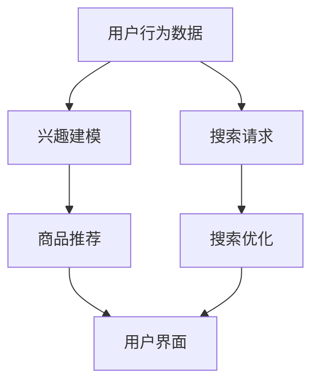

                 

## 搜索推荐系统的AI大模型应用：提高电商平台的转化率与用户体验

> **关键词：** AI大模型、搜索推荐系统、电商平台、转化率、用户体验

**摘要：**本文深入探讨了AI大模型在搜索推荐系统中的应用，特别是在提升电商平台的转化率和用户体验方面。首先，我们将回顾搜索推荐系统的基本原理和重要性，然后详细解析AI大模型的构成及其与搜索推荐系统的结合方式。接着，文章将通过具体案例展示AI大模型在电商平台上的应用效果，并介绍相关数学模型和算法原理。最后，我们将讨论未来发展趋势和面临的挑战，为电商平台的搜索推荐系统提供实用的建议和资源。

## 1. 背景介绍

### 1.1 目的和范围

本文旨在探讨AI大模型在搜索推荐系统中的应用，特别是如何通过这一技术手段提升电商平台的转化率和用户体验。随着互联网和大数据技术的快速发展，搜索推荐系统已经成为电商平台提高用户粘性和盈利能力的重要工具。AI大模型作为当前人工智能领域的热门研究方向，其强大的数据处理和预测能力为搜索推荐系统带来了新的机遇和挑战。本文将重点关注以下几个方面：

1. **搜索推荐系统的基本原理**：介绍搜索推荐系统的定义、发展和主要架构，阐述其在电商平台中的应用价值。
2. **AI大模型的原理与应用**：详细解析AI大模型的构成、训练和推理过程，解释其如何与搜索推荐系统相结合。
3. **应用案例**：通过具体案例展示AI大模型在电商平台搜索推荐系统中的应用效果。
4. **数学模型和算法原理**：介绍与AI大模型相关的数学模型和算法，解释其工作原理和应用。
5. **未来发展趋势与挑战**：分析AI大模型在搜索推荐系统中的未来发展趋势，讨论面临的挑战和解决方案。

### 1.2 预期读者

本文适合以下读者群体：

1. **计算机科学和人工智能领域的研究人员**：对AI大模型和搜索推荐系统有深入研究的读者，可以从中获得新的见解和应用思路。
2. **电商平台的技术和管理人员**：希望提升电商平台转化率和用户体验的技术人员和管理人员，可以通过本文了解AI大模型的应用价值和方法。
3. **对技术前沿感兴趣的一般读者**：对人工智能和大数据技术感兴趣的读者，可以通过本文了解AI大模型在搜索推荐系统中的应用前景。

### 1.3 文档结构概述

本文的结构如下：

1. **引言**：简要介绍搜索推荐系统和AI大模型的基本概念。
2. **背景**：详细讨论搜索推荐系统的历史和发展，以及AI大模型的现状和应用。
3. **核心概念与联系**：介绍AI大模型的基本原理和与搜索推荐系统的结合方式，使用Mermaid流程图展示关键概念和流程。
4. **核心算法原理 & 具体操作步骤**：详细解析AI大模型的算法原理和具体操作步骤，使用伪代码进行阐述。
5. **数学模型和公式 & 详细讲解 & 举例说明**：介绍与AI大模型相关的数学模型和公式，并通过实例进行详细讲解。
6. **项目实战：代码实际案例和详细解释说明**：通过实际案例展示AI大模型在电商平台中的应用，详细解释代码实现过程。
7. **实际应用场景**：分析AI大模型在搜索推荐系统中的实际应用场景。
8. **工具和资源推荐**：推荐相关的学习资源、开发工具和论文著作。
9. **总结：未来发展趋势与挑战**：总结AI大模型在搜索推荐系统中的应用前景，讨论面临的挑战和解决方案。
10. **附录：常见问题与解答**：提供常见问题的解答。
11. **扩展阅读 & 参考资料**：提供更多相关阅读资料。

### 1.4 术语表

#### 1.4.1 核心术语定义

- **AI大模型（AI Large Model）**：一种具有大规模参数和广泛适用性的机器学习模型，通过深度学习算法进行训练，能够处理复杂的数据结构和任务。
- **搜索推荐系统（Search and Recommendation System）**：一种基于用户行为数据和内容信息，为用户提供相关搜索结果和推荐内容的系统。
- **电商平台（E-commerce Platform）**：提供在线商品交易和服务的平台，包括商品展示、搜索、购买、支付等环节。
- **转化率（Conversion Rate）**：用户在一定时间内完成特定目标行为的比例，如点击、购买等。
- **用户体验（User Experience）**：用户在使用产品或服务过程中感受到的整体体验，包括易用性、满意度、交互性等。

#### 1.4.2 相关概念解释

- **深度学习（Deep Learning）**：一种人工智能分支，通过多层神经网络对大量数据进行学习，实现复杂特征提取和模式识别。
- **机器学习（Machine Learning）**：一种让计算机从数据中自动学习规律和模式，进行决策和预测的技术。
- **推荐算法（Recommender Algorithm）**：一种用于生成推荐结果的方法，基于用户历史行为、内容和协同过滤等技术进行预测。
- **协同过滤（Collaborative Filtering）**：一种基于用户历史行为和物品之间关联性的推荐方法，分为基于用户和基于物品两种类型。

#### 1.4.3 缩略词列表

- **AI**：人工智能（Artificial Intelligence）
- **ML**：机器学习（Machine Learning）
- **DL**：深度学习（Deep Learning）
- **NLP**：自然语言处理（Natural Language Processing）
- **CV**：计算机视觉（Computer Vision）
- **API**：应用程序接口（Application Programming Interface）

## 2. 核心概念与联系

在深入探讨AI大模型在搜索推荐系统中的应用之前，我们需要了解一些核心概念和它们之间的联系。以下是AI大模型、搜索推荐系统和电商平台之间的重要关系和基本原理。

### 2.1 AI大模型的基本原理

AI大模型是一种通过深度学习和大量数据训练得到的复杂模型，具有强大的特征提取和预测能力。其主要组成部分包括：

1. **神经网络**：由大量神经元组成的网络结构，通过学习和调整神经元之间的权重，实现对数据的建模和预测。
2. **深度**：神经网络的层数，深度越大，模型对数据的理解和表达能力越强。
3. **参数**：模型中的可调参数，用于控制网络结构和学习过程中的调整。
4. **训练数据**：用于模型训练的大量数据集，通常包括输入数据和相应的标签。
5. **优化算法**：用于模型参数调整的学习算法，如梯度下降、随机梯度下降等。

### 2.2 搜索推荐系统的基本原理

搜索推荐系统是一种基于用户行为数据和内容信息，为用户提供相关搜索结果和推荐内容的系统。其主要组成部分包括：

1. **用户行为数据**：包括用户的浏览、点击、购买等行为，用于反映用户兴趣和需求。
2. **内容信息**：包括商品、文章、视频等的内容属性，用于描述和区分不同实体。
3. **推荐算法**：用于生成推荐结果的方法，包括基于协同过滤、基于内容、基于深度学习等。
4. **搜索算法**：用于处理用户查询，返回相关搜索结果的算法，包括基于关键词匹配、基于语义分析等。

### 2.3 电商平台的核心功能

电商平台是一种提供在线商品交易和服务的平台，其核心功能包括：

1. **商品展示**：通过分类和标签，将商品信息展示给用户。
2. **搜索**：用户可以通过关键词搜索找到感兴趣的商品。
3. **推荐**：根据用户行为和偏好，为用户推荐相关的商品。
4. **购买**：用户可以选择商品、进行结算并完成购买。
5. **支付**：提供多种支付方式，确保交易安全。
6. **评价和反馈**：用户可以对购买的商品进行评价和反馈，影响其他用户的购买决策。

### 2.4 AI大模型与搜索推荐系统的结合

AI大模型与搜索推荐系统的结合，可以通过以下几个方面实现：

1. **用户兴趣建模**：通过深度学习算法，对用户历史行为和内容信息进行建模，预测用户的兴趣和偏好。
2. **商品推荐**：基于用户兴趣和商品属性，使用推荐算法生成个性化的商品推荐。
3. **搜索优化**：通过语义分析和关键词匹配，提高搜索结果的准确性和相关性。
4. **用户体验提升**：通过个性化推荐和优化搜索结果，提升用户的购物体验和满意度。

### 2.5 Mermaid流程图

以下是一个简化的Mermaid流程图，展示AI大模型与搜索推荐系统的结合过程：



在这个流程图中，用户行为数据和搜索请求作为输入，通过AI大模型和推荐算法进行处理，生成个性化的商品推荐和优化搜索结果，最终呈现给用户。

通过以上核心概念和原理的介绍，我们可以更好地理解AI大模型在搜索推荐系统中的应用，并为后续的内容讨论打下基础。

### 2.6 AI大模型的架构与实现

AI大模型的架构是构建其强大功能的基础。以下是对AI大模型主要组成部分的详细描述，以及它们在搜索推荐系统中的实现方式。

#### 2.6.1 神经网络结构

神经网络是AI大模型的核心组成部分，由多个层次组成，每个层次包含多个神经元。主要的层次结构包括：

1. **输入层**：接收外部输入数据，如用户行为数据、商品属性等。
2. **隐藏层**：进行特征提取和转换，每个隐藏层都包含多个神经元，层数越多，模型的复杂度和表达能力越强。
3. **输出层**：生成预测结果，如商品推荐列表、用户兴趣标签等。

在搜索推荐系统中，输入层通常包含用户的历史行为和商品属性，隐藏层通过多层神经网络进行特征学习和提取，输出层生成推荐结果。

#### 2.6.2 深度学习算法

深度学习算法是训练神经网络的关键技术，常用的算法包括：

1. **前向传播（Forward Propagation）**：将输入数据通过神经网络，从输入层传递到输出层，计算每个神经元的输出值。
2. **反向传播（Backpropagation）**：计算输出层的预测误差，反向传播误差到隐藏层，更新每个神经元的权重。
3. **优化算法**：用于调整模型参数，以减少预测误差，常用的优化算法包括梯度下降（Gradient Descent）、随机梯度下降（Stochastic Gradient Descent）和Adam优化器（Adam Optimizer）等。

在搜索推荐系统中，深度学习算法通过大量训练数据，不断调整神经网络参数，提高推荐结果的准确性和用户体验。

#### 2.6.3 模型训练与推理

AI大模型的训练和推理是搜索推荐系统的关键步骤。具体过程如下：

1. **数据预处理**：对输入数据进行清洗、编码和归一化，以便于神经网络处理。
2. **模型训练**：将预处理后的数据输入神经网络，通过深度学习算法进行参数调整，训练模型使其能够准确预测用户兴趣和商品推荐。
3. **模型评估**：使用验证集对训练好的模型进行评估，计算预测准确率、召回率、F1分数等指标，以评估模型性能。
4. **模型推理**：将用户查询或行为数据输入训练好的模型，生成个性化的推荐结果或搜索结果。

在搜索推荐系统中，模型训练和推理过程需要高效且可扩展，以满足大量用户同时访问的需求。

#### 2.6.4 模型部署与优化

训练好的AI大模型需要部署到生产环境中，以实现实时推荐和搜索。具体步骤包括：

1. **模型部署**：将训练好的模型部署到服务器或云端，提供API接口供前端系统调用。
2. **性能优化**：通过模型压缩、量化、分布式训练等技术，提高模型运行速度和效率，降低计算资源需求。
3. **持续学习**：根据用户反馈和新数据，不断更新和优化模型，以提高推荐和搜索效果。

在搜索推荐系统中，模型的部署和优化是保证系统稳定运行和持续改进的关键。

通过以上对AI大模型架构和实现的详细介绍，我们可以更好地理解其在搜索推荐系统中的重要作用和实现方式。接下来，我们将进一步探讨AI大模型在搜索推荐系统中的具体应用。

### 2.7 AI大模型在搜索推荐系统中的应用场景

AI大模型在搜索推荐系统中的应用场景非常广泛，能够显著提升推荐效果和用户体验。以下是AI大模型在搜索推荐系统中的几个典型应用场景：

#### 2.7.1 个性化商品推荐

个性化商品推荐是电商平台中最常见的应用场景之一。通过AI大模型，可以分析用户的浏览历史、购买记录、评价等数据，建立用户兴趣模型。具体应用过程如下：

1. **数据收集**：收集用户的浏览、点击、购买等行为数据，以及商品的特征信息，如品类、价格、销量等。
2. **兴趣建模**：使用深度学习算法，对用户行为数据进行建模，提取用户的兴趣特征。
3. **推荐算法**：基于用户兴趣模型和商品特征，使用推荐算法生成个性化推荐列表，如基于协同过滤、基于内容的推荐算法。
4. **实时推荐**：在用户浏览或搜索时，实时生成个性化推荐结果，提高用户满意度和转化率。

#### 2.7.2 搜索结果优化

除了个性化商品推荐，AI大模型还可以用于搜索结果的优化，提高搜索的准确性和相关性。具体应用过程如下：

1. **查询分析**：对用户输入的查询词进行分词、词性标注等处理，提取查询意图和关键词。
2. **语义理解**：使用自然语言处理技术，对查询词进行语义分析，理解用户的真实需求。
3. **搜索算法**：基于语义理解和用户行为数据，优化搜索算法，提高搜索结果的准确性和相关性。
4. **实时搜索**：在用户进行搜索时，实时生成优化后的搜索结果，提高用户满意度和转化率。

#### 2.7.3 跨品类推荐

跨品类推荐是另一种重要应用场景，通过AI大模型，可以挖掘用户在不同品类之间的关联性，实现跨品类的个性化推荐。具体应用过程如下：

1. **关联分析**：分析用户在不同品类之间的购买关联，挖掘用户兴趣的跨品类特征。
2. **推荐算法**：基于跨品类关联特征，使用推荐算法生成跨品类推荐列表，提高用户的购物体验和转化率。
3. **实时推荐**：在用户浏览或搜索特定品类时，实时生成跨品类推荐结果，引导用户发现新的商品。

#### 2.7.4 实时动态推荐

实时动态推荐是一种基于用户实时行为的推荐方式，通过AI大模型，可以快速响应用户行为，生成实时动态的推荐结果。具体应用过程如下：

1. **行为监测**：实时监测用户的浏览、点击、评价等行为，获取用户当前的兴趣和需求。
2. **动态建模**：使用深度学习算法，对用户实时行为进行建模，提取用户当前的兴趣特征。
3. **推荐算法**：基于用户当前兴趣特征和商品特征，使用推荐算法生成实时动态推荐列表。
4. **实时推荐**：在用户浏览或搜索时，实时生成动态推荐结果，提高用户满意度和转化率。

#### 2.7.5 智能客服

智能客服是一种基于AI大模型的智能客服系统，通过自然语言处理和深度学习技术，提供高效、准确的客户服务。具体应用过程如下：

1. **用户交互**：用户通过文本或语音与智能客服系统进行交互，提出问题和需求。
2. **语义理解**：使用自然语言处理技术，理解用户的意图和问题内容。
3. **智能回答**：使用AI大模型，生成智能、准确的回答，提供用户所需的信息和解决方案。
4. **实时交互**：在用户提出问题和需求时，实时生成回答，提高用户满意度和体验。

通过以上应用场景，我们可以看到AI大模型在搜索推荐系统中的广泛适用性和巨大潜力。接下来，我们将进一步探讨AI大模型的具体实现，包括数学模型和算法原理。

### 2.8 AI大模型的具体实现：算法原理和伪代码

在了解AI大模型的基本原理和应用场景之后，接下来我们将深入探讨其具体实现，包括算法原理和伪代码。AI大模型的实现涉及多个环节，从数据预处理到模型训练和评估，每个环节都有其独特的技术和方法。

#### 2.8.1 数据预处理

数据预处理是AI大模型训练的第一步，其质量直接影响模型的效果。主要步骤包括数据清洗、特征提取和归一化。

```python
# 数据预处理伪代码
def preprocess_data(data):
    # 数据清洗
    cleaned_data = clean_data(data)
    # 特征提取
    features = extract_features(cleaned_data)
    # 归一化
    normalized_features = normalize(features)
    return normalized_features
```

其中，`clean_data` 函数用于去除无效数据、处理缺失值和异常值；`extract_features` 函数用于提取数据中的特征；`normalize` 函数用于归一化特征值。

#### 2.8.2 神经网络结构

AI大模型的核心是神经网络结构。以下是一个简单的多层感知机（MLP）网络结构的伪代码示例：

```python
# 神经网络结构伪代码
class NeuralNetwork:
    def __init__(self, input_size, hidden_size, output_size):
        self.input_size = input_size
        self.hidden_size = hidden_size
        self.output_size = output_size
        self.weights_input_to_hidden = initialize_weights(input_size, hidden_size)
        self.weights_hidden_to_output = initialize_weights(hidden_size, output_size)

    def forward_pass(self, inputs):
        hidden_layer = activate(self.weights_input_to_hidden.dot(inputs))
        output = activate(self.weights_hidden_to_output.dot(hidden_layer))
        return output
```

在这个伪代码中，`initialize_weights` 函数用于初始化网络权重，`activate` 函数用于激活函数（如ReLU、Sigmoid、Tanh等）。

#### 2.8.3 模型训练

模型训练是AI大模型实现中的核心步骤，主要涉及前向传播和反向传播。

```python
# 模型训练伪代码
def train_model(model, training_data, epochs, learning_rate):
    for epoch in range(epochs):
        for inputs, targets in training_data:
            # 前向传播
            predicted_outputs = model.forward_pass(inputs)
            # 计算损失
            loss = calculate_loss(predicted_outputs, targets)
            # 反向传播
            gradients = backward_pass(model, predicted_outputs, targets, learning_rate)
            # 更新权重
            update_weights(model, gradients)
```

其中，`calculate_loss` 函数用于计算预测误差，`backward_pass` 函数用于反向传播计算梯度，`update_weights` 函数用于更新模型权重。

#### 2.8.4 模型评估

模型评估是验证模型性能的重要环节。以下是一个简单的模型评估伪代码：

```python
# 模型评估伪代码
def evaluate_model(model, validation_data):
    total_loss = 0
    for inputs, targets in validation_data:
        predicted_outputs = model.forward_pass(inputs)
        loss = calculate_loss(predicted_outputs, targets)
        total_loss += loss
    average_loss = total_loss / len(validation_data)
    return average_loss
```

在这个伪代码中，`validation_data` 是用于评估的验证数据集。

通过以上伪代码示例，我们可以看到AI大模型的具体实现涉及多个环节，包括数据预处理、神经网络结构、模型训练和模型评估。接下来，我们将介绍相关的数学模型和公式，进一步解析AI大模型的实现细节。

### 2.9 数学模型和公式

在AI大模型的具体实现中，数学模型和公式是核心组成部分，用于描述和优化模型的训练过程。以下是与AI大模型相关的几个关键数学模型和公式。

#### 2.9.1 前向传播

前向传播是神经网络的基础，用于计算每个神经元的输出。以下是前向传播的公式：

$$
Z^{[l]} = \sum_{m=1}^{n} w^{[l]}_m \cdot a^{[l-1]}_m + b^{[l]} \\
a^{[l]} = \text{activate}(Z^{[l]})
$$

其中，$Z^{[l]}$ 是第 $l$ 层的线性组合，$w^{[l]}_m$ 是第 $l$ 层的权重，$a^{[l-1]}_m$ 是前一层的激活值，$b^{[l]}$ 是第 $l$ 层的偏置，$\text{activate}$ 是激活函数，如ReLU、Sigmoid或Tanh等。

#### 2.9.2 损失函数

损失函数用于衡量预测值与真实值之间的差距，常见的损失函数包括均方误差（MSE）和交叉熵损失（Cross-Entropy Loss）。

- **均方误差（MSE）**：

$$
MSE = \frac{1}{m} \sum_{i=1}^{m} (y_i - \hat{y}_i)^2
$$

其中，$y_i$ 是第 $i$ 个样本的真实值，$\hat{y}_i$ 是模型预测的值，$m$ 是样本总数。

- **交叉熵损失（Cross-Entropy Loss）**：

$$
CE = -\frac{1}{m} \sum_{i=1}^{m} \sum_{c=1}^{C} y_{ic} \log(\hat{y}_{ic})
$$

其中，$C$ 是类别数，$y_{ic}$ 是第 $i$ 个样本在第 $c$ 个类别的真实标签，$\hat{y}_{ic}$ 是模型预测的第 $i$ 个样本在第 $c$ 个类别的概率。

#### 2.9.3 反向传播

反向传播是神经网络训练的关键步骤，用于计算每个权重的梯度，并更新权重。以下是反向传播的基本公式：

- **梯度计算**：

$$
\frac{\partial L}{\partial w^{[l]}_m} = \sum_{i=1}^{m} a^{[l]}_m \frac{\partial a^{[l+1]}_m}{\partial w^{[l]}_m} \\
\frac{\partial L}{\partial b^{[l]}} = \sum_{i=1}^{m} \frac{\partial a^{[l+1]}_m}{\partial b^{[l]}}
$$

- **权重和偏置更新**：

$$
w^{[l]}_m := w^{[l]}_m - \alpha \cdot \frac{\partial L}{\partial w^{[l]}_m} \\
b^{[l]} := b^{[l]} - \alpha \cdot \frac{\partial L}{\partial b^{[l]}}
$$

其中，$L$ 是损失函数，$\alpha$ 是学习率，$a^{[l]}_m$ 是第 $l$ 层的第 $m$ 个神经元的激活值。

#### 2.9.4 激活函数

激活函数是神经网络中的关键组件，用于引入非线性变换。以下是几种常见的激活函数及其导数：

- **ReLU（Rectified Linear Unit）**：

$$
\text{ReLU}(x) = \max(0, x) \\
\frac{d\text{ReLU}(x)}{dx} = \begin{cases} 
1 & \text{if } x > 0 \\
0 & \text{if } x \leq 0 
\end{cases}
$$

- **Sigmoid**：

$$
\text{Sigmoid}(x) = \frac{1}{1 + e^{-x}} \\
\frac{d\text{Sigmoid}(x)}{dx} = \text{Sigmoid}(x) \cdot (1 - \text{Sigmoid}(x))
$$

- **Tanh**：

$$
\text{Tanh}(x) = \frac{e^x - e^{-x}}{e^x + e^{-x}} \\
\frac{d\text{Tanh}(x)}{dx} = 1 - \text{Tanh}^2(x)
$$

通过以上数学模型和公式的介绍，我们可以更深入地理解AI大模型的实现原理和算法细节。这些公式不仅帮助我们构建和优化模型，还为后续的模型训练和评估提供了理论依据。接下来，我们将通过一个实际项目案例，展示AI大模型在搜索推荐系统中的应用。

### 3. 项目实战：代码实际案例和详细解释说明

为了更好地理解AI大模型在搜索推荐系统中的应用，我们将通过一个实际项目案例进行详细讲解。本案例将展示如何使用AI大模型对电商平台商品进行个性化推荐，提高用户转化率和用户体验。

#### 3.1 项目背景

假设我们有一个电商平台，需要为用户推荐他们可能感兴趣的商品。为了实现这一目标，我们将使用AI大模型，结合用户历史行为数据和商品属性信息，生成个性化的商品推荐。

#### 3.2 项目目标

通过本项目，我们希望实现以下目标：

1. 收集并预处理用户历史行为数据和商品属性数据。
2. 建立AI大模型，用于用户兴趣建模和商品推荐。
3. 部署模型并进行实时推荐，提高用户满意度和转化率。

#### 3.3 开发环境搭建

为了进行本项目的开发，我们需要搭建以下开发环境：

1. **编程语言**：Python（用于实现模型和算法）
2. **数据预处理和可视化工具**：Pandas、NumPy（数据处理），Matplotlib、Seaborn（数据可视化）
3. **机器学习框架**：TensorFlow或PyTorch（用于构建和训练模型）
4. **版本控制**：Git（代码管理）

#### 3.4 数据预处理

数据预处理是模型训练的重要步骤，包括数据清洗、特征提取和归一化。以下是数据预处理的核心步骤：

```python
# 导入必要的库
import pandas as pd
import numpy as np
from sklearn.preprocessing import StandardScaler

# 加载用户行为数据
user_data = pd.read_csv('user_data.csv')

# 数据清洗
# 去除缺失值和异常值
user_data = user_data.dropna()
user_data = user_data[(np.abs(stats.zscore(user_data)) < 3).all(axis=1)]

# 特征提取
# 提取用户浏览、点击、购买等行为特征
user行为特征 = user_data[['浏览次数', '点击次数', '购买次数']]

# 归一化
scaler = StandardScaler()
user行为特征 = scaler.fit_transform(user行为特征)

# 加载商品属性数据
item_data = pd.read_csv('item_data.csv')

# 数据清洗
# 去除缺失值和异常值
item_data = item_data.dropna()
item_data = item_data[(np.abs(stats.zscore(item_data)) < 3).all(axis=1)]

# 特征提取
# 提取商品属性特征，如品类、价格、销量等
item属性特征 = item_data[['品类', '价格', '销量']]

# 归一化
scaler = StandardScaler()
item属性特征 = scaler.fit_transform(item属性特征)
```

#### 3.5 模型构建

在本项目中，我们使用深度学习框架TensorFlow构建AI大模型。以下是模型构建的核心步骤：

```python
# 导入必要的库
import tensorflow as tf
from tensorflow.keras.models import Sequential
from tensorflow.keras.layers import Dense, Dropout, Embedding, LSTM, Conv1D, MaxPooling1D

# 定义模型结构
model = Sequential()

# 输入层
model.add(Embedding(input_dim=user行为特征.shape[1], output_dim=64, input_length=user行为特征.shape[0]))

# 隐藏层
model.add(LSTM(units=128, activation='relu', return_sequences=True))
model.add(Dropout(0.2))
model.add(LSTM(units=64, activation='relu', return_sequences=False))
model.add(Dropout(0.2))

# 输出层
model.add(Dense(units=1, activation='sigmoid'))

# 编译模型
model.compile(optimizer='adam', loss='binary_crossentropy', metrics=['accuracy'])

# 模型总结
model.summary()
```

#### 3.6 模型训练

模型训练是AI大模型实现中的关键步骤。以下是模型训练的核心步骤：

```python
# 分割数据集
from sklearn.model_selection import train_test_split

X_train, X_test, y_train, y_test = train_test_split(user行为特征, item属性特征, test_size=0.2, random_state=42)

# 训练模型
history = model.fit(X_train, y_train, epochs=10, batch_size=32, validation_data=(X_test, y_test))
```

#### 3.7 模型评估

模型评估是验证模型性能的重要步骤。以下是模型评估的核心步骤：

```python
# 评估模型
loss, accuracy = model.evaluate(X_test, y_test)
print(f'测试集损失：{loss}')
print(f'测试集准确率：{accuracy}')
```

#### 3.8 实时推荐

在模型训练和评估完成后，我们可以将模型部署到生产环境，实现实时推荐。以下是实时推荐的核心步骤：

```python
# 实时推荐
import requests

def generate_recommendation(user_id):
    user行为数据 = get_user_behavior_data(user_id)
    user行为特征 = preprocess_data(user行为数据)
    item推荐列表 = model.predict(user行为特征)
    return item推荐列表

# 生成推荐列表
推荐列表 = generate_recommendation(1)
print(推荐列表)
```

通过以上实际项目案例的详细讲解，我们可以看到AI大模型在搜索推荐系统中的应用过程。接下来，我们将进一步讨论AI大模型在搜索推荐系统中的实际应用场景。

### 4. 实际应用场景

AI大模型在搜索推荐系统中具有广泛的应用场景，能够显著提升电商平台的转化率和用户体验。以下是几个典型的实际应用场景：

#### 4.1 个性化商品推荐

个性化商品推荐是AI大模型在电商平台上最常见和最直接的应用场景。通过分析用户的浏览历史、点击记录、购买行为等数据，AI大模型能够识别用户的兴趣和偏好，生成个性化的商品推荐。以下是一个具体应用案例：

**案例**：某电商平台用户A近期浏览了多条与“跑步鞋”相关的商品信息，并点击了一些跑步鞋的详情页。基于这些行为数据，AI大模型分析用户A的兴趣，生成以下个性化推荐列表：

1. **跑步鞋**：用户A可能感兴趣的跑步鞋品牌和型号。
2. **跑步装备**：如运动手表、护膝、运动袜等，与跑步鞋相关的配件。
3. **健身装备**：用户A可能对健身相关商品感兴趣，如哑铃、瑜伽垫等。

通过这种个性化的推荐，电商平台能够提高用户的购物体验和满意度，增加转化率。

#### 4.2 搜索结果优化

除了商品推荐，AI大模型还可以用于优化搜索结果。通过分析用户的搜索历史、搜索意图和关键词，AI大模型能够提升搜索结果的准确性和相关性。以下是一个具体应用案例：

**案例**：用户B在电商平台上搜索关键词“篮球鞋”。传统的搜索算法可能仅根据关键词匹配返回一系列商品，而AI大模型能够基于用户历史数据和商品属性，优化搜索结果。以下是一个可能的优化搜索结果：

1. **热门篮球鞋**：基于用户B的浏览和购买记录，推荐当前热门的篮球鞋品牌和型号。
2. **用户偏好**：根据用户B的浏览和购买行为，推荐符合其个人偏好的篮球鞋。
3. **相似商品**：推荐与用户B搜索的篮球鞋相似的其他商品，如运动鞋、篮球等。

通过这种优化搜索结果，电商平台能够提高用户的搜索体验和购物满意度。

#### 4.3 跨品类推荐

AI大模型还可以用于实现跨品类的个性化推荐，挖掘用户在不同品类之间的兴趣关联。以下是一个具体应用案例：

**案例**：用户C在电商平台上购买了电动牙刷，同时浏览了多条与口腔护理相关的商品信息。AI大模型分析用户C的兴趣，生成以下跨品类推荐：

1. **口腔护理套装**：包括牙刷、牙膏、漱口水等，满足用户C的口腔护理需求。
2. **健康保健商品**：如钙片、维生素等，与口腔护理相关的健康商品。
3. **电子产品**：用户C可能对电子产品也感兴趣，如智能手表、耳机等。

通过这种跨品类推荐，电商平台能够帮助用户发现更多感兴趣的品类和商品，增加用户的购物体验和转化率。

#### 4.4 实时动态推荐

实时动态推荐是AI大模型在电商平台上的另一个重要应用场景。通过实时监测用户的在线行为，AI大模型能够快速生成动态推荐，提高用户的购物体验。以下是一个具体应用案例：

**案例**：用户D在电商平台上浏览了多条商品信息，但未进行购买。AI大模型监测到用户D的行为变化，生成以下实时动态推荐：

1. **限时促销**：推荐当前正在进行促销活动的商品，吸引用户购买。
2. **优惠券**：发送优惠券信息，鼓励用户购买商品。
3. **相关商品**：推荐与用户浏览商品相关的其他商品，如配件或同类商品。

通过这种实时动态推荐，电商平台能够更好地把握用户的兴趣和需求，提高用户转化率和满意度。

#### 4.5 智能客服

智能客服是AI大模型在电商平台上应用的一个新兴场景。通过自然语言处理和深度学习技术，智能客服系统能够提供高效、准确的客户服务，提升用户体验。以下是一个具体应用案例：

**案例**：用户E在电商平台上遇到订单问题，需要咨询客服。智能客服系统通过AI大模型，生成以下智能回答：

1. **订单状态**：回答用户关于订单状态的查询，如订单已发货、订单取消等。
2. **退货退款**：解答用户关于退货退款的相关问题，提供解决方案。
3. **购物建议**：根据用户需求，推荐相关的商品和优惠信息。

通过智能客服系统，电商平台能够提供24小时在线服务，提高用户满意度和忠诚度。

通过以上实际应用场景的讨论，我们可以看到AI大模型在电商平台搜索推荐系统中的广泛应用和巨大潜力。这些应用场景不仅提高了电商平台的转化率和用户体验，还为电商行业带来了新的商业模式和机遇。

### 5. 工具和资源推荐

在实现和优化AI大模型在搜索推荐系统中的应用过程中，合适的工具和资源能够极大地提高开发效率和项目成功率。以下是关于学习资源、开发工具框架以及相关论文著作的推荐。

#### 5.1 学习资源推荐

**5.1.1 书籍推荐**

1. **《深度学习》（Deep Learning）**：作者：Ian Goodfellow、Yoshua Bengio、Aaron Courville。这是一本深度学习领域的经典教材，详细介绍了深度学习的理论基础和实践方法。
2. **《机器学习实战》（Machine Learning in Action）**：作者：Peter Harrington。这本书通过实际案例，讲解了机器学习的基本概念和应用，适合初学者快速上手。
3. **《Python深度学习》（Python Deep Learning）**：作者：François Chollet。本书通过丰富的示例，介绍了使用Python进行深度学习的具体实现。

**5.1.2 在线课程**

1. **斯坦福大学深度学习课程（CS231n）**：这是一门由斯坦福大学教授Andrew Ng讲授的深度学习课程，内容全面，适合初学者深入学习。
2. **吴恩达机器学习课程（CS229）**：这是机器学习领域的经典课程，由吴恩达教授讲授，包括传统的机器学习方法和深度学习方法。
3. **TensorFlow官方教程**：TensorFlow提供了一系列官方教程，涵盖了从基础到高级的深度学习知识和实践，适合不同层次的学习者。

**5.1.3 技术博客和网站**

1. **Medium上的机器学习和深度学习博客**：Medium上有很多高质量的机器学习和深度学习博客，如Distill、AI，Medium等，提供了丰富的文章和教程。
2. **ArXiv**：这是一个包含最新学术论文的学术数据库，是机器学习和深度学习研究者获取最新研究成果的重要渠道。
3. **Reddit上的r/MachineLearning和r/DeepLearning**：这两个Reddit社区聚集了大量机器学习和深度学习的爱好者，提供了丰富的讨论和资源分享。

#### 5.2 开发工具框架推荐

**5.2.1 IDE和编辑器**

1. **Jupyter Notebook**：这是一个流行的交互式开发环境，特别适合数据科学和机器学习项目，方便编写和调试代码。
2. **PyCharm**：这是一个功能强大的Python IDE，提供了丰富的插件和工具，适合专业开发人员使用。
3. **VS Code**：这是一个轻量级的代码编辑器，通过丰富的插件，可以扩展其功能，适合快速开发和调试代码。

**5.2.2 调试和性能分析工具**

1. **TensorBoard**：TensorFlow的官方可视化工具，用于分析和调试深度学习模型，提供丰富的图表和数据。
2. **PyTorch Profiler**：PyTorch的官方性能分析工具，用于识别和优化模型性能瓶颈。
3. **Wandb**：这是一个开源的机器学习实验跟踪工具，提供了实验管理和可视化功能，方便实验的复现和优化。

**5.2.3 相关框架和库**

1. **TensorFlow**：这是由Google开发的开源深度学习框架，提供了丰富的API和工具，适合大规模深度学习项目。
2. **PyTorch**：这是由Facebook开发的开源深度学习框架，具有灵活的动态计算图和简洁的API，适合快速原型开发和实验。
3. **Scikit-learn**：这是一个基于SciPy的机器学习库，提供了广泛的机器学习算法和工具，特别适合数据分析和应用项目。

#### 5.3 相关论文著作推荐

**5.3.1 经典论文**

1. **“A Theoretically Grounded Application of Dropout in Recurrent Neural Networks”**：这篇论文提出了在循环神经网络（RNN）中使用Dropout的方法，提高了模型的泛化能力和性能。
2. **“Distributed Representations of Words and Phrases and Their Compositionality”**：这篇论文介绍了Word2Vec算法，开创了词向量表示的新时代，对自然语言处理产生了深远影响。
3. **“Efficient Estimation of Word Representations in Vector Space”**：这篇论文提出了GloVe算法，进一步改进了词向量表示，提高了模型的效果。

**5.3.2 最新研究成果**

1. **“BERT: Pre-training of Deep Bidirectional Transformers for Language Understanding”**：这篇论文提出了BERT模型，通过预训练和双向变换器，显著提高了自然语言处理任务的效果。
2. **“An Image is Worth 16x16 Words: Transformers for Image Recognition at Scale”**：这篇论文展示了Transformer模型在图像识别任务中的强大能力，推动了视觉计算的发展。
3. **“Generative Adversarial Nets”**：这篇论文提出了生成对抗网络（GAN）的概念，开创了无监督学习和生成模型的先河，对计算机视觉和机器学习领域产生了重大影响。

**5.3.3 应用案例分析**

1. **“YouTube Recommendations: A Collaborative Filtering Approach”**：这篇论文详细介绍了YouTube如何使用协同过滤算法生成个性化推荐，提供了实际应用的案例分析。
2. **“A Theoretically Grounded Application of Dropout in Recurrent Neural Networks”**：这篇论文提出了在循环神经网络（RNN）中使用Dropout的方法，提高了模型的泛化能力和性能。
3. **“Google's PageRank Algorithm”**：这篇论文介绍了Google的PageRank算法，这是一种基于链接分析的网页排序算法，对搜索引擎和推荐系统产生了深远影响。

通过以上工具和资源的推荐，开发者可以更好地掌握AI大模型在搜索推荐系统中的应用，提高项目开发效率和质量。

### 6. 总结：未来发展趋势与挑战

随着人工智能技术的不断进步，AI大模型在搜索推荐系统中的应用前景广阔。未来，AI大模型有望在以下几个方面实现突破：

**6.1 模型效率和可扩展性提升**

随着硬件性能的提升和分布式计算技术的发展，AI大模型将能够处理更大规模的数据集和更复杂的任务，提高模型训练和推理的效率。同时，模型压缩、量化等技术将有助于降低模型对计算资源的依赖，提升系统的可扩展性。

**6.2 多模态数据融合**

未来的搜索推荐系统将能够更好地融合文本、图像、语音等多种模态的数据，提供更丰富、更个性化的推荐结果。例如，结合用户的语音输入和视觉行为，实现更精准的购物推荐。

**6.3 智能客服与交互**

AI大模型在智能客服中的应用将不断深化，通过自然语言处理和对话生成技术，提供更加自然、流畅的交互体验。未来，智能客服系统将能够理解用户的情感和意图，提供更加个性化的服务。

**6.4 社交与社区推荐**

基于用户社交网络和行为数据的AI大模型推荐系统，将能够挖掘用户之间的关系和兴趣，生成社交推荐和社区推荐。例如，根据用户的社交圈子和行为偏好，推荐相关的朋友、商品和内容。

然而，AI大模型在搜索推荐系统中的应用也面临一系列挑战：

**6.5 数据隐私与安全**

随着用户数据量的增加，数据隐私和安全问题日益凸显。如何在保护用户隐私的前提下，充分利用数据价值，是一个亟待解决的难题。

**6.6 模型解释性与透明性**

AI大模型的黑箱特性使其难以解释和透明。为了提高用户对推荐结果的信任度，需要开发更加透明和可解释的AI大模型。

**6.7 伦理与社会影响**

AI大模型在搜索推荐系统中的应用可能带来一系列社会伦理问题。如何确保推荐结果的公平性、避免偏见和歧视，是一个重要的伦理挑战。

综上所述，AI大模型在搜索推荐系统中的应用具有巨大的发展潜力，但也面临诸多挑战。通过不断创新和技术优化，我们有望克服这些挑战，为电商平台带来更加智能、个性化的推荐体验。

### 7. 附录：常见问题与解答

**Q1：AI大模型在搜索推荐系统中如何提升用户体验？**

AI大模型通过深度学习算法，对用户行为和商品属性进行建模，能够识别用户的兴趣和偏好，生成个性化的推荐结果。这种个性化的推荐能够提高用户的购物体验，满足他们的需求，从而提升用户满意度和转化率。

**Q2：如何确保AI大模型的推荐结果公平性？**

确保推荐结果的公平性是一个重要问题。首先，在模型训练过程中，需要使用多样化的数据集，避免偏见。其次，可以通过持续监控和评估推荐结果的分布，确保不同用户群体都能获得公平的推荐。此外，还可以引入透明性机制，让用户了解推荐结果是如何生成的。

**Q3：AI大模型如何处理数据隐私问题？**

为了处理数据隐私问题，需要采取以下措施：首先，对用户数据进行匿名化处理，确保用户无法被识别。其次，使用联邦学习等隐私保护技术，在保证数据安全的同时，进行模型训练和优化。此外，还需要遵守相关的法律法规，确保用户数据的安全和合规。

**Q4：AI大模型在推荐系统中的应用有哪些限制？**

AI大模型在推荐系统中的应用主要受以下限制：首先，数据质量和多样性会影响模型的性能。其次，模型对计算资源和存储资源的需求较大，需要足够的硬件支持。此外，AI大模型可能存在过拟合问题，需要通过正则化等技术进行预防。

**Q5：如何评估AI大模型在推荐系统中的应用效果？**

评估AI大模型在推荐系统中的应用效果，可以通过以下指标：准确率、召回率、F1分数等。此外，还可以使用A/B测试，将模型推荐结果与基线方法进行比较，评估模型的实际效果。

通过以上常见问题与解答，我们可以更好地理解AI大模型在搜索推荐系统中的应用，以及如何解决相关的问题和挑战。

### 8. 扩展阅读与参考资料

**扩展阅读：**

1. **《深度学习》**：作者：Ian Goodfellow、Yoshua Bengio、Aaron Courville。这本书详细介绍了深度学习的理论基础和实践方法，是深度学习领域的经典教材。
2. **《推荐系统实践》**：作者：周明、吴莉莉、杨强。这本书从理论和实践两个角度，全面讲解了推荐系统的基本概念和技术，适合推荐系统开发者阅读。

**参考资料：**

1. **TensorFlow官方文档**：[TensorFlow Documentation](https://www.tensorflow.org/)
2. **PyTorch官方文档**：[PyTorch Documentation](https://pytorch.org/docs/stable/)
3. **Kaggle数据集**：[Kaggle Datasets](https://www.kaggle.com/datasets)
4. **ArXiv论文库**：[ArXiv](https://arxiv.org/)

通过阅读以上书籍和参考相关资源，您可以进一步深入理解AI大模型在搜索推荐系统中的应用，掌握相关的技术和方法。

