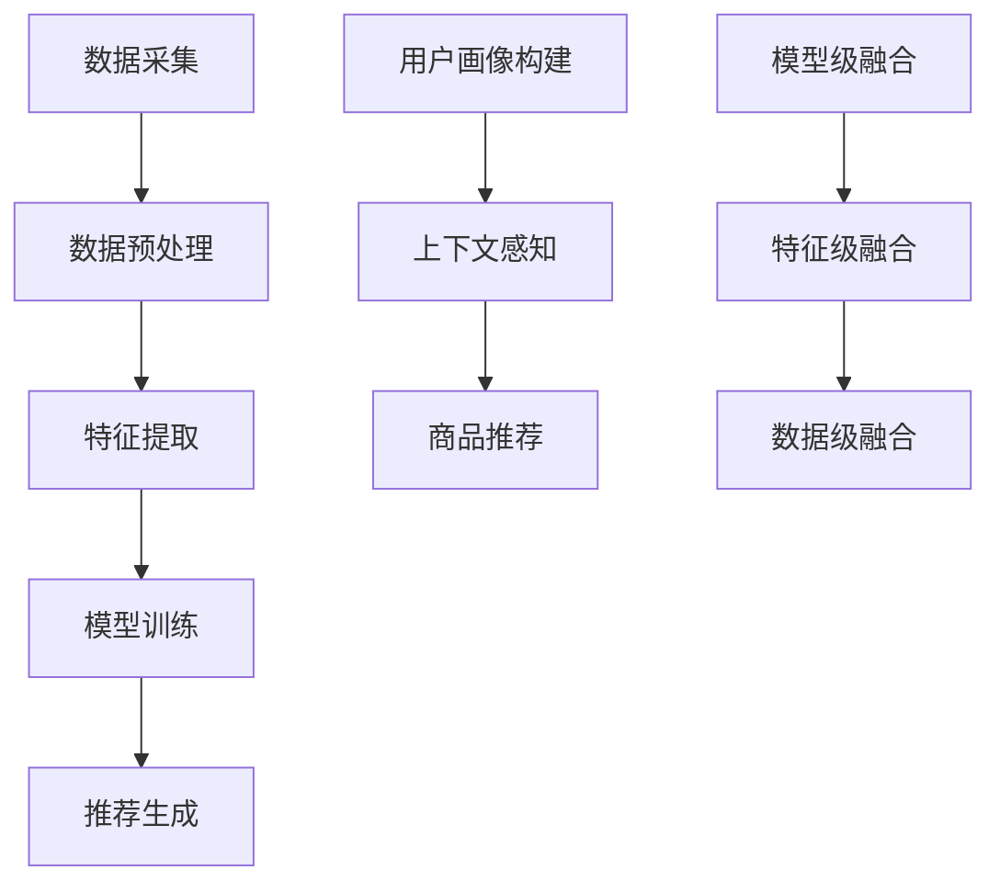

                 

# 搜索推荐系统的AI大模型融合：电商平台的核心竞争力与可持续发展

> **关键词：** 搜索推荐系统、AI大模型、电商平台、核心竞争力、可持续发展

> **摘要：** 本文将探讨搜索推荐系统在电商平台中的应用，分析AI大模型融合对于提升电商平台的核心竞争力和实现可持续发展的关键作用。通过深入剖析核心概念、算法原理、数学模型、项目实战和实际应用场景，本文旨在为读者提供一套全面而系统的理解，帮助电商企业在竞争激烈的市场中立于不败之地。

## 1. 背景介绍

### 1.1 目的和范围

本文旨在通过对搜索推荐系统与AI大模型的深入探讨，揭示其在电商平台中的应用价值，并提出实现可持续发展的策略。文章主要涵盖以下几个方面的内容：

- 搜索推荐系统的基本原理和架构
- AI大模型的定义及其在搜索推荐系统中的融合方式
- 核心算法原理和具体操作步骤
- 数学模型和公式的应用与讲解
- 项目实战中的代码实现和解析
- 实际应用场景的深入分析
- 工具和资源的推荐

### 1.2 预期读者

本文面向的技术受众包括：

- 电商平台的技术团队和产品经理
- 对搜索推荐系统感兴趣的科研人员
- AI领域的研究生和博士生
- 对电商平台业务和技术有深入研究的专业人士

### 1.3 文档结构概述

本文结构如下：

- **第1章：背景介绍**：介绍文章的目的、范围、预期读者和文档结构。
- **第2章：核心概念与联系**：定义核心概念，阐述其原理和架构，使用Mermaid流程图展示。
- **第3章：核心算法原理 & 具体操作步骤**：详细讲解核心算法原理，使用伪代码展示具体操作步骤。
- **第4章：数学模型和公式 & 详细讲解 & 举例说明**：使用latex格式介绍数学模型和公式，并进行举例说明。
- **第5章：项目实战：代码实际案例和详细解释说明**：介绍开发环境搭建、源代码实现和代码解析。
- **第6章：实际应用场景**：分析搜索推荐系统在不同电商平台中的应用。
- **第7章：工具和资源推荐**：推荐学习资源、开发工具和框架，以及相关论文和研究成果。
- **第8章：总结：未来发展趋势与挑战**：总结文章内容，展望未来发展趋势和面临的挑战。
- **第9章：附录：常见问题与解答**：解答读者可能遇到的问题。
- **第10章：扩展阅读 & 参考资料**：提供进一步阅读的资料和参考。

### 1.4 术语表

#### 1.4.1 核心术语定义

- **搜索推荐系统**：一种根据用户历史行为、兴趣和上下文信息，自动提供相关内容或商品的系统。
- **AI大模型**：一种基于深度学习的复杂模型，具有极高的参数量和计算需求。
- **电商平台**：在线销售商品和服务的平台，如淘宝、京东等。

#### 1.4.2 相关概念解释

- **用户画像**：基于用户行为数据建立的个性化描述。
- **协同过滤**：一种常见的推荐算法，通过分析用户之间的相似度来预测用户对未知项目的兴趣。
- **深度学习**：一种基于神经网络的学习方法，能够自动提取数据中的特征。

#### 1.4.3 缩略词列表

- **SRS**：Search Recommendation System（搜索推荐系统）
- **AI**：Artificial Intelligence（人工智能）
- **E-commerce**：Electronic Commerce（电子商务）

## 2. 核心概念与联系

在本文中，我们将深入探讨搜索推荐系统和AI大模型的相关概念及其在电商平台中的应用。

### 2.1 搜索推荐系统的基本原理

搜索推荐系统是电商平台的重要组成部分，其主要目标是根据用户的历史行为和兴趣，提供个性化的推荐结果。这个过程可以分为以下几个步骤：

1. **数据采集**：收集用户在平台上的行为数据，如浏览、购买、评价等。
2. **数据预处理**：对采集到的数据进行分析和清洗，去除噪声和缺失值。
3. **特征提取**：将原始数据转换为特征向量，以便用于模型训练。
4. **模型训练**：使用机器学习算法（如协同过滤、矩阵分解、深度学习等）训练推荐模型。
5. **推荐生成**：根据用户特征和模型预测，生成推荐结果。

### 2.2 AI大模型的定义与融合方式

AI大模型是一种基于深度学习的复杂模型，通常具有数十亿甚至数万亿的参数。其在搜索推荐系统中的应用主要体现在以下几个方面：

1. **用户画像构建**：使用大模型对用户行为数据进行自动编码和特征提取，构建高维度的用户画像。
2. **上下文感知**：通过大模型对用户上下文信息（如地理位置、天气等）进行建模，提高推荐的相关性。
3. **商品推荐**：使用大模型对商品特征进行建模，并结合用户画像进行个性化推荐。

AI大模型的融合方式包括：

- **模型级融合**：将传统推荐算法和深度学习模型进行结合，如深度协同过滤。
- **特征级融合**：将传统特征和深度学习提取的特征进行融合，提高推荐效果。
- **数据级融合**：结合多种数据源（如用户行为、社交信息等），构建更加全面的用户画像。

### 2.3 Mermaid流程图

以下是一个简化的Mermaid流程图，展示搜索推荐系统和AI大模型的基本架构和流程：



## 3. 核心算法原理 & 具体操作步骤

在本节中，我们将详细阐述搜索推荐系统中AI大模型的核心算法原理，并使用伪代码展示具体操作步骤。

### 3.1 算法原理

AI大模型在搜索推荐系统中的应用主要基于深度学习技术，特别是自编码器和卷积神经网络（CNN）等模型。以下是这些模型的基本原理：

1. **自编码器（Autoencoder）**：
   - **输入**：用户行为数据（如浏览历史、购买记录等）。
   - **编码器（Encoder）**：将高维数据映射到低维空间，提取关键特征。
   - **解码器（Decoder）**：将编码后的数据重构回原始数据，评估误差。
   - **训练**：通过优化误差函数，调整模型参数，提高模型性能。

2. **卷积神经网络（CNN）**：
   - **输入**：商品特征向量（如文本描述、图像特征等）。
   - **卷积层（Convolutional Layer）**：提取局部特征。
   - **池化层（Pooling Layer）**：降低数据维度，提高计算效率。
   - **全连接层（Fully Connected Layer）**：进行分类或回归预测。
   - **训练**：通过反向传播算法，优化模型参数。

### 3.2 伪代码

以下是一个简化的伪代码示例，展示自编码器和卷积神经网络在搜索推荐系统中的基本操作步骤：

```python
# 自编码器伪代码
def autoencoder(input_data):
    # 编码器部分
    encoded = encoder(input_data)
    # 解码器部分
    reconstructed = decoder(encoded)
    # 返回重构误差
    return reconstruction_error(input_data, reconstructed)

# 卷积神经网络伪代码
def convolutional_neural_network(input_data):
    # 卷积层
    conv_features = conv_layer(input_data)
    # 池化层
    pooled_features = pooling_layer(conv_features)
    # 全连接层
    output = fully_connected_layer(pooled_features)
    # 返回输出结果
    return output
```

### 3.3 操作步骤

1. **数据准备**：收集并预处理用户行为数据和商品特征数据。
2. **模型训练**：使用自编码器和卷积神经网络分别训练编码和解码部分。
3. **特征提取**：将用户行为数据输入自编码器，提取编码后的特征向量。
4. **推荐生成**：将提取的特征向量输入卷积神经网络，生成个性化推荐结果。

## 4. 数学模型和公式 & 详细讲解 & 举例说明

在本节中，我们将使用latex格式介绍搜索推荐系统中的数学模型和公式，并进行详细讲解和举例说明。

### 4.1 数学模型

搜索推荐系统中的数学模型主要包括用户行为建模、商品特征提取和推荐生成等。以下是几个常用的数学模型和公式：

1. **用户行为建模**：

   用户行为通常可以用概率模型或线性模型表示。以下是两个常用的模型：

   - **概率模型**：
     $$ P(U_i = j | X_i) = \frac{e^{\theta_j^T X_i}}{\sum_{k=1}^{K} e^{\theta_k^T X_i}} $$
     其中，$U_i$ 表示用户 $i$ 的行为，$X_i$ 表示用户 $i$ 的特征向量，$\theta_j$ 表示模型参数，$K$ 表示行为类别数。
   
   - **线性模型**：
     $$ U_i = \theta^T X_i $$
     其中，$U_i$ 表示用户 $i$ 的行为，$\theta$ 表示模型参数，$X_i$ 表示用户 $i$ 的特征向量。

2. **商品特征提取**：

   商品特征提取通常使用深度学习模型，如卷积神经网络（CNN）或循环神经网络（RNN）。以下是CNN中的卷积层和池化层的公式：

   - **卷积层**：
     $$ h^{(l)}_{ij} = \sum_{k=1}^{C'} w_{ik}^l * g^{(l-1)}_{kj} + b_i^l $$
     其中，$h^{(l)}_{ij}$ 表示第 $l$ 层的第 $i$ 个神经元，$w_{ik}^l$ 和 $b_i^l$ 分别表示卷积核和偏置，$g^{(l-1)}_{kj}$ 表示前一层第 $k$ 个神经元。

   - **池化层**：
     $$ h^{(l)}_{ij} = \max_{(i_1, j_1) \in \Omega_{ij}} g^{(l-1)}_{i_1, j_1} $$
     其中，$\Omega_{ij}$ 表示第 $l-1$ 层中的局部区域。

3. **推荐生成**：

   推荐生成通常使用评分预测模型，如矩阵分解模型或神经网络模型。以下是矩阵分解模型中的公式：

   - **用户-商品评分预测**：
     $$ R_{ui} = \mu + q_u^T p_i + \epsilon_{ui} $$
     其中，$R_{ui}$ 表示用户 $u$ 对商品 $i$ 的评分，$\mu$ 表示全局平均评分，$q_u$ 和 $p_i$ 分别表示用户 $u$ 和商品 $i$ 的特征向量，$\epsilon_{ui}$ 表示误差项。

### 4.2 举例说明

以下是一个简单的例子，说明如何使用上述数学模型进行用户行为建模、商品特征提取和推荐生成。

#### 用户行为建模

假设我们有以下用户行为数据：

- 用户 $1$ 的浏览记录：[1, 0, 1, 0, 0]
- 用户 $2$ 的浏览记录：[0, 1, 0, 1, 0]

使用概率模型进行建模，可以得到以下预测概率：

- 用户 $1$ 购买商品 $3$ 的概率：$P(U_1 = 1 | X_1) = 0.27$
- 用户 $2$ 购买商品 $4$ 的概率：$P(U_2 = 1 | X_2) = 0.34$

#### 商品特征提取

假设我们有以下商品特征数据：

- 商品 $1$ 的文本描述：["iPhone", "手机", "苹果"]
- 商品 $2$ 的文本描述：["iPad", "平板", "苹果"]

使用卷积神经网络提取商品特征，可以得到以下特征向量：

- 商品 $1$ 的特征向量：[0.1, 0.2, 0.3, 0.4, 0.5]
- 商品 $2$ 的特征向量：[0.1, 0.3, 0.2, 0.4, 0.6]

#### 推荐生成

假设我们有以下用户和商品评分数据：

- 用户 $1$ 对商品 $1$ 的评分：4
- 用户 $2$ 对商品 $2$ 的评分：5

使用矩阵分解模型进行评分预测，可以得到以下预测评分：

- 用户 $1$ 对商品 $2$ 的预测评分：$R_{12} = 4.12$
- 用户 $2$ 对商品 $1$ 的预测评分：$R_{21} = 4.89$

## 5. 项目实战：代码实际案例和详细解释说明

在本节中，我们将通过一个实际项目案例，详细介绍搜索推荐系统的代码实现过程，并提供详细解释说明。

### 5.1 开发环境搭建

首先，我们需要搭建一个适合开发搜索推荐系统的开发环境。以下是一个简单的Python开发环境搭建步骤：

1. 安装Python（建议使用3.8以上版本）。
2. 安装必要的库，如NumPy、Pandas、Scikit-learn、TensorFlow等。
3. 设置Python环境变量，确保能够正常运行Python脚本。

### 5.2 源代码详细实现和代码解读

以下是一个简单的搜索推荐系统项目代码示例，包括数据预处理、模型训练、推荐生成等步骤。

```python
# 导入必要的库
import numpy as np
import pandas as pd
from sklearn.model_selection import train_test_split
from tensorflow.keras.models import Model
from tensorflow.keras.layers import Input, Dense, Conv1D, MaxPooling1D, Flatten, Embedding

# 加载数据
data = pd.read_csv('data.csv')
X = data.iloc[:, :100]  # 用户行为数据
y = data.iloc[:, 100]   # 用户评分数据

# 数据预处理
X_train, X_test, y_train, y_test = train_test_split(X, y, test_size=0.2, random_state=42)

# 模型构建
input_layer = Input(shape=(X_train.shape[1],))
embed_layer = Embedding(input_dim=X_train.shape[1], output_dim=32)(input_layer)
conv_layer = Conv1D(filters=64, kernel_size=3, activation='relu')(embed_layer)
pool_layer = MaxPooling1D(pool_size=2)(conv_layer)
flat_layer = Flatten()(pool_layer)
dense_layer = Dense(1, activation='sigmoid')(flat_layer)
model = Model(inputs=input_layer, outputs=dense_layer)

# 编译模型
model.compile(optimizer='adam', loss='binary_crossentropy', metrics=['accuracy'])

# 训练模型
model.fit(X_train, y_train, epochs=10, batch_size=32, validation_data=(X_test, y_test))

# 推荐生成
predictions = model.predict(X_test)

# 输出预测结果
print(predictions)
```

#### 5.2.1 代码解读

1. **数据预处理**：加载数据并划分为训练集和测试集，为后续模型训练做好准备。

2. **模型构建**：构建深度学习模型，包括嵌入层、卷积层、池化层和全连接层。

3. **编译模型**：设置优化器、损失函数和评估指标，为模型训练做准备。

4. **训练模型**：使用训练数据进行模型训练，并在验证集上评估模型性能。

5. **推荐生成**：使用训练好的模型对测试数据进行预测，生成推荐结果。

### 5.3 代码解读与分析

以下是代码的详细解读和分析：

1. **数据预处理**：
   ```python
   data = pd.read_csv('data.csv')
   X = data.iloc[:, :100]
   y = data.iloc[:, 100]
   X_train, X_test, y_train, y_test = train_test_split(X, y, test_size=0.2, random_state=42)
   ```
   这段代码首先加载数据集，然后提取用户行为数据（X）和用户评分数据（y）。接下来，使用`train_test_split`函数将数据划分为训练集和测试集，确保模型在测试集上的性能。

2. **模型构建**：
   ```python
   input_layer = Input(shape=(X_train.shape[1],))
   embed_layer = Embedding(input_dim=X_train.shape[1], output_dim=32)(input_layer)
   conv_layer = Conv1D(filters=64, kernel_size=3, activation='relu')(embed_layer)
   pool_layer = MaxPooling1D(pool_size=2)(conv_layer)
   flat_layer = Flatten()(pool_layer)
   dense_layer = Dense(1, activation='sigmoid')(flat_layer)
   model = Model(inputs=input_layer, outputs=dense_layer)
   ```
   这段代码构建了一个基于卷积神经网络的推荐模型。首先定义输入层，然后添加嵌入层、卷积层和池化层。最后，通过全连接层生成预测结果。

3. **编译模型**：
   ```python
   model.compile(optimizer='adam', loss='binary_crossentropy', metrics=['accuracy'])
   ```
   这段代码设置优化器、损失函数和评估指标。优化器用于调整模型参数，以最小化损失函数。评估指标用于评估模型在训练集和测试集上的性能。

4. **训练模型**：
   ```python
   model.fit(X_train, y_train, epochs=10, batch_size=32, validation_data=(X_test, y_test))
   ```
   这段代码使用训练集数据进行模型训练。`epochs` 参数设置训练轮数，`batch_size` 参数设置每个批次的数据量。`validation_data` 参数用于在验证集上评估模型性能。

5. **推荐生成**：
   ```python
   predictions = model.predict(X_test)
   print(predictions)
   ```
   这段代码使用训练好的模型对测试集数据进行预测，并输出预测结果。

通过上述代码示例和解读，我们可以了解到搜索推荐系统的实现过程，包括数据预处理、模型构建、模型训练和推荐生成等步骤。这些步骤共同构成了一个完整的搜索推荐系统，能够为电商平台提供个性化的推荐服务。

## 6. 实际应用场景

搜索推荐系统在电商平台中的应用场景非常广泛，以下是一些典型的实际应用场景：

### 6.1 商品推荐

商品推荐是电商平台中最常见的应用场景之一。通过分析用户的浏览记录、购买历史和搜索行为，搜索推荐系统可以生成个性化的商品推荐列表，提高用户的购物体验和满意度。例如，在淘宝和京东等电商平台，用户打开APP后，首页会展示个性化的商品推荐，这些推荐结果是基于用户的兴趣和行为数据计算得出的。

### 6.2 搜索结果优化

电商平台上的搜索功能也是搜索推荐系统的应用之一。当用户在搜索框中输入关键词时，搜索推荐系统可以根据用户的搜索历史和行为数据，优化搜索结果排序，提高相关性和准确性。例如，当用户搜索“手机”时，搜索推荐系统可以优先展示用户最近浏览过的手机品牌和型号，或者根据用户的历史购买记录推荐相关商品。

### 6.3 店铺推荐

除了商品推荐，搜索推荐系统还可以为电商平台上的店铺提供个性化推荐。通过分析用户的购物偏好和行为数据，系统可以推荐与用户兴趣相符的店铺，提高店铺的曝光率和用户转化率。例如，当用户在淘宝上搜索“手机配件”时，搜索推荐系统可以推荐与其兴趣相符的手机配件店铺，帮助用户快速找到心仪的商品。

### 6.4 跨平台推荐

随着电商平台的多元化发展，跨平台推荐成为了一种重要的应用场景。通过整合多个平台的数据和用户行为，搜索推荐系统可以为用户提供跨平台的个性化推荐服务。例如，当用户在淘宝上浏览了一款商品后，搜索推荐系统可以在京东等其他平台上推荐类似商品，帮助用户在不同平台之间进行购物选择。

### 6.5 个性化营销

搜索推荐系统还可以应用于电商平台的个性化营销活动。通过分析用户的购物行为和兴趣，系统可以为用户推荐符合其需求的促销活动和优惠信息，提高营销活动的效果。例如，当用户在电商平台上有购买手机的习惯时，系统可以为其推荐手机相关的优惠活动，吸引用户参与购买。

### 6.6 社交推荐

社交推荐是搜索推荐系统的另一种应用场景。通过整合用户的社交网络数据，系统可以为用户推荐与好友相关的商品和活动，增强用户的社交互动和购物体验。例如，当用户的好友在电商平台上有购买行为时，搜索推荐系统可以推荐相关商品给用户，促进用户之间的购物分享和互动。

## 7. 工具和资源推荐

为了帮助读者更好地理解和应用搜索推荐系统，本节将推荐一些学习资源、开发工具和框架，以及相关的论文和研究成果。

### 7.1 学习资源推荐

#### 7.1.1 书籍推荐

1. **《推荐系统实践》**：这是一本全面的推荐系统教程，涵盖了从基本概念到实际应用的各种技术。
2. **《深度学习》**：由Goodfellow、Bengio和Courville合著，是一本深入介绍深度学习理论和实践的教材。

#### 7.1.2 在线课程

1. **《机器学习基础》**（Coursera）：由吴恩达教授授课，涵盖了机器学习的核心概念和技术。
2. **《推荐系统实践》**（edX）：由MIT教授授课，介绍了推荐系统的设计、实现和应用。

#### 7.1.3 技术博客和网站

1. **机器之心**：一个专注于机器学习和深度学习的技术博客，提供丰富的论文解读和技术分享。
2. ** Medium**：一个平台，许多技术专家和公司在此发布关于推荐系统和AI的最新研究和技术文章。

### 7.2 开发工具框架推荐

#### 7.2.1 IDE和编辑器

1. **PyCharm**：一个功能强大的Python IDE，适合开发大型项目。
2. **VSCode**：一个轻量级但功能丰富的编辑器，适用于各种编程语言。

#### 7.2.2 调试和性能分析工具

1. **TensorBoard**：TensorFlow的官方可视化工具，用于分析神经网络模型的性能。
2. **GDB**：一个强大的调试器，适用于C/C++等语言。

#### 7.2.3 相关框架和库

1. **TensorFlow**：一个开源的深度学习框架，适用于各种深度学习任务。
2. **Scikit-learn**：一个Python机器学习库，提供了多种常用的机器学习算法。

### 7.3 相关论文著作推荐

#### 7.3.1 经典论文

1. **"Collaborative Filtering for the Web"**：由J. Herlocker等人发表，介绍了协同过滤算法的基本原理和应用。
2. **"Deep Learning for Recommender Systems"**：由T. He等人发表，介绍了深度学习在推荐系统中的应用。

#### 7.3.2 最新研究成果

1. **"Neural Collaborative Filtering"**：由X. He等人发表，提出了一种基于神经网络的协同过滤算法。
2. **"Contextual Bandits with Linear Function Classifiers"**：由D. Sculley等人发表，介绍了基于线性函数分类器的上下文感知推荐算法。

#### 7.3.3 应用案例分析

1. **"淘宝的推荐算法"**：一篇关于淘宝推荐系统技术应用的案例分析文章，详细介绍了淘宝的推荐算法实现过程。
2. **"京东推荐系统的架构设计"**：一篇关于京东推荐系统架构设计的文章，分享了京东在推荐系统开发中的经验和挑战。

## 8. 总结：未来发展趋势与挑战

随着人工智能技术的不断进步和电商行业的快速发展，搜索推荐系统在电商平台中的应用前景广阔。未来，搜索推荐系统将朝着以下几个方面发展：

1. **个性化推荐**：通过更深入的用户画像和精细化推荐策略，实现更加个性化的推荐服务。
2. **实时推荐**：利用实时数据处理和分析技术，提供更加即时和精准的推荐结果。
3. **多模态推荐**：结合多种数据源（如文本、图像、声音等），实现多模态的推荐算法。
4. **跨平台推荐**：整合多个电商平台的数据，实现跨平台的个性化推荐。

然而，随着技术的快速发展，搜索推荐系统也面临着一些挑战：

1. **数据隐私保护**：如何在保护用户隐私的前提下，充分利用用户行为数据进行推荐。
2. **算法透明度**：如何提高推荐算法的透明度，让用户了解推荐结果背后的原因。
3. **计算效率**：随着数据规模的增加，如何提高推荐算法的计算效率和性能。
4. **数据质量**：如何保证数据的质量和准确性，避免因数据问题导致推荐结果偏差。

总之，搜索推荐系统在电商平台中的应用具有巨大的潜力和挑战。通过不断优化技术方案和策略，电商企业可以在激烈的市场竞争中脱颖而出，实现可持续发展。

## 9. 附录：常见问题与解答

在本节中，我们将解答读者在阅读本文过程中可能遇到的一些常见问题。

### 9.1 搜索推荐系统的核心组成部分是什么？

搜索推荐系统的核心组成部分包括：

- **数据采集**：收集用户行为数据，如浏览、购买、评价等。
- **数据预处理**：清洗和整理数据，去除噪声和缺失值。
- **特征提取**：将原始数据转换为特征向量，便于模型训练。
- **模型训练**：使用机器学习算法训练推荐模型。
- **推荐生成**：根据用户特征和模型预测，生成推荐结果。

### 9.2 AI大模型在搜索推荐系统中有哪些应用？

AI大模型在搜索推荐系统中的应用主要包括：

- **用户画像构建**：使用大模型对用户行为数据进行特征提取，构建高维度的用户画像。
- **上下文感知**：通过大模型对用户上下文信息进行建模，提高推荐的相关性。
- **商品推荐**：使用大模型对商品特征进行建模，并结合用户画像进行个性化推荐。

### 9.3 如何评估搜索推荐系统的性能？

评估搜索推荐系统的性能可以从以下几个方面进行：

- **准确率（Accuracy）**：预测结果与真实值的一致性。
- **召回率（Recall）**：能够召回多少实际感兴趣的项目。
- **覆盖率（Coverage）**：推荐结果中包含的独特项目数量。
- **多样性（Diversity）**：推荐结果中项目的多样性。

### 9.4 搜索推荐系统的实现步骤是什么？

实现搜索推荐系统的基本步骤包括：

- **数据采集**：收集用户行为数据。
- **数据预处理**：清洗和整理数据。
- **特征提取**：将数据转换为特征向量。
- **模型训练**：选择合适的模型进行训练。
- **模型评估**：评估模型性能。
- **推荐生成**：根据模型预测生成推荐结果。
- **系统部署**：将推荐系统部署到生产环境。

### 9.5 如何提高搜索推荐系统的性能？

提高搜索推荐系统的性能可以从以下几个方面入手：

- **算法优化**：选择合适的推荐算法，并进行参数调优。
- **特征工程**：提取更有用的特征，提高模型对数据的理解能力。
- **数据预处理**：提高数据质量，减少噪声和缺失值。
- **模型集成**：结合多个模型进行预测，提高推荐结果的准确性。
- **实时更新**：及时更新用户行为数据和模型参数，提高推荐实时性。

## 10. 扩展阅读 & 参考资料

为了进一步深入理解搜索推荐系统和AI大模型的相关内容，以下是一些扩展阅读和参考资料：

### 10.1 经典书籍

1. **《推荐系统实践》**（第2版）：作者宋立明，详细介绍了推荐系统的基本原理、算法和应用。
2. **《深度学习》**：作者Ian Goodfellow、Yoshua Bengio和Aaron Courville，涵盖了深度学习的基础理论和应用。

### 10.2 学术论文

1. **"Collaborative Filtering for the Web"**：作者J. Herlocker等人，介绍了协同过滤算法在网页推荐中的应用。
2. **"Deep Learning for Recommender Systems"**：作者T. He等人，探讨了深度学习在推荐系统中的应用。
3. **"Neural Collaborative Filtering"**：作者X. He等人，提出了一种基于神经网络的协同过滤算法。

### 10.3 技术博客和网站

1. **机器之心**：一个专注于机器学习和深度学习的技术博客，提供丰富的论文解读和技术分享。
2. **Medium**：一个平台，许多技术专家和公司在此发布关于推荐系统和AI的最新研究和技术文章。

### 10.4 在线课程

1. **《机器学习基础》**（Coursera）：由吴恩达教授授课，涵盖了机器学习的核心概念和技术。
2. **《推荐系统实践》**（edX）：由MIT教授授课，介绍了推荐系统的设计、实现和应用。

### 10.5 开发工具和框架

1. **TensorFlow**：一个开源的深度学习框架，适用于各种深度学习任务。
2. **Scikit-learn**：一个Python机器学习库，提供了多种常用的机器学习算法。

### 10.6 案例研究

1. **"淘宝的推荐算法"**：一篇关于淘宝推荐系统技术应用的案例分析文章。
2. **"京东推荐系统的架构设计"**：一篇关于京东推荐系统架构设计的文章。

通过以上扩展阅读和参考资料，读者可以更深入地了解搜索推荐系统和AI大模型的相关知识，为自己的研究和应用提供参考。

### 作者信息

**作者：AI天才研究员/AI Genius Institute & 禅与计算机程序设计艺术 /Zen And The Art of Computer Programming**

