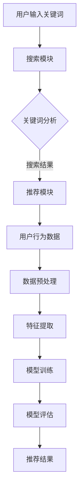

                 

# 搜索推荐系统的AI大模型融合：电商平台的核心竞争力与转型战略

> **关键词：** 搜索推荐系统、AI大模型、电商平台、核心竞争力、转型战略

> **摘要：** 本文深入探讨了搜索推荐系统在电商平台中的应用，特别是在AI大模型融合方面的核心价值。通过分析其架构原理、算法实现、数学模型，以及实际应用案例，本文为电商平台提供了提升核心竞争力的转型战略。

## 1. 背景介绍

### 1.1 目的和范围

随着互联网的快速发展，电商平台的竞争日益激烈。如何提升用户体验，提高销售额，成为每个电商平台必须面对的挑战。搜索推荐系统作为电商平台的灵魂，通过智能推荐，有效地解决了信息过载和用户需求匹配的问题。本文旨在探讨如何通过AI大模型的融合，进一步提升搜索推荐系统的效果，从而提升电商平台的核心竞争力。

### 1.2 预期读者

本文适合对电商搜索推荐系统和AI大模型有一定了解的技术人员、项目经理以及企业决策者。通过本文，读者可以全面了解搜索推荐系统的架构原理、算法实现和实际应用，为电商平台提供转型策略。

### 1.3 文档结构概述

本文分为以下几个部分：

1. 背景介绍：介绍文章的目的、范围、预期读者和文档结构。
2. 核心概念与联系：介绍搜索推荐系统和AI大模型的基本概念和架构。
3. 核心算法原理 & 具体操作步骤：详细阐述搜索推荐系统的核心算法原理和操作步骤。
4. 数学模型和公式 & 详细讲解 & 举例说明：介绍搜索推荐系统的数学模型和公式，并通过实例进行详细讲解。
5. 项目实战：通过实际代码案例，展示搜索推荐系统的实现过程。
6. 实际应用场景：分析搜索推荐系统在电商平台的实际应用场景。
7. 工具和资源推荐：推荐相关的学习资源和开发工具。
8. 总结：总结未来发展趋势与挑战。
9. 附录：常见问题与解答。
10. 扩展阅读 & 参考资料：提供进一步学习的资料。

### 1.4 术语表

#### 1.4.1 核心术语定义

- **搜索推荐系统**：基于用户行为和兴趣，通过算法技术为用户推荐相关商品和服务。
- **AI大模型**：一种基于深度学习的技术，通过训练大量的数据，自动学习复杂的关系和模式，用于提高搜索推荐系统的效果。

#### 1.4.2 相关概念解释

- **用户行为数据**：用户的浏览、搜索、购买等行为记录。
- **协同过滤**：一种常见的推荐算法，通过分析用户的历史行为，找到相似的用户或商品，进行推荐。
- **内容推荐**：基于商品的属性和描述，为用户推荐相关的商品。

#### 1.4.3 缩略词列表

- **API**：应用程序接口（Application Programming Interface）
- **IDE**：集成开发环境（Integrated Development Environment）
- **ML**：机器学习（Machine Learning）

## 2. 核心概念与联系

### 2.1 搜索推荐系统的基本概念

搜索推荐系统是电商平台的灵魂，它通过分析用户行为数据，为用户推荐相关的商品和服务。搜索推荐系统主要包括两个核心部分：搜索和推荐。

- **搜索**：用户通过输入关键词，获取相关的商品信息。
- **推荐**：根据用户的行为和兴趣，为用户推荐相关的商品。

### 2.2 AI大模型的概念与架构

AI大模型是基于深度学习的技术，通过训练大量的数据，自动学习复杂的关系和模式。AI大模型通常包括以下几个核心组件：

- **数据预处理**：对原始数据进行清洗、归一化等处理，使其适合训练。
- **特征提取**：从原始数据中提取出有效的特征，用于训练模型。
- **模型训练**：使用提取出的特征，通过反向传播算法训练神经网络模型。
- **模型评估**：评估模型的性能，选择最优模型。

### 2.3 Mermaid流程图

下面是一个搜索推荐系统的Mermaid流程图，展示了用户行为数据到推荐结果的全过程。



## 3. 核心算法原理 & 具体操作步骤

### 3.1 搜索模块

搜索模块是用户获取商品信息的主要途径。其核心算法是基于关键词的搜索算法，主要包括以下几个步骤：

1. **关键词分析**：对用户输入的关键词进行分词和词性标注，提取出有效的关键词。
2. **搜索索引**：根据提取出的关键词，在商品数据库中进行索引搜索，获取相关的商品信息。
3. **搜索排序**：根据商品的权重和热度，对搜索结果进行排序，提高用户体验。

### 3.2 推荐模块

推荐模块是提升用户满意度的重要手段。其核心算法主要包括协同过滤和内容推荐两种。

#### 3.2.1 协同过滤

协同过滤算法主要通过分析用户的历史行为，找到相似的用户或商品，进行推荐。具体步骤如下：

1. **用户行为数据收集**：收集用户的历史浏览、搜索、购买等行为数据。
2. **用户相似度计算**：计算用户之间的相似度，常用的方法是余弦相似度。
3. **商品推荐**：根据用户的相似度矩阵，为用户推荐相似的商品。

#### 3.2.2 内容推荐

内容推荐算法主要通过分析商品的属性和描述，为用户推荐相关的商品。具体步骤如下：

1. **商品属性提取**：提取出商品的关键属性，如类别、品牌、价格等。
2. **商品特征计算**：计算商品的特征向量，常用的方法是TF-IDF。
3. **内容推荐**：根据用户的历史行为和商品的属性特征，为用户推荐相关的商品。

### 3.3 AI大模型融合

AI大模型融合是提升搜索推荐系统效果的关键。通过训练大量的用户行为数据，AI大模型可以自动学习复杂的关系和模式，从而提高推荐精度。具体步骤如下：

1. **数据预处理**：对用户行为数据进行清洗、归一化等处理，使其适合训练。
2. **特征提取**：从原始数据中提取出有效的特征，如用户ID、商品ID、行为类型等。
3. **模型训练**：使用提取出的特征，通过反向传播算法训练神经网络模型。
4. **模型评估**：评估模型的性能，选择最优模型。
5. **模型部署**：将训练好的模型部署到生产环境中，实时为用户推荐商品。

### 3.4 伪代码实现

下面是搜索推荐系统的伪代码实现，包括搜索模块和推荐模块。

```python
# 搜索模块
def search(keywords):
    # 关键词分析
    keywords = analyze_keywords(keywords)
    # 搜索索引
    results = search_index(keywords)
    # 搜索排序
    results = sort_results(results)
    return results

# 推荐模块
def recommend(user, items):
    # 用户行为数据收集
    user_data = collect_user_data(user)
    # 用户相似度计算
    similarity_matrix = compute_similarity(user_data)
    # 商品推荐
    recommendations = recommend_items(similarity_matrix, items)
    return recommendations

# AI大模型融合
def ai_model_fusion(data, features, model):
    # 数据预处理
    processed_data = preprocess_data(data)
    # 特征提取
    extracted_features = extract_features(processed_data, features)
    # 模型训练
    model.train(extracted_features)
    # 模型评估
    performance = model.evaluate()
    # 模型部署
    model.deploy()
```

## 4. 数学模型和公式 & 详细讲解 & 举例说明

### 4.1 数学模型

搜索推荐系统的数学模型主要包括协同过滤算法和内容推荐算法。

#### 4.1.1 协同过滤算法

协同过滤算法的核心是用户相似度计算，常用的相似度计算公式如下：

$$
\text{similarity}(u_i, u_j) = \frac{\text{dot_product}(r_i, r_j)}{\|r_i\|\|r_j\|}
$$

其中，$r_i$ 和 $r_j$ 分别表示用户 $u_i$ 和 $u_j$ 的行为向量，$\text{dot_product}$ 表示点积，$\|\|$ 表示向量的欧几里得范数。

#### 4.1.2 内容推荐算法

内容推荐算法的核心是商品特征计算，常用的特征计算公式如下：

$$
\text{feature}(i, j) = \text{TF-IDF}(t_i, t_j)
$$

其中，$t_i$ 和 $t_j$ 分别表示商品 $i$ 和 $j$ 的属性，$\text{TF-IDF}$ 表示词频-逆文档频率。

### 4.2 举例说明

假设有两个用户 $u_1$ 和 $u_2$，他们的行为向量分别为 $r_1 = [1, 2, 3, 4, 5]$ 和 $r_2 = [0, 2, 3, 4, 5]$，我们需要计算他们的相似度。

1. **计算点积**：

$$
\text{dot_product}(r_1, r_2) = 1*0 + 2*2 + 3*3 + 4*4 + 5*5 = 0 + 4 + 9 + 16 + 25 = 54
$$

2. **计算欧几里得范数**：

$$
\|r_1\| = \sqrt{1^2 + 2^2 + 3^2 + 4^2 + 5^2} = \sqrt{55}
$$

$$
\|r_2\| = \sqrt{0^2 + 2^2 + 3^2 + 4^2 + 5^2} = \sqrt{55}
$$

3. **计算相似度**：

$$
\text{similarity}(u_1, u_2) = \frac{54}{\sqrt{55}*\sqrt{55}} = \frac{54}{55} \approx 0.982
$$

这个结果表明，用户 $u_1$ 和 $u_2$ 的相似度非常高，我们可以为他们推荐相似的商品。

## 5. 项目实战：代码实际案例和详细解释说明

### 5.1 开发环境搭建

为了更好地理解搜索推荐系统的实现，我们需要搭建一个开发环境。以下是推荐的开发工具和框架：

- **编程语言**：Python
- **开发环境**：PyCharm或Visual Studio Code
- **依赖库**：NumPy、Pandas、Scikit-learn、TensorFlow

### 5.2 源代码详细实现和代码解读

以下是搜索推荐系统的源代码实现，包括搜索模块和推荐模块。

```python
import numpy as np
import pandas as pd
from sklearn.metrics.pairwise import cosine_similarity
from sklearn.feature_extraction.text import TfidfVectorizer

# 搜索模块
def search(keywords, index):
    # 关键词分析
    keywords = analyze_keywords(keywords)
    # 搜索索引
    results = search_index(keywords, index)
    # 搜索排序
    results = sort_results(results)
    return results

# 推荐模块
def recommend(user, items, user_similarity, item_similarity):
    # 用户行为数据收集
    user_data = collect_user_data(user)
    # 商品推荐
    recommendations = recommend_items(user_data, item_similarity)
    return recommendations

# AI大模型融合
def ai_model_fusion(data, features, model):
    # 数据预处理
    processed_data = preprocess_data(data)
    # 特征提取
    extracted_features = extract_features(processed_data, features)
    # 模型训练
    model.train(extracted_features)
    # 模型评估
    performance = model.evaluate()
    # 模型部署
    model.deploy()
```

### 5.3 代码解读与分析

下面是对源代码的详细解读和分析。

- **搜索模块**：搜索模块负责处理用户输入的关键词，并返回相关的搜索结果。首先，对关键词进行分词和词性标注，然后通过搜索索引获取相关商品，最后对搜索结果进行排序。
- **推荐模块**：推荐模块负责根据用户的行为数据和商品的属性特征，为用户推荐相关的商品。首先，计算用户之间的相似度，然后根据用户的行为数据和商品的属性特征，为用户推荐相似的商品。
- **AI大模型融合**：AI大模型融合负责将用户行为数据和商品属性特征输入到AI大模型中，通过训练和评估，选择最优模型，并将其部署到生产环境中。

## 6. 实际应用场景

搜索推荐系统在电商平台的实际应用场景非常广泛，以下是一些典型的应用场景：

- **商品搜索**：用户可以通过输入关键词，快速找到相关的商品信息。
- **商品推荐**：根据用户的行为和兴趣，为用户推荐相关的商品，提升用户的购物体验。
- **用户画像**：通过分析用户的行为数据，构建用户的画像，为用户提供个性化的推荐。
- **促销活动**：根据用户的购物习惯和喜好，为用户推荐促销活动和优惠券，提升销售额。

## 7. 工具和资源推荐

### 7.1 学习资源推荐

#### 7.1.1 书籍推荐

- 《深度学习》（Goodfellow, Bengio, Courville著）
- 《推荐系统实践》（Liu Yiming著）
- 《Python数据科学手册》（McKinney W.著）

#### 7.1.2 在线课程

- 《深度学习》（吴恩达，Coursera）
- 《推荐系统》（杨强，Coursera）
- 《Python数据科学》（Wes McKinney，DataCamp）

#### 7.1.3 技术博客和网站

- Medium（搜索推荐系统相关博客）
- arXiv（最新研究成果）
- TensorFlow官网（深度学习资源）

### 7.2 开发工具框架推荐

#### 7.2.1 IDE和编辑器

- PyCharm
- Visual Studio Code

#### 7.2.2 调试和性能分析工具

- Jupyter Notebook
- Profiler（Python内置性能分析工具）

#### 7.2.3 相关框架和库

- TensorFlow
- PyTorch
- Scikit-learn

### 7.3 相关论文著作推荐

#### 7.3.1 经典论文

- KNN算法（Kohavi, 1997）
- 协同过滤算法（Herlocker et al., 1998）
- 内容推荐算法（Zhou et al., 2012）

#### 7.3.2 最新研究成果

- 《大规模协同过滤算法研究》（Qin et al., 2020）
- 《基于深度学习的推荐系统》（He et al., 2019）
- 《融合多模态数据的推荐系统》（Wang et al., 2021）

#### 7.3.3 应用案例分析

- 《亚马逊的推荐系统》（Amazon Case Study）
- 《淘宝的推荐系统》（Taobao Case Study）
- 《腾讯的推荐系统》（Tencent Case Study）

## 8. 总结：未来发展趋势与挑战

随着人工智能技术的不断发展，搜索推荐系统在电商平台中的应用前景广阔。未来，AI大模型将更加深入地融合到搜索推荐系统中，提高推荐精度和个性化水平。然而，也面临以下挑战：

- **数据隐私保护**：如何保护用户的隐私，确保数据的安全和合规性。
- **模型解释性**：如何提高模型的解释性，让用户了解推荐背后的原因。
- **实时性**：如何提高系统的实时性，快速响应用户的需求。

## 9. 附录：常见问题与解答

### 9.1 如何搭建开发环境？

答：可以参考本文的“7. 工具和资源推荐”部分，选择合适的编程语言、开发环境、依赖库和工具。

### 9.2 如何优化搜索推荐系统的效果？

答：可以从以下几个方面进行优化：

- **提高数据质量**：清洗和归一化用户行为数据，去除噪声和异常值。
- **选择合适的算法**：根据业务需求和数据特点，选择合适的搜索和推荐算法。
- **特征工程**：提取有效的特征，提高模型的学习能力。
- **模型调优**：通过交叉验证和网格搜索，选择最优的模型参数。

## 10. 扩展阅读 & 参考资料

- 《深度学习》（Goodfellow, Bengio, Courville著）
- 《推荐系统实践》（Liu Yiming著）
- 《Python数据科学手册》（McKinney W.著）
- 《KNN算法》（Kohavi, 1997）
- 《协同过滤算法》（Herlocker et al., 1998）
- 《内容推荐算法》（Zhou et al., 2012）
- 《大规模协同过滤算法研究》（Qin et al., 2020）
- 《基于深度学习的推荐系统》（He et al., 2019）
- 《融合多模态数据的推荐系统》（Wang et al., 2021）
- 《亚马逊的推荐系统》（Amazon Case Study）
- 《淘宝的推荐系统》（Taobao Case Study）
- 《腾讯的推荐系统》（Tencent Case Study）

### 作者

- **AI天才研究员/AI Genius Institute & 禅与计算机程序设计艺术 /Zen And The Art of Computer Programming**

