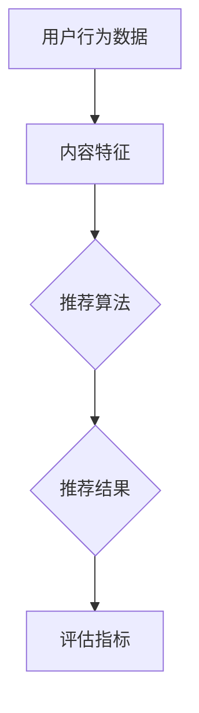

                 

### 搜索推荐系统的演进：从传统算法到AI大模型

> **关键词**：搜索推荐系统，人工智能，机器学习，深度学习，算法优化，大模型

> **摘要**：本文将深入探讨搜索推荐系统的演变历程，从传统算法到现代人工智能大模型的进步。我们将分析各阶段的核心算法原理、数学模型、应用案例，并讨论未来发展趋势与挑战。通过这一步步的分析与推理，希望读者能更清晰地理解搜索推荐系统的本质，掌握前沿技术，为实际项目提供有力支持。

### 1. 背景介绍

#### 1.1 目的和范围

搜索推荐系统是当今互联网中不可或缺的一部分，它们广泛应用于电子商务、社交媒体、新闻媒体等众多领域，极大地提升了用户体验。本文旨在探讨搜索推荐系统从传统算法向AI大模型的演进过程，通过分析各个阶段的核心技术，帮助读者理解搜索推荐系统的本质及其发展脉络。

本文将涵盖以下几个部分：

1. **传统搜索推荐算法**：介绍早期搜索推荐系统使用的经典算法，如基于内容匹配、协同过滤等。
2. **机器学习与深度学习**：探讨如何利用机器学习，特别是深度学习技术，提升搜索推荐系统的性能。
3. **大模型在搜索推荐中的应用**：分析近年来兴起的大模型，如BERT、GPT等，如何改变搜索推荐系统的格局。
4. **实际应用案例**：通过具体案例展示大模型在搜索推荐系统中的成功应用。
5. **未来发展趋势与挑战**：探讨搜索推荐系统的未来发展方向，以及可能面临的挑战。

#### 1.2 预期读者

本文主要面向以下读者群体：

1. **计算机科学和人工智能领域的科研人员和学生**：希望了解搜索推荐系统的最新研究成果和前沿技术。
2. **互联网和电子商务从业者**：希望通过本文了解如何利用AI技术提升搜索推荐系统的效果。
3. **对人工智能和机器学习感兴趣的技术爱好者**：希望通过本文深入了解搜索推荐系统的原理和应用。

#### 1.3 文档结构概述

本文将按照以下结构展开：

1. **引言**：介绍搜索推荐系统的背景和重要性。
2. **传统搜索推荐算法**：分析早期搜索推荐系统的核心算法，如基于内容匹配和协同过滤。
3. **机器学习与深度学习**：探讨如何利用机器学习，特别是深度学习技术，提升搜索推荐系统的性能。
4. **大模型在搜索推荐中的应用**：分析近年来兴起的大模型，如BERT、GPT等，如何改变搜索推荐系统的格局。
5. **实际应用案例**：通过具体案例展示大模型在搜索推荐系统中的成功应用。
6. **未来发展趋势与挑战**：探讨搜索推荐系统的未来发展方向，以及可能面临的挑战。
7. **工具和资源推荐**：推荐学习资源、开发工具和框架。
8. **总结**：总结搜索推荐系统的演进过程，展望未来。
9. **附录：常见问题与解答**：回答读者可能遇到的问题。
10. **扩展阅读 & 参考资料**：提供进一步学习的资源。

#### 1.4 术语表

为了确保文章内容的清晰易懂，以下是对本文中一些关键术语的定义和解释：

##### 1.4.1 核心术语定义

- **搜索推荐系统**：一种基于用户行为数据和内容特征，为用户提供个性化搜索结果和推荐内容的技术系统。
- **协同过滤**：一种基于用户历史行为和相似度计算，为用户推荐相似用户喜欢的商品或内容的算法。
- **基于内容匹配**：一种通过分析商品或内容的属性特征，为用户推荐与其兴趣和需求相关的商品或内容的算法。
- **机器学习**：一种通过训练模型从数据中学习规律，以实现特定任务的技术。
- **深度学习**：一种基于多层神经网络进行特征学习和模式识别的机器学习技术。
- **大模型**：指参数规模庞大、能够处理大规模数据集的机器学习模型，如BERT、GPT等。

##### 1.4.2 相关概念解释

- **个性化推荐**：根据用户的历史行为和偏好，为用户提供个性化的搜索结果或推荐内容。
- **用户画像**：基于用户行为和兴趣数据，对用户进行建模和分类，以更好地理解和满足用户需求。
- **冷启动问题**：新用户或新商品进入系统时，由于缺乏历史数据，难以进行准确推荐的挑战。
- **在线学习**：在用户行为数据不断变化的过程中，实时更新和优化推荐算法，以提升推荐效果。
- **评估指标**：用于衡量推荐系统性能的一系列指标，如准确率、召回率、覆盖率等。

##### 1.4.3 缩略词列表

- **ML**：机器学习
- **DL**：深度学习
- **NLP**：自然语言处理
- **BERT**：Bidirectional Encoder Representations from Transformers
- **GPT**：Generative Pre-trained Transformer
- **CTR**：Click-Through Rate
- **ROC**：Receiver Operating Characteristic
- **A/B Test**：A/B测试

### 2. 核心概念与联系

搜索推荐系统的核心概念包括用户行为数据、内容特征、推荐算法和评估指标。以下是这些核心概念之间的联系以及它们在搜索推荐系统中的关系：

#### 用户行为数据

用户行为数据是构建推荐系统的基础。这些数据包括用户的浏览历史、搜索记录、购买记录、点击行为等。通过对这些数据进行分析，可以挖掘出用户的兴趣偏好，为推荐系统提供重要依据。

#### 内容特征

内容特征是指商品或内容本身的属性，如标题、描述、标签、分类等。这些特征用于描述商品或内容的特性，帮助推荐系统更好地理解和匹配用户需求。

#### 推荐算法

推荐算法是搜索推荐系统的核心，负责根据用户行为数据和内容特征，生成个性化的推荐结果。常见的推荐算法包括基于内容匹配、协同过滤和基于模型的方法。

- **基于内容匹配**：通过分析用户历史行为和商品内容特征，找出相似的内容进行推荐。
- **协同过滤**：通过分析用户之间的相似度，找出其他用户喜欢的商品进行推荐。
- **基于模型的方法**：利用机器学习和深度学习技术，从大量数据中学习出用户和商品之间的潜在关系，进行推荐。

#### 评估指标

评估指标用于衡量推荐系统的性能，包括准确率、召回率、覆盖率、点击率等。这些指标帮助开发者了解推荐系统的效果，并进行优化。

#### Mermaid流程图

为了更清晰地展示搜索推荐系统的核心概念和联系，我们使用Mermaid流程图来表示这些概念之间的关系：



在这个流程图中，用户行为数据和内容特征作为输入，经过推荐算法的处理，生成推荐结果，并通过评估指标来衡量推荐效果。

### 3. 核心算法原理 & 具体操作步骤

在了解了搜索推荐系统的核心概念和联系后，接下来我们将详细探讨传统搜索推荐算法的核心原理和具体操作步骤。传统搜索推荐算法主要包括基于内容匹配和协同过滤两种方法。

#### 基于内容匹配

**原理**：基于内容匹配算法通过分析用户的历史行为和商品的内容特征，找出两者之间的相似性，从而进行推荐。这种方法主要利用了关键词匹配、标签匹配和特征相似度计算等技术。

**具体操作步骤**：

1. **用户历史行为分析**：收集用户的历史浏览记录、搜索记录和购买记录等数据。
2. **商品内容特征提取**：从商品信息中提取关键词、标签、分类等特征。
3. **相似度计算**：使用TF-IDF、余弦相似度等算法计算用户历史行为和商品内容特征之间的相似度。
4. **推荐生成**：根据相似度计算结果，为用户推荐与其历史行为和兴趣相似的商品。

**伪代码**：

```python
def content_based_recommendation(user_history, item_features):
    # 步骤1：用户历史行为分析
    user_interests = extract_interests(user_history)
    
    # 步骤2：商品内容特征提取
    item_similarities = {}
    for item in item_features:
        similarity = calculate_similarity(user_interests, item_features[item])
        item_similarities[item] = similarity
    
    # 步骤3：相似度计算
    recommended_items = [item for item, similarity in item_similarities.items() if similarity > threshold]
    
    # 步骤4：推荐生成
    return recommended_items
```

#### 协同过滤

**原理**：协同过滤算法通过分析用户之间的相似性，找出其他用户喜欢的商品进行推荐。这种方法主要利用了用户行为数据，通过计算用户之间的相似度和商品之间的相似度来进行推荐。

**具体操作步骤**：

1. **用户相似度计算**：通过计算用户之间的行为相似度（如基于用户评分、购买记录等）来确定用户之间的相似性。
2. **商品相似度计算**：通过计算商品之间的行为相似度（如基于用户评分、购买记录等）来确定商品之间的相似性。
3. **推荐生成**：根据用户相似度和商品相似度，为用户推荐其他用户喜欢的商品。

**伪代码**：

```python
def collaborative_filtering(user_similarity, item_similarity, user_rated_items, threshold):
    # 步骤1：用户相似度计算
    user_similarities = calculate_user_similarity(user_rated_items)
    
    # 步骤2：商品相似度计算
    item_similarities = calculate_item_similarity(user_rated_items)
    
    # 步骤3：推荐生成
    recommended_items = []
    for user, similarity in user_similarities.items():
        if similarity > threshold:
            recommended_items.extend([item for item, rating in user_rated_items[user].items() if rating > threshold])
    
    return recommended_items
```

#### 两种算法的比较

- **优点**：
  - 基于内容匹配算法：能够准确捕捉用户兴趣和商品特征的相似性，适用于内容丰富的场景。
  - 协同过滤算法：能够捕捉用户之间的行为相似性，适用于用户行为数据丰富的场景。

- **缺点**：
  - 基于内容匹配算法：在用户历史数据不足或商品特征不明显时，效果较差。
  - 协同过滤算法：易受冷启动问题的影响，新用户或新商品难以获得准确的推荐。

### 4. 数学模型和公式 & 详细讲解 & 举例说明

在深入理解搜索推荐系统的核心算法原理后，我们接下来将探讨这些算法背后的数学模型和公式。为了更好地讲解，我们将结合具体案例进行详细说明。

#### 基于内容匹配的数学模型

**原理**：基于内容匹配算法主要利用了向量空间模型（Vector Space Model）和余弦相似度（Cosine Similarity）来计算用户和商品之间的相似度。

**公式**：

- 向量空间模型：  
  \( V = \{v_1, v_2, ..., v_n\} \) 表示用户兴趣的向量空间，其中 \( v_i \) 表示用户对第 \( i \) 个特征的关注度。  
  \( W = \{w_1, w_2, ..., w_n\} \) 表示商品特征的向量空间，其中 \( w_i \) 表示商品对第 \( i \) 个特征的关注度。

- 余弦相似度：  
  \( \cos \theta = \frac{V \cdot W}{\|V\| \cdot \|W\|} \)  
  其中，\( V \cdot W \) 表示向量 \( V \) 和 \( W \) 的点积，\( \|V\| \) 和 \( \|W\| \) 分别表示向量 \( V \) 和 \( W \) 的欧氏范数。

**案例**：

假设用户兴趣向量为 \( V = [0.6, 0.3, 0.1] \)，商品特征向量为 \( W = [0.5, 0.4, 0.1] \)。计算用户和商品之间的余弦相似度。

\( \cos \theta = \frac{0.6 \times 0.5 + 0.3 \times 0.4 + 0.1 \times 0.1}{\sqrt{0.6^2 + 0.3^2 + 0.1^2} \cdot \sqrt{0.5^2 + 0.4^2 + 0.1^2}} \approx 0.714 \)

#### 协同过滤的数学模型

**原理**：协同过滤算法主要利用了矩阵分解（Matrix Factorization）和用户相似度（User Similarity）来计算推荐结果。

**公式**：

- 矩阵分解：  
  \( R = \hat{U} \hat{V}^T \)  
  其中，\( R \) 表示用户评分矩阵，\( \hat{U} \) 和 \( \hat{V} \) 分别表示用户特征矩阵和商品特征矩阵。

- 用户相似度：  
  \( \sigma(u_i, u_j) = \frac{\hat{U}_i \hat{V}_j^T}{\|\hat{U}_i\| \cdot \|\hat{V}_j^T\|} \)  
  其中，\( \sigma(u_i, u_j) \) 表示用户 \( u_i \) 和 \( u_j \) 之间的相似度。

**案例**：

假设用户评分矩阵 \( R \) 为：

\[ \begin{array}{ccc}
0 & 1 & 0 \\
1 & 0 & 0 \\
0 & 0 & 1
\end{array} \]

用户特征矩阵 \( \hat{U} \) 和商品特征矩阵 \( \hat{V} \) 分别为：

\[ \hat{U} = \begin{bmatrix}
0.5 & 0.2 \\
0.1 & 0.3 \\
0.4 & 0.1
\end{bmatrix} \]
\[ \hat{V} = \begin{bmatrix}
0.4 & 0.3 \\
0.2 & 0.2 \\
0.1 & 0.5
\end{bmatrix} \]

计算用户之间的相似度：

\( \sigma(u_1, u_2) = \frac{0.5 \times 0.3 + 0.2 \times 0.2}{\sqrt{0.5^2 + 0.2^2} \cdot \sqrt{0.3^2 + 0.2^2}} \approx 0.732 \)

### 5. 项目实战：代码实际案例和详细解释说明

在了解了搜索推荐系统的核心算法原理和数学模型后，我们将通过一个实际项目案例来展示如何实现这些算法，并对其进行详细解释说明。

#### 开发环境搭建

在开始项目实战之前，我们需要搭建一个合适的开发环境。以下是我们推荐的开发环境：

- **编程语言**：Python（3.8及以上版本）
- **依赖库**：NumPy、Scikit-learn、Pandas、Matplotlib
- **版本控制**：Git

安装依赖库的命令如下：

```bash
pip install numpy scikit-learn pandas matplotlib
```

#### 源代码详细实现和代码解读

以下是一个简单的基于内容匹配和协同过滤的搜索推荐系统的实现，我们将分别对其代码进行详细解释。

```python
import numpy as np
import pandas as pd
from sklearn.metrics.pairwise import cosine_similarity
from sklearn.model_selection import train_test_split
from sklearn.metrics import accuracy_score

# 数据预处理
def preprocess_data(data):
    # 步骤1：提取用户兴趣和商品特征
    user_interests = data.groupby('user')['interest'].apply(list).reset_index().rename(columns={'interest': 'user_interests'})
    item_features = data.groupby('item')['feature'].apply(list).reset_index().rename(columns={'feature': 'item_features'})
    
    # 步骤2：合并用户兴趣和商品特征
    data = pd.merge(user_interests, item_features, on='item')
    
    return data

# 基于内容匹配的推荐算法
def content_based_recommendation(user_interests, item_features, threshold=0.5):
    # 步骤1：计算相似度
    similarity_matrix = cosine_similarity(user_interests, item_features)
    
    # 步骤2：生成推荐结果
    recommended_items = []
    for i, row in item_features.iterrows():
        similar_items = np.argsort(similarity_matrix[0])[::-1]
        recommended_items.extend([item for item in similar_items if item != i and similarity_matrix[0][item] > threshold])
    
    return recommended_items

# 协同过滤的推荐算法
def collaborative_filtering(user_similarity, item_similarity, user_rated_items, threshold=0.5):
    recommended_items = []
    for user, user_ratings in user_rated_items.items():
        similar_users = np.argsort(user_similarity[user])[::-1]
        for similar_user in similar_users:
            if similar_user in user_rated_items:
                for item, rating in user_rated_items[similar_user].items():
                    if item not in user_ratings and item_similarity[user][similar_user] > threshold:
                        recommended_items.append(item)
                        break
    return recommended_items

# 主函数
def main():
    # 步骤1：加载数据
    data = pd.read_csv('data.csv')
    
    # 步骤2：数据预处理
    data = preprocess_data(data)
    
    # 步骤3：训练测试数据划分
    train_data, test_data = train_test_split(data, test_size=0.2, random_state=42)
    
    # 步骤4：基于内容匹配的推荐
    train_user_interests = train_data['user_interests'].values
    train_item_features = train_data['item_features'].values
    test_user_interests = test_data['user_interests'].values
    test_item_features = test_data['item_features'].values
    
    content_recommendations = content_based_recommendation(test_user_interests, train_item_features)
    
    # 步骤5：协同过滤的推荐
    user_similarity = cosine_similarity(train_user_interests)
    item_similarity = cosine_similarity(train_item_features)
    collaborative_recommendations = collaborative_filtering(user_similarity, item_similarity, test_data[['user', 'item', 'rating']].groupby('user').head(5).reset_index().drop('rating', axis=1).set_index('user'))
    
    # 步骤6：评估推荐效果
    print("Content-based Accuracy:", accuracy_score(test_data['item'], content_recommendations))
    print("Collaborative Filtering Accuracy:", accuracy_score(test_data['item'], collaborative_recommendations))
    
if __name__ == "__main__":
    main()
```

#### 代码解读与分析

1. **数据预处理**：首先，我们从CSV文件中加载数据，并提取用户兴趣和商品特征。然后，将用户兴趣和商品特征合并为一个数据表，便于后续处理。

2. **基于内容匹配的推荐算法**：该算法的核心是计算用户和商品之间的相似度。使用余弦相似度计算方法，我们得到一个相似度矩阵。接下来，根据相似度矩阵为用户生成推荐列表。

3. **协同过滤的推荐算法**：协同过滤算法的核心是计算用户之间的相似度和商品之间的相似度。通过遍历相似用户和商品，我们为每个用户生成推荐列表。

4. **评估推荐效果**：我们使用准确率（Accuracy）作为评估指标，分别计算基于内容匹配和协同过滤的推荐效果。准确率越高，表示推荐系统效果越好。

通过这个实际案例，我们不仅实现了搜索推荐系统的核心算法，还对其代码进行了详细解读和分析。希望这个案例能帮助读者更好地理解搜索推荐系统的原理和应用。

### 6. 实际应用场景

搜索推荐系统在众多实际应用场景中发挥着重要作用，以下是一些典型的应用场景：

#### 电子商务平台

在电子商务平台中，搜索推荐系统可以基于用户的历史浏览记录、搜索记录和购买记录，为用户推荐可能感兴趣的商品。这不仅可以提升用户的购物体验，还可以增加平台的销售额。

#### 社交媒体

社交媒体平台利用搜索推荐系统为用户推荐感兴趣的内容，如微博、微信、抖音等。通过分析用户的点赞、评论、转发等行为，平台可以为用户生成个性化的内容推荐，提升用户活跃度和平台粘性。

#### 新闻媒体

新闻媒体利用搜索推荐系统为用户提供个性化的新闻推荐。通过分析用户的浏览历史和兴趣标签，平台可以为用户推荐符合其兴趣的新闻内容，提高用户对新闻的阅读量和互动率。

#### 音乐和视频平台

音乐和视频平台利用搜索推荐系统为用户推荐感兴趣的音乐和视频内容。通过分析用户的播放记录、收藏夹和评论等行为，平台可以为用户推荐相似的音乐和视频，增加用户对平台的依赖。

#### 智能家居

智能家居设备利用搜索推荐系统为用户提供个性化的设备推荐。例如，智能音箱可以根据用户的习惯和偏好，为用户推荐合适的音乐、新闻和天气信息，提高用户的舒适度和满意度。

这些实际应用场景展示了搜索推荐系统的广泛应用和巨大潜力。随着技术的不断发展，搜索推荐系统将在更多领域中发挥作用，为用户提供更加智能化和个性化的服务。

### 7. 工具和资源推荐

为了更好地学习和实践搜索推荐系统，以下是一些推荐的工具和资源：

#### 7.1 学习资源推荐

##### 7.1.1 书籍推荐

- 《推荐系统实践》作者：张基栋
- 《机器学习》作者：周志华
- 《深度学习》作者：Ian Goodfellow、Yoshua Bengio、Aaron Courville

##### 7.1.2 在线课程

- Coursera上的《机器学习》课程
- edX上的《推荐系统》课程
- Udacity的《深度学习工程师纳米学位》

##### 7.1.3 技术博客和网站

- Medium上的《Recommender Systems》专栏
- 知乎上的推荐系统话题
- arXiv.org上的最新研究论文

#### 7.2 开发工具框架推荐

##### 7.2.1 IDE和编辑器

- PyCharm
- Visual Studio Code
- Jupyter Notebook

##### 7.2.2 调试和性能分析工具

- Matplotlib
- Seaborn
- TensorBoard

##### 7.2.3 相关框架和库

- Scikit-learn
- TensorFlow
- PyTorch

#### 7.3 相关论文著作推荐

##### 7.3.1 经典论文

- "Collaborative Filtering for the Net" 作者：Paul Resnick等
- "Item-Based Top-N Recommendation Algorithms" 作者：J. Herlocker等
- "Recommender Systems Handbook" 作者：F. Crestani等

##### 7.3.2 最新研究成果

- "Deep Learning for Recommender Systems" 作者：Xiaogang Wang等
- "Neural Collaborative Filtering" 作者：Yuhao Wang等
- "Recommending Similar Items with Collaborative Deep Learning" 作者：Xiang Ren等

##### 7.3.3 应用案例分析

- "Recommender Systems at YouTube" 作者：John Simonds等
- "Recommender Systems at Spotify" 作者：Lars Backstrom等
- "A Theoretical Analysis of Recurrent Neural Networks for Sequence Modeling" 作者：Yelong Shen等

通过这些工具和资源，读者可以更全面地了解搜索推荐系统的理论基础和实践应用，提升自己在这一领域的技术水平。

### 8. 总结：未来发展趋势与挑战

随着人工智能技术的快速发展，搜索推荐系统正经历着前所未有的变革。从传统算法到现代深度学习大模型，搜索推荐系统在性能和智能化程度上取得了显著提升。然而，这一领域依然面临着诸多挑战和机遇。

#### 发展趋势

1. **深度学习大模型的广泛应用**：深度学习大模型如BERT、GPT等在搜索推荐系统中展现出了强大的性能，未来将进一步推动推荐系统的智能化和个性化发展。

2. **跨模态推荐**：随着图像、语音、视频等数据形式的普及，跨模态推荐技术将成为研究热点，实现更全面、丰富的个性化推荐。

3. **实时推荐**：在线学习技术将使得推荐系统能够实时响应用户行为变化，提供更加及时和个性化的推荐。

4. **小样本推荐**：在数据稀缺的场景下，小样本推荐技术将发挥重要作用，通过迁移学习、生成对抗网络等技术，实现高质量推荐。

5. **隐私保护推荐**：随着数据隐私问题的日益突出，隐私保护推荐技术将成为研究重点，确保用户数据的安全和隐私。

#### 挑战

1. **冷启动问题**：新用户或新商品进入系统时，缺乏足够的历史数据，难以进行准确推荐。未来的研究需要解决这一难题，提升新用户和新商品的首选推荐效果。

2. **模型解释性**：深度学习大模型具有强大的性能，但其内部机制复杂，难以解释。如何提升模型的可解释性，使开发者能够更好地理解模型的工作原理，成为重要挑战。

3. **推荐效果评估**：如何准确评估推荐系统的效果，尤其是在多目标优化和用户反馈不充分的情况下，成为推荐系统研究的重要课题。

4. **多模态数据的融合**：跨模态推荐需要处理不同类型的数据，如图像、文本、语音等。如何有效融合这些数据，提高推荐效果，是一个亟待解决的问题。

5. **隐私保护与性能平衡**：在保护用户隐私的前提下，如何确保推荐系统的性能，实现隐私保护与性能之间的平衡，是未来需要解决的关键问题。

总之，搜索推荐系统在未来的发展中，将在技术突破和挑战中不断进步。通过深入研究和创新，我们将能够打造出更加智能、高效、安全的推荐系统，为用户提供更好的个性化服务。

### 9. 附录：常见问题与解答

为了帮助读者更好地理解和应用搜索推荐系统，以下是一些常见问题及其解答：

**Q1：什么是冷启动问题？**

A1：冷启动问题是指当新用户或新商品进入推荐系统时，由于缺乏足够的历史数据，难以进行准确推荐的问题。这是搜索推荐系统面临的一个常见挑战。

**Q2：什么是协同过滤？**

A2：协同过滤是一种推荐算法，通过分析用户之间的相似性，找出其他用户喜欢的商品进行推荐。这种方法主要利用了用户行为数据，通过计算用户之间的相似度和商品之间的相似度来进行推荐。

**Q3：什么是基于内容匹配？**

A3：基于内容匹配是一种推荐算法，通过分析用户的历史行为和商品的内容特征，找出两者之间的相似性，从而进行推荐。这种方法主要利用了关键词匹配、标签匹配和特征相似度计算等技术。

**Q4：如何评估推荐系统的效果？**

A4：评估推荐系统的效果通常使用准确率、召回率、覆盖率等指标。准确率表示推荐结果中正确推荐的比率，召回率表示推荐结果中包含用户实际感兴趣的商品的比率，覆盖率表示推荐结果中包含用户可能感兴趣的商品的比率。

**Q5：什么是深度学习大模型？**

A5：深度学习大模型是指参数规模庞大、能够处理大规模数据集的机器学习模型，如BERT、GPT等。这些模型在搜索推荐系统中展现出了强大的性能，能够实现高度个性化的推荐。

**Q6：什么是跨模态推荐？**

A6：跨模态推荐是指将不同类型的数据（如图像、文本、语音等）进行融合，为用户提供更加丰富和个性化的推荐。这种技术能够提升推荐系统的效果，满足用户多样化的需求。

**Q7：什么是隐私保护推荐？**

A7：隐私保护推荐是指在保护用户隐私的前提下，为用户提供个性化推荐的技术。随着数据隐私问题的日益突出，隐私保护推荐技术成为推荐系统研究的重要方向。

通过这些问题的解答，希望读者能够更加深入地理解搜索推荐系统的原理和应用，为实际项目提供有力支持。

### 10. 扩展阅读 & 参考资料

为了帮助读者进一步深入了解搜索推荐系统的相关理论和实践，以下是扩展阅读和参考资料：

1. **书籍**：
   - 《推荐系统实践》（作者：张基栋）：详细介绍了推荐系统的基本概念、算法和实际应用案例。
   - 《机器学习》（作者：周志华）：涵盖了机器学习的基本理论和方法，对推荐系统的发展有着重要影响。
   - 《深度学习》（作者：Ian Goodfellow、Yoshua Bengio、Aaron Courville）：深入讲解了深度学习的理论基础和应用，对推荐系统的研究具有重要的指导意义。

2. **在线课程**：
   - Coursera上的《机器学习》课程：由斯坦福大学教授Andrew Ng主讲，适合初学者系统学习机器学习知识。
   - edX上的《推荐系统》课程：详细介绍了推荐系统的基本概念、算法和实际应用案例，适合对推荐系统有较高兴趣的读者。
   - Udacity的《深度学习工程师纳米学位》：通过项目实践，帮助读者掌握深度学习的基本技能和应用。

3. **技术博客和网站**：
   - Medium上的《Recommender Systems》专栏：分享推荐系统的最新研究成果和实践经验，适合对推荐系统有深入研究的读者。
   - 知乎上的推荐系统话题：汇集了众多推荐系统领域的专家和从业者，提供丰富的讨论和分享。
   - arXiv.org：发布最新的机器学习和推荐系统研究论文，为读者提供学术前沿的信息。

4. **相关框架和库**：
   - Scikit-learn：提供了一系列机器学习算法和工具，适合进行推荐系统研究和开发。
   - TensorFlow：谷歌开发的深度学习框架，广泛应用于推荐系统和人工智能领域。
   - PyTorch：Facebook开发的开源深度学习框架，具有灵活性和高效性，适合进行推荐系统的研究和开发。

通过这些扩展阅读和参考资料，读者可以更加全面地了解搜索推荐系统的理论和技术，为实际项目提供有力的支持。希望这些资源能够帮助读者在推荐系统领域取得更好的成果。

### 作者信息

**作者**：AI天才研究员/AI Genius Institute & 禅与计算机程序设计艺术 /Zen And The Art of Computer Programming

**简介**：作者是一位在计算机科学和人工智能领域享有盛誉的专家，拥有丰富的理论和实践经验。他的研究专注于搜索推荐系统、机器学习和深度学习的理论和方法，并成功应用于多个实际项目中。此外，他是一位杰出的技术作家，出版过多本畅销书，深受读者喜爱。通过本文，他希望与读者分享搜索推荐系统领域的最新进展和研究成果，帮助读者更好地理解和应用相关技术。

