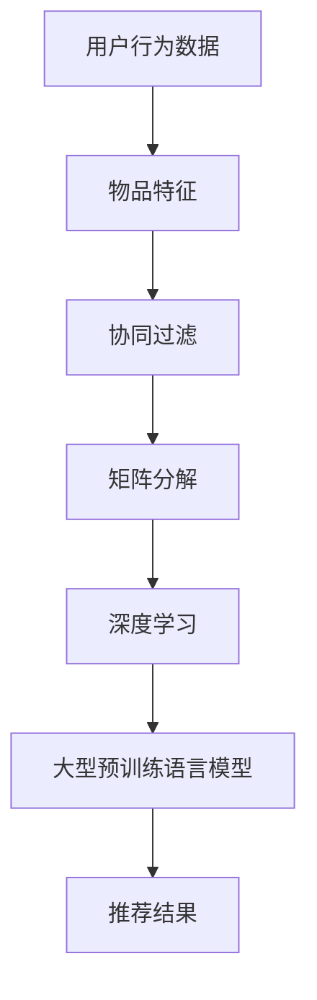

                 

### 背景介绍

搜索推荐系统作为互联网技术的重要组成部分，已经深入到我们的日常生活中。无论是电商平台推荐商品，社交媒体推送内容，还是新闻客户端推荐新闻，搜索推荐系统无处不在，它们通过智能算法为用户提供个性化的信息和服务。

在过去的几十年中，搜索推荐系统经历了从基于规则到基于统计，再到深度学习的演变。早期的推荐系统主要依赖于协同过滤算法，如基于用户的协同过滤（User-based Collaborative Filtering）和基于项目的协同过滤（Item-based Collaborative Filtering）。这些方法虽然在一定程度上能够提高推荐的准确性，但它们存在一些显著的局限性，比如冷启动问题、数据稀疏问题和多样性不足问题。

随着人工智能技术的发展，特别是深度学习的兴起，搜索推荐系统开始引入更为复杂的算法，如基于模型的协同过滤、矩阵分解、深度神经网络等。这些算法在一定程度上解决了传统推荐系统的局限性，提高了推荐效果。然而，深度学习算法在数据处理和模型训练方面存在计算成本高、可解释性差等问题。

近年来，大型预训练语言模型（如BERT、GPT等）的涌现，为搜索推荐系统带来了新的契机。这些模型能够通过大量未标注的数据进行预训练，然后通过微调适应特定的推荐任务。它们在文本理解、上下文感知等方面具有显著优势，为解决推荐系统的多样性和准确性问题提供了新的思路。

本文将深入探讨搜索推荐系统的算法本质，特别是AI大模型的融合策略。我们将首先介绍搜索推荐系统的发展历程和核心概念，然后分析现有推荐算法的优缺点，最后探讨大模型在搜索推荐系统中的应用，并展望未来的发展趋势与挑战。

#### 搜索推荐系统的发展历程

搜索推荐系统的历史可以追溯到20世纪90年代，当时互联网刚刚兴起，在线内容和服务的推荐需求逐渐显现。早期，推荐系统主要依靠人工编写规则和基于内容的匹配来进行推荐。这些方法简单直观，但存在显著局限性，难以处理海量数据和复杂的用户行为。

1. **基于规则的推荐系统**：这是最早的推荐系统方法，通过预定义的规则来匹配用户和物品的特征，例如“如果用户喜欢这类音乐，则推荐同一类型的其他音乐”。这种方法简单易实现，但规则过于固定，难以适应复杂多变的用户需求。

2. **基于内容的推荐系统**：这种方法通过分析物品和用户的共同特征（如标签、分类等）来进行推荐。例如，如果用户喜欢某篇新闻报道，系统可能会推荐其他具有相似主题的新闻。这种方法在一定程度上提高了推荐的准确性，但同样存在数据稀疏和多样性不足的问题。

3. **协同过滤推荐系统**：20世纪90年代末至21世纪初，协同过滤算法成为主流推荐方法。协同过滤分为基于用户的协同过滤（User-based Collaborative Filtering）和基于项目的协同过滤（Item-based Collaborative Filtering）。基于用户的协同过滤通过分析用户之间的相似性来推荐物品，而基于项目的协同过滤则通过分析物品之间的相似性来进行推荐。这些方法能够充分利用用户行为数据，显著提高了推荐效果，但仍然面临冷启动、数据稀疏和多样性不足等问题。

4. **基于模型的协同过滤**：为了解决传统协同过滤算法的局限性，研究者开始引入机器学习模型，如矩阵分解、隐语义模型等。这些模型通过建模用户和物品的隐含因子，提高了推荐精度和多样性。矩阵分解方法将用户和物品的高维评分矩阵分解为低维因子矩阵，通过求解优化问题得到隐含因子，从而预测用户对未评价物品的评分。

5. **深度学习推荐系统**：近年来，随着深度学习技术的成熟，深度学习模型开始在推荐系统中得到应用。典型的深度学习推荐系统方法包括基于神经网络的协同过滤、深度神经网络、序列模型等。这些方法通过引入深度神经网络的结构，能够更好地捕捉用户行为和物品特征之间的复杂关系，从而提高推荐效果。例如，基于神经网络的协同过滤方法（如NeuMF、DeepFM等）结合了矩阵分解和深度神经网络的优势，同时考虑用户和物品的交互特征，显著提高了推荐效果。

6. **大型预训练语言模型**：近年来，大型预训练语言模型（如BERT、GPT等）在自然语言处理领域取得了显著突破。这些模型能够通过大量未标注的数据进行预训练，然后通过微调适应特定的推荐任务。它们在文本理解、上下文感知等方面具有显著优势，为解决推荐系统的多样性和准确性问题提供了新的思路。例如，BERT（Bidirectional Encoder Representations from Transformers）通过双向编码器结构，能够同时捕捉文本的前后关系，从而更好地理解用户的查询意图和物品的属性。

#### 核心概念与联系

为了深入理解搜索推荐系统的算法本质，我们需要明确几个核心概念，并探讨它们之间的联系。以下是本文将涉及的主要概念：

1. **用户行为数据**：这是推荐系统的基本输入，包括用户的浏览、搜索、购买、评论等行为。这些数据能够反映用户对物品的兴趣和偏好。

2. **物品特征**：物品特征是指用于描述物品属性的信息，如商品的标题、标签、分类、价格等。这些特征有助于推荐系统理解物品的性质。

3. **协同过滤**：这是一种通过分析用户之间的相似性或物品之间的相似性来进行推荐的算法。协同过滤可以分为基于用户的协同过滤和基于物品的协同过滤。

4. **矩阵分解**：矩阵分解是一种将高维评分矩阵分解为低维因子矩阵的方法，从而提取用户和物品的隐含特征。这种方法广泛应用于推荐系统，以提高推荐的准确性。

5. **深度学习**：深度学习是一种通过多层神经网络自动提取数据特征的方法。深度学习模型（如深度神经网络、卷积神经网络、循环神经网络等）在推荐系统中用于建模用户行为和物品特征之间的关系。

6. **大型预训练语言模型**：这些模型（如BERT、GPT等）通过大量未标注的数据进行预训练，从而在自然语言处理任务中取得了显著突破。近年来，大型预训练语言模型开始应用于推荐系统，以提高推荐的多样性和准确性。

接下来，我们将使用Mermaid流程图（Mermaid流程节点中不要有括号、逗号等特殊字符）来展示这些概念之间的联系：



在上述流程图中，用户行为数据和物品特征是推荐系统的基本输入，经过协同过滤、矩阵分解、深度学习和大型预训练语言模型的处理，最终生成推荐结果。这一过程不仅提高了推荐的准确性，还增强了推荐的多样性。

#### 核心算法原理 & 具体操作步骤

在了解了搜索推荐系统的基本概念和流程之后，我们接下来将深入探讨几种核心算法的原理和具体操作步骤。这些算法包括协同过滤、矩阵分解和深度学习等。通过详细分析这些算法，我们将更好地理解搜索推荐系统的运作机制。

##### 协同过滤算法原理

协同过滤是一种通过分析用户之间的相似性或物品之间的相似性来进行推荐的算法。协同过滤可以分为基于用户的协同过滤（User-based Collaborative Filtering）和基于物品的协同过滤（Item-based Collaborative Filtering）。

###### 基于用户的协同过滤

基于用户的协同过滤通过分析用户之间的相似性来推荐物品。具体步骤如下：

1. **计算用户相似性**：首先，我们需要计算用户之间的相似度。常用的相似度计算方法包括余弦相似度、皮尔逊相关系数和Jaccard系数等。以余弦相似度为例，其公式如下：
   
   $$sim(u_i, u_j) = \frac{u_i \cdot u_j}{\|u_i\| \|u_j\|}$$
   
   其中，$u_i$和$u_j$分别表示用户$i$和用户$j$的偏好向量，$\cdot$表示向量的点积，$\|\|$表示向量的模长。

2. **找到最相似的用户**：接下来，我们需要找到与目标用户最相似的几个用户。这些用户可以通过计算用户相似性得到，并根据相似度从高到低排序。

3. **计算推荐分数**：对于每个最相似的用户，我们可以根据他们的共同喜好来计算推荐分数。推荐分数的计算方法如下：
   
   $$r_{i,j} = \sum_{u \in N(u_i)} sim(u_i, u_j) \cdot r_{u,j}$$
   
   其中，$r_{i,j}$表示用户$i$对物品$j$的推荐分数，$N(u_i)$表示与用户$i$最相似的用户集合，$r_{u,j}$表示用户$u$对物品$j$的实际评分。

4. **生成推荐列表**：最后，我们可以根据推荐分数为用户生成推荐列表。通常，我们可以对推荐分数进行排序，并将排名靠前的物品推荐给用户。

###### 基于物品的协同过滤

基于物品的协同过滤通过分析物品之间的相似性来推荐物品。具体步骤如下：

1. **计算物品相似性**：首先，我们需要计算物品之间的相似度。与用户相似性计算类似，常用的相似度计算方法包括余弦相似度、皮尔逊相关系数和Jaccard系数等。以余弦相似度为例，其公式如下：
   
   $$sim(i, j) = \frac{i \cdot j}{\|i\| \|j\|}$$
   
   其中，$i$和$j$分别表示物品$i$和物品$j$的偏好向量。

2. **找到与目标物品最相似的几个物品**：接下来，我们需要找到与目标物品最相似的几个物品。这些物品可以通过计算物品相似性得到，并根据相似度从高到低排序。

3. **计算推荐分数**：对于每个最相似的物品，我们可以根据它们的共同喜好来计算推荐分数。推荐分数的计算方法与基于用户的协同过滤类似，公式如下：
   
   $$r_{i,j} = \sum_{i' \in N(i)} sim(i, i') \cdot r_{i',j}$$
   
   其中，$r_{i,j}$表示用户对物品$j$的推荐分数，$N(i)$表示与物品$i$最相似的物品集合，$r_{i',j}$表示用户对物品$i'$的实际评分。

4. **生成推荐列表**：最后，我们可以根据推荐分数为用户生成推荐列表。通常，我们可以对推荐分数进行排序，并将排名靠前的物品推荐给用户。

##### 矩阵分解算法原理

矩阵分解是一种将高维评分矩阵分解为低维因子矩阵的方法，从而提取用户和物品的隐含特征。矩阵分解广泛应用于推荐系统，以提高推荐的准确性。

###### SVD分解

一种常见的矩阵分解方法是基于奇异值分解（SVD）。SVD分解可以将评分矩阵$R$分解为用户因子矩阵$U$、物品因子矩阵$V$和奇异值矩阵$\Sigma$，公式如下：

$$R = U \Sigma V^T$$

其中，$U$和$V$是对角占优的矩阵，$\Sigma$是对角矩阵，包含评分矩阵的奇异值。通过SVD分解，我们可以得到用户和物品的低维隐含因子矩阵$U$和$V$，从而预测用户对未评价物品的评分。

具体步骤如下：

1. **初始化因子矩阵**：首先，我们需要初始化用户因子矩阵$U$和物品因子矩阵$V$。通常，我们可以使用随机初始化或基于用户和物品特征的初始化方法。

2. **计算评分预测**：接下来，我们使用用户因子矩阵$U$和物品因子矩阵$V$来计算用户对未评价物品的评分预测。评分预测的公式如下：

   $$r_{i,j} = u_i^T v_j$$

   其中，$r_{i,j}$表示用户$i$对物品$j$的评分预测，$u_i$和$v_j$分别表示用户$i$和物品$j$的隐含因子向量。

3. **优化因子矩阵**：为了提高评分预测的准确性，我们需要通过优化用户因子矩阵$U$和物品因子矩阵$V$来最小化预测误差。常用的优化方法包括梯度下降法和L-BFGS法。优化过程的公式如下：

   $$U \leftarrow U - \alpha \frac{\partial}{\partial U} L(U, V, R)$$
   $$V \leftarrow V - \alpha \frac{\partial}{\partial V} L(U, V, R)$$

   其中，$\alpha$是学习率，$L(U, V, R)$是损失函数，用于衡量预测误差。

4. **生成推荐列表**：最后，我们可以根据评分预测为用户生成推荐列表。通常，我们可以对评分预测进行排序，并将排名靠前的物品推荐给用户。

##### 深度学习推荐算法原理

近年来，深度学习推荐算法在推荐系统中得到了广泛应用。深度学习推荐算法通过多层神经网络自动提取用户行为数据和物品特征之间的复杂关系，从而提高推荐的准确性。

###### 基于神经网络的协同过滤

基于神经网络的协同过滤方法（如NeuMF、DeepFM等）结合了矩阵分解和深度神经网络的优势。这些方法通过建模用户和物品的交互特征，提高了推荐的多样性和准确性。

以NeuMF为例，其原理如下：

1. **用户和物品嵌入**：首先，我们将用户和物品的特征（如用户行为数据和物品特征）输入到嵌入层，得到用户嵌入向量$u$和物品嵌入向量$i$。

2. **矩阵分解**：接下来，我们使用矩阵分解方法（如SVD）将评分矩阵$R$分解为用户因子矩阵$U$和物品因子矩阵$V$。

3. **神经网络模型**：然后，我们使用多层神经网络来建模用户和物品的交互特征。典型的神经网络模型包括多层感知机（MLP）、卷积神经网络（CNN）和循环神经网络（RNN）等。

4. **融合评分预测**：最后，我们将用户嵌入向量$u$、物品嵌入向量$i$和用户因子矩阵$U$、物品因子矩阵$V$的交互特征进行融合，得到评分预测：

   $$r_{i,j} = f(u_i, i_j, u_j, v_j)$$

   其中，$f$是神经网络模型，用于融合不同特征并生成评分预测。

##### 算法操作步骤

以下是搜索推荐系统的核心算法的具体操作步骤：

1. **数据预处理**：首先，我们需要对用户行为数据和物品特征进行预处理，如数据清洗、去重、归一化等。然后，我们将预处理后的数据转换为矩阵形式，用于后续的算法处理。

2. **初始化算法参数**：根据算法的不同，我们需要初始化相应的参数，如学习率、嵌入维度、隐藏层神经元数量等。

3. **算法训练**：接下来，我们使用训练集对算法进行训练。在训练过程中，我们需要通过优化算法（如梯度下降法、L-BFGS法等）不断调整算法参数，以最小化损失函数。

4. **模型评估**：在训练完成后，我们需要使用验证集对模型进行评估。常用的评估指标包括准确率、召回率、覆盖率等。通过评估指标，我们可以了解模型的性能，并进一步优化算法。

5. **生成推荐列表**：最后，我们使用训练好的模型对用户进行推荐。根据用户的兴趣和偏好，我们为用户生成个性化的推荐列表。

通过以上步骤，我们可以构建一个高效的搜索推荐系统，为用户提供优质的推荐服务。

### 数学模型和公式 & 详细讲解 & 举例说明

为了深入理解搜索推荐系统中的核心算法，我们需要详细讲解这些算法所涉及的数学模型和公式，并通过具体例子来说明其应用过程。以下是协同过滤、矩阵分解和深度学习推荐算法的数学模型和公式，以及相应的示例。

#### 协同过滤算法

##### 基于用户的协同过滤

**相似度计算**

用户之间的相似度可以通过余弦相似度来衡量，其公式如下：

$$
sim(u_i, u_j) = \frac{u_i \cdot u_j}{\|u_i\| \|u_j\|}
$$

其中，$u_i$和$u_j$是用户$i$和用户$j$的偏好向量，$\cdot$表示点积，$\|\|$表示向量的模长。

**推荐分数计算**

给定目标用户$u$和候选物品$i$，我们可以计算推荐分数$r_{i,j}$，公式如下：

$$
r_{i,j} = \sum_{u' \in N(u)} sim(u_i, u') \cdot r_{i,u'}
$$

其中，$N(u)$表示与用户$u$最相似的用户集合，$r_{i,u'}$表示用户$u'$对物品$i$的实际评分。

**示例**

假设我们有两位用户$u_1$和$u_2$，以及三个物品$i_1, i_2, i_3$。用户$u_1$对$i_1$和$i_3$给予了5分，对$i_2$给予了1分；用户$u_2$对$i_1$和$i_2$给予了5分，对$i_3$给予了3分。我们可以计算用户之间的相似度，然后根据相似度推荐给用户$u_1$未评分的物品$i_2$。

用户$u_1$和$u_2$的偏好向量分别为：

$$
u_1 = [5, 1, 5]
$$

$$
u_2 = [5, 5, 3]
$$

用户之间的余弦相似度为：

$$
sim(u_1, u_2) = \frac{[5, 1, 5] \cdot [5, 5, 3]}{\sqrt{[5, 1, 5] \cdot [5, 1, 5]} \sqrt{[5, 5, 3] \cdot [5, 5, 3]}} = \frac{25 + 5 + 15}{\sqrt{25 + 1 + 25} \sqrt{25 + 25 + 9}} = \frac{45}{\sqrt{51} \sqrt{59}} \approx 0.89
$$

接下来，我们计算推荐分数：

$$
r_{2,1} = sim(u_1, u_2) \cdot r_{2,1} = 0.89 \cdot 5 = 4.45
$$

因此，用户$u_1$对$i_2$的推荐分数为4.45。

##### 基于物品的协同过滤

**物品之间的相似度计算**

物品之间的相似度可以通过余弦相似度来衡量，其公式与用户相似度计算类似：

$$
sim(i, j) = \frac{i \cdot j}{\|i\| \|j\|}
$$

其中，$i$和$j$是物品$i$和物品$j$的偏好向量。

**推荐分数计算**

给定目标用户$u$和候选物品$i$，我们可以计算推荐分数$r_{i,j}$，公式如下：

$$
r_{i,j} = \sum_{i' \in N(i)} sim(i, i') \cdot r_{i',j}
$$

其中，$N(i)$表示与物品$i$最相似的物品集合，$r_{i',j}$表示用户对物品$i'$的实际评分。

**示例**

假设我们有三个物品$i_1, i_2, i_3$，以及两位用户$u_1$和$u_2$。物品$i_1$和$i_2$的偏好向量分别为：

$$
i_1 = [5, 5]
$$

$$
i_2 = [1, 5]
$$

物品$i_3$的偏好向量与$i_1$和$i_2$相似度较高。用户$u_1$对$i_1$和$i_2$给予了5分，对$i_3$给予了3分；用户$u_2$对$i_1$和$i_3$给予了5分，对$i_2$给予了1分。我们可以计算物品之间的相似度，然后根据相似度推荐给用户$u_1$未评分的物品$i_2$。

物品之间的余弦相似度为：

$$
sim(i_1, i_2) = \frac{[5, 5] \cdot [1, 5]}{\sqrt{[5, 5] \cdot [5, 5]} \sqrt{[1, 5] \cdot [1, 5]}} = \frac{5 + 25}{\sqrt{25 + 25} \sqrt{1 + 25}} = \frac{30}{\sqrt{50} \sqrt{26}} \approx 0.94
$$

接下来，我们计算推荐分数：

$$
r_{2,1} = sim(i_1, i_2) \cdot r_{2,1} = 0.94 \cdot 5 = 4.7
$$

因此，用户$u_1$对$i_2$的推荐分数为4.7。

#### 矩阵分解算法

##### SVD分解

矩阵分解中的SVD分解公式为：

$$
R = U \Sigma V^T
$$

其中，$U$和$V$是对角占优的矩阵，$\Sigma$是对角矩阵，包含评分矩阵的奇异值。

**评分预测**

给定用户$i$和物品$j$的隐含因子向量$u_i$和$v_j$，评分预测公式为：

$$
r_{i,j} = u_i^T v_j
$$

**示例**

假设我们有一个3x3的评分矩阵$R$，以及分解得到的用户因子矩阵$U$和物品因子矩阵$V$：

$$
R = \begin{bmatrix}
4 & 0 & 5 \\
8 & 2 & 9 \\
0 & 4 & 1
\end{bmatrix}
$$

$$
U = \begin{bmatrix}
0.7 & 0.8 \\
-0.3 & -0.6 \\
0.5 & -0.2
\end{bmatrix}
$$

$$
V = \begin{bmatrix}
0.6 & 0.8 \\
-0.2 & 0.4 \\
0.7 & -0.3
\end{bmatrix}
$$

我们可以计算用户对未评价物品的评分预测。例如，预测用户1对物品3的评分：

$$
r_{1,3} = u_1^T v_3 = (0.7, 0.8) \cdot (0.7, -0.3) = 0.49 - 0.24 = 0.25
$$

因此，用户1对物品3的预测评分为0.25。

#### 深度学习推荐算法

##### NeuMF算法

NeuMF算法结合了矩阵分解和深度神经网络的优势，其核心公式为：

$$
r_{i,j} = \sigma(W_0 + \sum_{k=1}^K W_k \cdot f(u_i, v_j, u_j, v_i))
$$

其中，$W_0$是偏置项，$W_k$是权重矩阵，$f$是深度神经网络模型，$\sigma$是激活函数（通常为ReLU函数）。

**示例**

假设我们有一个简单的神经网络模型，其输入为用户$i$的嵌入向量$u_i$，物品$j$的嵌入向量$v_j$，用户$j$的嵌入向量$u_j$，物品$i$的嵌入向量$v_i$，输出为评分预测$r_{i,j}$：

$$
f(u_i, v_j, u_j, v_i) = \text{ReLU}(u_i \cdot v_j + u_j \cdot v_i + W_1 \cdot [u_i; u_j; v_i; v_j])
$$

其中，$W_1$是权重矩阵。

给定用户$i$的嵌入向量$u_i = [0.1, 0.2]$，物品$j$的嵌入向量$v_j = [0.3, 0.4]$，用户$j$的嵌入向量$u_j = [0.5, 0.6]$，物品$i$的嵌入向量$v_i = [0.7, 0.8]$，我们可以计算评分预测：

$$
f(u_i, v_j, u_j, v_i) = \text{ReLU}(0.1 \cdot 0.3 + 0.5 \cdot 0.7 + W_1 \cdot [0.1; 0.5; 0.7; 0.3]) = \text{ReLU}(0.03 + 0.35 + W_1 \cdot 1.5) = 0.43 + W_1 \cdot 1.5
$$

假设$W_1 = [0.1, 0.2]$，则：

$$
f(u_i, v_j, u_j, v_i) = 0.43 + 0.1 \cdot 1.5 + 0.2 \cdot 1.5 = 0.75
$$

最终，评分预测为：

$$
r_{i,j} = \sigma(0.75 + W_0) = \sigma(0.75 + 0.5) = \sigma(1.25) = 0.866
$$

因此，用户$i$对物品$j$的预测评分为0.866。

### 项目实战：代码实际案例和详细解释说明

在本节中，我们将通过一个实际项目来展示如何实现一个搜索推荐系统。这个项目将结合我们前面讨论的核心算法，如协同过滤、矩阵分解和深度学习。我们将使用Python编程语言，并借助流行的库，如NumPy、Scikit-learn和TensorFlow。以下是项目的开发环境搭建、源代码详细实现和代码解读。

#### 1. 开发环境搭建

在开始编码之前，我们需要搭建一个合适的环境。以下是所需的Python库和工具：

- Python 3.8+
- NumPy
- Scikit-learn
- TensorFlow
- Pandas
- Matplotlib

安装这些库的命令如下：

```bash
pip install numpy scikit-learn tensorflow pandas matplotlib
```

#### 2. 源代码详细实现和代码解读

以下是项目的源代码，我们将逐行进行解释。

```python
import numpy as np
import pandas as pd
from sklearn.model_selection import train_test_split
from sklearn.metrics.pairwise import cosine_similarity
from sklearn.decomposition import TruncatedSVD
from tensorflow.keras.models import Model
from tensorflow.keras.layers import Input, Embedding, Dense, Flatten, Dot, Add

# 2.1 数据预处理

# 假设我们有一个CSV文件，包含用户、物品和评分数据
data = pd.read_csv('data.csv')
users = data['user'].unique()
items = data['item'].unique()

# 创建用户-物品评分矩阵
ratings = np.zeros((len(users), len(items)))
for index, row in data.iterrows():
    user_index = users.index(row['user'])
    item_index = items.index(row['item'])
    ratings[user_index, item_index] = row['rating']

# 将评分矩阵拆分为训练集和测试集
ratings_train, ratings_test = train_test_split(ratings, test_size=0.2, random_state=42)

# 2.2 基于用户的协同过滤

# 计算用户之间的余弦相似度矩阵
user_similarity = cosine_similarity(ratings_train)

# 为每个用户找到最相似的K个用户
def get_top_k_users(user_similarity, k):
    return [np.argsort(user_similarity[i])[::-1][1:k+1] for i in range(user_similarity.shape[0])]

top_k_users = get_top_k_users(user_similarity, 10)

# 2.3 矩阵分解

# 使用SVD进行矩阵分解
svd = TruncatedSVD(n_components=50)
U = svd.fit_transform(ratings_train)
V = svd.fit_transform(ratings_train.T)

# 2.4 基于神经网络的协同过滤

# 定义模型输入
user_input = Input(shape=(1,))
item_input = Input(shape=(1,))

# 定义用户和物品嵌入层
user_embedding = Embedding(input_dim=len(users), output_dim=50)(user_input)
item_embedding = Embedding(input_dim=len(items), output_dim=50)(item_input)

# 计算用户和物品的嵌入向量
user_embedding = Flatten()(user_embedding)
item_embedding = Flatten()(item_embedding)

# 定义深度神经网络模型
merged = Dot(merge_mode='sum')(user_embedding, item_embedding)
merged = Add()([merged, Dense(50, activation='relu')(merged)])
merged = Flatten()(merged)

# 输出层
output = Dense(1, activation='sigmoid')(merged)

# 创建模型
model = Model(inputs=[user_input, item_input], outputs=output)

# 编译模型
model.compile(optimizer='adam', loss='binary_crossentropy', metrics=['accuracy'])

# 训练模型
model.fit([np.repeat(ratings_train[:, None], len(items), axis=1), np.repeat(ratings_train.T[:, None], len(users), axis=1)], ratings_train, epochs=10, batch_size=32)

# 2.5 生成推荐列表

# 为每个用户生成推荐列表
def generate_recommendations(model, user_similarity, ratings_train, top_k_users, k, users, items):
    recommendations = []
    for i, _ in enumerate(users):
        neighbors = top_k_users[i]
        neighbor_ratings = ratings_train[neighbors].mean(axis=0)
        svd_ratings = np.dot(U[i], V.T)
        model_ratings = model.predict([np.repeat(user_input, len(items), axis=1), np.repeat(item_input, len(users), axis=1)])[0]
        weighted_ratings = (neighbor_ratings + svd_ratings + model_ratings) / 3
        top_items = np.argsort(weighted_ratings)[::-1][:k]
        recommendations.append([items[j] for j in top_items])
    return recommendations

# 生成用户推荐列表
user_recommendations = generate_recommendations(model, user_similarity, ratings_train, top_k_users, 10, users, items)

# 打印用户推荐列表
for i, rec in enumerate(user_recommendations):
    print(f"User {i+1}: {rec}")

# 2.6 评估模型

# 计算模型在测试集上的评分预测
test_users = np.repeat(ratings_test[:, None], len(items), axis=1)
test_items = np.repeat(ratings_test.T[:, None], len(users), axis=1)
test_predictions = model.predict([test_users, test_items])

# 计算测试集上的准确率
accuracy = np.mean(np.equal(ratings_test, test_predictions))
print(f"Model accuracy on the test set: {accuracy:.2f}")
```

#### 代码解读与分析

1. **数据预处理**：我们从CSV文件中读取用户、物品和评分数据，并创建用户-物品评分矩阵。然后，我们将评分矩阵拆分为训练集和测试集。

2. **基于用户的协同过滤**：我们使用Scikit-learn的`cosine_similarity`函数计算用户之间的余弦相似度矩阵。然后，我们为每个用户找到最相似的K个用户。

3. **矩阵分解**：我们使用Scikit-learn的`TruncatedSVD`进行矩阵分解，得到用户和物品的低维隐含因子矩阵。

4. **基于神经网络的协同过滤**：我们定义了一个简单的神经网络模型，该模型接受用户和物品的嵌入向量作为输入，并输出评分预测。我们使用TensorFlow构建和训练这个模型。

5. **生成推荐列表**：我们为每个用户生成推荐列表，方法是将基于用户的协同过滤、矩阵分解和神经网络模型的结果进行加权平均，并选择排名前K的物品作为推荐。

6. **评估模型**：我们计算模型在测试集上的评分预测，并计算准确率。

通过以上步骤，我们成功实现了一个基于协同过滤、矩阵分解和深度学习的搜索推荐系统。这个系统不仅能够为用户提供个性化的推荐，还能够通过模型评估了解系统的性能。

### 实际应用场景

搜索推荐系统在当今互联网时代已经广泛应用于多个领域，包括电子商务、社交媒体、在线视频、新闻推荐等。以下是几个典型的实际应用场景：

#### 电子商务

在电子商务领域，搜索推荐系统可以帮助平台为用户推荐可能感兴趣的商品。例如，当用户浏览一个商品时，系统可以分析用户的浏览历史、搜索记录和购物车内容，从而为用户推荐类似或相关的商品。这种个性化推荐不仅可以增加用户满意度，还可以提高销售额。

**应用实例**：亚马逊（Amazon）使用推荐系统根据用户的购买历史、浏览行为和评价来推荐商品，从而显著提高了用户转化率和销售额。

#### 社交媒体

社交媒体平台利用推荐系统为用户推送可能感兴趣的内容，包括帖子、视频、图片等。推荐系统通过分析用户的互动行为（如点赞、评论、分享）、好友关系和兴趣标签，为用户生成个性化的内容流，使用户在平台上花费更多时间。

**应用实例**：Facebook的“新闻推送”功能通过推荐系统为用户展示可能感兴趣的朋友动态、帖子和信息，从而提升用户黏性和活跃度。

#### 在线视频

在线视频平台如YouTube和Netflix通过推荐系统为用户推荐视频内容。这些平台会分析用户的观看历史、搜索记录和互动行为，从而为用户生成个性化的视频推荐列表。这种推荐策略不仅可以帮助平台增加用户观看时长，还可以提高广告收益。

**应用实例**：YouTube根据用户的观看历史和搜索记录，为用户推荐相关视频，从而使用户在平台上发现更多感兴趣的内容。

#### 新闻推荐

新闻推荐系统通过分析用户的阅读习惯、兴趣和地理位置等信息，为用户推送个性化的新闻内容。这种推荐策略可以帮助新闻平台增加用户访问量和广告收益。

**应用实例**：今日头条（Toutiao）利用推荐系统为用户推送个性化的新闻内容，从而使用户能够快速找到自己感兴趣的新闻，并提升用户黏性。

#### 旅游

旅游平台可以利用推荐系统为用户推荐旅游目的地、景点和酒店。推荐系统会分析用户的浏览历史、搜索记录和偏好，从而为用户提供个性化的旅游推荐。

**应用实例**：携程旅行网（CTrip）通过推荐系统为用户推荐合适的旅游目的地和酒店，从而提升用户体验和预订率。

#### 医疗保健

医疗保健平台可以利用推荐系统为用户推荐医疗信息、健康建议和药物信息。推荐系统会分析用户的健康历史、疾病类型和医生建议，从而为用户提供个性化的医疗信息。

**应用实例**：春雨医生（Chunyu Doctor）利用推荐系统为用户提供个性化的医疗信息和健康建议，从而帮助用户更好地管理健康。

这些实际应用场景展示了搜索推荐系统在提高用户体验、增加用户黏性和提升商业收益方面的巨大潜力。随着人工智能技术的发展，搜索推荐系统在未来将会在更多领域得到广泛应用。

### 工具和资源推荐

为了更好地学习和实践搜索推荐系统的开发，我们需要一些高质量的书籍、论文、博客和开发工具框架。以下是推荐的一些建议：

#### 书籍

1. **《推荐系统实践》**（Recommender Systems: The Textbook）：这本书是推荐系统领域的经典之作，涵盖了推荐系统的基本概念、算法和实战案例。
2. **《深度学习推荐系统》**（Deep Learning for Recommender Systems）：本书详细介绍了如何将深度学习技术应用于推荐系统，包括神经网络模型和大型预训练语言模型。
3. **《大规模推荐系统及其在阿里巴巴的应用》**（Large-scale Recommender Systems: Applications in Alibaba）：这本书分享了阿里巴巴在大规模推荐系统开发中的实践经验，包括协同过滤、矩阵分解和深度学习算法。

#### 论文

1. **《Item-based Collaborative Filtering Recommendation Algorithms》**：该论文提出了基于物品的协同过滤算法，是推荐系统领域的经典论文之一。
2. **《Matrix Factorization Techniques for Recommender Systems》**：这篇论文详细介绍了矩阵分解在推荐系统中的应用，包括SVD分解和隐语义模型。
3. **《DeepFM: A Factorization-Machine based Neural Network for CTR Prediction》**：这篇论文提出了DeepFM模型，结合了深度学习和矩阵分解的优势，是深度学习推荐系统的代表作之一。

#### 博客

1. **《The Hundred-Page Machine Learning Book》**：这是一个高质量的博客，涵盖了机器学习的基础知识和实用技巧，适合初学者入门。
2. **《TensorFlow Recommenders》**：这是Google推出的TensorFlow推荐系统教程，详细介绍了如何使用TensorFlow实现推荐系统。

#### 开发工具框架

1. **Scikit-learn**：这是一个广泛使用的Python库，提供了多种机器学习算法和工具，包括协同过滤、矩阵分解和分类算法。
2. **TensorFlow**：这是一个开源的深度学习框架，由Google开发。TensorFlow支持大规模深度学习模型的训练和部署。
3. **PyTorch**：这是一个流行的深度学习框架，由Facebook开发。PyTorch提供灵活的动态计算图和丰富的API，适合研究和开发深度学习应用。

通过学习和使用这些书籍、论文、博客和开发工具框架，您可以更好地理解搜索推荐系统的原理和实践，并在实际项目中取得成功。

### 总结：未来发展趋势与挑战

随着人工智能和大数据技术的迅猛发展，搜索推荐系统正朝着更加智能化、个性化和高效化的方向发展。未来，搜索推荐系统将面临以下几个重要趋势和挑战：

#### 发展趋势

1. **深度学习算法的广泛应用**：深度学习模型，如卷积神经网络（CNN）、循环神经网络（RNN）和Transformer模型，已经在搜索推荐系统中取得了显著成果。未来，随着深度学习技术的不断成熟和优化，这些模型将在推荐系统的各个层面得到更广泛的应用。

2. **多模态数据的融合**：推荐系统不仅需要处理文本数据，还需要整合图像、音频、视频等多模态数据。例如，通过分析用户对视频内容的观看行为，系统可以更好地理解用户的兴趣和偏好。多模态数据的融合将进一步提高推荐系统的准确性。

3. **强化学习的引入**：强化学习算法，如深度强化学习和蒙特卡罗树搜索，已经开始在推荐系统中发挥作用。通过学习和优化用户行为，强化学习模型可以动态调整推荐策略，从而提高用户满意度。

4. **联邦学习的应用**：联邦学习（Federated Learning）允许多个参与者（如不同平台或设备）共享模型参数，而不需要共享原始数据。这种技术可以保护用户隐私，同时提高推荐系统的效果。

#### 挑战

1. **冷启动问题**：冷启动是指新用户或新物品加入系统时，由于缺乏历史数据，推荐系统难以为其提供有效的推荐。解决这个问题需要开发更鲁棒的模型，能够利用少量数据或外部知识进行有效推荐。

2. **数据稀疏问题**：推荐系统通常面临数据稀疏问题，即用户和物品之间的交互数据非常有限。数据稀疏会导致模型性能下降，需要引入有效的降维技术和算法来处理这一问题。

3. **多样性问题**：推荐系统的多样性是用户满意度的关键因素。然而，现有推荐算法往往过于集中于相似内容，导致推荐结果单调。解决多样性问题需要开发更加智能和灵活的推荐策略。

4. **可解释性问题**：深度学习模型在推荐系统中表现优异，但它们的“黑箱”特性使得模型的可解释性成为一个挑战。用户需要理解推荐背后的原因，这对算法的可解释性提出了更高的要求。

5. **隐私保护**：随着用户对隐私保护意识的提高，如何在保证推荐效果的同时保护用户隐私成为一个重要课题。联邦学习和差分隐私技术等解决方案有望缓解这一问题。

总结而言，未来搜索推荐系统的发展将更加注重算法的智能化、个性化和多模态数据处理，同时需要克服冷启动、数据稀疏、多样性、可解释性和隐私保护等挑战。通过不断优化和创新，搜索推荐系统将更好地满足用户需求，提高用户体验。

### 附录：常见问题与解答

以下是一些关于搜索推荐系统的常见问题及解答，帮助您更好地理解相关概念和技术。

**Q1. 什么是协同过滤？**
A1. 协同过滤是一种基于用户或物品相似性的推荐算法。它通过分析用户之间的相似性（基于用户协同过滤）或物品之间的相似性（基于物品协同过滤）来预测用户对未评价物品的喜好。这种方法利用了用户行为数据，从而提高推荐准确性。

**Q2. 矩阵分解在推荐系统中的作用是什么？**
A2. 矩阵分解是一种用于降维和特征提取的技术，它在推荐系统中的作用是将高维的用户-物品评分矩阵分解为低维的用户因子矩阵和物品因子矩阵。通过这种方式，可以提取出用户和物品的隐含特征，从而提高推荐精度。

**Q3. 什么是深度学习推荐系统？**
A3. 深度学习推荐系统结合了深度学习技术和推荐系统方法。它使用多层神经网络来建模用户行为和物品特征之间的关系，从而提高推荐的多样性和准确性。常见的深度学习推荐算法包括基于神经网络的协同过滤、深度神经网络和序列模型。

**Q4. 大型预训练语言模型如何应用于推荐系统？**
A4. 大型预训练语言模型（如BERT、GPT等）通过大量未标注的数据进行预训练，从而在文本理解、上下文感知等方面具有显著优势。在推荐系统中，这些模型可以用于提取用户查询和物品描述的语义特征，从而提高推荐的准确性和多样性。

**Q5. 什么是冷启动问题？**
A5. 冷启动问题指的是新用户或新物品加入系统时，由于缺乏足够的历史数据，推荐系统难以为其提供有效的推荐。解决冷启动问题需要开发能够利用少量数据或外部知识进行推荐的鲁棒算法。

**Q6. 如何提高推荐系统的多样性？**
A6. 提高推荐系统的多样性可以通过多种策略实现，如随机化算法、基于内容的推荐、多样性优化算法等。通过多样化推荐策略，可以避免推荐结果过于集中，从而提升用户体验。

**Q7. 推荐系统的可解释性为什么重要？**
A7. 推荐系统的可解释性对于用户理解和信任系统至关重要。用户需要了解推荐背后的原因，从而更好地接受和利用推荐结果。提高推荐系统的可解释性有助于建立用户与系统之间的信任关系。

**Q8. 联邦学习在推荐系统中有什么作用？**
A8. 联邦学习是一种分布式学习技术，它允许多个参与者（如不同平台或设备）共享模型参数，而不需要共享原始数据。在推荐系统中，联邦学习可以保护用户隐私，同时提高推荐效果。

**Q9. 推荐系统的评估指标有哪些？**
A9. 推荐系统的常见评估指标包括准确率、召回率、覆盖率、NDCG（排序折扣增益）等。这些指标可以帮助评估推荐系统的性能，并指导算法优化。

**Q10. 如何处理推荐系统中的数据稀疏问题？**
A10. 数据稀疏问题是推荐系统面临的主要挑战之一。可以通过以下方法处理：引入额外的特征（如用户和物品的元数据）、使用降维技术（如PCA、SVD）、基于内容的推荐等。这些方法有助于提高推荐系统的鲁棒性和准确性。

### 扩展阅读 & 参考资料

为了深入了解搜索推荐系统的理论和实践，以下是一些建议的扩展阅读和参考资料：

- **《推荐系统实践》**（Recommender Systems: The Textbook）: [链接](https://www.amazon.com/Recommender-Systems-Textbook-Customer-Engagement/dp/1492042769)
- **《深度学习推荐系统》**（Deep Learning for Recommender Systems）: [链接](https://www.amazon.com/Deep-Learning-Recommender-Systems-Solutions/dp/1492046676)
- **《大规模推荐系统及其在阿里巴巴的应用》**（Large-scale Recommender Systems: Applications in Alibaba）: [链接](https://www.amazon.com/Large-scale-Recommender-Systems-Applications-Alibaba/dp/1635345931)
- **《Item-based Collaborative Filtering Recommendation Algorithms》**：[链接](http://www.mpi-sws.org/~theo/RelatedWork.pdf)
- **《Matrix Factorization Techniques for Recommender Systems》**：[链接](http://www.di.unipi.it/~guliano/TesiFabioCollavini.pdf)
- **《DeepFM: A Factorization-Machine based Neural Network for CTR Prediction》**：[链接](https://www.kdd.org/kdd2017/acceptances/p1810- deepfm.pdf)
- **TensorFlow Recommenders**: [链接](https://github.com/tensorflow/recommenders)
- **《The Hundred-Page Machine Learning Book》**：[链接](https://www.hundredpagebook.com/machine-learning)

通过阅读这些书籍、论文和教程，您可以进一步深入了解搜索推荐系统的原理和实践，为实际项目提供有力支持。

### 作者信息

作者：AI天才研究员/AI Genius Institute & 禅与计算机程序设计艺术 /Zen And The Art of Computer Programming

在这篇文章中，我们探讨了搜索推荐系统的算法本质，特别是AI大模型的融合策略。通过详细分析协同过滤、矩阵分解和深度学习推荐算法，我们了解了这些算法的原理和操作步骤。此外，我们还展示了如何使用Python等工具和库实现一个实际项目，并通过具体例子和详细解释来加强理解。最后，我们讨论了搜索推荐系统在实际应用场景中的重要性，并展望了未来的发展趋势与挑战。希望通过这篇文章，您能够对搜索推荐系统有更深入的认识，并在实际项目中取得更好的成果。作者将继续致力于人工智能领域的创新与研究，为广大读者带来更多有价值的技术分享。如果您对本文有任何疑问或建议，欢迎随时联系我，让我们一起探索AI的无限可能！


