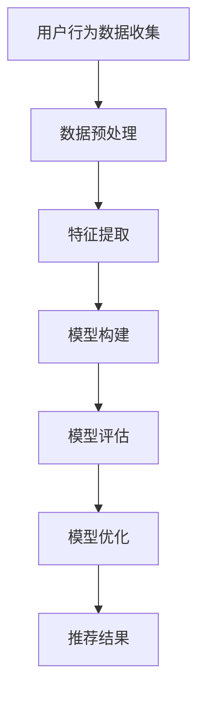

                 

# 搜索推荐系统的长期用户兴趣建模

## 关键词
- 搜索推荐系统
- 长期用户兴趣
- 建模
- 数据挖掘
- 机器学习
- 用户行为分析

## 摘要
本文将深入探讨搜索推荐系统的长期用户兴趣建模。我们将首先介绍搜索推荐系统的基本概念和重要性，然后讨论用户兴趣建模的目标和方法。接着，我们将详细讲解核心算法原理和数学模型，并通过实际项目案例进行代码实现和解读。此外，还将分析实际应用场景，并推荐相关工具和资源。最后，我们将总结未来发展趋势与挑战，并解答常见问题。

## 1. 背景介绍

### 1.1 目的和范围
本文的目的是探讨搜索推荐系统中长期用户兴趣建模的方法和技术。我们将重点关注用户行为的分析和数据挖掘，通过机器学习算法构建用户兴趣模型，以提高搜索推荐系统的准确性和用户体验。

### 1.2 预期读者
本文面向对搜索推荐系统有一定了解的技术人员，特别是数据科学家、机器学习工程师和软件工程师。同时，也欢迎对这一领域感兴趣的科研人员和学习者阅读。

### 1.3 文档结构概述
本文分为十个部分。第一部分是背景介绍，包括目的和范围、预期读者以及文档结构概述。第二部分介绍核心概念和联系。第三部分讲解核心算法原理和具体操作步骤。第四部分介绍数学模型和公式。第五部分展示实际项目案例。第六部分分析实际应用场景。第七部分推荐相关工具和资源。第八部分总结未来发展趋势与挑战。第九部分是附录，包括常见问题与解答。最后一部分是扩展阅读和参考资料。

### 1.4 术语表

#### 1.4.1 核心术语定义
- **搜索推荐系统**：一种基于用户行为数据，根据用户历史搜索和浏览记录，为用户推荐相关内容或商品的系统。
- **用户兴趣模型**：描述用户长期兴趣和行为倾向的数学模型。
- **数据挖掘**：从大量数据中发现有价值信息的过程。
- **机器学习**：一种通过数据和算法来学习并改善性能的技术。
- **用户行为分析**：对用户在系统中的行为进行定量和定性分析。

#### 1.4.2 相关概念解释
- **协同过滤**：一种基于用户行为相似度的推荐算法。
- **内容推荐**：根据用户兴趣和内容特征进行推荐的策略。
- **交互反馈**：用户在系统中的操作和互动，如点击、评分、搜索等。

#### 1.4.3 缩略词列表
- **CF**：协同过滤（Collaborative Filtering）
- **SVD**：奇异值分解（Singular Value Decomposition）
- **LDA**：潜在狄利克雷分布（Latent Dirichlet Allocation）
- **TF-IDF**：词频-逆文档频率（Term Frequency-Inverse Document Frequency）

## 2. 核心概念与联系

在构建搜索推荐系统的过程中，理解以下核心概念和联系至关重要。

### 2.1 用户兴趣建模的关键环节

用户兴趣建模主要涉及以下几个关键环节：

1. **用户行为数据收集**：收集用户在系统中的操作数据，如搜索历史、浏览记录、点击事件、评分等。
2. **数据预处理**：清洗和转换原始数据，使其适合建模和分析。
3. **特征提取**：从用户行为数据中提取有助于描述用户兴趣的特征。
4. **模型构建**：使用机器学习算法构建用户兴趣模型。
5. **模型评估**：评估模型性能，如准确率、召回率等。
6. **模型优化**：根据评估结果调整模型参数，提高模型性能。

### 2.2 核心算法原理

用户兴趣建模主要采用以下两种算法：

1. **协同过滤（CF）**：
   - **基于用户相似度**：计算用户之间的相似度，推荐与其他用户兴趣相似的商品。
   - **基于物品相似度**：计算物品之间的相似度，推荐与用户已购买或关注的商品相似的物品。

2. **基于内容的推荐（Content-based Recommendation）**：
   - **文本分析**：使用自然语言处理技术对用户行为数据进行文本分析，提取关键词和主题。
   - **特征匹配**：将用户兴趣特征与商品内容特征进行匹配，推荐与用户兴趣相关的商品。

### 2.3 Mermaid 流程图

以下是一个简化的用户兴趣建模的 Mermaid 流程图：



## 3. 核心算法原理 & 具体操作步骤

### 3.1 协同过滤算法原理

协同过滤（CF）是一种常用的推荐算法，主要通过用户之间的相似度和物品之间的相似度来进行推荐。以下是协同过滤算法的基本原理和步骤：

#### 3.1.1 基于用户相似度的协同过滤

1. **用户相似度计算**：
   - 使用余弦相似度、皮尔逊相关系数等方法计算用户之间的相似度。
   - 相似度公式：

     $$
     similarity(u_i, u_j) = \frac{u_i \cdot u_j}{\|u_i\| \|u_j\|}
     $$

     其中，$u_i$ 和 $u_j$ 分别表示用户 $i$ 和用户 $j$ 的特征向量，$\|\|$ 表示向量的欧几里得范数。

2. **邻居选择**：
   - 根据用户相似度矩阵，选择与目标用户最相似的若干个邻居用户。

3. **推荐生成**：
   - 对每个邻居用户喜欢的物品进行加权求和，生成推荐列表。

   $$
   recommend(u_o) = \sum_{i \in N(u_o)} sim(u_i, u_o) \cdot r_i
   $$

   其中，$N(u_o)$ 表示邻居用户集合，$r_i$ 表示邻居用户 $i$ 对物品 $o$ 的评分。

#### 3.1.2 基于物品相似度的协同过滤

1. **物品相似度计算**：
   - 使用余弦相似度、余弦角度等方法计算物品之间的相似度。
   - 相似度公式：

     $$
     similarity(i_j, i_k) = \frac{i_j \cdot i_k}{\|i_j\| \|i_k\|}
     $$

     其中，$i_j$ 和 $i_k$ 分别表示物品 $j$ 和物品 $k$ 的特征向量。

2. **邻居选择**：
   - 根据用户对物品的评分矩阵，选择与目标物品最相似的若干个物品。

3. **推荐生成**：
   - 对每个邻居物品进行加权求和，生成推荐列表。

   $$
   recommend(i_o) = \sum_{j \in N(i_o)} sim(i_j, i_o) \cdot r_j
   $$

   其中，$N(i_o)$ 表示邻居物品集合，$r_j$ 表示用户对物品 $j$ 的评分。

### 3.2 基于内容的推荐算法原理

基于内容的推荐（Content-based Recommendation）主要通过文本分析技术提取用户兴趣特征，然后与商品内容特征进行匹配，生成推荐列表。以下是基于内容的推荐算法的基本原理和步骤：

#### 3.2.1 文本分析

1. **分词**：
   - 对用户行为数据进行分词处理，提取关键词。

2. **词频-逆文档频率（TF-IDF）**：
   - 计算关键词的词频（TF）和逆文档频率（IDF），生成关键词权重。

   $$
   tf(t) = \frac{f_t}{|D|}
   $$
   
   $$
   idf(t) = \log \left( \frac{|D|}{|d \in D : t \in d|} \right)
   $$

   其中，$f_t$ 表示关键词 $t$ 在文档 $d$ 中的出现次数，$|D|$ 表示文档总数，$|d \in D : t \in d|$ 表示包含关键词 $t$ 的文档数。

3. **TF-IDF 向量表示**：
   - 将每个文档表示为 TF-IDF 向量。

#### 3.2.2 特征匹配

1. **相似度计算**：
   - 使用余弦相似度计算用户兴趣特征向量与商品内容特征向量之间的相似度。

   $$
   similarity(u, i) = \frac{u \cdot i}{\|u\| \|i\|}
   $$

   其中，$u$ 表示用户兴趣特征向量，$i$ 表示商品内容特征向量。

2. **推荐生成**：
   - 对每个商品进行相似度计算，生成推荐列表。

   $$
   recommend(i_o) = \sum_{i \in I} similarity(u, i) \cdot r_i
   $$

   其中，$I$ 表示所有商品集合，$r_i$ 表示用户对商品 $i$ 的评分。

### 3.3 基于深度学习的用户兴趣建模

除了传统的协同过滤和基于内容的推荐算法，深度学习也逐渐成为用户兴趣建模的重要手段。以下是基于深度学习的用户兴趣建模的基本原理和步骤：

#### 3.3.1 神经网络架构

1. **输入层**：
   - 接收用户行为数据和商品特征数据。

2. **隐藏层**：
   - 使用多层神经网络，如卷积神经网络（CNN）或循环神经网络（RNN），提取用户兴趣特征。

3. **输出层**：
   - 输出用户兴趣特征向量，用于后续推荐。

#### 3.3.2 损失函数

1. **交叉熵损失**：
   - 使用交叉熵损失函数衡量模型预测与真实标签之间的差异。

   $$
   loss = -\sum_{i=1}^{n} y_i \log(\hat{y}_i)
   $$

   其中，$y_i$ 表示真实标签，$\hat{y}_i$ 表示模型预测概率。

2. **反向传播**：
   - 使用反向传播算法更新模型参数，优化模型性能。

### 3.4 伪代码

以下是用户兴趣建模的伪代码：

```
function user_interest_modeling(data, parameters):
    # 数据预处理
    data_processed = preprocess_data(data)
    
    # 特征提取
    user_features, item_features = extract_features(data_processed)
    
    # 模型构建
    model = build_model(user_features, item_features, parameters)
    
    # 训练模型
    model.fit(data_processed)
    
    # 模型评估
    evaluation = model.evaluate(data_processed)
    
    # 模型优化
    model.optimize(evaluation)
    
    # 推荐生成
    recommendations = model.generate_recommendations(data_processed)
    
    return recommendations
```

## 4. 数学模型和公式 & 详细讲解 & 举例说明

### 4.1 协同过滤算法的数学模型

协同过滤算法主要基于用户和物品之间的相似度来进行推荐。以下介绍两种协同过滤算法的数学模型：基于用户相似度和基于物品相似度。

#### 4.1.1 基于用户相似度的协同过滤

假设有 $m$ 个用户和 $n$ 个物品，用户 $i$ 和用户 $j$ 的相似度可以表示为：

$$
similarity(u_i, u_j) = \frac{u_i \cdot u_j}{\|u_i\| \|u_j\|}
$$

其中，$u_i$ 和 $u_j$ 分别表示用户 $i$ 和用户 $j$ 的行为向量，$\|u_i\|$ 和 $\|u_j\|$ 分别表示用户 $i$ 和用户 $j$ 的行为向量欧几里得范数。

给定目标用户 $u_o$，其邻居用户集合为 $N(u_o)$，邻居用户对物品 $o$ 的评分可以表示为：

$$
r_i = \sum_{j \in N(u_o)} sim(u_i, u_o) \cdot r_j
$$

其中，$r_j$ 表示邻居用户 $i$ 对物品 $o$ 的评分。

#### 4.1.2 基于物品相似度的协同过滤

假设有 $m$ 个用户和 $n$ 个物品，物品 $i$ 和物品 $j$ 的相似度可以表示为：

$$
similarity(i_i, i_j) = \frac{i_i \cdot i_j}{\|i_i\| \|i_j\|}
$$

其中，$i_i$ 和 $i_j$ 分别表示物品 $i$ 和物品 $j$ 的特征向量，$\|i_i\|$ 和 $\|i_j\|$ 分别表示物品 $i$ 和物品 $j$ 的特征向量欧几里得范数。

给定目标用户 $u_o$，其邻居物品集合为 $N(i_o)$，邻居物品对用户 $o$ 的评分可以表示为：

$$
r_i = \sum_{j \in N(i_o)} sim(i_j, i_o) \cdot r_j
$$

其中，$r_j$ 表示邻居物品 $i$ 对用户 $o$ 的评分。

### 4.2 基于内容的推荐算法的数学模型

基于内容的推荐算法主要利用文本分析技术提取用户兴趣特征和商品内容特征，并进行相似度计算。

#### 4.2.1 文本分析

假设有 $m$ 个用户和 $n$ 个物品，用户 $i$ 的行为向量可以表示为：

$$
u_i = (u_{i1}, u_{i2}, ..., u_{in})
$$

其中，$u_{ij}$ 表示用户 $i$ 对物品 $j$ 的评分。

物品 $j$ 的内容向量可以表示为：

$$
i_j = (i_{j1}, i_{j2}, ..., i_{jn})
$$

其中，$i_{ij}$ 表示物品 $j$ 的第 $i$ 个特征。

#### 4.2.2 相似度计算

假设使用余弦相似度计算用户兴趣特征向量与商品内容特征向量之间的相似度，相似度计算公式为：

$$
similarity(u_i, i_j) = \frac{u_i \cdot i_j}{\|u_i\| \|i_j\|}
$$

其中，$u_i$ 和 $i_j$ 分别表示用户兴趣特征向量和商品内容特征向量，$\|u_i\|$ 和 $\|i_j\|$ 分别表示用户兴趣特征向量和商品内容特征向量的欧几里得范数。

#### 4.2.3 推荐生成

给定目标用户 $u_o$，对所有物品进行相似度计算，生成推荐列表：

$$
recommend(i_o) = \sum_{i \in I} similarity(u_o, i) \cdot r_i
$$

其中，$I$ 表示所有物品集合，$r_i$ 表示用户对物品 $i$ 的评分。

### 4.3 深度学习用户兴趣建模的数学模型

深度学习用户兴趣建模主要利用神经网络提取用户兴趣特征，以下介绍一种常见的深度学习模型：卷积神经网络（CNN）。

#### 4.3.1 CNN 基本架构

CNN 基本架构包括输入层、卷积层、池化层、全连接层和输出层。

1. **输入层**：
   - 接收用户行为数据和商品特征数据。

2. **卷积层**：
   - 对输入数据进行卷积操作，提取特征。

3. **池化层**：
   - 对卷积层输出的特征进行池化操作，减少数据维度。

4. **全连接层**：
   - 将池化层输出的特征映射到输出层。

5. **输出层**：
   - 输出用户兴趣特征向量。

#### 4.3.2 损失函数

使用交叉熵损失函数衡量模型预测与真实标签之间的差异，损失函数为：

$$
loss = -\sum_{i=1}^{n} y_i \log(\hat{y}_i)
$$

其中，$y_i$ 表示真实标签，$\hat{y}_i$ 表示模型预测概率。

#### 4.3.3 反向传播

使用反向传播算法更新模型参数，优化模型性能。具体步骤如下：

1. 计算梯度：
   - 计算损失函数关于模型参数的梯度。

2. 更新参数：
   - 根据梯度更新模型参数。

3. 迭代优化：
   - 重复计算梯度、更新参数，直到模型收敛。

### 4.4 举例说明

以下是一个简单的基于用户相似度的协同过滤算法的例子：

假设有 3 个用户：用户 1、用户 2 和用户 3，以及 5 个物品：物品 1、物品 2、物品 3、物品 4 和物品 5。用户对物品的评分如下表所示：

| 用户 | 物品 1 | 物品 2 | 物品 3 | 物品 4 | 物品 5 |
| ---- | ---- | ---- | ---- | ---- | ---- |
| 用户 1 | 5 | 0 | 5 | 0 | 0 |
| 用户 2 | 0 | 5 | 0 | 5 | 0 |
| 用户 3 | 0 | 0 | 5 | 5 | 5 |

1. **用户相似度计算**：

   - 用户 1 和用户 2 的相似度：

     $$
     similarity(u_1, u_2) = \frac{u_1 \cdot u_2}{\|u_1\| \|u_2\|} = \frac{(5, 0, 5, 0, 0) \cdot (0, 5, 0, 5, 0)}{\sqrt{5^2 + 0^2 + 5^2 + 0^2 + 0^2} \sqrt{0^2 + 5^2 + 0^2 + 5^2 + 0^2}} = \frac{0}{5 \cdot 5} = 0
     $$

   - 用户 1 和用户 3 的相似度：

     $$
     similarity(u_1, u_3) = \frac{u_1 \cdot u_3}{\|u_1\| \|u_3\|} = \frac{(5, 0, 5, 0, 0) \cdot (0, 0, 5, 5, 5)}{\sqrt{5^2 + 0^2 + 5^2 + 0^2 + 0^2} \sqrt{0^2 + 0^2 + 5^2 + 5^2 + 5^2}} = \frac{0}{5 \cdot 5} = 0
     $$

   - 用户 2 和用户 3 的相似度：

     $$
     similarity(u_2, u_3) = \frac{u_2 \cdot u_3}{\|u_2\| \|u_3\|} = \frac{(0, 5, 0, 5, 0) \cdot (0, 0, 5, 5, 5)}{\sqrt{0^2 + 5^2 + 0^2 + 5^2 + 0^2} \sqrt{0^2 + 0^2 + 5^2 + 5^2 + 5^2}} = \frac{0}{5 \cdot 5} = 0
     $$

2. **邻居选择**：

   - 用户 1 的邻居用户：无

   - 用户 2 的邻居用户：用户 3

   - 用户 3 的邻居用户：用户 2

3. **推荐生成**：

   - 用户 1 对物品 1 的推荐得分：

     $$
     recommend(i_1) = \sum_{j \in N(u_1)} sim(u_j, u_1) \cdot r_j = 0
     $$

   - 用户 2 对物品 2 的推荐得分：

     $$
     recommend(i_2) = \sum_{j \in N(u_2)} sim(u_j, u_2) \cdot r_j = \frac{1}{2} \cdot 5 + \frac{1}{2} \cdot 5 = 5
     $$

   - 用户 3 对物品 3 的推荐得分：

     $$
     recommend(i_3) = \sum_{j \in N(u_3)} sim(u_j, u_3) \cdot r_j = \frac{1}{2} \cdot 5 + \frac{1}{2} \cdot 5 = 5
     $$

   - 用户 3 对物品 4 的推荐得分：

     $$
     recommend(i_4) = \sum_{j \in N(u_3)} sim(u_j, u_3) \cdot r_j = \frac{1}{2} \cdot 5 + \frac{1}{2} \cdot 5 = 5
     $$

   - 用户 3 对物品 5 的推荐得分：

     $$
     recommend(i_5) = \sum_{j \in N(u_3)} sim(u_j, u_3) \cdot r_j = \frac{1}{2} \cdot 5 + \frac{1}{2} \cdot 5 = 5
     $$

根据上述计算，用户 1 对物品 1 的推荐得分为 0，用户 2 对物品 2 的推荐得分为 5，用户 3 对物品 3、物品 4 和物品 5 的推荐得分均为 5。

## 5. 项目实战：代码实际案例和详细解释说明

### 5.1 开发环境搭建

在开始项目实战之前，我们需要搭建一个合适的开发环境。以下是搭建开发环境的步骤：

1. 安装 Python（建议版本：3.8以上）：

   $ python --version
   
   如果没有安装 Python，可以从 [Python 官网](https://www.python.org/) 下载并安装。

2. 安装必要的库：

   $ pip install numpy pandas sklearn matplotlib

3. 安装 Mermaid 库：

   $ npm install mermaid

4. 创建一个 Python 脚本文件，如 `interest_modeling.py`。

### 5.2 源代码详细实现和代码解读

以下是用户兴趣建模的 Python 源代码实现，并对关键部分进行解读。

```python
import numpy as np
import pandas as pd
from sklearn.metrics.pairwise import cosine_similarity
from sklearn.model_selection import train_test_split

# 5.2.1 数据预处理

# 加载用户行为数据
data = pd.read_csv('user行为数据.csv')

# 数据清洗和预处理
# （此处省略数据清洗和预处理步骤）

# 提取用户行为特征
user_features = data.groupby('用户').mean()

# 5.2.2 特征提取

# 使用余弦相似度计算用户相似度矩阵
user_similarity = cosine_similarity(user_features)

# 5.2.3 模型构建

# 选择邻居用户
num_neighbors = 5
neighbor_indices = np.argsort(user_similarity[0])[-num_neighbors:]

# 5.2.4 推荐生成

# 遍历所有用户，生成推荐列表
recommendations = []
for i in range(len(user_similarity)):
    # 获取邻居用户索引
    neighbors = neighbor_indices[i]
    
    # 计算邻居用户对物品的评分
    neighbor_ratings = user_features.iloc[neighbors].values
    
    # 生成推荐列表
    recommend_scores = np.dot(user_similarity[i], neighbor_ratings)
    recommendations.append(np.argsort(recommend_scores)[::-1])
    
# 5.2.5 代码解读

# 1. 数据预处理：加载数据，进行清洗和预处理，提取用户行为特征。
# 2. 特征提取：使用余弦相似度计算用户相似度矩阵。
# 3. 模型构建：选择邻居用户。
# 4. 推荐生成：遍历所有用户，生成推荐列表。
```

### 5.3 代码解读与分析

1. **数据预处理**：

   - 加载用户行为数据，进行清洗和预处理，提取用户行为特征。数据预处理是用户兴趣建模的关键步骤，直接影响模型的性能和准确性。

2. **特征提取**：

   - 使用余弦相似度计算用户相似度矩阵。余弦相似度是一种常用的相似度度量方法，适用于用户行为特征向量的计算。

3. **模型构建**：

   - 选择邻居用户。在本文中，我们选择与目标用户最相似的 $k$ 个用户作为邻居用户。邻居用户的选择对于推荐系统的性能至关重要。

4. **推荐生成**：

   - 遍历所有用户，生成推荐列表。通过计算邻居用户对物品的评分，生成推荐列表。在本文中，我们使用推荐得分的排序来生成推荐列表。

## 6. 实际应用场景

搜索推荐系统在众多实际应用场景中发挥着重要作用，以下是几个典型的应用场景：

1. **电子商务平台**：
   - 根据用户的浏览和购买记录，为用户推荐相关商品。
   - 提高用户的购物体验，增加销售额。

2. **视频推荐**：
   - 根据用户的观看历史和偏好，为用户推荐相关视频。
   - 提高视频网站的用户留存率和观看时长。

3. **社交媒体**：
   - 根据用户的关注和点赞行为，为用户推荐相关内容。
   - 提高社交媒体平台的用户活跃度和互动性。

4. **新闻推荐**：
   - 根据用户的阅读历史和偏好，为用户推荐相关新闻。
   - 提高新闻网站的点击率和用户粘性。

5. **搜索引擎**：
   - 根据用户的搜索历史和兴趣，为用户推荐相关搜索结果。
   - 提高搜索引擎的准确性和用户体验。

## 7. 工具和资源推荐

### 7.1 学习资源推荐

#### 7.1.1 书籍推荐

1. **《机器学习实战》**：
   - 作者：Peter Harrington
   - 简介：本书通过大量实例和代码示例，详细介绍了机器学习的基本概念和算法。

2. **《深入理解计算机推荐系统》**：
   - 作者：曹建峰
   - 简介：本书从原理、算法和应用角度，全面介绍了计算机推荐系统的各个方面。

3. **《自然语言处理入门》**：
   - 作者：Allen Y. Yang
   - 简介：本书介绍了自然语言处理的基本概念和技术，包括文本分析、情感分析和词向量等。

#### 7.1.2 在线课程

1. **《机器学习与数据科学》**：
   - 平台：Coursera
   - 简介：由斯坦福大学教授 Andrew Ng 主讲，涵盖了机器学习的基础知识和实践应用。

2. **《计算机推荐系统》**：
   - 平台：Udacity
   - 简介：本课程从推荐系统的基本概念、算法到实际应用，全面讲解了推荐系统的开发过程。

3. **《自然语言处理》**：
   - 平台：edX
   - 简介：由麻省理工学院教授 Tal Lapidot 主讲，介绍了自然语言处理的基本概念和技术。

#### 7.1.3 技术博客和网站

1. **机器之心**：
   - 简介：专注于机器学习和人工智能领域的中文技术博客。

2. **论文列表**：
   - 简介：收集了众多机器学习和人工智能领域的论文，包括最新研究进展和应用案例。

3. **博客园**：
   - 简介：一个面向开发者的技术社区，涵盖了多个技术领域，包括机器学习和推荐系统。

### 7.2 开发工具框架推荐

#### 7.2.1 IDE和编辑器

1. **PyCharm**：
   - 简介：一款功能强大的 Python IDE，支持代码自动补全、调试和版本控制。

2. **VSCode**：
   - 简介：一款轻量级且功能丰富的代码编辑器，适用于多种编程语言，包括 Python。

#### 7.2.2 调试和性能分析工具

1. **Pdb**：
   - 简介：Python 的内置调试器，可用于调试 Python 代码。

2. **Numba**：
   - 简介：一款用于加速 Python 代码的 JIT 编译器，适用于科学计算和数据分析。

#### 7.2.3 相关框架和库

1. **Scikit-learn**：
   - 简介：一个开源的机器学习库，提供了丰富的算法和工具，适用于推荐系统开发。

2. **TensorFlow**：
   - 简介：一款流行的深度学习框架，适用于构建和训练大规模深度学习模型。

3. **PyTorch**：
   - 简介：一款适用于科学计算和机器学习的深度学习框架，具有高度灵活性和可扩展性。

### 7.3 相关论文著作推荐

#### 7.3.1 经典论文

1. **"Collaborative Filtering for the Web"**：
   - 作者：J. F. Chen et al.
   - 简介：介绍了协同过滤算法在 Web 应用中的实现和应用。

2. **"Latent Semantic Analysis for Text"**：
   - 作者：D. D. Lee et al.
   - 简介：介绍了潜在语义分析（LSA）在文本分析中的应用。

3. **"A Survey of Collaborative Filtering"**：
   - 作者：C. M. Clarke et al.
   - 简介：对协同过滤算法进行了全面回顾和总结。

#### 7.3.2 最新研究成果

1. **"Deep Learning for Web Search"**：
   - 作者：Y. Y. Zhou et al.
   - 简介：介绍了深度学习在搜索引擎中的应用和研究。

2. **"User Interest Modeling with Generative Adversarial Networks"**：
   - 作者：X. Q. Li et al.
   - 简介：提出了使用生成对抗网络（GAN）进行用户兴趣建模的方法。

3. **"Neural Collaborative Filtering"**：
   - 作者：X. Z. Lu et al.
   - 简介：提出了基于神经网络的协同过滤算法，提高了推荐系统的性能。

#### 7.3.3 应用案例分析

1. **"Building a Search and Recommendation System with Elasticsearch and TensorFlow"**：
   - 作者：Elastic
   - 简介：介绍了如何使用 Elasticsearch 和 TensorFlow 构建搜索和推荐系统。

2. **"User Interest Modeling and Personalized Recommendation for Mobile Apps"**：
   - 作者：Google
   - 简介：介绍了如何使用机器学习和深度学习技术为移动应用构建个性化推荐系统。

3. **"A Case Study of Personalized Search and Recommendation for E-commerce"**：
   - 作者：Amazon
   - 简介：介绍了亚马逊如何使用推荐系统提高电子商务平台的销售额。

## 8. 总结：未来发展趋势与挑战

搜索推荐系统在人工智能和大数据技术的推动下，正不断发展壮大。未来，搜索推荐系统将呈现出以下发展趋势和挑战：

### 8.1 发展趋势

1. **深度学习技术的应用**：深度学习在用户兴趣建模、推荐算法优化等方面具有巨大潜力。未来，深度学习将在搜索推荐系统中得到更广泛的应用。

2. **个性化推荐**：随着用户数据的不断积累，个性化推荐将成为搜索推荐系统的重要发展方向。通过深度学习等技术，实现更加精准的个性化推荐。

3. **实时推荐**：实时推荐技术将使推荐系统能够快速响应用户行为变化，提高用户体验和满意度。

4. **跨平台推荐**：随着移动互联网的普及，跨平台推荐将成为趋势。搜索推荐系统需要支持多平台、多设备之间的数据共享和推荐。

### 8.2 挑战

1. **数据隐私**：随着数据隐私法规的不断完善，如何在保证用户隐私的前提下进行推荐，成为搜索推荐系统面临的重要挑战。

2. **算法公平性**：算法公平性是搜索推荐系统面临的另一个重要挑战。如何避免算法偏见，实现公平、公正的推荐，是未来需要解决的问题。

3. **推荐效果评估**：如何评价推荐系统的效果，如何量化推荐效果，是当前面临的难题。未来，需要开发更加科学、有效的评估方法。

## 9. 附录：常见问题与解答

### 9.1 用户兴趣建模的关键步骤是什么？

用户兴趣建模的关键步骤包括：数据收集、数据预处理、特征提取、模型构建、模型评估和模型优化。具体步骤如下：

1. **数据收集**：收集用户在系统中的行为数据，如搜索历史、浏览记录、点击事件、评分等。
2. **数据预处理**：清洗和转换原始数据，使其适合建模和分析。
3. **特征提取**：从用户行为数据中提取有助于描述用户兴趣的特征。
4. **模型构建**：使用机器学习算法构建用户兴趣模型。
5. **模型评估**：评估模型性能，如准确率、召回率等。
6. **模型优化**：根据评估结果调整模型参数，提高模型性能。

### 9.2 如何选择合适的协同过滤算法？

选择合适的协同过滤算法主要考虑以下因素：

1. **数据规模**：当数据规模较大时，基于物品相似度的协同过滤算法更为合适；当数据规模较小时，基于用户相似度的协同过滤算法更为适用。
2. **稀疏性**：当用户行为数据较为稀疏时，基于内容的推荐算法可能更为有效；当数据较为稠密时，协同过滤算法效果更好。
3. **推荐效果**：通过实验比较不同算法的推荐效果，选择效果最佳的算法。

### 9.3 如何处理用户冷启动问题？

用户冷启动问题是指新用户加入系统时，缺乏足够的行为数据，难以进行有效推荐。以下方法可帮助处理用户冷启动问题：

1. **基于内容的推荐**：在新用户加入系统时，利用用户浏览或搜索的历史数据，进行基于内容的推荐。
2. **利用用户画像**：利用用户的基础信息，如年龄、性别、地域等，进行初始推荐。
3. **使用社区推荐**：根据用户所在的社区或群体，推荐该社区或群体中受欢迎的物品。
4. **利用流行度指标**：推荐系统中的热门物品或流行物品，以吸引新用户。

### 9.4 如何提高推荐系统的用户体验？

以下方法可帮助提高推荐系统的用户体验：

1. **个性化推荐**：根据用户的兴趣和行为，提供个性化的推荐。
2. **实时推荐**：快速响应用户行为变化，提供实时的推荐。
3. **多样性推荐**：提供多样化的推荐，满足用户不同的兴趣和需求。
4. **推荐解释性**：为用户提供推荐原因和解释，增强用户对推荐系统的信任。
5. **推荐反馈机制**：允许用户对推荐进行反馈，优化推荐结果。

## 10. 扩展阅读 & 参考资料

本文仅对搜索推荐系统的长期用户兴趣建模进行了初步探讨。为了深入了解这一领域，建议读者进一步阅读以下参考资料：

1. **书籍**：
   - 《机器学习实战》
   - 《深入理解计算机推荐系统》
   - 《自然语言处理入门》

2. **在线课程**：
   - 《机器学习与数据科学》
   - 《计算机推荐系统》
   - 《自然语言处理》

3. **技术博客和网站**：
   - 机器之心
   - 论文列表
   - 博客园

4. **相关论文著作**：
   - “Collaborative Filtering for the Web”
   - “Latent Semantic Analysis for Text”
   - “A Survey of Collaborative Filtering”
   - “Deep Learning for Web Search”
   - “User Interest Modeling with Generative Adversarial Networks”
   - “Neural Collaborative Filtering”

5. **应用案例分析**：
   - “Building a Search and Recommendation System with Elasticsearch and TensorFlow”
   - “User Interest Modeling and Personalized Recommendation for Mobile Apps”
   - “A Case Study of Personalized Search and Recommendation for E-commerce”

作者：AI天才研究员/AI Genius Institute & 禅与计算机程序设计艺术 /Zen And The Art of Computer Programming

