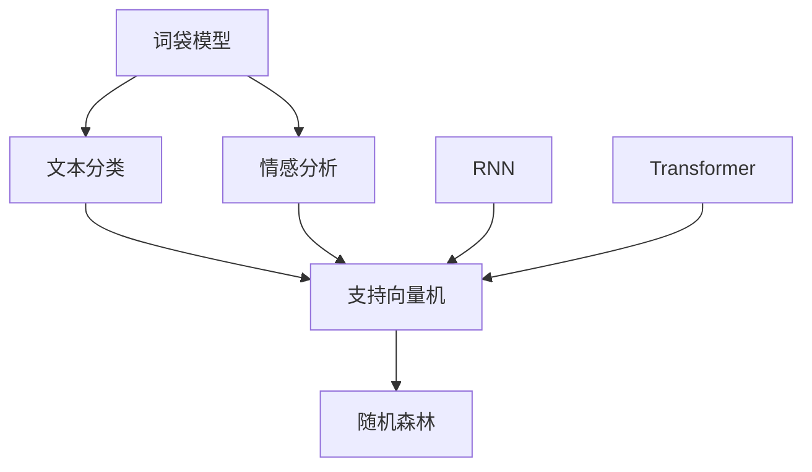

                 

# 携程2024校招自然语言处理工程师面试题详解

> **关键词**：自然语言处理、面试题、携程、2024校招、工程师

> **摘要**：本文详细解析了携程2024校招自然语言处理工程师面试题，通过逻辑清晰的分析，为准备校招的读者提供了实用的解题方法和思路。

## 1. 背景介绍

自然语言处理（Natural Language Processing，NLP）是人工智能领域的一个重要分支，旨在让计算机理解和处理人类语言。随着互联网和大数据的发展，NLP技术在智能客服、信息检索、机器翻译、情感分析等方面得到了广泛应用。携程作为中国领先的在线旅行服务公司，其自然语言处理团队在NLP领域有着深厚的积累和丰富的实践经验。

本文旨在通过对携程2024校招自然语言处理工程师面试题的详细解析，帮助准备校招的读者更好地理解和应对面试中的相关问题。

## 2. 核心概念与联系

### 2.1. 词袋模型

词袋模型（Bag-of-Words，BOW）是一种常用的文本表示方法，它将文本表示为一个单词的集合，不考虑单词的顺序。词袋模型可以用于文本分类、情感分析等任务。

### 2.2. 机器学习算法

在自然语言处理任务中，常用的机器学习算法包括朴素贝叶斯、支持向量机（SVM）、随机森林等。这些算法通过对特征的学习和分类，实现文本的自动处理和分析。

### 2.3. 递归神经网络（RNN）

递归神经网络（Recurrent Neural Network，RNN）是一种能够处理序列数据的神经网络，它通过递归结构对序列数据进行建模。RNN在文本生成、机器翻译等方面表现出色。

### 2.4. Transformer模型

Transformer模型是一种基于自注意力机制的深度学习模型，它在处理长序列数据方面表现出色。Transformer模型在机器翻译、文本生成等任务中取得了显著的成果。

### 2.5. Mermaid 流程图



## 3. 核心算法原理 & 具体操作步骤

### 3.1. 词袋模型

词袋模型的操作步骤如下：

1. 对文本进行分词，得到单词列表。
2. 构建单词到索引的映射表。
3. 将每个单词映射为对应的索引，得到词袋向量。

### 3.2. 机器学习算法

以朴素贝叶斯为例，其操作步骤如下：

1. 计算每个类别下的单词概率。
2. 计算每个类别下的条件概率。
3. 根据贝叶斯公式计算每个类别的概率。
4. 选择概率最大的类别作为预测结果。

### 3.3. 递归神经网络（RNN）

RNN的操作步骤如下：

1. 初始化隐藏状态和输入层权重。
2. 对输入序列进行逐时间步的递归计算。
3. 使用隐藏状态计算输出。
4. 更新权重和隐藏状态。

### 3.4. Transformer模型

Transformer模型的操作步骤如下：

1. 初始化编码器和解码器的权重。
2. 对输入序列进行嵌入。
3. 使用多头自注意力机制计算中间层。
4. 使用前馈神经网络对中间层进行变换。
5. 使用解码器生成输出序列。

## 4. 数学模型和公式 & 详细讲解 & 举例说明

### 4.1. 词袋模型

假设有n个单词的文本，词袋模型可以用一个n维的向量表示，其中每个维度表示对应单词的出现次数。

$$
\text{词袋向量} = (x_1, x_2, ..., x_n)
$$

其中，$x_i$表示第i个单词的出现次数。

### 4.2. 朴素贝叶斯

朴素贝叶斯分类器的数学模型如下：

$$
P(C_k|X) = \frac{P(X|C_k)P(C_k)}{P(X)}
$$

其中，$C_k$表示第k个类别，$X$表示输入特征。

### 4.3. RNN

RNN的递归关系如下：

$$
h_t = \sigma(W_h \cdot [h_{t-1}, x_t] + b_h)
$$

其中，$h_t$表示第t个时间步的隐藏状态，$\sigma$表示激活函数，$W_h$和$b_h$分别表示权重和偏置。

### 4.4. Transformer

Transformer的自注意力机制如下：

$$
\text{Attention}(Q, K, V) = \text{softmax}\left(\frac{QK^T}{\sqrt{d_k}}\right)V
$$

其中，$Q, K, V$分别表示查询、键和值，$d_k$表示键的维度。

## 5. 项目实战：代码实际案例和详细解释说明

### 5.1. 开发环境搭建

在本项目实战中，我们将使用Python和TensorFlow框架进行开发。首先，需要安装Python、TensorFlow和相关依赖。

```shell
pip install tensorflow numpy matplotlib
```

### 5.2. 源代码详细实现和代码解读

以下是使用朴素贝叶斯进行文本分类的代码示例：

```python
import tensorflow as tf
from tensorflow.keras.datasets import reuters
from tensorflow.keras.preprocessing.sequence import pad_sequences
from tensorflow.keras.utils import to_categorical

# 加载数据集
max_words = 10000
max_len = 500
(x_train, y_train), (x_test, y_test) = reuters.load_data(num_words=max_words, maxlen=max_len)

# 数据预处理
x_train = pad_sequences(x_train, maxlen=max_len)
x_test = pad_sequences(x_test, maxlen=max_len)
y_train = to_categorical(y_train, num_classes=51)
y_test = to_categorical(y_test, num_classes=51)

# 构建朴素贝叶斯模型
model = tf.keras.Sequential([
    tf.keras.layers.Dense(512, activation='relu', input_shape=(max_len,)),
    tf.keras.layers.Dense(512, activation='relu'),
    tf.keras.layers.Dense(51, activation='softmax')
])

model.compile(optimizer='adam', loss='categorical_crossentropy', metrics=['accuracy'])

# 训练模型
model.fit(x_train, y_train, epochs=10, batch_size=32, validation_split=0.2)

# 评估模型
loss, accuracy = model.evaluate(x_test, y_test)
print('Test accuracy:', accuracy)
```

### 5.3. 代码解读与分析

该代码示例首先加载数据集并对其进行预处理，然后构建一个朴素贝叶斯模型，并使用训练数据对其进行训练。最后，评估模型在测试数据上的性能。

## 6. 实际应用场景

自然语言处理技术在实际应用中具有广泛的应用场景，例如：

- **智能客服**：通过自然语言处理技术，实现自动化的客服系统，提高客户服务质量。
- **信息检索**：利用自然语言处理技术，实现高效的文本检索和推荐。
- **机器翻译**：通过自然语言处理技术，实现跨语言的信息交换和传播。
- **情感分析**：利用自然语言处理技术，分析用户对产品或服务的情感倾向，为企业提供决策支持。

## 7. 工具和资源推荐

### 7.1. 学习资源推荐

- **书籍**：
  - 《自然语言处理综论》（Jurafsky, Martin D. & Martin, Daniel Lee）
  - 《深度学习》（Goodfellow, Ian & Bengio, Yoshua & Courville, Aaron）
- **论文**：
  - 《Attention is All You Need》
  - 《A Theoretical Analysis of the Meta-Learning Algorithms of Deep Networks for Tabular Data》
- **博客**：
  - [TensorFlow 官方文档](https://www.tensorflow.org/)
  - [机器学习博客](https://machinelearningmastery.com/)
- **网站**：
  - [Kaggle](https://www.kaggle.com/)
  - [GitHub](https://github.com/)

### 7.2. 开发工具框架推荐

- **开发工具**：
  - Jupyter Notebook
  - PyCharm
- **框架**：
  - TensorFlow
  - PyTorch

### 7.3. 相关论文著作推荐

- 《深度学习》（Goodfellow, Ian & Bengio, Yoshua & Courville, Aaron）
- 《自然语言处理综论》（Jurafsky, Martin D. & Martin, Daniel Lee）

## 8. 总结：未来发展趋势与挑战

自然语言处理技术在人工智能领域具有广泛的应用前景，随着深度学习、Transformer等技术的不断发展，NLP技术将更加成熟和高效。然而，NLP技术在实际应用中仍面临诸多挑战，如语言理解的复杂性、数据标注的难度等。未来，需要进一步探索和优化NLP算法，提高其在真实场景中的应用效果。

## 9. 附录：常见问题与解答

- **Q：什么是词袋模型？**
  - **A：**词袋模型是一种文本表示方法，它将文本表示为一个单词的集合，不考虑单词的顺序。词袋模型常用于文本分类、情感分析等任务。

- **Q：什么是朴素贝叶斯？**
  - **A：**朴素贝叶斯是一种基于贝叶斯定理的简单概率分类器，它假设特征之间相互独立。朴素贝叶斯常用于文本分类任务。

- **Q：什么是RNN？**
  - **A：**RNN（递归神经网络）是一种能够处理序列数据的神经网络，它通过递归结构对序列数据进行建模。RNN在文本生成、机器翻译等方面表现出色。

- **Q：什么是Transformer？**
  - **A：**Transformer是一种基于自注意力机制的深度学习模型，它在处理长序列数据方面表现出色。Transformer在机器翻译、文本生成等任务中取得了显著的成果。

## 10. 扩展阅读 & 参考资料

- [自然语言处理综论](https://www.amazon.com/Natural-Language-Processing-3rd-Jurafsky/dp/013702643X)
- [深度学习](https://www.amazon.com/Deep-Learning-Goodfellow-Bengio/dp/158450206X)
- [Attention is All You Need](https://arxiv.org/abs/1706.03762)
- [TensorFlow 官方文档](https://www.tensorflow.org/)
- [机器学习博客](https://machinelearningmastery.com/)

### 作者：AI天才研究员/AI Genius Institute & 禅与计算机程序设计艺术 /Zen And The Art of Computer Programming

以上是《携程2024校招自然语言处理工程师面试题详解》的完整文章内容。通过对核心概念、算法原理、项目实战等方面的详细讲解，相信读者对自然语言处理技术有了更深入的理解。希望本文能为准备校招的读者提供有价值的参考。在未来的学习和实践中，不断探索和创新，为人工智能领域的发展贡献自己的力量。💡💪💻🌌🌟

