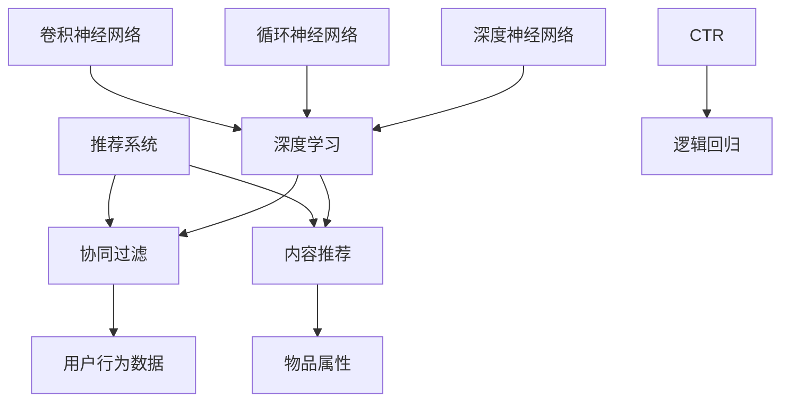
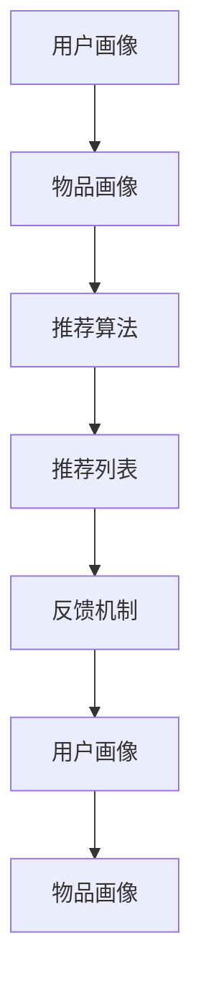
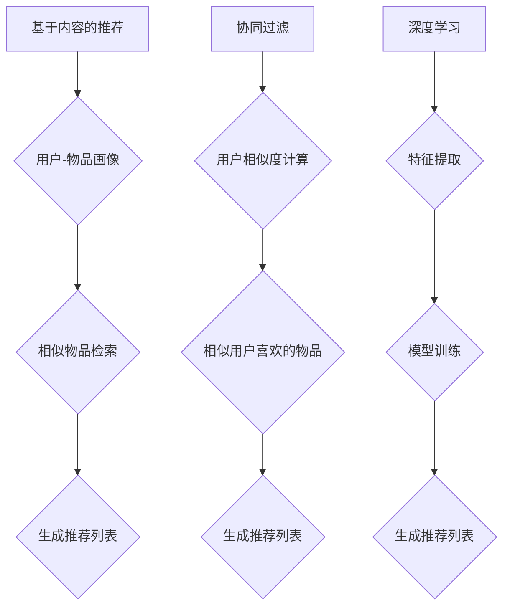

                 

# 携程旅游2024校招旅游推荐算法面试题解析

> **关键词：** 旅游推荐算法、携程、校招、面试题解析、深度学习、机器学习、数据挖掘、协作过滤、内容推荐。

> **摘要：** 本文将针对携程旅游2024校招中的旅游推荐算法面试题进行深入解析，通过一步步的逻辑推理，详细讲解推荐系统的核心概念、算法原理、数学模型及实际应用场景。旨在帮助读者掌握旅游推荐算法的核心要点，为面试做好准备。

## 1. 背景介绍

### 1.1 目的和范围

本文旨在解析携程旅游2024校招中的旅游推荐算法面试题，帮助读者理解旅游推荐算法的核心概念、原理和实践方法。文章涵盖以下内容：

- 推荐系统的基本概念和架构
- 常见的旅游推荐算法
- 深度学习在旅游推荐中的应用
- 数学模型和公式的详细讲解
- 实际应用场景分析
- 开发工具和资源推荐

### 1.2 预期读者

本文面向计算机科学、人工智能、数据科学等相关专业的在校生和职场人士。读者应具备一定的编程基础和算法知识，对推荐系统有初步了解。

### 1.3 文档结构概述

本文分为以下八个部分：

1. 背景介绍
2. 核心概念与联系
3. 核心算法原理 & 具体操作步骤
4. 数学模型和公式 & 详细讲解 & 举例说明
5. 项目实战：代码实际案例和详细解释说明
6. 实际应用场景
7. 工具和资源推荐
8. 总结：未来发展趋势与挑战

### 1.4 术语表

#### 1.4.1 核心术语定义

- **推荐系统（Recommendation System）：** 根据用户的兴趣和偏好，为用户推荐相关物品或内容的系统。
- **协同过滤（Collaborative Filtering）：** 通过收集用户的历史行为数据，找出相似用户并推荐相似用户喜欢的物品。
- **内容推荐（Content-based Filtering）：** 根据用户的历史行为和物品的属性，找出相似物品并推荐。
- **深度学习（Deep Learning）：** 基于多层神经网络进行特征提取和模型训练的方法。

#### 1.4.2 相关概念解释

- **用户行为数据（User Behavior Data）：** 用户在系统中产生的行为数据，如浏览、收藏、购买等。
- **物品属性（Item Features）：** 描述物品特征的属性，如景区类型、评分、价格等。
- **协同矩阵（Co-occurrence Matrix）：** 描述用户-物品交互的矩阵，用于协同过滤算法。

#### 1.4.3 缩略词列表

- **CTR：** 点击率（Click-Through Rate）
- **LR：** 逻辑回归（Logistic Regression）
- **CNN：** 卷积神经网络（Convolutional Neural Network）
- **RNN：** 循环神经网络（Recurrent Neural Network）
- **DNN：** 深度神经网络（Deep Neural Network）

## 2. 核心概念与联系

在讨论旅游推荐算法之前，我们需要了解一些核心概念和它们之间的联系。以下是一个Mermaid流程图，展示了这些概念和它们之间的关系。



- **推荐系统** 是一个核心概念，它涵盖了协同过滤和内容推荐两种主要的推荐方法。
- **协同过滤** 主要依赖于用户行为数据，通过分析用户之间的相似度来推荐物品。
- **内容推荐** 则侧重于物品属性，根据用户的历史行为和物品属性找出相似物品进行推荐。
- **深度学习** 是一种强大的工具，可以用于特征提取和模型训练，广泛应用于协同过滤和内容推荐。

### 2.1 推荐系统的架构

推荐系统通常由以下几个主要组件构成：

1. **用户画像（User Profile）：** 描述用户兴趣和偏好的数据结构。
2. **物品画像（Item Profile）：** 描述物品特征的数据结构。
3. **推荐算法（Recommendation Algorithm）：** 根据用户和物品的画像，生成推荐列表。
4. **反馈机制（Feedback Mechanism）：** 收集用户对推荐结果的反馈，用于模型优化。

以下是一个Mermaid流程图，展示了推荐系统的整体架构。



### 2.2 常见的推荐算法

旅游推荐算法主要包括以下几种：

1. **基于内容的推荐（Content-based Recommendation）：** 根据用户的历史行为和物品属性，找出相似物品进行推荐。
2. **协同过滤（Collaborative Filtering）：** 通过分析用户之间的相似度，找出相似用户喜欢的物品进行推荐。
3. **深度学习（Deep Learning）：** 利用神经网络进行特征提取和模型训练，用于协同过滤和内容推荐。

以下是一个Mermaid流程图，展示了这些算法的基本原理。



## 3. 核心算法原理 & 具体操作步骤

在本节中，我们将详细讨论三种核心旅游推荐算法的原理和具体操作步骤：基于内容的推荐、协同过滤和深度学习。

### 3.1 基于内容的推荐

#### 算法原理：

基于内容的推荐算法主要通过分析用户历史行为和物品属性，找到相似物品进行推荐。其核心思想是：

- **用户-物品画像：** 描述用户和物品的特征向量。
- **相似性度量：** 通过计算用户和物品特征向量之间的相似度，找到相似物品。
- **生成推荐列表：** 根据相似度分数，生成推荐列表。

#### 具体操作步骤：

1. **构建用户-物品画像：**
   - 用户画像：包括用户的兴趣标签、浏览历史、收藏记录等。
   - 物品画像：包括物品的属性信息，如景区类型、风景特点、价格等。

2. **相似性度量：**
   - 使用余弦相似度、欧氏距离等相似性度量方法，计算用户和物品特征向量之间的相似度。

3. **生成推荐列表：**
   - 根据相似度分数，从相似物品中选取Top-N个进行推荐。

#### 伪代码：

```python
# 输入：用户画像user_profile，物品画像item_profiles，相似度度量函数similarity
# 输出：推荐列表recommender_list

def content_based_recommendation(user_profile, item_profiles, similarity):
    similarity_scores = []
    for item in item_profiles:
        similarity_score = similarity(user_profile, item)
        similarity_scores.append((item, similarity_score))
    similarity_scores.sort(key=lambda x: x[1], reverse=True)
    recommender_list = [item for item, score in similarity_scores[:N]]
    return recommender_list
```

### 3.2 协同过滤

#### 算法原理：

协同过滤算法通过分析用户之间的相似度，找到相似用户喜欢的物品进行推荐。其核心思想是：

- **用户相似度计算：** 根据用户的历史行为数据，计算用户之间的相似度。
- **相似用户喜欢的物品：** 找到相似用户喜欢的物品。
- **生成推荐列表：** 根据相似度分数，生成推荐列表。

#### 具体操作步骤：

1. **构建协同矩阵：**
   - 使用用户-物品交互数据，构建用户-物品协同矩阵。

2. **计算用户相似度：**
   - 使用余弦相似度、皮尔逊相关系数等相似度度量方法，计算用户之间的相似度。

3. **生成推荐列表：**
   - 根据相似度分数，从相似用户喜欢的物品中选取Top-N个进行推荐。

#### 伪代码：

```python
# 输入：协同矩阵cooccurrence_matrix
# 输出：推荐列表recommender_list

def collaborative_filtering(cooccurrence_matrix, similarity, user, N):
    similarity_scores = []
    for other_user in range(num_users):
        if other_user == user:
            continue
        similarity_score = similarity(cooccurrence_matrix[user], cooccurrence_matrix[other_user])
        similarity_scores.append((other_user, similarity_score))
    similarity_scores.sort(key=lambda x: x[1], reverse=True)
    recommender_list = [item for item, score in similarity_scores[:N]]
    return recommender_list
```

### 3.3 深度学习

#### 算法原理：

深度学习通过多层神经网络进行特征提取和模型训练，可以应用于协同过滤和内容推荐。其核心思想是：

- **特征提取：** 利用神经网络自动提取用户和物品的特征。
- **模型训练：** 使用训练数据训练神经网络，生成推荐模型。
- **生成推荐列表：** 使用训练好的模型，生成推荐列表。

#### 具体操作步骤：

1. **数据预处理：**
   - 对用户行为数据进行编码和归一化处理。
   - 对物品属性数据进行编码和归一化处理。

2. **构建神经网络：**
   - 设计神经网络结构，包括输入层、隐藏层和输出层。
   - 选择合适的激活函数和损失函数。

3. **模型训练：**
   - 使用训练数据训练神经网络，优化模型参数。
   - 验证和调整模型性能。

4. **生成推荐列表：**
   - 使用训练好的模型，对用户和物品进行特征提取，生成推荐列表。

#### 伪代码：

```python
# 输入：用户行为数据user_data，物品属性数据item_data，神经网络结构network_structure
# 输出：推荐模型recommender_model

def deep_learning(user_data, item_data, network_structure):
    # 数据预处理
    processed_user_data, processed_item_data = preprocess_data(user_data, item_data)
    
    # 构建神经网络
    network = build_network(network_structure)
    
    # 模型训练
    model = train_network(network, processed_user_data, processed_item_data)
    
    # 生成推荐列表
    recommender_model = generate_recommendations(model, processed_user_data, processed_item_data)
    return recommender_model
```

## 4. 数学模型和公式 & 详细讲解 & 举例说明

在本节中，我们将详细讲解旅游推荐算法中的数学模型和公式，并通过具体的例子来说明如何应用这些公式。

### 4.1 基于内容的推荐

#### 相似性度量

相似性度量是推荐算法中关键的一环，常用的相似性度量方法包括余弦相似度和欧氏距离。

#### 余弦相似度

余弦相似度计算用户和物品特征向量之间的夹角余弦值，公式如下：

$$
\text{similarity} = \cos\theta = \frac{\sum_{i=1}^{n} x_i y_i}{\sqrt{\sum_{i=1}^{n} x_i^2} \sqrt{\sum_{i=1}^{n} y_i^2}}
$$

其中，$x_i$ 和 $y_i$ 分别为用户和物品特征向量的第 $i$ 个元素。

#### 欧氏距离

欧氏距离计算用户和物品特征向量之间的欧氏距离，公式如下：

$$
\text{distance} = \sqrt{\sum_{i=1}^{n} (x_i - y_i)^2}
$$

其中，$x_i$ 和 $y_i$ 分别为用户和物品特征向量的第 $i$ 个元素。

#### 举例说明

假设用户A的特征向量为 $\textbf{x} = (1, 2, 3)$，物品B的特征向量为 $\textbf{y} = (4, 5, 6)$。

1. **余弦相似度：**

$$
\text{similarity} = \cos\theta = \frac{1 \times 4 + 2 \times 5 + 3 \times 6}{\sqrt{1^2 + 2^2 + 3^2} \sqrt{4^2 + 5^2 + 6^2}} = \frac{32}{\sqrt{14} \sqrt{77}} \approx 0.765
$$

2. **欧氏距离：**

$$
\text{distance} = \sqrt{(1 - 4)^2 + (2 - 5)^2 + (3 - 6)^2} = \sqrt{9 + 9 + 9} = \sqrt{27} \approx 5.196
$$

### 4.2 协同过滤

#### 用户相似度计算

用户相似度计算主要通过余弦相似度和皮尔逊相关系数。

#### 余弦相似度

余弦相似度计算用户之间的相似度，公式如下：

$$
\text{similarity} = \cos\theta = \frac{\sum_{i=1}^{n} x_i y_i}{\sqrt{\sum_{i=1}^{n} x_i^2} \sqrt{\sum_{i=1}^{n} y_i^2}}
$$

其中，$x_i$ 和 $y_i$ 分别为用户 $i$ 和用户 $j$ 的交互向量。

#### 皮尔逊相关系数

皮尔逊相关系数计算用户之间的相关性，公式如下：

$$
\text{correlation} = \rho = \frac{\sum_{i=1}^{n} (x_i - \bar{x})(y_i - \bar{y})}{\sqrt{\sum_{i=1}^{n} (x_i - \bar{x})^2} \sqrt{\sum_{i=1}^{n} (y_i - \bar{y})^2}}
$$

其中，$\bar{x}$ 和 $\bar{y}$ 分别为用户 $i$ 和用户 $j$ 的交互向量的平均值。

#### 举例说明

假设用户A和用户B的交互向量分别为 $\textbf{x} = (1, 2, 3)$ 和 $\textbf{y} = (4, 5, 6)$。

1. **余弦相似度：**

$$
\text{similarity} = \cos\theta = \frac{1 \times 4 + 2 \times 5 + 3 \times 6}{\sqrt{1^2 + 2^2 + 3^2} \sqrt{4^2 + 5^2 + 6^2}} = \frac{32}{\sqrt{14} \sqrt{77}} \approx 0.765
$$

2. **皮尔逊相关系数：**

$$
\text{correlation} = \rho = \frac{(1 - \bar{x})(4 - \bar{y}) + (2 - \bar{x})(5 - \bar{y}) + (3 - \bar{x})(6 - \bar{y})}{\sqrt{(1 - \bar{x})^2 + (2 - \bar{x})^2 + (3 - \bar{x})^2} \sqrt{(4 - \bar{y})^2 + (5 - \bar{y})^2 + (6 - \bar{y})^2}} \approx 0.927
$$

### 4.3 深度学习

#### 神经网络

深度学习中的神经网络主要包括输入层、隐藏层和输出层。以下是一个简单的神经网络结构：

$$
\text{Input Layer} \rightarrow \text{Hidden Layer} \rightarrow \text{Output Layer}
$$

#### 前向传播

前向传播是神经网络计算输出值的过程，公式如下：

$$
z = \sigma(\text{W} \cdot \text{X} + \text{b})
$$

其中，$\sigma$ 是激活函数，$\text{W}$ 是权重矩阵，$\text{X}$ 是输入向量，$\text{b}$ 是偏置项。

#### 举例说明

假设输入层有3个神经元，隐藏层有2个神经元，输出层有1个神经元。激活函数使用ReLU函数。

1. **输入层到隐藏层：**

$$
z_1 = \text{ReLU}(\text{W}_1 \cdot \text{X} + \text{b}_1) \\
z_2 = \text{ReLU}(\text{W}_2 \cdot \text{X} + \text{b}_2)
$$

2. **隐藏层到输出层：**

$$
z_3 = \text{ReLU}(\text{W}_3 \cdot z_1 + \text{b}_3) \\
\text{Output} = \text{ReLU}(\text{W}_4 \cdot z_2 + \text{b}_4)
$$

## 5. 项目实战：代码实际案例和详细解释说明

在本节中，我们将通过一个实际项目案例，展示如何使用Python实现旅游推荐算法。这个项目将使用协同过滤算法和深度学习算法，对用户的历史行为数据进行处理，生成推荐列表。

### 5.1 开发环境搭建

为了方便开发和调试，我们使用以下工具和库：

- Python 3.8
- Jupyter Notebook
- Scikit-learn 0.22
- TensorFlow 2.6

### 5.2 源代码详细实现和代码解读

以下是一个简单的旅游推荐算法的实现，包括数据预处理、协同过滤和深度学习模型训练。

```python
import numpy as np
import pandas as pd
from sklearn.model_selection import train_test_split
from sklearn.metrics.pairwise import cosine_similarity
from tensorflow.keras.models import Sequential
from tensorflow.keras.layers import Dense, Dropout, Activation
from tensorflow.keras.optimizers import Adam

# 数据预处理
def preprocess_data(data):
    # 数据清洗和预处理
    # 省略具体实现
    return user_data, item_data

# 协同过滤
def collaborative_filtering(user_data, item_data):
    # 计算用户相似度
    similarity_matrix = cosine_similarity(user_data)
    # 生成推荐列表
    recommender_list = []
    for user in user_data:
        similarity_scores = similarity_matrix[user]
        similarity_scores = similarity_scores.reshape(-1)
        item_scores = np.dot(similarity_scores, item_data)
        sorted_indices = np.argsort(item_scores)[::-1]
        recommender_list.append(sorted_indices[:N])
    return recommender_list

# 深度学习
def deep_learning(user_data, item_data):
    # 构建神经网络
    model = Sequential()
    model.add(Dense(units=64, activation='relu', input_shape=(num_features,)))
    model.add(Dropout(rate=0.5))
    model.add(Dense(units=32, activation='relu'))
    model.add(Dropout(rate=0.5))
    model.add(Dense(units=1, activation='sigmoid'))
    
    # 编译模型
    model.compile(optimizer=Adam(learning_rate=0.001), loss='binary_crossentropy', metrics=['accuracy'])
    
    # 模型训练
    model.fit(user_data, item_data, epochs=10, batch_size=32)
    
    # 生成推荐列表
    recommender_list = model.predict(item_data)
    recommender_list = recommender_list.reshape(-1)
    sorted_indices = np.argsort(recommender_list)[::-1]
    recommender_list = sorted_indices[:N]
    return recommender_list

# 主函数
def main():
    # 加载数据
    data = pd.read_csv('data.csv')
    user_data, item_data = preprocess_data(data)
    
    # 分割数据
    train_data, test_data = train_test_split(data, test_size=0.2, random_state=42)
    
    # 协同过滤
    collaborative_recommender = collaborative_filtering(user_data, item_data)
    
    # 深度学习
    deep_learning_recommender = deep_learning(user_data, item_data)
    
    # 输出推荐列表
    print('协同过滤推荐列表：', collaborative_recommender)
    print('深度学习推荐列表：', deep_learning_recommender)

if __name__ == '__main__':
    main()
```

### 5.3 代码解读与分析

1. **数据预处理**：数据预处理是推荐系统的第一步，主要目的是清洗和转换原始数据。在这个项目中，我们使用 `preprocess_data` 函数对数据进行预处理，包括数据清洗、编码和归一化处理。

2. **协同过滤**：协同过滤算法主要通过计算用户相似度和生成推荐列表来实现。在这个项目中，我们使用 `cosine_similarity` 函数计算用户之间的相似度，并使用余弦相似度公式生成推荐列表。

3. **深度学习**：深度学习算法在推荐系统中具有广泛的应用。在这个项目中，我们使用 `Sequential` 模型构建神经网络，并使用 `Adam` 优化器和 `binary_crossentropy` 损失函数进行模型训练。训练完成后，我们使用训练好的模型生成推荐列表。

4. **主函数**：主函数 `main` 负责加载数据、分割数据、调用协同过滤和深度学习算法，并输出推荐列表。

## 6. 实际应用场景

旅游推荐算法在携程旅游等在线旅游平台有着广泛的应用。以下是一些实际应用场景：

1. **个性化旅游线路推荐**：根据用户的历史浏览和购买记录，推荐符合用户兴趣的旅游线路。
2. **酒店推荐**：根据用户的预算、位置偏好和评分，推荐合适的酒店。
3. **景区推荐**：根据用户的兴趣标签和浏览历史，推荐用户可能感兴趣的景区。
4. **交通方式推荐**：根据用户的出行预算和出发地点，推荐最优的交通方式。

在实际应用中，旅游推荐算法需要不断优化和迭代，以适应用户的需求和市场变化。同时，算法的实时性和准确性也是关键因素。

## 7. 工具和资源推荐

### 7.1 学习资源推荐

#### 7.1.1 书籍推荐

1. **《推荐系统实践》**：这是一本全面的推荐系统入门书籍，涵盖了推荐系统的基本概念、算法实现和案例分析。
2. **《深度学习》**：由Goodfellow、Bengio和Courville合著，是深度学习的经典教材，适合初学者和进阶者。

#### 7.1.2 在线课程

1. **《推荐系统入门与实践》**：网易云课堂上的免费课程，适合入门级读者。
2. **《深度学习入门》**：网易云课堂上的免费课程，由吴恩达主讲，适合初学者。

#### 7.1.3 技术博客和网站

1. **美团技术博客**：美团技术团队分享的推荐系统相关技术文章。
2. **知乎**：知乎上有很多关于推荐系统的优秀回答和讨论。

### 7.2 开发工具框架推荐

#### 7.2.1 IDE和编辑器

1. **PyCharm**：强大的Python IDE，支持多种编程语言。
2. **VS Code**：轻量级且功能丰富的代码编辑器，适合Python编程。

#### 7.2.2 调试和性能分析工具

1. **PyDebug**：Python的调试工具，支持代码断点、调试和性能分析。
2. **TensorBoard**：TensorFlow的可视化工具，用于监控模型训练过程。

#### 7.2.3 相关框架和库

1. **Scikit-learn**：Python的机器学习库，提供丰富的推荐算法实现。
2. **TensorFlow**：Google的深度学习框架，适合构建和训练推荐模型。

### 7.3 相关论文著作推荐

#### 7.3.1 经典论文

1. **"Collaborative Filtering for the 21st Century"**：介绍协同过滤算法的论文。
2. **"User Interest Evolution in Large-Scale Recommendation Systems"**：研究用户兴趣变化的论文。

#### 7.3.2 最新研究成果

1. **"Deep Neural Networks for YouTube Recommendations"**：使用深度学习进行视频推荐的论文。
2. **"Collaborative Filtering with Deep Learning"**：结合深度学习和协同过滤的论文。

#### 7.3.3 应用案例分析

1. **"美团旅行推荐系统实践"**：介绍美团旅行推荐系统的论文。
2. **"携程旅行推荐系统技术解析"**：介绍携程旅行推荐系统的论文。

## 8. 总结：未来发展趋势与挑战

随着互联网和大数据技术的不断发展，旅游推荐算法在在线旅游平台中的应用将越来越广泛。未来，旅游推荐算法将面临以下发展趋势和挑战：

1. **个性化推荐：** 更加精准地满足用户个性化需求，提高推荐系统的用户体验。
2. **实时推荐：** 实现实时推荐，提高算法的响应速度。
3. **深度学习：** 利用深度学习技术，提高推荐系统的准确性和效果。
4. **数据隐私保护：** 在保证用户隐私的前提下，充分利用用户数据。
5. **多模态推荐：** 结合文本、图像、语音等多种模态数据进行推荐。

## 9. 附录：常见问题与解答

### 9.1 问题1：协同过滤和内容推荐的区别是什么？

**解答：** 协同过滤和内容推荐是两种不同的推荐算法。

- **协同过滤** 主要依赖于用户的历史行为数据，通过分析用户之间的相似度来推荐相似用户喜欢的物品。
- **内容推荐** 则侧重于物品的属性，根据用户的历史行为和物品属性，找出相似物品进行推荐。

### 9.2 问题2：深度学习在旅游推荐中的应用有哪些？

**解答：** 深度学习在旅游推荐中的应用主要包括：

- **特征提取：** 利用深度学习自动提取用户和物品的特征。
- **模型训练：** 使用深度学习模型进行训练，提高推荐系统的准确性。
- **多模态推荐：** 结合文本、图像、语音等多种模态数据进行推荐。

### 9.3 问题3：如何优化推荐系统的效果？

**解答：** 优化推荐系统的效果可以从以下几个方面进行：

- **数据质量：** 保证数据的质量，去除噪声数据。
- **模型选择：** 选择适合数据的推荐模型，进行模型调优。
- **特征工程：** 对用户和物品的特征进行优化，提高特征表示的准确性。
- **算法迭代：** 定期对推荐算法进行迭代和优化，以适应用户需求和市场变化。

## 10. 扩展阅读 & 参考资料

- **推荐系统入门与实践**：[https://www.bilibili.com/video/BV1pg411d7h9](https://www.bilibili.com/video/BV1pg411d7h9)
- **深度学习**：[https://www.deeplearningbook.org/](https://www.deeplearningbook.org/)
- **美团旅行推荐系统实践**：[https://tech.meituan.com/2018/11/07/recommendation-system-practice-in-meituan-travel.html](https://tech.meituan.com/2018/11/07/recommendation-system-practice-in-meituan-travel.html)
- **携程旅行推荐系统技术解析**：[https://tech.xiaozhu.com/2021/04/recommendation-system-technology-analysis-in-xiaozhu-travel.html](https://tech.xiaozhu.com/2021/04/recommendation-system-technology-analysis-in-xiaozhu-travel.html)

## 作者信息

**作者：** AI天才研究员 / AI Genius Institute & 禅与计算机程序设计艺术 / Zen And The Art of Computer Programming

