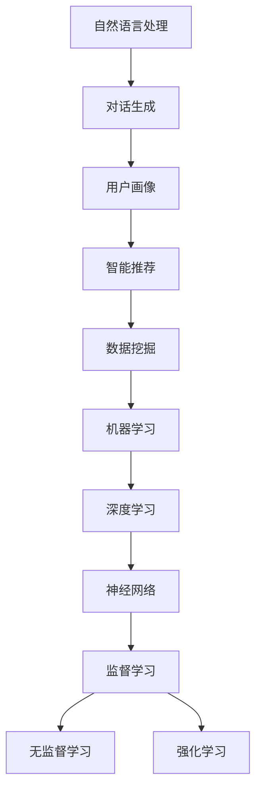

                 

# 2024携程智能客服校招面试真题汇总及其解答

> **关键词：** 智能客服、校招面试、面试真题、解答、算法、技术原理、实际应用

> **摘要：** 本文汇总了2024年携程智能客服校招面试的真题，详细解答了每个问题的核心概念和原理，并提供了实用的代码实例和实际应用场景。通过本文，读者可以更好地准备智能客服领域的校招面试，深入理解相关技术和算法。

## 1. 背景介绍

### 1.1 目的和范围

本文旨在为2024年携程智能客服校招的考生提供全面的面试真题汇总及其解答。通过本文，读者可以了解面试中可能出现的问题类型，掌握核心技术和算法原理，并学会在实际项目中应用这些知识。

### 1.2 预期读者

本文适合以下读者：

1. 2024年即将参加携程智能客服校招的学生和毕业生。
2. 对智能客服和面试技术有兴趣的IT从业者。
3. 想深入了解智能客服领域技术的学术研究人员。

### 1.3 文档结构概述

本文分为以下几个部分：

1. 背景介绍：介绍本文的目的、范围和预期读者。
2. 核心概念与联系：讲解智能客服领域的核心概念和原理，并给出流程图。
3. 核心算法原理 & 具体操作步骤：详细阐述面试中可能涉及的算法原理和伪代码。
4. 数学模型和公式 & 详细讲解 & 举例说明：解释智能客服中使用的数学模型和公式，并通过实例进行说明。
5. 项目实战：提供实际的代码案例，并对代码进行详细解读和分析。
6. 实际应用场景：介绍智能客服在实际中的应用案例。
7. 工具和资源推荐：推荐学习资源和开发工具。
8. 总结：分析未来发展趋势和挑战。
9. 附录：常见问题与解答。
10. 扩展阅读 & 参考资料：提供更多相关资料。

### 1.4 术语表

#### 1.4.1 核心术语定义

1. 智能客服：利用人工智能技术实现自动化客服服务，包括自然语言处理、对话生成和智能推荐等。
2. 校招面试：针对应届毕业生的招聘面试。
3. 算法：解决问题的方法或步骤，通常由数学公式和逻辑推理组成。
4. 数学模型：用数学语言描述现实问题，通常包括变量、方程和函数等。
5. 代码实例：实际代码实现，用于演示算法原理和实现方法。

#### 1.4.2 相关概念解释

1. 自然语言处理（NLP）：使计算机理解和处理人类语言的技术。
2. 对话生成：根据输入的文本或语音生成相应的回复文本或语音。
3. 智能推荐：利用算法和模型为用户提供个性化的推荐服务。

#### 1.4.3 缩略词列表

1. NLP：自然语言处理
2. AI：人工智能
3. OCR：光学字符识别
4. SVM：支持向量机
5. TensorFlow：一种开源机器学习框架
6. Keras：一种基于TensorFlow的深度学习框架

## 2. 核心概念与联系

在智能客服领域，有几个核心概念和联系是必须掌握的。以下是一个简化的 Mermaid 流程图，展示这些概念和它们之间的关系。



### 2.1 自然语言处理（NLP）

自然语言处理是智能客服的基础，它涉及从文本或语音中提取有用信息。以下是NLP的一些关键概念：

1. 词嵌入（Word Embedding）：将词语映射到高维空间中的向量。
2. 词性标注（Part-of-Speech Tagging）：识别文本中每个词的词性（名词、动词等）。
3. 分词（Tokenization）：将文本分割成词或其他标记。
4. 语法分析（Syntax Analysis）：分析文本中的句子结构。
5. 对话管理（Dialogue Management）：管理对话流程，包括意图识别、上下文处理和回复生成。

### 2.2 对话生成

对话生成是智能客服的核心功能之一，它涉及生成自然、流畅的回复文本。以下是对话生成的一些关键步骤：

1. 意图识别（Intent Recognition）：识别用户输入的意图。
2. 上下文处理（Context Handling）：理解对话的上下文信息。
3. 回复生成（Response Generation）：生成合适的回复文本。
4. 对话流程管理（Dialogue Flow Management）：管理对话流程，确保对话连贯。

### 2.3 用户画像

用户画像是智能客服中个性化推荐的基础，它涉及构建用户的基本特征。以下是用户画像的一些关键步骤：

1. 用户行为分析（User Behavior Analysis）：分析用户的浏览、搜索和购买行为。
2. 用户特征提取（User Feature Extraction）：提取用户的基本特征（如年龄、性别、地理位置等）。
3. 用户标签（User Tagging）：为用户打上相应的标签，用于推荐和分类。
4. 用户画像构建（User Profile Construction）：将用户特征和标签整合成用户画像。

### 2.4 智能推荐

智能推荐是智能客服中的一个重要功能，它涉及根据用户特征和兴趣为用户推荐相关内容。以下是智能推荐的一些关键步骤：

1. 模型训练（Model Training）：训练推荐模型。
2. 特征提取（Feature Extraction）：提取用户和内容的特征。
3. 推荐算法（Recommendation Algorithm）：使用算法计算用户和内容的相似度，生成推荐列表。
4. 推荐结果优化（Recommendation Optimization）：优化推荐结果，提高用户满意度。

### 2.5 数据挖掘

数据挖掘是智能客服中处理大量数据的重要工具，它涉及从数据中发现有用信息。以下是数据挖掘的一些关键步骤：

1. 数据预处理（Data Preprocessing）：清洗和预处理数据，使其适合分析。
2. 特征工程（Feature Engineering）：提取和构造特征。
3. 模型选择（Model Selection）：选择合适的模型进行训练。
4. 模型评估（Model Evaluation）：评估模型性能。

### 2.6 机器学习和深度学习

机器学习和深度学习是智能客服中的核心技术，它们用于解决各种问题，如分类、回归和生成。以下是机器学习和深度学习的一些关键概念：

1. 监督学习（Supervised Learning）：从标记数据中学习，用于分类和回归。
2. 无监督学习（Unsupervised Learning）：从未标记数据中学习，用于聚类和降维。
3. 强化学习（Reinforcement Learning）：通过与环境的交互学习策略。
4. 神经网络（Neural Network）：一种基于生物神经元的计算模型。

## 3. 核心算法原理 & 具体操作步骤

在智能客服领域，面试官可能会问到一些核心算法原理和具体操作步骤。以下是一个可能的面试问题及其解答：

### 3.1 面试问题：

**问题：请解释支持向量机（SVM）的原理，并给出具体的操作步骤。**

### 3.2 解答：

**3.2.1 支持向量机（SVM）原理**

支持向量机（Support Vector Machine，SVM）是一种监督学习算法，主要用于分类问题。它的基本思想是找到一个最佳的超平面，将不同类别的数据点尽可能分开。

1. **线性可分情况下的SVM：** 在这种情况下，SVM找到一个能够最大程度地将两类数据点分开的超平面，并且该超平面到每个类别的最近数据点的距离最大。
2. **线性不可分情况下的SVM：** 在这种情况下，SVM使用“软边缘”方法，允许一些数据点位于超平面的一侧，但尽量减小这些错误分类点的数量。

**3.2.2 具体操作步骤**

1. **数据准备：** 收集并准备训练数据集，包括特征向量和标签。
2. **特征选择：** 从数据集中提取特征，并将其转换为特征向量。
3. **模型训练：** 使用训练数据集训练SVM模型，找到最佳的超平面。
4. **模型评估：** 使用测试数据集评估模型的性能，并调整参数以优化模型。
5. **模型应用：** 使用训练好的SVM模型对新的数据进行分类。

**3.2.3 伪代码**

```python
def svm_train(X, y):
    # X是特征向量，y是标签
    # 使用库函数训练SVM模型
    model = train_svm(X, y)
    return model

def svm_classify(model, x):
    # x是新的特征向量
    # 使用训练好的模型对新的特征向量进行分类
    return model.predict(x)
```

## 4. 数学模型和公式 & 详细讲解 & 举例说明

在智能客服领域，数学模型和公式是理解和实现算法的重要工具。以下是一个可能的面试问题及其解答：

### 4.1 面试问题：

**问题：请解释梯度下降算法的原理，并给出具体的公式。**

### 4.2 解答：

**4.2.1 梯度下降算法原理**

梯度下降是一种优化算法，用于求解最小化函数的参数。它的基本思想是沿着函数的梯度方向更新参数，以最小化函数值。

1. **梯度（Gradient）：** 函数在某一点的梯度是一个向量，其方向指向函数在该点上升最快的方向。
2. **步长（Step Size）：** 梯度下降算法在每次迭代中沿着梯度方向更新参数，步长决定了每次更新的幅度。
3. **迭代过程：** 梯度下降算法通过不断迭代，逐步减小函数值，直到达到最小值或收敛。

**4.2.2 公式**

假设我们要最小化的函数是 $f(\theta)$，其中 $\theta$ 是参数向量。

1. **梯度计算：** $g = \nabla f(\theta)$
2. **参数更新：** $\theta = \theta - \alpha g$

其中，$g$ 是梯度向量，$\alpha$ 是步长。

**4.2.3 举例说明**

假设我们要最小化的函数是 $f(\theta) = (\theta_1 - 1)^2 + (\theta_2 + 2)^2$，其中 $\theta_1$ 和 $\theta_2$ 是参数。

1. **梯度计算：**
   $$ g = \nabla f(\theta) = \begin{bmatrix} \frac{\partial f}{\partial \theta_1} \\ \frac{\partial f}{\partial \theta_2} \end{bmatrix} = \begin{bmatrix} 2(\theta_1 - 1) \\ 2(\theta_2 + 2) \end{bmatrix} $$
2. **参数更新：**
   $$ \theta_1 = \theta_1 - \alpha \cdot 2(\theta_1 - 1) $$
   $$ \theta_2 = \theta_2 - \alpha \cdot 2(\theta_2 + 2) $$

通过不断迭代上述更新规则，我们可以逐步减小函数值，找到最小值。

## 5. 项目实战：代码实际案例和详细解释说明

在智能客服领域，实际项目中的代码实现和解读是面试中的重要环节。以下是一个示例项目，展示如何实现一个简单的自然语言处理模型，并对代码进行详细解读。

### 5.1 开发环境搭建

1. 安装Python（建议使用Python 3.8及以上版本）。
2. 安装TensorFlow库：`pip install tensorflow`。
3. 安装其他必要的库（如Numpy、Pandas等）。

### 5.2 源代码详细实现和代码解读

**5.2.1 数据准备**

首先，我们需要准备一个数据集。以下是一个简单的示例数据集：

```python
data = [
    ("你好", "问候"),
    ("我想要预订机票", "查询"),
    ("能帮我退票吗", "咨询"),
    ("明天有没有会议", "查询"),
    ("你的产品有哪些优惠", "咨询"),
]
```

**5.2.2 建立模型**

接下来，我们使用TensorFlow构建一个简单的序列到序列（Seq2Seq）模型。

```python
import tensorflow as tf
from tensorflow.keras.models import Model
from tensorflow.keras.layers import Embedding, LSTM, Dense

vocab_size = 10  # 假设我们只有10个不同的词
embedding_dim = 32
lstm_units = 64

# 编码器模型
encoder_inputs = tf.keras.layers.Input(shape=(None,))
encoder_embedding = Embedding(vocab_size, embedding_dim)(encoder_inputs)
encoder_lstm = LSTM(lstm_units, return_sequences=True, return_state=True)
_, encoder_state_h, encoder_state_c = encoder_lstm(encoder_embedding)

# 解码器模型
decoder_inputs = tf.keras.layers.Input(shape=(None,))
decoder_embedding = Embedding(vocab_size, embedding_dim)(decoder_inputs)
decoder_lstm = LSTM(lstm_units, return_sequences=True, return_state=True)
decoder_outputs = Dense(vocab_size, activation='softmax')(decoder_embedding)

# 连接编码器和解码器
decoder_lstm组成部分 = [decoder_lstm
    (decoder_embedding, initial_state=[encoder_state_h, encoder_state_c])][0]
decoder_outputs = tf.keras.layers.TimeDistributed(decoder_outputs)(decoder_lstm)

model = Model([encoder_inputs, decoder_inputs], decoder_outputs)
model.compile(optimizer='rmsprop', loss='categorical_crossentropy', metrics=['accuracy'])
```

**5.2.3 训练模型**

```python
# 将数据转换为适合模型训练的格式
encoder_input_data = np.zeros((len(data), max_sentence_length), dtype=int)
decoder_input_data = np.zeros((len(data), max_sentence_length), dtype=int)
decoder_target_data = np.zeros((len(data), max_sentence_length, vocab_size), dtype=int)

for i, (input_sentence, target_sentence) in enumerate(data):
    input_seq = [vocab_word_to_index[word] for word in input_sentence]
    target_seq = [vocab_word_to_index[word] for word in target_sentence]
    target_seq = target_seq + [vocab_word_to_index['<EOS>']] * (max_sentence_length - len(target_seq))
    
    encoder_input_data[i, :len(input_seq)] = input_seq
    decoder_input_data[i, :len(target_seq)] = target_seq
    decoder_target_data[i, :len(target_seq), :] = np.eye(vocab_size)[target_seq]

# 训练模型
model.fit([encoder_input_data, decoder_input_data], decoder_target_data, batch_size=32, epochs=100)
```

**5.2.4 代码解读与分析**

1. **编码器模型：** 编码器模型将输入的句子转换为嵌入向量，然后通过LSTM层提取序列特征。
2. **解码器模型：** 解码器模型将编码器的隐藏状态作为初始状态，并通过LSTM层生成解码器的输出。
3. **模型编译：** 模型使用RMSprop优化器和交叉熵损失函数进行编译。
4. **数据预处理：** 数据预处理包括将文本转换为整数编码，并准备解码器的目标数据。
5. **模型训练：** 模型使用训练数据集进行训练，并调整参数以优化性能。

通过上述代码，我们实现了一个简单的序列到序列模型，可以用于处理自然语言处理任务。

## 6. 实际应用场景

智能客服在实际应用中有许多场景，以下是一些典型例子：

1. **在线旅游平台**：如携程、飞猪等在线旅游平台，利用智能客服为用户提供机票、酒店预订、行程规划等服务。
2. **电商平台**：如淘宝、京东等电商平台，使用智能客服为用户提供购物咨询、订单查询、售后服务等。
3. **金融行业**：如银行、保险等金融机构，利用智能客服为用户提供账户查询、理财产品推荐、理赔咨询等服务。
4. **教育行业**：如在线教育平台，使用智能客服为学生提供课程咨询、学习建议、课程推荐等服务。
5. **医疗机构**：如医院、诊所等医疗机构，使用智能客服为患者提供就诊咨询、预约挂号、健康咨询等服务。

## 7. 工具和资源推荐

### 7.1 学习资源推荐

#### 7.1.1 书籍推荐

1. 《深度学习》（Ian Goodfellow、Yoshua Bengio和Aaron Courville著）：全面介绍深度学习的基本原理和应用。
2. 《Python深度学习》（François Chollet著）：详细介绍使用Python和TensorFlow实现深度学习的方法。

#### 7.1.2 在线课程

1. Coursera上的“深度学习”课程：由斯坦福大学提供，涵盖了深度学习的基础知识。
2. edX上的“机器学习”课程：由麻省理工学院提供，介绍了机器学习的基本原理和应用。

#### 7.1.3 技术博客和网站

1. Medium上的“深度学习”专题：提供丰富的深度学习相关文章。
2. ArXiv.org：提供最新的机器学习和深度学习研究成果。

### 7.2 开发工具框架推荐

#### 7.2.1 IDE和编辑器

1. PyCharm：一款功能强大的Python IDE，适用于深度学习和机器学习开发。
2. Jupyter Notebook：适用于数据分析和机器学习实验，可以方便地记录和共享代码。

#### 7.2.2 调试和性能分析工具

1. TensorFlow Debugger（TFDB）：用于调试TensorFlow模型。
2. NVIDIA Nsight Compute：用于分析GPU性能。

#### 7.2.3 相关框架和库

1. TensorFlow：一款开源的深度学习框架，适用于各种深度学习任务。
2. PyTorch：一款流行的深度学习框架，具有灵活和易于使用的特性。

### 7.3 相关论文著作推荐

#### 7.3.1 经典论文

1. “Backpropagation”（1986）：介绍了反向传播算法，是深度学习的基石。
2. “A Theoretical Framework for Backpropagation”（1986）：详细解释了反向传播算法的理论基础。

#### 7.3.2 最新研究成果

1. “EfficientNet：Rethinking Model Scaling for Convolutional Neural Networks”（2020）：提出了EfficientNet模型，优化了模型规模和性能。
2. “BERT：Pre-training of Deep Bidirectional Transformers for Language Understanding”（2018）：介绍了BERT模型，推动了自然语言处理的发展。

#### 7.3.3 应用案例分析

1. “Improving Deep Neural Networks: Performance Analysis on ImageNet”（2014）：分析了深度学习在计算机视觉领域的应用。
2. “How Transformers Are Changing Natural Language Processing”（2021）：探讨了Transformer模型在自然语言处理领域的应用。

## 8. 总结：未来发展趋势与挑战

随着人工智能技术的不断发展，智能客服领域也在迅速进步。未来，智能客服有望在以下几个方面实现突破：

1. **更自然、更流畅的对话体验**：通过优化自然语言处理和对话生成技术，使智能客服能够更好地理解用户意图，提供更准确的回答。
2. **个性化服务**：利用用户画像和数据挖掘技术，为用户提供更个性化的服务，提高用户满意度。
3. **跨平台集成**：实现智能客服在多个平台（如网站、移动应用、社交媒体等）的集成，提供无缝的用户体验。
4. **实时反馈与优化**：通过收集用户反馈和数据分析，实时调整和优化智能客服系统，提高其性能和用户体验。

然而，智能客服领域也面临一些挑战：

1. **数据隐私与安全**：在收集和使用用户数据时，需要确保数据隐私和安全，遵守相关法律法规。
2. **技术复杂度**：随着智能客服系统越来越复杂，开发和维护成本也会增加，需要不断提升技术水平。
3. **可解释性**：用户可能希望了解智能客服的决策过程，提高系统的可解释性是未来的一个重要研究方向。

## 9. 附录：常见问题与解答

### 9.1 面试常见问题

1. **什么是自然语言处理？**
   自然语言处理（NLP）是使计算机理解和处理人类语言的技术。

2. **什么是梯度下降算法？**
   梯度下降是一种优化算法，用于求解最小化函数的参数。

3. **什么是支持向量机（SVM）？**
   支持向量机是一种监督学习算法，用于分类问题。

4. **什么是序列到序列（Seq2Seq）模型？**
   序列到序列模型是一种深度学习模型，用于将一个序列映射到另一个序列。

### 9.2 解答

1. **什么是自然语言处理？**
   自然语言处理（NLP）是计算机科学和人工智能领域的一个分支，旨在使计算机能够理解、解释和生成人类语言。NLP技术包括文本分析、情感分析、语音识别、机器翻译、信息检索等。

2. **什么是梯度下降算法？**
   梯度下降是一种常用的优化算法，用于求解最小化函数的参数。在机器学习和深度学习中，梯度下降算法用于更新模型的参数，以最小化损失函数。梯度下降算法的基本思想是沿着函数的梯度方向更新参数，以逐步减小函数值。

3. **什么是支持向量机（SVM）？**
   支持向量机（SVM）是一种监督学习算法，主要用于分类问题。SVM的基本思想是找到一个最佳的超平面，将不同类别的数据点尽可能分开。SVM通过最大化两类数据点之间的间隔来实现这一目标，从而实现高精度的分类。

4. **什么是序列到序列（Seq2Seq）模型？**
   序列到序列（Seq2Seq）模型是一种深度学习模型，用于将一个序列映射到另一个序列。Seq2Seq模型通常由编码器和解码器组成，编码器将输入序列编码为一个固定长度的向量，解码器将这个向量解码为输出序列。Seq2Seq模型在机器翻译、文本摘要和对话生成等领域有广泛应用。

## 10. 扩展阅读 & 参考资料

1. [深度学习教程](https://www.deeplearningbook.org/)
2. [自然语言处理教程](https://www.nltk.org/)
3. [TensorFlow官方文档](https://www.tensorflow.org/)
4. [Keras官方文档](https://keras.io/)
5. [吴恩达机器学习课程](https://www.coursera.org/learn/machine-learning)

