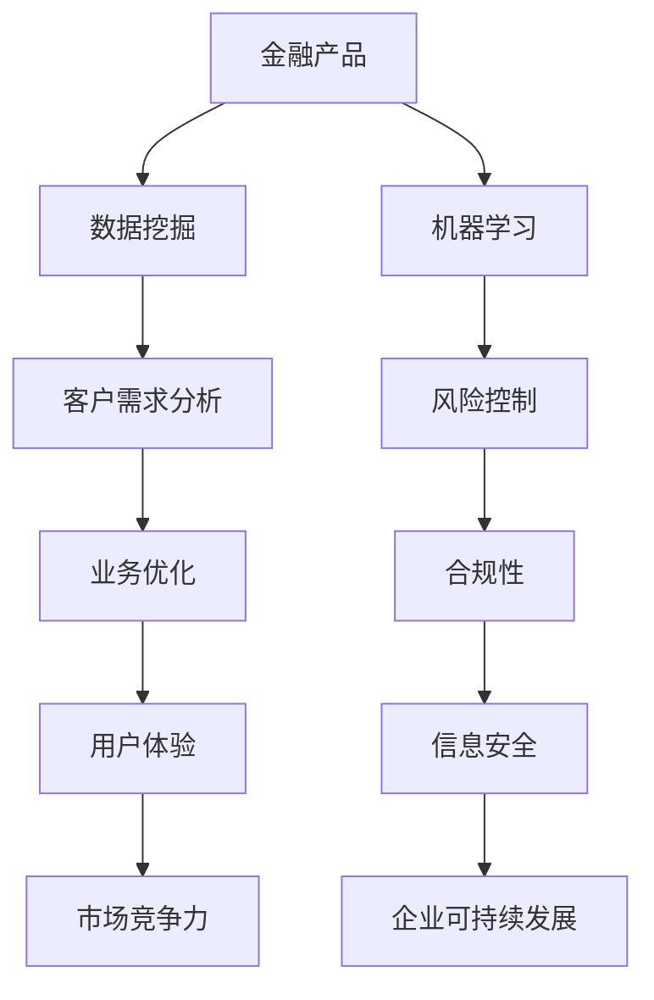

                 

# 2024携程金融社招面试真题汇总及其解答

> **关键词：** 携程金融、面试真题、社招、解答、面试技巧
> 
> **摘要：** 本文整理了2024年携程金融社招面试的真题汇总及其详细解答，旨在帮助求职者掌握面试技巧，提高面试成功率。文章包括背景介绍、核心概念与联系、核心算法原理、数学模型与公式、项目实战、实际应用场景、工具和资源推荐等内容。

## 1. 背景介绍

### 1.1 目的和范围

本文旨在汇总2024年携程金融社招面试的真题，并给出详细解答。通过分析这些真题，帮助求职者了解面试的常见问题和解题思路，提高面试成功率。

### 1.2 预期读者

本文适合以下读者群体：

- 想要参加2024年携程金融社招面试的求职者
- 对金融科技和互联网行业面试有需求的求职者
- 想要提高面试技巧的职场人士

### 1.3 文档结构概述

本文分为以下几个部分：

- 背景介绍：介绍本文的目的、预期读者和文档结构。
- 核心概念与联系：阐述与面试相关的核心概念和联系。
- 核心算法原理 & 具体操作步骤：详细讲解面试中可能涉及的算法原理和操作步骤。
- 数学模型和公式 & 详细讲解 & 举例说明：介绍面试中可能用到的数学模型和公式，并给出举例说明。
- 项目实战：分享实际项目中的代码案例和详细解释。
- 实际应用场景：分析面试中涉及的实际应用场景。
- 工具和资源推荐：推荐相关学习资源和开发工具。
- 总结：总结未来发展趋势与挑战。
- 附录：常见问题与解答。
- 扩展阅读 & 参考资料：提供扩展阅读资料。

### 1.4 术语表

#### 1.4.1 核心术语定义

- **社招**：指企业通过社会招聘方式，面向社会公开征集人才。
- **面试**：指企业通过面试环节，评估求职者的综合素质和技能。
- **金融科技**：指利用互联网、大数据、人工智能等新兴技术，对传统金融业务进行升级和创新。

#### 1.4.2 相关概念解释

- **数据挖掘**：指从大量数据中提取有价值信息的过程。
- **机器学习**：指通过算法和统计模型，让计算机自主学习和改进的方法。
- **金融产品**：指银行、证券、保险等金融机构发行的各类金融工具。

#### 1.4.3 缩略词列表

- **AI**：人工智能
- **ML**：机器学习
- **DL**：深度学习
- **NLP**：自然语言处理
- **Fintech**：金融科技

## 2. 核心概念与联系

在面试中，了解核心概念与联系对于应对题目至关重要。以下是一个与面试相关的Mermaid流程图，展示了一些核心概念和它们之间的联系。



## 3. 核心算法原理 & 具体操作步骤

在面试中，理解核心算法原理和操作步骤对于解决实际问题非常重要。以下是一个常见的面试题目，使用伪代码来详细阐述其算法原理和操作步骤。

### 题目：编写一个算法，找出给定数组中的最大值。

```python
def find_max(arr):
    max_val = arr[0]
    for i in range(1, len(arr)):
        if arr[i] > max_val:
            max_val = arr[i]
    return max_val
```

### 算法原理：

1. 初始化最大值为数组的第一个元素。
2. 遍历数组，比较每个元素与当前最大值的大小。
3. 如果找到更大的元素，更新最大值。
4. 返回最大值。

### 操作步骤：

1. 初始化变量`max_val`为数组的第一个元素。
2. 从数组的第二个元素开始，遍历每个元素。
3. 对于每个元素，比较它与`max_val`的大小。
4. 如果元素大于`max_val`，更新`max_val`为该元素的值。
5. 遍历完整个数组后，返回`max_val`。

## 4. 数学模型和公式 & 详细讲解 & 举例说明

在面试中，了解数学模型和公式对于解决实际问题非常重要。以下是一个常见的面试题目，使用LaTeX格式详细讲解并举例说明。

### 题目：给定两个正整数`a`和`b`，编写一个算法，计算它们的最大公约数（GCD）。

### 数学模型和公式：

$$
\text{GCD}(a, b) = \begin{cases} 
a & \text{if } a \text{ is even} \\
b & \text{if } b \text{ is even} \\
\text{GCD}(a-b, b) & \text{if } a \text{ is odd and } b \text{ is even} \\
\text{GCD}(a, b-a) & \text{if } a \text{ is even and } b \text{ is odd} \\
\text{GCD}(a, b) & \text{if } a \text{ and } b \text{ are both odd} 
\end{cases}
$$

### 详细讲解：

1. 如果`a`是偶数，则最大公约数为`a`。
2. 如果`b`是偶数，则最大公约数为`b`。
3. 如果`a`是奇数且`b`是偶数，则最大公约数为`GCD(a-b, b)`。
4. 如果`a`是偶数且`b`是奇数，则最大公约数为`GCD(a, b-a)`。
5. 如果`a`和`b`都是奇数，则最大公约数为`GCD(a, b)`。

### 举例说明：

假设`a = 24`，`b = 36`。

$$
\text{GCD}(24, 36) = \text{GCD}(24, 36-24) = \text{GCD}(24, 12)
$$

由于`24`是偶数，所以最大公约数为`24`。

## 5. 项目实战：代码实际案例和详细解释说明

### 5.1 开发环境搭建

在项目实战中，我们需要搭建一个合适的开发环境。以下是一个简单的Python开发环境搭建步骤：

1. 安装Python：从官方网站（[https://www.python.org/](https://www.python.org/)）下载并安装Python。
2. 安装IDE：推荐使用PyCharm（[https://www.jetbrains.com/pycharm/](https://www.jetbrains.com/pycharm/)）或Visual Studio Code（[https://code.visualstudio.com/](https://code.visualstudio.com/)）作为Python IDE。
3. 安装相关库：使用pip命令安装所需的库，例如`numpy`、`pandas`、`scikit-learn`等。

### 5.2 源代码详细实现和代码解读

以下是一个简单的金融产品数据分析项目的代码实现和解读。

```python
import pandas as pd
from sklearn.linear_model import LinearRegression

# 加载数据
data = pd.read_csv('financial_data.csv')

# 数据预处理
data['date'] = pd.to_datetime(data['date'])
data.set_index('date', inplace=True)
data.fillna(method='ffill', inplace=True)

# 特征工程
X = data[['open', 'high', 'low', 'close']]
y = data['close']

# 模型训练
model = LinearRegression()
model.fit(X, y)

# 预测
predictions = model.predict(X)

# 评估
score = model.score(X, y)
print(f'Model score: {score:.4f}')

# 可视化
import matplotlib.pyplot as plt

plt.figure(figsize=(10, 6))
plt.plot(data.index, data['close'], label='Actual')
plt.plot(data.index, predictions, label='Predicted')
plt.legend()
plt.show()
```

### 5.3 代码解读与分析

1. 导入所需的库：`pandas`用于数据预处理，`sklearn.linear_model.LinearRegression`用于线性回归模型训练。
2. 加载数据：从CSV文件加载数据，并将日期转换为索引。
3. 数据预处理：填充缺失值，保证数据完整性。
4. 特征工程：选择股票的四个价格指标作为特征，预测股票收盘价。
5. 模型训练：使用线性回归模型训练数据。
6. 预测：使用训练好的模型进行预测。
7. 评估：计算模型评分，评估模型性能。
8. 可视化：绘制实际值与预测值的对比图。

## 6. 实际应用场景

在金融领域，面试官可能提出以下实际应用场景问题：

1. **如何使用机器学习预测股票价格？**
2. **如何利用大数据分析客户行为，提高客户满意度？**
3. **如何通过算法优化，降低金融产品的风险？**

针对这些场景，可以结合具体的算法原理和实际案例进行回答。

## 7. 工具和资源推荐

### 7.1 学习资源推荐

#### 7.1.1 书籍推荐

- **《Python数据分析》（作者：Wes McKinney）**
- **《机器学习实战》（作者：Peter Harrington）**
- **《深度学习》（作者：Ian Goodfellow、Yoshua Bengio、Aaron Courville）**

#### 7.1.2 在线课程

- **Coursera上的《机器学习》课程**
- **Udacity上的《数据科学家纳米学位》课程**
- **edX上的《金融科技》课程**

#### 7.1.3 技术博客和网站

- **《机器学习博客》（作者：Anders

