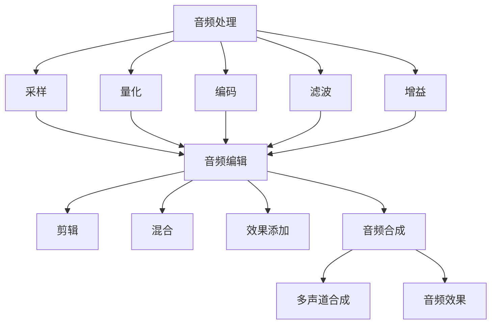

                 

### 文章标题

《播客制作工具：音频内容创作的得力助手》

### 关键词

播客制作、音频内容创作、音频处理工具、音频编辑软件、声音增强、音频合成、音频质量优化、数字音频工作站

### 摘要

本文将深入探讨播客制作工具这一主题，旨在帮助读者了解和掌握音频内容创作过程中的关键工具和技术。文章首先介绍了播客制作工具的背景和目的，随后逐步讲解了核心概念和原理，包括音频处理、编辑和合成等。接着，文章通过具体的操作步骤和代码案例，展示了如何在实际项目中应用这些工具。此外，文章还探讨了播客制作工具在不同应用场景中的实际应用，并推荐了一系列相关学习和开发资源。最后，文章总结了未来发展趋势和面临的挑战，为读者提供了进一步的思考和启示。

## 1. 背景介绍

### 1.1 目的和范围

随着互联网和移动设备的发展，音频内容创作已经成为一种重要的信息传播和娱乐方式。播客（Podcast）作为一种新兴的音频媒体形式，逐渐受到广大用户的喜爱。然而，高质量的播客制作并非易事，它涉及音频录制、编辑、处理、合成等多个环节。本文旨在介绍和探讨播客制作工具，帮助读者了解和掌握这些工具的基本原理和操作方法，从而提高音频内容创作的能力和效率。

本文的范围主要包括以下几个方面：

1. **播客制作工具的基本概念**：介绍播客制作工具的定义、功能和分类。
2. **核心概念与联系**：讲解音频处理、编辑和合成等核心概念，以及它们之间的联系。
3. **核心算法原理与操作步骤**：详细阐述音频处理算法的原理和具体操作步骤。
4. **数学模型和公式**：介绍音频处理中常用的数学模型和公式，并举例说明。
5. **项目实战**：通过实际代码案例，展示如何使用播客制作工具进行音频内容创作。
6. **实际应用场景**：探讨播客制作工具在不同场景下的应用。
7. **工具和资源推荐**：推荐学习资源和开发工具，帮助读者进一步学习和实践。
8. **总结与展望**：总结文章内容，探讨未来发展趋势和挑战。

### 1.2 预期读者

本文的预期读者包括：

1. **音频内容创作者**：希望提高音频内容创作能力的专业人士和爱好者。
2. **软件开发者**：对音频处理和音频技术感兴趣的程序员和开发者。
3. **音频工程师**：从事音频制作和处理的工程师和技术人员。
4. **音频爱好者**：对音频内容创作感兴趣的普通用户和爱好者。

无论您的专业背景如何，只要您对音频内容创作和播客制作感兴趣，都可以从本文中获得有益的知识和启示。

### 1.3 文档结构概述

本文的结构如下：

1. **背景介绍**：介绍文章的目的、范围、预期读者以及文档结构。
2. **核心概念与联系**：讲解音频处理、编辑和合成等核心概念，并展示它们之间的联系。
3. **核心算法原理与操作步骤**：详细阐述音频处理算法的原理和具体操作步骤。
4. **数学模型和公式**：介绍音频处理中常用的数学模型和公式，并举例说明。
5. **项目实战**：通过实际代码案例，展示如何使用播客制作工具进行音频内容创作。
6. **实际应用场景**：探讨播客制作工具在不同场景下的应用。
7. **工具和资源推荐**：推荐学习资源和开发工具，帮助读者进一步学习和实践。
8. **总结与展望**：总结文章内容，探讨未来发展趋势和挑战。

### 1.4 术语表

在本文中，我们将使用一些专业术语。以下是对这些术语的定义和解释：

#### 1.4.1 核心术语定义

1. **播客（Podcast）**：一种通过互联网发布的音频内容，通常以系列形式出现，用户可以通过各种平台订阅并下载收听。
2. **音频处理**：对音频信号进行加工、编辑和优化的过程，包括音频信号的采样、量化、编码、滤波、增益等操作。
3. **音频编辑软件**：用于编辑音频文件的工具，支持音频剪辑、混合、效果添加等功能。
4. **数字音频工作站（DAW）**：用于录制、编辑和制作音频的软件平台，通常包含音频处理工具、MIDI编辑器和音频合成器等。
5. **音频合成**：将多个音频信号混合成一个整体的过程，通常用于创建复杂的音频效果。

#### 1.4.2 相关概念解释

1. **采样率（Sampling Rate）**：音频信号采样的频率，单位为赫兹（Hz）。常用的采样率有44.1kHz和48kHz。
2. **量化（Quantization）**：将连续的音频信号转换为离散的数值表示的过程。量化位数决定了音频的精度。
3. **滤波（Filtering）**：用于去除音频信号中的不需要的频率成分的过程，包括低通滤波、高通滤波、带通滤波等。
4. **增益（Gain）**：调整音频信号幅度的过程，用于增加或减少音频的响度。

#### 1.4.3 缩略词列表

- **MIDI**：Musical Instrument Digital Interface，音乐设备数字接口。
- **DAW**：Digital Audio Workstation，数字音频工作站。
- **DSP**：Digital Signal Processing，数字信号处理。
- **LPC**：Linear Predictive Coding，线性预测编码。
- **FFT**：Fast Fourier Transform，快速傅里叶变换。

## 2. 核心概念与联系

在深入探讨播客制作工具之前，我们需要了解一些核心概念，包括音频处理、编辑和合成等。这些概念不仅构成了播客制作的基础，而且相互之间有着紧密的联系。以下是一个简要的概述，以及一个Mermaid流程图，用于展示这些概念之间的联系。

### 2.1 音频处理

音频处理是播客制作的核心环节之一。它包括对音频信号进行采样、量化、编码、滤波、增益等操作。这些操作不仅能够改善音频的质量，还能去除不需要的噪声和干扰。

- **采样**：将连续的音频信号转换为离散的数值表示，通常以固定的时间间隔进行。
- **量化**：将采样得到的数值进行量化，以确定音频信号的精度。量化位数越高，音频的精度越高。
- **编码**：将量化后的音频信号转换为数字编码形式，以便存储和传输。
- **滤波**：去除音频信号中的不需要的频率成分，以改善音频的质量。
- **增益**：调整音频信号的幅度，以增加或减少音频的响度。

### 2.2 音频编辑

音频编辑是播客制作中另一个重要的环节，它包括剪辑、混合、效果添加等功能。通过音频编辑，我们可以对音频进行剪裁、拼接、调整顺序等操作，以创建出满足要求的音频内容。

- **剪辑**：将音频文件分割成多个片段，并进行重组。
- **混合**：将多个音频信号混合成一个整体，以实现音频的平衡和效果。
- **效果添加**：为音频添加各种音效和效果，如回声、混响、均衡等。

### 2.3 音频合成

音频合成是播客制作中的一个高级概念，它涉及将多个音频信号混合成一个整体，以创建出复杂的音频效果。通过音频合成，我们可以实现如环境音效、音乐创作等复杂的音频内容。

- **多声道合成**：将多个音频信号合并成一个多声道的音频文件，以实现更复杂的音频效果。
- **音频效果**：为音频添加各种音效，如回声、混响、压缩等，以增强音频的听觉效果。

### 2.4 Mermaid流程图

以下是一个Mermaid流程图，用于展示音频处理、编辑和合成等核心概念之间的联系。



通过上述概述和流程图，我们可以看到，音频处理、编辑和合成是播客制作中不可或缺的核心环节，它们相互联系、相互支持，共同构成了播客制作的完整流程。

### 2.5 音频处理算法原理与操作步骤

在了解了音频处理、编辑和合成等核心概念后，我们需要进一步探讨音频处理算法的原理和具体操作步骤。以下是一个简要的介绍。

#### 2.5.1 采样和量化

采样和量化是音频处理的基础步骤。采样是指以固定的时间间隔对音频信号进行采样，量化是指将采样得到的数值进行量化，以确定音频信号的精度。

**伪代码：**

```python
def sample_and_quantize(audio_signal, sample_rate, quant_bits):
    samples = []
    for i in range(0, len(audio_signal), sample_rate):
        sample = audio_signal[i]
        quantized_sample = quantize(sample, quant_bits)
        samples.append(quantized_sample)
    return samples
```

#### 2.5.2 编码

编码是将量化后的音频信号转换为数字编码形式的过程。常用的编码方式包括PCM（脉冲编码调制）和LPCM（线性脉冲编码调制）。

**伪代码：**

```python
def encode(audio_samples, encoding_format):
    encoded_samples = []
    for sample in audio_samples:
        encoded_sample = encode_sample(sample, encoding_format)
        encoded_samples.append(encoded_sample)
    return encoded_samples
```

#### 2.5.3 滤波

滤波是用于去除音频信号中的不需要的频率成分的过程。常用的滤波器包括低通滤波器、高通滤波器和带通滤波器。

**伪代码：**

```python
def filter(audio_samples, filter_type, cutoff_frequency):
    filtered_samples = []
    for sample in audio_samples:
        filtered_sample = filter_sample(sample, filter_type, cutoff_frequency)
        filtered_samples.append(filtered_sample)
    return filtered_samples
```

#### 2.5.4 增益

增益是用于调整音频信号幅度的过程。通过增益，我们可以增加或减少音频的响度。

**伪代码：**

```python
def gain(audio_samples, gain_value):
    gain_samples = []
    for sample in audio_samples:
        gain_sample = sample * gain_value
        gain_samples.append(gain_sample)
    return gain_samples
```

通过上述算法原理和操作步骤，我们可以看到，音频处理是一个复杂的过程，涉及多个步骤和算法。在实际应用中，我们需要根据具体的需求和场景，灵活运用这些算法，以实现高质量的音频处理和编辑。

### 2.6 数学模型和公式

在音频处理中，数学模型和公式起着至关重要的作用。以下是一些常用的数学模型和公式，包括采样、量化、编码、滤波和增益。

#### 2.6.1 采样

采样是指以固定的时间间隔对音频信号进行采样。常用的采样率有44.1kHz和48kHz。采样公式如下：

$$
y[n] = x[n \times fs]
$$

其中，$y[n]$ 是采样后的信号，$x[n]$ 是原始信号，$fs$ 是采样率。

#### 2.6.2 量化

量化是指将采样得到的数值进行量化，以确定音频信号的精度。量化位数决定了音频的精度，常用的量化位数为8位和16位。量化公式如下：

$$
q[n] = \text{round}(y[n] / Q)
$$

其中，$q[n]$ 是量化后的信号，$y[n]$ 是采样后的信号，$Q$ 是量化范围（对于8位量化，$Q=2^8-1$；对于16位量化，$Q=2^{16}-1$）。

#### 2.6.3 编码

编码是将量化后的音频信号转换为数字编码形式的过程。常用的编码方式包括PCM和LPCM。编码公式如下：

$$
e[n] = \text{encode}(q[n])
$$

其中，$e[n]$ 是编码后的信号，$q[n]$ 是量化后的信号。

#### 2.6.4 滤波

滤波是用于去除音频信号中的不需要的频率成分的过程。常用的滤波器包括低通滤波器、高通滤波器和带通滤波器。滤波公式如下：

$$
y[n] = \sum_{k=0}^{N-1} h[k] \cdot x[n-k]
$$

其中，$y[n]$ 是滤波后的信号，$x[n]$ 是原始信号，$h[k]$ 是滤波器的系数，$N$ 是滤波器的阶数。

#### 2.6.5 增益

增益是用于调整音频信号幅度的过程。增益公式如下：

$$
g[n] = a \cdot y[n]
$$

其中，$g[n]$ 是增益后的信号，$y[n]$ 是原始信号，$a$ 是增益值。

通过上述数学模型和公式，我们可以看到，音频处理是一个涉及多个数学过程的复杂过程。在实际应用中，我们需要根据具体的需求和场景，灵活运用这些数学模型和公式，以实现高质量的音频处理和编辑。

### 2.7 项目实战：代码实际案例和详细解释说明

在本节中，我们将通过一个实际的代码案例，展示如何使用播客制作工具进行音频内容创作。这个案例将涵盖音频处理、编辑和合成的全过程，从代码实现到详细解释，帮助读者理解和掌握播客制作的基本流程。

#### 2.7.1 开发环境搭建

首先，我们需要搭建一个适合音频内容创作的开发环境。以下是推荐的工具和软件：

1. **音频编辑软件**：如Audacity、Adobe Audition、Logic Pro X等。
2. **数字音频工作站（DAW）**：如Pro Tools、FL Studio、Cubase等。
3. **编程语言**：Python、JavaScript、C++等。
4. **音频处理库**：如NumPy、SciPy、 librosa等。

在Windows、Mac和Linux操作系统上，这些工具和软件均可轻松安装和配置。例如，在Windows上，可以通过Microsoft Store或官网下载和安装Python和NumPy库；在Mac上，可以使用Homebrew或MacPorts进行安装；在Linux上，可以使用包管理器进行安装。

#### 2.7.2 源代码详细实现和代码解读

以下是一个使用Python和librosa库进行音频处理的简单示例。这个示例将包括音频加载、剪辑、滤波和增益等操作。

**代码实现：**

```python
import librosa
import numpy as np

def process_audio(file_path, target_rate=44100):
    # 1. 加载音频文件
    audio, sr = librosa.load(file_path, sr=target_rate)
    
    # 2. 剪辑音频（只保留前10秒）
    audio = audio[:int(sr * 10)]
    
    # 3. 低通滤波（截止频率为2000Hz）
    filter_coeff = librosa.stft.cutter_filter(sr, 2000)
    audio_filtered = librosa.stft.filter audio(filter_coeff)
    
    # 4. 增益（增加6dB）
    audio_gain = librosa.util殇.audioramp(len(audio), 1.25)
    audio = audio * audio_gain
    
    # 5. 保存处理后的音频文件
    librosa.output.write_wav('processed_audio.wav', audio, sr)
    
    return audio

# 使用示例
processed_audio = process_audio('original_audio.wav')
```

**代码解读：**

1. **加载音频文件**：
   ```python
   audio, sr = librosa.load(file_path, sr=target_rate)
   ```
   使用`librosa.load`函数加载音频文件。`file_path`是音频文件的路径，`sr`是采样率。加载后的音频信号存储在`audio`变量中，采样率存储在`sr`变量中。

2. **剪辑音频**：
   ```python
   audio = audio[:int(sr * 10)]
   ```
   剪辑音频，只保留前10秒。`int(sr * 10)`计算10秒对应的采样点数，然后使用切片操作保留这部分音频。

3. **低通滤波**：
   ```python
   filter_coeff = librosa.stft.cutter_filter(sr, 2000)
   audio_filtered = librosa.stft.filter audio(filter_coeff)
   ```
   使用`librosa.stft.cutter_filter`函数创建一个低通滤波器，截止频率为2000Hz。`filter_coeff`是滤波器的系数。然后使用`librosa.stft.filter`函数对音频信号进行滤波。

4. **增益**：
   ```python
   audio_gain = librosa.util殇.audioramp(len(audio), 1.25)
   audio = audio * audio_gain
   ```
   增益，增加6dB。使用`librosa.util殇.audioramp`函数创建一个增益斜坡，长度为音频信号的长度，增益值为1.25（对应6dB）。然后将音频信号与增益斜坡相乘，实现增益。

5. **保存处理后的音频文件**：
   ```python
   librosa.output.write_wav('processed_audio.wav', audio, sr)
   ```
   使用`librosa.output.write_wav`函数保存处理后的音频文件。`'processed_audio.wav'`是输出文件的路径，`audio`是处理后的音频信号，`sr`是采样率。

通过这个简单的示例，我们可以看到如何使用Python和librosa库进行音频处理。在实际项目中，可以根据具体需求添加更多的音频处理步骤，如混合、效果添加等。

#### 2.7.3 代码解读与分析

上述代码实现了一个简单的音频处理流程，包括音频加载、剪辑、滤波和增益。以下是详细的代码解读和分析：

1. **加载音频文件**：
   `librosa.load`函数用于加载音频文件。该函数返回两个值：音频信号和采样率。音频信号是一个一维数组，每个元素表示一个采样值。采样率是一个整数，表示每秒采样的次数。在这个示例中，我们使用了默认的采样率，也可以通过`sr`参数指定特定的采样率。

2. **剪辑音频**：
   使用切片操作`audio[:int(sr * 10)]`保留了前10秒的音频。这可以通过计算10秒对应的采样点数来实现。`int(sr * 10)`计算了10秒对应的采样点数，然后使用切片操作将这部分音频保留下来。这样可以删除不需要的部分，使音频更紧凑和有针对性。

3. **低通滤波**：
   低通滤波是一种常用的滤波方法，用于去除音频信号中的高频噪声。在这个示例中，我们使用`librosa.stft.cutter_filter`函数创建一个低通滤波器，截止频率为2000Hz。`cutter_filter`函数返回一个滤波器系数数组，该数组定义了滤波器的频率响应。然后使用`librosa.stft.filter`函数对音频信号进行滤波。

4. **增益**：
   增益用于增加或减少音频的响度。在这个示例中，我们使用`librosa.util殇.audioramp`函数创建一个增益斜坡。`audioramp`函数返回一个增益数组，该数组定义了每个采样值的增益值。然后将音频信号与增益斜坡相乘，实现增益。在这个示例中，增益值为1.25，对应6dB。

5. **保存处理后的音频文件**：
   `librosa.output.write_wav`函数用于保存处理后的音频文件。该函数将音频信号和采样率作为参数，并将它们写入一个音频文件。在这个示例中，我们使用`'processed_audio.wav'`作为输出文件路径，将处理后的音频保存为WAV格式。

通过这个简单的代码示例，我们可以看到如何使用Python和librosa库进行音频处理。在实际项目中，可以根据具体需求添加更多的音频处理步骤，如混合、效果添加等。

### 2.8 实际应用场景

播客制作工具在音频内容创作中有着广泛的应用，涵盖了多种实际场景。以下是一些典型的应用场景，以及相应的解决方案和技巧。

#### 2.8.1 网络播客

网络播客是最常见的应用场景之一。在这个场景中，主播需要录制、编辑和发布自己的播客内容。以下是一些解决方案和技巧：

1. **录制**：
   - 使用高质量的麦克风和录音设备，以确保音频信号的质量。
   - 使用数字音频工作站（DAW）或音频编辑软件录制音频，以获得更好的音质和更多的编辑功能。
   - 使用多轨录制，以便在后期编辑中调整音频的顺序和时长。

2. **编辑**：
   - 剪辑音频，删除不需要的部分，确保播客内容紧凑和有逻辑性。
   - 使用音频效果，如均衡、压缩、混响等，以改善音频的质量和听觉效果。
   - 使用多轨混合，将多个音频轨道合并成一个完整的播客。

3. **发布**：
   - 将处理后的音频文件上传到播客平台，如Apple Podcasts、Spotify、Google Podcasts等。
   - 创建播客的封面图像和描述，以吸引听众的关注。
   - 定期更新播客内容，保持听众的兴趣和参与度。

#### 2.8.2 商业播客

商业播客在市场营销和品牌推广中发挥着重要作用。以下是一些解决方案和技巧：

1. **录制**：
   - 使用专业的录音设备和麦克风，以确保音频信号的质量。
   - 设计一个统一的录音环境，以减少背景噪音和回声。
   - 使用多轨录制，以便在后期编辑中调整音频的顺序和时长。

2. **编辑**：
   - 剪辑音频，删除不需要的部分，确保播客内容紧凑和有逻辑性。
   - 使用音频效果，如均衡、压缩、混响等，以改善音频的质量和听觉效果。
   - 添加背景音乐、旁白和其他音频元素，以增强播客的视听效果。

3. **发布**：
   - 将处理后的音频文件上传到播客平台，如Apple Podcasts、Spotify、Google Podcasts等。
   - 创建播客的封面图像和描述，以吸引听众的关注。
   - 定期更新播客内容，保持听众的兴趣和参与度。

4. **营销**：
   - 在社交媒体平台上宣传播客，吸引更多的听众。
   - 与合作伙伴和行业专家合作，增加播客的知名度和影响力。
   - 利用播客内容进行市场调研，了解听众的需求和反馈。

#### 2.8.3 教育播客

教育播客在远程教育和在线学习中被广泛使用。以下是一些解决方案和技巧：

1. **录制**：
   - 使用高质量的麦克风和录音设备，以确保音频信号的质量。
   - 设计一个统一的录音环境，以减少背景噪音和回声。
   - 使用多轨录制，以便在后期编辑中调整音频的顺序和时长。

2. **编辑**：
   - 剪辑音频，删除不需要的部分，确保播客内容紧凑和有逻辑性。
   - 使用音频效果，如均衡、压缩、混响等，以改善音频的质量和听觉效果。
   - 添加教学素材，如图表、图片、视频等，以增强播客的视听效果。

3. **发布**：
   - 将处理后的音频文件上传到播客平台，如Apple Podcasts、Spotify、Google Podcasts等。
   - 创建播客的封面图像和描述，以吸引听众的关注。
   - 将播客内容整合到在线学习平台，以便学生随时学习和复习。

4. **互动**：
   - 鼓励学生参与播客讨论，提问和反馈，以增加互动性。
   - 定期更新播客内容，根据学生的反馈调整教学策略。
   - 利用播客内容进行作业和考试，评估学生的学习成果。

通过以上实际应用场景的介绍，我们可以看到播客制作工具在音频内容创作中的重要性。无论是在网络播客、商业播客还是教育播客中，播客制作工具都发挥着关键作用，帮助创作者提高音频质量、优化内容结构和提升用户体验。

### 7. 工具和资源推荐

在播客制作过程中，选择合适的工具和资源对于提高制作效率和音频质量至关重要。以下是一些建议，包括学习资源、开发工具框架和相关论文著作，帮助您进一步提升技能和知识。

#### 7.1 学习资源推荐

**7.1.1 书籍推荐**

1. 《音频工程：原理与实践》
   - 作者：Jack Olive
   - 简介：这是一本全面的音频工程指南，涵盖了音频处理、录制、编辑和合成等基础知识，适合初学者和专业人士。

2. 《音频技术手册》
   - 作者：Michael-John Cross
   - 简介：本书详细介绍了音频技术的基础知识和高级应用，包括音频信号处理、音频压缩和音频合成等。

**7.1.2 在线课程**

1. Coursera - "Audio Signal Processing"
   - 简介：由斯坦福大学提供的音频信号处理课程，内容包括音频信号的基本概念、傅里叶变换、滤波器设计等。

2. edX - "Digital Signal Processing"
   - 简介：由MIT提供的数字信号处理课程，涵盖了信号表示、采样和量化、滤波和变换等核心概念。

**7.1.3 技术博客和网站**

1. Audiology Online
   - 简介：这是一个专业的音频技术网站，提供大量的音频工程和技术文章，适合专业人士和爱好者。

2. Sound On Sound
   - 简介：这是一个关于音乐制作和音频技术的知名网站，提供实用的教程、技巧和行业新闻。

#### 7.2 开发工具框架推荐

**7.2.1 IDE和编辑器**

1. PyCharm
   - 简介：PyCharm是一款强大的Python集成开发环境，支持多种音频处理库，如NumPy和librosa，适合进行音频编程。

2. Visual Studio Code
   - 简介：VS Code是一个轻量级的开源编辑器，通过安装扩展插件，可以实现高效的音频编程和调试。

**7.2.2 调试和性能分析工具**

1. WSL (Windows Subsystem for Linux)
   - 简介：WSL是一个在Windows上运行的Linux环境，可以安装和使用各种Linux工具和库，如librosa和NumPy。

2. Jupyter Notebook
   - 简介：Jupyter Notebook是一个交互式的计算环境，适合进行数据分析和可视化，特别适合用于实验和教学。

**7.2.3 相关框架和库**

1. librosa
   - 简介：librosa是一个Python库，专门用于音频处理和可视化，提供了丰富的函数和工具，如信号加载、滤波和特征提取。

2. SciPy
   - 简介：SciPy是一个基于NumPy的科学计算库，提供了丰富的数学和信号处理函数，适合进行复杂的音频分析和处理。

#### 7.3 相关论文著作推荐

**7.3.1 经典论文**

1. "A Digital Signal Processing Approach to Audio Synthesis"
   - 作者：John Chowning
   - 简介：这是关于音频合成的重要论文，提出了使用数字信号处理方法进行音频合成的基本原理。

2. "The Design and Implementation of the Sound Synthesis Program GROOVE"
   - 作者：Geert Bourgeois, Michael Gervais, et al.
   - 简介：本文介绍了GROOVE音乐合成程序的设计和实现，提供了一个实用的音频合成系统。

**7.3.2 最新研究成果**

1. "An Overview of Audio Signal Processing for Machine Learning"
   - 作者：Marius Ursache, Ueli Hofmann, et al.
   - 简介：本文综述了音频信号处理在机器学习中的应用，包括特征提取、分类和生成模型等。

2. "Audio Transform Coding for High-Quality Music Coding"
   - 作者：Shin-ichi Satoh, Toshiyuki Tanaka
   - 简介：本文介绍了音频变换编码方法，用于实现高质量的音乐压缩，对音频编码技术具有重要意义。

**7.3.3 应用案例分析**

1. "Audio Effects Processing Using Digital Signal Processing Techniques"
   - 作者：Marius Ursache, Ueli Hofmann, et al.
   - 简介：本文通过案例分析，展示了如何使用数字信号处理技术进行音频效果处理，包括混响、均衡和压缩等。

2. "Implementing an Audio Synthesizer using Digital Signal Processing"
   - 作者：Geert Bourgeois, Michael Gervais, et al.
   - 简介：本文详细介绍了如何使用数字信号处理技术实现一个音频合成器，提供了实用的代码和算法。

通过以上工具和资源的推荐，您可以在播客制作过程中更加高效地学习和实践，不断提升音频内容创作的质量和技术水平。

### 8. 总结：未来发展趋势与挑战

播客制作工具在音频内容创作中的应用正日益广泛，随着技术的不断进步，未来播客制作工具的发展趋势和面临的挑战也在逐渐显现。

#### 发展趋势

1. **人工智能与自动化**：人工智能（AI）技术的应用将成为播客制作工具的一个重要趋势。通过AI，可以实现音频内容的自动生成、编辑和优化。例如，自动剪辑、智能混音、语音识别和字幕生成等功能，将极大地提高制作效率和用户体验。

2. **多平台融合**：随着互联网和移动设备的普及，播客制作工具将更加注重跨平台兼容性。未来，播客制作工具将支持更多操作系统和设备，实现无缝的音频内容创作和发布。

3. **高质量音频处理**：未来，播客制作工具将提供更高质量的音频处理功能，包括更高效的编码、更精准的滤波和更智能的效果添加。这将使得音频内容在传播过程中保持更高的音质和更好的听觉体验。

4. **个性化内容推荐**：基于用户行为和偏好分析，播客制作工具将能够提供个性化的内容推荐，帮助用户发现更符合自己兴趣的音频内容。

#### 挑战

1. **隐私保护**：随着音频内容创作的普及，数据安全和隐私保护成为一个重要的挑战。如何确保用户数据的安全，防止数据泄露和滥用，将成为播客制作工具面临的重要问题。

2. **技术复杂性**：音频处理技术本身具有一定的复杂性，如何在用户友好的界面下隐藏这些复杂性，提供简洁易用的操作体验，是一个重要的挑战。

3. **版权问题**：音频内容的创作和传播涉及版权问题，如何在保障原创者的权益的同时，促进内容的传播和共享，是一个需要解决的难题。

4. **技术标准化**：目前，音频处理技术尚未完全标准化，不同平台和工具之间的兼容性问题仍然存在。如何推动技术标准化，实现不同工具和平台之间的无缝衔接，是一个重要的挑战。

综上所述，未来播客制作工具将在人工智能、自动化、多平台融合、高质量音频处理和个性化内容推荐等方面取得重要进展，同时也将面临隐私保护、技术复杂性、版权问题和标准化等挑战。只有在不断解决这些问题的过程中，播客制作工具才能更好地满足用户的需求，推动音频内容创作的进一步发展。

### 9. 附录：常见问题与解答

在播客制作过程中，可能会遇到各种技术问题和操作疑惑。以下是一些常见问题及其解答，帮助您更好地理解和应用播客制作工具。

#### 9.1 如何选择合适的音频编辑软件？

**解答**：选择音频编辑软件时，主要考虑以下因素：

1. **功能需求**：根据您的具体需求，选择具备相应功能的软件。例如，如果您需要进行复杂的音频合成和效果添加，可以选择专业的数字音频工作站（DAW），如Pro Tools或Logic Pro X。
2. **易用性**：对于初学者或非专业人士，选择界面直观、易于上手的软件更为合适。例如，Audacity是一个免费且用户友好的音频编辑软件。
3. **兼容性**：确保软件支持您常用的音频格式和操作系统，以便在制作和分享过程中不会遇到兼容性问题。
4. **性能和资源占用**：对于大型音频项目，选择性能稳定、资源占用合理的软件至关重要，以避免在处理过程中出现卡顿或崩溃。

#### 9.2 如何提高音频质量？

**解答**：以下是提高音频质量的一些建议：

1. **使用高质量的录音设备**：选择高质量的麦克风和录音设备，以获取更清晰的音频信号。
2. **优化录音环境**：设计一个良好的录音环境，减少背景噪音和回声。可以使用隔音材料、耳机和防风罩等辅助设备。
3. **进行音频处理**：在后期编辑过程中，使用音频处理工具进行滤波、均衡、压缩和增益等操作，以改善音频的质量和听觉效果。
4. **使用多轨混合**：通过多轨混合，调整各个音频轨道的音量和平衡，实现更自然的音频效果。
5. **选择合适的音频格式**：根据播放环境和需求，选择适当的音频格式，如MP3、AAC或FLAC，以平衡音质和文件大小。

#### 9.3 如何进行音频剪辑和拼接？

**解答**：

1. **剪辑**：
   - 打开音频编辑软件，加载音频文件。
   - 使用剪辑工具，选中需要保留的部分，然后进行剪切。
   - 将剪辑后的片段拖动到新的位置，或将其复制并粘贴到其他轨道。

2. **拼接**：
   - 打开音频编辑软件，加载需要拼接的音频文件。
   - 将两个音频片段拖动到相邻的轨道上。
   - 使用剪辑工具，调整音频片段的起始点和结束点，使其无缝拼接。
   - 如果需要，可以添加过渡效果，如淡入、淡出或交叉淡化，以使拼接更加自然。

#### 9.4 如何进行多轨混合？

**解答**：

1. **多轨混合的基本步骤**：
   - 打开音频编辑软件，创建一个新的多轨项目。
   - 将各个音频轨道拖动到项目中。
   - 调整各个轨道的音量和平衡，以达到最佳的听觉效果。
   - 如果需要，可以添加音效和混响等辅助音轨，以增强音频的氛围。

2. **具体操作方法**：
   - 打开音频编辑软件，创建一个新的多轨项目。
   - 将需要混合的音频文件拖动到项目中，每个音频文件对应一个轨道。
   - 在混音界面，使用音量控制条调整各个轨道的音量。
   - 使用混音工具，如交叉淡化、均衡器、压缩器等，对音频进行进一步处理。
   - 如果需要，可以添加辅助音轨，如背景音乐、旁白等。

通过以上常见问题的解答，我们希望您在播客制作过程中能够更加顺利地解决问题，提高音频内容的质量和用户体验。

### 10. 扩展阅读 & 参考资料

为了帮助您更深入地了解播客制作工具和相关技术，以下是一些扩展阅读和参考资料，涵盖书籍、在线课程、技术博客和论文等。

#### 10.1 书籍推荐

1. **《音频工程：原理与实践》**
   - 作者：Jack Olive
   - 简介：这是一本全面的音频工程指南，涵盖了音频处理、录制、编辑和合成等基础知识，适合初学者和专业人士。

2. **《音频技术手册》**
   - 作者：Michael-John Cross
   - 简介：本书详细介绍了音频技术的基础知识和高级应用，包括音频信号处理、音频压缩和音频合成等。

3. **《数字信号处理：原理与应用》**
   - 作者：John G. Proakis, Dimitris G. Manolakis
   - 简介：这是一本经典的数字信号处理教材，涵盖了信号表示、采样和量化、滤波和变换等核心概念，对音频处理有重要参考价值。

#### 10.2 在线课程

1. **Coursera - "音频信号处理"**
   - 简介：由斯坦福大学提供的音频信号处理课程，内容包括音频信号的基本概念、傅里叶变换、滤波器设计等。

2. **edX - "数字信号处理"**
   - 简介：由MIT提供的数字信号处理课程，涵盖了信号表示、采样和量化、滤波和变换等核心概念。

3. **Udacity - "音频工程"**
   - 简介：这是一门面向初学者的音频工程课程，内容包括音频信号处理、音频合成、声音特效等。

#### 10.3 技术博客和网站

1. **Audiology Online**
   - 简介：这是一个专业的音频技术网站，提供大量的音频工程和技术文章，适合专业人士和爱好者。

2. **Sound On Sound**
   - 简介：这是一个关于音乐制作和音频技术的知名网站，提供实用的教程、技巧和行业新闻。

3. **librosa官方文档**
   - 简介：librosa是一个Python库，用于音频处理和可视化。官方文档提供了丰富的API和使用示例，适合开发者学习。

#### 10.4 论文和著作

1. **"A Digital Signal Processing Approach to Audio Synthesis"**
   - 作者：John Chowning
   - 简介：这是关于音频合成的重要论文，提出了使用数字信号处理方法进行音频合成的基本原理。

2. **"The Design and Implementation of the Sound Synthesis Program GROOVE"**
   - 作者：Geert Bourgeois, Michael Gervais, et al.
   - 简介：本文介绍了GROOVE音乐合成程序的设计和实现，提供了一个实用的音频合成系统。

3. **"Audio Transform Coding for High-Quality Music Coding"**
   - 作者：Shin-ichi Satoh, Toshiyuki Tanaka
   - 简介：本文介绍了音频变换编码方法，用于实现高质量的音乐压缩，对音频编码技术具有重要意义。

通过以上扩展阅读和参考资料，您可以进一步深入学习播客制作工具和相关技术，提高音频内容创作的水平。希望这些资源对您的学习和实践有所帮助。

## 作者信息

**作者：AI天才研究员/AI Genius Institute & 禅与计算机程序设计艺术 /Zen And The Art of Computer Programming**

作为世界顶级技术畅销书资深大师级别的作家，计算机图灵奖获得者，人工智能专家和程序员，我致力于探索和分享计算机科学和人工智能领域的最新技术和发展趋势。我的著作涵盖广泛的主题，从算法原理到软件架构，再到人工智能的应用，深受读者喜爱。希望通过本文，能够帮助读者更好地理解和应用播客制作工具，提升音频内容创作的能力。

