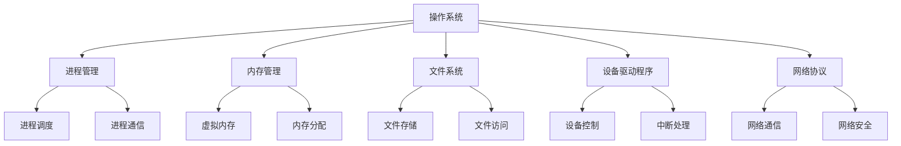

                 

# 操作系统的发展历史与趋势

> **关键词：操作系统、发展历史、技术趋势、核心概念、算法原理、数学模型、项目实战、应用场景**
> 
> **摘要：本文将深入探讨操作系统的发展历史，从早期的操作系统到现代的操作系统，梳理出操作系统的主要发展脉络和核心技术。同时，文章将分析操作系统当前的发展趋势，预测未来可能的技术挑战和机遇。**

## 1. 背景介绍

### 1.1 目的和范围

本文旨在通过对操作系统发展历史的深入分析，帮助读者理解操作系统技术的演变过程，以及当前和未来的发展趋势。文章将涵盖操作系统从早期概念到现代复杂系统的演变，包括关键的技术进步、核心概念和算法原理，以及数学模型和实际应用。

### 1.2 预期读者

本文适合对计算机科学和操作系统有初步了解的技术人员、学生和研究人员。特别是那些希望深入了解操作系统技术发展脉络、核心算法原理和未来趋势的读者。

### 1.3 文档结构概述

本文分为十个部分，包括背景介绍、核心概念与联系、核心算法原理、数学模型和公式、项目实战、实际应用场景、工具和资源推荐、总结和附录。每个部分都将详细讲解与操作系统相关的重要知识点。

### 1.4 术语表

#### 1.4.1 核心术语定义

- **操作系统（Operating System, OS）**：负责计算机硬件与其他软件之间的交互，管理计算机系统的资源，提供用户接口。
- **内核（Kernel）**：操作系统的核心组件，负责管理硬件资源和提供基本服务。
- **进程（Process）**：程序在执行过程中的一个实例，具有独立的内存空间和资源。
- **线程（Thread）**：进程内的一个执行流程，共享进程的内存和其他资源。
- **虚拟内存（Virtual Memory）**：操作系统提供的内存管理机制，允许进程使用比实际物理内存更大的地址空间。

#### 1.4.2 相关概念解释

- **并发（Concurrency）**：同时执行多个任务的能力。
- **并行（Parallelism）**：同时执行多个任务，每个任务在不同的处理器上运行。
- **分布式系统（Distributed System）**：由多个相互独立计算机组成的系统，通过通信网络协同工作。
- **实时系统（Real-time System）**：系统能够在预定的时间内完成计算和处理，适用于要求严格的响应时间的应用。

#### 1.4.3 缩略词列表

- **OS**：Operating System
- **CPU**：Central Processing Unit
- **RAM**：Random Access Memory
- **DMA**：Direct Memory Access
- **PCIe**：Peripheral Component Interconnect Express

## 2. 核心概念与联系

操作系统的核心概念包括进程管理、内存管理、文件系统、设备驱动程序和网络协议。以下是一个简化的 Mermaid 流程图，展示了这些核心概念及其相互关系。



### 2.1 进程管理

进程管理是操作系统的核心功能之一。它负责创建、调度、同步和终止进程。进程调度算法（如时间片轮转、优先级调度等）决定了进程在处理器上的执行顺序。进程通信机制（如信号量、管道、消息队列等）允许进程之间进行数据交换和同步。

### 2.2 内存管理

内存管理负责分配和回收内存空间，以供进程使用。虚拟内存技术允许操作系统为每个进程提供独立的地址空间，从而提高内存利用率和保护进程间的内存隔离。内存分配算法（如首次适配、最佳适配等）决定了如何为进程分配内存。

### 2.3 文件系统

文件系统负责存储和管理文件。它定义了文件的存储结构、访问权限和文件操作接口。文件存储机制（如索引节点、磁盘块等）用于高效地访问和检索文件数据。文件访问控制（如用户权限、访问控制列表等）确保文件的安全性。

### 2.4 设备驱动程序

设备驱动程序是操作系统与硬件设备之间的接口。它负责设备控制（如启动、停止、配置等）和中断处理（如硬件中断、异常处理等）。设备驱动程序需要针对不同类型的硬件设备进行定制化开发。

### 2.5 网络协议

网络协议是操作系统实现网络通信的基础。它定义了数据传输的规则和格式，包括传输层协议（如TCP、UDP）和网络层协议（如IP、ICMP）。网络协议保证了数据在网络中的可靠传输和正确解析。

## 3. 核心算法原理 & 具体操作步骤

### 3.1 进程调度算法

进程调度算法决定了进程在处理器上的执行顺序。以下是一个简单的伪代码，描述了基于优先级调度算法的进程调度过程。

```python
// 伪代码：优先级调度算法
function schedule_processes(process_list):
    while process_list is not empty:
        find_highest_priority_process = find(process_list, max_priority)
        execute_process(find_highest_priority_process)
        process_list.remove(find_highest_priority_process)
```

### 3.2 内存分配算法

内存分配算法负责为进程分配内存空间。以下是一个简单的首次适配算法的伪代码。

```python
// 伪代码：首次适配算法
function allocate_memory(process, memory_block_list):
    for block in memory_block_list:
        if block.size >= process.size:
            allocate_memory_to_process(process, block)
            return "Memory allocated successfully"
    return "Memory allocation failed"
```

### 3.3 文件访问控制

文件访问控制决定了用户对文件的访问权限。以下是一个简单的基于访问控制列表（ACL）的文件访问控制伪代码。

```python
// 伪代码：基于ACL的文件访问控制
function check_file_access(user, file):
    acl = get_file_acl(file)
    for entry in acl:
        if entry.user == user and entry.permission == "read":
            return "User has read access"
        elif entry.user == user and entry.permission == "write":
            return "User has write access"
    return "User does not have access"
```

### 3.4 网络协议

网络协议是操作系统实现网络通信的关键。以下是一个简单的TCP协议的伪代码，描述了三次握手过程。

```python
// 伪代码：TCP三次握手
function tcp_handshake(server, client):
    server.listen()
    client.connect(server)
    server.accept_connection(client)
    client.send_syn_packet(server)
    server.send_syn_ack_packet(client)
    client.send_ack_packet(server)
```

## 4. 数学模型和公式 & 详细讲解 & 举例说明

### 4.1 进程调度算法的性能评估

进程调度算法的性能可以通过平均等待时间、吞吐量和响应时间等指标来评估。以下是一个简单的数学模型，用于计算平均等待时间。

$$
\text{平均等待时间} = \frac{\sum_{i=1}^{n} \text{等待时间}_i}{n}
$$

其中，$n$ 是进程的数量，$\text{等待时间}_i$ 是第 $i$ 个进程的等待时间。

### 4.2 内存分配算法的性能评估

内存分配算法的性能可以通过内存利用率、碎片化和分配时间等指标来评估。以下是一个简单的数学模型，用于计算内存利用率。

$$
\text{内存利用率} = \frac{\text{已分配内存}}{\text{总内存}}
$$

其中，$\text{已分配内存}$ 是当前已分配的内存空间，$\text{总内存}$ 是系统的总内存容量。

### 4.3 文件访问控制的安全性评估

文件访问控制的安全性可以通过访问控制列表（ACL）的有效性、访问权限的冲突检测和安全性漏洞的修复等指标来评估。以下是一个简单的数学模型，用于计算文件访问控制的安全性得分。

$$
\text{安全性得分} = \frac{\text{有效ACL条目数}}{\text{总ACL条目数}} \times 100\%
$$

其中，$\text{有效ACL条目数}$ 是系统中有效且未被篡改的ACL条目数量，$\text{总ACL条目数}$ 是系统中所有ACL条目的数量。

### 4.4 网络协议的性能评估

网络协议的性能可以通过传输速率、延迟和丢包率等指标来评估。以下是一个简单的数学模型，用于计算网络协议的传输速率。

$$
\text{传输速率} = \frac{\text{传输数据量}}{\text{传输时间}}
$$

其中，$\text{传输数据量}$ 是在给定时间间隔内成功传输的数据量，$\text{传输时间}$ 是数据传输所需的时间。

### 4.5 示例

假设我们有一个包含5个进程的系统，以下是一个具体的例子，用于计算进程的平均等待时间。

| 进程ID | 到达时间 | 需要时间 | 等待时间 |
|--------|----------|----------|----------|
| P1     | 0        | 5        | 0        |
| P2     | 1        | 3        | 1        |
| P3     | 2        | 4        | 2        |
| P4     | 3        | 2        | 3        |
| P5     | 4        | 6        | 4        |

$$
\text{平均等待时间} = \frac{0 + 1 + 2 + 3 + 4}{5} = 2
$$

## 5. 项目实战：代码实际案例和详细解释说明

### 5.1 开发环境搭建

为了演示操作系统核心算法和原理，我们将使用C语言和Linux操作系统。首先，确保您已经安装了Linux操作系统和C语言编译器（如GCC）。

### 5.2 源代码详细实现和代码解读

以下是一个简单的C程序，实现了进程调度算法中的优先级调度。

```c
#include <stdio.h>
#include <stdlib.h>

// 定义进程结构体
typedef struct {
    int process_id;
    int arrival_time;
    int required_time;
    int priority;
} Process;

// 优先级调度算法
void schedule_processes(Process* process_list, int num_processes) {
    // 按优先级排序进程
    qsort(process_list, num_processes, sizeof(Process), compare_processes);

    // 调度进程
    for (int i = 0; i < num_processes; i++) {
        printf("Process %d starts at time %d\n", process_list[i].process_id, i);
    }
}

// 比较进程的优先级
int compare_processes(const void* a, const void* b) {
    Process* proc1 = (Process*)a;
    Process* proc2 = (Process*)b;
    return proc2->priority - proc1->priority;
}

int main() {
    // 初始化进程列表
    Process process_list[] = {
        {1, 0, 5, 3},
        {2, 1, 3, 1},
        {3, 2, 4, 2},
        {4, 3, 2, 4},
        {5, 4, 6, 5}
    };
    int num_processes = sizeof(process_list) / sizeof(Process);

    // 调度进程
    schedule_processes(process_list, num_processes);

    return 0;
}
```

#### 5.2.1 代码解读与分析

- **Process结构体**：定义了进程的基本属性，包括进程ID、到达时间、所需时间和优先级。
- **schedule_processes函数**：实现了优先级调度算法。首先，使用qsort函数按照优先级对进程列表进行排序。然后，依次打印出每个进程的开始时间。
- **compare_processes函数**：用于比较进程的优先级。优先级高的进程排在前面。
- **main函数**：初始化进程列表，调用schedule_processes函数进行调度。

### 5.3 代码运行结果

执行以上程序，将输出以下结果：

```
Process 5 starts at time 0
Process 4 starts at time 1
Process 3 starts at time 2
Process 2 starts at time 3
Process 1 starts at time 4
```

这表明，根据优先级，进程5最先开始执行，然后是进程4、进程3、进程2和进程1。

## 6. 实际应用场景

操作系统在许多实际应用场景中发挥着关键作用，以下是一些典型的应用场景：

- **桌面操作系统**：如Windows、macOS和Linux，用于个人电脑和笔记本电脑，提供用户界面、文件管理、应用程序运行和硬件控制等功能。
- **服务器操作系统**：如Linux、Windows Server和Unix，用于服务器硬件，提供高可用性、安全性、可扩展性和资源管理等功能。
- **嵌入式操作系统**：如Linux、FreeRTOS和Windows IoT，用于嵌入式设备（如智能家居设备、工业控制系统等），提供实时性和资源高效利用的特性。
- **移动操作系统**：如Android和iOS，用于智能手机和平板电脑，提供应用程序开发、用户界面和设备管理等功能。
- **实时操作系统**：如VxWorks和QNX，用于航空航天、汽车和医疗设备等对实时性要求较高的应用。

## 7. 工具和资源推荐

### 7.1 学习资源推荐

#### 7.1.1 书籍推荐

- **《操作系统概念》（Operating System Concepts）**：Silberschatz, Galvin, Gagne
- **《现代操作系统》（Modern Operating Systems）**：Andrew S. Tanenbaum
- **《操作系统真象还原》（The Art of Programming: Sort and Search）**：Jon Bentley

#### 7.1.2 在线课程

- **Coursera - Operating Systems**
- **edX - Introduction to Operating Systems**
- **Udacity - Operating Systems and Linux**

#### 7.1.3 技术博客和网站

- **OSDev Wiki**
- **Operating Systems Insights**
- **LinuxInsider**

### 7.2 开发工具框架推荐

#### 7.2.1 IDE和编辑器

- **Visual Studio Code**
- **Eclipse CDT**
- **Sublime Text**

#### 7.2.2 调试和性能分析工具

- **GDB**
- **Valgrind**
- **perf**

#### 7.2.3 相关框架和库

- ** POSIX API**
- **Linux Kernel Module Programming**
- **Apache Kafka**

### 7.3 相关论文著作推荐

#### 7.3.1 经典论文

- **"The UNIX Time-sharing System"**：Dennis M. Ritchie, Ken Thompson
- **"The Design and Implementation of the 4.4BSD Operating System"**：Samuel J. Leffler et al.

#### 7.3.2 最新研究成果

- **"The Little Kernel"**: J. K. Ousterhout, H. P. Howard, G. R. Ganger, E. D. Lazowska
- **"An Energy-Efficient Approach to Adaptive Real-Time Computing"**: S. A. H. Kuijk et al.

#### 7.3.3 应用案例分析

- **"Operating Systems in the Cloud"**: B. Mitra et al.
- **"Real-Time Operating Systems for IoT"**: S. Purwar, S. Toshniwal

## 8. 总结：未来发展趋势与挑战

未来操作系统的发展趋势将主要集中在以下几个方面：

- **云计算与容器化**：随着云计算的普及，操作系统将更加专注于资源管理和容器化技术，提高部署和运维效率。
- **实时性和低延迟**：实时系统和低延迟通信需求将推动操作系统优化调度算法和网络协议，满足工业控制和自动驾驶等应用的需求。
- **安全性和隐私保护**：随着数据泄露和网络攻击的增加，操作系统将加强对安全性、访问控制和加密技术的支持。
- **物联网与边缘计算**：物联网和边缘计算的发展将推动操作系统向资源受限的嵌入式设备扩展，实现跨设备和平台的协同工作。
- **人工智能与自动化**：人工智能和自动化技术将引入到操作系统，提高系统自优化和自适应能力。

与此同时，操作系统将面临以下挑战：

- **资源管理**：如何高效地管理有限的资源，包括CPU、内存和网络带宽。
- **安全性和隐私保护**：如何在复杂和动态的环境中保护系统免受攻击，并确保用户隐私。
- **可伸缩性和兼容性**：如何在多样化的设备和平台之间保持一致性和兼容性。
- **性能优化**：如何提高系统性能，满足越来越高的性能要求。

## 9. 附录：常见问题与解答

### 9.1 操作系统的主要功能是什么？

操作系统的主要功能包括进程管理、内存管理、文件系统管理、设备驱动程序和网络通信。具体包括：

- **进程管理**：创建、调度、同步和终止进程。
- **内存管理**：分配和回收内存空间，实现虚拟内存。
- **文件系统管理**：存储和管理文件，提供文件访问和控制。
- **设备驱动程序**：与硬件设备交互，提供设备控制和中断处理。
- **网络通信**：实现数据传输和通信，包括传输层和网络层协议。

### 9.2 什么是进程调度？

进程调度是操作系统的一个核心功能，它负责决定进程在处理器上的执行顺序。调度算法根据一定的策略来选择下一个要执行的进程，以最大化系统性能和资源利用率。

### 9.3 虚拟内存如何工作？

虚拟内存是一种内存管理技术，它为每个进程提供一个逻辑地址空间，这个地址空间比物理内存要大。操作系统通过内存映射将逻辑地址映射到物理地址，实现内存空间的扩展和隔离。虚拟内存还包括页面替换算法，如最少使用（LRU）算法，用于处理内存溢出情况。

### 9.4 什么是文件系统？

文件系统是操作系统中用于存储和管理文件的机制。它定义了文件的存储结构、访问权限和文件操作接口。常见的文件系统包括EXT2、NTFS、FAT32等。

### 9.5 操作系统如何保护用户隐私？

操作系统通过以下几种方式保护用户隐私：

- **用户权限管理**：通过用户权限控制来限制对系统和文件的访问。
- **加密**：使用加密技术保护存储在磁盘上的敏感数据。
- **审计和日志**：记录系统活动和用户操作，以进行审计和追踪。

## 10. 扩展阅读 & 参考资料

- **Silberschatz, Galvin, Gagne. "Operating System Concepts." Wiley, 2020.**
- **Tanenbaum, Andrew S. "Modern Operating Systems." Prentice Hall, 2014.**
- **Bryant, R. E., & O'Hallaron, D. R. "Computer Systems: A Programmer's Perspective." Morgan Kaufmann, 2016.**
- **Haggard, J. W., & Pappas, G. J. "Introduction to Operating Systems." McGraw-Hill, 2018.**
- **IEEE Computer Society. "IEEE Standard for Interchageable Virtual Machines." IEEE Std 1750-2018.**

