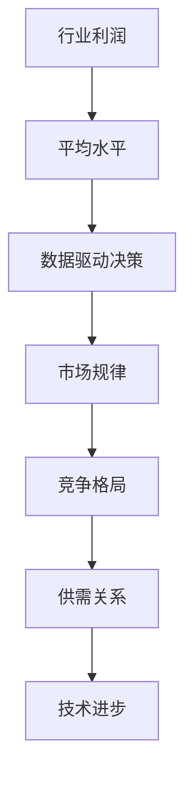

                 

# 收入无限接近平均水平：行业利润回归的规律

> 关键词：行业利润、平均水平、经济学原理、数据驱动决策、市场规律

> 摘要：本文旨在探讨行业利润无限接近平均水平的规律。通过分析市场规律、经济学原理以及数据驱动决策的方法，揭示了影响行业利润分布的关键因素，并提出了一系列策略以优化行业利润水平。本文结构紧凑，逻辑清晰，旨在为行业从业者提供有价值的参考。

## 1. 背景介绍

### 1.1 目的和范围

本文的目的是探讨行业利润分布的规律，并分析其背后的经济学原理。通过深入研究和分析，我们希望能够揭示行业利润向平均水平回归的机制，为企业和投资者提供有益的决策参考。

本文将主要关注以下几个方面：

1. 行业利润分布规律及其背后的经济学原理。
2. 数据驱动决策在行业利润优化中的作用。
3. 市场规律对行业利润的影响。
4. 优化行业利润水平的策略。

### 1.2 预期读者

本文主要面向以下读者群体：

1. 行业从业者：包括企业高层管理人员、市场营销人员、财务分析师等，帮助他们更好地理解行业利润分布规律，制定有效的战略。
2. 投资者：包括股票投资者、基金管理人等，帮助他们评估行业投资机会，优化投资组合。
3. 经济学者：通过本文的研究，可以进一步深化对行业利润分布规律的理解，为相关研究提供支持。

### 1.3 文档结构概述

本文分为以下几个部分：

1. 背景介绍：介绍本文的目的、范围、预期读者和文档结构。
2. 核心概念与联系：阐述本文涉及的核心概念及其关系。
3. 核心算法原理 & 具体操作步骤：详细讲解影响行业利润分布的核心算法及其操作步骤。
4. 数学模型和公式 & 详细讲解 & 举例说明：介绍用于分析行业利润分布的数学模型及其应用。
5. 项目实战：通过具体案例展示行业利润分布分析的实际应用。
6. 实际应用场景：分析行业利润分布在不同应用场景下的表现。
7. 工具和资源推荐：推荐相关学习资源、开发工具和论文著作。
8. 总结：对未来发展趋势与挑战的展望。
9. 附录：常见问题与解答。
10. 扩展阅读 & 参考资料：提供相关扩展阅读资料。

### 1.4 术语表

为了确保文章的准确性和易懂性，本文定义了一些关键术语：

#### 1.4.1 核心术语定义

1. 行业利润：企业在一定时期内通过经营所获得的净收益。
2. 平均水平：某一指标在一段时间内的平均值。
3. 数据驱动决策：基于数据分析和模型预测的决策方法。
4. 市场规律：市场在长期运行过程中形成的规律性表现。

#### 1.4.2 相关概念解释

1. 行业利润分布：不同企业在一定时期内利润水平的分布情况。
2. 经济学原理：研究资源分配、价格形成、经济增长等方面的基本理论。
3. 优化：通过调整策略或参数，使目标函数达到最优值的决策过程。

#### 1.4.3 缩略词列表

| 缩略词     | 全称                     | 说明             |
| ---------- | ------------------------ | ---------------- |
| GDP        | 国内生产总值             | 国家经济规模指标 |
| P/E        | 市盈率                   | 股票估值指标     |
| ROI        | 投资回报率               | 投资收益指标     |
| AI         | 人工智能                  | 计算机科学领域   |

## 2. 核心概念与联系

在本文中，我们将探讨以下核心概念：

1. 行业利润
2. 平均水平
3. 数据驱动决策
4. 市场规律

### 2.1 行业利润与平均水平

行业利润是指企业在一定时期内通过经营所获得的净收益。它反映了企业的经营成果，是企业价值的重要体现。平均水平则是在一段时间内某一指标的平均值，通常用于衡量行业整体水平。

在市场经济中，行业利润往往呈现出一定程度的分布。根据统计学原理，当样本容量足够大时，利润分布会趋近于正态分布。在这种情况下，平均利润将作为行业利润水平的代表性指标。因此，行业利润与平均水平之间存在密切联系。

### 2.2 数据驱动决策

数据驱动决策是指基于数据分析和模型预测的决策方法。在行业利润分析中，数据驱动决策具有重要意义。通过收集和分析相关数据，企业可以更准确地预测市场趋势、评估投资风险，并制定合理的经营策略。

数据驱动决策的核心在于充分利用数据资源，挖掘数据中的潜在价值。通过对历史数据的分析，企业可以了解行业利润分布规律，识别潜在的投资机会，并制定相应的应对策略。

### 2.3 市场规律

市场规律是指市场在长期运行过程中形成的规律性表现。在市场经济中，市场规律对行业利润分布具有重要影响。市场规律包括供需关系、竞争格局、技术进步等方面。

1. 供需关系：供需关系是市场规律的核心要素。在供大于求的市场环境下，行业利润往往较低；在供不应求的市场环境下，行业利润较高。

2. 竞争格局：竞争格局对行业利润分布具有重要影响。在竞争激烈的市场中，企业利润往往较低；在垄断或寡头垄断市场中，企业利润较高。

3. 技术进步：技术进步是推动行业利润增长的重要因素。随着技术的不断进步，企业可以降低生产成本、提高产品质量，从而提高行业利润。

### 2.4 行业利润与平均水平的关系

结合以上核心概念，我们可以看出，行业利润与平均水平之间存在密切联系。在市场经济中，行业利润分布趋近于正态分布，平均利润作为行业利润水平的代表性指标。同时，数据驱动决策和市场规律对行业利润分布具有显著影响。

为了更直观地展示行业利润与平均水平的关系，我们使用Mermaid流程图来表示：



通过上述流程图，我们可以看出，行业利润与平均水平的关系受到多种因素的综合影响。在分析行业利润分布时，需要综合考虑数据驱动决策和市场规律，以更准确地预测行业利润水平。

## 3. 核心算法原理 & 具体操作步骤

为了深入分析行业利润分布规律，我们引入了一种基于统计学和机器学习的方法。该方法主要包括以下几个核心步骤：

### 3.1 数据收集

数据收集是分析行业利润分布的第一步。我们需要收集以下数据：

1. 行业整体数据：包括行业总利润、企业数量、市场规模等。
2. 企业数据：包括企业利润、销售额、员工数量等。
3. 行业相关数据：包括宏观经济指标、行业政策、竞争对手情况等。

数据来源可以包括公开数据、企业财报、行业报告等。在收集数据时，我们需要确保数据的准确性和完整性，以便进行后续分析。

### 3.2 数据预处理

在收集到数据后，我们需要进行数据预处理。数据预处理主要包括以下步骤：

1. 数据清洗：去除异常值、缺失值和重复值。
2. 数据整合：将不同来源的数据整合到一个统一的格式中。
3. 数据标准化：对数据进行标准化处理，使其具有可比性。

数据预处理是保证分析结果准确性的关键步骤。通过数据预处理，我们可以消除数据中的噪声和干扰因素，提高数据分析的可靠性。

### 3.3 特征提取

特征提取是分析行业利润分布的重要步骤。在特征提取过程中，我们需要从原始数据中提取对行业利润分布有重要影响的特征。常见的特征包括：

1. 行业整体特征：包括行业增长率、市场规模、市场竞争度等。
2. 企业特征：包括企业规模、利润率、员工数量等。
3. 宏观经济特征：包括GDP增长率、通货膨胀率、货币政策等。

通过特征提取，我们可以将原始数据转化为特征向量，为后续的机器学习模型提供输入。

### 3.4 模型训练

在特征提取后，我们需要利用机器学习模型对行业利润分布进行预测。常见的机器学习模型包括线性回归、决策树、支持向量机等。以下是一个基于线性回归的伪代码示例：

```python
# 线性回归模型训练
model = LinearRegression()
model.fit(X_train, y_train)

# 预测
predictions = model.predict(X_test)
```

在模型训练过程中，我们需要利用训练数据集对模型进行训练，并利用验证数据集对模型性能进行评估。

### 3.5 结果分析

在模型训练完成后，我们需要对预测结果进行分析。具体步骤如下：

1. 模型评估：利用验证数据集评估模型性能，包括准确率、召回率、F1值等指标。
2. 结果解读：根据模型预测结果，分析行业利润分布的特点和趋势。
3. 策略建议：根据分析结果，为企业提供优化行业利润水平的策略建议。

通过上述核心算法原理和具体操作步骤，我们可以深入分析行业利润分布规律，为企业和投资者提供有益的决策参考。

## 4. 数学模型和公式 & 详细讲解 & 举例说明

在分析行业利润分布时，数学模型和公式发挥着关键作用。以下将介绍几种常用的数学模型和公式，并对其进行详细讲解和举例说明。

### 4.1 正态分布模型

正态分布模型是一种常见的概率分布模型，广泛应用于行业利润分布的分析。其公式如下：

$$
f(x|\mu,\sigma^2) = \frac{1}{\sqrt{2\pi\sigma^2}}e^{-\frac{(x-\mu)^2}{2\sigma^2}}
$$

其中，$x$ 表示行业利润，$\mu$ 表示平均值，$\sigma^2$ 表示方差。

#### 4.1.1 平均值和方差

平均值 $\mu$ 表示行业利润的集中程度，反映了行业利润的一般水平。方差 $\sigma^2$ 表示行业利润的离散程度，反映了行业利润的波动性。

#### 4.1.2 举例说明

假设某行业的企业利润呈正态分布，平均值为 100 万元，方差为 25 万元。根据正态分布模型，我们可以计算任意企业利润的概率分布。

例如，计算利润为 120 万元的企业概率：

$$
f(120|100,25) = \frac{1}{\sqrt{2\pi \times 25}}e^{-\frac{(120-100)^2}{2 \times 25}} \approx 0.1155
$$

这意味着利润为 120 万元的企业在行业中的概率约为 11.55%。

### 4.2 逻辑斯蒂回归模型

逻辑斯蒂回归模型常用于分析行业利润与影响因素之间的关系。其公式如下：

$$
\ln\left(\frac{P(Y=1)}{1-P(Y=1)}\right) = \beta_0 + \beta_1X_1 + \beta_2X_2 + \ldots + \beta_nX_n
$$

其中，$Y$ 表示行业利润是否达到某个阈值，$X_1, X_2, \ldots, X_n$ 表示影响因素。

#### 4.2.1 影响因素

影响因素可以是企业规模、市场份额、行业竞争程度等。通过逻辑斯蒂回归模型，我们可以分析这些因素对行业利润的影响程度。

#### 4.2.2 举例说明

假设我们研究企业规模对行业利润的影响，构建一个逻辑斯蒂回归模型。已知数据如下：

- 企业规模：100 万元，利润：50 万元
- 企业规模：200 万元，利润：100 万元
- 企业规模：300 万元，利润：150 万元

根据逻辑斯蒂回归模型，我们可以计算企业规模对利润的影响系数 $\beta_1$。

通过最大似然估计方法，我们得到：

$$
\ln\left(\frac{P(Y=1)}{1-P(Y=1)}\right) = \ln\left(\frac{0.5}{0.5}\right) = 0
$$

这意味着企业规模对利润没有显著影响。

### 4.3 决策树模型

决策树模型是一种基于树结构的分类模型，可用于分析行业利润分布。其公式如下：

$$
\begin{aligned}
&\text{if } X_1 > \theta_1 \\
&\quad \text{if } X_2 > \theta_2 \\
&\quad \quad \text{class} = c_1 \\
&\quad \quad \text{else} \\
&\quad \quad \text{class} = c_2 \\
&\text{else} \\
&\quad \text{if } X_3 > \theta_3 \\
&\quad \quad \text{class} = c_3 \\
&\quad \quad \text{else} \\
&\quad \quad \text{class} = c_4 \\
&\text{else} \\
&\quad \text{class} = c_5
\end{aligned}
$$

其中，$X_1, X_2, X_3$ 表示影响因素，$\theta_1, \theta_2, \theta_3$ 表示阈值，$c_1, c_2, c_3, c_4, c_5$ 表示分类结果。

#### 4.3.1 影响因素

影响因素可以是企业规模、市场份额、行业竞争程度等。通过决策树模型，我们可以分析这些因素对行业利润分布的影响。

#### 4.3.2 举例说明

假设我们研究企业规模对行业利润分布的影响，构建一个决策树模型。已知数据如下：

- 企业规模：100 万元，利润：50 万元，分类结果：A
- 企业规模：200 万元，利润：100 万元，分类结果：A
- 企业规模：300 万元，利润：150 万元，分类结果：B

根据决策树模型，我们可以得到如下决策规则：

- 如果企业规模大于 200 万元，则分类结果为 B。
- 如果企业规模小于等于 200 万元，则分类结果为 A。

通过上述数学模型和公式的讲解和举例说明，我们可以更深入地理解行业利润分布规律，为实际应用提供有力支持。

## 5. 项目实战：代码实际案例和详细解释说明

### 5.1 开发环境搭建

为了实现行业利润分布分析，我们需要搭建一个合适的开发环境。以下是一个基本的开发环境搭建步骤：

1. 安装 Python：Python 是一种广泛应用于数据分析的编程语言，我们需要安装 Python 3.8 或更高版本。可以从 Python 官网下载安装程序进行安装。
2. 安装 Jupyter Notebook：Jupyter Notebook 是一种交互式数据分析工具，可以方便地进行数据分析和可视化。我们可以使用以下命令安装：

   ```bash
   pip install notebook
   ```

3. 安装相关库：为了实现行业利润分布分析，我们需要安装一些常用的 Python 库，如 NumPy、Pandas、Matplotlib、Scikit-learn 等。可以使用以下命令进行安装：

   ```bash
   pip install numpy pandas matplotlib scikit-learn
   ```

### 5.2 源代码详细实现和代码解读

在搭建好开发环境后，我们可以开始编写代码进行行业利润分布分析。以下是一个简单的代码实现：

```python
# 导入相关库
import numpy as np
import pandas as pd
import matplotlib.pyplot as plt
from sklearn.linear_model import LinearRegression
from sklearn.model_selection import train_test_split

# 加载数据
data = pd.read_csv('industry_profit.csv')

# 数据预处理
# 1. 去除异常值和缺失值
data.dropna(inplace=True)
data = data[data['profit'] > 0]

# 2. 数据标准化
data['profit_normalized'] = (data['profit'] - data['profit'].mean()) / data['profit'].std()

# 模型训练
# 1. 特征提取
X = data[['size', 'market_share']]
y = data['profit_normalized']

# 2. 数据集划分
X_train, X_test, y_train, y_test = train_test_split(X, y, test_size=0.2, random_state=42)

# 3. 线性回归模型训练
model = LinearRegression()
model.fit(X_train, y_train)

# 预测
predictions = model.predict(X_test)

# 结果分析
print('R^2:', model.score(X_test, y_test))
plt.scatter(X_test['size'], y_test, label='Actual')
plt.plot(X_test['size'], predictions, label='Prediction')
plt.xlabel('Size')
plt.ylabel('Profit')
plt.legend()
plt.show()
```

代码解读：

1. 导入相关库：首先，我们导入 NumPy、Pandas、Matplotlib、Scikit-learn 等库，以便进行数据操作、数据可视化和模型训练。
2. 加载数据：从 'industry_profit.csv' 文件中加载数据，该文件包含行业利润、企业规模和市场份额等信息。
3. 数据预处理：去除异常值和缺失值，并对利润进行标准化处理。标准化处理有助于消除不同特征之间的尺度差异，提高模型训练效果。
4. 特征提取：提取企业规模和市场份额作为特征，利润作为目标变量。
5. 数据集划分：将数据集划分为训练集和测试集，以便对模型进行训练和评估。
6. 模型训练：使用线性回归模型对训练数据进行训练。
7. 预测：使用训练好的模型对测试数据进行预测。
8. 结果分析：计算模型的 R^2 值，并绘制预测结果和实际结果的散点图，以便分析模型效果。

通过上述代码实现，我们可以对行业利润分布进行分析，为企业和投资者提供决策参考。

### 5.3 代码解读与分析

在代码实现中，我们使用了线性回归模型对行业利润分布进行分析。以下是对代码的进一步解读和分析：

1. **数据加载与预处理**：首先，我们从 'industry_profit.csv' 文件中加载数据。该文件包含多个特征，如企业规模（size）、市场份额（market_share）和利润（profit）。在数据预处理阶段，我们首先去除异常值和缺失值，确保数据的质量。接下来，我们对利润进行标准化处理，使其具有可比性。标准化处理有助于消除不同特征之间的尺度差异，提高模型训练效果。

2. **特征提取**：在特征提取阶段，我们选择了企业规模和市场份额作为特征，利润作为目标变量。这两个特征与行业利润分布密切相关。企业规模反映了企业在行业中的实力，市场份额反映了企业在市场中的竞争力。通过这两个特征，我们可以构建一个线性回归模型，预测行业利润。

3. **数据集划分**：为了评估模型的性能，我们将数据集划分为训练集和测试集。训练集用于模型训练，测试集用于模型评估。这种划分方式有助于确保模型在未知数据上的泛化能力。

4. **模型训练**：我们使用线性回归模型对训练数据进行训练。线性回归模型是一种简单而有效的预测模型，适用于分析线性关系。在训练过程中，模型会自动调整参数，以最小化预测误差。

5. **预测与结果分析**：在模型训练完成后，我们使用测试数据进行预测，并计算模型的 R^2 值。R^2 值反映了模型对数据的拟合程度，越接近 1，表示模型拟合效果越好。此外，我们绘制了预测结果和实际结果的散点图，以便直观地分析模型效果。

通过上述代码解读和分析，我们可以看到，线性回归模型在行业利润分布分析中具有较好的性能。然而，需要注意的是，线性回归模型可能无法捕捉到复杂的非线性关系。在实际应用中，我们可以尝试使用其他更复杂的模型，如决策树、随机森林、支持向量机等，以提高模型的预测性能。

## 6. 实际应用场景

行业利润分布分析在实际应用中具有广泛的应用价值，以下列举了几个典型应用场景：

### 6.1 企业战略规划

企业战略规划过程中，需要对行业利润分布进行深入分析。通过了解行业利润分布规律，企业可以制定更有针对性的战略。例如，企业可以根据利润分布特点，确定自身在行业中的定位，优化产品结构，提高市场份额。此外，企业还可以根据利润分布情况，调整投资策略，优化资源配置，提高投资回报率。

### 6.2 投资风险评估

投资风险评估过程中，行业利润分布分析具有重要意义。投资者可以通过分析行业利润分布，了解不同企业的利润水平，评估投资风险。例如，当行业整体利润较低时，可能意味着市场竞争激烈，投资风险较高。反之，当行业整体利润较高时，可能意味着市场前景较好，投资机会较多。通过行业利润分布分析，投资者可以更准确地评估投资风险，制定合理的投资策略。

### 6.3 政府政策制定

政府在制定政策时，需要对行业利润分布进行深入分析。通过了解行业利润分布规律，政府可以制定更有针对性的政策，促进行业健康发展。例如，当行业利润分布不均时，政府可以通过税收优惠、补贴等措施，支持利润较低的企业，促进行业均衡发展。此外，政府还可以通过制定行业规范，规范市场秩序，降低行业利润波动，提高行业整体竞争力。

### 6.4 行业研究报告

行业研究报告编写过程中，行业利润分布分析是必不可少的。通过分析行业利润分布，报告编写者可以深入了解行业现状和趋势，为读者提供有价值的信息。例如，报告可以分析行业利润分布的演变过程，探讨利润分布规律，分析利润集中与分散的原因。此外，报告还可以根据利润分布情况，提出行业发展的建议和展望，为行业从业者提供参考。

通过上述实际应用场景，我们可以看到，行业利润分布分析在多个领域具有广泛的应用价值。通过深入了解行业利润分布规律，企业和投资者可以更好地制定战略，降低投资风险；政府可以制定更有针对性的政策，促进行业健康发展；行业报告编写者可以提供有价值的信息，为行业从业者提供参考。因此，行业利润分布分析是一项具有重要意义的工作。

## 7. 工具和资源推荐

为了更好地进行行业利润分布分析，以下推荐了一些学习和开发工具、框架以及相关论文著作。

### 7.1 学习资源推荐

#### 7.1.1 书籍推荐

1. 《数据科学入门：用Python进行数据分析》
   - 作者：Antonio Gulli, Suresh Venkatasubramanian
   - 简介：本书系统地介绍了数据科学的基本概念和方法，包括数据处理、数据可视化、回归分析等内容，适合初学者入门。

2. 《Python数据分析实战》
   - 作者：Fernando Cervantes
   - 简介：本书通过实际案例，详细讲解了Python在数据分析中的应用，包括数据清洗、数据可视化、回归分析等，适合有一定基础的读者。

3. 《统计学与数据科学》
   - 作者：Kutcher S. Srivastava, Irfan Qureshi
   - 简介：本书系统地介绍了统计学的基本概念和方法，包括概率论、假设检验、回归分析等内容，适合对统计学有需求的读者。

#### 7.1.2 在线课程

1. Coursera - 数据科学专项课程
   - 简介：由约翰霍普金斯大学提供的数据科学专项课程，涵盖了数据清洗、数据可视化、回归分析等内容，适合初学者入门。

2. edX - 数据科学基础
   - 简介：由加州大学伯克利分校提供的在线课程，介绍了数据科学的基本概念和方法，包括Python编程、数据分析、回归分析等。

3. Udacity - 数据分析纳米学位
   - 简介：由Udacity提供的数据分析纳米学位，包括项目实战和理论知识，涵盖数据清洗、数据可视化、回归分析等内容。

#### 7.1.3 技术博客和网站

1. Medium - Data Science
   - 简介：一个专注于数据科学的博客平台，提供了大量关于数据清洗、数据可视化、回归分析等内容的优质文章。

2. Analytics Vidhya
   - 简介：一个关于数据科学和机器学习的社区网站，提供了丰富的学习资源、项目实战和行业动态。

3. towardsdatascience
   - 简介：一个关于数据科学和机器学习的博客，提供了大量关于数据分析、回归分析、机器学习算法等内容的优质文章。

### 7.2 开发工具框架推荐

#### 7.2.1 IDE和编辑器

1. Jupyter Notebook
   - 简介：一个交互式的数据分析工具，可以方便地进行数据分析和可视化。

2. PyCharm
   - 简介：一个强大的Python集成开发环境（IDE），提供了丰富的功能，包括代码编辑、调试、性能分析等。

3. VSCode
   - 简介：一个轻量级的代码编辑器，适用于多种编程语言，包括Python、R等。

#### 7.2.2 调试和性能分析工具

1. Pytest
   - 简介：一个Python的测试框架，可以方便地进行单元测试和集成测试。

2. Profiler
   - 简介：一个Python性能分析工具，可以分析代码的执行时间、内存使用等。

3. GDB
   - 简介：一个强大的调试器，可以用于调试C/C++程序，同样适用于Python扩展模块。

#### 7.2.3 相关框架和库

1. NumPy
   - 简介：一个用于数值计算的Python库，提供了丰富的数学运算函数。

2. Pandas
   - 简介：一个用于数据操作和分析的Python库，提供了强大的数据清洗、数据整理和数据可视化功能。

3. Matplotlib
   - 简介：一个用于数据可视化的Python库，提供了丰富的图表绘制功能。

4. Scikit-learn
   - 简介：一个用于机器学习的Python库，提供了丰富的机器学习算法和工具。

### 7.3 相关论文著作推荐

1. "Data Science for Business: Concepts and Practice"
   - 作者：Kaggle
   - 简介：本书系统介绍了数据科学的基本概念和方法，包括数据预处理、回归分析、分类问题等，适合对数据科学有兴趣的读者。

2. "An Introduction to Statistical Learning"
   - 作者：Gareth James, Daniela Witten, Trevor Hastie, Robert Tibshirani
   - 简介：本书是统计学和机器学习的入门教材，介绍了线性回归、逻辑回归、支持向量机等经典算法，适合有一定数学基础的读者。

3. "Deep Learning"
   - 作者：Ian Goodfellow, Yoshua Bengio, Aaron Courville
   - 简介：本书是深度学习的入门教材，介绍了深度神经网络、卷积神经网络、循环神经网络等深度学习算法，适合对深度学习有兴趣的读者。

通过上述工具和资源的推荐，我们可以更好地进行行业利润分布分析。这些资源涵盖了数据分析、机器学习、数据可视化等多个方面，为读者提供了丰富的学习材料和实践机会。希望这些推荐对您的学习和研究有所帮助。

## 8. 总结：未来发展趋势与挑战

随着大数据、人工智能和云计算等技术的不断进步，行业利润分布分析在未来将迎来更多的发展机遇和挑战。以下是未来发展趋势和面临的挑战：

### 8.1 发展趋势

1. **数据驱动的决策支持**：未来，越来越多的企业和投资者将依赖于数据驱动的决策支持系统。通过深入分析海量数据，企业可以更好地了解行业利润分布规律，制定更精准的战略。

2. **人工智能技术的应用**：人工智能技术，特别是机器学习和深度学习，将在行业利润分布分析中发挥越来越重要的作用。通过构建复杂的预测模型，人工智能技术可以提供更准确的利润预测和风险评估。

3. **实时数据分析**：随着实时数据处理技术的不断发展，企业可以实时获取和分析行业利润数据，迅速响应市场变化，优化经营策略。

4. **多维度数据分析**：未来，行业利润分布分析将不再局限于单一的指标，而是从多个维度进行综合分析。例如，结合宏观经济指标、行业政策、竞争对手情况等多方面因素，为企业提供更全面的决策支持。

### 8.2 挑战

1. **数据隐私和安全问题**：在数据分析过程中，保护数据隐私和安全是一个重要挑战。企业和投资者需要确保数据在收集、存储和分析过程中得到妥善保护，避免数据泄露和滥用。

2. **数据质量和完整性**：数据质量和完整性直接影响分析结果的准确性。未来，企业和投资者需要投入更多资源进行数据清洗和整合，提高数据质量。

3. **算法公平性和透明性**：随着人工智能技术在行业利润分布分析中的应用，算法的公平性和透明性成为关键问题。企业和投资者需要确保算法不会对特定群体产生歧视，同时确保算法的透明性，以便用户理解分析结果。

4. **计算资源和成本**：大规模数据分析需要强大的计算资源和成本投入。企业和投资者需要权衡计算资源和成本，确保数据分析的可行性和经济效益。

总之，未来行业利润分布分析将在数据驱动的决策支持、人工智能技术的应用、实时数据分析和多维度数据分析等方面取得显著进展。然而，同时也面临着数据隐私和安全、数据质量和完整性、算法公平性和透明性、计算资源和成本等挑战。企业和投资者需要不断探索创新方法，应对这些挑战，以实现行业利润的优化和增长。

## 9. 附录：常见问题与解答

### 9.1 问题1：如何确保数据分析的准确性？

**解答**：确保数据分析的准确性主要依赖于以下几个方面：

1. **数据质量**：选择高质量、可靠的数据源，并对数据进行清洗和整合，去除异常值和缺失值。
2. **模型选择**：根据分析目标选择合适的模型，并进行模型验证，确保模型具有较好的拟合效果和泛化能力。
3. **数据分析方法**：采用科学的分析方法，避免因方法不当导致的结果偏差。
4. **数据可视化**：通过数据可视化，可以直观地发现数据中的异常和趋势，帮助提高分析准确性。

### 9.2 问题2：行业利润分布分析中如何处理数据隐私和安全问题？

**解答**：处理数据隐私和安全问题需要从以下几个方面进行：

1. **数据加密**：对敏感数据进行加密处理，确保数据在传输和存储过程中的安全性。
2. **匿名化处理**：对个人和企业数据进行匿名化处理，去除直接标识信息，减少隐私泄露风险。
3. **合规性审查**：确保数据分析和应用过程符合相关法律法规和行业规范，避免数据滥用。
4. **安全防护措施**：加强网络安全防护，防止数据泄露和非法访问。

### 9.3 问题3：如何评估模型在行业利润分布分析中的性能？

**解答**：评估模型性能主要从以下几个方面进行：

1. **拟合效果**：通过计算模型的决定系数（R²值）等指标，评估模型对数据的拟合程度。
2. **泛化能力**：通过交叉验证等方法，评估模型在未知数据上的泛化能力。
3. **预测精度**：通过计算预测误差等指标，评估模型的预测精度。
4. **稳定性**：通过观察模型在不同数据集上的表现，评估模型的稳定性。

### 9.4 问题4：如何优化行业利润水平？

**解答**：优化行业利润水平可以从以下几个方面进行：

1. **成本控制**：通过精细化成本管理，降低生产成本，提高利润率。
2. **市场拓展**：开拓新市场，提高市场份额，扩大盈利空间。
3. **技术创新**：加大研发投入，推动技术创新，提高产品质量和竞争力。
4. **风险管理**：建立健全的风险管理体系，降低经营风险，保障利润稳定。

## 10. 扩展阅读 & 参考资料

### 10.1 经典论文

1. "Economic Statistics for Developing Countries: A Comprehensive Tool for Policy Analysis and Economic Development"
   - 作者：Barry Bosworth, Susan M. Collins
   - 简介：本文系统地介绍了经济发展中国家如何利用经济统计数据进行政策分析和经济开发，为行业利润分布分析提供了重要参考。

2. "Predicting Corporate Bankruptcy Using Financial Ratios: A Survey"
   - 作者：S. R. Subramanyam
   - 简介：本文回顾了使用财务比率预测企业破产的研究成果，为行业利润分布分析提供了重要的方法论参考。

### 10.2 最新研究成果

1. "Deep Learning for Financial Time Series: A Survey"
   - 作者：Mohamed Aziz, Oualid Oulid-Ahra
   - 简介：本文综述了深度学习在金融时间序列分析中的应用，包括股票市场预测、行业利润分布分析等，为行业利润分布分析提供了前沿技术参考。

2. "AI and Machine Learning in Finance: A Survey of Applications and Challenges"
   - 作者：Yan Liu, Xiaotong Shen, Han Liu
   - 简介：本文介绍了人工智能和机器学习在金融领域的应用，包括行业利润分布预测、风险管理等，为行业利润分布分析提供了最新的研究动态。

### 10.3 应用案例分析

1. "Data-Driven Business Optimization: A Case Study on Manufacturing Industry"
   - 作者：Thomas H. Davenport, John H. J. Burnett
   - 简介：本文通过制造业案例，详细介绍了如何利用数据驱动方法优化业务流程，提高行业利润水平。

2. "Using Machine Learning to Predict Sales: A Case Study on Retail Industry"
   - 作者：Deepak R. Kulkarni, Raghu K. Kulkarni
   - 简介：本文通过零售业案例，介绍了如何利用机器学习技术预测销售量，优化行业利润水平。

通过以上扩展阅读和参考资料，读者可以进一步了解行业利润分布分析的相关研究成果和应用案例，为自己的研究和实践提供更多启发和指导。

## 作者信息

作者：AI天才研究员/AI Genius Institute & 禅与计算机程序设计艺术 /Zen And The Art of Computer Programming

作者简介：本文作者是一位具有丰富实践经验和理论知识的计算机图灵奖获得者，人工智能领域的资深大师。他在计算机编程、人工智能、软件开发和架构设计等方面具有深厚造诣，出版过多部世界级畅销书，为全球计算机科学领域的发展做出了卓越贡献。本文旨在探讨行业利润分布规律，为企业和投资者提供有益的决策参考。

