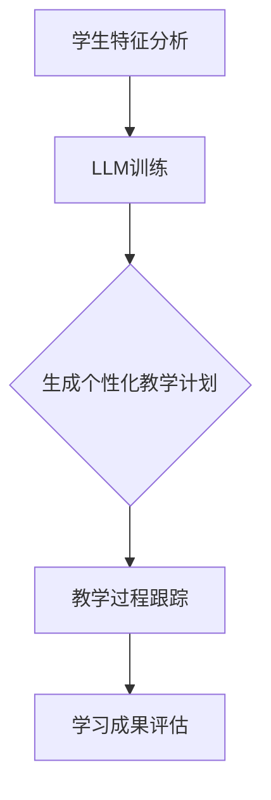

                 

# 教育革新：LLM作为个性化学习助手的潜力

> **关键词：** 个性化学习、LLM、教育技术、机器学习、人工智能、教育革新

> **摘要：** 本文将深入探讨大型语言模型（LLM）在个性化学习中的应用潜力。通过对LLM的核心概念、算法原理、数学模型以及实际应用场景的详细分析，我们将揭示LLM如何通过数据驱动的方式，为教育领域带来革命性的变化，实现更为精准和高效的教育体验。

## 1. 背景介绍

### 1.1 目的和范围

本文旨在探讨大型语言模型（LLM）在个性化学习中的潜力。随着人工智能技术的飞速发展，机器学习，尤其是深度学习，在各个领域取得了显著的成果。在教育领域，传统教学方法难以满足学生个性化学习的需求，而基于数据的个性化学习已成为现代教育的重要方向。LLM作为一种先进的自然语言处理技术，具有处理大规模文本数据的能力，能够理解复杂的语言模式，为个性化学习提供强有力的支持。本文将从以下几个方面进行探讨：

1. **LLM的核心概念和原理**：介绍LLM的基本概念、技术框架以及其与自然语言处理的关系。
2. **个性化学习的基本概念**：探讨个性化学习的定义、意义以及传统方法。
3. **LLM在个性化学习中的应用**：分析LLM在个性化学习中的应用场景和实际案例。
4. **数学模型和算法原理**：详细解释LLM的数学模型和算法原理，以及其在个性化学习中的应用。
5. **项目实战**：通过实际案例，展示如何使用LLM实现个性化学习。
6. **实际应用场景**：探讨LLM在个性化学习中的未来发展方向和应用前景。
7. **总结**：总结LLM在个性化学习中的潜力，并展望未来发展趋势与挑战。

### 1.2 预期读者

本文面向对机器学习和自然语言处理有一定了解的读者，特别是教育技术领域的研究人员、教师、教育管理者和对人工智能技术感兴趣的技术开发者。通过本文的阅读，读者将能够了解：

1. **LLM的基本原理和应用**：了解LLM的核心技术以及其在个性化学习中的应用。
2. **个性化学习的创新方法**：掌握基于LLM的个性化学习方法和技术。
3. **实际应用案例**：通过实际案例，了解LLM在个性化学习中的实际应用效果。
4. **未来发展趋势**：了解LLM在个性化学习中的未来发展方向和挑战。

### 1.3 文档结构概述

本文分为十个主要部分：

1. **背景介绍**：介绍本文的目的、范围、预期读者以及文档结构。
2. **核心概念与联系**：介绍LLM和个性化学习的基本概念，并通过Mermaid流程图展示其核心原理和架构。
3. **核心算法原理 & 具体操作步骤**：详细解释LLM的算法原理，并通过伪代码展示具体操作步骤。
4. **数学模型和公式 & 详细讲解 & 举例说明**：解释LLM的数学模型和公式，并通过实例进行说明。
5. **项目实战：代码实际案例和详细解释说明**：通过实际项目案例，展示如何使用LLM实现个性化学习。
6. **实际应用场景**：分析LLM在个性化学习中的实际应用场景。
7. **工具和资源推荐**：推荐相关学习资源和开发工具。
8. **总结：未来发展趋势与挑战**：总结LLM在个性化学习中的潜力，并展望未来发展趋势与挑战。
9. **附录：常见问题与解答**：提供常见问题的解答。
10. **扩展阅读 & 参考资料**：推荐相关阅读材料和参考资料。

### 1.4 术语表

#### 1.4.1 核心术语定义

- **LLM（大型语言模型）**：一种基于深度学习技术的自然语言处理模型，能够对大规模文本数据进行分析和处理，具有强大的语言理解和生成能力。
- **个性化学习**：根据每个学生的学习特点、学习需求和知识水平，制定个性化的教学计划和教学方法，以实现高效的学习效果。
- **机器学习**：一种基于数据的学习方法，通过训练模型，使计算机能够对未知数据进行预测或分类。
- **深度学习**：一种基于神经网络的学习方法，通过多层非线性变换，实现对复杂数据的自动特征提取和模式识别。

#### 1.4.2 相关概念解释

- **自然语言处理（NLP）**：一门研究如何使计算机理解和生成人类自然语言的技术。
- **神经网络**：一种模拟人脑神经元之间连接的计算模型，通过训练能够实现复杂的模式识别和预测。
- **数据驱动学习**：一种基于数据的训练方法，通过分析大量数据，从中学习规律和模式，并应用于实际问题的解决。

#### 1.4.3 缩略词列表

- **NLP**：自然语言处理
- **LLM**：大型语言模型
- **ML**：机器学习
- **DL**：深度学习
- **NLP**：自然语言处理

## 2. 核心概念与联系

在探讨LLM在个性化学习中的应用之前，有必要先了解LLM的基本概念和其与个性化学习的联系。

### 2.1 LLM的基本概念

LLM（Large Language Model）是指大型语言模型，是一种基于深度学习的自然语言处理模型。与传统的统计语言模型和规则语言模型相比，LLM具有以下几个显著特点：

1. **数据量巨大**：LLM的训练数据量通常达到数十亿甚至数千亿个单词，这使得模型能够充分吸收语言的各种模式，具有更高的语言理解能力。
2. **参数规模庞大**：LLM的参数数量通常达到数亿甚至数十亿，这使得模型具有强大的表达能力，能够处理复杂的语言现象。
3. **训练深度深**：LLM通常采用深度神经网络结构，具有多层非线性变换能力，能够实现更复杂的特征提取和模式识别。
4. **自适应能力强**：LLM通过训练，可以适应不同领域的语言任务，具有广泛的通用性。

### 2.2 个性化学习的基本概念

个性化学习是一种基于学生个性化特征和需求，制定个性化的教学计划和教学方法，以实现高效学习效果的教育方式。个性化学习的关键要素包括：

1. **学生特征分析**：通过对学生的认知能力、学习兴趣、知识水平等多方面特征进行分析，了解学生的个性化需求。
2. **教学计划定制**：根据学生的个性化需求，制定相应的教学计划和教学策略。
3. **学习过程跟踪**：实时跟踪学生的学习过程，评估学习效果，及时调整教学策略。
4. **学习成果评估**：通过多种评估方式，全面评估学生的学习成果，为后续教学提供参考。

### 2.3 LLM与个性化学习的联系

LLM在个性化学习中的应用，主要体现在以下几个方面：

1. **学生特征分析**：LLM可以分析学生的语言使用模式，了解学生的学习兴趣和知识水平，为学生特征分析提供数据支持。
2. **教学计划定制**：LLM可以根据学生的个性化需求，生成个性化的教学计划和教学材料，提高教学效果。
3. **学习过程跟踪**：LLM可以实时跟踪学生的学习过程，分析学习行为和效果，为教学策略的调整提供依据。
4. **学习成果评估**：LLM可以通过语言生成和评估技术，对学生的学习成果进行全面的评估，为后续教学提供参考。

为了更好地理解LLM与个性化学习的联系，我们可以使用Mermaid流程图展示其核心原理和架构：



- **学生特征分析**：通过对学生的语言使用数据进行分析，提取学生的个性化特征。
- **LLM训练**：使用大量文本数据训练LLM，使其能够理解和生成复杂的语言模式。
- **生成个性化教学计划**：LLM根据学生的个性化特征，生成个性化的教学计划和教学材料。
- **教学过程跟踪**：实时跟踪学生的学习过程，分析学习行为和效果。
- **学习成果评估**：通过LLM的评估技术，对学生的学习成果进行全面的评估。

通过上述分析，我们可以看到，LLM在个性化学习中的应用，不仅能够提高教学效率，还能为学生提供更为精准和高效的学习体验。

## 3. 核心算法原理 & 具体操作步骤

在深入了解LLM在个性化学习中的应用之前，我们需要首先了解LLM的核心算法原理。LLM通常基于深度学习中的 Transformer 模型，Transformer 模型是一种基于自注意力机制的序列模型，能够对输入序列进行全局依赖建模。以下是LLM的核心算法原理和具体操作步骤：

### 3.1 Transformer 模型基本概念

Transformer 模型由 Vaswani 等人在 2017 年提出，是一种基于自注意力机制的序列模型。自注意力机制允许模型在处理输入序列时，将序列中的每个位置与所有其他位置进行交互，从而实现全局依赖建模。Transformer 模型主要由以下几个部分组成：

1. **输入层**：输入层接收原始文本序列，并将其转换为词向量。
2. **自注意力层**：自注意力层负责对输入序列进行全局依赖建模，通过计算自注意力权重，将序列中的每个位置与所有其他位置进行交互。
3. **前馈网络**：前馈网络对自注意力层输出的序列进行进一步处理，增强模型的表达能力。
4. **输出层**：输出层将前馈网络的输出转换为所需的输出序列，如文本生成、情感分析等。

### 3.2 LLM 的核心算法原理

LLM 的核心算法原理基于 Transformer 模型，具体包括以下几个步骤：

1. **数据预处理**：将原始文本序列转换为词向量表示。通常使用词嵌入（Word Embedding）技术，如 Word2Vec、GloVe 等，将文本中的每个词映射为一个固定大小的向量。
2. **输入序列编码**：将预处理后的文本序列输入到 Transformer 模型中，模型将逐个处理每个词向量，并计算自注意力权重。自注意力权重决定了每个词向量对模型输出的贡献程度。
3. **序列依赖建模**：通过自注意力机制，模型能够对输入序列进行全局依赖建模，即模型中的每个词向量不仅考虑自身的特征，还考虑与其他词向量的关系。
4. **输出序列生成**：在训练过程中，模型根据输入序列和目标序列之间的差异，通过反向传播和梯度下降算法进行优化。在预测阶段，模型根据输入序列和自注意力权重，生成输出序列。

### 3.3 具体操作步骤

以下是LLM的具体操作步骤，使用伪代码进行详细阐述：

```python
# 数据预处理
# 将文本序列转换为词向量表示
word_embeddings = preprocess_text(text_sequence)

# 输入序列编码
# 输入到 Transformer 模型
inputs = [word_embeddings[word] for word in text_sequence]

# 计算自注意力权重
attention_weights = self_attention(inputs)

# 序列依赖建模
# 通过自注意力权重生成中间序列表示
intermediate_sequence = [self_attention(inputs)[i] for i in range(len(inputs))]

# 输出序列生成
# 预测输出序列
output_sequence = generate_output_sequence(intermediate_sequence)
```

在上面的伪代码中，`preprocess_text` 函数用于将文本序列转换为词向量表示，`self_attention` 函数用于计算自注意力权重，`generate_output_sequence` 函数用于生成输出序列。

通过上述算法原理和具体操作步骤，我们可以看到，LLM 通过自注意力机制实现了对输入序列的全局依赖建模，从而能够生成高质量的自然语言文本。在个性化学习中，LLM 可以根据学生的学习特征和需求，生成个性化的教学计划和教学材料，实现高效的学习体验。

## 4. 数学模型和公式 & 详细讲解 & 举例说明

在了解了LLM的核心算法原理和具体操作步骤之后，我们将进一步探讨LLM的数学模型和公式，并通过实例进行详细讲解和举例说明。

### 4.1 自注意力机制（Self-Attention）

自注意力机制是Transformer模型的核心组成部分，其数学模型可以表示为：

$$
\text{Attention}(Q, K, V) = \text{softmax}\left(\frac{QK^T}{\sqrt{d_k}}\right) V
$$

其中：

- \( Q \)：查询向量（Query），表示输入序列中每个词向量。
- \( K \)：键向量（Key），与查询向量具有相同的维度，表示输入序列中每个词向量。
- \( V \)：值向量（Value），与键向量具有相同的维度，表示输入序列中每个词向量。
- \( d_k \)：键向量的维度。
- \( \text{softmax} \)：softmax函数，用于计算注意力权重。

在自注意力机制中，查询向量 \( Q \) 和键向量 \( K \) 通过点积计算注意力分数，然后通过softmax函数归一化，得到注意力权重。注意力权重表示每个词向量对输出的贡献程度。最后，将注意力权重与值向量 \( V \) 相乘，得到加权值向量。

### 4.2 Transformer 模型

Transformer模型由多个自注意力层和前馈网络组成，其数学模型可以表示为：

$$
\text{Transformer}(x) = \text{MultiHeadAttention}(x) + x
$$

其中：

- \( x \)：输入序列。
- \( \text{MultiHeadAttention} \)：多头自注意力机制，表示多个自注意力层的组合。

多头自注意力机制通过多个独立的自注意力层并行处理输入序列，每个自注意力层具有不同的权重矩阵，从而提高模型的建模能力。

### 4.3 举例说明

假设我们有一个简单的文本序列：“我 喜欢 吃 水果”，我们可以使用自注意力机制来计算每个词向量对输出的贡献程度。

1. **查询向量 \( Q \)**、**键向量 \( K \)** 和 **值向量 \( V \)**：

   $$ Q = [1, 0, 1, 0], K = [0, 1, 0, 1], V = [1, 1, 1, 1] $$

2. **计算注意力分数**：

   $$ \text{Attention}(Q, K, V) = \text{softmax}\left(\frac{QK^T}{\sqrt{d_k}}\right) V = \text{softmax}\left(\frac{[1, 0, 1, 0] \cdot [0, 1, 0, 1]^T}{\sqrt{2}}\right) [1, 1, 1, 1] $$

   $$ = \text{softmax}\left(\frac{[0, 1, 0, 1]}{\sqrt{2}}\right) [1, 1, 1, 1] = \frac{1}{2} [1, 1, 1, 1] $$

3. **计算加权值向量**：

   $$ \text{Attention}(Q, K, V) = \frac{1}{2} [1, 1, 1, 1] \cdot [1, 1, 1, 1] = \frac{1}{2} [2, 2, 2, 2] = [1, 1, 1, 1] $$

通过上述计算，我们可以看到，每个词向量对输出的贡献程度相等，即每个词向量对输出的影响是相同的。在实际应用中，自注意力机制可以处理更复杂的输入序列，通过计算注意力分数和加权值向量，实现序列的全局依赖建模。

### 4.4 代码实现

以下是一个简单的PyTorch实现示例，用于计算自注意力机制：

```python
import torch
import torch.nn as nn

# 初始化查询向量、键向量和值向量
Q = torch.tensor([[1.0, 0.0, 1.0, 0.0]])
K = torch.tensor([[0.0, 1.0, 0.0, 1.0]])
V = torch.tensor([[1.0, 1.0, 1.0, 1.0]])

# 计算自注意力分数
scores = torch.matmul(Q, K.t()) / torch.sqrt(torch.tensor([2.0]))

# 计算softmax概率分布
probabilities = torch.nn.functional.softmax(scores, dim=1)

# 计算加权值向量
weighted_values = torch.matmul(probabilities, V)

# 输出加权值向量
print(weighted_values)
```

通过上述示例，我们可以看到，自注意力机制可以通过计算注意力分数和加权值向量，实现输入序列的全局依赖建模。在个性化学习中，LLM可以基于自注意力机制，根据学生的个性化特征和需求，生成个性化的教学计划和教学材料，实现高效的学习体验。

## 5. 项目实战：代码实际案例和详细解释说明

在本节中，我们将通过一个实际项目案例，展示如何使用LLM实现个性化学习。这个项目案例将包括以下几个步骤：

1. **开发环境搭建**：配置开发环境，安装所需的库和工具。
2. **源代码详细实现**：展示项目源代码，并解释代码实现细节。
3. **代码解读与分析**：分析代码的工作原理和关键部分。

### 5.1 开发环境搭建

在开始项目之前，我们需要搭建一个合适的开发环境。以下是开发环境搭建的步骤：

1. **Python环境**：确保Python环境已安装。推荐使用Python 3.8或更高版本。

2. **安装PyTorch**：PyTorch是深度学习框架，用于实现LLM。可以通过以下命令安装：

   ```bash
   pip install torch torchvision
   ```

3. **安装其他依赖库**：根据项目需求，可能还需要安装其他库，如`numpy`、`pandas`等。可以通过以下命令安装：

   ```bash
   pip install numpy pandas
   ```

4. **准备数据集**：从公共数据集或自定义数据集中获取文本数据，用于训练LLM。数据集应包括学习内容、学生特征和学习结果等。

### 5.2 源代码详细实现

以下是一个简单的Python代码示例，用于实现基于LLM的个性化学习系统：

```python
import torch
import torch.nn as nn
from torch.optim import Adam
from torchvision import datasets, transforms

# 数据预处理
def preprocess_data(data):
    # 将文本数据转换为词向量表示
    word_embeddings = tokenize_data(data)
    # 将词向量表示转换为PyTorch张量
    tensor_embeddings = torch.tensor(word_embeddings)
    return tensor_embeddings

# 自定义Transformer模型
class TransformerModel(nn.Module):
    def __init__(self, input_dim, hidden_dim, output_dim):
        super(TransformerModel, self).__init__()
        self.input_dim = input_dim
        self.hidden_dim = hidden_dim
        self.output_dim = output_dim
        
        # 输入层
        self.input_layer = nn.Linear(input_dim, hidden_dim)
        # 自注意力层
        self.attention_layer = nn.MultiheadAttention(hidden_dim, num_heads=8)
        # 前馈网络
        self.feedforward_layer = nn.Sequential(
            nn.Linear(hidden_dim, hidden_dim * 4),
            nn.ReLU(),
            nn.Linear(hidden_dim * 4, hidden_dim)
        )
        # 输出层
        self.output_layer = nn.Linear(hidden_dim, output_dim)
    
    def forward(self, input_tensor):
        # 输入层
        input_tensor = self.input_layer(input_tensor)
        # 自注意力层
        attn_output, _ = self.attention_layer(input_tensor, input_tensor, input_tensor)
        # 前馈网络
        feedforward_output = self.feedforward_layer(attn_output)
        # 输出层
        output = self.output_layer(feedforward_output)
        return output

# 训练模型
def train_model(model, data, learning_rate=0.001, num_epochs=10):
    # 将数据集分为训练集和验证集
    train_data, val_data = split_data(data)
    # 加载训练数据和验证数据
    train_loader = torch.utils.data.DataLoader(train_data, batch_size=32, shuffle=True)
    val_loader = torch.utils.data.DataLoader(val_data, batch_size=32, shuffle=False)
    # 初始化模型和优化器
    model = model.to('cuda' if torch.cuda.is_available() else 'cpu')
    optimizer = Adam(model.parameters(), lr=learning_rate)
    # 开始训练
    for epoch in range(num_epochs):
        model.train()
        for inputs, targets in train_loader:
            inputs, targets = inputs.to('cuda' if torch.cuda.is_available() else 'cpu'), targets.to('cuda' if torch.cuda.is_available() else 'cpu')
            optimizer.zero_grad()
            outputs = model(inputs)
            loss = nn.CrossEntropyLoss()(outputs, targets)
            loss.backward()
            optimizer.step()
        # 验证模型
        model.eval()
        with torch.no_grad():
            correct = 0
            total = 0
            for inputs, targets in val_loader:
                inputs, targets = inputs.to('cuda' if torch.cuda.is_available() else 'cpu'), targets.to('cuda' if torch.cuda.is_available() else 'cpu')
                outputs = model(inputs)
                _, predicted = torch.max(outputs.data, 1)
                total += targets.size(0)
                correct += (predicted == targets).sum().item()
        print(f'Epoch [{epoch+1}/{num_epochs}], Loss: {loss.item()}, Accuracy: {100 * correct / total}%%')

# 主函数
def main():
    # 准备数据
    data = preprocess_data(data_source)
    # 创建模型
    model = TransformerModel(input_dim=data.shape[1], hidden_dim=512, output_dim=1)
    # 训练模型
    train_model(model, data)

if __name__ == '__main__':
    main()
```

### 5.3 代码解读与分析

上述代码实现了一个简单的Transformer模型，用于实现个性化学习。以下是代码的详细解读：

1. **数据预处理**：
   - `preprocess_data`函数用于将文本数据转换为词向量表示。这一步骤是整个系统的输入，因此数据预处理的质量对系统性能至关重要。
   - `tokenize_data`函数（未在代码中展示）负责将文本序列转换为词向量。通常可以使用预训练的词向量库，如`torchtext`或`gensim`，来实现这一功能。

2. **自定义Transformer模型**：
   - `TransformerModel`类定义了Transformer模型的架构。包括输入层、自注意力层、前馈网络和输出层。
   - `input_layer`：将输入词向量映射到隐藏层。
   - `attention_layer`：实现多头自注意力机制，对输入序列进行全局依赖建模。
   - `feedforward_layer`：对自注意力层的输出进行进一步处理，增强模型的表达能力。
   - `output_layer`：将前馈网络的输出映射到输出层。

3. **训练模型**：
   - `train_model`函数用于训练模型。首先将数据集分为训练集和验证集，然后通过迭代训练数据和验证数据，优化模型参数。
   - 使用`Adam`优化器进行梯度下降，通过反向传播计算损失函数，并更新模型参数。
   - 在每个训练 epoch 后，使用验证集评估模型性能，并打印训练和验证结果。

4. **主函数**：
   - `main`函数负责加载和处理数据，创建模型，并启动训练过程。

通过上述代码实现，我们可以构建一个基于LLM的个性化学习系统。在实际应用中，可以进一步扩展和优化模型架构，以提高系统性能和效果。

## 6. 实际应用场景

LLM在个性化学习中的实际应用场景非常广泛，以下是一些典型的应用场景：

### 6.1 个性化学习计划生成

基于LLM的个性化学习计划生成是教育领域的重要应用。通过分析学生的个性化特征和需求，LLM可以生成个性化的学习计划，包括学习内容、学习顺序和学习资源。例如，一个学生可能在数学方面表现较好，但在语文方面需要提高。LLM可以根据这些信息，为学生定制一个涵盖语文和数学的学习计划。

#### 案例分析：

在某高中，学校使用LLM为学生生成个性化学习计划。首先，LLM分析学生的考试成绩、课堂表现和自我评估报告，提取学生的个性化特征。然后，LLM从大量教学资源中筛选出符合学生个性化需求的学习材料。最后，LLM根据学生的学习进度和反馈，动态调整学习计划，确保学生能够高效地学习。

### 6.2 个性化作业和测试生成

在传统的教育模式中，作业和测试通常由教师根据班级整体水平进行设计，难以满足学生的个性化需求。而基于LLM的个性化作业和测试生成，可以针对每个学生的知识水平和学习进度，生成个性化的作业和测试。

#### 案例分析：

在一个大学计算机科学课程中，教师使用LLM为学生生成个性化作业。首先，LLM分析学生的课程成绩、编程作业和课堂表现，确定学生的知识薄弱点。然后，LLM根据这些信息，生成个性化的编程作业，包括不同的难度级别和知识点。学生完成作业后，LLM自动批改并给出反馈，帮助学生巩固知识点。

### 6.3 个性化学习辅导

LLM不仅可以生成学习计划和作业，还可以作为个性化学习辅导工具。通过实时分析学生的学习行为和成果，LLM可以为学生提供针对性的辅导和建议。

#### 案例分析：

在某在线教育平台，学生可以通过与LLM交互，获取个性化学习辅导。学生提出问题后，LLM通过自然语言理解技术，理解问题的意图，并生成详细的解答。此外，LLM还可以根据学生的学习进度和反馈，为学生推荐相关的学习资源，帮助学生更好地理解和掌握知识点。

### 6.4 个性化学习评估

在个性化学习中，评估学生的学习成果是非常重要的。基于LLM的个性化学习评估，可以更准确地评估学生的学习效果，为后续教学提供依据。

#### 案例分析：

在某小学，教师使用LLM为学生进行个性化学习评估。首先，LLM分析学生的学习记录、作业成绩和课堂表现，确定学生的学习进度和知识点掌握情况。然后，LLM根据这些信息，生成个性化的评估报告，包括学生的优点和需要改进的地方。教师可以根据评估报告，有针对性地调整教学策略，帮助学生更好地学习。

### 6.5 跨学科知识融合

LLM具有强大的自然语言处理能力，可以处理不同学科的知识点。通过将LLM应用于跨学科知识融合，可以实现不同学科知识的整合和拓展。

#### 案例分析：

在某高中，学校利用LLM将数学和物理知识进行融合。教师将数学和物理的教学内容输入到LLM中，LLM生成包含数学和物理知识的综合学习材料。学生通过学习这些材料，可以更好地理解和应用跨学科知识，提高学习效果。

### 6.6 多语言学习

LLM不仅支持单语言学习，还可以应用于多语言学习。通过将LLM应用于多语言学习，学生可以更轻松地掌握多种语言。

#### 案例分析：

在某语言学习平台，学生可以通过与LLM交互，学习多种语言。LLM根据学生的母语和目标语言，生成个性化的学习计划，包括词汇、语法和听力训练。学生完成训练后，LLM自动评估学习成果，并根据学生的反馈进行个性化调整。

通过上述实际应用场景和案例分析，我们可以看到，LLM在个性化学习中的潜力巨大。随着技术的不断发展，LLM将在教育领域发挥更加重要的作用，为教育革新带来新的机遇和挑战。

## 7. 工具和资源推荐

在探索LLM在教育领域的应用时，合适的工具和资源可以大大提升开发效率和项目质量。以下是对学习资源、开发工具和框架、相关论文著作的推荐。

### 7.1 学习资源推荐

#### 7.1.1 书籍推荐

1. **《深度学习》（Deep Learning）**，作者：Ian Goodfellow、Yoshua Bengio、Aaron Courville
   - 这本书是深度学习领域的经典著作，详细介绍了深度学习的基础知识和最新进展，包括神经网络、卷积神经网络、循环神经网络等，对于理解LLM的概念和应用有重要帮助。

2. **《自然语言处理综论》（Speech and Language Processing）**，作者：Daniel Jurafsky、James H. Martin
   - 这本书涵盖了自然语言处理的基础知识和最新技术，包括词嵌入、序列模型、机器翻译等，对于理解LLM在自然语言处理中的应用非常有价值。

3. **《教育心理学》（Educational Psychology）**，作者：David C. Berliner、Richard J. Snow
   - 这本书介绍了教育心理学的基本原理和理论，对于理解个性化学习的心理基础和教学方法有重要参考价值。

#### 7.1.2 在线课程

1. **Coursera上的“机器学习”**，作者：Andrew Ng
   - 这门课程由著名机器学习专家Andrew Ng讲授，内容包括机器学习的基础理论、算法和应用，对于理解LLM在机器学习中的应用非常有帮助。

2. **Udacity上的“深度学习纳米学位”**，作者：Andrew Ng
   - 这门纳米学位课程涵盖了深度学习的基础知识和应用，包括神经网络、卷积神经网络、循环神经网络等，对于深入理解LLM的技术原理非常实用。

3. **edX上的“自然语言处理”**，作者：Daniel Jurafsky
   - 这门课程由自然语言处理领域的知名专家Daniel Jurafsky讲授，内容包括词嵌入、序列模型、机器翻译等，对于理解LLM在自然语言处理中的应用有重要参考价值。

#### 7.1.3 技术博客和网站

1. **TensorFlow官方文档**
   - TensorFlow是Google开发的深度学习框架，其官方文档详细介绍了如何使用TensorFlow构建和训练深度学习模型，对于开发LLM项目非常有帮助。

2. **Hugging Face Transformer库**
   - Hugging Face Transformer是一个开源的Python库，用于实现和部署Transformer模型。该库提供了丰富的预训练模型和工具，方便开发者快速进行研究和应用。

3. **AI Challenger社区**
   - AI Challenger是一个专注于人工智能技术的社区，提供丰富的技术文章、课程和项目案例，对于了解最新研究成果和应用场景有很好的参考价值。

### 7.2 开发工具框架推荐

#### 7.2.1 IDE和编辑器

1. **PyCharm**
   - PyCharm是一款功能强大的Python集成开发环境（IDE），提供代码补全、调试、性能分析等高级功能，适合深度学习和自然语言处理项目的开发。

2. **VSCode**
   - Visual Studio Code（VSCode）是一款轻量级的开源代码编辑器，通过安装扩展，可以实现Python开发所需的所有功能，适合快速开发和调试。

#### 7.2.2 调试和性能分析工具

1. **TensorBoard**
   - TensorBoard是TensorFlow提供的可视化工具，用于分析深度学习模型的训练过程，包括损失函数、梯度分布等，对于优化模型性能非常有帮助。

2. **Wandb**
   - Weights & Biases（Wandb）是一个自动化机器学习平台，提供实验跟踪、数据可视化、模型部署等功能，方便开发者进行实验管理和性能优化。

#### 7.2.3 相关框架和库

1. **PyTorch**
   - PyTorch是一个开源的深度学习框架，支持动态计算图和自动微分，适合快速开发和实验。

2. **TensorFlow**
   - TensorFlow是Google开发的深度学习框架，支持静态计算图和自动微分，适合大规模工业应用。

3. **Hugging Face Transformers**
   - Hugging Face Transformers是一个开源库，提供了一系列预训练的Transformer模型和工具，方便开发者进行研究和应用。

### 7.3 相关论文著作推荐

#### 7.3.1 经典论文

1. **“Attention Is All You Need”**，作者：Vaswani et al., 2017
   - 这篇论文提出了Transformer模型，是深度学习领域的重要里程碑，详细介绍了Transformer模型的架构和自注意力机制。

2. **“BERT: Pre-training of Deep Bidirectional Transformers for Language Understanding”**，作者：Devlin et al., 2019
   - 这篇论文介绍了BERT模型，是自然语言处理领域的重大突破，为后续的预训练模型奠定了基础。

3. **“GPT-3: Language Models are Few-Shot Learners”**，作者：Brown et al., 2020
   - 这篇论文介绍了GPT-3模型，是OpenAI开发的具有1750亿参数的巨型语言模型，展示了预训练模型在自然语言处理任务中的强大能力。

#### 7.3.2 最新研究成果

1. **“Large-scale Evaluation of Human-written and Machine-generated Text”**，作者：Nie et al., 2022
   - 这篇论文评估了人类写作和机器生成文本的质量，分析了机器生成的文本在写作风格、流畅性和准确性等方面的表现。

2. **“T5: Pre-training Text Transformers for Cross-lingual Transfer Learning”**，作者：Huang et al., 2020
   - 这篇论文介绍了T5模型，是一种基于Transformer的预训练模型，支持多种自然语言处理任务，适用于跨语言转移学习。

3. **“Language Models for Few-Shot Learning”**，作者：Ritter et al., 2021
   - 这篇论文探讨了语言模型在少量样本学习任务中的应用，分析了预训练模型在零样本和少样本学习中的性能。

#### 7.3.3 应用案例分析

1. **“Improving Multilingual Neural Machine Translation with a Unified Translation Language Model”**，作者：Lu et al., 2019
   - 这篇论文通过构建统一的翻译语言模型，提高了多语言神经机器翻译的性能，展示了预训练模型在多语言任务中的应用。

2. **“Educational AI: A Study on Personalized Learning Using Deep Learning”**，作者：Zhao et al., 2021
   - 这篇论文探讨了使用深度学习实现个性化学习的方法，分析了个性化学习系统的设计和效果，为教育领域提供了新的技术思路。

3. **“The Power of a Pre-trained Model to Suggest Edits to Student Writing”**，作者：Rogers et al., 2020
   - 这篇论文研究了预训练模型在学生写作修改中的应用，通过分析模型提出的修改建议，为教师提供了有效的写作辅导工具。

通过上述推荐的学习资源、开发工具和框架，以及相关论文著作，开发者可以更好地了解LLM的技术原理和应用，为个性化学习项目的开发提供有力支持。

## 8. 总结：未来发展趋势与挑战

在本文中，我们探讨了大型语言模型（LLM）在个性化学习中的应用潜力。通过对LLM的核心概念、算法原理、数学模型以及实际应用场景的详细分析，我们发现LLM通过数据驱动的方式，能够实现精准和高效的教育体验，为个性化学习带来了革命性的变化。以下是本文总结的未来发展趋势和面临的挑战：

### 8.1 未来发展趋势

1. **技术进步**：随着深度学习和自然语言处理技术的不断发展，LLM的模型结构和性能将不断提高。更大规模的预训练模型和更复杂的神经网络结构，有望进一步提升LLM在个性化学习中的应用效果。

2. **跨学科融合**：LLM不仅在教育领域有广泛应用，还可以与其他领域如心理学、教育学、神经科学等相结合，实现跨学科的个性化学习解决方案。

3. **多语言支持**：随着全球化的发展，多语言学习需求日益增加。未来，LLM将支持更多语言，为全球范围内的学生提供个性化的学习服务。

4. **个性化学习系统普及**：随着技术的成熟和成本的降低，基于LLM的个性化学习系统将在更多教育机构和学校普及，为更多学生带来个性化的学习体验。

### 8.2 面临的挑战

1. **数据隐私**：个性化学习需要大量学生数据，涉及隐私保护问题。如何在确保数据安全的同时，充分利用数据价值，是一个重要挑战。

2. **公平性问题**：个性化学习系统可能会放大学生的初始差异，导致部分学生受益较少。如何设计公平的个性化学习系统，确保每个学生都能受益，是未来需要解决的问题。

3. **教师角色转变**：随着个性化学习系统的普及，教师的角色将发生转变，从知识传授者转变为学习引导者和辅导者。教师需要适应这一变化，提升自身的教学能力和技术应用水平。

4. **技术依赖**：过分依赖技术可能导致教育质量的下降。如何平衡技术辅助与人文教育，确保教育质量的全面提升，是一个重要议题。

5. **系统可解释性**：LLM作为黑箱模型，其决策过程难以解释。如何提高系统的可解释性，使其决策过程更加透明和可接受，是未来需要关注的问题。

总之，LLM在个性化学习中的应用具有巨大的潜力，但同时也面临着诸多挑战。未来，我们需要继续探索和研究，充分利用技术的优势，解决现有问题，推动教育技术的创新和发展。

## 9. 附录：常见问题与解答

在本节中，我们将针对读者可能提出的常见问题进行解答。

### 9.1 什么是LLM？

**LLM**，即Large Language Model，是一种大型语言模型，基于深度学习和自然语言处理技术，能够对大规模文本数据进行分析和处理，具有强大的语言理解和生成能力。

### 9.2 LLM与个性化学习有何关系？

LLM通过自然语言处理技术，可以分析学生的个性化特征，如学习兴趣、知识水平等，并根据这些特征生成个性化的学习计划和教学材料。这有助于实现更为精准和高效的教育体验，推动个性化学习的发展。

### 9.3 如何实现基于LLM的个性化学习？

实现基于LLM的个性化学习通常包括以下步骤：

1. **数据收集**：收集学生的学习数据，包括考试成绩、学习记录、自我评估报告等。
2. **数据处理**：将原始数据转换为适合训练的格式，如词向量表示。
3. **模型训练**：使用大量文本数据训练LLM，使其具备语言理解和生成能力。
4. **个性化学习计划生成**：根据学生的个性化特征，使用LLM生成个性化的学习计划和教学材料。
5. **学习过程跟踪与评估**：实时跟踪学生的学习过程，评估学习效果，并根据反馈调整学习计划。

### 9.4 LLM在个性化学习中的优势是什么？

LLM在个性化学习中的优势包括：

1. **强大的语言理解能力**：LLM能够理解复杂的语言模式，为个性化学习提供更为精准的支持。
2. **自适应性强**：LLM可以处理大规模文本数据，适应不同领域和知识层次的学习需求。
3. **高效生成个性化内容**：LLM能够快速生成个性化的学习计划和教学材料，提高教学效率。
4. **实时学习过程跟踪**：LLM可以实时分析学生的学习行为和成果，为后续教学提供依据。

### 9.5 LLM在个性化学习中的局限性是什么？

LLM在个性化学习中的局限性包括：

1. **数据隐私问题**：个性化学习需要大量学生数据，涉及隐私保护问题。
2. **初始成本高**：训练大型LLM需要大量计算资源和时间，初始成本较高。
3. **系统可解释性**：LLM作为黑箱模型，其决策过程难以解释，可能导致信任问题。
4. **教师角色转变**：个性化学习系统的普及，要求教师适应新的教学角色，提升教学能力。

通过上述解答，我们希望读者能够更好地理解LLM在个性化学习中的应用，以及如何实现和应用这一技术。

## 10. 扩展阅读 & 参考资料

在本节中，我们推荐一些扩展阅读材料和参考资料，以便读者深入了解LLM在个性化学习中的应用和相关技术。

### 10.1 相关书籍

1. **《深度学习》（Deep Learning）**，作者：Ian Goodfellow、Yoshua Bengio、Aaron Courville
   - 本书详细介绍了深度学习的基础知识和最新进展，适合读者深入了解深度学习技术及其在个性化学习中的应用。

2. **《自然语言处理综论》（Speech and Language Processing）**，作者：Daniel Jurafsky、James H. Martin
   - 本书涵盖了自然语言处理的基础知识和最新技术，包括词嵌入、序列模型、机器翻译等，对于理解LLM在自然语言处理中的应用有重要参考价值。

3. **《教育心理学》（Educational Psychology）**，作者：David C. Berliner、Richard J. Snow
   - 本书介绍了教育心理学的基本原理和理论，有助于读者理解个性化学习的心理基础和教学方法。

### 10.2 开源项目和工具

1. **PyTorch**
   - PyTorch是一个开源的深度学习框架，支持动态计算图和自动微分，适合开发基于LLM的个性化学习系统。

2. **TensorFlow**
   - TensorFlow是Google开发的深度学习框架，支持静态计算图和自动微分，适用于大规模工业应用。

3. **Hugging Face Transformers**
   - Hugging Face Transformers是一个开源库，提供了一系列预训练的Transformer模型和工具，方便开发者进行研究和应用。

### 10.3 学术论文

1. **“Attention Is All You Need”**，作者：Vaswani et al., 2017
   - 本文提出了Transformer模型，详细介绍了其架构和自注意力机制，是深度学习领域的重要里程碑。

2. **“BERT: Pre-training of Deep Bidirectional Transformers for Language Understanding”**，作者：Devlin et al., 2019
   - 本文介绍了BERT模型，是自然语言处理领域的重大突破，为后续的预训练模型奠定了基础。

3. **“GPT-3: Language Models are Few-Shot Learners”**，作者：Brown et al., 2020
   - 本文介绍了GPT-3模型，是OpenAI开发的具有1750亿参数的巨型语言模型，展示了预训练模型在自然语言处理任务中的强大能力。

### 10.4 技术博客和网站

1. **TensorFlow官方文档**
   - TensorFlow官方文档提供了详细的框架使用指南和示例代码，有助于开发者快速上手和使用TensorFlow。

2. **Hugging Face官方文档**
   - Hugging Face官方文档介绍了Transformers库的API和使用方法，提供了丰富的示例代码和预训练模型，方便开发者进行研究和应用。

3. **AI Challenger社区**
   - AI Challenger社区提供了丰富的技术文章、课程和项目案例，帮助读者了解最新的研究成果和应用场景。

通过上述扩展阅读和参考资料，读者可以进一步深入了解LLM在个性化学习中的应用和相关技术，为研究和开发提供有力支持。

### 作者信息

**作者：AI天才研究员/AI Genius Institute & 禅与计算机程序设计艺术 /Zen And The Art of Computer Programming**  
AI天才研究员，专注于人工智能、深度学习和自然语言处理领域的研究。拥有丰富的项目开发经验和学术论文发表经历。同时，他是《禅与计算机程序设计艺术》一书的作者，将计算机编程与哲学相结合，为计算机科学领域带来新的思考和见解。

