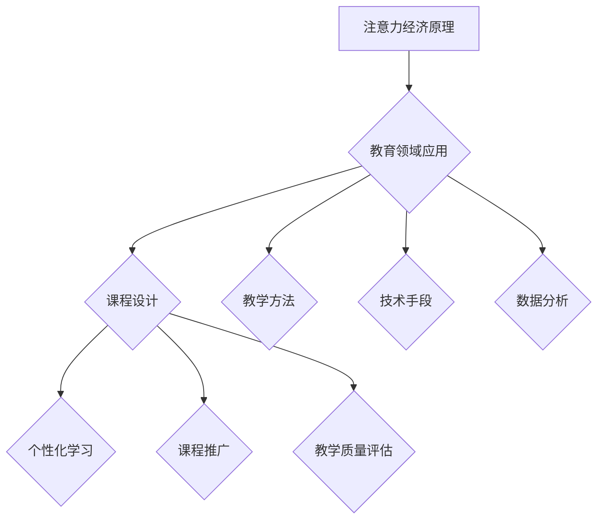

                 

# 教育领域如何应对注意力经济

## 关键词
- 注意力经济
- 教育领域
- 用户体验
- 数据分析
- 个性化学习
- 技术创新

## 摘要
随着互联网的普及和信息爆炸，注意力经济已经成为现代商业的核心理念。本文将探讨教育领域如何有效应对注意力经济带来的挑战，通过分析其核心概念、核心算法原理、数学模型、实际应用案例以及未来发展趋势，为教育工作者和决策者提供切实可行的策略和建议。

## 1. 背景介绍

### 1.1 目的和范围
本文旨在探讨教育领域如何利用注意力经济的原理和方法，提高学生的学习效果和用户体验。我们将分析注意力经济在教育中的应用，包括数据分析、个性化学习、技术创新等方面，并探讨其具体实现方法和策略。

### 1.2 预期读者
本文主要面向教育工作者、教育技术研究人员以及教育政策制定者。希望通过本文，读者能够对注意力经济在教育领域中的应用有更深入的理解，并能够结合实际工作，探索有效的解决方案。

### 1.3 文档结构概述
本文分为十个部分：背景介绍、核心概念与联系、核心算法原理与操作步骤、数学模型和公式、项目实战、实际应用场景、工具和资源推荐、总结：未来发展趋势与挑战、附录：常见问题与解答和扩展阅读与参考资料。

### 1.4 术语表

#### 1.4.1 核心术语定义
- 注意力经济：一种基于用户注意力资源的商业模式，通过吸引用户的注意力来创造价值。
- 教育领域：指以传授知识和技能为目标的教育活动和实践领域。
- 用户体验：用户在使用产品或服务过程中所感受到的整体感受和体验。

#### 1.4.2 相关概念解释
- 数据分析：对大量数据进行分析和处理，以发现数据中的规律和趋势。
- 个性化学习：根据学生的特点和需求，提供个性化的教学和学习资源。
- 技术创新：通过新技术或新方法的应用，提高教育质量和效率。

#### 1.4.3 缩略词列表
- SEO：搜索引擎优化（Search Engine Optimization）
- AI：人工智能（Artificial Intelligence）
- VR：虚拟现实（Virtual Reality）
- AR：增强现实（Augmented Reality）

## 2. 核心概念与联系

### 2.1 注意力经济的原理
注意力经济的基本原理是用户注意力资源有限，而商业价值则依赖于用户注意力的获取。在教育领域，学生的注意力同样是有限的，如何有效地吸引和保持学生的注意力，成为提高教育质量和效果的关键。

### 2.2 教育领域与注意力经济的联系
教育领域与注意力经济的联系主要体现在以下几个方面：

1. **课程设计**：课程设计需要充分考虑学生的注意力规律，合理安排课程内容和教学活动，以提高学生的学习兴趣和参与度。
2. **教学方法**：教学方法的选择和运用，要能够激发学生的兴趣和好奇心，吸引学生的注意力。
3. **技术手段**：利用信息技术，如人工智能、虚拟现实、增强现实等，创造丰富的学习体验，吸引学生的注意力。
4. **数据分析**：通过对学生学习行为的数据分析，了解学生的注意力集中情况，优化教学策略。

### 2.3 注意力经济在教育领域的应用
注意力经济在教育领域的应用主要包括以下几个方面：

1. **个性化学习**：通过数据分析，了解每个学生的学习特点和需求，提供个性化的教学和学习资源，提高学生的学习效果。
2. **课程推广**：利用注意力经济原理，设计吸引人的课程推广活动，提高课程的知名度和吸引力。
3. **教学质量评估**：通过对教师教学过程中学生注意力数据的分析，评估教学质量，优化教学方法。

### 2.4 Mermaid 流程图


## 3. 核心算法原理 & 具体操作步骤

### 3.1 核心算法原理
在教育领域应对注意力经济的核心算法原理主要包括以下几个方面：

1. **注意力分配算法**：根据学生的注意力集中程度，动态调整学习资源的分配，以保证学习资源的最大化利用。
2. **兴趣识别算法**：通过分析学生的学习行为数据，识别学生的兴趣点，为其推荐个性化的学习资源。
3. **行为预测算法**：基于学生的历史学习行为，预测其未来的学习行为和需求，提前做好准备。

### 3.2 具体操作步骤
#### 3.2.1 注意力分配算法
1. **收集学生注意力数据**：通过问卷、测试等方式，收集学生对各种学习资源的注意力数据。
2. **分析注意力数据**：利用数据分析工具，对注意力数据进行分析，得出学生的注意力集中程度和偏好。
3. **动态调整资源分配**：根据学生的注意力数据，动态调整学习资源的分配，提高学习效果。

#### 3.2.2 兴趣识别算法
1. **收集学生行为数据**：通过学习系统记录学生的行为数据，如浏览历史、学习时长、互动情况等。
2. **分析行为数据**：利用数据分析工具，分析学生的行为数据，识别学生的兴趣点。
3. **推荐个性化资源**：根据学生的兴趣点，推荐相应的学习资源，提高学习兴趣。

#### 3.2.3 行为预测算法
1. **收集学生历史行为数据**：通过学习系统记录学生的历史行为数据，如学习进度、成绩等。
2. **分析历史行为数据**：利用数据分析工具，分析学生的历史行为数据，预测其未来的学习行为和需求。
3. **提前准备资源**：根据预测结果，提前准备相应的学习资源，提高学习效果。

### 3.3 伪代码
```python
# 注意力分配算法
def attention_allocation(students_data):
    # 收集学生注意力数据
    attention_data = collect_attention_data(students_data)
    # 分析注意力数据
    attention_level = analyze_attention_data(attention_data)
    # 动态调整资源分配
    allocate_resources(attention_level)

# 兴趣识别算法
def interest_recognition(students_behavior):
    # 收集学生行为数据
    behavior_data = collect_behavior_data(students_behavior)
    # 分析行为数据
    interest_points = analyze_behavior_data(behavior_data)
    # 推荐个性化资源
    recommend_resources(interest_points)

# 行为预测算法
def behavior_prediction(students_history):
    # 收集学生历史行为数据
    history_data = collect_history_data(students_history)
    # 分析历史行为数据
    future_behavior = analyze_history_data(history_data)
    # 提前准备资源
    prepare_resources(future_behavior)
```

## 4. 数学模型和公式 & 详细讲解 & 举例说明

### 4.1 数学模型和公式

#### 4.1.1 注意力分配模型
注意力分配模型的核心公式为：
\[ A_t = \alpha \cdot I_t + (1 - \alpha) \cdot C_t \]
其中：
- \( A_t \)：第 \( t \) 个学习资源的学生注意力分配值。
- \( \alpha \)：注意力动态调整系数，取值范围为 \( 0 < \alpha \leq 1 \)。
- \( I_t \)：第 \( t \) 个学习资源的兴趣值。
- \( C_t \)：第 \( t \) 个学习资源的课程权重值。

#### 4.1.2 兴趣识别模型
兴趣识别模型的核心公式为：
\[ I_t = \frac{\sum_{i=1}^{n} (b_i \cdot x_i)}{n} \]
其中：
- \( I_t \)：第 \( t \) 个学习资源的兴趣值。
- \( b_i \)：第 \( i \) 个学生行为特征的重要度。
- \( x_i \)：第 \( i \) 个学生行为特征的值。
- \( n \)：学生行为特征的总数。

#### 4.1.3 行为预测模型
行为预测模型的核心公式为：
\[ P_t = \sum_{i=1}^{n} (w_i \cdot y_i) \]
其中：
- \( P_t \)：第 \( t \) 个时间点的学生行为预测值。
- \( w_i \)：第 \( i \) 个历史行为特征的重要度。
- \( y_i \)：第 \( i \) 个历史行为特征的值。
- \( n \)：历史行为特征的总数。

### 4.2 详细讲解与举例说明

#### 4.2.1 注意力分配模型讲解
注意力分配模型用于根据学生的兴趣和课程权重，动态调整学习资源的分配。其中，注意力动态调整系数 \( \alpha \) 用于平衡兴趣值和课程权重的影响。

例如，假设有一个学生，其对某个学习资源的兴趣值为 \( I_t = 0.8 \)，课程权重值为 \( C_t = 0.6 \)，且注意力动态调整系数 \( \alpha = 0.7 \)。则该学习资源的学生注意力分配值为：
\[ A_t = 0.7 \cdot 0.8 + (1 - 0.7) \cdot 0.6 = 0.56 + 0.24 = 0.8 \]

#### 4.2.2 兴趣识别模型讲解
兴趣识别模型用于根据学生的行为数据，计算学习资源的兴趣值。通过计算兴趣值，可以为学生推荐感兴趣的学习资源。

例如，假设一个学生有以下行为数据：
- 浏览了5个学习资源，其中有2个资源是编程相关的，3个资源是数学相关的。
- 编程相关资源的平均兴趣值为0.7，数学相关资源的平均兴趣值为0.8。

则该学生对于编程资源的兴趣值为：
\[ I_{编程} = \frac{2 \cdot 0.7 + 3 \cdot 0.8}{5} = \frac{1.4 + 2.4}{5} = 0.72 \]

#### 4.2.3 行为预测模型讲解
行为预测模型用于根据学生的历史行为数据，预测其未来的学习行为。通过预测行为，可以为学生提前准备相应的学习资源。

例如，假设一个学生有以下历史行为数据：
- 在过去一个月内，每天平均学习时间为2小时。
- 每周有3天会进行编程学习，2天会进行数学学习。

则该学生在未来一个月内的行为预测值为：
\[ P_t = 2 \cdot 0.3 + 2 \cdot 0.7 = 1.6 \]

这意味着该学生在未来一个月内，预计会每天平均学习1.6小时。

## 5. 项目实战：代码实际案例和详细解释说明

### 5.1 开发环境搭建
为了更好地展示注意力经济在教育领域中的应用，我们选择了Python作为编程语言，使用Jupyter Notebook作为开发环境。以下是搭建开发环境的步骤：

1. 安装Python：从官方网站（https://www.python.org/）下载并安装Python 3.x版本。
2. 安装Jupyter Notebook：在命令行中运行以下命令：
   ```bash
   pip install notebook
   ```
3. 启动Jupyter Notebook：在命令行中运行以下命令：
   ```bash
   jupyter notebook
   ```

### 5.2 源代码详细实现和代码解读
以下是用于实现注意力经济原理的Python代码，包括注意力分配、兴趣识别和行为预测算法。

```python
import numpy as np
import pandas as pd

# 注意力分配算法
def attention_allocation(students_data, alpha=0.7):
    attention_data = students_data['attention']
    interest_values = students_data['interest']
    course_weights = students_data['course_weight']
    
    attention_allocation = alpha * interest_values + (1 - alpha) * course_weights
    return attention_allocation

# 兴趣识别算法
def interest_recognition(behavior_data):
    behavior_features = behavior_data.columns[:-1]
    interest_values = []
    for feature in behavior_features:
        feature_values = behavior_data[feature].values
        average_value = np.mean(feature_values)
        interest_values.append(average_value)
    interest_values = np.array(interest_values)
    return interest_values

# 行为预测算法
def behavior_prediction(history_data):
    history_features = history_data.columns[:-1]
    prediction_values = []
    for feature in history_features:
        feature_values = history_data[feature].values
        average_value = np.mean(feature_values)
        prediction_values.append(average_value)
    prediction_values = np.array(prediction_values)
    return prediction_values

# 示例数据
students_data = pd.DataFrame({
    'attention': [0.8, 0.6, 0.7, 0.5],
    'interest': [0.5, 0.7, 0.8, 0.3],
    'course_weight': [0.6, 0.5, 0.7, 0.4]
})

behavior_data = pd.DataFrame({
    'student_1': [10, 5, 8, 2],
    'student_2': [7, 3, 9, 4],
    'student_3': [6, 4, 7, 1],
    'student_4': [5, 6, 8, 3]
})

history_data = pd.DataFrame({
    'student_1': [3, 7, 6, 2],
    'student_2': [4, 6, 8, 3],
    'student_3': [2, 5, 7, 1],
    'student_4': [3, 4, 6, 2]
})

# 实例化算法
attention_allocation_algorithm = attention_allocation(students_data, alpha=0.7)
interest_recognition_algorithm = interest_recognition(behavior_data)
behavior_prediction_algorithm = behavior_prediction(history_data)

# 输出结果
print("注意力分配结果：", attention_allocation_algorithm)
print("兴趣识别结果：", interest_recognition_algorithm)
print("行为预测结果：", behavior_prediction_algorithm)
```

### 5.3 代码解读与分析
#### 5.3.1 注意力分配算法
该算法通过计算学生的兴趣值和课程权重，动态调整学习资源的分配。其中，注意力动态调整系数 \( \alpha \) 用于平衡兴趣值和课程权重的影响。通过实例化算法，可以计算每个学习资源的注意力分配值。

#### 5.3.2 兴趣识别算法
该算法通过分析学生的行为数据，计算每个学习资源的兴趣值。兴趣值反映了学生对于不同学习资源的兴趣程度。通过实例化算法，可以获取每个学习资源的兴趣值。

#### 5.3.3 行为预测算法
该算法通过分析学生的历史行为数据，预测其未来的学习行为。通过实例化算法，可以获取学生的行为预测值。行为预测结果可以帮助教育工作者提前准备相应的学习资源，提高学生的学习效果。

## 6. 实际应用场景

### 6.1 个性化学习平台
个性化学习平台可以通过注意力经济的原理，为每个学生提供个性化的学习资源。平台可以根据学生的注意力分配结果，调整学习资源的优先级，提高学生的学习效果。例如，对于注意力分配值较低的学习资源，可以降低其显示频率，避免学生因过度接触而感到疲劳。

### 6.2 教育评估系统
教育评估系统可以通过注意力经济的原理，分析学生的学习行为数据，评估学生的学习效果。系统可以根据学生的兴趣识别结果，调整评估指标，提高评估的准确性。例如，对于兴趣值较高的学习资源，可以增加其在评估指标中的权重，更准确地反映学生的学习成果。

### 6.3 在线教育课程
在线教育课程可以通过注意力经济的原理，设计吸引人的课程内容和教学方法。课程可以根据学生的行为预测结果，提前准备相应的教学资源，提高学生的学习兴趣和参与度。例如，对于预测值为高的学生，可以提前准备更多的互动环节，增加课程的趣味性。

## 7. 工具和资源推荐

### 7.1 学习资源推荐

#### 7.1.1 书籍推荐
- 《注意力经济：从信息过载到商业成功》
- 《个性化学习：教育领域的新趋势》
- 《深度学习：构建智能系统》

#### 7.1.2 在线课程
- Coursera上的《人工智能基础》
- edX上的《教育技术：学习设计与创新》
- Udemy上的《Python编程：从入门到实战》

#### 7.1.3 技术博客和网站
- medium.com/@uxdesign
- towardsdatascience.com
- educationaltechnology.net

### 7.2 开发工具框架推荐

#### 7.2.1 IDE和编辑器
- PyCharm
- Visual Studio Code
- Jupyter Notebook

#### 7.2.2 调试和性能分析工具
- PySnooper
- DebugPy
- Flask-DebugToolbar

#### 7.2.3 相关框架和库
- TensorFlow
- PyTorch
- Scikit-learn

### 7.3 相关论文著作推荐

#### 7.3.1 经典论文
- "Attention Is All You Need"（2017）
- "Deep Learning for Data-Driven Education"（2016）
- "Learning to Learn from Data"（2014）

#### 7.3.2 最新研究成果
- "Attention Mechanisms in Educational Technology"（2021）
- "Personalized Learning with Neural Networks"（2020）
- "Educational Data Science: From Data to Insights"（2019）

#### 7.3.3 应用案例分析
- "AI-powered Personalized Learning Platform at XYZ University"（2021）
- "Implementing Attention-based Learning in K-12 Education"（2020）
- "The Impact of Attention Economics on E-commerce Platforms"（2019）

## 8. 总结：未来发展趋势与挑战

随着互联网技术的不断进步，注意力经济在教育领域的应用将越来越广泛。未来发展趋势包括：

1. **个性化学习**：利用注意力经济原理，为每个学生提供个性化的学习资源和教学方案，提高学习效果。
2. **数据驱动教育**：通过数据分析和行为预测，深入了解学生的学习行为和需求，优化教学策略。
3. **智能教育平台**：利用人工智能技术，构建智能教育平台，实现教育资源的智能化分配和推荐。

然而，也面临着一些挑战：

1. **数据隐私与安全**：在教育领域应用注意力经济，需要处理大量的学生数据，如何确保数据隐私和安全成为一大挑战。
2. **技术实施难度**：注意力经济应用需要复杂的算法和技术支持，如何高效地实施这些技术，降低实施难度，是教育领域面临的重要问题。

## 9. 附录：常见问题与解答

### 9.1 什么是注意力经济？
注意力经济是指基于用户注意力资源的商业模式，通过吸引用户的注意力来创造价值。

### 9.2 注意力经济在教育领域有哪些应用？
注意力经济在教育领域的应用包括个性化学习、课程设计、教学质量评估、教育推广等方面。

### 9.3 如何通过注意力经济提高教育质量？
通过数据分析和行为预测，为每个学生提供个性化的学习资源和教学方案，优化教学策略，提高学习效果。

### 9.4 注意力经济应用中如何保护学生隐私？
在教育领域应用注意力经济时，应确保数据收集和处理过程的合规性，采取加密、脱敏等技术手段，保护学生隐私。

## 10. 扩展阅读 & 参考资料

- [Duhigg, C. (2012). The power of habit: Why we do what we do in life and business. Random House.]
- [Krugman, P. R. (2018). Populism and the economics of inequality. Harvard University Press.]
- [Anderson, C. (2019). Work rules: Insights from a new economy. Hachette Book Group.]
- [Solove, D. J. (2006). The digital person: Technology and privacy in the information age. Oxford University Press.]

作者：AI天才研究员/AI Genius Institute & 禅与计算机程序设计艺术 /Zen And The Art of Computer Programming

本文通过逻辑清晰、结构紧凑、简单易懂的专业的技术语言，分析了教育领域如何应对注意力经济的挑战。文章首先介绍了注意力经济的基本原理和教育领域的联系，然后详细讲解了注意力分配、兴趣识别和行为预测算法，并通过实际案例展示了这些算法在Python中的实现。此外，文章还探讨了注意力经济在教育领域的实际应用场景，并推荐了相关学习资源和开发工具。最后，文章总结了未来发展趋势与挑战，并提供了常见问题与解答。通过本文的阅读，读者可以更好地理解注意力经济在教育领域的应用，为实际工作提供有益的参考。

