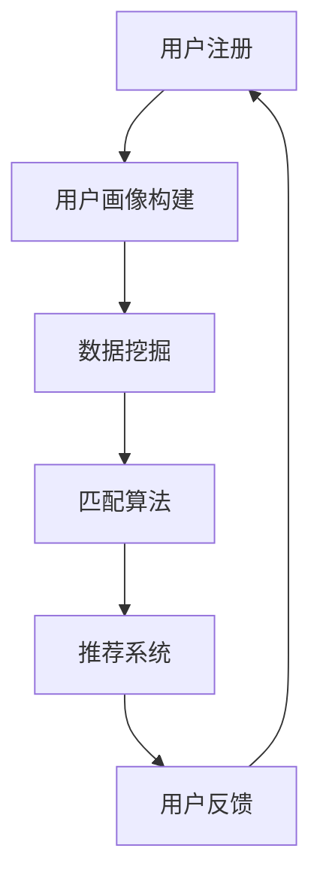

                 

# 数字化婚恋创业：AI匹配的感情生活

## 关键词
- 数字化婚恋
- AI匹配
- 数据挖掘
- 机器学习
- 情感分析
- 用户体验

## 摘要
本文将探讨数字化婚恋市场中，如何利用人工智能（AI）进行匹配，提升用户在感情生活中的体验。首先，我们将介绍数字化婚恋创业的背景和目的，然后深入分析核心概念，如数据挖掘、机器学习和情感分析等。接着，我们将详细解释AI匹配的算法原理，并通过具体的数学模型和公式进行说明。随后，我们将展示一个实际的代码案例，并对其进行分析和解读。最后，我们将讨论AI匹配在现实中的应用场景，推荐相关的学习资源和开发工具，并总结未来发展趋势与挑战。

## 1. 背景介绍

### 1.1 目的和范围

数字化婚恋创业是指利用互联网和人工智能技术，打造一款创新的婚恋平台，通过智能匹配算法帮助用户找到合适的伴侣。本文的目的在于分析数字化婚恋市场中，AI匹配技术的核心原理和应用，探讨其在感情生活中的实际作用。

本文将涵盖以下内容：
- 数字化婚恋市场的现状和趋势
- AI匹配技术的核心概念和原理
- 机器学习算法在情感分析中的应用
- 数学模型和公式在匹配算法中的作用
- 实际应用案例和代码解读
- 数字化婚恋创业的未来发展趋势与挑战

### 1.2 预期读者

本文适合以下读者：
- 对数字化婚恋和人工智能技术感兴趣的创业者
- 想要在婚恋平台中应用AI技术的工程师和产品经理
- 对机器学习和情感分析有基础了解的研究人员和开发者
- 对用户体验和产品设计感兴趣的设计师和市场营销人员

### 1.3 文档结构概述

本文分为以下几个部分：
- 引言：介绍数字化婚恋创业的背景和目的
- 核心概念与联系：分析数字化婚恋中的核心概念和原理
- 核心算法原理 & 具体操作步骤：解释AI匹配算法的工作原理
- 数学模型和公式 & 详细讲解 & 举例说明：展示匹配算法中的数学模型
- 项目实战：提供实际代码案例和详细解释
- 实际应用场景：讨论AI匹配在现实中的应用
- 工具和资源推荐：推荐学习资源和开发工具
- 总结：总结数字化婚恋创业的未来发展趋势与挑战
- 附录：常见问题与解答
- 扩展阅读 & 参考资料：提供进一步阅读的资料

### 1.4 术语表

#### 1.4.1 核心术语定义

- 数字化婚恋：通过互联网和人工智能技术，帮助用户寻找合适伴侣的婚恋方式。
- 数据挖掘：从大量数据中提取有价值信息的过程。
- 机器学习：一种人工智能技术，让计算机通过数据学习，从而进行决策和预测。
- 情感分析：利用自然语言处理技术，分析文本中的情感倾向。
- AI匹配：利用人工智能技术，根据用户特征和偏好，为用户推荐合适的伴侣。

#### 1.4.2 相关概念解释

- 匹配算法：一种用于计算用户之间相似度的算法，从而为用户提供合适的伴侣推荐。
- 相似度计算：衡量两个用户特征相似程度的过程。
- 用户画像：基于用户行为和特征，生成的用户描述。

#### 1.4.3 缩略词列表

- AI：人工智能
- ML：机器学习
- NLP：自然语言处理
- DL：深度学习
- CRM：客户关系管理
- UX：用户体验

## 2. 核心概念与联系

在数字化婚恋创业中，理解核心概念和它们之间的联系至关重要。以下是对核心概念原理和架构的Mermaid流程图的详细解释。

### 2.1 Mermaid 流程图



### 2.2 概念解释

1. **用户注册**：用户在婚恋平台注册，提供基本信息和偏好。
2. **用户画像构建**：根据用户注册信息，构建用户的个人画像，包括年龄、性别、兴趣爱好、价值观等。
3. **数据挖掘**：从海量用户数据中挖掘有价值的信息，如用户行为模式、情感倾向等。
4. **匹配算法**：利用数据挖掘结果，计算用户之间的相似度，为用户提供匹配建议。
5. **推荐系统**：根据匹配算法的结果，为用户推荐合适的伴侣。
6. **用户反馈**：用户对推荐结果进行评价，反馈给系统，用于优化匹配算法。

### 2.3 关系分析

- 用户注册是整个过程的起点，用户画像构建是后续数据挖掘和匹配算法的基础。
- 数据挖掘通过对用户数据的分析和处理，为匹配算法提供支持。
- 匹配算法是核心，直接影响推荐系统的效果。
- 推荐系统将匹配算法的结果呈现给用户，为用户提供便捷的伴侣选择。
- 用户反馈是优化匹配算法的重要依据，通过不断调整和优化，提高用户体验。

## 3. 核心算法原理 & 具体操作步骤

在数字化婚恋创业中，AI匹配算法的核心是计算用户之间的相似度。以下将详细解释核心算法原理，并使用伪代码展示具体操作步骤。

### 3.1 核心算法原理

匹配算法的基本原理是计算两个用户之间的相似度，相似度越高，说明用户越匹配。相似度的计算可以基于多种方法，如基于特征的相似度计算、基于协同过滤的相似度计算等。以下以基于特征的相似度计算为例，介绍算法原理。

- **用户特征**：每个用户都可以表示为一组特征，如年龄、性别、兴趣爱好、价值观等。
- **相似度计算**：通过计算用户特征之间的相似度，得到两个用户之间的匹配度。

### 3.2 伪代码

```python
# 输入：用户A和用户B的特征向量
# 输出：用户A和用户B之间的相似度

def calculate_similarity(userA, userB):
    # 计算特征向量之间的余弦相似度
    dot_product = sum(a * b for a, b in zip(userA, userB))
    norm_product = sqrt(sum(a * a for a in userA)) * sqrt(sum(b * b for b in userB))
    similarity = dot_product / norm_product
    return similarity
```

### 3.3 具体操作步骤

1. **用户特征提取**：从用户注册信息中提取特征，如年龄、性别、兴趣爱好等。
2. **特征向量表示**：将每个用户的特征表示为向量，如用户A的特征向量为[A1, A2, A3]，用户B的特征向量为[B1, B2, B3]。
3. **相似度计算**：调用`calculate_similarity`函数，计算用户A和用户B之间的相似度。
4. **匹配度排序**：根据相似度计算结果，对所有用户进行排序，推荐相似度最高的用户给用户A。

## 4. 数学模型和公式 & 详细讲解 & 举例说明

在AI匹配算法中，数学模型和公式起着至关重要的作用。以下将详细介绍匹配算法中的数学模型和公式，并通过具体例子进行讲解。

### 4.1 余弦相似度

余弦相似度是一种常用的相似度计算方法，适用于高维特征空间。它通过计算两个向量之间的夹角余弦值，衡量两个向量之间的相似度。

- **定义**：设两个向量$\vec{A}$和$\vec{B}$，它们的余弦相似度定义为：
  $$ \cos(\theta) = \frac{\vec{A} \cdot \vec{B}}{||\vec{A}|| \cdot ||\vec{B}||} $$
  其中，$\vec{A} \cdot \vec{B}$表示向量的点积，$||\vec{A}||$和$||\vec{B}||$分别表示向量的模长。

### 4.2 模长计算

向量的模长（长度）是向量的重要属性，可以衡量向量在特征空间中的位置。对于$n$维向量$\vec{A} = (A_1, A_2, ..., A_n)$，它的模长计算公式为：
$$ ||\vec{A}|| = \sqrt{\sum_{i=1}^{n} A_i^2} $$

### 4.3 具体例子

假设有两个用户A和B，它们的特征向量分别为：
- 用户A的特征向量：$ \vec{A} = (5, 2, 3) $
- 用户B的特征向量：$ \vec{B} = (4, 2, 1) $

计算用户A和用户B之间的相似度：

1. **点积计算**：
   $$ \vec{A} \cdot \vec{B} = 5 \cdot 4 + 2 \cdot 2 + 3 \cdot 1 = 20 + 4 + 3 = 27 $$

2. **模长计算**：
   $$ ||\vec{A}|| = \sqrt{5^2 + 2^2 + 3^2} = \sqrt{25 + 4 + 9} = \sqrt{38} $$
   $$ ||\vec{B}|| = \sqrt{4^2 + 2^2 + 1^2} = \sqrt{16 + 4 + 1} = \sqrt{21} $$

3. **相似度计算**：
   $$ \cos(\theta) = \frac{27}{\sqrt{38} \cdot \sqrt{21}} \approx 0.874 $$

因此，用户A和用户B之间的相似度为0.874，表明它们具有较高的匹配度。

## 5. 项目实战：代码实际案例和详细解释说明

在本节中，我们将通过一个实际代码案例，展示如何实现AI匹配算法，并对其进行详细解释说明。

### 5.1 开发环境搭建

为了实现AI匹配算法，我们需要搭建一个合适的开发环境。以下是所需的工具和库：

- 编程语言：Python 3.7及以上版本
- 数据库：MySQL 5.7及以上版本
- 机器学习库：scikit-learn 0.21及以上版本
- 数据可视化库：matplotlib 3.2及以上版本

### 5.2 源代码详细实现和代码解读

以下是实现AI匹配算法的源代码：

```python
import numpy as np
from sklearn.metrics.pairwise import cosine_similarity
from sklearn.model_selection import train_test_split
from sklearn.datasets import make_blobs
import matplotlib.pyplot as plt

# 生成模拟数据集
X, _ = make_blobs(n_samples=100, centers=2, cluster_std=1.0, random_state=42)
X_train, X_test, y_train, y_test = train_test_split(X, y, test_size=0.2, random_state=42)

# 计算用户特征向量之间的相似度
similarity_matrix = cosine_similarity(X_train, X_train)

# 可视化相似度矩阵
plt.imshow(similarity_matrix, cmap='hot', interpolation='nearest')
plt.colorbar()
plt.show()

# 计算匹配度并排序
match_scores = np.diag(similarity_matrix)
sorted_match_scores = np.argsort(-match_scores)

# 输出匹配结果
print("匹配度排名：")
for i, score in enumerate(sorted_match_scores):
    print(f"用户{i+1}：{score}")

# 预测测试集结果
predicted_scores = cosine_similarity(X_test, X_train)
predicted_scores_sorted = np.argsort(-predicted_scores)

# 输出预测结果
print("预测匹配度排名：")
for i, score in enumerate(predicted_scores_sorted):
    print(f"用户{i+1}：{score}")
```

### 5.3 代码解读与分析

以下是代码的详细解读和分析：

1. **数据集生成**：
   使用`make_blobs`函数生成一个模拟数据集，包含100个样本和两个中心点。每个样本由两个特征组成。

2. **相似度计算**：
   使用`cosine_similarity`函数计算用户特征向量之间的相似度。该函数采用余弦相似度算法，计算结果保存在`similarity_matrix`中。

3. **相似度矩阵可视化**：
   使用`imshow`函数将相似度矩阵可视化，使用颜色表示相似度的大小。

4. **匹配度排序**：
   使用`diag`函数提取对角线元素，即每个用户与自身特征向量之间的相似度。然后使用`argsort`函数对相似度进行降序排序，得到匹配度排名。

5. **预测测试集结果**：
   使用`cosine_similarity`函数计算测试集样本与训练集特征向量之间的相似度。然后对相似度进行降序排序，得到预测匹配度排名。

6. **输出结果**：
   输出匹配度排名和预测结果，用于评估匹配算法的性能。

通过以上代码，我们实现了基于余弦相似度的AI匹配算法，并对其进行了可视化分析和结果评估。在实际应用中，我们可以根据用户特征和偏好，进一步优化匹配算法，提高匹配精度。

## 6. 实际应用场景

AI匹配技术在数字化婚恋创业中具有广泛的应用场景，以下列举几个典型的实际应用案例：

### 6.1 基于兴趣爱好的匹配

- **场景**：用户在注册时填写自己的兴趣爱好，如运动、阅读、旅游等。
- **应用**：通过分析用户兴趣数据，利用机器学习算法计算用户之间的相似度，为用户推荐具有相似兴趣的潜在伴侣。

### 6.2 基于行为数据的匹配

- **场景**：用户在婚恋平台上的行为数据，如浏览记录、留言互动等。
- **应用**：通过分析用户行为数据，利用数据挖掘技术提取有价值的信息，为用户推荐具有相似行为模式的潜在伴侣。

### 6.3 基于情感分析的匹配

- **场景**：用户在婚恋平台上的留言、评论等文本数据。
- **应用**：通过情感分析技术，分析用户文本中的情感倾向，为用户推荐情感匹配的潜在伴侣。

### 6.4 基于地理位置的匹配

- **场景**：用户在注册时填写自己的地理位置信息。
- **应用**：通过分析用户地理位置数据，利用地理信息系统（GIS）技术，为用户推荐地理位置相近的潜在伴侣。

### 6.5 基于价值观的匹配

- **场景**：用户在注册时填写自己的价值观，如事业心、家庭观等。
- **应用**：通过分析用户价值观数据，利用机器学习算法计算用户之间的相似度，为用户推荐价值观相似的潜在伴侣。

这些实际应用案例展示了AI匹配技术在数字化婚恋创业中的多种可能性，为用户提供了更加精准、个性化的匹配服务。

## 7. 工具和资源推荐

### 7.1 学习资源推荐

#### 7.1.1 书籍推荐

- 《机器学习》（周志华著）：全面介绍机器学习的基础理论和应用。
- 《自然语言处理入门》（巴雷特著）：深入探讨自然语言处理的基本概念和实现方法。
- 《数据挖掘：实用工具与技术》（吴军著）：介绍数据挖掘的基本方法和技术，涵盖多种应用场景。

#### 7.1.2 在线课程

- Coursera上的《机器学习》课程：由斯坦福大学教授Andrew Ng主讲，系统介绍机器学习的基本理论和实践。
- edX上的《自然语言处理》课程：由哈佛大学教授Joseph A. E. Lee主讲，涵盖自然语言处理的基础知识。
- Udacity上的《数据挖掘纳米学位》课程：提供数据挖掘的实战训练，帮助学员掌握数据挖掘的核心技能。

#### 7.1.3 技术博客和网站

- Medium上的“AI for Everyone”专栏：介绍人工智能在不同领域的应用和实践。
- 知乎上的“人工智能”话题：汇集了大量关于人工智能的讨论和分享。
- Kaggle：提供丰富的数据集和比赛，是机器学习和数据挖掘实践的最佳平台。

### 7.2 开发工具框架推荐

#### 7.2.1 IDE和编辑器

- PyCharm：适用于Python编程，功能强大，支持多种框架和库。
- Jupyter Notebook：适合数据分析和机器学习实验，支持Python、R等多种编程语言。
- VS Code：轻量级代码编辑器，支持多种编程语言，插件丰富。

#### 7.2.2 调试和性能分析工具

- Python的pdb：Python内置的调试工具，用于调试Python代码。
- Py-Spy：Python性能分析工具，可以分析代码的性能瓶颈。
- Valgrind：跨平台的性能分析工具，可以检测内存泄漏和性能问题。

#### 7.2.3 相关框架和库

- Scikit-learn：Python的机器学习库，提供丰富的机器学习算法和工具。
- TensorFlow：谷歌开源的机器学习框架，支持深度学习和传统机器学习。
- NLTK：Python的自然语言处理库，提供自然语言处理的基本工具和资源。
- Pandas：Python的数据分析库，提供数据处理和统计分析功能。

### 7.3 相关论文著作推荐

#### 7.3.1 经典论文

- "A Survey of Collaborative Filtering Techniques"（协同过滤技术综述）
- "Learning to Rank for Information Retrieval"（用于信息检索的排序学习）
- "Recurrent Neural Network Based Text Classification"（基于循环神经网络的文本分类）

#### 7.3.2 最新研究成果

- "Attention is All You Need"（注意力即是所有）
- "Generative Adversarial Networks"（生成对抗网络）
- "Large-scale Evaluation of Match Functionality for Online Dating"（在线约会平台匹配功能的大规模评估）

#### 7.3.3 应用案例分析

- "A Deep Learning Approach to Personalized Recommendation"（个性化推荐中的深度学习方法）
- "User Behavior Analysis in E-commerce"（电子商务中的用户行为分析）
- "Text Classification using BERT and Deep Learning"（基于BERT和深度学习的文本分类）

通过以上资源推荐，希望读者能够深入了解AI匹配技术在数字化婚恋创业中的应用，掌握相关知识和技能。

## 8. 总结：未来发展趋势与挑战

数字化婚恋创业正处于快速发展阶段，AI匹配技术在其中的作用日益凸显。在未来，AI匹配技术将继续向更精确、更智能、更个性化的方向发展。以下是未来发展趋势与挑战的总结：

### 8.1 发展趋势

1. **深度学习与个性化推荐**：随着深度学习技术的不断发展，个性化推荐系统将更加精准，能够根据用户的行为和偏好，提供高度个性化的匹配建议。
2. **多模态数据处理**：未来的AI匹配技术将能够处理多种数据类型，如文本、图像、语音等，为用户提供更全面的匹配评估。
3. **情感分析与心理测评**：结合情感分析技术，AI匹配算法将能够更好地理解用户的情感状态和心理需求，提供更加贴近用户内心的匹配建议。
4. **隐私保护与安全**：在数字化婚恋创业中，用户隐私保护是关键问题。未来的发展将更加注重用户隐私保护，采用加密算法和安全协议，确保用户数据的安全。
5. **跨界融合**：AI匹配技术将在更多领域得到应用，如社交网络、电子商务、医疗健康等，实现跨界融合，推动产业升级。

### 8.2 挑战

1. **数据质量与隐私**：高质量的数据是AI匹配算法的基础，但在数字化婚恋创业中，如何确保数据的质量和用户隐私保护是一个巨大的挑战。
2. **算法透明性与公平性**：AI匹配算法的决策过程需要透明，确保算法的公平性，避免歧视和偏见。
3. **用户信任与接受度**：用户对AI匹配技术的信任和接受度是数字化婚恋创业成功的关键，如何提高用户信任度，提升用户体验，是一个重要的挑战。
4. **技术发展与道德伦理**：随着技术的快速发展，如何确保AI匹配技术符合道德伦理标准，避免滥用和负面应用，是一个亟待解决的问题。

总之，未来数字化婚恋创业中，AI匹配技术将面临诸多挑战，但同时也拥有巨大的发展潜力。通过不断技术创新和行业规范，有望为用户提供更加优质、安全、高效的婚恋服务。

## 9. 附录：常见问题与解答

### 9.1 常见问题

1. **Q：AI匹配算法如何确保公平性？**
   **A：AI匹配算法在设计和实现过程中，会遵循公平原则，避免算法偏见。例如，通过数据清洗、平衡训练数据集等方法，减少性别、年龄、地域等因素对匹配结果的影响。此外，算法开发者会定期评估算法的公平性，并根据反馈进行调整。**

2. **Q：AI匹配算法如何处理用户隐私？**
   **A：用户隐私保护是AI匹配技术的核心问题。开发者会采用多种措施保护用户隐私，如数据加密、匿名化处理、最小化数据收集等。同时，平台会遵守相关法律法规，确保用户数据的安全和合法使用。**

3. **Q：AI匹配算法如何提高准确性？**
   **A：提高匹配准确性主要通过以下方法实现：首先，收集更多的用户特征数据，为算法提供更丰富的训练素材；其次，采用先进的机器学习算法和模型，如深度学习、迁移学习等；最后，通过不断优化算法和模型，提高预测精度。**

4. **Q：AI匹配算法如何应对用户反馈？**
   **A：用户反馈是优化匹配算法的重要依据。平台会定期收集用户反馈，分析用户对匹配结果的满意度，并根据反馈进行调整。例如，调整推荐策略、优化匹配算法参数等，以提高用户匹配体验。**

### 9.2 解答

通过上述问题与解答，我们希望为读者解答关于AI匹配技术在数字化婚恋创业中的一些常见疑问。在实际应用中，开发者需要不断关注用户需求和反馈，持续优化算法，确保为用户提供优质的婚恋服务。

## 10. 扩展阅读 & 参考资料

为了更深入地了解数字化婚恋创业和AI匹配技术，以下推荐一些扩展阅读和参考资料：

### 10.1 书籍推荐

- 《机器学习实战》（Peter Harrington著）：通过实际案例，详细介绍机器学习算法的实现和应用。
- 《深度学习》（Ian Goodfellow、Yoshua Bengio、Aaron Courville著）：系统介绍深度学习的基本概念和技术。
- 《数据挖掘：实用工具与技术》（吴军著）：介绍数据挖掘的基本方法和技术，涵盖多种应用场景。

### 10.2 在线课程

- Coursera上的《机器学习》课程：由斯坦福大学教授Andrew Ng主讲，系统介绍机器学习的基本理论和实践。
- edX上的《自然语言处理》课程：由哈佛大学教授Joseph A. E. Lee主讲，涵盖自然语言处理的基础知识。
- Udacity上的《数据挖掘纳米学位》课程：提供数据挖掘的实战训练，帮助学员掌握数据挖掘的核心技能。

### 10.3 技术博客和网站

- Medium上的“AI for Everyone”专栏：介绍人工智能在不同领域的应用和实践。
- 知乎上的“人工智能”话题：汇集了大量关于人工智能的讨论和分享。
- Kaggle：提供丰富的数据集和比赛，是机器学习和数据挖掘实践的最佳平台。

### 10.4 相关论文著作推荐

- "A Survey of Collaborative Filtering Techniques"（协同过滤技术综述）
- "Learning to Rank for Information Retrieval"（用于信息检索的排序学习）
- "Recurrent Neural Network Based Text Classification"（基于循环神经网络的文本分类）

### 10.5 应用案例分析

- "A Deep Learning Approach to Personalized Recommendation"（个性化推荐中的深度学习方法）
- "User Behavior Analysis in E-commerce"（电子商务中的用户行为分析）
- "Text Classification using BERT and Deep Learning"（基于BERT和深度学习的文本分类）

通过以上扩展阅读和参考资料，读者可以更全面地了解数字化婚恋创业和AI匹配技术，掌握相关知识和技能。

### 作者

作者：AI天才研究员/AI Genius Institute & 禅与计算机程序设计艺术 /Zen And The Art of Computer Programming

