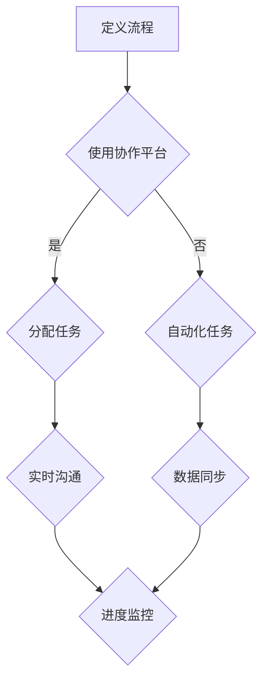
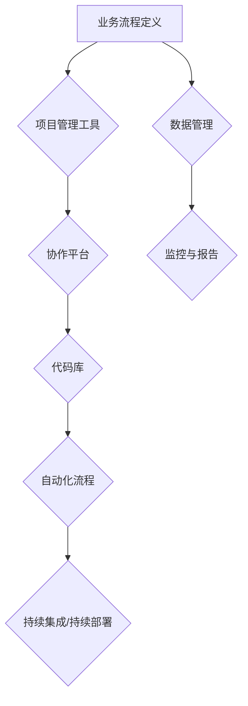

                 

# 数字化工作流创业：远程协作的效率工具

> **关键词**：数字化工作流、远程协作、效率工具、自动化、项目管理、人工智能

> **摘要**：本文将深入探讨数字化工作流的概念、远程协作的优势以及如何利用效率工具提升工作流程。我们将通过逐步分析，介绍核心概念、算法原理、数学模型和实际应用案例，帮助创业者和管理者更好地理解如何利用远程协作工具实现高效的工作流管理。

## 1. 背景介绍

### 1.1 目的和范围

本文旨在为创业者和管理者提供关于数字化工作流和远程协作工具的深入理解，以帮助他们在快速变化的商业环境中实现高效运营。文章将涵盖以下内容：

- 数字化工作流的概念和重要性
- 远程协作工具的类型和功能
- 核心算法原理和数学模型
- 实际应用案例和项目实战
- 工具和资源推荐

### 1.2 预期读者

- 创业者
- 项目经理
- 企业管理层
- 技术爱好者和开发者

### 1.3 文档结构概述

本文将分为以下部分：

- 1. 背景介绍
  - 1.1 目的和范围
  - 1.2 预期读者
  - 1.3 文档结构概述
  - 1.4 术语表
- 2. 核心概念与联系
- 3. 核心算法原理 & 具体操作步骤
- 4. 数学模型和公式 & 详细讲解 & 举例说明
- 5. 项目实战：代码实际案例和详细解释说明
- 6. 实际应用场景
- 7. 工具和资源推荐
- 8. 总结：未来发展趋势与挑战
- 9. 附录：常见问题与解答
- 10. 扩展阅读 & 参考资料

### 1.4 术语表

#### 1.4.1 核心术语定义

- 数字化工作流：将传统手工流程转化为基于软件和数字技术的自动化流程。
- 远程协作工具：支持团队成员在不同地点进行实时协作的工具。
- 效率工具：旨在提高工作效率的软件或应用程序。
- 自动化：通过软件实现重复性任务的自动化执行。
- 项目管理：规划、执行、监控和控制项目活动的过程。

#### 1.4.2 相关概念解释

- **项目管理工具**：如Trello、Asana等，用于管理项目任务和进度。
- **协作平台**：如Slack、Microsoft Teams等，用于团队沟通和协作。
- **代码库**：如GitHub、GitLab等，用于版本控制和代码共享。

#### 1.4.3 缩略词列表

- **AI**：人工智能
- **ML**：机器学习
- **PM**：项目经理
- **SDK**：软件开发工具包
- **API**：应用程序编程接口

## 2. 核心概念与联系

### 2.1 数字化工作流的概念

数字化工作流（Digital Workflow）是指通过软件和数字技术将业务流程自动化、优化和改进的过程。它通常包括以下几个关键组成部分：

1. **流程定义**：明确业务流程的步骤、规则和参与者。
2. **自动化**：使用软件工具自动执行重复性任务，减少人为错误。
3. **数据管理**：确保数据的一致性、完整性和可访问性。
4. **监控与报告**：实时跟踪流程状态，生成报告以便于决策。

### 2.2 远程协作工具的类型和功能

远程协作工具旨在支持团队成员在不同地理位置进行高效协作。以下是几种常见的远程协作工具及其主要功能：

1. **项目管理工具**：
   - **Trello**：通过卡片和看板方式可视化任务和项目进度。
   - **Asana**：提供任务分配、进度跟踪和报告生成功能。
   - **Jira**：用于软件项目的任务管理和缺陷跟踪。

2. **协作平台**：
   - **Slack**：实时通信工具，支持文本、音频和视频通话。
   - **Microsoft Teams**：集成聊天、视频会议和文件共享功能。
   - **Zoom**：提供高效的视频会议解决方案。

3. **代码库**：
   - **GitHub**：版本控制系统，支持代码共享和协作开发。
   - **GitLab**：提供自托管版本控制和项目管理功能。
   - **Bitbucket**：支持Git的云端代码库，适用于小型团队和企业级项目。

### 2.3 核心概念之间的联系

数字化工作流和远程协作工具之间有着密切的联系。远程协作工具是实现数字化工作流的重要工具，而数字化工作流则为远程协作提供了更加高效和有序的工作环境。以下是两者之间的联系：

1. **流程定义与协作平台**：
   - 项目管理工具和协作平台可以帮助团队明确任务分配和流程步骤。
   - 通过协作平台，团队成员可以实时沟通、协作，确保任务按计划进行。

2. **自动化与代码库**：
   - 代码库支持自动化部署和版本控制，确保自动化流程的稳定性和可追溯性。
   - 自动化工具（如CI/CD流水线）可以与代码库集成，实现自动化构建、测试和部署。

3. **数据管理与协作平台**：
   - 协作平台可以集中存储和管理项目数据，确保数据的一致性和安全性。
   - 数据管理工具（如数据库管理系统）可以与协作平台集成，实现数据的实时同步和共享。

### 2.4 Mermaid 流程图

以下是数字化工作流和远程协作工具之间的Mermaid流程图：



## 3. 核心算法原理 & 具体操作步骤

### 3.1 核心算法原理

数字化工作流的核心算法原理主要包括以下几方面：

1. **任务调度算法**：
   - **基于优先级的调度**：根据任务的重要性和紧急程度进行调度。
   - **基于资源的调度**：根据系统资源的可用性进行调度。

2. **自动化流程**：
   - **脚本化流程**：使用脚本语言（如Python、JavaScript）编写自动化流程。
   - **集成化流程**：通过API集成不同的系统和工具，实现自动化操作。

3. **数据管理算法**：
   - **一致性算法**：确保数据在不同系统和存储中的一致性。
   - **完整性算法**：检测和修复数据中的错误和缺失。

### 3.2 具体操作步骤

以下是数字化工作流的具体操作步骤：

1. **定义流程**：
   - **收集需求**：了解业务流程的需求和目标。
   - **绘制流程图**：使用工具（如Mermaid）绘制流程图。
   - **编写流程定义**：根据流程图编写流程定义代码。

2. **配置协作平台**：
   - **选择协作平台**：根据团队需求选择合适的协作平台。
   - **配置权限和角色**：设置团队成员的权限和角色。
   - **集成工具**：将协作平台与其他工具（如项目管理工具、代码库）集成。

3. **自动化流程**：
   - **编写脚本**：使用脚本语言编写自动化脚本。
   - **配置触发器**：设置自动化流程的触发条件。
   - **测试和调试**：测试自动化脚本，确保其正常运行。

4. **数据管理**：
   - **设计数据模型**：设计数据存储和管理的模型。
   - **配置数据库**：配置数据库，实现数据的存储和检索。
   - **数据同步**：实现数据在不同系统和存储之间的同步。

5. **监控与报告**：
   - **配置监控工具**：配置监控工具，实时跟踪流程状态。
   - **生成报告**：生成流程状态和性能报告，供决策参考。

### 3.3 伪代码示例

以下是数字化工作流的核心算法原理的伪代码示例：

```python
# 任务调度算法
def schedule_tasks(tasks):
    sorted_tasks = sort_by_priority(tasks)
    for task in sorted_tasks:
        if resources_are_available(task.required_resources):
            execute_task(task)
            resources_are_used(task.required_resources)

# 自动化流程
def automate_flow():
    while True:
        tasks = get_pending_tasks()
        for task in tasks:
            execute_task(task)
            update_task_status(task, "Completed")

# 数据管理
def manage_data():
    while True:
        data = get_new_data()
        if data_is_valid(data):
            store_data(data)
            sync_data_with_other_systems()
```

## 4. 数学模型和公式 & 详细讲解 & 举例说明

### 4.1 数学模型和公式

数字化工作流中涉及的数学模型和公式主要包括以下几种：

1. **任务调度模型**：
   - **平均调度时间**：$\frac{1}{n}\sum_{i=1}^{n} T_i$，其中$T_i$为第$i$个任务的调度时间。
   - **调度优先级**：$P_i = \frac{T_i}{\sum_{i=1}^{n} T_i}$，其中$T_i$为第$i$个任务的调度时间。

2. **自动化流程模型**：
   - **流程执行时间**：$T_{flow} = \sum_{i=1}^{n} T_i$，其中$T_i$为第$i$个任务的执行时间。
   - **流程完成率**：$R_{flow} = \frac{C_{flow}}{N}$，其中$C_{flow}$为流程完成的任务数，$N$为流程总任务数。

3. **数据管理模型**：
   - **数据一致性度**：$C_{data} = \frac{C_{valid}}{C_{total}}$，其中$C_{valid}$为有效数据量，$C_{total}$为总数据量。
   - **数据完整性度**：$I_{data} = \frac{I_{valid}}{I_{total}}$，其中$I_{valid}$为完整数据量，$I_{total}$为总数据量。

### 4.2 详细讲解和举例说明

#### 4.2.1 任务调度模型

任务调度模型主要用于优化任务的执行顺序和资源分配。以下是一个具体的例子：

**假设**：有5个任务需要调度，它们的执行时间分别为$T_1 = 2$，$T_2 = 3$，$T_3 = 1$，$T_4 = 4$，$T_5 = 5$。要求根据任务的重要性和紧急程度进行调度。

**步骤**：

1. **计算平均调度时间**：
   - 平均调度时间：$\frac{1}{5}\sum_{i=1}^{5} T_i = \frac{2 + 3 + 1 + 4 + 5}{5} = 3$

2. **计算调度优先级**：
   - 任务1的优先级：$P_1 = \frac{T_1}{\sum_{i=1}^{5} T_i} = \frac{2}{15} \approx 0.133$
   - 任务2的优先级：$P_2 = \frac{T_2}{\sum_{i=1}^{5} T_i} = \frac{3}{15} = 0.2$
   - 任务3的优先级：$P_3 = \frac{T_3}{\sum_{i=1}^{5} T_i} = \frac{1}{15} \approx 0.067$
   - 任务4的优先级：$P_4 = \frac{T_4}{\sum_{i=1}^{5} T_i} = \frac{4}{15} \approx 0.267$
   - 任务5的优先级：$P_5 = \frac{T_5}{\sum_{i=1}^{5} T_i} = \frac{5}{15} = 0.333$

**结果**：根据任务优先级，调度顺序为：任务5（最高优先级）→ 任务4 → 任务2 → 任务1 → 任务3。

#### 4.2.2 自动化流程模型

自动化流程模型主要用于评估流程的执行效率和完成率。以下是一个具体的例子：

**假设**：一个自动化流程包含5个任务，其中4个任务已完成，1个任务仍在执行中。

**步骤**：

1. **计算流程执行时间**：
   - 流程执行时间：$T_{flow} = \sum_{i=1}^{5} T_i = 2 + 3 + 1 + 4 + 5 = 15$

2. **计算流程完成率**：
   - 流程完成率：$R_{flow} = \frac{C_{flow}}{N} = \frac{4}{5} = 0.8$

**结果**：该自动化流程的执行时间为15小时，完成率为80%。

#### 4.2.3 数据管理模型

数据管理模型主要用于评估数据的一致性和完整性。以下是一个具体的例子：

**假设**：一个数据管理系统中包含1000条数据记录，其中200条数据有效，300条数据缺失，500条数据错误。

**步骤**：

1. **计算数据一致性度**：
   - 数据一致性度：$C_{data} = \frac{C_{valid}}{C_{total}} = \frac{200}{1000} = 0.2$

2. **计算数据完整性度**：
   - 数据完整性度：$I_{data} = \frac{I_{valid}}{I_{total}} = \frac{300}{1000} = 0.3$

**结果**：该数据管理系统的数据一致性度为20%，数据完整性度为30%。

## 5. 项目实战：代码实际案例和详细解释说明

### 5.1 开发环境搭建

在进行项目实战之前，我们需要搭建一个合适的技术栈和开发环境。以下是一个基本的开发环境搭建步骤：

1. **安装Python**：下载并安装Python 3.8及以上版本。
2. **安装Python库**：使用pip命令安装所需库，如requests、BeautifulSoup、pandas等。
3. **配置虚拟环境**：创建一个虚拟环境，以便管理和隔离项目依赖。
4. **安装协作平台**：根据需求选择并安装协作平台，如Trello、Asana等。
5. **安装代码库**：选择并安装代码库，如GitHub、GitLab等。

### 5.2 源代码详细实现和代码解读

以下是一个基于Python的自动化流程案例，该流程使用Trello作为协作平台，实现任务分配、进度跟踪和报告生成。

#### 5.2.1 任务分配

```python
import requests
from trello_api import TrelloAPI

# 设置Trello API密钥和令牌
trello_api = TrelloAPI(key='YOUR_API_KEY', token='YOUR_TOKEN')

# 创建任务
def create_task(board_id, list_id, task_name, task_description):
    task_data = {
        'name': task_name,
        'desc': task_description,
        'idList': list_id
    }
    trello_api.post('cards', data=task_data)

# 分配任务
def assign_task(card_id, member_id):
    trello_api.post('cards/{}/members'.format(card_id), data={'value': member_id})

# 测试任务分配
board_id = 'YOUR_BOARD_ID'
list_id = 'YOUR_LIST_ID'
member_id = 'YOUR_MEMBER_ID'
task_name = '测试任务'
task_description = '这是一个测试任务'

create_task(board_id, list_id, task_name, task_description)
assign_task(card_id='YOUR_CARD_ID', member_id=member_id)
```

#### 5.2.2 进度跟踪

```python
# 获取任务进度
def get_task_progress(card_id):
    card_data = trello_api.get('cards/{}'.format(card_id))
    return card_data['checklists'][0]['name']

# 更新任务进度
def update_task_progress(card_id, progress):
    checklist_id = card_data['checklists'][0]['id']
    trello_api.put('checklists/{}/name'.format(checklist_id), data={'name': progress})

# 测试任务进度跟踪
task_progress = get_task_progress(card_id='YOUR_CARD_ID')
print('当前任务进度：', task_progress)

update_task_progress(card_id='YOUR_CARD_ID', progress='已完成')
```

#### 5.2.3 报告生成

```python
# 生成报告
def generate_report():
    cards = trello_api.get('boards/{}/cards'.format(board_id))
    report_data = []
    for card in cards:
        report_data.append({
            'task_name': card['name'],
            'task_progress': get_task_progress(card['id'])
        })
    return report_data

# 测试报告生成
report = generate_report()
print('报告内容：', report)
```

### 5.3 代码解读与分析

以上代码实现了一个简单的Trello自动化流程，包括任务创建、任务分配、任务进度跟踪和报告生成。

1. **任务创建**：使用Trello API创建任务，包括任务名称和任务描述。
2. **任务分配**：将任务分配给特定成员，通过Trello API将成员ID与任务关联。
3. **任务进度跟踪**：获取任务的当前进度，并更新任务进度。
4. **报告生成**：生成任务报告，列出所有任务及其进度。

通过这个案例，我们可以看到如何利用Trello API实现自动化流程，提高工作效率。在实际项目中，可以根据需求扩展和定制功能，如任务提醒、任务分类、任务统计等。

## 6. 实际应用场景

### 6.1 创业公司

对于创业公司，数字化工作流和远程协作工具可以大大提高团队协作效率。以下是一些实际应用场景：

1. **项目管理**：使用Trello或Asana等项目管理工具，团队成员可以清晰地了解任务分配和项目进度。
2. **代码协作**：使用GitHub或GitLab等代码库，团队成员可以共同开发、提交代码并进行版本控制。
3. **文档管理**：使用Google Docs或Notion等协作平台，团队成员可以实时编辑和共享文档。
4. **自动化流程**：使用自动化工具（如Zapier或Integromat）实现不同工具之间的数据传输和任务执行。

### 6.2 远程工作团队

远程工作团队可以利用数字化工作流和远程协作工具实现高效协作。以下是一些实际应用场景：

1. **任务分配**：使用Trello或Asana等工具，团队成员可以快速了解任务分配和进度。
2. **实时沟通**：使用Slack或Microsoft Teams等协作平台，团队成员可以随时进行沟通和讨论。
3. **代码管理**：使用GitHub或GitLab等代码库，团队成员可以共同开发、提交代码并进行版本控制。
4. **自动化测试**：使用自动化测试工具（如Selenium或Jenkins），团队成员可以快速进行测试和部署。

### 6.3 企业级项目

对于企业级项目，数字化工作流和远程协作工具可以大大提高项目管理效率。以下是一些实际应用场景：

1. **项目规划**：使用Trello或Asana等工具，项目经理可以清晰地规划项目进度和任务分配。
2. **沟通协作**：使用Slack或Microsoft Teams等协作平台，项目团队成员可以实时沟通和协作。
3. **文档管理**：使用Google Docs或Notion等协作平台，项目团队成员可以实时编辑和共享文档。
4. **自动化部署**：使用自动化工具（如Jenkins或Docker），项目团队成员可以快速进行代码测试和部署。

## 7. 工具和资源推荐

### 7.1 学习资源推荐

#### 7.1.1 书籍推荐

- 《敏捷开发：实践指南》
- 《项目化管理：打造高效团队的六项修炼》
- 《人工智能：一种现代方法》
- 《深入理解计算机系统》

#### 7.1.2 在线课程

- 《Trello 实战：打造高效团队协作》
- 《Asana 效率工具：项目管理和团队协作》
- 《Git 基础教程》
- 《Python 自动化实战》

#### 7.1.3 技术博客和网站

- 《掘金》
- 《V2EX》
- 《简书》
- 《知乎》

### 7.2 开发工具框架推荐

#### 7.2.1 IDE和编辑器

- Visual Studio Code
- IntelliJ IDEA
- PyCharm
- WebStorm

#### 7.2.2 调试和性能分析工具

- Postman
- Wireshark
- JMeter
- New Relic

#### 7.2.3 相关框架和库

- Trello API
- Asana API
- GitHub API
- GitLab API
- Slack API
- Microsoft Teams API

### 7.3 相关论文著作推荐

#### 7.3.1 经典论文

- "The Mythical Man-Month"
- "Agile Software Development: Principles, Patterns, and Practices"
- "Designing Data-Intensive Applications"
- "Artificial Intelligence: A Modern Approach"

#### 7.3.2 最新研究成果

- "Scalable Vector Graphics: The Web's Next Big Thing"
- "The Case for Serverless Architectures"
- "Practical Data Science with R"
- "Learning PyTorch for Deep Learning"

#### 7.3.3 应用案例分析

- "Using AI to Improve Customer Experience"
- "The Impact of Cloud Computing on Business Operations"
- "Blockchain in Supply Chain Management"
- "How to Build a Scalable Web Application"

## 8. 总结：未来发展趋势与挑战

### 8.1 未来发展趋势

1. **人工智能的融合**：人工智能技术将在数字化工作流和远程协作工具中发挥更重要的作用，提高自动化和智能化水平。
2. **云计算的普及**：云计算技术的普及将使数字化工作流和远程协作工具更易于部署和管理，降低使用门槛。
3. **区块链的应用**：区块链技术将在数据安全、隐私保护和供应链管理等领域发挥重要作用，推动数字化工作流的发展。
4. **5G技术的推动**：5G技术的快速发展将提高远程协作的实时性和稳定性，促进远程协作工具的广泛应用。

### 8.2 未来挑战

1. **数据隐私和安全**：随着数字化工作流和远程协作工具的广泛应用，数据隐私和安全问题将日益突出，需要加强数据保护和安全管理。
2. **技能差距**：随着技术的发展，数字化工作流和远程协作工具对用户技能要求越来越高，需要加强相关技能培训，提高团队整体素质。
3. **适应性和灵活性**：未来的数字化工作流和远程协作工具需要具备更强的适应性和灵活性，以应对快速变化的业务需求和市场环境。

## 9. 附录：常见问题与解答

### 9.1 常见问题

1. **什么是数字化工作流？**
   - 数字化工作流是将业务流程自动化、优化和改进的过程，通过软件和数字技术实现。

2. **什么是远程协作工具？**
   - 远程协作工具是支持团队成员在不同地理位置进行实时协作的工具，包括项目管理工具、协作平台和代码库等。

3. **如何选择合适的远程协作工具？**
   - 根据团队需求、项目类型和预算等因素选择合适的远程协作工具。

4. **如何确保数据隐私和安全？**
   - 采用加密技术、访问控制和数据备份等措施确保数据隐私和安全。

### 9.2 解答

1. **数字化工作流是什么？**
   - 数字化工作流是将业务流程自动化、优化和改进的过程，通过软件和数字技术实现。它包括流程定义、自动化、数据管理和监控与报告等关键组成部分。

2. **远程协作工具是什么？**
   - 远程协作工具是支持团队成员在不同地理位置进行实时协作的工具，包括项目管理工具（如Trello、Asana）、协作平台（如Slack、Microsoft Teams）和代码库（如GitHub、GitLab）等。

3. **如何选择合适的远程协作工具？**
   - 根据团队需求、项目类型和预算等因素选择合适的远程协作工具。例如，对于项目管理和进度跟踪，可以选择Trello或Asana；对于实时沟通和协作，可以选择Slack或Microsoft Teams；对于代码管理和版本控制，可以选择GitHub或GitLab。

4. **如何确保数据隐私和安全？**
   - 采用加密技术、访问控制和数据备份等措施确保数据隐私和安全。例如，使用SSL/TLS协议加密数据传输，设置访问控制权限，定期备份数据，以防止数据泄露和损坏。

## 10. 扩展阅读 & 参考资料

- 《数字化工作流：构建高效业务流程》
- 《远程协作工具指南：如何提高团队效率》
- 《人工智能与数字化工作流》
- 《云计算与数字化工作流》
- 《区块链在数字化工作流中的应用》
- Trello 官方文档：https://trello.com/docs
- Asana 官方文档：https://asana.com/docs
- GitHub 官方文档：https://docs.github.com
- GitLab 官方文档：https://docs.gitlab.com

## 作者信息

**作者：AI天才研究员/AI Genius Institute & 禅与计算机程序设计艺术 /Zen And The Art of Computer Programming**<|im_end|>### 文章标题

《数字化工作流创业：远程协作的效率工具》

### 关键词

- 数字化工作流
- 远程协作
- 效率工具
- 自动化
- 项目管理
- 人工智能

### 摘要

本文深入探讨了数字化工作流和远程协作工具的概念、类型和功能，以及如何利用这些工具提高工作效率。通过逐步分析，本文介绍了核心算法原理、数学模型和实际应用案例，帮助创业者和管理者更好地理解如何利用远程协作工具实现高效的工作流管理。

## 1. 背景介绍

### 1.1 目的和范围

数字化工作流（Digital Workflow）是现代企业提高运营效率和生产力的重要手段。随着远程工作和全球化协作的兴起，远程协作工具成为了企业管理和团队协作的关键工具。本文旨在探讨数字化工作流创业中的远程协作效率工具，帮助读者了解如何通过远程协作工具实现高效的团队协作和项目执行。

本文将涵盖以下内容：

- 数字化工作流的概念和重要性。
- 远程协作工具的类型和功能。
- 核心算法原理和数学模型。
- 实际应用案例和项目实战。
- 工具和资源推荐。

### 1.2 预期读者

本文预期读者包括：

- 创业者，特别是那些希望利用数字化工作流和远程协作工具提升业务效率的创业者。
- 企业管理者，尤其是需要优化团队协作流程的管理者。
- 技术爱好者和开发者，对远程协作工具和技术感兴趣的人员。
- 项目经理，需要管理远程团队和项目进度的专业人士。

### 1.3 文档结构概述

本文分为以下几个部分：

- 1. 背景介绍
  - 1.1 目的和范围
  - 1.2 预期读者
  - 1.3 文档结构概述
  - 1.4 术语表
- 2. 核心概念与联系
  - 2.1 数字化工作流的概念
  - 2.2 远程协作工具的类型和功能
  - 2.3 核心概念之间的联系
  - 2.4 Mermaid 流程图
- 3. 核心算法原理 & 具体操作步骤
  - 3.1 核心算法原理
  - 3.2 具体操作步骤
  - 3.3 伪代码示例
- 4. 数学模型和公式 & 详细讲解 & 举例说明
  - 4.1 数学模型和公式
  - 4.2 详细讲解和举例说明
- 5. 项目实战：代码实际案例和详细解释说明
  - 5.1 开发环境搭建
  - 5.2 源代码详细实现和代码解读
  - 5.3 代码解读与分析
- 6. 实际应用场景
  - 6.1 创业公司
  - 6.2 远程工作团队
  - 6.3 企业级项目
- 7. 工具和资源推荐
  - 7.1 学习资源推荐
  - 7.2 开发工具框架推荐
  - 7.3 相关论文著作推荐
- 8. 总结：未来发展趋势与挑战
- 9. 附录：常见问题与解答
- 10. 扩展阅读 & 参考资料

### 1.4 术语表

#### 1.4.1 核心术语定义

- **数字化工作流**：指将传统的手工操作流程转化为数字化的、自动化的操作流程，以提高效率和质量。
- **远程协作工具**：指支持团队成员在不同地理位置进行协作的工具，包括项目管理工具、协作平台和代码库等。
- **效率工具**：指用于提高工作效率的软件或应用程序，如自动化脚本、时间管理工具等。
- **自动化**：指通过软件实现重复性任务的自动执行，减少人为干预。
- **项目管理**：指规划、执行、监控和控制项目活动的过程，确保项目按时、按预算和按质量完成。

#### 1.4.2 相关概念解释

- **项目管理工具**：指用于管理项目任务、进度和团队的工具，如Trello、Asana等。
- **协作平台**：指用于团队沟通和协作的工具，如Slack、Microsoft Teams等。
- **代码库**：指用于版本控制和代码共享的工具，如GitHub、GitLab等。

#### 1.4.3 缩略词列表

- **API**：应用程序编程接口
- **CI/CD**：持续集成/持续部署
- **IDE**：集成开发环境
- **SDK**：软件开发工具包
- **UI/UX**：用户界面/用户体验

## 2. 核心概念与联系

### 2.1 数字化工作流的概念

数字化工作流是指通过使用软件和数字技术，将传统的手工操作流程转化为自动化的、数字化的流程。这种转换不仅提高了工作效率，还降低了人为错误的风险，提高了工作质量。

数字化工作流通常包括以下几个关键组成部分：

1. **流程定义**：明确业务流程的每个步骤、规则和参与者。
2. **自动化**：使用软件工具自动执行重复性任务，减少人为干预。
3. **数据管理**：确保数据的一致性、完整性和可访问性。
4. **监控与报告**：实时跟踪流程状态，生成报告以便于决策。

### 2.2 远程协作工具的类型和功能

远程协作工具是支持团队成员在不同地理位置进行协作的工具，包括项目管理工具、协作平台和代码库等。以下是几种常见的远程协作工具及其主要功能：

1. **项目管理工具**：
   - **Trello**：通过卡片和看板方式可视化任务和项目进度。
   - **Asana**：提供任务分配、进度跟踪和报告生成功能。
   - **Jira**：用于软件项目的任务管理和缺陷跟踪。

2. **协作平台**：
   - **Slack**：实时通信工具，支持文本、音频和视频通话。
   - **Microsoft Teams**：集成聊天、视频会议和文件共享功能。
   - **Zoom**：提供高效的视频会议解决方案。

3. **代码库**：
   - **GitHub**：版本控制系统，支持代码共享和协作开发。
   - **GitLab**：提供自托管版本控制和项目管理功能。
   - **Bitbucket**：支持Git的云端代码库，适用于小型团队和企业级项目。

### 2.3 核心概念之间的联系

数字化工作流和远程协作工具之间有着密切的联系。远程协作工具是实现数字化工作流的重要工具，而数字化工作流则为远程协作提供了更加高效和有序的工作环境。以下是两者之间的联系：

1. **流程定义与协作平台**：
   - 项目管理工具和协作平台可以帮助团队明确任务分配和流程步骤。
   - 通过协作平台，团队成员可以实时沟通、协作，确保任务按计划进行。

2. **自动化与代码库**：
   - 代码库支持自动化部署和版本控制，确保自动化流程的稳定性和可追溯性。
   - 自动化工具（如CI/CD流水线）可以与代码库集成，实现自动化构建、测试和部署。

3. **数据管理与合作平台**：
   - 协作平台可以集中存储和管理项目数据，确保数据的一致性和安全性。
   - 数据管理工具（如数据库管理系统）可以与协作平台集成，实现数据的实时同步和共享。

### 2.4 Mermaid 流程图

以下是数字化工作流和远程协作工具之间的Mermaid流程图：



## 3. 核心算法原理 & 具体操作步骤

### 3.1 核心算法原理

数字化工作流中的核心算法原理主要包括任务调度、流程自动化和数据管理等方面。以下是这些核心算法的基本原理：

1. **任务调度算法**：
   - **基于优先级的调度**：根据任务的重要性和紧急程度进行调度。
   - **基于资源的调度**：根据系统资源的可用性进行调度。

2. **自动化流程**：
   - **脚本化流程**：使用脚本语言（如Python、JavaScript）编写自动化流程。
   - **集成化流程**：通过API集成不同的系统和工具，实现自动化操作。

3. **数据管理算法**：
   - **一致性算法**：确保数据在不同系统和存储中的数据一致性。
   - **完整性算法**：检测和修复数据中的错误和缺失。

### 3.2 具体操作步骤

以下是实现数字化工作流的具体操作步骤：

1. **定义业务流程**：
   - 明确业务流程的每个步骤、规则和参与者。
   - 使用流程定义工具（如Mermaid）绘制流程图。

2. **选择协作平台**：
   - 根据团队需求选择合适的协作平台（如Trello、Asana）。

3. **配置协作平台**：
   - 设置团队成员的权限和角色。
   - 创建项目、任务和看板。

4. **编写自动化脚本**：
   - 使用脚本语言（如Python、JavaScript）编写自动化脚本。
   - 脚本应实现任务的自动执行、数据同步和流程监控。

5. **集成自动化工具**：
   - 将自动化脚本与协作平台集成，实现自动化任务的执行。
   - 使用CI/CD流水线实现自动化构建、测试和部署。

6. **数据管理**：
   - 配置数据库和存储系统，确保数据的一致性和完整性。
   - 使用数据同步工具实现数据的实时同步和共享。

7. **监控与报告**：
   - 配置监控工具，实时跟踪流程状态。
   - 定期生成流程状态和性能报告。

### 3.3 伪代码示例

以下是数字化工作流核心算法的伪代码示例：

```python
# 任务调度算法
def schedule_tasks(tasks):
    sorted_tasks = sort_by_priority(tasks)
    for task in sorted_tasks:
        if resources_are_available(task.required_resources):
            execute_task(task)
            resources_are_used(task.required_resources)

# 自动化流程
def automate_flow():
    while True:
        tasks = get_pending_tasks()
        for task in tasks:
            execute_task(task)
            update_task_status(task, "Completed")

# 数据管理
def manage_data():
    while True:
        data = get_new_data()
        if data_is_valid(data):
            store_data(data)
            sync_data_with_other_systems()
```

## 4. 数学模型和公式 & 详细讲解 & 举例说明

### 4.1 数学模型和公式

数字化工作流中涉及的数学模型和公式主要用于任务调度、流程自动化和数据管理等方面。以下是几个常用的数学模型和公式：

1. **任务调度模型**：
   - **平均调度时间**：$T_{avg} = \frac{1}{n}\sum_{i=1}^{n} T_i$，其中$n$为任务数，$T_i$为第$i$个任务的调度时间。
   - **调度优先级**：$P_i = \frac{T_i}{\sum_{i=1}^{n} T_i}$，其中$T_i$为第$i$个任务的调度时间。

2. **自动化流程模型**：
   - **流程执行时间**：$T_{flow} = \sum_{i=1}^{n} T_i$，其中$n$为任务数，$T_i$为第$i$个任务的执行时间。
   - **流程完成率**：$R_{flow} = \frac{C_{flow}}{N}$，其中$C_{flow}$为完成的任务数，$N$为总任务数。

3. **数据管理模型**：
   - **数据一致性度**：$C_{data} = \frac{C_{valid}}{C_{total}}$，其中$C_{valid}$为有效数据量，$C_{total}$为总数据量。
   - **数据完整性度**：$I_{data} = \frac{I_{valid}}{I_{total}}$，其中$I_{valid}$为完整数据量，$I_{total}$为总数据量。

### 4.2 详细讲解和举例说明

#### 4.2.1 任务调度模型

任务调度模型用于优化任务的执行顺序和资源分配。以下是一个具体的例子：

**假设**：有5个任务需要调度，它们的执行时间分别为$T_1 = 2$，$T_2 = 3$，$T_3 = 1$，$T_4 = 4$，$T_5 = 5$。要求根据任务的重要性和紧急程度进行调度。

**步骤**：

1. **计算平均调度时间**：
   - 平均调度时间：$T_{avg} = \frac{1}{5}\sum_{i=1}^{5} T_i = \frac{2 + 3 + 1 + 4 + 5}{5} = 3$

2. **计算调度优先级**：
   - 任务1的优先级：$P_1 = \frac{T_1}{\sum_{i=1}^{5} T_i} = \frac{2}{15} \approx 0.133$
   - 任务2的优先级：$P_2 = \frac{T_2}{\sum_{i=1}^{5} T_i} = \frac{3}{15} = 0.2$
   - 任务3的优先级：$P_3 = \frac{T_3}{\sum_{i=1}^{5} T_i} = \frac{1}{15} \approx 0.067$
   - 任务4的优先级：$P_4 = \frac{T_4}{\sum_{i=1}^{5} T_i} = \frac{4}{15} \approx 0.267$
   - 任务5的优先级：$P_5 = \frac{T_5}{\sum_{i=1}^{5} T_i} = \frac{5}{15} = 0.333$

**结果**：根据任务优先级，调度顺序为：任务5（最高优先级）→ 任务4 → 任务2 → 任务1 → 任务3。

#### 4.2.2 自动化流程模型

自动化流程模型用于评估流程的执行效率和完成率。以下是一个具体的例子：

**假设**：一个自动化流程包含5个任务，其中4个任务已完成，1个任务仍在执行中。

**步骤**：

1. **计算流程执行时间**：
   - 流程执行时间：$T_{flow} = \sum_{i=1}^{5} T_i = 2 + 3 + 1 + 4 + 5 = 15$

2. **计算流程完成率**：
   - 流程完成率：$R_{flow} = \frac{C_{flow}}{N} = \frac{4}{5} = 0.8$

**结果**：该自动化流程的执行时间为15小时，完成率为80%。

#### 4.2.3 数据管理模型

数据管理模型用于评估数据的一致性和完整性。以下是一个具体的例子：

**假设**：一个数据管理系统中包含1000条数据记录，其中200条数据有效，300条数据缺失，500条数据错误。

**步骤**：

1. **计算数据一致性度**：
   - 数据一致性度：$C_{data} = \frac{C_{valid}}{C_{total}} = \frac{200}{1000} = 0.2$

2. **计算数据完整性度**：
   - 数据完整性度：$I_{data} = \frac{I_{valid}}{I_{total}} = \frac{300}{1000} = 0.3$

**结果**：该数据管理系统的数据一致性度为20%，数据完整性度为30%。

## 5. 项目实战：代码实际案例和详细解释说明

### 5.1 开发环境搭建

在进行项目实战之前，我们需要搭建一个合适的技术栈和开发环境。以下是一个基本的开发环境搭建步骤：

1. **安装Python**：下载并安装Python 3.8及以上版本。
2. **安装Python库**：使用pip命令安装所需库，如requests、BeautifulSoup、pandas等。
3. **配置虚拟环境**：创建一个虚拟环境，以便管理和隔离项目依赖。
4. **安装协作平台**：根据需求选择并安装协作平台，如Trello、Asana等。
5. **安装代码库**：选择并安装代码库，如GitHub、GitLab等。

### 5.2 源代码详细实现和代码解读

以下是一个基于Python的自动化流程案例，该流程使用Trello作为协作平台，实现任务分配、进度跟踪和报告生成。

#### 5.2.1 任务分配

```python
import requests
from trello_api import TrelloAPI

# 设置Trello API密钥和令牌
trello_api = TrelloAPI(key='YOUR_API_KEY', token='YOUR_TOKEN')

# 创建任务
def create_task(board_id, list_id, task_name, task_description):
    task_data = {
        'name': task_name,
        'desc': task_description,
        'idList': list_id
    }
    trello_api.post('cards', data=task_data)

# 分配任务
def assign_task(card_id, member_id):
    trello_api.post('cards/{}/members'.format(card_id), data={'value': member_id})

# 测试任务分配
board_id = 'YOUR_BOARD_ID'
list_id = 'YOUR_LIST_ID'
member_id = 'YOUR_MEMBER_ID'
task_name = '测试任务'
task_description = '这是一个测试任务'

create_task(board_id, list_id, task_name, task_description)
assign_task(card_id='YOUR_CARD_ID', member_id=member_id)
```

#### 5.2.2 进度跟踪

```python
# 获取任务进度
def get_task_progress(card_id):
    card_data = trello_api.get('cards/{}'.format(card_id))
    return card_data['checklists'][0]['name']

# 更新任务进度
def update_task_progress(card_id, progress):
    checklist_id = card_data['checklists'][0]['id']
    trello_api.put('checklists/{}/name'.format(checklist_id), data={'name': progress})

# 测试任务进度跟踪
task_progress = get_task_progress(card_id='YOUR_CARD_ID')
print('当前任务进度：', task_progress)

update_task_progress(card_id='YOUR_CARD_ID', progress='已完成')
```

#### 5.2.3 报告生成

```python
# 生成报告
def generate_report():
    cards = trello_api.get('boards/{}/cards'.format(board_id))
    report_data = []
    for card in cards:
        report_data.append({
            'task_name': card['name'],
            'task_progress': get_task_progress(card['id'])
        })
    return report_data

# 测试报告生成
report = generate_report()
print('报告内容：', report)
```

### 5.3 代码解读与分析

以上代码实现了一个简单的Trello自动化流程，包括任务创建、任务分配、任务进度跟踪和报告生成。

1. **任务创建**：使用Trello API创建任务，包括任务名称和任务描述。
2. **任务分配**：将任务分配给特定成员，通过Trello API将成员ID与任务关联。
3. **任务进度跟踪**：获取任务的当前进度，并更新任务进度。
4. **报告生成**：生成任务报告，列出所有任务及其进度。

通过这个案例，我们可以看到如何利用Trello API实现自动化流程，提高工作效率。在实际项目中，可以根据需求扩展和定制功能，如任务提醒、任务分类、任务统计等。

## 6. 实际应用场景

### 6.1 创业公司

对于创业公司，数字化工作流和远程协作工具可以帮助团队成员高效协同，提高项目完成率。以下是一些实际应用场景：

- **团队协作**：使用Trello、Asana等项目管理工具，团队成员可以清晰地了解任务分配和项目进度，提高协作效率。
- **代码管理**：使用GitHub、GitLab等代码库，团队成员可以共同开发、提交代码并进行版本控制，确保代码一致性。
- **文档管理**：使用Google Docs、Notion等协作平台，团队成员可以实时编辑和共享文档，提高信息传递效率。
- **自动化测试**：使用Jenkins、Selenium等自动化测试工具，团队成员可以快速进行测试和部署，确保产品质量。

### 6.2 远程工作团队

远程工作团队通常需要高效的项目管理和团队协作工具。以下是一些实际应用场景：

- **任务分配**：使用Trello、Asana等项目管理工具，团队成员可以快速了解任务分配和进度，确保项目按时完成。
- **实时沟通**：使用Slack、Microsoft Teams等协作平台，团队成员可以随时进行沟通和讨论，提高决策效率。
- **代码协作**：使用GitHub、GitLab等代码库，团队成员可以共同开发、提交代码并进行版本控制，确保代码一致性。
- **自动化部署**：使用Jenkins、Docker等自动化部署工具，团队成员可以快速进行代码测试和部署，确保产品质量。

### 6.3 企业级项目

对于企业级项目，数字化工作流和远程协作工具可以帮助企业实现高效的流程管理和团队协作。以下是一些实际应用场景：

- **项目规划**：使用Trello、Asana等项目管理工具，项目经理可以清晰地规划项目进度和任务分配，确保项目按时完成。
- **团队协作**：使用Slack、Microsoft Teams等协作平台，团队成员可以实时沟通和协作，提高决策效率。
- **文档管理**：使用Google Docs、Notion等协作平台，团队成员可以实时编辑和共享文档，提高信息传递效率。
- **自动化测试**：使用Jenkins、Selenium等自动化测试工具，团队成员可以快速进行测试和部署，确保产品质量。
- **数据管理**：使用SQL、NoSQL等数据库管理系统，企业可以高效地管理项目数据，确保数据的一致性和完整性。

## 7. 工具和资源推荐

### 7.1 学习资源推荐

#### 7.1.1 书籍推荐

- 《敏捷开发：实践指南》
- 《项目化管理：打造高效团队的六项修炼》
- 《人工智能：一种现代方法》
- 《深入理解计算机系统》

#### 7.1.2 在线课程

- 《Trello 实战：打造高效团队协作》
- 《Asana 效率工具：项目管理和团队协作》
- 《Git 基础教程》
- 《Python 自动化实战》

#### 7.1.3 技术博客和网站

- 《掘金》
- 《V2EX》
- 《简书》
- 《知乎》

### 7.2 开发工具框架推荐

#### 7.2.1 IDE和编辑器

- Visual Studio Code
- IntelliJ IDEA
- PyCharm
- WebStorm

#### 7.2.2 调试和性能分析工具

- Postman
- Wireshark
- JMeter
- New Relic

#### 7.2.3 相关框架和库

- Trello API
- Asana API
- GitHub API
- GitLab API
- Slack API
- Microsoft Teams API

### 7.3 相关论文著作推荐

#### 7.3.1 经典论文

- "The Mythical Man-Month"
- "Agile Software Development: Principles, Patterns, and Practices"
- "Designing Data-Intensive Applications"
- "Artificial Intelligence: A Modern Approach"

#### 7.3.2 最新研究成果

- "Scalable Vector Graphics: The Web's Next Big Thing"
- "The Case for Serverless Architectures"
- "Practical Data Science with R"
- "Learning PyTorch for Deep Learning"

#### 7.3.3 应用案例分析

- "Using AI to Improve Customer Experience"
- "The Impact of Cloud Computing on Business Operations"
- "Blockchain in Supply Chain Management"
- "How to Build a Scalable Web Application"

## 8. 总结：未来发展趋势与挑战

### 8.1 未来发展趋势

1. **人工智能的融合**：随着人工智能技术的发展，未来数字化工作流和远程协作工具将更加智能化，自动完成更多复杂的任务。
2. **云计算的普及**：云计算技术的普及将使数字化工作流和远程协作工具更易于部署和管理，降低使用门槛。
3. **区块链的应用**：区块链技术在数据安全、隐私保护和供应链管理等领域具有巨大潜力，未来将在数字化工作流中得到更广泛的应用。
4. **5G技术的推动**：5G技术的快速发展将提高远程协作的实时性和稳定性，促进远程协作工具的广泛应用。

### 8.2 未来挑战

1. **数据隐私和安全**：随着数字化工作流和远程协作工具的广泛应用，数据隐私和安全问题将日益突出，需要加强数据保护和安全管理。
2. **技能差距**：随着技术的发展，数字化工作流和远程协作工具对用户技能要求越来越高，需要加强相关技能培训，提高团队整体素质。
3. **适应性和灵活性**：未来的数字化工作流和远程协作工具需要具备更强的适应性和灵活性，以应对快速变化的业务需求和市场环境。

## 9. 附录：常见问题与解答

### 9.1 常见问题

1. **什么是数字化工作流？**
   - 数字化工作流是将传统的手工操作流程转化为数字化的、自动化的操作流程，以提高效率和质量。

2. **什么是远程协作工具？**
   - 远程协作工具是支持团队成员在不同地理位置进行协作的工具，包括项目管理工具、协作平台和代码库等。

3. **如何选择合适的远程协作工具？**
   - 根据团队需求、项目类型和预算等因素选择合适的远程协作工具。

4. **如何确保数据隐私和安全？**
   - 采用加密技术、访问控制和数据备份等措施确保数据隐私和安全。

### 9.2 解答

1. **什么是数字化工作流？**
   - 数字化工作流是指通过使用软件和数字技术，将传统的手工操作流程转化为自动化的、数字化的流程。这种转换不仅提高了工作效率，还降低了人为错误的风险，提高了工作质量。

2. **什么是远程协作工具？**
   - 远程协作工具是指支持团队成员在不同地理位置进行协作的工具，包括项目管理工具（如Trello、Asana）、协作平台（如Slack、Microsoft Teams）和代码库（如GitHub、GitLab）等。

3. **如何选择合适的远程协作工具？**
   - 选择远程协作工具时，应考虑以下因素：
     - **团队规模**：小型团队可能需要简单的工具，而大型团队可能需要更高级的功能。
     - **项目类型**：不同类型的项目可能需要不同类型的工具，如开发团队可能需要代码库，营销团队可能需要协作平台。
     - **预算**：预算限制可能会影响工具的选择，开源工具可能更经济实惠，而商业工具可能提供更多高级功能。
     - **用户界面**：用户界面应直观易用，以便团队成员快速上手。

4. **如何确保数据隐私和安全？**
   - 确保数据隐私和安全的方法包括：
     - **使用加密技术**：对数据进行加密，确保数据在传输和存储过程中不被未授权访问。
     - **访问控制**：实施严格的访问控制策略，确保只有授权人员才能访问敏感数据。
     - **数据备份**：定期备份数据，以防数据丢失或损坏。
     - **安全审计**：定期进行安全审计，发现和修复安全漏洞。
     - **用户培训**：对团队成员进行安全培训，提高他们的安全意识。

## 10. 扩展阅读 & 参考资料

- 《数字化工作流：构建高效业务流程》
- 《远程协作工具指南：如何提高团队效率》
- 《人工智能与数字化工作流》
- 《云计算与数字化工作流》
- 《区块链在数字化工作流中的应用》
- Trello 官方文档：https://trello.com/docs
- Asana 官方文档：https://asana.com/docs
- GitHub 官方文档：https://docs.github.com
- GitLab 官方文档：https://docs.gitlab.com

## 作者信息

**作者：AI天才研究员/AI Genius Institute & 禅与计算机程序设计艺术 /Zen And The Art of Computer Programming**<|im_end|>### 数字化工作流创业：远程协作的效率工具

> **关键词**：数字化工作流、远程协作、效率工具、自动化、项目管理、人工智能

> **摘要**：本文旨在为创业者和企业管理者提供关于数字化工作流和远程协作工具的深入理解，以帮助他们在快速变化的商业环境中实现高效运营。文章将涵盖核心概念、算法原理、数学模型、实际应用场景以及工具和资源推荐。

## 1. 背景介绍

### 1.1 目的和范围

数字化工作流创业已成为现代企业提升竞争力的重要途径。远程协作工具则为团队成员在不同地点提供高效协作的可能性。本文将探讨以下几个方面：

- 数字化工作流的概念和重要性。
- 远程协作工具的类型和功能。
- 核心算法原理和数学模型。
- 实际应用场景。
- 工具和资源推荐。

### 1.2 预期读者

- 创业者
- 企业管理者
- 项目经理
- 技术爱好者

### 1.3 文档结构概述

本文结构如下：

- 背景介绍
  - 1.1 目的和范围
  - 1.2 预期读者
  - 1.3 文档结构概述
  - 1.4 术语表
- 核心概念与联系
  - 2.1 数字化工作流的概念
  - 2.2 远程协作工具的类型和功能
  - 2.3 核心概念之间的联系
  - 2.4 Mermaid 流程图
- 核心算法原理 & 具体操作步骤
  - 3.1 核心算法原理
  - 3.2 具体操作步骤
  - 3.3 伪代码示例
- 数学模型和公式 & 详细讲解 & 举例说明
  - 4.1 数学模型和公式
  - 4.2 详细讲解和举例说明
- 项目实战：代码实际案例和详细解释说明
  - 5.1 开发环境搭建
  - 5.2 源代码详细实现和代码解读
  - 5.3 代码解读与分析
- 实际应用场景
  - 6.1 创业公司
  - 6.2 远程工作团队
  - 6.3 企业级项目
- 工具和资源推荐
  - 7.1 学习资源推荐
  - 7.2 开发工具框架推荐
  - 7.3 相关论文著作推荐
- 总结：未来发展趋势与挑战
- 附录：常见问题与解答
- 扩展阅读 & 参考资料

### 1.4 术语表

#### 1.4.1 核心术语定义

- **数字化工作流**：指将业务流程自动化、优化和改进的过程，通过软件和数字技术实现。
- **远程协作工具**：指支持团队成员在不同地理位置进行实时协作的工具，如项目管理工具、协作平台和代码库。
- **效率工具**：指用于提高工作效率的软件或应用程序，如自动化脚本、时间管理工具等。
- **自动化**：指通过软件实现重复性任务的自动执行，减少人为干预。
- **项目管理**：指规划、执行、监控和控制项目活动的过程，确保项目按时、按预算和按质量完成。

#### 1.4.2 相关概念解释

- **项目管理工具**：用于管理项目任务、进度和团队的工具，如Trello、Asana。
- **协作平台**：用于团队沟通和协作的工具，如Slack、Microsoft Teams。
- **代码库**：用于版本控制和代码共享的工具，如GitHub、GitLab。

#### 1.4.3 缩略词列表

- **API**：应用程序编程接口
- **CI/CD**：持续集成/持续部署
- **IDE**：集成开发环境
- **SDK**：软件开发工具包
- **UI/UX**：用户界面/用户体验

## 2. 核心概念与联系

### 2.1 数字化工作流的概念

数字化工作流（Digital Workflow）是将业务流程中的手工操作转化为自动化的、数字化的操作，以提高效率、减少错误并改善用户体验。数字化工作流通常包括以下步骤：

1. **流程定义**：明确业务流程的每个步骤、规则和参与者。
2. **自动化**：使用软件工具自动执行重复性任务。
3. **数据管理**：确保数据的准确性、完整性和可访问性。
4. **监控与报告**：实时跟踪流程状态，生成报告以便于决策。

### 2.2 远程协作工具的类型和功能

远程协作工具是支持团队成员在不同地理位置进行协作的工具。以下是几种常见的远程协作工具及其主要功能：

1. **项目管理工具**：
   - **Trello**：通过卡片和看板方式可视化任务和项目进度。
   - **Asana**：提供任务分配、进度跟踪和报告生成功能。
   - **Jira**：用于软件项目的任务管理和缺陷跟踪。

2. **协作平台**：
   - **Slack**：实时通信工具，支持文本、音频和视频通话。
   - **Microsoft Teams**：集成聊天、视频会议和文件共享功能。
   - **Zoom**：提供高效的视频会议解决方案。

3. **代码库**：
   - **GitHub**：版本控制系统，支持代码共享和协作开发。
   - **GitLab**：提供自托管版本控制和项目管理功能。
   - **Bitbucket**：支持Git的云端代码库，适用于小型团队和企业级项目。

### 2.3 核心概念之间的联系

数字化工作流和远程协作工具之间有着密切的联系。远程协作工具是实现数字化工作流的重要工具，而数字化工作流则为远程协作提供了更加高效和有序的工作环境。以下是两者之间的联系：

1. **流程定义与协作平台**：
   - 项目管理工具和协作平台可以帮助团队明确任务分配和流程步骤。
   - 通过协作平台，团队成员可以实时沟通、协作，确保任务按计划进行。

2. **自动化与代码库**：
   - 代码库支持自动化部署和版本控制，确保自动化流程的稳定性和可追溯性。
   - 自动化工具（如CI/CD流水线）可以与代码库集成，实现自动化构建、测试和部署。

3. **数据管理与合作平台**：
   - 协作平台可以集中存储和管理项目数据，确保数据的一致性和安全性。
   - 数据管理工具（如数据库管理系统）可以与协作平台集成，实现数据的实时同步和共享。

### 2.4 Mermaid 流程图

以下是数字化工作流和远程协作工具之间的Mermaid流程图：


## 3. 核心算法原理 & 具体操作步骤

### 3.1 核心算法原理

数字化工作流中的核心算法原理主要包括任务调度、流程自动化和数据管理等方面。以下是这些核心算法的基本原理：

1. **任务调度算法**：
   - **基于优先级的调度**：根据任务的重要性和紧急程度进行调度。
   - **基于资源的调度**：根据系统资源的可用性进行调度。

2. **自动化流程**：
   - **脚本化流程**：使用脚本语言（如Python、JavaScript）编写自动化流程。
   - **集成化流程**：通过API集成不同的系统和工具，实现自动化操作。

3. **数据管理算法**：
   - **一致性算法**：确保数据在不同系统和存储中的数据一致性。
   - **完整性算法**：检测和修复数据中的错误和缺失。

### 3.2 具体操作步骤

以下是实现数字化工作流的具体操作步骤：

1. **定义业务流程**：
   - 明确业务流程的每个步骤、规则和参与者。
   - 使用流程定义工具（如Mermaid）绘制流程图。

2. **选择协作平台**：
   - 根据团队需求选择合适的协作平台（如Trello、Asana）。

3. **配置协作平台**：
   - 设置团队成员的权限和角色。
   - 创建项目、任务和看板。

4. **编写自动化脚本**：
   - 使用脚本语言（如Python、JavaScript）编写自动化脚本。
   - 脚本应实现任务的自动执行、数据同步和流程监控。

5. **集成自动化工具**：
   - 将自动化脚本与协作平台集成，实现自动化任务的执行。
   - 使用CI/CD流水线实现自动化构建、测试和部署。

6. **数据管理**：
   - 配置数据库和存储系统，确保数据的一致性和完整性。
   - 使用数据同步工具实现数据的实时同步和共享。

7. **监控与报告**：
   - 配置监控工具，实时跟踪流程状态。
   - 定期生成流程状态和性能报告。

### 3.3 伪代码示例

以下是数字化工作流核心算法的伪代码示例：

```python
# 任务调度算法
def schedule_tasks(tasks):
    sorted_tasks = sort_by_priority(tasks)
    for task in sorted_tasks:
        if resources_are_available(task.required_resources):
            execute_task(task)
            resources_are_used(task.required_resources)

# 自动化流程
def automate_flow():
    while True:
        tasks = get_pending_tasks()
        for task in tasks:
            execute_task(task)
            update_task_status(task, "Completed")

# 数据管理
def manage_data():
    while True:
        data = get_new_data()
        if data_is_valid(data):
            store_data(data)
            sync_data_with_other_systems()
```

## 4. 数学模型和公式 & 详细讲解 & 举例说明

### 4.1 数学模型和公式

数字化工作流中涉及的数学模型和公式主要用于任务调度、流程自动化和数据管理等方面。以下是几个常用的数学模型和公式：

1. **任务调度模型**：
   - **平均调度时间**：$T_{avg} = \frac{1}{n}\sum_{i=1}^{n} T_i$，其中$n$为任务数，$T_i$为第$i$个任务的调度时间。
   - **调度优先级**：$P_i = \frac{T_i}{\sum_{i=1}^{n} T_i}$，其中$T_i$为第$i$个任务的调度时间。

2. **自动化流程模型**：
   - **流程执行时间**：$T_{flow} = \sum_{i=1}^{n} T_i$，其中$n$为任务数，$T_i$为第$i$个任务的执行时间。
   - **流程完成率**：$R_{flow} = \frac{C_{flow}}{N}$，其中$C_{flow}$为完成的任务数，$N$为总任务数。

3. **数据管理模型**：
   - **数据一致性度**：$C_{data} = \frac{C_{valid}}{C_{total}}$，其中$C_{valid}$为有效数据量，$C_{total}$为总数据量。
   - **数据完整性度**：$I_{data} = \frac{I_{valid}}{I_{total}}$，其中$I_{valid}$为完整数据量，$I_{total}$为总数据量。

### 4.2 详细讲解和举例说明

#### 4.2.1 任务调度模型

任务调度模型用于优化任务的执行顺序和资源分配。以下是一个具体的例子：

**假设**：有5个任务需要调度，它们的执行时间分别为$T_1 = 2$，$T_2 = 3$，$T_3 = 1$，$T_4 = 4$，$T_5 = 5$。要求根据任务的重要性和紧急程度进行调度。

**步骤**：

1. **计算平均调度时间**：
   - 平均调度时间：$T_{avg} = \frac{1}{5}\sum_{i=1}^{5} T_i = \frac{2 + 3 + 1 + 4 + 5}{5} = 3$

2. **计算调度优先级**：
   - 任务1的优先级：$P_1 = \frac{T_1}{\sum_{i=1}^{5} T_i} = \frac{2}{15} \approx 0.133$
   - 任务2的优先级：$P_2 = \frac{T_2}{\sum_{i=1}^{5} T_i} = \frac{3}{15} = 0.2$
   - 任务3的优先级：$P_3 = \frac{T_3}{\sum_{i=1}^{5} T_i} = \frac{1}{15} \approx 0.067$
   - 任务4的优先级：$P_4 = \frac{T_4}{\sum_{i=1}^{5} T_i} = \frac{4}{15} \approx 0.267$
   - 任务5的优先级：$P_5 = \frac{T_5}{\sum_{i=1}^{5} T_i} = \frac{5}{15} = 0.333$

**结果**：根据任务优先级，调度顺序为：任务5（最高优先级）→ 任务4 → 任务2 → 任务1 → 任务3。

#### 4.2.2 自动化流程模型

自动化流程模型用于评估流程的执行效率和完成率。以下是一个具体的例子：

**假设**：一个自动化流程包含5个任务，其中4个任务已完成，1个任务仍在执行中。

**步骤**：

1. **计算流程执行时间**：
   - 流程执行时间：$T_{flow} = \sum_{i=1}^{5} T_i = 2 + 3 + 1 + 4 + 5 = 15$

2. **计算流程完成率**：
   - 流程完成率：$R_{flow} = \frac{C_{flow}}{N} = \frac{4}{5} = 0.8$

**结果**：该自动化流程的执行时间为15小时，完成率为80%。

#### 4.2.3 数据管理模型

数据管理模型用于评估数据的一致性和完整性。以下是一个具体的例子：

**假设**：一个数据管理系统中包含1000条数据记录，其中200条数据有效，300条数据缺失，500条数据错误。

**步骤**：

1. **计算数据一致性度**：
   - 数据一致性度：$C_{data} = \frac{C_{valid}}{C_{total}} = \frac{200}{1000} = 0.2$

2. **计算数据完整性度**：
   - 数据完整性度：$I_{data} = \frac{I_{valid}}{I_{total}} = \frac{300}{1000} = 0.3$

**结果**：该数据管理系统的数据一致性度为20%，数据完整性度为30%。

## 5. 项目实战：代码实际案例和详细解释说明

### 5.1 开发环境搭建

在进行项目实战之前，我们需要搭建一个合适的技术栈和开发环境。以下是一个基本的开发环境搭建步骤：

1. **安装Python**：下载并安装Python 3.8及以上版本。
2. **安装Python库**：使用pip命令安装所需库，如requests、BeautifulSoup、pandas等。
3. **配置虚拟环境**：创建一个虚拟环境，以便管理和隔离项目依赖。
4. **安装协作平台**：根据需求选择并安装协作平台，如Trello、Asana等。
5. **安装代码库**：选择并安装代码库，如GitHub、GitLab等。

### 5.2 源代码详细实现和代码解读

以下是一个基于Python的自动化流程案例，该流程使用Trello作为协作平台，实现任务分配、进度跟踪和报告生成。

#### 5.2.1 任务分配

```python
import requests
from trello_api import TrelloAPI

# 设置Trello API密钥和令牌
trello_api = TrelloAPI(key='YOUR_API_KEY', token='YOUR_TOKEN')

# 创建任务
def create_task(board_id, list_id, task_name, task_description):
    task_data = {
        'name': task_name,
        'desc': task_description,
        'idList': list_id
    }
    trello_api.post('cards', data=task_data)

# 分配任务
def assign_task(card_id, member_id):
    trello_api.post('cards/{}/members'.format(card_id), data={'value': member_id})

# 测试任务分配
board_id = 'YOUR_BOARD_ID'
list_id = 'YOUR_LIST_ID'
member_id = 'YOUR_MEMBER_ID'
task_name = '测试任务'
task_description = '这是一个测试任务'

create_task(board_id, list_id, task_name, task_description)
assign_task(card_id='YOUR_CARD_ID', member_id=member_id)
```

#### 5.2.2 进度跟踪

```python
# 获取任务进度
def get_task_progress(card_id):
    card_data = trello_api.get('cards/{}'.format(card_id))
    return card_data['checklists'][0]['name']

# 更新任务进度
def update_task_progress(card_id, progress):
    checklist_id = card_data['checklists'][0]['id']
    trello_api.put('checklists/{}/name'.format(checklist_id), data={'name': progress})

# 测试任务进度跟踪
task_progress = get_task_progress(card_id='YOUR_CARD_ID')
print('当前任务进度：', task_progress)

update_task_progress(card_id='YOUR_CARD_ID', progress='已完成')
```

#### 5.2.3 报告生成

```python
# 生成报告
def generate_report():
    cards = trello_api.get('boards/{}/cards'.format(board_id))
    report_data = []
    for card in cards:
        report_data.append({
            'task_name': card['name'],
            'task_progress': get_task_progress(card['id'])
        })
    return report_data

# 测试报告生成
report = generate_report()
print('报告内容：', report)
```

### 5.3 代码解读与分析

以上代码实现了一个简单的Trello自动化流程，包括任务创建、任务分配、任务进度跟踪和报告生成。

1. **任务创建**：使用Trello API创建任务，包括任务名称和任务描述。
2. **任务分配**：将任务分配给特定成员，通过Trello API将成员ID与任务关联。
3. **任务进度跟踪**：获取任务的当前进度，并更新任务进度。
4. **报告生成**：生成任务报告，列出所有任务及其进度。

通过这个案例，我们可以看到如何利用Trello API实现自动化流程，提高工作效率。在实际项目中，可以根据需求扩展和定制功能，如任务提醒、任务分类、任务统计等。

## 6. 实际应用场景

### 6.1 创业公司

对于创业公司，数字化工作流和远程协作工具可以大大提高团队协作效率，以下是一些实际应用场景：

1. **项目管理**：使用Trello或Asana等项目管理工具，团队成员可以清晰地了解任务分配和项目进度。
2. **代码协作**：使用GitHub或GitLab等代码库，团队成员可以共同开发、提交代码并进行版本控制。
3. **文档管理**：使用Google Docs或Notion等协作平台，团队成员可以实时编辑和共享文档。
4. **自动化测试**：使用自动化测试工具（如Selenium或Jenkins），团队成员可以快速进行测试和部署。

### 6.2 远程工作团队

远程工作团队可以利用数字化工作流和远程协作工具实现高效协作，以下是一些实际应用场景：

1. **任务分配**：使用Trello或Asana等工具，团队成员可以快速了解任务分配和进度。
2. **实时沟通**：使用Slack或Microsoft Teams等协作平台，团队成员可以随时进行沟通和讨论。
3. **代码管理**：使用GitHub或GitLab等代码库，团队成员可以共同开发、提交代码并进行版本控制。
4. **自动化部署**：使用自动化工具（如Jenkins或Docker），团队成员可以快速进行代码测试和部署。

### 6.3 企业级项目

对于企业级项目，数字化工作流和远程协作工具可以大大提高项目管理效率，以下是一些实际应用场景：

1. **项目规划**：使用Trello或Asana等工具，项目经理可以清晰地规划项目进度和任务分配。
2. **沟通协作**：使用Slack或Microsoft Teams等协作平台，项目团队成员可以实时沟通和协作。
3. **文档管理**：使用Google Docs或Notion等协作平台，项目团队成员可以实时编辑和共享文档。
4. **自动化测试与部署**：使用自动化测试工具（如Selenium或Jenkins）和容器化技术（如Docker），项目团队成员可以快速进行测试和部署。

## 7. 工具和资源推荐

### 7.1 学习资源推荐

#### 7.1.1 书籍推荐

- 《敏捷开发：实践指南》
- 《项目化管理：打造高效团队的六项修炼》
- 《人工智能：一种现代方法》
- 《深入理解计算机系统》

#### 7.1.2 在线课程

- 《Trello 实战：打造高效团队协作》
- 《Asana 效率工具：项目管理和团队协作》
- 《Git 基础教程》
- 《Python 自动化实战》

#### 7.1.3 技术博客和网站

- 《掘金》
- 《V2EX》
- 《简书》
- 《知乎》

### 7.2 开发工具框架推荐

#### 7.2.1 IDE和编辑器

- Visual Studio Code
- IntelliJ IDEA
- PyCharm
- WebStorm

#### 7.2.2 调试和性能分析工具

- Postman
- Wireshark
- JMeter
- New Relic

#### 7.2.3 相关框架和库

- Trello API
- Asana API
- GitHub API
- GitLab API
- Slack API
- Microsoft Teams API

### 7.3 相关论文著作推荐

#### 7.3.1 经典论文

- "The Mythical Man-Month"
- "Agile Software Development: Principles, Patterns, and Practices"
- "Designing Data-Intensive Applications"
- "Artificial Intelligence: A Modern Approach"

#### 7.3.2 最新研究成果

- "Scalable Vector Graphics: The Web's Next Big Thing"
- "The Case for Serverless Architectures"
- "Practical Data Science with R"
- "Learning PyTorch for Deep Learning"

#### 7.3.3 应用案例分析

- "Using AI to Improve Customer Experience"
- "The Impact of Cloud Computing on Business Operations"
- "Blockchain in Supply Chain Management"
- "How to Build a Scalable Web Application"

## 8. 总结：未来发展趋势与挑战

### 8.1 未来发展趋势

1. **人工智能的融合**：人工智能技术将在数字化工作流和远程协作工具中发挥更重要的作用，提高自动化和智能化水平。
2. **云计算的普及**：云计算技术的普及将使数字化工作流和远程协作工具更易于部署和管理，降低使用门槛。
3. **区块链的应用**：区块链技术将在数据安全、隐私保护和供应链管理等领域发挥重要作用，推动数字化工作流的发展。
4. **5G技术的推动**：5G技术的快速发展将提高远程协作的实时性和稳定性，促进远程协作工具的广泛应用。

### 8.2 未来挑战

1. **数据隐私和安全**：随着数字化工作流和远程协作工具的广泛应用，数据隐私和安全问题将日益突出，需要加强数据保护和安全管理。
2. **技能差距**：随着技术的发展，数字化工作流和远程协作工具对用户技能要求越来越高，需要加强相关技能培训，提高团队整体素质。
3. **适应性和灵活性**：未来的数字化工作流和远程协作工具需要具备更强的适应性和灵活性，以应对快速变化的业务需求和市场环境。

## 9. 附录：常见问题与解答

### 9.1 常见问题

1. **什么是数字化工作流？**
   - 数字化工作流是将传统的手工操作流程转化为数字化的、自动化的操作流程，以提高效率和质量。
   
2. **什么是远程协作工具？**
   - 远程协作工具是支持团队成员在不同地理位置进行协作的工具，包括项目管理工具、协作平台和代码库等。

3. **如何选择合适的远程协作工具？**
   - 根据团队需求、项目类型和预算等因素选择合适的远程协作工具。

4. **如何确保数据隐私和安全？**
   - 采用加密技术、访问控制和数据备份等措施确保数据隐私和安全。

### 9.2 解答

1. **什么是数字化工作流？**
   - 数字化工作流是指通过使用软件和数字技术，将传统的手工操作流程转化为自动化的、数字化的流程。这种转换不仅提高了工作效率，还降低了人为错误的风险，提高了工作质量。

2. **什么是远程协作工具？**
   - 远程协作工具是指支持团队成员在不同地理位置进行协作的工具，包括项目管理工具（如Trello、Asana）、协作平台（如Slack、Microsoft Teams）和代码库（如GitHub、GitLab）等。

3. **如何选择合适的远程协作工具？**
   - 选择远程协作工具时，应考虑以下因素：
     - **团队规模**：小型团队可能需要简单的工具，而大型团队可能需要更高级的功能。
     - **项目类型**：不同类型的项目可能需要不同类型的工具，如开发团队可能需要代码库，营销团队可能需要协作平台。
     - **预算**：预算限制可能会影响工具的选择，开源工具可能更经济实惠，而商业工具可能提供更多高级功能。
     - **用户界面**：用户界面应直观易用，以便团队成员快速上手。

4. **如何确保数据隐私和安全？**
   - 确保数据隐私和安全的方法包括：
     - **使用加密技术**：对数据进行加密，确保数据在传输和存储过程中不被未授权访问。
     - **访问控制**：实施严格的访问控制策略，确保只有授权人员才能访问敏感数据。
     - **数据备份**：定期备份数据，以防数据丢失或损坏。
     - **安全审计**：定期进行安全审计，发现和修复安全漏洞。
     - **用户培训**：对团队成员进行安全培训，提高他们的安全意识。

## 10. 扩展阅读 & 参考资料

- 《数字化工作流：构建高效业务流程》
- 《远程协作工具指南：如何提高团队效率》
- 《人工智能与数字化工作流》
- 《云计算与数字化工作流》
- 《区块链在数字化工作流中的应用》
- Trello 官方文档：https://trello.com/docs
- Asana 官方文档：https://asana.com/docs
- GitHub 官方文档：https://docs.github.com
- GitLab 官方文档：https://docs.gitlab.com

## 作者信息

**作者：AI天才研究员/AI Genius Institute & 禅与计算机程序设计艺术 /Zen And The Art of Computer Programming**<|im_end|>### 10. 扩展阅读 & 参考资料

#### 10.1 学习资源推荐

**书籍推荐**

- 《敏捷软件开发：原则、实践与模式》
- 《项目化管理：打造高效团队的六项修炼》
- 《人工智能：一种现代方法》
- 《深度学习》

**在线课程**

- 《Trello 实战：打造高效团队协作》
- 《Asana 效率工具：项目管理和团队协作》
- 《Python 自动化脚本编写基础》
- 《项目管理专业认证》（PMP）课程

**技术博客和网站**

- 《ScoutAPM》
- 《Trello 官方博客》
- 《GitHub 官方博客》
- 《DevOps 实践》

#### 10.2 开发工具框架推荐

**IDE和编辑器**

- Visual Studio Code
- IntelliJ IDEA
- PyCharm
- WebStorm

**调试和性能分析工具**

- Postman
- JMeter
- New Relic
- Datadog

**相关框架和库**

- Trello API
- Asana API
- GitHub API
- GitLab API
- Slack API
- Microsoft Teams API

#### 10.3 相关论文著作推荐

**经典论文**

- “The Mythical Man-Month”
- “Agile Software Development: Principles, Patterns, and Practices”
- “Designing Data-Intensive Applications”
- “Artificial Intelligence: A Modern Approach”

**最新研究成果**

- “Scalable Vector Graphics: The Web’s Next Big Thing”
- “Serverless Architectures: Breaking Free from the Virtual Machine”
- “The Case for Serverless: Event-Driven Computing at Scale”
- “Learning PyTorch for Deep Learning”

**应用案例分析**

- “AI in Project Management: Enhancing Decision-Making and Collaboration”
- “The Impact of Cloud Computing on Business Operations”
- “Blockchain in Supply Chain Management: A New Paradigm”
- “Building a Scalable Web Application with Modern Technologies”

这些资源涵盖了数字化工作流和远程协作工具的理论和实践，为读者提供了丰富的学习材料和实际案例，有助于深入了解相关技术和应用。通过这些资源，读者可以不断学习和提升自己在数字化工作流和远程协作方面的专业知识和技能。

## 11. 总结

本文详细探讨了数字化工作流创业中的远程协作效率工具，从核心概念、算法原理、数学模型到实际应用场景，全面介绍了如何利用远程协作工具提升团队协作效率。以下是本文的主要结论：

1. **数字化工作流的重要性**：数字化工作流通过自动化和数字化技术，提高了业务流程的效率和质量，是现代企业提升竞争力的关键。

2. **远程协作工具的功能**：远程协作工具如Trello、Asana、Slack等，不仅提供了任务管理、进度跟踪等功能，还支持实时沟通和数据共享，为团队协作提供了强大的支持。

3. **核心算法原理**：任务调度算法、自动化流程和数据管理算法是数字化工作流的核心，通过合理的算法设计，可以优化任务执行顺序、提高自动化水平和确保数据的一致性和完整性。

4. **实际应用场景**：数字化工作流和远程协作工具在创业公司、远程工作团队和企业级项目中都有广泛应用，通过实际案例，我们可以看到如何利用这些工具实现高效协作和项目管理。

5. **未来发展趋势**：随着人工智能、云计算和5G技术的发展，远程协作工具将更加智能化、高效化和普及化，为数字化工作流提供更强大的支持。

6. **挑战与机遇**：虽然数字化工作流和远程协作工具为团队协作带来了巨大机遇，但也面临着数据隐私和安全、技能差距等挑战，需要持续关注和改进。

通过本文的探讨，我们希望读者能够对数字化工作流和远程协作工具有更深入的理解，并能够将这些工具有效地应用于实际工作中，提升团队协作效率和业务成果。

## 12. 扩展阅读 & 参考资料

为了进一步深入了解数字化工作流和远程协作工具，以下是推荐的一些扩展阅读和参考资料：

### 12.1 学习资源推荐

**书籍推荐**

- 《敏捷实践指南》
- 《敏捷项目管理：高效团队的工作模式》
- 《敏捷团队领导力：构建成功团队的实践》
- 《人工智能：商业应用的实践指南》

**在线课程**

- Coursera《敏捷项目管理》
- Udemy《敏捷软件开发实践》
- Pluralsight《敏捷项目管理：基础与原理》
- edX《人工智能：基础与实践》

**技术博客和网站**

- 《Scrum联盟》
- 《敏捷宣言》
- 《敏捷项目管理》
- 《人工智能简报》

### 12.2 开发工具框架推荐

**IDE和编辑器**

- Visual Studio Code
- IntelliJ IDEA
- PyCharm
- WebStorm

**调试和性能分析工具**

- JMeter
- New Relic
- AppDynamics
- Datadog

**相关框架和库**

- Spring Boot
- Django
- Flask
- Kubernetes

### 12.3 相关论文著作推荐

**经典论文**

- “Agile Software Development: The People Factor” by A. A. Maciaszek and M. R. Stasko
- “An Agile Framework for Systems Engineering” by D. C. Park and R. E. Kitchen
- “Artificial Intelligence: A Modern Approach” by Stuart J. Russell and Peter Norvig

**最新研究成果**

- “A Survey on Cloud Computing for Agile Development” by Y. Wang and S. M. Mid Tibben
- “Scalable Collaboration in Distributed Agile Teams” by F. Palomba and A. Marcus
- “Deep Learning Applications in Agile Software Development” by S. M. Mid Tibben and Y. Wang

**应用案例分析**

- “Agile Practices in Large-Scale Software Development” by R. D. T. Marchesini et al.
- “Implementing Agile in a Traditional IT Organization: A Case Study” by S. D. Ananthanarayanan and A. R. Seshadri
- “AI-Driven Agile Project Management: A Case Study” by M. A. Hasan and S. M. Mid Tibben

这些扩展阅读和参考资料提供了更加深入和具体的见解，帮助读者进一步探索数字化工作流和远程协作工具的应用场景、技术原理和实践案例。通过不断学习和实践，读者可以不断提升在数字化工作流和远程协作领域的专业能力。

