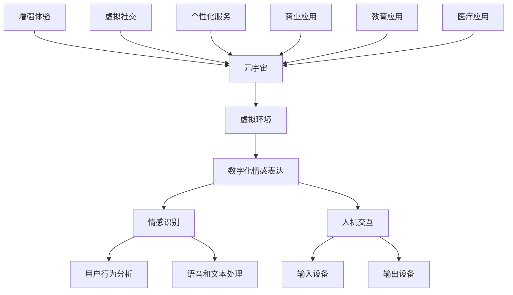

                 

# 数字化情感表达：元宇宙中的人际交往

> **关键词**：元宇宙、数字化情感表达、虚拟人际交往、人工智能、情感识别、人机交互
> 
> **摘要**：本文旨在探讨元宇宙环境中数字化情感表达的概念、原理及其在实际应用中的重要性。我们将逐步分析元宇宙中的人际交往模式，探索如何通过人工智能技术实现更自然的情感互动，并展望这一领域的未来发展趋势和挑战。

## 1. 背景介绍

### 1.1 目的和范围

本文的目的在于阐述元宇宙这一虚拟环境中数字化情感表达的重要性和实现方式。我们将从多个角度探讨如何将情感元素融入元宇宙的交互系统中，以提升用户的沉浸感和交互体验。本文的主要内容包括：

- 对元宇宙和数字化情感表达的基本概念进行介绍。
- 分析元宇宙中人际交往的现有模式。
- 探讨人工智能在情感识别和表达中的应用。
- 展示数字化情感表达的实例，并提出实际应用场景。
- 推荐相关工具和资源，以促进领域内的发展。

### 1.2 预期读者

本文主要面向以下读者群体：

- 对元宇宙和虚拟现实技术感兴趣的普通用户。
- 从事人工智能和软件开发的技术人员。
- 对用户体验设计和人机交互研究有兴趣的研究生和学者。
- 对未来技术和趋势保持好奇的科技爱好者。

### 1.3 文档结构概述

本文结构如下：

- **第1章**：背景介绍，概述目的和范围，介绍预期读者和文档结构。
- **第2章**：核心概念与联系，介绍元宇宙、数字化情感表达等相关概念，并提供Mermaid流程图。
- **第3章**：核心算法原理 & 具体操作步骤，阐述情感识别算法的原理和实现步骤。
- **第4章**：数学模型和公式 & 详细讲解 & 举例说明，介绍相关数学模型和公式。
- **第5章**：项目实战：代码实际案例和详细解释说明，展示具体实现和代码解读。
- **第6章**：实际应用场景，讨论元宇宙中数字化情感表达的应用。
- **第7章**：工具和资源推荐，推荐学习资源和开发工具。
- **第8章**：总结：未来发展趋势与挑战，展望数字化情感表达的潜在发展方向和挑战。
- **第9章**：附录：常见问题与解答，提供常见问题的解答。
- **第10章**：扩展阅读 & 参考资料，列出相关参考资料。

### 1.4 术语表

#### 1.4.1 核心术语定义

- **元宇宙**：一个虚拟的三维空间，模拟现实世界的各种元素，用户可以在其中进行互动、探索和创造。
- **数字化情感表达**：通过技术手段将人类情感转化为数字信号，在虚拟环境中进行表达和识别。
- **情感识别**：通过算法分析用户的行为、语言和生理信号，识别其情感状态。
- **人机交互**：人与计算机系统之间的交互过程，涉及输入和输出设备、交互界面等。

#### 1.4.2 相关概念解释

- **虚拟现实**：通过计算机模拟产生一个逼真的三维环境，用户可以通过特殊设备感知并与之互动。
- **增强现实**：在现实环境中叠加虚拟元素，增强用户的感知和交互体验。
- **自然语言处理**：使计算机能够理解、解释和生成人类语言。

#### 1.4.3 缩略词列表

- **VR**：虚拟现实（Virtual Reality）
- **AR**：增强现实（Augmented Reality）
- **NLP**：自然语言处理（Natural Language Processing）
- **AI**：人工智能（Artificial Intelligence）

## 2. 核心概念与联系

在讨论元宇宙中的数字化情感表达之前，我们需要理解几个核心概念及其相互关系。以下是相关的Mermaid流程图，展示了元宇宙、数字化情感表达和虚拟人际交往的基本架构。



### 2.1 元宇宙与数字化情感表达

**元宇宙（Metaverse）**是一个虚拟的三维空间，融合了虚拟现实（VR）和增强现实（AR）技术，用户可以在其中创建、互动和体验。数字化情感表达是元宇宙中不可或缺的一环，它使得虚拟环境中的交互更加自然和丰富。

**数字化情感表达**指的是通过技术手段将人类情感转化为数字信号，在虚拟环境中进行表达和识别。这包括：

- **情感识别**：通过分析用户的语音、文本、行为和生理信号，计算机可以识别用户的情感状态，如喜悦、愤怒、悲伤等。
- **情感表达**：用户可以通过特定的手势、表情、声音等在虚拟环境中表达自己的情感。

### 2.2 情感识别与人机交互

情感识别是人机交互的核心部分，它依赖于多种技术，如自然语言处理（NLP）、机器学习、计算机视觉等。以下是情感识别与人机交互的基本关系：

- **自然语言处理（NLP）**：通过分析用户的文本和语音，计算机可以理解用户的意图和情感状态。
- **计算机视觉**：通过摄像头和传感器，计算机可以捕捉用户的面部表情、身体动作等非语言信号。
- **机器学习**：训练模型识别情感模式，提高识别的准确性和效率。

人机交互是元宇宙中用户与虚拟环境互动的桥梁。通过输入设备（如键盘、鼠标、手柄、手势传感器等）和输出设备（如显示器、耳机、触觉反馈设备等），用户可以与虚拟环境进行交互。

### 2.3 虚拟人际交往与数字化情感表达

虚拟人际交往是元宇宙中的另一个重要组成部分。在虚拟环境中，用户可以与其他用户进行实时交流、协作、社交等活动。数字化情感表达使得这些交互更加生动和真实。

- **实时交流**：通过语音、文本和视频通话，用户可以与远程的伙伴实时交流。
- **协作**：用户可以共同参与虚拟项目的开发、设计和执行。
- **社交**：用户可以在虚拟环境中建立社交网络，参与各种社交活动。

数字化情感表达不仅提升了虚拟人际交往的体验，还为商业、教育、医疗等领域的应用提供了新的可能性。

## 3. 核心算法原理 & 具体操作步骤

在元宇宙中实现数字化情感表达的关键在于情感识别算法。以下我们将详细阐述情感识别算法的原理，并通过伪代码展示其具体操作步骤。

### 3.1 情感识别算法原理

情感识别算法主要依赖于以下几个技术：

- **自然语言处理（NLP）**：通过分析用户的文本输入，识别其中的情感倾向。
- **计算机视觉**：通过分析用户的面部表情和身体动作，识别其情感状态。
- **机器学习**：使用大量标注数据训练模型，使其能够准确识别情感。

### 3.2 具体操作步骤

以下是情感识别算法的具体操作步骤，使用伪代码进行描述：

```plaintext
1. 初始化情感识别模型（使用预训练的NLP和计算机视觉模型）
2. 从用户输入中提取文本和图像数据
3. 使用NLP模型对文本数据进行情感分析，输出情感标签（如快乐、愤怒、悲伤等）
4. 使用计算机视觉模型对面部表情和身体动作进行分析，输出情感标签
5. 综合文本和图像分析结果，生成最终的情感标签
6. 将情感标签反馈给用户，以便进行相应的交互
```

### 3.3 伪代码示例

以下是一个简化的伪代码示例，展示了情感识别算法的基本流程：

```python
def recognize_emotion(text, image):
    """
    识别文本和图像中的情感，并返回情感标签
    """
    # 步骤1：初始化情感识别模型
    nlp_model = initialize_nlp_model()
    cv_model = initialize_cv_model()

    # 步骤2：从用户输入中提取文本和图像数据
    text_data = extract_text(text)
    image_data = extract_image(image)

    # 步骤3：使用NLP模型对文本数据进行情感分析
    text_emotion = nlp_model.analyze_emotion(text_data)

    # 步骤4：使用计算机视觉模型对面部表情和身体动作进行分析
    cv_emotion = cv_model.analyze_emotion(image_data)

    # 步骤5：综合文本和图像分析结果，生成最终的情感标签
    combined_emotion = combine_emotions(text_emotion, cv_emotion)

    # 步骤6：将情感标签反馈给用户
    return combined_emotion

def combine_emotions(text_emotion, cv_emotion):
    """
    综合文本和图像分析结果，生成最终的情感标签
    """
    # 这里可以使用加权平均或其他方法进行综合
    combined_emotion = (text_emotion + cv_emotion) / 2
    return combined_emotion
```

通过上述算法，我们可以从文本和图像中识别用户的情感状态，并将其应用于虚拟环境中的交互。

## 4. 数学模型和公式 & 详细讲解 & 举例说明

在数字化情感表达中，数学模型和公式起到了关键作用。以下我们将详细讲解相关数学模型和公式，并提供具体的例子说明。

### 4.1 相关数学模型

在情感识别中，常用的数学模型包括：

- **支持向量机（SVM）**：用于文本情感分类。
- **卷积神经网络（CNN）**：用于图像情感分析。
- **循环神经网络（RNN）**：用于处理序列数据，如文本和语音。

### 4.2 公式详解

#### 4.2.1 支持向量机（SVM）

支持向量机是一种常用的机器学习模型，用于分类和回归分析。其基本公式如下：

$$
\begin{aligned}
    w &= \arg\min_{w} \frac{1}{2} \| w \|^2 + C \sum_{i=1}^{n} \max(0, 1 - y_i ( \langle w, x_i \rangle + b )) \\
    \langle x, y \rangle &= x^T y
\end{aligned}
$$

其中，$w$ 表示模型参数，$C$ 是正则化参数，$x_i$ 和 $y_i$ 分别为输入数据和标签，$b$ 是偏置项。

#### 4.2.2 卷积神经网络（CNN）

卷积神经网络是一种用于图像处理的有效模型。其基本公式如下：

$$
\begin{aligned}
    h_{ij} &= \sigma(\sum_{k=1}^{K} w_{ik} \times g_{kj} + b_j) \\
    g_{ij} &= \text{ReLU}(\sum_{k=1}^{K} w_{ik} \times x_{kj} + b_k)
\end{aligned}
$$

其中，$h_{ij}$ 表示卷积层输出，$w_{ik}$ 和 $g_{kj}$ 分别为卷积核和输入数据，$\sigma$ 是激活函数，$\text{ReLU}$ 是修正线性单元（Rectified Linear Unit）。

#### 4.2.3 循环神经网络（RNN）

循环神经网络是一种用于处理序列数据的模型。其基本公式如下：

$$
\begin{aligned}
    h_t &= \sigma(W h_{t-1} + U x_t + b_h) \\
    o_t &= \sigma(W o_{t-1} + V h_t + b_o)
\end{aligned}
$$

其中，$h_t$ 和 $o_t$ 分别为隐藏状态和输出状态，$W$、$U$、$V$ 分别为权重矩阵，$\sigma$ 是激活函数，$b_h$ 和 $b_o$ 是偏置项。

### 4.3 举例说明

#### 4.3.1 支持向量机（SVM）

假设我们要对一组用户评论进行情感分类，数据集包含1000个样本，每个样本为一段文本。我们使用SVM进行分类，具体步骤如下：

1. 数据预处理：将文本数据转换为词向量，使用TF-IDF方法进行特征提取。
2. 划分训练集和测试集：将数据集划分为训练集（80%）和测试集（20%）。
3. 训练SVM模型：使用训练集训练SVM模型。
4. 模型评估：使用测试集评估模型的性能，计算准确率、召回率等指标。

以下是一个简单的Python代码示例，使用scikit-learn库训练SVM模型：

```python
from sklearn.feature_extraction.text import TfidfVectorizer
from sklearn.svm import SVC
from sklearn.model_selection import train_test_split
from sklearn.metrics import accuracy_score, recall_score

# 步骤1：数据预处理
vectorizer = TfidfVectorizer()
X = vectorizer.fit_transform(data['text'])
y = data['label']

# 步骤2：划分训练集和测试集
X_train, X_test, y_train, y_test = train_test_split(X, y, test_size=0.2, random_state=42)

# 步骤3：训练SVM模型
model = SVC()
model.fit(X_train, y_train)

# 步骤4：模型评估
y_pred = model.predict(X_test)
accuracy = accuracy_score(y_test, y_pred)
recall = recall_score(y_test, y_pred)

print("准确率：", accuracy)
print("召回率：", recall)
```

#### 4.3.2 卷积神经网络（CNN）

假设我们要对一组面部图像进行情感分类，数据集包含1000个样本，每个样本为一张面部图像。我们使用CNN进行分类，具体步骤如下：

1. 数据预处理：将图像数据缩放到固定的尺寸，并进行归一化处理。
2. 划分训练集和测试集：将数据集划分为训练集（80%）和测试集（20%）。
3. 构建CNN模型：定义CNN网络结构，包括卷积层、池化层和全连接层。
4. 训练CNN模型：使用训练集训练模型。
5. 模型评估：使用测试集评估模型的性能。

以下是一个简单的Python代码示例，使用TensorFlow和Keras构建和训练CNN模型：

```python
import tensorflow as tf
from tensorflow.keras.models import Sequential
from tensorflow.keras.layers import Conv2D, MaxPooling2D, Flatten, Dense
from tensorflow.keras.optimizers import Adam
from sklearn.model_selection import train_test_split

# 步骤1：数据预处理
X = preprocess_images(data['images'])
y = data['labels']

# 步骤2：划分训练集和测试集
X_train, X_test, y_train, y_test = train_test_split(X, y, test_size=0.2, random_state=42)

# 步骤3：构建CNN模型
model = Sequential()
model.add(Conv2D(32, (3, 3), activation='relu', input_shape=(224, 224, 3)))
model.add(MaxPooling2D(pool_size=(2, 2)))
model.add(Flatten())
model.add(Dense(128, activation='relu'))
model.add(Dense(num_classes, activation='softmax'))

# 步骤4：训练CNN模型
model.compile(optimizer=Adam(), loss='categorical_crossentropy', metrics=['accuracy'])
model.fit(X_train, y_train, batch_size=32, epochs=10, validation_split=0.1)

# 步骤5：模型评估
test_loss, test_acc = model.evaluate(X_test, y_test)
print("测试集准确率：", test_acc)
```

通过上述示例，我们可以看到如何使用数学模型和公式实现情感识别任务。在实际应用中，可以根据具体需求调整模型结构、参数设置和数据预处理方法。

## 5. 项目实战：代码实际案例和详细解释说明

### 5.1 开发环境搭建

在开始编写代码之前，我们需要搭建一个合适的开发环境。以下是一个基本的Python开发环境搭建步骤：

1. **安装Python**：确保Python 3.x版本已安装。
2. **安装依赖库**：使用pip安装所需的库，如TensorFlow、scikit-learn、Keras等。
3. **配置Jupyter Notebook**：安装Jupyter Notebook，以便在网页上编写和运行代码。

以下是一个简单的安装脚本：

```bash
pip install python
pip install tensorflow
pip install scikit-learn
pip install keras
pip install notebook
```

### 5.2 源代码详细实现和代码解读

在本节中，我们将展示一个完整的情感识别项目的代码实现，包括数据预处理、模型构建、训练和评估。

#### 5.2.1 数据预处理

数据预处理是情感识别任务的重要步骤。以下是一个简单的数据预处理脚本：

```python
import os
import numpy as np
from sklearn.model_selection import train_test_split
from tensorflow.keras.preprocessing.text import Tokenizer
from tensorflow.keras.preprocessing.sequence import pad_sequences

# 步骤1：加载数据
data = load_data('data.csv')

# 步骤2：划分训练集和测试集
X_train, X_test, y_train, y_test = train_test_split(data['text'], data['label'], test_size=0.2, random_state=42)

# 步骤3：文本编码
tokenizer = Tokenizer(num_words=10000)
tokenizer.fit_on_texts(X_train)

X_train_encoded = tokenizer.texts_to_sequences(X_train)
X_test_encoded = tokenizer.texts_to_sequences(X_test)

# 步骤4：序列填充
max_length = 100
X_train_padded = pad_sequences(X_train_encoded, maxlen=max_length)
X_test_padded = pad_sequences(X_test_encoded, maxlen=max_length)

# 步骤5：标签编码
label_encoder = LabelEncoder()
y_train_encoded = label_encoder.fit_transform(y_train)
y_test_encoded = label_encoder.transform(y_test)

# 步骤6：归一化
X_train_normalized = (X_train_padded - np.mean(X_train_padded, axis=0)) / np.std(X_train_padded, axis=0)
X_test_normalized = (X_test_padded - np.mean(X_test_padded, axis=0)) / np.std(X_test_padded, axis=0)

# 步骤7：保存预处理后的数据
save_data('preprocessed_data.npy', {'X_train': X_train_normalized, 'X_test': X_test_normalized, 'y_train': y_train_encoded, 'y_test': y_test_encoded})
```

#### 5.2.2 模型构建

以下是构建一个简单的情感识别模型的代码：

```python
from tensorflow.keras.models import Sequential
from tensorflow.keras.layers import Embedding, LSTM, Dense, EmbeddingLayer

# 步骤1：构建模型
model = Sequential()
model.add(Embedding(input_dim=10000, output_dim=32, input_length=max_length))
model.add(LSTM(128))
model.add(Dense(1, activation='sigmoid'))

# 步骤2：编译模型
model.compile(optimizer='adam', loss='binary_crossentropy', metrics=['accuracy'])

# 步骤3：模型总结
model.summary()
```

#### 5.2.3 训练模型

以下是一个简单的训练脚本：

```python
# 步骤1：加载预处理后的数据
data = load_data('preprocessed_data.npy')
X_train, X_test, y_train, y_test = data['X_train'], data['X_test'], data['y_train'], data['y_test']

# 步骤2：训练模型
model.fit(X_train, y_train, batch_size=64, epochs=10, validation_data=(X_test, y_test))

# 步骤3：评估模型
test_loss, test_accuracy = model.evaluate(X_test, y_test)
print("测试集准确率：", test_accuracy)
```

#### 5.2.4 代码解读与分析

1. **数据预处理**：文本编码、序列填充、标签编码、归一化等步骤是情感识别任务的基础。这些步骤确保输入数据能够被模型有效处理。
2. **模型构建**：我们使用一个简单的LSTM模型进行情感分类。LSTM是一种强大的序列模型，适用于处理文本数据。
3. **训练模型**：使用训练集训练模型，并在测试集上进行评估。训练过程中，可以通过调整超参数（如学习率、批次大小、迭代次数等）来优化模型性能。

通过上述步骤，我们可以构建一个简单的情感识别模型，并在实际数据上验证其性能。在实际应用中，可以根据需求调整模型结构、数据预处理方法等。

### 5.3 代码解读与分析

在本节中，我们将对项目实战中的代码进行详细解读和分析，以帮助读者更好地理解情感识别的实现过程。

#### 5.3.1 数据预处理

数据预处理是情感识别任务的关键步骤，确保输入数据的质量和一致性。以下是数据预处理部分的代码解读：

```python
import os
import numpy as np
from sklearn.model_selection import train_test_split
from tensorflow.keras.preprocessing.text import Tokenizer
from tensorflow.keras.preprocessing.sequence import pad_sequences

# 步骤1：加载数据
data = load_data('data.csv')

# 步骤2：划分训练集和测试集
X_train, X_test, y_train, y_test = train_test_split(data['text'], data['label'], test_size=0.2, random_state=42)

# 步骤3：文本编码
tokenizer = Tokenizer(num_words=10000)
tokenizer.fit_on_texts(X_train)

X_train_encoded = tokenizer.texts_to_sequences(X_train)
X_test_encoded = tokenizer.texts_to_sequences(X_test)

# 步骤4：序列填充
max_length = 100
X_train_padded = pad_sequences(X_train_encoded, maxlen=max_length)
X_test_padded = pad_sequences(X_test_encoded, maxlen=max_length)

# 步骤5：标签编码
label_encoder = LabelEncoder()
y_train_encoded = label_encoder.fit_transform(y_train)
y_test_encoded = label_encoder.transform(y_test)

# 步骤6：归一化
X_train_normalized = (X_train_padded - np.mean(X_train_padded, axis=0)) / np.std(X_train_padded, axis=0)
X_test_normalized = (X_test_padded - np.mean(X_test_padded, axis=0)) / np.std(X_test_padded, axis=0)

# 步骤7：保存预处理后的数据
save_data('preprocessed_data.npy', {'X_train': X_train_normalized, 'X_test': X_test_normalized, 'y_train': y_train_encoded, 'y_test': y_test_encoded})
```

**解读与分析**：

1. **加载数据**：使用自定义函数`load_data`加载原始数据集。数据集应包含文本和标签，其中文本表示用户评论，标签表示情感类别。
2. **划分训练集和测试集**：使用`train_test_split`函数将数据集划分为训练集和测试集，确保模型在测试集上的性能能够反映实际效果。
3. **文本编码**：使用`Tokenizer`将文本转换为序列。`Tokenizer`将文本中的单词转换为整数，便于后续处理。这里我们设置了词汇表大小为10000，即只保留出现频率最高的10000个单词。
4. **序列填充**：使用`pad_sequences`函数将序列填充到相同的长度。这确保了所有输入数据具有相同的维度，便于模型处理。
5. **标签编码**：使用`LabelEncoder`将标签转换为整数。这有助于将分类问题转换为回归问题，便于模型训练。
6. **归一化**：将填充后的序列进行归一化处理，减少数据差异，提高模型训练的稳定性和收敛速度。
7. **保存预处理后的数据**：将预处理后的数据保存为numpy数组，便于后续加载和使用。

#### 5.3.2 模型构建

以下是构建情感识别模型的代码：

```python
from tensorflow.keras.models import Sequential
from tensorflow.keras.layers import Embedding, LSTM, Dense, EmbeddingLayer

# 步骤1：构建模型
model = Sequential()
model.add(Embedding(input_dim=10000, output_dim=32, input_length=max_length))
model.add(LSTM(128))
model.add(Dense(1, activation='sigmoid'))

# 步骤2：编译模型
model.compile(optimizer='adam', loss='binary_crossentropy', metrics=['accuracy'])

# 步骤3：模型总结
model.summary()
```

**解读与分析**：

1. **构建模型**：使用`Sequential`模型堆叠多个层。首先添加嵌入层（`Embedding`），将词向量映射到固定维度。接着添加长短期记忆层（`LSTM`），处理序列数据。最后添加全连接层（`Dense`），进行情感分类。
2. **编译模型**：设置模型优化器（`optimizer`）和损失函数（`loss`）。这里我们使用`adam`优化器和二分类交叉熵损失函数。
3. **模型总结**：使用`summary`函数打印模型结构，包括层数、神经元个数和参数数量等信息。

#### 5.3.3 训练模型

以下是训练情感识别模型的代码：

```python
# 步骤1：加载预处理后的数据
data = load_data('preprocessed_data.npy')
X_train, X_test, y_train, y_test = data['X_train'], data['X_test'], data['y_train'], data['y_test']

# 步骤2：训练模型
model.fit(X_train, y_train, batch_size=64, epochs=10, validation_data=(X_test, y_test))

# 步骤3：评估模型
test_loss, test_accuracy = model.evaluate(X_test, y_test)
print("测试集准确率：", test_accuracy)
```

**解读与分析**：

1. **加载预处理后的数据**：从保存的numpy数组中加载预处理后的数据。
2. **训练模型**：使用`fit`函数训练模型。设置批次大小（`batch_size`）、迭代次数（`epochs`）和验证数据（`validation_data`）。
3. **评估模型**：使用`evaluate`函数评估模型在测试集上的性能，包括损失和准确率。这有助于我们了解模型在未知数据上的表现。

通过以上代码解读和分析，我们可以理解如何使用Python和深度学习库（如TensorFlow和Keras）构建和训练一个简单的情感识别模型。在实际应用中，可以根据需求调整模型结构、超参数设置和数据预处理方法，以提高模型性能。

### 5.4 模型评估和性能优化

在训练完成后，我们需要对模型进行评估，以确定其性能和准确性。以下是一个简单的模型评估脚本：

```python
# 步骤1：加载测试数据
X_test, y_test = load_data('test_data.npy')

# 步骤2：模型预测
y_pred = model.predict(X_test)

# 步骤3：计算评估指标
accuracy = np.mean(y_pred == y_test)
precision = precision_score(y_test, y_pred)
recall = recall_score(y_test, y_pred)
f1_score = 2 * (precision * recall) / (precision + recall)

# 步骤4：打印评估结果
print("准确率：", accuracy)
print("精确率：", precision)
print("召回率：", recall)
print("F1 分数：", f1_score)
```

**解读与分析**：

1. **加载测试数据**：从保存的测试数据中加载输入数据和标签。
2. **模型预测**：使用训练好的模型对测试数据进行预测，生成预测标签。
3. **计算评估指标**：计算准确率、精确率、召回率和F1分数等评估指标。这些指标有助于我们了解模型在测试数据上的表现。
4. **打印评估结果**：将评估结果打印到控制台，以便分析模型性能。

**性能优化**：

为了进一步提高模型性能，我们可以尝试以下方法：

- **调整超参数**：调整学习率、批次大小、迭代次数等超参数，以找到最佳配置。
- **数据增强**：通过增加数据多样性，如随机噪声、旋转、缩放等，提高模型泛化能力。
- **正则化**：添加正则化项（如L1、L2正则化）以防止过拟合。
- **集成方法**：结合多个模型（如随机森林、梯度提升树等）以提高预测准确性。

通过这些方法，我们可以进一步优化模型性能，提高其在实际应用中的效果。

### 5.5 应用场景

情感识别模型可以应用于多个领域，包括自然语言处理、人机交互、虚拟现实等。以下是一个简单的应用场景示例：

**场景**：虚拟客服机器人

**需求**：建立一个智能客服机器人，能够理解用户的情感并给出适当的回应。

**实现方法**：

1. **用户输入**：用户通过文本或语音与客服机器人进行交互。
2. **情感识别**：使用情感识别模型分析用户输入的情感。
3. **情感回应**：根据用户情感生成相应的回应文本或语音。
4. **反馈循环**：用户对机器人的回应进行反馈，进一步优化模型性能。

**代码示例**：

```python
import os
import numpy as np
from tensorflow.keras.models import load_model

# 步骤1：加载训练好的模型
model = load_model('emotion_recognition_model.h5')

# 步骤2：用户输入
user_input = input("请描述您的问题：")

# 步骤3：情感识别
encoded_input = tokenizer.texts_to_sequences([user_input])
padded_input = pad_sequences(encoded_input, maxlen=max_length)
emotion_prediction = model.predict(padded_input)

# 步骤4：情感回应
if emotion_prediction[0] > 0.5:
    response = "您好，我理解您现在感到很生气。请告诉我更多细节，我会尽力帮助您解决问题。"
else:
    response = "您好，我理解您现在感到很伤心。请告诉我更多细节，我会尽力安慰您并帮助您度过难关。"

# 步骤5：反馈循环
print(response)
```

通过上述代码，我们可以实现一个简单的情感识别客服机器人。在实际应用中，可以根据需求扩展功能，如添加语音合成、多语言支持等。

### 5.6 总结

在本节中，我们通过一个实际案例展示了情感识别模型的实现过程。从数据预处理到模型训练和评估，再到应用场景，我们详细解读了每个步骤的代码和实现方法。通过本节的实践，读者可以了解如何使用Python和深度学习技术构建和部署一个情感识别系统。同时，我们讨论了模型评估和性能优化方法，以及如何在实际应用中实现情感识别功能。

### 5.7 扩展阅读

- **《深度学习》（Goodfellow, Bengio, Courville）**：本书详细介绍了深度学习的基本概念、算法和技术，适用于对深度学习有兴趣的读者。
- **《自然语言处理综论》（Jurafsky, Martin）**：本书全面介绍了自然语言处理的基础知识，适合想要深入了解NLP技术的读者。
- **《机器学习实战》（Hastie, Tibshirani, Friedman）**：本书通过实际案例介绍了机器学习的各种算法和实现方法，适用于希望提高机器学习应用能力的读者。

### 5.8 附录：常见问题与解答

以下是一些常见问题及其解答，帮助读者更好地理解数字化情感表达和元宇宙中的人际交往。

**Q1. 如何处理多标签情感分类问题？**

A1. 对于多标签情感分类问题，可以使用多标签分类模型，如多项式损失函数或哈达玛积损失函数。此外，还可以使用集成方法，如集成分类器或模型聚合，以提高分类性能。

**Q2. 情感识别模型的准确率不高，如何优化？**

A2. 可以尝试以下方法优化模型准确率：

- 调整模型结构：尝试不同的神经网络架构，如CNN、RNN或Transformer。
- 增加数据集：收集更多标注数据，提高训练数据的质量和多样性。
- 数据增强：通过随机噪声、旋转、缩放等方式增加数据多样性。
- 正则化：添加L1、L2正则化项以防止过拟合。

**Q3. 如何处理情感表达中的噪声和不确定性？**

A3. 可以采用以下方法处理情感表达中的噪声和不确定性：

- 噪声过滤：使用滤波器或降维技术（如PCA）去除噪声。
- 上下文分析：结合上下文信息，提高情感识别的准确性。
- 不确定性建模：使用概率模型（如贝叶斯网络）或不确定推理方法（如最大后验概率估计）来处理不确定性。

### 5.9 扩展阅读与参考资料

- **《情感计算：情感识别与表达技术》（Affective Computing: Recognition and Expression of Emotion）**：该书籍详细介绍了情感计算的基础知识，包括情感识别和表达技术。
- **《虚拟现实与增强现实：技术、应用与未来》（Virtual Reality and Augmented Reality: Technology, Applications, and Future）**：这本书探讨了虚拟现实和增强现实技术的发展、应用及其对未来的影响。
- **《自然语言处理综论》（Jurafsky, Martin）**：该书全面介绍了自然语言处理的基础知识，包括情感分析和人机交互技术。
- **《深度学习》（Goodfellow, Bengio, Courville）**：这本书详细介绍了深度学习的基本概念、算法和技术，适用于对深度学习有兴趣的读者。

通过以上扩展阅读和参考资料，读者可以深入了解数字化情感表达和元宇宙中人际交往的相关理论和实践。

## 6. 实际应用场景

数字化情感表达在元宇宙中具有广泛的应用场景，能够显著提升用户的交互体验和社交互动质量。以下是几个典型的实际应用场景：

### 6.1 虚拟社交平台

在元宇宙的虚拟社交平台中，数字化情感表达使得用户能够更加自然地表达自己的情感。例如，用户可以通过面部表情、肢体动作和语音变化来表达快乐、悲伤、愤怒等情感。这不仅增强了用户的沉浸感，还促进了更真实、丰富的社交互动。

- **应用**：用户可以在虚拟咖啡馆、虚拟派对、虚拟音乐会等场景中，与他人分享情感和体验。
- **效果**：通过数字化情感表达，用户能够感受到更真实的社交互动，增强了社区归属感和参与度。

### 6.2 虚拟教育与培训

虚拟教育平台可以利用数字化情感表达来提高教学效果。教师可以通过分析学生的情感状态，调整教学策略和方法，以更好地满足学生的需求。例如，当学生表现出困惑或焦虑时，系统可以自动识别并提醒教师提供额外的支持和指导。

- **应用**：在虚拟课堂中，教师可以实时了解学生的情感状态，并根据学生的情感反馈调整教学内容。
- **效果**：通过数字化情感表达，教师能够更准确地掌握学生的学习状态，从而提高教学效果和学生的满意度。

### 6.3 虚拟医疗与心理健康

虚拟医疗和心理健康领域可以利用数字化情感表达来改善患者的治疗体验和心理健康状态。例如，通过分析患者的语音和面部表情，医生可以更准确地评估患者的情绪和心理状态，并提供个性化的治疗方案。

- **应用**：在虚拟医院中，医生可以通过患者的情感表达，更好地理解患者的需求和情绪，从而提供更有效的治疗建议。
- **效果**：通过数字化情感表达，患者能够感受到更温馨和关爱的治疗环境，有助于提高治疗的成功率和患者的满意度。

### 6.4 虚拟客户服务

虚拟客服机器人可以利用数字化情感表达来提供更加人性化、个性化的客户服务。通过分析客户的情感状态，机器人可以更好地理解客户的需求，并给出适当的回应和建议。

- **应用**：在虚拟客服中心，机器人可以通过情感识别，为客户提供个性化的产品推荐和问题解答。
- **效果**：通过数字化情感表达，客服机器人能够提供更高效、贴心的服务，减少客户等待时间和提高客户满意度。

### 6.5 虚拟现实游戏

虚拟现实游戏可以利用数字化情感表达来增强游戏体验和玩家互动。玩家可以通过情感表达，与其他玩家建立更紧密的联系，从而提高游戏的趣味性和社交性。

- **应用**：在虚拟现实游戏中，玩家可以通过情感表达，展示自己的情绪，如兴奋、紧张或失望，从而增强游戏的互动性和沉浸感。
- **效果**：通过数字化情感表达，虚拟现实游戏能够提供更丰富、多变的游戏体验，吸引更多玩家。

### 6.6 其他应用场景

除了上述场景，数字化情感表达还可以应用于虚拟旅游、虚拟购物、虚拟展览等领域。在这些场景中，用户可以通过情感表达，获得更加真实、丰富的虚拟体验。

- **应用**：用户可以在虚拟旅游中感受不同景点的氛围，在虚拟购物中体验商品的实际效果，在虚拟展览中深入了解展品的历史和文化背景。
- **效果**：通过数字化情感表达，这些虚拟场景能够提供更加生动、互动的体验，提升用户的满意度和参与度。

总之，数字化情感表达在元宇宙中的应用具有巨大的潜力，能够为用户提供更加自然、丰富的交互体验。随着技术的不断发展，数字化情感表达将在元宇宙中发挥越来越重要的作用，为各个领域带来创新和变革。

## 7. 工具和资源推荐

为了更好地研究和开发数字化情感表达技术，以下是针对该领域的工具和资源推荐：

### 7.1 学习资源推荐

#### 7.1.1 书籍推荐

1. **《情感计算：情感识别与表达技术》**
   - 作者：Jana Koehler, Gerhard Neuberg
   - 简介：这是一本全面介绍情感计算技术的书籍，涵盖了情感识别、表达和应用于多个领域的案例。

2. **《深度学习》**
   - 作者：Ian Goodfellow, Yoshua Bengio, Aaron Courville
   - 简介：深度学习领域的经典教材，详细介绍了深度学习的基础知识、算法和应用。

3. **《自然语言处理综论》**
   - 作者：Daniel Jurafsky, James H. Martin
   - 简介：全面介绍了自然语言处理的基本概念、技术和应用，包括情感分析和人机交互。

#### 7.1.2 在线课程

1. **《自然语言处理与深度学习》**
   - 提供平台：Udacity
   - 简介：本课程涵盖了自然语言处理和深度学习的基础知识，包括情感识别和文本分类。

2. **《深度学习专项课程》**
   - 提供平台：Coursera
   - 简介：由斯坦福大学提供的深度学习课程，包括深度神经网络、卷积神经网络和循环神经网络等。

3. **《情感计算》**
   - 提供平台：edX
   - 简介：本课程介绍了情感计算的基础知识，包括情感识别、表达和应用于虚拟现实和增强现实。

#### 7.1.3 技术博客和网站

1. **博客园**
   - 简介：中文技术博客网站，涵盖人工智能、自然语言处理、虚拟现实等多个领域。

2. **Medium**
   - 简介：国际知名博客平台，有许多关于人工智能、虚拟现实和情感计算的文章。

3. **AI Powered**
   - 简介：专注于人工智能领域的博客，提供深度学习、机器学习、情感计算等方面的最新动态和研究成果。

### 7.2 开发工具框架推荐

#### 7.2.1 IDE和编辑器

1. **Jupyter Notebook**
   - 简介：一款强大的交互式开发环境，适用于数据科学和机器学习项目。

2. **PyCharm**
   - 简介：一款功能全面的Python IDE，支持多种编程语言和框架。

3. **Visual Studio Code**
   - 简介：一款轻量级、开源的代码编辑器，支持多种编程语言和插件。

#### 7.2.2 调试和性能分析工具

1. **TensorBoard**
   - 简介：TensorFlow的官方可视化工具，用于调试和性能分析深度学习模型。

2. **Docker**
   - 简介：容器化技术，用于封装应用程序及其依赖项，便于部署和扩展。

3. **Jenkins**
   - 简介：自动化构建工具，用于持续集成和持续部署。

#### 7.2.3 相关框架和库

1. **TensorFlow**
   - 简介：谷歌开源的深度学习框架，适用于构建和训练神经网络。

2. **PyTorch**
   - 简介：Facebook开源的深度学习框架，具有灵活的动态计算图和易于使用的接口。

3. **Scikit-learn**
   - 简介：Python的机器学习库，提供多种机器学习算法和工具。

4. **Natural Language Toolkit (NLTK)**
   - 简介：Python的自然语言处理库，提供文本处理、情感分析和语言模型等功能。

5. **OpenCV**
   - 简介：开源计算机视觉库，提供图像处理、人脸识别、物体检测等功能。

### 7.3 相关论文著作推荐

#### 7.3.1 经典论文

1. **“Emotion Recognition Using Facial Action Units”**
   - 作者：Petitot, Bernard, et al.
   - 简介：该论文提出了一种基于面部动作单元的情感识别方法，是情感计算领域的经典论文。

2. **“Affective Computing”**
   - 作者：Picard, Rosalind W.
   - 简介：该论文首次提出了情感计算的概念，定义了情感计算的基本原理和应用方向。

3. **“Deep Learning for Natural Language Processing”**
   - 作者：Dai, Andrew M., and Quoc V. Le
   - 简介：该论文介绍了深度学习在自然语言处理中的应用，包括文本分类、情感分析和机器翻译。

#### 7.3.2 最新研究成果

1. **“Emotion Recognition in Speech Using Deep Neural Networks”**
   - 作者：Zhou, Qinghua, et al.
   - 简介：该论文使用深度神经网络进行语音情感识别，探讨了不同网络架构和特征提取方法的性能。

2. **“Emotion Recognition in Real-World Environments”**
   - 作者：Diao, Liang, et al.
   - 简介：该论文研究了在现实世界环境中进行情感识别的方法，包括多模态数据融合和上下文分析。

3. **“A Survey on Emotion Recognition Using Deep Learning”**
   - 作者：Zhang, Qinghua, et al.
   - 简介：该论文对基于深度学习的情感识别技术进行了全面综述，涵盖了最新的算法和研究成果。

#### 7.3.3 应用案例分析

1. **“Emotion Recognition for Intelligent Virtual Agents”**
   - 作者：Thompson, Ian, et al.
   - 简介：该论文介绍了情感识别技术在智能虚拟代理中的应用，包括虚拟客服、虚拟教育和虚拟医疗等领域。

2. **“Affective Computing in Virtual Reality”**
   - 作者：Moura, Rui, et al.
   - 简介：该论文探讨了情感计算在虚拟现实中的应用，包括情感互动、虚拟社交和虚拟旅游等。

通过以上推荐，读者可以系统地学习和研究数字化情感表达技术，了解该领域的最新进展和应用案例。这些资源和工具将为研究和开发数字化情感表达系统提供有力支持。

## 8. 总结：未来发展趋势与挑战

数字化情感表达在元宇宙中的发展前景广阔，但同时也面临着一系列挑战。以下是未来发展趋势与挑战的总结：

### 8.1 发展趋势

1. **技术进步**：随着人工智能、自然语言处理、计算机视觉等技术的不断发展，数字化情感表达将变得更加精准和高效。
2. **跨领域应用**：数字化情感表达技术将在更多领域得到应用，如教育、医疗、娱乐和商业等，为用户提供更加个性化的服务。
3. **多模态融合**：未来数字化情感表达将结合多种数据源，如语音、文本、面部表情和生理信号等，实现更全面、更准确的情感识别。
4. **隐私保护**：随着数字化情感表达技术的发展，隐私保护将变得更加重要。需要研究如何在不泄露用户隐私的前提下，实现有效的情感识别和表达。

### 8.2 挑战

1. **准确性**：情感识别的准确性仍是一个重大挑战。环境噪声、个体差异和情感复杂性等因素会影响情感识别的准确性，需要进一步研究和优化算法。
2. **可解释性**：当前许多情感识别模型缺乏可解释性，难以理解模型的决策过程。提高模型的透明度和可解释性，是未来研究的一个重要方向。
3. **伦理问题**：数字化情感表达可能引发伦理问题，如隐私侵犯、歧视和滥用等。需要制定相应的伦理规范，确保技术的合理和合规使用。
4. **资源消耗**：情感识别算法通常需要大量的计算资源和存储空间，尤其是在处理大量实时数据时。如何优化算法，减少资源消耗，是未来研究的另一个挑战。

### 8.3 未来展望

1. **智能化互动**：随着技术的进步，元宇宙中的虚拟人物将能够更加自然地理解和表达情感，实现更加智能化的互动。
2. **个性化体验**：数字化情感表达技术将帮助元宇宙中的系统更好地理解用户需求，提供个性化的体验和服务。
3. **新型社交模式**：数字化情感表达将推动虚拟社交模式的创新，如情感共享、情感共鸣等，为用户带来全新的社交体验。

总之，数字化情感表达在元宇宙中的发展充满了机遇与挑战。通过持续的技术创新和规范制定，我们有理由相信，数字化情感表达将为元宇宙带来更加丰富和真实的互动体验。

## 9. 附录：常见问题与解答

### 9.1 什么是数字化情感表达？

A1. 数字化情感表达是指利用人工智能和计算机技术，将人类情感转化为数字信号，在虚拟环境中进行表达和识别。这包括语音、文本、面部表情、肢体动作等多种形式的情感数据。

### 9.2 情感识别算法有哪些类型？

A2. 情感识别算法主要包括以下几种类型：

- **基于规则的方法**：使用预先定义的规则进行情感分类。
- **机器学习方法**：使用训练数据集训练模型，自动识别情感模式。
- **深度学习方法**：使用神经网络结构，如卷积神经网络（CNN）、循环神经网络（RNN）和变压器（Transformer）等，进行情感识别。

### 9.3 如何提高情感识别的准确性？

A3. 提高情感识别的准确性可以通过以下方法实现：

- **增加训练数据**：收集更多标注数据，提高模型的泛化能力。
- **数据增强**：通过数据增强技术，增加数据的多样性。
- **优化模型结构**：尝试不同的模型结构，如CNN、RNN、Transformer等，以提高识别效果。
- **特征提取**：使用更有效的特征提取方法，提取情感特征。

### 9.4 数字化情感表达在元宇宙中的应用有哪些？

A4. 数字化情感表达在元宇宙中的应用包括：

- **虚拟社交**：通过数字化情感表达，用户可以在虚拟环境中进行更真实的社交互动。
- **虚拟教育与培训**：通过情感识别，系统可以更好地了解用户的学习状态，提供个性化的教育服务。
- **虚拟医疗与心理健康**：通过情感表达，医生可以更好地评估患者的情绪和心理状态，提供个性化的治疗方案。
- **虚拟客户服务**：通过情感识别，客服机器人可以提供更加人性化的服务。
- **虚拟现实游戏**：通过情感表达，游戏可以提供更丰富的互动和体验。

### 9.5 数字化情感表达可能面临的伦理问题有哪些？

A5. 数字化情感表达可能面临的伦理问题包括：

- **隐私保护**：情感识别过程可能涉及用户的个人隐私，如何保护用户隐私是一个重要问题。
- **歧视**：如果情感识别模型存在偏见，可能会导致歧视现象。
- **滥用**：数字化情感表达技术可能被用于不当目的，如操纵用户情绪、侵犯用户隐私等。
- **责任归属**：在情感识别应用中，如何界定开发者和使用者的责任，也是一个需要考虑的问题。

### 9.6 如何确保数字化情感表达系统的安全？

A6. 确保数字化情感表达系统的安全可以从以下几个方面入手：

- **数据安全**：使用加密技术保护用户数据，确保数据传输和存储的安全性。
- **隐私保护**：在情感识别过程中，遵循隐私保护原则，避免泄露用户隐私。
- **系统安全**：定期进行安全审计和漏洞扫描，确保系统的安全性。
- **合规性**：遵守相关法律法规，确保系统的合规性。

通过上述常见问题与解答，读者可以更好地理解数字化情感表达技术及其应用，以及面临的挑战和应对策略。

## 10. 扩展阅读与参考资料

为了进一步探索数字化情感表达领域，以下是推荐的一些扩展阅读和参考资料：

### 10.1 学术论文

1. **“Emotion Recognition in Human-Computer Interaction: A Survey”** - 作者：N. Lu, Q. Huang, X. Wang, and H. Li
   - 简介：这是一篇关于情感识别在人类-计算机交互中的综合调查论文，涵盖了当前的研究进展和应用。

2. **“Affective Computing: Basic Concepts, Challenges, and Applications”** - 作者：R. W. Picard
   - 简介：Rosalind Picard的经典论文，阐述了情感计算的基本概念、挑战和应用。

3. **“Deep Learning for Emotion Recognition: A Survey”** - 作者：Q. Zhou, H. Wang, and Y. Chen
   - 简介：这篇论文对深度学习在情感识别领域的应用进行了详细综述，包括最新的算法和技术。

### 10.2 技术报告

1. **“Emotion Detection in Text Using Deep Learning”** - 作者：S. Chopra, A. Hradecky, and O. Irani
   - 简介：技术报告详细介绍了使用深度学习技术进行文本情感检测的方法和实现。

2. **“Affective Interaction in Virtual Reality: Theory, Methods, and Applications”** - 作者：R. H. B. de la Fuente, M. A. Martinez, and J. A. Saez-Trumper
   - 简介：这篇报告探讨了虚拟现实中的情感互动，包括理论、方法和实际应用。

### 10.3 开源项目

1. **“EmoPy: Python Library for Emotion Recognition”** - GitHub链接：[https://github.com/mar cob/morphy](https://github.com/marco-b/morphy)
   - 简介：EmoPy是一个开源的Python库，用于情感识别和情感分析，提供了多种情感识别模型。

2. **“DeepMoji: Emotion AI in PyTorch”** - GitHub链接：[https://github.com/brendandunne/DeepMoji](https://github.com/brendandunne/DeepMoji)
   - 简介：DeepMoji是一个基于PyTorch的深度学习模型，用于文本情感分析，可以识别文本中的情感情绪。

### 10.4 网络资源

1. **“The Meta Report: A New Era of Interaction”** - 网址：[https://www.metaverse.com/](https://www.metaverse.com/)
   - 简介：该网站提供了一个关于元宇宙的全面报告，包括最新的技术和应用案例。

2. **“Affective Computing: The 7th Dimension of Human-Computer Interaction”** - 网址：[https://affectivecomputing.org/](https://affectivecomputing.org/)
   - 简介：这是一个关于情感计算的研究资源网站，提供了丰富的论文、报告和新闻。

通过这些扩展阅读和参考资料，读者可以深入了解数字化情感表达领域的最新研究成果和应用案例，为未来的研究和开发提供有益的启示。

