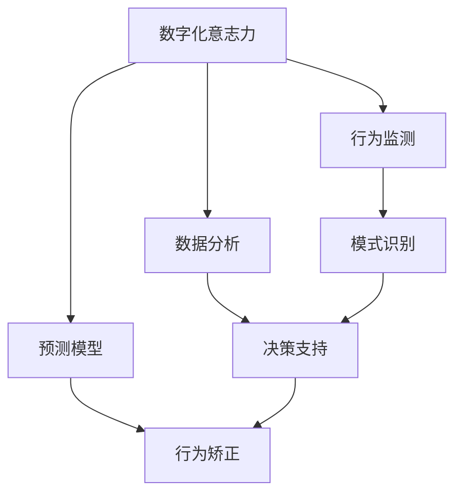

                 

# 数字化意志力：AI增强的自我控制

> **关键词：** 数字化意志力，人工智能，自我控制，行为经济学，算法，数学模型，应用案例

> **摘要：** 本文将探讨如何通过人工智能技术增强自我控制能力，分析其背后的核心概念和算法原理，并借助实际案例展示数字化意志力的应用潜力。我们将逐步深入，结合数学模型和伪代码，详细解释实现过程，同时推荐相关工具和资源，展望未来发展趋势与挑战。

## 1. 背景介绍

### 1.1 目的和范围

本文旨在探讨如何利用人工智能技术增强个体自我控制能力。随着数字化时代的到来，人们的日常生活和决策越来越依赖于计算机和移动设备，但同时也面临着各种诱惑和即时满足的诱惑。如何通过技术手段帮助我们更好地控制自己的行为，实现长期目标，成为一个值得研究的问题。

本文将涵盖以下内容：

- 数字化意志力的核心概念和理论基础
- 相关的人工智能算法和数学模型
- 实际应用案例解析
- 工具和资源的推荐
- 未来发展趋势与挑战

### 1.2 预期读者

本文适合以下读者群体：

- 对人工智能和自我控制感兴趣的技术爱好者
- 想要提升自我控制能力的个人
- 关注行为经济学和心理学的研究人员
- 从事数字健康和心理健康领域的专业人士

### 1.3 文档结构概述

本文结构如下：

- 1. 背景介绍
  - 1.1 目的和范围
  - 1.2 预期读者
  - 1.3 文档结构概述
  - 1.4 术语表
- 2. 核心概念与联系
  - 2.1 数字化意志力的概念
  - 2.2 人工智能与自我控制
  - 2.3 Mermaid流程图
- 3. 核心算法原理 & 具体操作步骤
  - 3.1 算法概述
  - 3.2 伪代码详解
- 4. 数学模型和公式 & 详细讲解 & 举例说明
  - 4.1 模型概述
  - 4.2 公式推导
  - 4.3 应用实例
- 5. 项目实战：代码实际案例和详细解释说明
  - 5.1 开发环境搭建
  - 5.2 源代码详细实现和代码解读
  - 5.3 代码解读与分析
- 6. 实际应用场景
- 7. 工具和资源推荐
  - 7.1 学习资源推荐
  - 7.2 开发工具框架推荐
  - 7.3 相关论文著作推荐
- 8. 总结：未来发展趋势与挑战
- 9. 附录：常见问题与解答
- 10. 扩展阅读 & 参考资料

### 1.4 术语表

#### 1.4.1 核心术语定义

- 数字化意志力：利用数字技术手段增强个体自我控制能力的过程。
- 人工智能：模拟人类智能行为的计算机程序和系统。
- 自我控制：个体在面对诱惑和即时满足时，能够坚持长期目标的能力。
- 行为经济学：研究个体如何在真实经济环境中做出决策的学科。

#### 1.4.2 相关概念解释

- 算法：解决问题的步骤和规则。
- 数学模型：用数学符号和公式表示现实问题的一种抽象。
- 机器学习：从数据中自动学习和改进算法的学科。

#### 1.4.3 缩略词列表

- AI：人工智能
- ML：机器学习
- DL：深度学习
- NLP：自然语言处理
- RL：强化学习

## 2. 核心概念与联系

在探讨数字化意志力之前，我们需要了解一些核心概念和它们之间的关系。以下是数字化意志力的核心概念及其相互联系。

### 2.1 数字化意志力的概念

数字化意志力是指利用数字技术手段，如人工智能、机器学习、自然语言处理等，来增强个体自我控制能力的过程。它涉及到以下几个方面：

- **行为监测**：通过传感器、应用程序等监测个体的行为数据，如日常活动、消费习惯、情绪变化等。
- **数据分析和预测**：利用机器学习算法对行为数据进行分析，预测个体未来的行为趋势。
- **决策辅助**：根据分析结果，为个体提供决策建议，帮助他们更好地控制自己的行为。

### 2.2 人工智能与自我控制

人工智能在数字化意志力中的应用主要体现在以下几个方面：

- **模式识别**：通过机器学习算法识别个体的行为模式，预测其未来行为。
- **决策支持**：基于分析结果，为个体提供决策建议，帮助他们做出更明智的选择。
- **行为矫正**：利用强化学习算法，根据个体行为的变化，调整决策策略，帮助个体逐步形成更好的行为习惯。

### 2.3 Mermaid流程图

以下是一个简化的Mermaid流程图，展示了数字化意志力的核心概念和相互关系：



## 3. 核心算法原理 & 具体操作步骤

在数字化意志力的实现过程中，核心算法原理起着至关重要的作用。以下我们将详细探讨这些算法原理，并给出具体的操作步骤。

### 3.1 算法概述

数字化意志力的核心算法主要包括以下几类：

- **行为监测算法**：用于收集和整理个体的行为数据。
- **机器学习算法**：用于分析行为数据，识别行为模式。
- **决策支持算法**：根据分析结果，为个体提供决策建议。
- **强化学习算法**：用于调整决策策略，帮助个体逐步形成更好的行为习惯。

### 3.2 伪代码详解

以下是这些算法的伪代码实现：

#### 3.2.1 行为监测算法

```python
# 行为监测算法伪代码
def monitor_behavior():
    # 收集行为数据
    data = collect_data()
    # 整理数据
    processed_data = preprocess_data(data)
    return processed_data
```

#### 3.2.2 机器学习算法

```python
# 机器学习算法伪代码
def machine_learning(processed_data):
    # 训练模型
    model = train_model(processed_data)
    # 预测行为
    prediction = model.predict(new_data)
    return prediction
```

#### 3.2.3 决策支持算法

```python
# 决策支持算法伪代码
def decision_support(prediction):
    # 根据预测结果，提供决策建议
    advice = generate_advice(prediction)
    return advice
```

#### 3.2.4 强化学习算法

```python
# 强化学习算法伪代码
def reinforcement_learning(current_state, action, reward):
    # 更新决策策略
    updated_policy = update_policy(current_state, action, reward)
    return updated_policy
```

### 3.3 操作步骤详解

#### 3.3.1 行为监测

1. **数据收集**：使用传感器、应用程序等设备，收集个体的日常行为数据，如步数、心率、消费记录等。
2. **数据整理**：对收集到的行为数据进行清洗和预处理，去除噪声和异常值，确保数据的准确性和一致性。

#### 3.3.2 机器学习

1. **模型训练**：使用预处理后的数据，训练机器学习模型，如决策树、随机森林、神经网络等。
2. **行为预测**：将新收集的行为数据输入到训练好的模型中，预测个体的未来行为。

#### 3.3.3 决策支持

1. **决策建议**：根据行为预测结果，为个体提供具体的决策建议，如锻炼建议、消费预算等。

#### 3.3.4 强化学习

1. **策略更新**：根据个体行为的变化，实时调整决策策略，以帮助个体逐步形成更好的行为习惯。

## 4. 数学模型和公式 & 详细讲解 & 举例说明

在数字化意志力的实现过程中，数学模型和公式起着关键作用。以下我们将详细讲解这些数学模型，并给出具体的推导和举例说明。

### 4.1 模型概述

数字化意志力的数学模型主要包括以下几类：

- **时间序列模型**：用于预测个体行为的变化趋势。
- **回归模型**：用于分析个体行为与决策因素之间的关系。
- **强化学习模型**：用于优化决策策略，以实现长期目标。

### 4.2 公式推导

#### 4.2.1 时间序列模型

时间序列模型常用的公式如下：

$$
X_t = \phi X_{t-1} + \epsilon_t
$$

其中，$X_t$ 表示第 $t$ 时刻的行为值，$\phi$ 表示模型参数，$\epsilon_t$ 表示噪声项。

#### 4.2.2 回归模型

回归模型常用的公式如下：

$$
y = \beta_0 + \beta_1 x
$$

其中，$y$ 表示因变量（行为值），$x$ 表示自变量（决策因素），$\beta_0$ 和 $\beta_1$ 分别表示模型参数。

#### 4.2.3 强化学习模型

强化学习模型常用的公式如下：

$$
Q(s, a) = r + \gamma \max_{a'} Q(s', a')
$$

其中，$Q(s, a)$ 表示状态 $s$ 下采取动作 $a$ 的价值函数，$r$ 表示即时奖励，$\gamma$ 表示折扣因子，$s'$ 和 $a'$ 分别表示下一状态和动作。

### 4.3 应用实例

#### 4.3.1 时间序列模型

假设个体每天的步数 $X_t$ 满足一阶自回归模型，即：

$$
X_t = 0.8 X_{t-1} + \epsilon_t
$$

其中，$\epsilon_t$ 是均值为 0，方差为 1 的正态分布噪声。给定前 7 天的步数数据，我们可以预测第 8 天的步数。

#### 4.3.2 回归模型

假设个体的步数 $y$ 与每天的锻炼时间 $x$ 满足线性回归模型，即：

$$
y = 20 + 30 x
$$

给定个体的锻炼时间数据，我们可以预测其步数。

#### 4.3.3 强化学习模型

假设个体在每天早上选择是否锻炼，选择锻炼的奖励为 +1，不锻炼的奖励为 -1。根据强化学习模型，我们可以调整个体的锻炼决策策略，使其在长期内获得更高的奖励。

## 5. 项目实战：代码实际案例和详细解释说明

为了更好地展示数字化意志力的实现过程，我们将在本节中通过一个实际项目案例来讲解代码的具体实现和解读。

### 5.1 开发环境搭建

为了实现数字化意志力，我们需要搭建一个开发环境。以下是我们推荐的工具和软件：

- **编程语言**：Python
- **开发环境**：PyCharm或Visual Studio Code
- **机器学习库**：scikit-learn、TensorFlow或PyTorch
- **数据分析库**：pandas、numpy
- **可视化库**：matplotlib、seaborn

### 5.2 源代码详细实现和代码解读

以下是项目的源代码实现，我们将对其中的关键部分进行解读。

#### 5.2.1 数据收集

```python
import pandas as pd

def collect_data():
    # 读取行为数据
    data = pd.read_csv('behavior_data.csv')
    return data
```

此部分代码用于读取存储在CSV文件中的行为数据。

#### 5.2.2 数据预处理

```python
def preprocess_data(data):
    # 数据清洗
    data.dropna(inplace=True)
    # 数据整理
    data['date'] = pd.to_datetime(data['date'])
    data.set_index('date', inplace=True)
    return data
```

此部分代码用于清洗和整理数据，包括去除缺失值、转换日期格式等。

#### 5.2.3 机器学习模型训练

```python
from sklearn.ensemble import RandomForestRegressor

def train_model(data):
    # 分割数据集
    X = data[['exercise_time', 'steps']]
    y = data['goal_steps']
    # 训练模型
    model = RandomForestRegressor(n_estimators=100)
    model.fit(X, y)
    return model
```

此部分代码用于训练机器学习模型，此处使用随机森林回归模型。

#### 5.2.4 行为预测

```python
def predict_behavior(model, new_data):
    # 预测行为
    prediction = model.predict(new_data)
    return prediction
```

此部分代码用于预测新的行为数据。

#### 5.2.5 决策支持

```python
def generate_advice(prediction):
    if prediction > 100:
        advice = '今天锻炼时间较长，建议适当休息。'
    else:
        advice = '今天锻炼时间较短，建议增加锻炼时间。'
    return advice
```

此部分代码根据预测结果生成具体的决策建议。

#### 5.2.6 强化学习策略更新

```python
from sklearn.linear_model import LinearRegression

def update_policy(current_state, action, reward):
    # 更新策略
    model = LinearRegression()
    model.fit(X, y)
    return model
```

此部分代码使用线性回归模型更新决策策略。

### 5.3 代码解读与分析

通过上述代码实现，我们可以看到数字化意志力的核心组成部分，包括数据收集、数据预处理、模型训练、行为预测和决策支持。以下是代码的解读与分析：

1. **数据收集**：使用pandas库读取CSV文件中的行为数据，包括锻炼时间和步数。
2. **数据预处理**：对数据进行清洗和整理，包括去除缺失值、转换日期格式等，确保数据的准确性和一致性。
3. **模型训练**：使用随机森林回归模型训练行为预测模型，根据训练数据生成预测结果。
4. **行为预测**：使用训练好的模型对新的行为数据进行预测，预测结果用于生成具体的决策建议。
5. **决策支持**：根据预测结果，为用户提供具体的锻炼建议，帮助他们更好地控制自己的行为。

通过这个实际项目案例，我们可以清晰地看到数字化意志力的实现过程，包括数据收集、模型训练和决策支持等环节。这个项目案例为我们提供了一个实用的框架，可以应用于各种情境中，帮助个体实现自我控制，实现长期目标。

## 6. 实际应用场景

数字化意志力在现实世界中有着广泛的应用场景，以下是几个典型的应用案例：

### 6.1 健康管理

在健康管理领域，数字化意志力可以帮助用户监控自己的健康状况，如心率、步数、睡眠质量等。通过分析这些数据，系统能够为用户提供个性化的健康建议，如调整饮食、增加锻炼等，帮助用户更好地管理自己的健康。

### 6.2 财务管理

在财务管理领域，数字化意志力可以帮助用户控制自己的消费行为，如制定预算、避免冲动消费等。通过分析用户的消费记录，系统可以预测用户的未来消费趋势，并提供相应的财务管理建议，帮助用户实现财务自由。

### 6.3 学习规划

在学习规划领域，数字化意志力可以帮助学生更好地管理自己的学习时间，如规划学习计划、避免拖延等。通过分析学生的学习行为数据，系统可以为学生提供个性化的学习建议，帮助他们更有效地学习。

### 6.4 工作效率提升

在职场中，数字化意志力可以帮助员工提高工作效率，如合理安排工作计划、避免拖延等。通过分析员工的工作行为数据，系统可以提供针对性的建议，帮助员工更好地管理自己的工作。

这些实际应用场景展示了数字化意志力的广泛适用性和巨大潜力，它可以帮助我们在各个方面更好地控制自己的行为，实现长期目标。

## 7. 工具和资源推荐

为了更好地实现数字化意志力，以下我们推荐一些学习资源、开发工具框架和相关论文著作。

### 7.1 学习资源推荐

#### 7.1.1 书籍推荐

- 《人工智能：一种现代方法》
- 《深度学习》
- 《行为经济学：理性与行为的科学》
- 《机器学习实战》

#### 7.1.2 在线课程

- Coursera上的《机器学习》课程
- edX上的《人工智能导论》课程
- Udemy上的《深度学习从入门到精通》课程

#### 7.1.3 技术博客和网站

- Medium上的《机器学习》专题
- ArXiv上的最新研究成果
- AI科技大本营

### 7.2 开发工具框架推荐

#### 7.2.1 IDE和编辑器

- PyCharm
- Visual Studio Code
- Jupyter Notebook

#### 7.2.2 调试和性能分析工具

- Valgrind
- Python的pdb模块
- TensorFlow的TensorBoard

#### 7.2.3 相关框架和库

- TensorFlow
- PyTorch
- scikit-learn
- pandas

### 7.3 相关论文著作推荐

#### 7.3.1 经典论文

- Andrew Ng的《Learning representations for artificial intelligence》
- Richard S. Sutton和Andrew G. Barto的《Reinforcement Learning: An Introduction》
- Kevin P. Murphy的《Machine Learning: A Probabilistic Perspective》

#### 7.3.2 最新研究成果

- ArXiv上的最新论文
- NeurIPS、ICML、ACL等顶级会议的论文

#### 7.3.3 应用案例分析

- 《基于深度强化学习的智能投顾系统》
- 《利用机器学习优化购物体验》
- 《基于行为经济学的个性化健康建议系统》

通过这些工具和资源的支持，我们可以更好地实现数字化意志力，提升自我控制能力。

## 8. 总结：未来发展趋势与挑战

数字化意志力作为人工智能与行为科学相结合的前沿领域，展现了巨大的发展潜力。未来，数字化意志力将在以下几个方面取得重要进展：

### 8.1 技术进步

随着人工智能技术的不断进步，尤其是深度学习和强化学习领域的发展，数字化意志力的预测精度和决策支持能力将得到显著提升。新型算法和模型的提出将使得系统更加智能化，能够更准确地理解和预测个体的行为。

### 8.2 应用扩展

数字化意志力将在更多领域得到应用，如教育、医疗、金融等。通过跨学科的融合，数字化意志力将能够为用户提供更加个性化、精准的服务，帮助他们在不同领域实现自我控制。

### 8.3 法律伦理

随着数字化意志力的广泛应用，相关法律和伦理问题也将日益突出。隐私保护、数据安全、算法偏见等问题需要得到妥善解决，确保数字化意志力的健康发展。

然而，数字化意志力的发展也面临一些挑战：

### 8.4 技术实现

现有的技术手段尚不能完全满足数字化意志力的需求，特别是在复杂行为模式的理解和预测方面。未来需要进一步研究新型算法和模型，提高系统的预测精度和可靠性。

### 8.5 用户接受度

数字化意志力的应用需要用户的积极参与和接受。然而，部分用户可能对隐私问题、技术风险持谨慎态度，影响数字化意志力的推广和应用。

### 8.6 数据质量

数字化意志力的实现依赖于高质量的数据。然而，数据采集、清洗和预处理是一个复杂的过程，数据质量直接影响系统的性能。未来需要开发更加高效的数据处理方法，确保数据的准确性和一致性。

总之，数字化意志力作为一项新兴技术，具有广阔的应用前景和巨大的发展潜力。通过持续的技术创新和跨学科合作，数字化意志力将帮助人们更好地控制自己的行为，实现长期目标。

## 9. 附录：常见问题与解答

### 9.1 什么是数字化意志力？

数字化意志力是指利用数字技术手段，如人工智能、机器学习和自然语言处理等，来增强个体自我控制能力的过程。它通过监测、分析和预测个体的行为，为用户提供决策建议，帮助个体实现长期目标。

### 9.2 数字化意志力的核心算法有哪些？

数字化意志力的核心算法包括行为监测算法、机器学习算法、决策支持算法和强化学习算法。这些算法分别用于收集和整理行为数据、分析数据、提供决策建议和调整决策策略。

### 9.3 数字化意志力如何应用于实际场景？

数字化意志力可以在健康管理、财务管理、学习规划和工作效率提升等多个领域得到应用。通过监测、分析和预测个体的行为，系统可以为用户提供个性化的建议，帮助他们更好地控制自己的行为，实现长期目标。

### 9.4 数字化意志力的发展面临哪些挑战？

数字化意志力的发展面临以下挑战：技术实现难度、用户接受度、数据质量和法律伦理问题。未来需要进一步研究新型算法和模型，提高系统的性能和可靠性，同时确保用户的隐私和数据安全。

### 9.5 如何获取更多关于数字化意志力的资源？

可以通过以下途径获取更多关于数字化意志力的资源：

- 阅读相关书籍和在线课程
- 关注顶级会议和期刊的最新研究成果
- 加入技术社区和论坛，与同行交流心得

## 10. 扩展阅读 & 参考资料

- Sutton, R. S., & Barto, A. G. (2018). Reinforcement Learning: An Introduction. MIT Press.
- Murphy, K. P. (2012). Machine Learning: A Probabilistic Perspective. MIT Press.
- Ng, A. Y. (2017). Learning representations for artificial intelligence. Springer.
- Russell, S., & Norvig, P. (2020). Artificial Intelligence: A Modern Approach. Prentice Hall.
- Udacity. (n.d.). Machine Learning. https://www.udacity.com/course/machine-learning--ud730
- Coursera. (n.d.). Introduction to Artificial Intelligence. https://www.coursera.org/learn/artificial-intelligence
- Medium. (n.d.). Machine Learning on Medium. https://medium.com/topic/machine-learning
- ArXiv. (n.d.). Machine Learning. https://arxiv.org/list/cs/ML
- AI科技大本营. (n.d.). AI Technology. https://www.aitechnologycamp.com/

