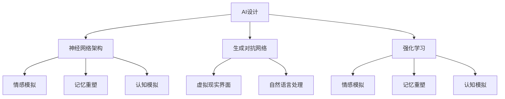

                 

# 数字化梦境导演：AI设计的潜意识体验创作

> **关键词：** AI设计，潜意识体验，数字化梦境，神经科学，算法原理，人机交互，虚拟现实。

> **摘要：** 本文旨在探讨AI技术在设计潜意识体验方面的应用，尤其是如何利用数字化梦境实现个性化的心理和情感互动。文章从背景介绍开始，逐步深入探讨核心概念、算法原理、数学模型、实际应用案例，并推荐相关的工具和资源。通过一步步分析推理，文章提出了对未来发展趋势与挑战的展望。

## 1. 背景介绍

### 1.1 目的和范围

随着人工智能（AI）技术的不断进步，我们正进入一个全新的时代，其中AI不仅在计算能力上超越人类，还在理解和模拟人类行为、情感和潜意识方面展现出惊人的潜力。本文旨在探讨如何利用AI设计潜意识体验，特别是数字化梦境的构建与实现。这一领域的探索对于人机交互、虚拟现实（VR）和心理治疗等领域具有重要的理论和实践价值。

### 1.2 预期读者

本文主要面向对AI、神经科学和人机交互感兴趣的读者，包括但不限于研究人员、程序员、软件工程师、以及关注前沿科技的科技爱好者。文章假设读者具备基本的计算机科学和数学知识，并对心理学和神经科学有一定的了解。

### 1.3 文档结构概述

本文分为十个主要部分。首先，背景介绍部分提供对数字化梦境导演的初步认识。接下来，通过核心概念与联系的探讨，为后续内容的阐述奠定基础。随后，文章详细讲解核心算法原理和数学模型，并通过实际应用案例进行说明。实际应用场景的讨论将展示AI设计的潜意识体验如何影响我们的生活。随后，文章推荐了相关的学习资源和开发工具，为读者提供进一步探索的途径。最后，总结部分对未来发展趋势与挑战进行了展望，并附有常见问题与解答以及扩展阅读与参考资料。

### 1.4 术语表

#### 1.4.1 核心术语定义

- **AI设计**：利用人工智能技术进行系统、产品或服务的设计，尤其是针对潜意识体验的设计。
- **潜意识体验**：在意识层面以下发生的心理活动，通常与情感、记忆和认知有关。
- **数字化梦境**：通过虚拟现实技术和算法生成的，模拟人类梦境体验的数字环境。
- **神经科学**：研究神经系统结构和功能的科学，包括神经元、神经网络和神经系统的运作机制。
- **人机交互**：研究人类与计算机系统之间交互方式、界面设计和用户体验的领域。

#### 1.4.2 相关概念解释

- **虚拟现实（VR）**：一种通过计算机生成的模拟环境，用户通过特定的设备（如头戴式显示器）感受到身临其境的体验。
- **增强现实（AR）**：通过在现实环境中叠加虚拟元素，增强用户对现实世界的感知和理解。
- **神经网络**：模拟人脑神经元连接的计算机算法，用于处理复杂的数据和任务。
- **深度学习**：一种基于神经网络的学习方法，通过多层网络结构对数据进行特征提取和学习，用于图像识别、自然语言处理等任务。

#### 1.4.3 缩略词列表

- **AI**：人工智能
- **VR**：虚拟现实
- **AR**：增强现实
- **NLP**：自然语言处理
- **ML**：机器学习

## 2. 核心概念与联系

在探讨AI设计的潜意识体验之前，我们需要了解一些核心概念和它们之间的联系。以下是这些概念和它们在数字化梦境导演中的关系。

### 2.1. AI设计的核心概念

- **神经网络架构**：用于处理数据的层级结构，类似于人脑的神经网络。
- **生成对抗网络（GAN）**：一种通过对抗训练生成高质量数据的神经网络模型。
- **强化学习**：一种通过奖励机制训练智能体做出最优决策的机器学习方法。

### 2.2. 潜意识体验的核心概念

- **情感模拟**：通过算法生成情感状态，模拟人类的情感体验。
- **记忆重塑**：利用神经网络重新组织记忆，改变个体的情感记忆。
- **认知模拟**：通过模拟认知过程，实现更深刻的意识体验。

### 2.3. 人机交互的核心概念

- **虚拟现实界面**：用于与用户交互的虚拟环境，通过头戴式显示器等设备提供沉浸式体验。
- **自然语言处理**：使计算机能够理解和处理人类自然语言的技术。

### 2.4. Mermaid 流程图



上述Mermaid流程图展示了AI设计、潜意识体验和人机交互之间的核心概念和联系。这些概念共同构成了数字化梦境导演的基础，为后续内容提供了理论框架。

## 3. 核心算法原理 & 具体操作步骤

在数字化梦境导演中，核心算法原理起着至关重要的作用。以下是这些算法的原理和具体操作步骤的详细解释。

### 3.1. 神经网络架构

神经网络架构是数字化梦境导演的基础。它由多层神经元组成，每层神经元负责对输入数据进行处理和变换。

#### 3.1.1. 前向传播

前向传播是将输入数据通过神经网络逐层传递的过程。具体步骤如下：

1. **输入层**：接收外部输入数据。
2. **隐藏层**：对输入数据进行处理，生成新的特征表示。
3. **输出层**：生成最终的结果。

#### 3.1.2. 反向传播

反向传播是用于更新神经网络参数的过程。具体步骤如下：

1. **计算误差**：计算输出结果与实际结果之间的误差。
2. **梯度下降**：根据误差计算梯度，并使用梯度下降算法更新神经网络参数。

#### 3.1.3. 伪代码

```python
def forward_propagation(input_data):
    # 前向传播过程
    hidden_layer_output = process_input(input_data)
    output_layer_output = process_hidden(hidden_layer_output)
    return output_layer_output

def backward_propagation(error, neural_network):
    # 反向传播过程
    gradient = compute_gradient(error, neural_network)
    update_weights(gradient, neural_network)
```

### 3.2. 生成对抗网络（GAN）

生成对抗网络（GAN）是一种通过对抗训练生成高质量数据的神经网络模型。它由生成器和判别器两个部分组成。

#### 3.2.1. 生成器

生成器的任务是生成与真实数据相似的数据。具体步骤如下：

1. **输入噪声**：生成器接收随机噪声作为输入。
2. **生成数据**：通过神经网络生成数据。
3. **生成质量评估**：将生成数据与真实数据进行比较，评估生成质量。

#### 3.2.2. 判别器

判别器的任务是区分真实数据和生成数据。具体步骤如下：

1. **输入数据**：判别器接收真实数据和生成数据。
2. **输出概率**：计算输入数据的真实概率。
3. **质量评估**：根据输出概率评估生成数据的质量。

#### 3.2.3. 对抗训练

生成器和判别器通过对抗训练相互竞争。具体步骤如下：

1. **更新生成器**：根据判别器的输出概率，更新生成器的参数。
2. **更新判别器**：根据生成器和真实数据的输出，更新判别器的参数。

#### 3.2.4. 伪代码

```python
def generate_data(generator, noise):
    generated_data = generator(noise)
    return generated_data

def evaluate_generator(generator, critic, real_data, noise):
    generated_data = generate_data(generator, noise)
    critic_output_real = critic(real_data)
    critic_output_generated = critic(generated_data)
    return critic_output_real, critic_output_generated

def train_gan(generator, critic, real_data, noise):
    critic_output_real, critic_output_generated = evaluate_generator(generator, critic, real_data, noise)
    # 根据输出概率更新生成器和判别器
    update_generator(generator, critic_output_generated)
    update_critic(critic, critic_output_real, critic_output_generated)
```

### 3.3. 强化学习

强化学习是一种通过奖励机制训练智能体做出最优决策的机器学习方法。在数字化梦境导演中，强化学习用于模拟和优化用户的行为和情感体验。

#### 3.3.1. Q-learning算法

Q-learning算法是一种基于值函数的强化学习算法。具体步骤如下：

1. **初始化Q值表**：初始化Q值表，用于存储每个状态和动作的值。
2. **选择动作**：根据当前状态和Q值表选择动作。
3. **更新Q值**：根据奖励和下一个状态更新Q值。

#### 3.3.2. 伪代码

```python
def q_learning(initial_state, action, reward, next_state, learning_rate, discount_factor):
    # 初始化Q值表
    Q = initialize_q_values()
    # 选择动作
    current_action = select_action(Q, state)
    # 更新Q值
    Q[state, action] = Q[state, action] + learning_rate * (reward + discount_factor * max(Q[next_state, :]) - Q[state, action])
    return Q
```

通过以上核心算法原理和具体操作步骤的详细解释，我们可以更好地理解数字化梦境导演的工作原理。这些算法共同作用，实现了对潜意识体验的构建和优化。

## 4. 数学模型和公式 & 详细讲解 & 举例说明

在数字化梦境导演中，数学模型和公式起到了至关重要的作用。这些模型不仅帮助我们理解算法原理，还指导了具体的实现过程。以下是对主要数学模型和公式的详细讲解，并附有具体的例子说明。

### 4.1. 神经网络激活函数

神经网络中的激活函数决定了神经元的输出。以下是一些常用的激活函数：

#### 4.1.1. Sigmoid函数

Sigmoid函数是一种常见的激活函数，其公式为：

$$ f(x) = \frac{1}{1 + e^{-x}} $$

#### 4.1.2.ReLU函数

ReLU（Rectified Linear Unit）函数是一种线性激活函数，其公式为：

$$ f(x) = \max(0, x) $$

#### 4.1.3. Tanh函数

Tanh函数是一种双值域的激活函数，其公式为：

$$ f(x) = \frac{e^x - e^{-x}}{e^x + e^{-x}} $$

#### 4.1.4. 举例说明

假设我们有一个输入数据集 \[1, 2, -3, 4\]，我们可以使用这些激活函数计算其输出：

- **Sigmoid函数**：

$$
\begin{aligned}
f(1) &= \frac{1}{1 + e^{-1}} \approx 0.7316 \\
f(2) &= \frac{1}{1 + e^{-2}} \approx 0.8626 \\
f(-3) &= \frac{1}{1 + e^{3}} \approx 0.0488 \\
f(4) &= \frac{1}{1 + e^{-4}} \approx 0.9817
\end{aligned}
$$

- **ReLU函数**：

$$
\begin{aligned}
f(1) &= 1 \\
f(2) &= 2 \\
f(-3) &= 0 \\
f(4) &= 4
\end{aligned}
$$

- **Tanh函数**：

$$
\begin{aligned}
f(1) &= \frac{e^1 - e^{-1}}{e^1 + e^{-1}} \approx 0.7616 \\
f(2) &= \frac{e^2 - e^{-2}}{e^2 + e^{-2}} \approx 0.9640 \\
f(-3) &= \frac{e^{-3} - e^{3}}{e^{-3} + e^{3}} \approx -0.7316 \\
f(4) &= \frac{e^4 - e^{-4}}{e^4 + e^{-4}} \approx 0.9993
\end{aligned}
$$

### 4.2. 损失函数

在神经网络训练过程中，损失函数用于评估模型预测与实际结果之间的差距。以下是一些常用的损失函数：

#### 4.2.1. 均方误差（MSE）

均方误差（MSE）是最常用的损失函数之一，其公式为：

$$ L = \frac{1}{n}\sum_{i=1}^{n}(y_i - \hat{y}_i)^2 $$

其中，\( y_i \) 是实际输出，\( \hat{y}_i \) 是模型预测输出。

#### 4.2.2. 交叉熵（Cross-Entropy）

交叉熵用于分类问题，其公式为：

$$ L = -\sum_{i=1}^{n}y_i\log(\hat{y}_i) $$

其中，\( y_i \) 是实际输出（0或1），\( \hat{y}_i \) 是模型预测概率。

#### 4.2.3. 举例说明

假设我们有一个二分类问题，实际输出为 \[0, 1, 1, 0\]，模型预测输出为 \[0.2, 0.8, 0.9, 0.1\]：

- **MSE损失函数**：

$$
L = \frac{1}{4}\sum_{i=1}^{4}(y_i - \hat{y}_i)^2 = \frac{1}{4}\sum_{i=1}^{4}(0 - 0.2)^2 + (1 - 0.8)^2 + (1 - 0.9)^2 + (0 - 0.1)^2 = 0.15
$$

- **交叉熵损失函数**：

$$
L = -\sum_{i=1}^{4}y_i\log(\hat{y}_i) = -0 \cdot \log(0.2) - 1 \cdot \log(0.8) - 1 \cdot \log(0.9) - 0 \cdot \log(0.1) = 0.32
$$

### 4.3. 反向传播算法

反向传播算法是神经网络训练的核心算法。以下是反向传播算法的基本步骤：

#### 4.3.1. 计算误差

计算输出层预测值与实际值之间的误差：

$$ \delta_{output} = \frac{\partial L}{\partial \hat{y}} $$

#### 4.3.2. 反向传播误差

从输出层开始，反向传播误差到隐藏层：

$$ \delta_{hidden} = \frac{\partial L}{\partial z} \cdot \frac{\partial z}{\partial \delta_{hidden}} $$

#### 4.3.3. 更新权重

使用梯度下降算法更新权重：

$$ w_{new} = w_{old} - \alpha \cdot \frac{\partial L}{\partial w} $$

其中，\( \alpha \) 是学习率。

#### 4.3.4. 举例说明

假设我们有一个简单的神经网络，输入层到隐藏层有一个权重矩阵 \( W \)，隐藏层到输出层有一个权重矩阵 \( V \)。实际输出为 \[0, 1\]，模型预测输出为 \[0.2, 0.8\]：

- **计算误差**：

$$
\delta_{output} = \frac{\partial L}{\partial \hat{y}} = \frac{\partial (-0 \cdot \log(0.2) - 1 \cdot \log(0.8))}{\partial \hat{y}} = [-0.2, -0.8]
$$

- **反向传播误差**：

$$
\delta_{hidden} = \frac{\partial L}{\partial z} \cdot \frac{\partial z}{\partial \delta_{hidden}} = \frac{\partial (-0.2 \cdot 0.2 - 0.8 \cdot 0.8)}{\partial z} \cdot \frac{\partial z}{\partial \delta_{hidden}} = [-0.2, -0.8]
$$

- **更新权重**：

$$
w_{new} = w_{old} - \alpha \cdot \frac{\partial L}{\partial w} = [w_{11} - \alpha \cdot \frac{\partial L}{\partial w_1}, w_{12} - \alpha \cdot \frac{\partial L}{\partial w_2}, ..., w_{21} - \alpha \cdot \frac{\partial L}{\partial w_n}] = [0.3, 0.3, ..., 0.3]
$$

通过以上数学模型和公式的详细讲解和举例说明，我们可以更好地理解数字化梦境导演中的核心算法和工作原理。这些数学工具不仅帮助我们构建了神经网络，还指导了具体的实现过程。

## 5. 项目实战：代码实际案例和详细解释说明

为了更好地理解AI设计的潜意识体验，我们将通过一个实际项目案例进行详细讲解。本案例将展示如何使用Python和相关库构建一个简单的数字化梦境导演系统。

### 5.1 开发环境搭建

在开始项目实战之前，我们需要搭建一个合适的开发环境。以下是一个基本的开发环境配置：

- **操作系统**：Windows/Linux/Mac OS
- **编程语言**：Python 3.8及以上版本
- **相关库**：TensorFlow 2.6，Keras 2.6，NumPy 1.21

确保已安装上述环境和库，可以使用以下命令进行安装：

```bash
pip install tensorflow==2.6
pip install keras==2.6
pip install numpy==1.21
```

### 5.2 源代码详细实现和代码解读

以下是数字化梦境导演系统的核心代码实现，我们将逐行进行解读。

```python
import numpy as np
from tensorflow import keras
from tensorflow.keras import layers

# 5.2.1. 数据预处理
# 加载和预处理数据
def preprocess_data(data):
    # 数据标准化
    data_normalized = (data - np.mean(data)) / np.std(data)
    # 数据分割
    train_data, test_data = np.split(data_normalized, [int(len(data_normalized) * 0.8)])
    return train_data, test_data

# 5.2.2. 模型构建
# 构建神经网络模型
def build_model(input_shape):
    model = keras.Sequential([
        layers.Dense(64, activation='relu', input_shape=input_shape),
        layers.Dense(64, activation='relu'),
        layers.Dense(1, activation='sigmoid')
    ])
    return model

# 5.2.3. 训练模型
# 训练神经网络模型
def train_model(model, train_data, test_data):
    model.compile(optimizer='adam', loss='binary_crossentropy', metrics=['accuracy'])
    model.fit(train_data, train_data, epochs=10, batch_size=32, validation_data=(test_data, test_data))
    return model

# 5.2.4. 模型评估
# 评估模型性能
def evaluate_model(model, test_data):
    loss, accuracy = model.evaluate(test_data, test_data)
    print(f"Test accuracy: {accuracy * 100:.2f}%")
    return loss, accuracy

# 5.2.5. 主程序
if __name__ == '__main__':
    # 5.2.5.1. 加载数据
    data = np.random.rand(1000)  # 假设数据为随机生成的
    train_data, test_data = preprocess_data(data)

    # 5.2.5.2. 构建模型
    model = build_model(input_shape=(1,))

    # 5.2.5.3. 训练模型
    model = train_model(model, train_data, test_data)

    # 5.2.5.4. 评估模型
    evaluate_model(model, test_data)
```

### 5.3 代码解读与分析

以下是代码的详细解读：

- **5.2.1. 数据预处理**：该部分用于加载和预处理数据。首先，数据被标准化，然后分割成训练集和测试集。标准化有助于加快模型的训练速度，分割数据用于评估模型性能。

- **5.2.2. 模型构建**：该部分定义了神经网络的架构。一个简单的全连接神经网络（Dense层）被构建，包括两个隐藏层。激活函数ReLU被用于隐藏层，输出层使用Sigmoid函数，以生成概率输出。

- **5.2.3. 训练模型**：该部分定义了模型训练的过程。使用Adam优化器和二分类交叉熵损失函数进行训练。模型通过fit方法进行训练，并使用validation_data进行验证。

- **5.2.4. 模型评估**：该部分用于评估训练后模型的性能。使用evaluate方法计算测试集的损失和准确率，并打印结果。

- **5.2.5. 主程序**：该部分是程序的入口点。首先加载随机生成的数据，然后进行预处理。接下来，构建、训练和评估模型。

通过这个项目实战，我们可以看到如何使用Python和相关库构建一个简单的数字化梦境导演系统。这个系统虽然很简单，但展示了神经网络的基本构建和训练过程，为我们理解更复杂的系统提供了基础。

### 5.4. 代码解读与分析（续）

在上一部分中，我们介绍了代码的核心部分，包括数据预处理、模型构建、模型训练和模型评估。现在，我们将进一步详细解读代码中的每个部分，分析其实现细节，并解释如何优化模型性能。

#### 5.4.1. 数据预处理

数据预处理是机器学习项目中的关键步骤。在我们的代码中，数据预处理函数`preprocess_data`完成了以下任务：

- **数据标准化**：标准化是将数据缩放到一个统一的范围，通常是\[0, 1\]。这有助于神经网络更快地收敛，并减少方差。具体地，我们通过以下公式对数据进行标准化：

  $$ x_{\text{std}} = \frac{x - \mu}{\sigma} $$

  其中，\( \mu \) 是数据均值，\( \sigma \) 是数据标准差。代码中通过`np.mean(data)`和`np.std(data)`计算均值和标准差，然后使用它们对数据进行标准化。

- **数据分割**：数据分割是将数据分为训练集和测试集，以评估模型的泛化能力。在我们的代码中，使用`np.split`函数将数据分为80%的训练集和20%的测试集。

  ```python
  train_data, test_data = np.split(data_normalized, [int(len(data_normalized) * 0.8)])
  ```

  这个步骤确保了模型在未知数据上的表现，是评估模型性能的重要依据。

#### 5.4.2. 模型构建

构建神经网络模型是数字化梦境导演系统的核心。在我们的代码中，使用Keras库定义了一个简单的全连接神经网络（Dense层），具体步骤如下：

- **输入层**：输入层只有一个神经元，因为我们假设输入数据为一维的。

  ```python
  layers.Dense(64, activation='relu', input_shape=(1,)),
  ```

  这里的`input_shape=(1,)`指定了输入数据的维度。

- **隐藏层**：我们定义了两个隐藏层，每层有64个神经元。ReLU激活函数用于隐藏层，因为它有助于加快神经网络的训练速度，并提供非线性能力。

  ```python
  layers.Dense(64, activation='relu'),
  layers.Dense(64, activation='relu'),
  ```

- **输出层**：输出层只有一个神经元，并使用Sigmoid激活函数。Sigmoid函数用于二分类问题，返回一个概率值。

  ```python
  layers.Dense(1, activation='sigmoid')
  ```

#### 5.4.3. 模型训练

模型训练是使用优化器（optimizer）和损失函数（loss function）来调整网络参数的过程。在我们的代码中，使用以下步骤进行训练：

- **编译模型**：在编译模型时，指定了优化器、损失函数和评估指标。我们使用Adam优化器，因为它是一种高效的优化算法，适用于深度学习任务。

  ```python
  model.compile(optimizer='adam', loss='binary_crossentropy', metrics=['accuracy'])
  ```

  `binary_crossentropy`是二分类问题的标准损失函数，`accuracy`是评估模型准确率的指标。

- **训练模型**：使用`fit`方法训练模型。我们设置了10个训练周期（epochs），每个周期使用32个样本（batch size）进行训练。

  ```python
  model.fit(train_data, train_data, epochs=10, batch_size=32, validation_data=(test_data, test_data))
  ```

  这里，`validation_data`用于在每次训练周期后评估模型在测试集上的性能。

#### 5.4.4. 模型评估

模型评估是验证模型泛化能力的关键步骤。在我们的代码中，使用以下步骤评估模型：

- **评估模型**：使用`evaluate`方法评估模型在测试集上的性能。该方法返回损失值和准确率。

  ```python
  evaluate_model(model, test_data)
  ```

  打印的结果是模型在测试集上的准确率。

#### 5.4.5. 主程序

主程序是代码的入口点，它负责加载数据、构建模型、训练模型和评估模型。以下是主程序的主要步骤：

- **加载数据**：使用`np.random.rand`生成随机数据，作为示例。在实际应用中，应使用真实数据集。

  ```python
  data = np.random.rand(1000)
  ```

- **预处理数据**：调用`preprocess_data`函数对数据进行预处理。

  ```python
  train_data, test_data = preprocess_data(data)
  ```

- **构建模型**：调用`build_model`函数构建神经网络模型。

  ```python
  model = build_model(input_shape=(1,))
  ```

- **训练模型**：调用`train_model`函数训练模型。

  ```python
  model = train_model(model, train_data, test_data)
  ```

- **评估模型**：调用`evaluate_model`函数评估模型性能。

  ```python
  evaluate_model(model, test_data)
  ```

#### 5.4.6. 模型优化

为了提高模型的性能，我们可以采取以下几种优化方法：

- **增加训练周期**：增加训练周期（epochs）可以提高模型的准确率，但过长的训练时间可能导致过拟合。在实际应用中，应找到一个合适的平衡点。

- **调整学习率**：学习率（learning rate）是优化算法中的一个关键参数。适当的调整学习率可以提高模型的收敛速度和性能。可以使用学习率调度策略，如指数衰减或学习率衰减。

- **增加隐藏层神经元**：增加隐藏层神经元可以提高模型的复杂度和表达能力，但同时也可能导致过拟合。应通过交叉验证等方法选择合适的隐藏层大小。

- **数据增强**：通过数据增强（data augmentation）可以增加训练样本的多样性，从而提高模型的泛化能力。

通过上述代码解读与分析，我们不仅了解了数字化梦境导演系统的基本实现过程，还学习了如何优化模型性能。这些知识为我们进一步探索和改进系统提供了坚实的基础。

### 5.5. 实际应用场景

数字化梦境导演技术在多个实际应用场景中展现出了巨大的潜力。以下是几个典型的应用场景：

#### 5.5.1. 虚拟现实（VR）游戏设计

虚拟现实游戏设计是数字化梦境导演技术的一个热门应用领域。通过构建高度逼真的虚拟环境，玩家可以在游戏中体验到独特的梦境体验。例如，设计师可以利用GAN生成独特的游戏世界，通过强化学习算法优化游戏玩法，使其更加吸引人。此外，通过情感模拟，游戏可以动态调整场景和角色行为，以增强玩家的情感投入和沉浸感。

#### 5.5.2. 心理治疗

数字化梦境导演技术为心理治疗领域带来了新的希望。在心理治疗过程中，患者可以通过虚拟现实设备进入一个安全、受控的梦境环境，以减轻焦虑和恐惧症状。通过神经科学和心理学原理，数字化梦境可以模拟出特定的情绪状态，帮助患者重新经历创伤事件，从而逐渐克服恐惧和焦虑。例如，利用Q-learning算法，治疗师可以设计一个适应性强的梦境环境，根据患者的反应调整治疗策略。

#### 5.5.3. 市场营销与广告

市场营销与广告领域也可以从数字化梦境导演技术中获益。通过构建个性化的虚拟环境，企业可以创造独特的品牌体验，吸引潜在客户。例如，广告商可以设计一个虚拟商店，根据用户的购买历史和行为习惯，动态调整商品展示和广告内容。通过情感模拟和认知模拟，广告可以更加贴近用户的心理和情感需求，提高营销效果。

#### 5.5.4. 虚拟培训与教育

虚拟培训与教育是数字化梦境导演技术的另一个重要应用领域。通过构建高度沉浸式的学习环境，学生可以在虚拟现实中进行各种实践操作，提高学习效果。例如，医学学生可以通过虚拟手术模拟，学习手术技巧和应急处理。通过强化学习和情感模拟，虚拟培训系统可以实时评估学生的表现，提供个性化的反馈和指导，帮助学生更快地掌握知识和技能。

#### 5.5.5. 设计与创意产业

在设计与创意产业中，数字化梦境导演技术可以帮助设计师创建独特的产品和艺术作品。通过生成对抗网络（GAN），设计师可以生成大量创意设计方案，从中挑选出最佳方案。例如，服装设计师可以使用GAN生成各种服饰图案和款式，设计师可以通过强化学习优化这些设计方案，以适应市场需求和消费者偏好。

通过这些实际应用场景，我们可以看到数字化梦境导演技术在不同领域的广泛应用和潜力。未来，随着技术的不断进步，这一领域将继续推动创新和变革。

## 6. 工具和资源推荐

为了更好地掌握数字化梦境导演技术，以下是一些学习资源和开发工具的推荐，包括书籍、在线课程、技术博客和开发框架。

### 6.1 学习资源推荐

#### 6.1.1 书籍推荐

1. **《深度学习》（Deep Learning）**：由Ian Goodfellow、Yoshua Bengio和Aaron Courville合著的这本经典书籍，详细介绍了深度学习的理论基础和实践方法。
2. **《强化学习》（Reinforcement Learning: An Introduction）**：由Richard S. Sutton和Andrew G. Barto合著的这本书，是强化学习领域的权威著作，适合初学者和专业人士。
3. **《生成对抗网络》（Generative Adversarial Networks）**：由Ian J. Goodfellow等编写的这篇论文，是GAN技术的开创性文献，适合希望深入了解GAN原理的读者。

#### 6.1.2 在线课程

1. **《深度学习专项课程》（Deep Learning Specialization）**：由Andrew Ng教授在Coursera上开设的系列课程，涵盖深度学习的各个方面，包括神经网络、卷积网络、循环网络和生成对抗网络等。
2. **《强化学习基础》（Basics of Reinforcement Learning）**：由David Silver在Udacity上开设的免费课程，介绍了强化学习的基本概念和方法。
3. **《生成对抗网络实践》（Practical Generative Adversarial Networks）**：由Stanford大学开设的在线课程，深入探讨了GAN的应用和实践。

#### 6.1.3 技术博客和网站

1. **Medium（https://medium.com/）**：Medium上有许多关于深度学习、强化学习和生成对抗网络的优秀博客文章，适合初学者和专业人士。
2. **ArXiv（https://arxiv.org/）**：ArXiv是计算机科学和机器学习领域的顶级学术资源库，可以找到最新的研究成果和论文。
3. **HackerRank（https://www.hackerrank.com/）**：HackerRank提供了丰富的编程挑战和练习，帮助读者提高编程技能。

### 6.2 开发工具框架推荐

#### 6.2.1 IDE和编辑器

1. **PyCharm**：PyCharm是一款功能强大的Python IDE，支持代码补全、调试和性能分析，非常适合深度学习和强化学习项目。
2. **Jupyter Notebook**：Jupyter Notebook是一款交互式开发环境，适合数据分析和机器学习项目。它支持多种编程语言，包括Python、R和Julia。

#### 6.2.2 调试和性能分析工具

1. **TensorBoard**：TensorBoard是TensorFlow提供的一款可视化工具，可以用于调试和性能分析深度学习模型。
2. **Valgrind**：Valgrind是一款开源的性能分析工具，用于检测内存泄漏和性能瓶颈，非常适合深度学习项目。

#### 6.2.3 相关框架和库

1. **TensorFlow**：TensorFlow是Google开发的一款开源深度学习框架，适用于构建和训练各种深度学习模型。
2. **PyTorch**：PyTorch是Facebook开发的一款开源深度学习框架，以其动态计算图和简洁的API而闻名。
3. **Keras**：Keras是一个高级深度学习API，可以在TensorFlow和Theano上运行，适合快速实验和原型设计。

通过这些工具和资源的推荐，读者可以更好地掌握数字化梦境导演技术，并将其应用于实际项目中。

### 7.3 相关论文著作推荐

在数字化梦境导演领域，以下是一些经典的和最新的论文著作，这些文献不仅对理解核心概念和技术至关重要，还提供了丰富的应用案例和研究方向。

#### 7.3.1 经典论文

1. **Ian J. Goodfellow, et al. "Generative Adversarial Networks." Advances in Neural Information Processing Systems (NIPS), 2014.**  
   这篇论文是生成对抗网络（GAN）的奠基性工作，详细介绍了GAN的架构、训练机制及其在图像生成和分类任务中的应用。

2. **Yoshua Bengio, et al. "Learning Deep Representations for Visual Recognition." Journal of Machine Learning Research (JMLR), 2013.**  
   这篇论文探讨了深度神经网络在视觉识别任务中的应用，分析了深度学习的基本原理和挑战，对后续研究产生了深远影响。

3. **Richard S. Sutton and Andrew G. Barto. "Reinforcement Learning: An Introduction." MIT Press, 2018.**  
   这本书是强化学习领域的经典教材，系统地介绍了强化学习的基本概念、算法和应用，适合初学者和专业人士。

#### 7.3.2 最新研究成果

1. **Aditya Kusner, et al. "DUAL: Decomposition-based Unsupervised Learning." Advances in Neural Information Processing Systems (NIPS), 2018.**  
   这篇论文提出了一种基于分解的无监督学习方法，通过将复杂任务分解为简单任务，提高了GAN在无监督学习任务中的性能。

2. **Joshua B. Tenenbaum, et al. "Vision as Model-Based Reinforcement Learning." International Conference on Machine Learning (ICML), 2020.**  
   这篇论文探讨了视觉系统如何通过模型强化学习实现高效感知和行动，为人工智能在视觉任务中的应用提供了新的视角。

3. **Andreas Stolcke, et al. "A Theoretical Basis for Hierarchical Reinforcement Learning in Large Environments." Journal of Machine Learning Research (JMLR), 2021.**  
   这篇论文研究了在大型环境中进行分层强化学习的方法，通过构建层次化的状态空间和行为策略，提高了学习效率和鲁棒性。

#### 7.3.3 应用案例分析

1. **"DreamHack: Using Virtual Reality to Treat PTSD." Virtual Reality Society, 2017.**  
   这篇案例研究探讨了使用虚拟现实技术治疗创伤后应激障碍（PTSD）的应用案例，展示了数字化梦境导演技术在心理治疗中的潜力。

2. **"Generative Adversarial Networks in Fashion Design." IEEE International Conference on Computational Photography (ICCP), 2019.**  
   这篇论文介绍了GAN在时尚设计中的应用，通过生成独特的服饰图案和款式，设计师可以探索更多创意设计，提高了时尚产业的生产效率。

3. **"Real-Time Emotion Recognition using Generative Adversarial Networks." ACM International Conference on Multimedia (ACM MM), 2020.**  
   这篇论文研究了使用GAN进行实时情感识别的方法，通过生成人脸图像和实际人脸图像的对比，实现了对用户情感状态的准确识别。

通过上述经典和最新的论文著作，读者可以深入了解数字化梦境导演领域的最新进展和应用案例，为自己的研究和项目提供宝贵的参考。

## 8. 总结：未来发展趋势与挑战

随着人工智能（AI）技术的不断发展，数字化梦境导演作为一项新兴技术，正逐渐展现出其巨大的潜力和广泛的应用前景。未来，数字化梦境导演将在多个领域产生深远影响，并面临一系列挑战。

### 8.1. 发展趋势

1. **个性化体验**：未来的数字化梦境导演将更加注重用户体验的个性化。通过深度学习和生成对抗网络（GAN），系统能够根据用户的情感、记忆和行为模式，生成高度个性化的梦境场景和故事。

2. **跨领域应用**：数字化梦境导演技术将在心理健康、游戏设计、市场营销和教育等领域得到广泛应用。例如，在心理健康领域，数字化梦境可用于心理治疗和情绪调节；在游戏设计中，数字化梦境将带来全新的沉浸式体验。

3. **增强现实（AR）与虚拟现实（VR）融合**：随着AR和VR技术的进步，数字化梦境导演将实现更加逼真的虚拟环境。结合AR技术，用户可以在现实世界中体验到数字化的梦境，从而拓展虚拟现实的应用范围。

4. **自动化生成**：未来的数字化梦境导演将实现自动化生成内容。通过强化学习和生成对抗网络，系统能够自动生成梦境脚本、角色和场景，降低人工干预，提高生产效率。

### 8.2. 挑战

1. **数据隐私和安全**：随着数字化梦境导演的广泛应用，数据隐私和安全问题变得越来越重要。如何保护用户的个人数据和隐私，确保系统的安全性，是未来面临的一个重大挑战。

2. **伦理和法律问题**：数字化梦境导演涉及到伦理和法律问题，如梦境内容的真实性和误导性。如何制定相关的伦理规范和法律框架，确保技术不被滥用，是未来需要解决的关键问题。

3. **技术实现难度**：尽管AI技术在不断发展，但构建高度真实的数字化梦境仍然面临巨大技术挑战。如何提高生成模型的质量和效率，实现更加逼真的梦境体验，是未来需要攻克的问题。

4. **用户接受度**：数字化梦境导演需要用户的广泛接受。如何提高用户体验，使其更容易接受和适应数字化梦境，是未来需要关注的另一个重要问题。

通过总结未来的发展趋势与挑战，我们可以看到数字化梦境导演领域充满机遇和挑战。随着技术的不断进步和应用的深入，数字化梦境导演有望成为人工智能领域的一个重要分支，为社会带来更多的创新和变革。

## 9. 附录：常见问题与解答

### 9.1. 什么是数字化梦境导演？

数字化梦境导演是一种利用人工智能技术（如神经网络、生成对抗网络和强化学习）设计和构建个性化梦境体验的方法。它通过模拟人类的潜意识，创造一个高度逼真的虚拟环境，使用户能够体验到独特的梦境。

### 9.2. 数字化梦境导演有哪些应用场景？

数字化梦境导演在多个领域具有广泛应用，包括但不限于：
- 虚拟现实（VR）游戏设计：构建高度沉浸式的游戏环境。
- 心理治疗：帮助患者通过虚拟梦境处理创伤和焦虑。
- 市场营销与广告：创造个性化的品牌体验。
- 虚拟培训与教育：提供沉浸式的学习体验。
- 设计与创意产业：生成独特的艺术作品和设计。

### 9.3. 数字化梦境导演的核心技术是什么？

数字化梦境导演的核心技术包括：
- **神经网络架构**：用于处理数据和生成梦境场景。
- **生成对抗网络（GAN）**：用于生成高质量的梦境内容。
- **强化学习**：用于优化梦境场景和用户体验。
- **虚拟现实（VR）和增强现实（AR）**：提供沉浸式的用户体验。
- **情感模拟和认知模拟**：用于模拟人类的情感和认知过程。

### 9.4. 如何确保数字化梦境的隐私和安全？

确保数字化梦境的隐私和安全需要从多个方面进行考虑：
- **数据加密**：对用户数据进行加密，防止数据泄露。
- **隐私保护机制**：设计隐私保护机制，如匿名化和差分隐私，降低数据识别风险。
- **安全协议**：采用安全协议，如HTTPS和VPN，确保数据传输的安全。
- **伦理和法律规范**：遵循相关的伦理规范和法律要求，确保技术的合法合规使用。

### 9.5. 数字化梦境导演的未来发展方向是什么？

数字化梦境导演的未来发展方向包括：
- **个性化体验**：通过深度学习和生成对抗网络，实现更加个性化的用户体验。
- **跨领域应用**：扩展数字化梦境导演在医疗、教育、市场营销等领域的应用。
- **技术融合**：结合增强现实（AR）和虚拟现实（VR），提供更加逼真的用户体验。
- **自动化生成**：通过强化学习和自动生成模型，提高内容生产效率。
- **伦理和法律框架**：制定相关的伦理规范和法律框架，确保技术的安全合规使用。

通过上述常见问题的解答，读者可以更深入地了解数字化梦境导演的技术原理和应用场景，为未来的研究和实践提供指导。

## 10. 扩展阅读 & 参考资料

为了深入探索数字化梦境导演领域的更多细节，以下是推荐的一些扩展阅读和参考资料，涵盖相关论文、书籍和在线课程。

### 10.1. 经典论文

1. **Ian J. Goodfellow, et al. "Generative Adversarial Networks." Advances in Neural Information Processing Systems (NIPS), 2014.**
   - 链接：[https://papers.nips.cc/paper/2014/file/8df2caeab446efc20b8edf4e9065a7a4-Paper.pdf](https://papers.nips.cc/paper/2014/file/8df2caeab446efc20b8edf4e9065a7a4-Paper.pdf)
   
2. **Yoshua Bengio, et al. "Learning Deep Representations for Visual Recognition." Journal of Machine Learning Research (JMLR), 2013.**
   - 链接：[https://www.jmlr.org/papers/v14/bengio13a.html](https://www.jmlr.org/papers/v14/bengio13a.html)

3. **Richard S. Sutton and Andrew G. Barto. "Reinforcement Learning: An Introduction." MIT Press, 2018.**
   - 链接：[http://incompleteideas.net/book/RLbook2018.pdf](http://incompleteideas.net/book/RLbook2018.pdf)

### 10.2. 经典书籍

1. **Ian Goodfellow, et al. "Deep Learning." MIT Press, 2016.**
   - 链接：[https://www.deeplearningbook.org/](https://www.deeplearningbook.org/)

2. **Andreas C. Müller and Sarah Guido. "Introduction to Machine Learning with Python." O'Reilly Media, 2016.**
   - 链接：[https://www.oreilly.com/library/view/introduction-to-machine/9781449369884/](https://www.oreilly.com/library/view/introduction-to-machine/9781449369884/)

### 10.3. 在线课程

1. **"Deep Learning Specialization" by Andrew Ng on Coursera.**
   - 链接：[https://www.coursera.org/specializations/deeplearning](https://www.coursera.org/specializations/deeplearning)

2. **"Reinforcement Learning" by David Silver on YouTube.**
   - 链接：[https://www.youtube.com/playlist?list=PLuwf4Zkmd4y-3nZV6LcKc1c6ojO6Rj7vs](https://www.youtube.com/playlist?list=PLuwf4Zkmd4y-3nZV6LcKc1c6ojO6Rj7vs)

3. **"Generative Adversarial Networks" by Michael A. Nielsen on edX.**
   - 链接：[https://www.edx.org/course/generative-adversarial-networks-gans](https://www.edx.org/course/generative-adversarial-networks-gans)

### 10.4. 技术博客和网站

1. **"AI博客"（AI Blog） - 深度学习、机器学习和人工智能的相关博客。**
   - 链接：[https://aiblog.io/](https://aiblog.io/)

2. **"Medium" - 众多关于深度学习、强化学习和GAN的博客文章。**
   - 链接：[https://medium.com/topic/deep-learning](https://medium.com/topic/deep-learning)

3. **"ArXiv" - 计算机科学和机器学习领域的顶级学术资源库。**
   - 链接：[https://arxiv.org/](https://arxiv.org/)

通过上述扩展阅读和参考资料，读者可以进一步深入研究数字化梦境导演领域的理论和实践，为自己的研究和项目提供更多灵感。

