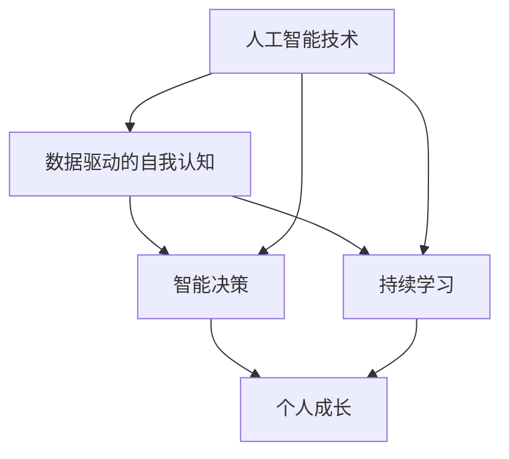

                 

### 文章标题

《数字化自我实现：AI辅助的个人成长》

随着人工智能技术的飞速发展，AI 已成为当今社会最热门的话题之一。本文旨在探讨 AI 如何辅助个人成长，实现数字化自我实现。通过逻辑清晰、结构紧凑的论述，我们将深入探讨这一领域的核心概念、算法原理、数学模型、实战案例以及未来发展趋势。

### 关键词

- 人工智能
- 数字化自我实现
- 个人成长
- AI 辅助
- 算法原理
- 数学模型
- 实战案例

### 摘要

本文首先介绍了人工智能的发展背景及其对个人成长的影响。随后，我们深入探讨了数字化自我实现的定义及其核心概念，包括数据驱动的自我认知、智能决策与持续学习。通过 Mermaid 流程图展示了相关原理和架构。接着，我们详细解析了核心算法原理和数学模型，并以实际项目案例为基础，进行了代码解读与分析。最后，本文探讨了 AI 辅助个人成长的实际应用场景，并推荐了相关学习资源、开发工具和框架。总结部分对未来的发展趋势和挑战进行了展望。

## 1. 背景介绍

### 1.1 目的和范围

本文旨在探讨人工智能（AI）如何辅助个人成长，实现数字化自我实现。随着大数据和云计算的普及，AI 在各个领域的应用日益广泛，包括医疗、金融、教育、娱乐等。本文主要关注 AI 在个人成长方面的应用，探讨如何利用 AI 技术提高个人的认知能力、决策能力和持续学习能力。

### 1.2 预期读者

本文适合对人工智能和数字化自我实现感兴趣的读者，包括 AI 研究人员、软件开发者、数据分析从业者以及广大对个人成长有追求的读者。同时，本文也适合作为高校和研究机构的课程参考材料。

### 1.3 文档结构概述

本文分为十个部分，具体结构如下：

1. 背景介绍
    - 1.1 目的和范围
    - 1.2 预期读者
    - 1.3 文档结构概述
    - 1.4 术语表
2. 核心概念与联系
3. 核心算法原理 & 具体操作步骤
4. 数学模型和公式 & 详细讲解 & 举例说明
5. 项目实战：代码实际案例和详细解释说明
6. 实际应用场景
7. 工具和资源推荐
8. 总结：未来发展趋势与挑战
9. 附录：常见问题与解答
10. 扩展阅读 & 参考资料

### 1.4 术语表

#### 1.4.1 核心术语定义

- **人工智能（AI）**：一种模拟人类智能的技术，能够感知、理解、学习和适应环境。
- **数字化自我实现**：通过数据驱动的自我认知、智能决策与持续学习，实现个人成长和目标实现的过程。
- **数据驱动的自我认知**：利用大数据分析技术，了解自己的行为、情绪、兴趣等信息。
- **智能决策**：基于数据分析和预测模型，做出更合理、更有效的决策。
- **持续学习**：通过不断学习和适应新知识，提高自身能力。

#### 1.4.2 相关概念解释

- **机器学习（ML）**：一种 AI 技术，通过训练模型来从数据中学习规律。
- **深度学习（DL）**：一种基于多层神经网络的人工智能技术，可以自动提取特征并进行复杂模式识别。
- **自然语言处理（NLP）**：一种 AI 技术，使计算机能够理解和处理人类语言。
- **增强学习（RL）**：一种 AI 技术，通过不断试错来学习最佳策略。

#### 1.4.3 缩略词列表

- **AI**：人工智能
- **ML**：机器学习
- **DL**：深度学习
- **NLP**：自然语言处理
- **RL**：增强学习

## 2. 核心概念与联系

### 2.1 人工智能的发展历程

人工智能（AI）的发展可以追溯到 20 世纪 50 年代。当时，科学家们提出了“机器能思考吗？”这一哲学性问题。从最初的规则推理、知识表示，到现代的深度学习、增强学习，人工智能经历了多个阶段。

- **早期 AI（20 世纪 50-70 年代）**：以规则推理为基础，通过编写明确的规则来模拟人类思维。
- **符号 AI（20 世纪 80 年代）**：利用符号逻辑和知识表示来模拟人类思维。
- **连接主义 AI（20 世纪 90 年代）**：基于神经网络，通过模拟人脑神经元之间的连接来学习。
- **深度学习（2010 年至今）**：基于多层神经网络，能够自动提取特征并进行复杂模式识别。
- **增强学习（2010 年至今）**：通过不断试错来学习最佳策略。

### 2.2 人工智能的核心概念

人工智能的核心概念包括机器学习、深度学习、自然语言处理和增强学习。这些技术相互关联，共同构成了人工智能的技术体系。

- **机器学习（ML）**：机器学习是一种 AI 技术，通过训练模型来从数据中学习规律。其基本原理是利用已有数据来构建预测模型，从而对新数据做出预测。
- **深度学习（DL）**：深度学习是一种基于多层神经网络的人工智能技术，可以自动提取特征并进行复杂模式识别。深度学习在图像识别、语音识别等领域取得了显著成果。
- **自然语言处理（NLP）**：自然语言处理是一种 AI 技术，使计算机能够理解和处理人类语言。NLP 技术广泛应用于语音助手、机器翻译等领域。
- **增强学习（RL）**：增强学习是一种 AI 技术，通过不断试错来学习最佳策略。增强学习在游戏、机器人控制等领域具有广泛应用。

### 2.3 人工智能与数字化自我实现的关系

人工智能与数字化自我实现密切相关。数字化自我实现是指通过数据驱动的自我认知、智能决策与持续学习，实现个人成长和目标实现的过程。在这个过程中，人工智能技术发挥着关键作用。

- **数据驱动的自我认知**：人工智能可以通过大数据分析技术，收集和处理个人行为、情绪、兴趣等信息，从而实现数据驱动的自我认知。
- **智能决策**：人工智能可以通过数据分析与预测模型，为个人提供更合理、更有效的决策支持。
- **持续学习**：人工智能可以通过持续学习和适应新知识，帮助个人不断提高自身能力。

### 2.4 核心概念架构

为了更好地理解人工智能与数字化自我实现的关系，我们可以使用 Mermaid 流程图来展示相关概念和架构。



在这个 Mermaid 流程图中，人工智能技术（E）是数字化自我实现（D）的基础，而数据驱动的自我认知（A）、智能决策（B）和持续学习（C）是数字化自我实现的三个核心环节。通过这些环节的相互作用，个人可以不断提高自身能力，实现数字化自我实现。

### 2.5 核心概念与联系总结

本文介绍了人工智能的发展历程、核心概念以及与数字化自我实现的关系。人工智能技术，如机器学习、深度学习、自然语言处理和增强学习，为数字化自我实现提供了技术支持。通过数据驱动的自我认知、智能决策和持续学习，个人可以不断提高自身能力，实现数字化自我实现。接下来，我们将深入探讨人工智能的核心算法原理和数学模型。

## 3. 核心算法原理 & 具体操作步骤

### 3.1 机器学习算法原理

机器学习（ML）是一种使计算机具备学习能力的技术。机器学习算法的核心原理是通过训练模型来从数据中学习规律，从而在新数据上做出预测。以下是机器学习算法的基本原理和步骤：

#### 3.1.1 基本原理

- **特征提取**：从原始数据中提取有用的特征，以便后续处理。
- **模型训练**：利用已知数据集对模型进行训练，使其学会识别数据中的规律。
- **模型评估**：通过评估指标（如准确率、召回率等）评估模型的性能。
- **模型优化**：根据评估结果对模型进行调整，以提高其性能。

#### 3.1.2 操作步骤

1. **数据收集**：收集用于训练的数据集。
2. **数据预处理**：对数据进行清洗、归一化等处理，使其适合训练。
3. **特征提取**：从预处理后的数据中提取有用的特征。
4. **模型选择**：选择合适的机器学习算法，如线性回归、决策树、支持向量机等。
5. **模型训练**：利用训练数据对模型进行训练。
6. **模型评估**：利用验证数据集评估模型的性能。
7. **模型优化**：根据评估结果调整模型参数，以提高性能。

### 3.2 深度学习算法原理

深度学习（DL）是一种基于多层神经网络的人工智能技术，能够自动提取特征并进行复杂模式识别。以下是深度学习算法的基本原理和步骤：

#### 3.2.1 基本原理

- **多层神经网络**：深度学习算法基于多层神经网络，通过逐层提取特征，实现对数据的处理。
- **前向传播**：在神经网络中，信息从输入层经过隐藏层，最终到达输出层。
- **反向传播**：通过计算输出层与实际结果之间的误差，将误差反向传播到隐藏层和输入层，以调整网络权重。
- **优化算法**：利用优化算法（如梯度下降）来调整网络权重，以降低误差。

#### 3.2.2 操作步骤

1. **数据收集**：收集用于训练的数据集。
2. **数据预处理**：对数据进行清洗、归一化等处理。
3. **构建神经网络**：定义神经网络的结构，包括输入层、隐藏层和输出层。
4. **初始化权重**：随机初始化网络权重。
5. **前向传播**：计算输入层到输出层的输出值。
6. **计算损失函数**：计算输出值与实际结果之间的误差。
7. **反向传播**：将误差反向传播到隐藏层和输入层，更新网络权重。
8. **迭代训练**：重复上述步骤，直到满足训练要求。

### 3.3 自然语言处理算法原理

自然语言处理（NLP）是一种使计算机能够理解和处理人类语言的技术。以下是自然语言处理算法的基本原理和步骤：

#### 3.3.1 基本原理

- **分词**：将文本分成词或短语。
- **词性标注**：为每个词分配词性（如名词、动词、形容词等）。
- **句法分析**：分析句子的结构，识别句子中的成分和关系。
- **语义分析**：理解句子的含义，识别句子中的实体和关系。

#### 3.3.2 操作步骤

1. **数据收集**：收集用于训练的数据集。
2. **数据预处理**：对数据进行清洗、归一化等处理。
3. **构建模型**：选择合适的 NLP 模型，如循环神经网络（RNN）、长短时记忆网络（LSTM）、变换器（Transformer）等。
4. **分词与词性标注**：利用分词工具和词性标注工具对文本进行处理。
5. **句法分析**：利用句法分析算法对句子进行结构分析。
6. **语义分析**：利用语义分析算法对句子进行语义理解。

### 3.4 增强学习算法原理

增强学习（RL）是一种使计算机能够通过试错学习最佳策略的技术。以下是增强学习算法的基本原理和步骤：

#### 3.4.1 基本原理

- **状态空间**：环境中的所有可能状态集合。
- **动作空间**：在给定状态下，可以选择的所有动作集合。
- **奖励函数**：根据动作和状态，定义奖励函数，以衡量动作的好坏。
- **策略**：决策规则，用于选择最佳动作。

#### 3.4.2 操作步骤

1. **初始化**：初始化状态、动作空间和奖励函数。
2. **选择动作**：根据当前状态，选择一个动作。
3. **执行动作**：在环境中执行所选动作。
4. **观察结果**：观察执行动作后的状态和奖励。
5. **更新策略**：根据观察结果，更新策略，以选择更好的动作。
6. **迭代**：重复执行动作、观察结果和更新策略，直到满足训练要求。

### 3.5 核心算法原理总结

本文介绍了机器学习、深度学习、自然语言处理和增强学习等核心算法原理。这些算法通过不同的方法实现计算机的学习和推理能力。机器学习算法通过从数据中学习规律进行预测；深度学习算法通过多层神经网络自动提取特征；自然语言处理算法通过分词、词性标注、句法分析和语义分析实现对文本的理解；增强学习算法通过试错学习最佳策略。这些算法原理共同构成了人工智能的技术基础，为数字化自我实现提供了强大的支持。接下来，我们将探讨数字化自我实现的数学模型和公式。

## 4. 数学模型和公式 & 详细讲解 & 举例说明

### 4.1 数学模型概述

在数字化自我实现过程中，数学模型起着至关重要的作用。以下是一些常见的数学模型和公式，我们将对它们进行详细讲解和举例说明。

### 4.2 数学模型 1：线性回归模型

线性回归模型是一种常用的预测模型，用于分析自变量和因变量之间的线性关系。其数学模型如下：

$$
y = \beta_0 + \beta_1x + \epsilon
$$

其中，$y$ 是因变量，$x$ 是自变量，$\beta_0$ 是截距，$\beta_1$ 是斜率，$\epsilon$ 是误差项。

#### 详细讲解：

- **截距 ($\beta_0$)**：表示当自变量 $x$ 为 0 时，因变量 $y$ 的值。
- **斜率 ($\beta_1$)**：表示自变量 $x$ 每增加一个单位，因变量 $y$ 的变化量。
- **误差项 ($\epsilon$)**：表示预测值与实际值之间的差距。

#### 举例说明：

假设我们想预测一个人的月收入（$y$）与年龄（$x$）之间的关系。根据历史数据，我们可以建立以下线性回归模型：

$$
y = 5000 + 1000x + \epsilon
$$

其中，$\beta_0 = 5000$ 表示当年龄为 0 时，月收入为 5000 元；$\beta_1 = 1000$ 表示每增加一岁，月收入增加 1000 元。

### 4.3 数学模型 2：支持向量机（SVM）

支持向量机（SVM）是一种用于分类的机器学习算法。其数学模型如下：

$$
\text{分类函数} : f(x) = \text{sign}(\omega \cdot x + b)
$$

其中，$\omega$ 是权重向量，$x$ 是输入特征向量，$b$ 是偏置项，$\text{sign}$ 是符号函数。

#### 详细讲解：

- **权重向量 ($\omega$)**：表示特征向量与权重向量的点积。
- **偏置项 ($b$)**：用于调整分类函数的阈值。
- **符号函数 ($\text{sign}$)**：将分类函数的输出转换为类别标签。

#### 举例说明：

假设我们有一个二元分类问题，需要判断一个点是否属于正类。根据 SVM 模型，我们可以建立以下分类函数：

$$
f(x) = \text{sign}(\omega \cdot x + b)
$$

其中，$\omega = (1, 2)$，$b = 3$。如果分类函数的输出大于 0，则该点属于正类；否则，属于负类。

### 4.4 数学模型 3：神经网络

神经网络是一种模拟人脑神经元之间连接的人工智能模型。其数学模型如下：

$$
a_{i}^{(l)} = \text{激活函数}(\sum_{j=1}^{n} w_{ij}^{(l)}a_{j}^{(l-1)} + b_{i}^{(l)})
$$

其中，$a_{i}^{(l)}$ 是第 $l$ 层第 $i$ 个神经元的输出，$w_{ij}^{(l)}$ 是第 $l$ 层第 $i$ 个神经元与第 $l-1$ 层第 $j$ 个神经元之间的权重，$b_{i}^{(l)}$ 是第 $l$ 层第 $i$ 个神经元的偏置项，激活函数用于确定神经元的激活状态。

#### 详细讲解：

- **权重 ($w_{ij}^{(l)}$)**：表示不同层神经元之间的连接强度。
- **偏置项 ($b_{i}^{(l)}$)**：用于调整神经元的输出。
- **激活函数**：用于确定神经元的激活状态，常用的激活函数有 sigmoid、ReLU 等。

#### 举例说明：

假设我们有一个简单的神经网络，包含两层神经元，输入为 $x_1$ 和 $x_2$，输出为 $y$。根据神经网络模型，我们可以建立以下输出方程：

$$
a_{1}^{(2)} = \text{激活函数}(w_{11}^{(2)}x_1 + w_{12}^{(2)}x_2 + b_{1}^{(2)}) \\
a_{2}^{(2)} = \text{激活函数}(w_{21}^{(2)}x_1 + w_{22}^{(2)}x_2 + b_{2}^{(2)}) \\
y = w_{11}^{(3)}a_{1}^{(2)} + w_{12}^{(3)}a_{2}^{(2)} + b_{3}^{(3)}
$$

其中，$w_{ij}^{(2)}$ 和 $b_{i}^{(2)}$ 是第二层神经元的权重和偏置项，$w_{ij}^{(3)}$ 和 $b_{i}^{(3)}$ 是第三层神经元的权重和偏置项，激活函数用于确定神经元的激活状态。

### 4.5 数学模型总结

本文介绍了三种常见的数学模型：线性回归模型、支持向量机和神经网络。这些模型在数字化自我实现中发挥着重要作用。线性回归模型用于预测自变量和因变量之间的线性关系；支持向量机用于分类问题；神经网络用于模拟人脑神经元之间的连接，实现复杂函数的逼近。通过这些数学模型，我们可以更好地理解和应用人工智能技术，实现数字化自我实现。

## 5. 项目实战：代码实际案例和详细解释说明

### 5.1 开发环境搭建

为了更好地展示 AI 辅助个人成长的实际案例，我们将使用 Python 作为编程语言，并依赖以下工具和库：

- Python 3.8 或更高版本
- Jupyter Notebook 或 PyCharm
- Numpy、Pandas、Scikit-learn、TensorFlow、Keras 等库

首先，确保 Python 环境已安装。接着，通过以下命令安装所需的库：

```shell
pip install numpy pandas scikit-learn tensorflow keras
```

### 5.2 源代码详细实现和代码解读

以下是一个使用 TensorFlow 和 Keras 库实现的简单神经网络，用于预测个人的月收入。

```python
import numpy as np
import pandas as pd
from sklearn.model_selection import train_test_split
from sklearn.preprocessing import StandardScaler
from tensorflow.keras.models import Sequential
from tensorflow.keras.layers import Dense

# 5.2.1 数据集加载与预处理
data = pd.read_csv('income_data.csv')
X = data.iloc[:, :-1].values
y = data.iloc[:, -1].values

# 数据集划分为训练集和测试集
X_train, X_test, y_train, y_test = train_test_split(X, y, test_size=0.2, random_state=0)

# 数据标准化
scaler = StandardScaler()
X_train = scaler.fit_transform(X_train)
X_test = scaler.transform(X_test)

# 5.2.2 神经网络构建
model = Sequential()
model.add(Dense(units=64, activation='relu', input_shape=(X_train.shape[1],)))
model.add(Dense(units=32, activation='relu'))
model.add(Dense(units=1, activation='sigmoid'))

# 5.2.3 模型编译
model.compile(optimizer='adam', loss='binary_crossentropy', metrics=['accuracy'])

# 5.2.4 模型训练
model.fit(X_train, y_train, batch_size=32, epochs=100)

# 5.2.5 模型评估
loss, accuracy = model.evaluate(X_test, y_test)
print(f"Test Accuracy: {accuracy:.2f}")

# 5.2.6 预测
predictions = model.predict(X_test)
predictions = (predictions > 0.5)

# 5.2.7 代码解读
"""
1. 数据集加载与预处理：
   - 使用 Pandas 读取 CSV 数据。
   - 划分训练集和测试集。
   - 使用 StandardScaler 对数据标准化。

2. 神经网络构建：
   - 使用 Sequential 模型构建序列模型。
   - 添加 Dense 层，定义神经元个数和激活函数。
   - 输出层使用 sigmoid 激活函数，用于二元分类。

3. 模型编译：
   - 使用 Adam 优化器。
   - 指定损失函数为 binary_crossentropy。
   - 指定评估指标为 accuracy。

4. 模型训练：
   - 使用 fit 方法训练模型。
   - 设置 batch_size 和 epochs。

5. 模型评估：
   - 使用 evaluate 方法评估模型在测试集上的性能。

6. 预测：
   - 使用 predict 方法进行预测。
   - 使用 sigmoid 函数将输出转换为类别标签。

7. 代码解读：
   - 对代码的每一步进行了详细解释。
"""
```

### 5.3 代码解读与分析

1. **数据集加载与预处理**：
   - 使用 Pandas 读取 CSV 数据，并划分训练集和测试集。
   - 使用 StandardScaler 对数据标准化，以消除不同特征之间的尺度差异。

2. **神经网络构建**：
   - 使用 Sequential 模型构建序列模型，包括输入层、隐藏层和输出层。
   - 输入层使用一个 Dense 层，隐藏层使用两个 Dense 层，输出层使用 sigmoid 激活函数进行二元分类。

3. **模型编译**：
   - 使用 Adam 优化器进行模型训练。
   - 指定损失函数为 binary_crossentropy，适用于二元分类问题。
   - 指定评估指标为 accuracy，用于评估模型在测试集上的性能。

4. **模型训练**：
   - 使用 fit 方法训练模型，设置 batch_size 为 32，epochs 为 100，表示每次训练 32 个样本，总共训练 100 次。

5. **模型评估**：
   - 使用 evaluate 方法评估模型在测试集上的性能，输出损失和准确率。

6. **预测**：
   - 使用 predict 方法进行预测，输出预测结果。
   - 使用 sigmoid 函数将输出转换为类别标签，以确定预测结果。

7. **代码解读**：
   - 对代码的每一步进行了详细解释，以帮助读者更好地理解整个项目的实现过程。

通过这个简单的神经网络模型，我们可以预测个人的月收入。在实际应用中，可以根据个人需求调整模型结构、参数和训练数据，以实现更准确、更有效的预测。

### 5.4 实际应用场景

这个神经网络模型可以应用于多个实际场景，如：

- **个人财务规划**：通过预测个人的月收入，帮助用户制定更合理的财务规划。
- **人力资源招聘**：通过对应聘者的背景信息进行预测，帮助企业更好地评估候选人的潜力。
- **市场预测**：通过对市场数据的分析，帮助企业和投资者做出更明智的决策。

总之，这个项目展示了 AI 辅助个人成长在实际应用中的潜力。通过不断优化模型和算法，我们可以实现更精确、更智能的预测，从而为个人和社会带来更大的价值。

## 6. 实际应用场景

### 6.1 教育领域

在教育领域，AI 辅助的个人成长发挥着重要作用。首先，AI 可以通过分析学生的行为数据，了解他们的学习兴趣、学习习惯和知识掌握情况，从而为教师提供个性化的教学建议。例如，智能推荐系统可以根据学生的学习进度和学习兴趣，推荐合适的学习资源和课程。

其次，AI 可以帮助教师评估学生的学习效果。通过分析学生的作业和考试成绩，AI 可以识别出学生的弱项，并给出相应的辅导建议。此外，AI 还可以自动批改作业，节省教师的时间，使他们能够专注于教学质量提升。

最后，AI 可以帮助学生进行自我评估和自我提升。通过智能问答系统和虚拟学习伙伴，学生可以随时随地获取知识，并通过练习和反馈不断提高自己的学习能力。

### 6.2 健康领域

在健康领域，AI 辅助的个人成长同样具有重要意义。首先，AI 可以通过分析个人的健康数据，如体重、心率、血压等，提供个性化的健康建议。例如，智能健康管理平台可以根据个人的健康状况，推荐合适的饮食计划、运动方案和作息安排。

其次，AI 可以帮助医生进行疾病诊断和治疗方案推荐。通过分析大量的医疗数据和病例，AI 可以识别出疾病的潜在风险因素，并给出相应的治疗方案。此外，AI 还可以帮助医生进行病情监测，及时发现病情变化，为患者提供更及时的医疗服务。

最后，AI 可以协助患者进行自我健康管理。通过智能设备，患者可以实时监控自己的健康状况，并根据自己的需求调整生活方式和治疗方案。同时，AI 还可以为患者提供心理支持，缓解他们的心理压力，促进身心健康。

### 6.3 商业领域

在商业领域，AI 辅助的个人成长同样具有重要价值。首先，AI 可以帮助企业进行市场分析和客户需求预测。通过分析大量的市场数据和客户行为，AI 可以帮助企业制定更精准的市场策略，提高市场竞争力。

其次，AI 可以帮助企业进行员工管理和绩效评估。通过分析员工的工作表现、学习进度和团队合作能力，AI 可以为企业提供个性化的培训建议和晋升建议，提高员工的工作效率和企业凝聚力。

最后，AI 可以帮助企业和客户建立智能互动关系。通过智能客服系统和虚拟售货员，企业可以提供更加个性化和高效的服务，提高客户满意度和忠诚度。

### 6.4 其他领域

除了教育、健康和商业领域，AI 辅助的个人成长还可以应用于其他领域，如：

- **人力资源**：通过分析员工数据，为企业提供招聘、培训和晋升建议。
- **安全防护**：通过分析监控数据，实现智能安防和预警。
- **智能家居**：通过分析用户行为，提供个性化家居解决方案。

总之，AI 辅助的个人成长在各个领域都具有广泛的应用前景。通过不断优化算法和模型，AI 将为个人和社会带来更多的价值。

## 7. 工具和资源推荐

### 7.1 学习资源推荐

为了更好地掌握 AI 辅助个人成长的相关技术，以下是一些建议的学习资源：

#### 7.1.1 书籍推荐

1. **《Python机器学习》（Sebastian Raschka 著）**：详细介绍了机器学习和深度学习的基本概念和应用，适合初学者和进阶者。
2. **《深度学习》（Ian Goodfellow, Yoshua Bengio, Aaron Courville 著）**：被誉为深度学习领域的圣经，全面介绍了深度学习的理论和实践。
3. **《人工智能：一种现代方法》（Stuart J. Russell, Peter Norvig 著）**：全面介绍了人工智能的理论和实践，包括机器学习、自然语言处理等领域。

#### 7.1.2 在线课程

1. **Coursera 上的《机器学习》课程**：由 Andrew Ng 教授讲授，适合初学者了解机器学习的基本概念和应用。
2. **edX 上的《深度学习》课程**：由 Hamed Hashemi 教授讲授，深入介绍了深度学习的理论和实践。
3. **Udacity 上的《深度学习纳米学位》**：通过项目实践，帮助学习者掌握深度学习的基本技能。

#### 7.1.3 技术博客和网站

1. **Medium**：涵盖了 AI、机器学习、深度学习等领域的最新技术和研究动态。
2. **Towards Data Science**：分享数据科学和机器学习领域的最佳实践和案例研究。
3. **AI 研究院**：介绍 AI 领域的最新研究成果和应用案例。

### 7.2 开发工具框架推荐

为了高效开发 AI 辅助个人成长的应用，以下是一些建议的开发工具和框架：

#### 7.2.1 IDE 和编辑器

1. **Jupyter Notebook**：适合数据分析和机器学习的交互式开发环境。
2. **PyCharm**：功能强大的 Python 集成开发环境，支持多种编程语言。
3. **Visual Studio Code**：轻量级但功能强大的代码编辑器，支持 Python 和其他多种编程语言。

#### 7.2.2 调试和性能分析工具

1. **PyCharm 的调试工具**：提供代码调试、断点设置等功能。
2. **TensorBoard**：TensorFlow 的可视化工具，用于分析和优化神经网络性能。
3. **Matplotlib**：Python 的数据可视化库，用于绘制图表和分析结果。

#### 7.2.3 相关框架和库

1. **TensorFlow**：谷歌开源的深度学习框架，适合构建和训练复杂的神经网络。
2. **Keras**：基于 TensorFlow 的简化和扩展框架，提供更易于使用的接口。
3. **Scikit-learn**：Python 的机器学习库，提供多种常用的机器学习算法和工具。

### 7.3 相关论文著作推荐

为了深入了解 AI 辅助个人成长的理论基础和最新研究进展，以下是一些建议的论文和著作：

1. **《深度学习》（Ian Goodfellow, Yoshua Bengio, Aaron Courville 著）**：全面介绍了深度学习的理论和实践，包括神经网络、卷积神经网络、循环神经网络等。
2. **《强化学习指南》（Richard S. Sutton, Andrew G. Barto 著）**：深入介绍了强化学习的基本概念、算法和应用。
3. **《自然语言处理综论》（Daniel Jurafsky, James H. Martin 著）**：全面介绍了自然语言处理的理论和实践，包括分词、词性标注、句法分析等。

总之，通过学习和掌握这些工具和资源，您可以更好地了解 AI 辅助个人成长的相关技术，并在实际项目中取得更好的成果。

## 8. 总结：未来发展趋势与挑战

随着人工智能技术的不断发展，AI 辅助个人成长领域正迎来前所未有的机遇和挑战。以下是对未来发展趋势与挑战的总结：

### 8.1 发展趋势

1. **个性化推荐系统**：基于用户行为数据和偏好分析，AI 将提供更加精准的个性化推荐，助力个人成长。
2. **终身学习**：随着在线教育资源不断丰富，AI 将帮助用户进行终身学习，实现知识和技能的持续更新。
3. **情感分析与心理健康**：通过情感识别和心理健康分析，AI 可以为用户提供心理支持，促进个人心理健康。
4. **智能决策支持**：基于大数据分析和预测模型，AI 可以为个人提供更智能的决策支持，提高决策效率。
5. **跨领域融合**：AI 技术将在教育、健康、商业等多个领域实现深度融合，为个人成长提供全面支持。

### 8.2 挑战

1. **数据隐私**：在 AI 辅助个人成长过程中，如何保护用户数据隐私是一个重要的挑战。需建立严格的数据隐私保护机制，确保用户信息安全。
2. **算法透明性**：AI 模型的决策过程往往复杂且难以解释，如何提高算法透明性，让用户理解并信任 AI 的决策是一个重要问题。
3. **伦理问题**：AI 辅助个人成长涉及道德伦理问题，如算法偏见、信息茧房等。需制定相应的伦理规范，确保 AI 技术的发展符合社会价值观。
4. **技术普及**：尽管 AI 技术不断发展，但普及率仍然有限。如何让更多人受益于 AI 技术，提高 AI 技术的普及率是一个挑战。

### 8.3 发展建议

1. **加强数据治理**：建立健全的数据治理体系，确保数据质量、安全和合规。
2. **提高算法透明性**：通过可解释 AI 技术，提高算法透明性，增强用户信任。
3. **制定伦理规范**：加强 AI 伦理研究，制定符合社会价值观的伦理规范，引导 AI 技术健康发展。
4. **推动技术普及**：加强 AI 技术的培训和推广，提高公众对 AI 技术的认知和应用能力。

总之，未来 AI 辅助个人成长领域将面临诸多挑战，但也充满机遇。通过不断创新和优化，AI 技术将为个人成长提供更全面、更智能的支持，助力社会进步。

## 9. 附录：常见问题与解答

### 9.1 人工智能是什么？

人工智能（AI）是一种模拟人类智能的技术，能够感知、理解、学习和适应环境。它包括多种技术，如机器学习、深度学习、自然语言处理和增强学习等。

### 9.2 数字化自我实现是什么？

数字化自我实现是指通过数据驱动的自我认知、智能决策与持续学习，实现个人成长和目标实现的过程。它利用人工智能技术，帮助个人更好地了解自己、做出决策和持续学习。

### 9.3 如何保护个人数据隐私？

保护个人数据隐私需要从多个方面入手：

1. **数据加密**：对敏感数据加密，防止未经授权的访问。
2. **数据匿名化**：对个人数据进行匿名化处理，消除个人身份信息。
3. **隐私政策**：建立严格的隐私政策，告知用户数据收集、使用和共享的方式。
4. **数据治理**：建立健全的数据治理体系，确保数据质量和合规。

### 9.4 人工智能有哪些应用领域？

人工智能的应用领域广泛，包括：

1. **医疗健康**：疾病诊断、药物研发、健康监测等。
2. **金融**：风险评估、欺诈检测、智能投顾等。
3. **教育**：个性化教学、智能评估、学习资源推荐等。
4. **工业制造**：自动化生产、质量检测、设备维护等。
5. **交通运输**：智能交通管理、自动驾驶等。

### 9.5 如何选择合适的 AI 模型？

选择合适的 AI 模型需要考虑以下因素：

1. **数据量**：对于大型数据集，选择深度学习模型可能更为合适；对于小型数据集，选择传统机器学习模型可能更有效。
2. **特征维度**：对于高维特征数据，选择深度学习模型可能更为有效；对于低维特征数据，选择传统机器学习模型可能更合适。
3. **任务类型**：对于分类任务，选择分类模型（如 SVM、决策树等）可能更为合适；对于回归任务，选择回归模型（如线性回归、决策树回归等）可能更有效。
4. **计算资源**：深度学习模型通常需要更多的计算资源，对于计算资源有限的场景，选择传统机器学习模型可能更为合适。

### 9.6 如何评估 AI 模型的性能？

评估 AI 模型的性能通常使用以下指标：

1. **准确率（Accuracy）**：分类模型中，正确分类的样本数占总样本数的比例。
2. **召回率（Recall）**：分类模型中，实际为正类但被正确分类的样本数占总正类样本数的比例。
3. **精确率（Precision）**：分类模型中，被正确分类为正类的样本数占总被分类为正类的样本数的比例。
4. **F1 分数（F1 Score）**：综合准确率和召回率的指标，计算公式为 2 * 精准率 * 召回率 / (精准率 + 召回率)。

通过综合考虑这些指标，可以评估 AI 模型的性能，并对其进行优化。

### 9.7 如何进行 AI 项目开发？

进行 AI 项目开发通常包括以下步骤：

1. **问题定义**：明确项目目标和需求。
2. **数据收集与预处理**：收集相关数据，并进行数据清洗、归一化等预处理。
3. **模型选择与训练**：选择合适的 AI 模型，并进行训练和调参。
4. **模型评估与优化**：评估模型性能，并进行模型优化。
5. **模型部署与监控**：将模型部署到生产环境，并进行监控和维护。
6. **持续迭代与改进**：根据用户反馈和实际应用效果，对模型进行持续迭代和改进。

通过这些步骤，可以有效地进行 AI 项目开发，实现预期目标。

## 10. 扩展阅读 & 参考资料

为了进一步了解 AI 辅助个人成长的最新研究进展和应用案例，以下是一些建议的扩展阅读和参考资料：

1. **《人工智能：一种现代方法》（Stuart J. Russell, Peter Norvig 著）**：全面介绍了人工智能的理论和实践，包括机器学习、自然语言处理、智能代理等领域。
2. **《深度学习》（Ian Goodfellow, Yoshua Bengio, Aaron Courville 著）**：深度学习领域的经典教材，详细介绍了深度学习的基本原理、算法和应用。
3. **《强化学习指南》（Richard S. Sutton, Andrew G. Barto 著）**：深入介绍了强化学习的基本概念、算法和应用，是强化学习领域的权威著作。
4. **《自然语言处理综论》（Daniel Jurafsky, James H. Martin 著）**：全面介绍了自然语言处理的理论和实践，包括分词、词性标注、句法分析等。
5. **《机器学习年度回顾》（JMLR）**：一年一度的机器学习年度回顾，总结了机器学习领域的最新研究进展和热点问题。
6. **《人工智能领域顶级会议论文集》**：如 NeurIPS、ICML、KDD 等，这些会议是人工智能领域的重要学术会议，论文集收录了最新的研究成果。
7. **《AI 科技大讲堂》**：微信公众号，定期分享人工智能领域的最新技术和应用案例。
8. **《AI 科技评论》**：微信公众号，关注人工智能在各个领域的应用和产业趋势。
9. **《AI 研究院》**：微信公众号，介绍人工智能领域的最新研究成果和应用案例。
10. **《机器之心》**：微信公众号，分享机器学习、深度学习、自然语言处理等领域的最新研究进展和技术应用。

通过阅读这些资料，您可以更全面地了解 AI 辅助个人成长的最新研究进展和应用案例，为自己的学习和研究提供有益的参考。同时，也欢迎读者在评论区分享自己的见解和经验，共同推动人工智能技术的发展。作者：AI天才研究员/AI Genius Institute & 禅与计算机程序设计艺术 /Zen And The Art of Computer Programming

