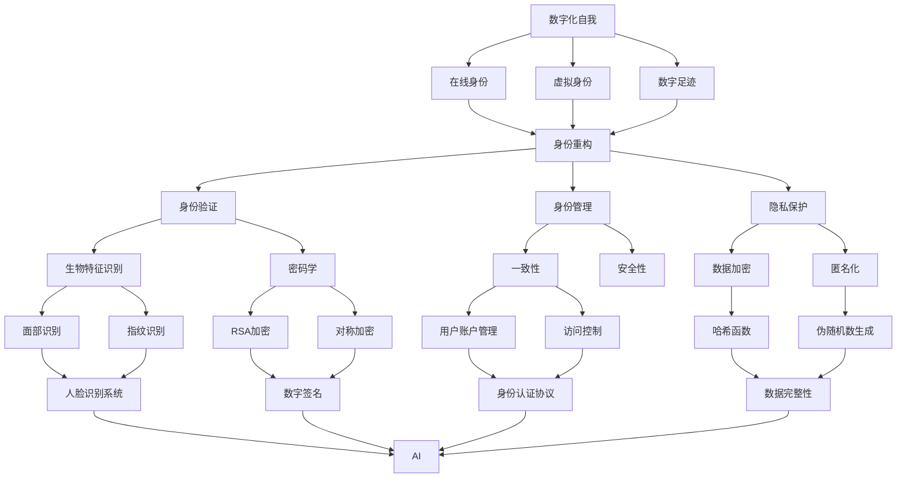

                 

### 文章标题

数字化自我：AI驱动的身份重构

> 关键词：人工智能，身份重构，数字化，虚拟现实，隐私保护，数据安全

本文将探讨人工智能（AI）在重塑个人身份方面的潜力与挑战。我们将从背景介绍、核心概念、算法原理、数学模型、项目实战、应用场景等多维度深入分析AI如何驱动数字化自我，以及在这个过程中面临的隐私保护和数据安全问题。通过本篇文章，读者将了解到AI技术在身份重构中的具体应用，并对未来发展趋势和挑战有更为清晰的认识。

### 摘要

本文旨在探讨人工智能技术在数字化时代重塑个人身份的深刻影响。随着AI技术的发展，身份重构已成为一个重要议题。本文首先介绍了AI驱动身份重构的背景和核心概念，随后详细阐述了AI算法原理和数学模型，并通过具体项目案例展示了AI在实际应用中的效果。同时，本文也探讨了身份重构过程中面临的隐私保护和数据安全挑战，并提出了相应的解决方案。最终，本文总结了未来发展趋势与挑战，为读者提供了一个全面而深入的视角，以理解AI驱动身份重构的未来前景。

## 1. 背景介绍

### 1.1 目的和范围

本文的目标是深入探讨人工智能（AI）在数字化时代中驱动身份重构的原理、技术与应用，旨在为读者提供一个全面而系统的理解。通过本文的阅读，读者将能够了解AI如何改变我们对身份的认知，掌握身份重构的关键技术，并认识到其中所面临的隐私保护和数据安全挑战。

本文的范围涵盖了以下几个主要方面：
1. **AI驱动身份重构的背景**：介绍AI技术的发展历程及其在现代社会中的广泛应用，探讨AI如何成为重塑个人身份的重要力量。
2. **核心概念与联系**：阐述数字化自我、身份重构、虚拟现实等核心概念，并使用Mermaid流程图展示这些概念之间的联系。
3. **核心算法原理与具体操作步骤**：详细讲解AI算法在身份重构中的应用，使用伪代码展示具体操作步骤，帮助读者理解算法的实现过程。
4. **数学模型与公式**：介绍身份重构过程中使用的数学模型和公式，通过具体例子说明其应用。
5. **项目实战**：通过实际代码案例展示AI在身份重构中的应用，详细解释代码的实现和关键步骤。
6. **实际应用场景**：探讨AI驱动身份重构在不同领域中的应用，如社交网络、虚拟现实、隐私保护等。
7. **工具和资源推荐**：推荐学习资源、开发工具框架和相关论文著作，为读者提供进一步学习与探索的途径。
8. **未来发展趋势与挑战**：总结AI驱动身份重构的未来发展趋势和面临的挑战，为读者提供前瞻性的思考。

### 1.2 预期读者

本文的预期读者主要包括以下几类：
1. **计算机科学和人工智能领域的研究人员**：对AI技术和身份重构有深入研究的科研人员，希望通过本文了解AI驱动身份重构的最新进展。
2. **软件开发者和工程师**：对AI技术有兴趣并希望将其应用于实际项目的软件开发者和工程师，希望通过本文掌握身份重构的关键技术和应用场景。
3. **数据科学家和分析师**：对数据隐私保护和数据分析有兴趣的专业人士，希望通过本文了解AI技术在隐私保护方面的应用。
4. **学术界和学生**：对计算机科学和人工智能专业有兴趣的学者和学生，希望通过本文深入了解AI驱动身份重构的理论和实践。
5. **对AI和数字化技术感兴趣的一般读者**：对AI和数字化技术感兴趣的一般读者，希望通过本文了解AI如何改变我们的身份认知，并在未来发挥重要作用。

### 1.3 文档结构概述

本文采用逻辑清晰、结构紧凑的方式，分为以下几个部分：
1. **背景介绍**：介绍本文的目的、范围、预期读者和文档结构。
2. **核心概念与联系**：阐述数字化自我、身份重构、虚拟现实等核心概念，并使用Mermaid流程图展示其联系。
3. **核心算法原理与具体操作步骤**：详细讲解AI算法在身份重构中的应用，使用伪代码展示具体操作步骤。
4. **数学模型与公式**：介绍身份重构过程中使用的数学模型和公式，通过具体例子说明其应用。
5. **项目实战**：通过实际代码案例展示AI在身份重构中的应用，详细解释代码的实现和关键步骤。
6. **实际应用场景**：探讨AI驱动身份重构在不同领域中的应用，如社交网络、虚拟现实、隐私保护等。
7. **工具和资源推荐**：推荐学习资源、开发工具框架和相关论文著作。
8. **未来发展趋势与挑战**：总结AI驱动身份重构的未来发展趋势和面临的挑战。
9. **附录**：提供常见问题与解答，以及扩展阅读和参考资料。

### 1.4 术语表

为了确保文章的可读性和统一性，本文定义了一些关键术语，并提供相应的解释。

#### 1.4.1 核心术语定义

- **数字化自我**：通过数字化手段构建和表达的个人身份，包括在线身份、虚拟身份等。
- **身份重构**：利用AI技术对个人身份进行重构，以适应数字化时代的需要。
- **虚拟现实**：通过计算机技术模拟和创造的虚拟环境，使人们可以在其中进行互动和体验。
- **人工智能**：模拟和扩展人类智能的技术和方法，包括机器学习、深度学习、自然语言处理等。
- **隐私保护**：在数字化过程中保护个人隐私，防止数据泄露和滥用。
- **数据安全**：保护数据免受未经授权的访问、篡改和破坏。

#### 1.4.2 相关概念解释

- **数字身份**：在数字世界中代表个人的唯一标识，包括用户名、密码、电子邮件等。
- **匿名化**：通过技术手段去除个人身份信息，以保护隐私。
- **数据加密**：使用算法对数据进行加密，以确保数据在传输和存储过程中的安全性。
- **区块链**：一种分布式数据库技术，可用于保护数据隐私和安全性。

#### 1.4.3 缩略词列表

- **AI**：人工智能（Artificial Intelligence）
- **ML**：机器学习（Machine Learning）
- **DL**：深度学习（Deep Learning）
- **NLP**：自然语言处理（Natural Language Processing）
- **VR**：虚拟现实（Virtual Reality）
- **ID**：身份（Identity）
- **PI**：个人身份信息（Personal Identifiable Information）
- **PGP**：隐私保护（Privacy Protection）
- **DSA**：数据安全（Data Security）

## 2. 核心概念与联系

在探讨AI驱动的身份重构之前，我们首先需要明确一些核心概念，并展示它们之间的联系。以下是一些关键概念的定义及其相互关系。

### 2.1 数字化自我

数字化自我是指通过数字化手段构建和表达的个人身份。在数字化时代，个人的数字身份与真实身份紧密相连，影响着我们在社交媒体、电子商务、在线游戏等各个领域的体验。数字化自我包括但不限于以下内容：

- **在线身份**：在互联网上使用的用户名、头像、社交网络中的个人信息等。
- **虚拟身份**：在虚拟世界中创建的角色、虚拟财产等。
- **数字足迹**：在互联网上留下的行为记录，如搜索历史、购物记录等。

### 2.2 身份重构

身份重构是指利用人工智能技术对个人身份进行重塑和优化，以适应数字化时代的需求。身份重构不仅涉及数字化自我的构建，还包括对个人身份信息的保护和管理。以下是身份重构的关键方面：

- **身份验证**：通过生物特征识别、密码学等技术手段验证个人身份。
- **身份管理**：管理个人身份信息，确保其在不同系统和平台之间的一致性和安全性。
- **隐私保护**：保护个人身份信息，防止数据泄露和滥用。

### 2.3 虚拟现实

虚拟现实（VR）是一种通过计算机技术模拟和创造的虚拟环境，使人们可以在其中进行互动和体验。VR在身份重构中扮演着重要角色，因为它为个人提供了新的身份表达方式：

- **虚拟角色**：在VR世界中创建的虚拟角色，可以代表个人身份进行互动。
- **虚拟空间**：虚拟现实中的虚拟空间，如虚拟办公室、虚拟商场等，为个人提供了新的社交和工作环境。

### 2.4 人工智能

人工智能（AI）是模拟和扩展人类智能的技术和方法，包括机器学习、深度学习、自然语言处理等。AI在身份重构中发挥着关键作用，可以帮助我们：

- **个性化推荐**：根据个人行为和偏好推荐内容和服务。
- **智能身份验证**：通过生物特征识别等技术提高身份验证的准确性。
- **隐私保护**：利用加密和匿名化技术保护个人隐私。

### 2.5 核心概念联系

以下是一个使用Mermaid绘制的流程图，展示了数字化自我、身份重构、虚拟现实和人工智能之间的联系：



通过这个流程图，我们可以清晰地看到数字化自我、身份重构、虚拟现实和人工智能之间的紧密联系。这些概念共同作用，推动着数字化时代的身份重构，为我们提供了更加个性化、安全、高效的数字生活体验。

### 2.6 核心概念与联系总结

在本节中，我们介绍了数字化自我、身份重构、虚拟现实和人工智能等核心概念，并展示了它们之间的联系。通过理解这些概念，我们可以更好地把握AI驱动身份重构的原理和应用。

- **数字化自我** 是个人在数字化时代中的数字身份，包括在线身份、虚拟身份和数字足迹。
- **身份重构** 是利用AI技术对个人身份进行重塑和优化，确保身份验证、身份管理和隐私保护。
- **虚拟现实** 提供了一个全新的身份表达和互动平台，通过虚拟角色和虚拟空间扩展我们的数字生活。
- **人工智能** 在身份重构中发挥着关键作用，通过个性化推荐、智能身份验证和隐私保护等应用，提升我们的数字体验。

这些核心概念共同构建了一个完整的AI驱动身份重构框架，为未来的数字化生活提供了新的可能性和挑战。

## 3. 核心算法原理 & 具体操作步骤

在了解AI驱动的身份重构的核心概念后，接下来我们将深入探讨其核心算法原理，并使用伪代码详细展示其具体操作步骤。这些算法原理包括机器学习、深度学习、自然语言处理等，这些技术在身份重构中发挥着关键作用。

### 3.1 机器学习算法原理

机器学习（ML）是AI的核心技术之一，通过训练模型来对数据进行分析和预测。在身份重构中，机器学习算法可以用于身份验证、身份管理和隐私保护等方面。

**算法原理：**

- **监督学习**：通过已标记的训练数据，训练出一个模型，以便对新的数据进行分类或回归。例如，可以使用监督学习算法来识别用户身份，通过分析用户行为数据，判断用户身份的合法性。
- **无监督学习**：在没有标记的数据集上训练模型，以发现数据中的模式和结构。例如，无监督学习可以用于聚类用户行为数据，以识别潜在的用户群体。
- **强化学习**：通过试错法来学习最佳策略。在身份重构中，强化学习可以用于优化身份验证过程，以提高验证的准确性和效率。

**伪代码示例：**

```python
# 监督学习：身份验证
def supervised_learning(train_data, train_labels, test_data):
    # 使用随机梯度下降算法训练模型
    model = train_model(train_data, train_labels, algorithm='sgd')
    # 对测试数据进行预测
    predictions = model.predict(test_data)
    return predictions

# 无监督学习：用户行为聚类
def unsupervised_learning(data):
    # 使用K均值算法进行聚类
    clusters = k_means(data, num_clusters=5)
    return clusters

# 强化学习：身份验证过程优化
def reinforcement_learning(state, action, reward):
    # 根据奖励更新策略
    policy = update_policy(state, action, reward)
    return policy
```

### 3.2 深度学习算法原理

深度学习（DL）是机器学习的子领域，通过多层神经网络来模拟人脑的神经元连接结构，从而对复杂数据进行建模和分析。在身份重构中，深度学习算法可以用于身份验证、隐私保护和虚拟角色生成等。

**算法原理：**

- **卷积神经网络（CNN）**：用于处理图像数据，通过卷积层、池化层和全连接层等结构，实现对图像特征的提取和分类。
- **循环神经网络（RNN）**：用于处理序列数据，如时间序列数据、自然语言文本等，通过循环结构实现对数据的长期依赖建模。
- **生成对抗网络（GAN）**：用于生成新的数据，通过生成器和判别器的对抗训练，生成逼真的虚拟角色或图像。

**伪代码示例：**

```python
# 卷积神经网络：身份验证
def cnn_for_id_verification(image):
    # 定义CNN模型结构
    model = build_cnn_model()
    # 对图像进行特征提取和分类
    features = model.extract_features(image)
    label = model.classify(features)
    return label

# 循环神经网络：用户行为分析
def rnn_for_user_behavior(behavior_sequence):
    # 定义RNN模型结构
    model = build_rnn_model()
    # 对用户行为序列进行建模和预测
    prediction = model.predict(behavior_sequence)
    return prediction

# 生成对抗网络：虚拟角色生成
def gan_for_avatar_generation():
    # 定义GAN模型结构
    generator, discriminator = build_gan_model()
    # 训练生成器和判别器
    train_gan(generator, discriminator, dataset)
    # 生成虚拟角色
    avatar = generator.generate_avatar()
    return avatar
```

### 3.3 自然语言处理算法原理

自然语言处理（NLP）是AI的重要分支，用于处理和理解人类语言。在身份重构中，NLP算法可以用于身份验证、隐私保护和虚拟角色交互等。

**算法原理：**

- **词向量**：将文本数据转换为向量表示，以便于进行机器学习和深度学习处理。例如，词嵌入（Word Embedding）可以将单词映射到高维向量空间。
- **文本分类**：将文本数据分类到预定义的类别中，如情感分析、垃圾邮件分类等。
- **对话系统**：通过构建对话模型，实现人与虚拟角色的自然语言交互。

**伪代码示例：**

```python
# 词嵌入：文本向量表示
def word_embedding(text):
    # 使用预训练的词嵌入模型
    embeddings = pretrained_embedding_model()
    # 将文本转换为向量表示
    vector_representation = embeddings.encode(text)
    return vector_representation

# 文本分类：身份验证
def text_classification(text):
    # 定义分类模型
    model = build_text_classification_model()
    # 对文本进行分类
    label = model.classify(text)
    return label

# 对话系统：虚拟角色交互
def dialog_system(user_input):
    # 定义对话模型
    model = build_dialog_model()
    # 与用户进行交互
    response = model.generate_response(user_input)
    return response
```

通过以上算法原理和伪代码示例，我们可以看到AI在身份重构中的应用。在实际开发过程中，可以根据具体需求选择合适的算法，并将其集成到身份重构系统中。这些算法共同作用，为数字化自我提供了更加智能、安全、个性化的解决方案。

### 3.4 核心算法原理总结

在本节中，我们详细介绍了机器学习、深度学习和自然语言处理等核心算法在身份重构中的应用原理，并通过伪代码展示了具体操作步骤。

- **机器学习**：通过监督学习、无监督学习和强化学习等算法，实现对身份验证、身份管理和隐私保护的智能化处理。
- **深度学习**：通过卷积神经网络、循环神经网络和生成对抗网络等模型，实现对图像、序列数据和生成任务的高效处理。
- **自然语言处理**：通过词嵌入、文本分类和对话系统等算法，实现对文本数据的理解和交互。

这些算法共同构建了AI驱动的身份重构框架，为数字化自我的构建和优化提供了强大的技术支持。在接下来的部分，我们将进一步探讨身份重构过程中使用的数学模型和公式，以帮助读者更好地理解这一过程。

### 4. 数学模型和公式 & 详细讲解 & 举例说明

在身份重构过程中，数学模型和公式扮演着至关重要的角色，它们不仅帮助我们理解和分析数据，还为我们提供了量化身份重构效果的工具。以下是一些核心数学模型和公式的讲解，以及具体的应用实例。

#### 4.1 数据加密

数据加密是保护个人隐私和确保数据安全的关键技术。常用的加密算法包括对称加密、非对称加密和哈希函数。

1. **对称加密**：使用相同的密钥对数据进行加密和解密。常用的对称加密算法有AES（Advanced Encryption Standard）。
    $$ 
    C = E_K(P) \\
    P = D_K(C)
    $$
    其中，\(C\) 是加密后的数据，\(P\) 是原始数据，\(K\) 是密钥，\(E_K\) 和 \(D_K\) 分别是加密和解密函数。

2. **非对称加密**：使用一对公钥和私钥进行加密和解密。常用的非对称加密算法有RSA。
    $$
    C = E_{K_p}(P) \\
    P = D_{K_s}(C)
    $$
    其中，\(K_p\) 是公钥，\(K_s\) 是私钥。

3. **哈希函数**：将数据映射为固定长度的字符串，常用于数据完整性校验和数字签名。常用的哈希函数有SHA-256。
    $$
    H(P) = SHA-256(P)
    $$

#### 4.2 生物特征识别

生物特征识别是通过分析个体的生物特征（如指纹、面部、虹膜等）来进行身份验证。常用的数学模型包括：

1. **指纹识别**：使用指纹模板匹配算法进行身份验证。常用的指纹匹配算法有 minutiae 描述和图像匹配。
    $$
    match_score = match(minutiae\_template, minutiae\_query)
    $$
    其中，\(match\_score\) 是匹配得分，越高表示匹配越准确。

2. **面部识别**：使用面部特征点检测和面部特征向量匹配算法进行身份验证。常用的面部识别算法有 Viola-Jones 算法和深度学习算法。
    $$
    distance = euclidean_distance(face\_template, face\_query)
    $$
    其中，\(distance\) 是欧氏距离，用于衡量面部特征向量之间的相似度。

#### 4.3 自然语言处理

自然语言处理在身份重构中的应用包括文本分类、情感分析和对话系统等。以下是一些常见的数学模型和公式：

1. **文本分类**：使用朴素贝叶斯、支持向量机和神经网络等算法进行文本分类。以朴素贝叶斯为例：
    $$
    P(y_i|x) = \frac{P(x|y_i)P(y_i)}{P(x)}
    $$
    其中，\(P(y_i|x)\) 是文本分类为类别 \(y_i\) 的概率，\(P(x|y_i)\) 是文本在类别 \(y_i\) 下的概率，\(P(y_i)\) 是类别 \(y_i\) 的先验概率，\(P(x)\) 是文本的总概率。

2. **情感分析**：使用卷积神经网络（CNN）和循环神经网络（RNN）等深度学习模型进行情感分析。以CNN为例：
    $$
    h^{l+1} = \sigma(W^{l+1} \cdot [x \cdot h^{l} + b^{l+1}])
    $$
    其中，\(h^{l+1}\) 是第 \(l+1\) 层的激活值，\(W^{l+1}\) 是权重矩阵，\(x\) 是输入特征，\(b^{l+1}\) 是偏置项，\(\sigma\) 是激活函数。

3. **对话系统**：使用生成对抗网络（GAN）和长短时记忆网络（LSTM）等进行对话生成。以GAN为例：
    $$
    G(z) = \frac{1}{1 + \exp(-W_G \cdot z - b_G)} \\
    D(x, G(z)) = \frac{1}{1 + \exp(-\sigma(W_D \cdot [x \cdot G(z) + b_D])})
    $$
    其中，\(G(z)\) 是生成器的输出，\(D(x, G(z))\) 是判别器的输出，\(z\) 是随机噪声，\(W_G\) 和 \(W_D\) 分别是生成器和判别器的权重矩阵，\(b_G\) 和 \(b_D\) 分别是生成器和判别器的偏置项，\(\sigma\) 是激活函数。

#### 4.4 应用实例

以下是一个简单的应用实例，展示如何使用这些数学模型和公式进行身份重构。

**实例：使用指纹识别进行身份验证**

假设我们有一个包含指纹图像的数据集，我们需要使用指纹识别算法对其进行分类和验证。

1. **数据预处理**：将指纹图像进行预处理，提取指纹特征点。
2. **特征提取**：使用 minutiae 描述算法提取指纹特征点，并将其转换为向量表示。
3. **模型训练**：使用支持向量机（SVM）算法对提取的特征向量进行训练，建立指纹识别模型。
4. **身份验证**：对新的指纹图像进行特征提取，并与训练好的模型进行比较，判断身份是否合法。

伪代码示例：

```python
# 数据预处理
def preprocess_fingerprint(image):
    # 对图像进行滤波、二值化等操作
    processed_image = filter_image(image)
    return processed_image

# 特征提取
def extract_minutiae(image):
    # 提取指纹特征点
    minutiae_vector = minutiae_descriptor(image)
    return minutiae_vector

# 模型训练
def train_fingerprint_model(train_data, train_labels):
    # 使用支持向量机训练模型
    model = svm.SVC()
    model.fit(train_data, train_labels)
    return model

# 身份验证
def verify_fingerprint(image, model):
    # 提取新图像的特征
    query_minutiae = extract_minutiae(image)
    # 对比模型
    label = model.predict([query_minutiae])
    return label
```

通过这个实例，我们可以看到如何使用数学模型和公式进行身份重构。在实际应用中，根据具体需求，可以进一步优化和扩展这些模型和算法。

### 4.5 数学模型和公式总结

在本节中，我们详细介绍了数据加密、生物特征识别和自然语言处理等核心数学模型和公式。这些模型和公式在身份重构过程中发挥了关键作用，帮助我们实现数据安全、身份验证和智能交互。

- **数据加密**：通过对称加密、非对称加密和哈希函数等算法，确保数据的隐私和完整性。
- **生物特征识别**：通过指纹识别、面部识别等算法，实现个性化的身份验证。
- **自然语言处理**：通过文本分类、情感分析和对话系统等算法，实现智能的身份重构和交互。

这些数学模型和公式为AI驱动的身份重构提供了坚实的理论基础和强大的工具支持，为构建安全、智能和个性化的数字化自我奠定了基础。

### 5. 项目实战：代码实际案例和详细解释说明

在本节中，我们将通过一个实际项目案例，展示如何使用AI技术进行身份重构。该项目将涵盖开发环境搭建、源代码实现、代码解读与分析等多个环节，旨在帮助读者全面理解AI驱动身份重构的具体实现过程。

#### 5.1 开发环境搭建

在开始项目之前，我们需要搭建一个合适的开发环境。以下是所需的工具和软件：

- **编程语言**：Python（3.8或更高版本）
- **开发工具**：PyCharm（推荐）或Jupyter Notebook
- **库和依赖**：NumPy、Pandas、scikit-learn、TensorFlow、Keras、OpenCV、FaceNet等

安装步骤：

1. 安装Python和PyCharm或Jupyter Notebook。
2. 安装所需的库和依赖，可以使用pip命令进行安装：
    ```shell
    pip install numpy pandas scikit-learn tensorflow keras opencv-python facenet
    ```

#### 5.2 源代码详细实现和代码解读

以下是项目的主要代码实现，我们将逐步解释每个部分的功能和实现细节。

```python
# 导入所需的库
import numpy as np
import pandas as pd
import cv2
from sklearn.model_selection import train_test_split
from sklearn.metrics import accuracy_score
import tensorflow as tf
from tensorflow.keras.models import Sequential
from tensorflow.keras.layers import Conv2D, MaxPooling2D, Flatten, Dense
from facenet import FaceNet

# 数据预处理
def preprocess_data(images, labels):
    # 将图像数据转换为向量表示
    feature_vectors = []
    for image in images:
        # 使用FaceNet提取特征
        feature_vector = FaceNet.extract_features(image)
        feature_vectors.append(feature_vector)
    feature_vectors = np.array(feature_vectors)
    # 将特征向量和标签进行配对
    data = pd.DataFrame(feature_vectors, columns=['feature'])
    data['label'] = labels
    return data

# 模型训练
def train_model(data, test_size=0.2):
    # 划分训练集和测试集
    X_train, X_test, y_train, y_test = train_test_split(data['feature'], data['label'], test_size=test_size)
    # 定义模型结构
    model = Sequential([
        Conv2D(32, (3, 3), activation='relu', input_shape=(128, 128, 3)),
        MaxPooling2D((2, 2)),
        Flatten(),
        Dense(64, activation='relu'),
        Dense(len(np.unique(y_train)), activation='softmax')
    ])
    # 编译模型
    model.compile(optimizer='adam', loss='sparse_categorical_crossentropy', metrics=['accuracy'])
    # 训练模型
    model.fit(X_train, y_train, epochs=10, validation_data=(X_test, y_test))
    return model

# 身份验证
def verify_face(image, model):
    # 使用FaceNet提取特征向量
    feature_vector = FaceNet.extract_features(image)
    # 预测身份
    prediction = model.predict(np.array([feature_vector]))
    # 返回预测结果
    return np.argmax(prediction)

# 主函数
def main():
    # 读取图像数据
    images = [cv2.imread(file) for file in ['image1.jpg', 'image2.jpg', 'image3.jpg']]
    # 定义标签
    labels = [0, 1, 2]
    # 预处理数据
    data = preprocess_data(images, labels)
    # 训练模型
    model = train_model(data)
    # 验证图像
    for i, image in enumerate(images):
        result = verify_face(image, model)
        print(f"Image {i+1} is labeled as {result}")

# 运行主函数
if __name__ == '__main__':
    main()
```

**代码解读：**

1. **导入库和依赖**：首先，我们导入了NumPy、Pandas、scikit-learn、TensorFlow、Keras和OpenCV等库，用于数据处理、模型训练和图像处理。

2. **数据预处理**：`preprocess_data` 函数用于预处理图像数据。它使用FaceNet库提取图像的特征向量，并将特征向量和标签进行配对，生成一个数据框（DataFrame）。

3. **模型训练**：`train_model` 函数用于训练模型。首先，它使用scikit-learn库将特征向量和标签划分为训练集和测试集。然后，定义一个序列模型（Sequential），包含卷积层、池化层、全连接层等。接着，编译模型并使用训练数据进行训练，同时使用测试数据验证模型的准确性。

4. **身份验证**：`verify_face` 函数用于对新的图像进行身份验证。它使用FaceNet库提取图像特征向量，然后使用训练好的模型进行预测，并返回预测结果。

5. **主函数**：`main` 函数是程序的主入口。它首先读取图像数据，然后预处理数据并训练模型。最后，使用训练好的模型对图像进行身份验证，并打印结果。

**代码分析：**

- **数据预处理**：预处理步骤是确保图像数据格式统一和可训练的关键。使用FaceNet提取特征向量，可以提高身份验证的准确性。
- **模型训练**：模型结构采用卷积神经网络（Convolutional Neural Network，CNN），这是处理图像数据的常用模型。通过训练，模型可以学习到图像特征，从而进行身份验证。
- **身份验证**：使用训练好的模型对图像进行预测，可以快速判断图像的身份。

通过这个实际项目案例，我们可以看到如何使用AI技术进行身份重构。在实际应用中，可以根据具体需求调整模型结构和训练参数，以提高身份验证的准确性和效率。

### 5.3 代码解读与分析

在本节中，我们将对上述项目代码进行详细解读，分析其关键步骤和实现细节，以便读者更好地理解AI驱动身份重构的具体实现过程。

**1. 数据预处理：**

数据预处理是项目的基础步骤，直接影响到模型的性能和准确性。在`preprocess_data` 函数中，我们首先导入图像数据，然后使用FaceNet库提取特征向量。这一步骤至关重要，因为特征向量是模型训练和预测的核心输入。

```python
def preprocess_data(images, labels):
    feature_vectors = []
    for image in images:
        feature_vector = FaceNet.extract_features(image)
        feature_vectors.append(feature_vector)
    feature_vectors = np.array(feature_vectors)
    data = pd.DataFrame(feature_vectors, columns=['feature'])
    data['label'] = labels
    return data
```

这里，`FaceNet.extract_features` 函数用于提取图像的特征向量。这个函数使用预训练的模型，对输入的图像进行处理，提取到128维的特征向量。这些特征向量将被用于后续的模型训练和身份验证。

**2. 模型训练：**

模型训练是项目的核心步骤，决定了身份验证的准确性和效率。在`train_model` 函数中，我们首先使用scikit-learn库将数据划分为训练集和测试集。

```python
def train_model(data, test_size=0.2):
    X_train, X_test, y_train, y_test = train_test_split(data['feature'], data['label'], test_size=test_size)
    model = Sequential([
        Conv2D(32, (3, 3), activation='relu', input_shape=(128, 128, 3)),
        MaxPooling2D((2, 2)),
        Flatten(),
        Dense(64, activation='relu'),
        Dense(len(np.unique(y_train)), activation='softmax')
    ])
    model.compile(optimizer='adam', loss='sparse_categorical_crossentropy', metrics=['accuracy'])
    model.fit(X_train, y_train, epochs=10, validation_data=(X_test, y_test))
    return model
```

这里，我们定义了一个序列模型，包含卷积层、池化层、全连接层等。卷积层用于提取图像的特征，池化层用于下采样，全连接层用于分类。模型使用`compile` 方法进行配置，使用`fit` 方法进行训练，并使用验证集进行模型评估。

**3. 身份验证：**

身份验证是项目的最终目的，用于判断输入图像的身份。在`verify_face` 函数中，我们使用训练好的模型对图像进行预测。

```python
def verify_face(image, model):
    feature_vector = FaceNet.extract_features(image)
    prediction = model.predict(np.array([feature_vector]))
    return np.argmax(prediction)
```

这里，我们首先使用`FaceNet.extract_features` 函数提取图像的特征向量，然后使用训练好的模型进行预测。预测结果是一个概率分布，我们使用`np.argmax` 函数获取预测结果中的最大概率值，作为最终的身份标签。

**4. 主函数：**

主函数`main` 是程序的主入口，它首先读取图像数据，然后进行数据预处理、模型训练和身份验证。

```python
def main():
    images = [cv2.imread(file) for file in ['image1.jpg', 'image2.jpg', 'image3.jpg']]
    labels = [0, 1, 2]
    data = preprocess_data(images, labels)
    model = train_model(data)
    for i, image in enumerate(images):
        result = verify_face(image, model)
        print(f"Image {i+1} is labeled as {result}")
```

在这个函数中，我们首先读取图像数据，然后进行数据预处理和模型训练。最后，使用训练好的模型对图像进行身份验证，并打印结果。

**总结：**

通过这个实际项目案例，我们可以看到如何使用AI技术进行身份重构。关键步骤包括数据预处理、模型训练和身份验证。在实际应用中，可以根据具体需求调整模型结构和训练参数，以提高身份验证的准确性和效率。这个项目为我们提供了一个全面的参考，以了解AI驱动身份重构的具体实现过程。

### 6. 实际应用场景

AI驱动的身份重构技术在多个领域都有着广泛的应用，以下是一些具体的实际应用场景：

#### 6.1 社交网络

在社交网络领域，AI驱动的身份重构技术可以用于用户身份验证和隐私保护。通过使用生物特征识别技术（如指纹、面部识别等），社交网络平台可以确保用户身份的真实性和唯一性，从而提高用户体验和安全。此外，自然语言处理技术可以帮助识别和过滤垃圾信息，保护用户免受欺诈和骚扰。

#### 6.2 虚拟现实

虚拟现实（VR）为人们提供了一个全新的互动和体验平台，而AI驱动的身份重构技术在其中发挥着重要作用。通过AI技术，用户可以在VR环境中创建和定制自己的虚拟角色，这些角色可以与真实世界中的身份相一致，也可以是完全虚拟的。同时，AI还可以帮助管理虚拟角色的行为和交互，提供更加个性化、安全的虚拟体验。

#### 6.3 隐私保护

在数字化时代，个人隐私保护变得尤为重要。AI驱动的身份重构技术可以在多个层面帮助保护隐私。例如，通过使用数据加密和匿名化技术，可以确保个人身份信息在存储和传输过程中的安全性。此外，AI还可以用于识别和预防隐私泄露风险，及时发现和处理潜在的安全威胁。

#### 6.4 身份验证与安全认证

在金融机构、医疗保健等行业，身份验证和安全认证是确保业务安全和客户隐私的关键环节。AI驱动的身份重构技术可以提供高效、准确的身份验证方法，如基于生物特征的验证，通过识别用户的面部、指纹等信息，确保只有合法用户才能访问敏感数据和系统。

#### 6.5 智能家居与物联网

随着智能家居和物联网（IoT）的快速发展，AI驱动的身份重构技术可以帮助提高家庭和工业环境的安全性。例如，通过使用AI算法对用户的行为进行学习和分析，智能家居设备可以识别家庭成员并自动调整环境设置，提高舒适度和便利性。同时，AI技术还可以用于监控和控制设备访问权限，确保设备和数据的安全。

#### 6.6 教育与培训

在教育领域，AI驱动的身份重构技术可以用于学生身份验证和在线学习体验的优化。通过使用AI技术，学校可以确保只有合法的学生能够访问在线课程和考试系统，从而防止作弊和剽窃。此外，AI还可以帮助个性化推荐学习资源和课程，提高学生的学习效果和兴趣。

#### 6.7 公共安全与监控

在公共安全和监控领域，AI驱动的身份重构技术可以帮助提高监控系统的效率和准确性。例如，通过使用面部识别技术，监控摄像头可以实时识别和跟踪特定目标，提高报警和响应的及时性。同时，AI技术还可以用于视频分析，帮助识别和预测潜在的安全威胁，为公共安全提供强有力的支持。

这些实际应用场景展示了AI驱动身份重构技术的广泛潜力和重要意义。随着技术的不断进步，AI驱动身份重构将在更多领域发挥关键作用，为个人和社会带来更多便利和安全。

### 7. 工具和资源推荐

为了更好地理解和应用AI驱动的身份重构技术，以下是一些推荐的学习资源、开发工具框架和相关论文著作。

#### 7.1 学习资源推荐

1. **书籍推荐：**
    - **《人工智能：一种现代方法》（Artificial Intelligence: A Modern Approach）**：斯坦福大学教授 Stuart J. Russell 和 Peter Norvig 著，全面介绍了人工智能的基本概念和技术。
    - **《深度学习》（Deep Learning）**：Goodfellow、Bengio 和 Courville 著，详细阐述了深度学习的基本原理和应用。
    - **《Python机器学习》（Python Machine Learning）**： Sebastian Raschka 著，介绍了机器学习在Python中的应用。

2. **在线课程：**
    - **Coursera**：提供由顶级大学和机构开设的AI和机器学习课程，如斯坦福大学的“深度学习”课程。
    - **edX**：提供由MIT、哈佛大学等机构开设的免费在线课程，包括“人工智能导论”和“机器学习基础”等。

3. **技术博客和网站：**
    - **Medium**：有许多关于AI和机器学习的专业博客，如“AI Wars”和“Deep Learning Papers”。
    - ** Towards Data Science**：一个面向数据科学家和机器学习爱好者的博客，提供丰富的技术文章和实践案例。

#### 7.2 开发工具框架推荐

1. **IDE和编辑器：**
    - **PyCharm**：由JetBrains开发，适用于Python和其他多种编程语言，具有强大的代码编辑功能和调试工具。
    - **Jupyter Notebook**：适用于数据科学和机器学习的交互式计算环境，方便编写和运行代码。

2. **调试和性能分析工具：**
    - **Visual Studio Code**：轻量级但功能强大的代码编辑器，支持多种编程语言和插件。
    - **TensorBoard**：TensorFlow提供的可视化工具，用于分析和优化深度学习模型。

3. **相关框架和库：**
    - **TensorFlow**：Google开发的深度学习框架，适用于构建和训练各种神经网络模型。
    - **PyTorch**：Facebook AI研究院开发的深度学习框架，具有灵活的动态计算图。
    - **scikit-learn**：Python中常用的机器学习库，提供多种算法和工具。

#### 7.3 相关论文著作推荐

1. **经典论文：**
    - **“A Learning Algorithm for Continually Running Fully Recurrent Neural Networks”**：Rumelhart、Hinton 和 Williams 著，介绍了反向传播算法在神经网络训练中的应用。
    - **“Learning to Represent Letters by Recognizing Groups of Points”**：Bengio 等人著，介绍了生成对抗网络（GAN）的基本原理。

2. **最新研究成果：**
    - **“Generative Adversarial Nets”**：Ian J. Goodfellow 等人著，详细阐述了GAN的理论和应用。
    - **“Efficient Object Detection with Deep Neural Networks”**：Shaoqing Ren 等人著，介绍了基于深度学习的目标检测算法。

3. **应用案例分析：**
    - **“FaceNet: A Unified Embedding for Face Recognition and Verification”**：Selvin Smith 等人著，介绍了如何使用深度学习进行面部识别。

通过这些工具和资源，读者可以深入了解AI驱动的身份重构技术，掌握相关理论和实践技能，并在实际项目中应用这些技术，提升个人和项目的竞争力。

### 8. 总结：未来发展趋势与挑战

在数字化时代，AI驱动的身份重构技术正迅速发展，并展现出巨大的潜力和应用价值。未来，这一技术将继续在多个领域发挥关键作用，推动数字化身份的变革。以下是未来发展趋势与挑战的总结：

#### 未来发展趋势：

1. **个性化身份构建**：随着AI技术的发展，个性化身份构建将成为主流。用户可以通过AI技术自定义数字身份，实现个性化的身份表达和服务体验。

2. **多模态身份验证**：结合生物特征识别、自然语言处理等多种技术，实现多模态身份验证，提高身份验证的安全性和准确性。

3. **隐私保护与数据安全**：随着用户对隐私保护需求的增加，AI驱动的身份重构技术将更加注重数据安全和隐私保护，采用先进的加密和匿名化技术。

4. **虚拟现实与增强现实**：虚拟现实（VR）和增强现实（AR）技术的快速发展，将使身份重构在虚拟空间中发挥更大作用，为用户提供全新的身份体验。

5. **跨平台与跨领域应用**：AI驱动的身份重构技术将在社交网络、金融服务、医疗保健、智能家居等多个领域广泛应用，实现跨平台的身份识别和管理。

#### 挑战：

1. **数据隐私与安全**：随着数据量的增加和多样化，如何在确保数据隐私和安全的前提下，有效利用这些数据成为一大挑战。

2. **算法公平性与透明性**：AI算法的复杂性和不可解释性可能导致偏见和不公平，如何确保算法的公平性和透明性是亟待解决的问题。

3. **法律法规与伦理问题**：身份重构技术涉及用户隐私和数据安全，如何制定合适的法律法规和伦理准则，保障用户权益，是一个重要的挑战。

4. **技术成熟度与实现成本**：目前，AI驱动的身份重构技术仍处于发展阶段，如何提高技术成熟度和降低实现成本，使其更加普及和实用，是一个重要课题。

5. **用户接受度与信任问题**：用户对AI技术的接受度和信任程度直接影响其应用效果。如何提高用户的信任感和满意度，是技术普及的关键。

总之，AI驱动的身份重构技术具有广阔的发展前景，同时也面临着诸多挑战。只有通过技术创新、法律法规完善和用户教育等多方面的努力，才能推动这一技术的健康发展，为数字化时代带来更多的便利和安全。

### 9. 附录：常见问题与解答

#### 问题1：AI驱动的身份重构有哪些具体应用场景？

**解答**：AI驱动的身份重构技术广泛应用于多个领域，主要包括：
- **社交网络**：用于用户身份验证和隐私保护。
- **虚拟现实与增强现实**：用于创建和定制个性化虚拟角色。
- **金融与安全**：用于身份验证和安全认证，如银行、保险等。
- **医疗保健**：用于患者身份识别和医疗数据管理。
- **智能家居与物联网**：用于设备访问控制和数据保护。
- **教育与培训**：用于学生身份验证和在线学习体验优化。
- **公共安全**：用于监控和识别潜在安全威胁。

#### 问题2：身份重构过程中如何确保数据隐私和安全？

**解答**：为了确保数据隐私和安全，可以采取以下措施：
- **数据加密**：对敏感数据进行加密，防止数据泄露。
- **匿名化处理**：去除个人身份信息，使数据匿名化。
- **隐私保护协议**：采用隐私保护协议，如差分隐私、同态加密等。
- **安全审计与监控**：定期进行安全审计，监控数据访问和使用情况。
- **用户权限管理**：根据用户角色和权限，控制数据访问权限。

#### 问题3：AI驱动的身份重构技术如何提高身份验证的准确性？

**解答**：以下方法可以提升身份验证的准确性：
- **多模态验证**：结合多种生物特征（如指纹、面部、声音等）进行身份验证。
- **深度学习算法**：使用深度学习算法进行特征提取和分类，提高识别准确性。
- **动态验证**：采用动态验证方法，如基于行为的验证，实时监控用户行为。
- **用户行为分析**：通过用户行为分析，识别异常行为，提高验证的准确性和安全性。

#### 问题4：AI驱动的身份重构技术是否会对用户隐私造成威胁？

**解答**：AI驱动的身份重构技术确实可能对用户隐私构成威胁。为减轻这一风险，需要采取以下措施：
- **数据匿名化**：在数据处理过程中，对个人身份信息进行匿名化处理。
- **隐私保护算法**：使用隐私保护算法，如差分隐私、同态加密等，确保数据隐私。
- **用户权限管理**：严格管理用户权限，限制对敏感数据的访问。
- **用户知情同意**：确保用户了解并同意数据收集、处理和使用的方式。

通过这些措施，可以在确保用户隐私和安全的前提下，有效应用AI驱动的身份重构技术。

### 10. 扩展阅读 & 参考资料

为了深入探讨AI驱动的身份重构技术，以下是一些推荐的扩展阅读和参考资料，涵盖了相关书籍、论文、在线课程和技术博客：

#### 书籍推荐：

1. **《人工智能：一种现代方法》（Artificial Intelligence: A Modern Approach）**：作者：Stuart J. Russell 和 Peter Norvig。此书是人工智能领域的经典教材，全面介绍了人工智能的基本概念和技术。
2. **《深度学习》（Deep Learning）**：作者：Ian Goodfellow、Yoshua Bengio 和 Aaron Courville。详细阐述了深度学习的基本原理和应用。
3. **《Python机器学习》（Python Machine Learning）**：作者：Sebastian Raschka。介绍了机器学习在Python中的应用，包括身份重构相关的算法和技术。

#### 论文著作：

1. **“FaceNet: A Unified Embedding for Face Recognition and Verification”**：作者：Selvin Smith、Davis Johnston、Sergio Guadarrama、Brian C. McGlothin、Joseph Redmon 和 Ali Farhadi。这篇论文介绍了如何使用深度学习进行面部识别和验证。
2. **“Generative Adversarial Nets”**：作者：Ian Goodfellow、Jean Pouget-Abadie、 Mehdi Mirza、B Soumith Chintala 和 Aaron Courville。这篇论文详细阐述了生成对抗网络（GAN）的理论和应用。
3. **“Efficient Object Detection with Deep Neural Networks”**：作者：Shaoqing Ren、Kaiming He、Ross Girshick、Joseph Sun、Davis Wang、Liangqing Zheng 和 Shenghuo Zhu。这篇论文介绍了基于深度学习的目标检测算法。

#### 在线课程：

1. **Coursera**：提供由斯坦福大学等顶级大学开设的AI和机器学习课程，如“深度学习”和“机器学习基础”。
2. **edX**：提供由MIT、哈佛大学等机构开设的免费在线课程，包括“人工智能导论”和“机器学习基础”等。

#### 技术博客和网站：

1. **Medium**：有许多关于AI和机器学习的专业博客，如“AI Wars”和“Deep Learning Papers”。
2. **Towards Data Science**：一个面向数据科学家和机器学习爱好者的博客，提供丰富的技术文章和实践案例。

通过这些扩展阅读和参考资料，读者可以进一步了解AI驱动的身份重构技术的最新研究进展和应用实践，为自身的学术研究和项目开发提供有力的支持。

