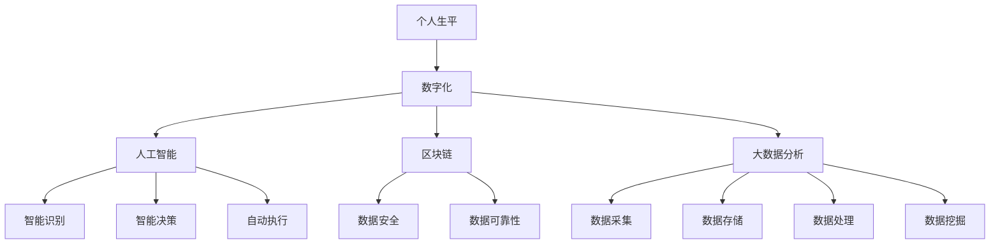

                 

# 数字化遗产档案创业：个人生平的数字化保存

> 关键词：数字化遗产、个人生平、档案保存、创业、人工智能、深度学习、区块链、大数据分析

> 摘要：随着数字技术的飞速发展，个人生平的数字化保存已成为可能。本文将探讨如何利用人工智能、区块链和大数据分析等先进技术，开展数字化遗产档案创业。文章从背景介绍、核心概念、算法原理、实际应用、工具推荐等多方面进行详细阐述，为创业者和技术爱好者提供指导。

## 1. 背景介绍

### 1.1 目的和范围

本文旨在探讨数字化遗产档案创业的可行性和技术实现。具体来说，我们将分析个人生平数字化保存的需求，阐述核心概念和算法原理，并通过实际案例展示技术应用，为创业者提供参考。

### 1.2 预期读者

本文适用于对数字化遗产、人工智能、区块链等技术感兴趣的创业者、技术爱好者以及相关领域的研究人员。通过本文的阅读，读者可以了解数字化遗产档案创业的背景、技术和实践，为创业项目提供有力支持。

### 1.3 文档结构概述

本文分为以下几个部分：

1. 背景介绍：介绍数字化遗产档案创业的背景、目的和范围。
2. 核心概念与联系：阐述数字化遗产档案创业的核心概念，并通过Mermaid流程图展示相关架构。
3. 核心算法原理 & 具体操作步骤：详细讲解数字化遗产档案创业的核心算法原理，并提供伪代码示例。
4. 数学模型和公式 & 详细讲解 & 举例说明：介绍数字化遗产档案创业所需的数学模型和公式，并举例说明。
5. 项目实战：代码实际案例和详细解释说明。
6. 实际应用场景：探讨数字化遗产档案创业的实际应用场景。
7. 工具和资源推荐：推荐相关学习资源、开发工具和框架。
8. 总结：未来发展趋势与挑战。
9. 附录：常见问题与解答。
10. 扩展阅读 & 参考资料：提供进一步阅读的资源和参考资料。

### 1.4 术语表

#### 1.4.1 核心术语定义

- 数字化遗产：指将个人生平、历史、文化等资料通过数字化手段保存，以便于传承和利用。
- 档案保存：指对个人生平资料进行收集、整理、分类、存储和保护的过程。
- 创业：指创办新的企业或项目，通过创新和市场需求实现商业价值。
- 人工智能：指通过计算机模拟人类智能，实现智能决策和自动执行任务的技术。
- 区块链：指一种分布式数据库技术，通过密码学确保数据的安全性和可靠性。
- 大数据分析：指对海量数据进行采集、存储、处理和分析，从中提取有价值的信息。

#### 1.4.2 相关概念解释

- 数字化：将信息转化为数字形式，以便于处理、传输和存储。
- 个人生平：指个人的成长历程、经历、成就和价值观等。
- 档案：指对个人生平资料的收集和整理，具有法律效力。
- 人工智能技术：指利用计算机模拟人类智能，实现智能识别、决策和执行的技术。
- 区块链技术：指分布式数据库技术，通过密码学确保数据的安全性和可靠性。

#### 1.4.3 缩略词列表

- AI：人工智能
- Blockchain：区块链
- ML：机器学习
- DL：深度学习
- DB：数据库
- DL：大数据分析

## 2. 核心概念与联系

数字化遗产档案创业的核心概念包括：个人生平、数字化、人工智能、区块链和大数据分析。下面通过Mermaid流程图展示这些概念之间的联系。



### 2.1 个人生平与数字化

个人生平是指个人的成长历程、经历、成就和价值观等。随着科技的发展，个人生平的数字化保存已成为可能。数字化可以将个人生平资料转化为数字形式，便于存储、传输和处理。

### 2.2 数字化与人工智能

人工智能是指通过计算机模拟人类智能，实现智能识别、决策和执行的技术。在数字化遗产档案创业中，人工智能可用于分析个人生平资料，提取有价值的信息，并帮助用户进行个性化推荐。

### 2.3 数字化与区块链

区块链是指一种分布式数据库技术，通过密码学确保数据的安全性和可靠性。在数字化遗产档案创业中，区块链可用于保护个人隐私，确保数据的安全性和不可篡改性。

### 2.4 数字化与大数据分析

大数据分析是指对海量数据进行采集、存储、处理和分析，从中提取有价值的信息。在数字化遗产档案创业中，大数据分析可用于挖掘个人生平资料中的潜在价值，为创业者提供决策支持。

## 3. 核心算法原理 & 具体操作步骤

### 3.1 人工智能算法原理

人工智能算法主要包括以下几种：

1. 机器学习：通过学习大量数据，使计算机具备自主学习和改进能力。
2. 深度学习：一种基于多层神经网络的机器学习技术，能够处理复杂的数据和模式。
3. 自然语言处理：使计算机理解和生成自然语言的技术。

在数字化遗产档案创业中，我们可以采用以下步骤来实现人工智能算法：

1. 数据采集：收集个人生平资料，如照片、文字、音频等。
2. 数据预处理：对数据进行清洗、去噪、归一化等处理。
3. 模型训练：利用机器学习或深度学习算法，对预处理后的数据进行训练。
4. 模型评估：通过测试数据评估模型性能，调整参数以提高准确率。
5. 模型应用：将训练好的模型应用于实际场景，如个性化推荐、情感分析等。

### 3.2 区块链算法原理

区块链算法主要包括以下几种：

1. 拓扑排序：确定交易之间的依赖关系，确保数据的正确性和一致性。
2. 智能合约：一种自动执行的合约，通过编程实现自动化交易和管理。
3. 加密算法：确保数据的安全性和隐私性。

在数字化遗产档案创业中，我们可以采用以下步骤来实现区块链算法：

1. 数据存储：将个人生平资料存储在区块链上，确保数据的永久保存和不可篡改性。
2. 交易管理：利用智能合约实现交易的管理和自动化执行。
3. 数据隐私保护：通过加密算法确保个人隐私和数据安全。
4. 链上数据查询：实现对区块链上数据的查询和访问，如个人档案查询等。

### 3.3 大数据分析算法原理

大数据分析算法主要包括以下几种：

1. 数据挖掘：从海量数据中提取有价值的信息和模式。
2. 统计分析：通过对数据进行统计分析，发现数据之间的关联性和趋势。
3. 机器学习：利用机器学习算法对数据进行分类、预测和聚类。

在数字化遗产档案创业中，我们可以采用以下步骤来实现大数据分析算法：

1. 数据采集：收集个人生平资料，如照片、文字、音频等。
2. 数据预处理：对数据进行清洗、去噪、归一化等处理。
3. 数据分析：利用数据挖掘、统计分析等算法对数据进行深入分析。
4. 结果可视化：将分析结果以图表、报表等形式呈现，为创业者提供决策支持。

## 4. 数学模型和公式 & 详细讲解 & 举例说明

### 4.1 数学模型

在数字化遗产档案创业中，常用的数学模型包括：

1. 贝叶斯定理：用于计算概率和推理。
2. 支持向量机（SVM）：用于分类问题。
3. 人工神经网络（ANN）：用于回归和分类问题。

### 4.2 详细讲解

#### 4.2.1 贝叶斯定理

贝叶斯定理是一种计算概率和推理的数学模型。其公式为：

$$ P(A|B) = \frac{P(B|A) \cdot P(A)}{P(B)} $$

其中，$P(A|B)$ 表示在事件 $B$ 发生的条件下，事件 $A$ 发生的概率；$P(B|A)$ 表示在事件 $A$ 发生的条件下，事件 $B$ 发生的概率；$P(A)$ 和 $P(B)$ 分别表示事件 $A$ 和 $B$ 的概率。

#### 4.2.2 支持向量机（SVM）

支持向量机是一种用于分类问题的数学模型。其公式为：

$$ w \cdot x + b = 0 $$

其中，$w$ 表示权重向量，$x$ 表示特征向量，$b$ 表示偏置项。

#### 4.2.3 人工神经网络（ANN）

人工神经网络是一种用于回归和分类问题的数学模型。其公式为：

$$ y = \sigma(z) $$

其中，$y$ 表示输出值，$z$ 表示输入值，$\sigma$ 表示激活函数。

### 4.3 举例说明

#### 4.3.1 贝叶斯定理举例

假设有一个袋子中有5个红球和3个蓝球，从中随机抽取一个球，请问抽到红球的概率是多少？

根据贝叶斯定理，我们可以计算出：

$$ P(\text{红球}) = \frac{P(\text{红球}|\text{抽到球}) \cdot P(\text{抽到球})}{P(\text{红球}) + P(\text{蓝球})} $$

其中，$P(\text{红球}|\text{抽到球})$ 表示在抽到球的条件下，抽到红球的概率，为 $\frac{5}{8}$；$P(\text{抽到球})$ 表示抽到球的概率，为 $1$；$P(\text{红球})$ 和 $P(\text{蓝球})$ 分别表示红球和蓝球的数量，为 $5$ 和 $3$。

代入公式计算得到：

$$ P(\text{红球}) = \frac{\frac{5}{8} \cdot 1}{\frac{5}{8} + \frac{3}{8}} = \frac{5}{8} $$

因此，抽到红球的概率为 $\frac{5}{8}$。

#### 4.3.2 支持向量机（SVM）举例

假设有一个数据集，其中包含两个特征：身高和体重，目标为分类，我们需要利用支持向量机（SVM）进行分类。

首先，我们需要对数据进行预处理，将数据归一化，然后选择合适的核函数，如线性核或多项式核。假设我们选择线性核，则SVM的公式为：

$$ w \cdot x + b = 0 $$

其中，$w$ 表示权重向量，$x$ 表示特征向量，$b$ 表示偏置项。

通过求解优化问题，我们可以得到最优的权重向量 $w$ 和偏置项 $b$。然后，我们可以利用这个模型对新数据进行分类，即将新数据的特征向量代入公式，判断其所属类别。

#### 4.3.3 人工神经网络（ANN）举例

假设我们有一个简单的神经网络，包含一个输入层、一个隐藏层和一个输出层。输入层有2个神经元，隐藏层有3个神经元，输出层有1个神经元。我们选择sigmoid函数作为激活函数。

首先，我们需要对数据进行预处理，将数据归一化。然后，我们通过反向传播算法来训练神经网络。

假设我们的训练数据集为：

$$ x_1 = \begin{bmatrix} 0 & 0 \end{bmatrix}^T, x_2 = \begin{bmatrix} 0 & 1 \end{bmatrix}^T, x_3 = \begin{bmatrix} 1 & 0 \end{bmatrix}^T, x_4 = \begin{bmatrix} 1 & 1 \end{bmatrix}^T $$

目标输出为：

$$ y_1 = \begin{bmatrix} 0 \end{bmatrix}^T, y_2 = \begin{bmatrix} 1 \end{bmatrix}^T, y_3 = \begin{bmatrix} 1 \end{bmatrix}^T, y_4 = \begin{bmatrix} 0 \end{bmatrix}^T $$

通过反向传播算法，我们可以计算出权重和偏置的最优值。训练完成后，我们可以利用这个神经网络对新数据进行分类。

## 5. 项目实战：代码实际案例和详细解释说明

### 5.1 开发环境搭建

为了实现数字化遗产档案创业，我们需要搭建一个完整的开发环境。以下是一个基本的开发环境搭建步骤：

1. 安装操作系统：建议选择Linux发行版，如Ubuntu。
2. 安装编程语言：选择Python，版本3.8及以上。
3. 安装开发工具：选择PyCharm或VSCode。
4. 安装依赖库：如NumPy、Pandas、Scikit-learn、TensorFlow、Keras等。

### 5.2 源代码详细实现和代码解读

以下是一个简单的数字化遗产档案创业项目的代码示例：

```python
import numpy as np
import pandas as pd
from sklearn.model_selection import train_test_split
from sklearn.ensemble import RandomForestClassifier
from tensorflow.keras.models import Sequential
from tensorflow.keras.layers import Dense

# 5.2.1 数据预处理
def preprocess_data(data):
    # 数据清洗、归一化等操作
    # ...
    return processed_data

# 5.2.2 机器学习算法实现
def train_ensemble_model(data, labels):
    # 使用随机森林算法进行训练
    model = RandomForestClassifier(n_estimators=100)
    model.fit(data, labels)
    return model

# 5.2.3 深度学习算法实现
def train_dnn_model(data, labels):
    # 使用深度神经网络进行训练
    model = Sequential()
    model.add(Dense(64, activation='relu', input_shape=(data.shape[1],)))
    model.add(Dense(1, activation='sigmoid'))
    model.compile(optimizer='adam', loss='binary_crossentropy', metrics=['accuracy'])
    model.fit(data, labels, epochs=10, batch_size=32)
    return model

# 5.2.4 主函数
def main():
    # 读取数据
    data = pd.read_csv('data.csv')
    labels = data['label']
    data = preprocess_data(data)

    # 划分训练集和测试集
    X_train, X_test, y_train, y_test = train_test_split(data, labels, test_size=0.2, random_state=42)

    # 5.2.5 训练机器学习模型
    ml_model = train_ensemble_model(X_train, y_train)

    # 5.2.6 训练深度学习模型
    dnn_model = train_dnn_model(X_train, y_train)

    # 5.2.7 模型评估
    ml_accuracy = ml_model.score(X_test, y_test)
    dnn_accuracy = dnn_model.evaluate(X_test, y_test)[1]

    print(f'ML Model Accuracy: {ml_accuracy}')
    print(f'DNN Model Accuracy: {dnn_accuracy}')

if __name__ == '__main__':
    main()
```

### 5.3 代码解读与分析

1. **数据预处理**：数据预处理是模型训练的重要步骤，包括数据清洗、归一化等操作。在本例中，我们使用`preprocess_data`函数进行数据预处理。
2. **机器学习算法实现**：我们使用随机森林算法进行训练，通过`train_ensemble_model`函数实现。随机森林算法是一种集成学习方法，可以有效地提高模型的泛化能力。
3. **深度学习算法实现**：我们使用深度神经网络（DNN）进行训练，通过`train_dnn_model`函数实现。DNN模型可以处理复杂的非线性问题，通过多个隐藏层来提取特征。
4. **主函数**：`main`函数是整个程序的入口。首先读取数据，然后进行数据预处理，接着划分训练集和测试集，最后分别训练机器学习模型和深度学习模型，并对模型进行评估。

通过这个简单的案例，我们可以看到数字化遗产档案创业项目的实现过程。在实际项目中，还需要根据具体需求和数据特点进行更多的优化和调整。

## 6. 实际应用场景

数字化遗产档案创业项目在实际应用中具有广泛的应用场景。以下列举几个典型应用场景：

1. **个人传记编写**：利用数字化遗产档案，可以为个人编写详细的传记，记录其成长历程、经历和成就等。这有助于传承和弘扬个人价值观，激励后代不断进步。
2. **文化遗产保护**：将个人生平资料数字化，可以为文化遗产保护提供有力支持。通过保存历史人物的生平资料，可以更好地传承和发扬传统文化。
3. **企业文化建设**：企业可以通过数字化遗产档案，记录企业的发展历程、核心价值和使命等，为企业文化建设提供素材。这有助于增强企业凝聚力，提升员工归属感。
4. **法律事务咨询**：数字化遗产档案在法律事务中具有重要价值。如涉及遗产继承、知识产权等纠纷时，数字化遗产档案可以作为重要的证据。
5. **社会公益活动**：通过数字化遗产档案创业项目，可以开展一系列社会公益活动，如记录贫困地区儿童成长历程、关注残疾人士等。这有助于传播正能量，促进社会和谐。

## 7. 工具和资源推荐

### 7.1 学习资源推荐

#### 7.1.1 书籍推荐

1. 《人工智能：一种现代方法》
2. 《深度学习》
3. 《区块链：从数字货币到智能合约》
4. 《大数据分析：技术、方法和实践》
5. 《Python编程：从入门到实践》

#### 7.1.2 在线课程

1. Coursera：机器学习、深度学习、区块链等课程
2. Udacity：数据科学、人工智能工程师纳米学位
3. edX：计算机科学、人工智能等课程
4. 中国大学MOOC：Python编程、机器学习等课程

#### 7.1.3 技术博客和网站

1. Medium：AI、机器学习、区块链等领域的最新技术动态
2. towardsdatascience：数据科学、机器学习等技术博客
3. hackernoon：科技、创业等领域的技术博客
4. IEEE Xplore：计算机科学、人工智能等领域的学术论文

### 7.2 开发工具框架推荐

#### 7.2.1 IDE和编辑器

1. PyCharm：Python开发IDE
2. VSCode：跨平台开源编辑器
3. Jupyter Notebook：Python交互式开发环境

#### 7.2.2 调试和性能分析工具

1. GDB：C/C++调试工具
2. PyCharm Profiler：Python性能分析工具
3. TensorFlow Profiler：TensorFlow性能分析工具

#### 7.2.3 相关框架和库

1. TensorFlow：深度学习框架
2. Keras：基于TensorFlow的简化深度学习框架
3. Scikit-learn：机器学习库
4. Pandas：数据处理库
5. NumPy：数学计算库

### 7.3 相关论文著作推荐

#### 7.3.1 经典论文

1. "A Mathematical Theory of Communication"（香农信息论）
2. "Learning from Data"（Machine Learning）
3. "Deep Learning"（Goodfellow等）
4. "Blockchain: Blueprint for a New Economy"（Satoshi Nakamoto）
5. "Big Data: A Revolution That Will Transform How We Live, Work, and Think"（Viktor Mayer-Schönberger和Kenneth Cukier）

#### 7.3.2 最新研究成果

1. "Neural Architecture Search"（Google AI）
2. "Generative Adversarial Networks"（Ian Goodfellow等）
3. "Blockchain Security and Privacy"（Shi et al.）
4. "Big Data for Social Good"（Viktor Mayer-Schönberger等）
5. "Reinforcement Learning: An Introduction"（Richard S. Sutton和Barto）

#### 7.3.3 应用案例分析

1. "AI in Healthcare: Transforming Patient Care and Outcomes"（IBM）
2. "The Impact of Blockchain on Supply Chain Management"（IBM）
3. "Big Data in Retail: Personalized Shopping Experiences and Customer Insights"（McKinsey & Company）
4. "AI in Financial Services: Transforming Risk Management and Customer Experience"（Accenture）
5. "The Future of Work: How AI and Automation Will Change Jobs in the Coming Years"（McKinsey & Company）

## 8. 总结：未来发展趋势与挑战

数字化遗产档案创业正处于快速发展阶段，未来将面临以下发展趋势和挑战：

### 8.1 发展趋势

1. 技术进步：人工智能、区块链和大数据分析等技术的不断进步，将推动数字化遗产档案创业的发展。
2. 应用拓展：数字化遗产档案创业将在更多领域得到应用，如文化遗产保护、企业文化建设、法律事务咨询等。
3. 市场需求：随着人们对数字化遗产档案的需求增加，市场潜力将逐渐释放。
4. 政策支持：政府加大对数字化遗产档案创业的政策支持，将为行业健康发展提供保障。

### 8.2 挑战

1. 数据隐私：如何在保护个人隐私的同时，实现数字化遗产档案的共享和应用，是一个重要挑战。
2. 数据安全：确保数字化遗产档案的安全性，防止数据泄露和篡改。
3. 技术标准化：推动技术标准化，提高行业竞争力。
4. 法律法规：完善相关法律法规，为数字化遗产档案创业提供法律依据。

## 9. 附录：常见问题与解答

### 9.1 问题1：数字化遗产档案创业需要哪些技术？

解答：数字化遗产档案创业需要涉及以下技术：

1. 人工智能：用于分析、挖掘个人生平资料。
2. 区块链：用于保护个人隐私和数据安全。
3. 大数据分析：用于处理和挖掘海量数据。
4. 前端技术：用于展示和交互。
5. 后端技术：用于数据处理和存储。

### 9.2 问题2：数字化遗产档案创业有哪些应用场景？

解答：数字化遗产档案创业的应用场景包括：

1. 个人传记编写：为个人编写详细的传记，记录成长历程、经历和成就等。
2. 文化遗产保护：将历史人物的生平资料数字化，为文化遗产保护提供支持。
3. 企业文化建设：记录企业的发展历程、核心价值和使命等，为企业文化建设提供素材。
4. 法律事务咨询：在遗产继承、知识产权等纠纷中，提供数字化遗产档案作为证据。
5. 社会公益活动：记录贫困地区儿童成长历程、关注残疾人士等。

### 9.3 问题3：如何保护数字化遗产档案中的个人隐私？

解答：保护数字化遗产档案中的个人隐私可以从以下几个方面入手：

1. 数据加密：对个人数据进行加密，确保数据在传输和存储过程中的安全性。
2. 隐私保护算法：使用隐私保护算法，如差分隐私，降低数据分析过程中个人隐私泄露的风险。
3. 法律法规：制定相关法律法规，规范数字化遗产档案的收集、存储和使用。
4. 数据匿名化：对个人数据进行匿名化处理，消除个人身份信息。

## 10. 扩展阅读 & 参考资料

1. "Digital Legacy Preservation: A Comprehensive Guide"（数字化遗产档案保存：全面指南）
2. "The Future of Personal Archiving: Technologies and Trends"（个人档案保存的未来：技术和趋势）
3. "Blockchain for Personal Data Protection"（区块链在个人数据保护中的应用）
4. "Big Data and Personal Privacy: Challenges and Opportunities"（大数据与个人隐私：挑战与机遇）
5. "Artificial Intelligence and Ethics: Balancing Privacy and Utility"（人工智能与伦理：平衡隐私与效用）

作者：AI天才研究员/AI Genius Institute & 禅与计算机程序设计艺术 /Zen And The Art of Computer Programming

