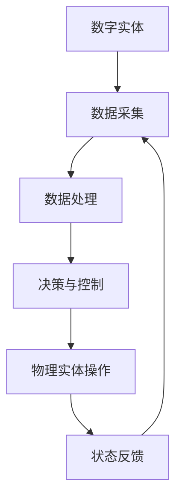

                 

# 数字实体与物理实体的自动化

> **关键词**：数字实体、物理实体、自动化、流程优化、人工智能

> **摘要**：本文将探讨数字实体与物理实体之间的自动化转换机制，以及如何通过先进的人工智能技术实现这一过程。文章首先介绍了数字实体与物理实体的概念及其相互关系，然后详细分析了自动化技术在其中的应用。通过具体的算法原理、数学模型和项目实战案例，读者将深入了解这一领域的技术内涵和应用前景。

## 1. 背景介绍

### 1.1 目的和范围

本文旨在阐述数字实体与物理实体之间自动化转换的原理和应用，旨在帮助读者理解这一技术的核心概念和实现方法。文章将覆盖以下内容：

1. 数字实体与物理实体的基本概念及其相互关系。
2. 自动化技术在数字实体与物理实体转换中的应用场景。
3. 核心算法原理和数学模型。
4. 项目实战案例及代码实现。
5. 未来发展趋势与挑战。

### 1.2 预期读者

本文面向对数字实体与物理实体自动化技术感兴趣的读者，包括：

1. 计算机科学和人工智能领域的科研人员。
2. 软件开发和系统架构师。
3. 对自动化和智能系统有深入探索的企业家和创业者。
4. 对新技术有强烈好奇心的广大技术爱好者。

### 1.3 文档结构概述

本文结构如下：

1. **背景介绍**：介绍数字实体与物理实体的概念及其相互关系，阐述自动化技术的应用背景。
2. **核心概念与联系**：定义数字实体与物理实体的基本概念，通过流程图展示二者之间的联系。
3. **核心算法原理 & 具体操作步骤**：详细讲解实现自动化转换的核心算法和步骤。
4. **数学模型和公式 & 详细讲解 & 举例说明**：引入数学模型，举例说明其在实际应用中的重要性。
5. **项目实战：代码实际案例和详细解释说明**：通过具体项目展示自动化技术的实现过程。
6. **实际应用场景**：分析自动化技术在各个行业中的应用。
7. **工具和资源推荐**：推荐相关学习资源和开发工具。
8. **总结：未来发展趋势与挑战**：探讨未来发展趋势和面临的挑战。
9. **附录：常见问题与解答**：解答读者可能遇到的问题。
10. **扩展阅读 & 参考资料**：提供进一步学习的资源链接。

### 1.4 术语表

#### 1.4.1 核心术语定义

- **数字实体**：在计算机系统中表示和操作的数据对象，如数据库中的记录、网络中的数据包等。
- **物理实体**：实际存在于现实世界中的物体，如机器、设备、人等。
- **自动化**：利用机器或设备完成原本需要人工操作的任务。
- **人工智能**：模拟人类智能行为的计算机技术。

#### 1.4.2 相关概念解释

- **物联网（IoT）**：将物理实体与互联网连接，实现智能感知、数据采集和远程控制。
- **边缘计算**：在靠近物理实体的地方进行数据处理，减少数据传输延迟。
- **机器学习**：利用算法从数据中学习模式，实现智能决策和预测。

#### 1.4.3 缩略词列表

- **AI**：人工智能
- **IoT**：物联网
- **ML**：机器学习
- **DB**：数据库
- **IDE**：集成开发环境

## 2. 核心概念与联系

在探讨数字实体与物理实体的自动化转换之前，我们首先需要明确这两个概念的基本定义及其相互关系。

### 2.1 数字实体

数字实体是指在计算机系统中表示和操作的数据对象，它们可以是结构化数据（如数据库中的记录）、半结构化数据（如XML、JSON）或非结构化数据（如文本、图像、视频）。数字实体的核心特征是其可编程性和可操作性的高效率。

### 2.2 物理实体

物理实体则是指实际存在于现实世界中的物体，如机器、设备、传感器等。它们具有物理形态和物理行为，其状态和属性可以通过各种传感器进行感知。

### 2.3 数字实体与物理实体的关系

数字实体与物理实体之间的关系可以通过以下流程图进行描述：



在这个流程中，数字实体通过数据采集、数据处理、决策与控制等步骤，实现对物理实体的操作。同时，物理实体的状态反馈又被采集回数字实体，形成闭环控制。

### 2.4 自动化技术在数字实体与物理实体转换中的应用

自动化技术是连接数字实体与物理实体的重要桥梁，其主要应用场景包括：

1. **智能制造**：利用机器学习和计算机视觉技术，实现对生产过程的自动化控制和优化。
2. **智能物流**：通过物联网技术，实现物流设备的自动化调度和管理。
3. **智能家居**：通过智能设备与云计算平台的连接，实现家庭环境的自动化控制和优化。
4. **智能交通**：利用边缘计算和机器学习技术，实现交通流量监控和智能调度。

## 3. 核心算法原理 & 具体操作步骤

在理解了数字实体与物理实体之间的关系后，我们接下来将详细讨论实现自动化转换的核心算法原理和具体操作步骤。

### 3.1 数据采集

数据采集是自动化转换的第一步，也是关键的一步。数据的质量和完整性直接影响到后续的处理和分析效果。常见的数据采集方法包括：

1. **传感器采集**：利用各种传感器（如温度传感器、湿度传感器、摄像头等）采集物理实体的实时状态数据。
2. **RFID技术**：利用RFID标签和阅读器，实现物理实体的自动识别和追踪。
3. **GPS技术**：通过卫星定位系统，获取物理实体的地理位置信息。

### 3.2 数据预处理

数据预处理是数据采集后的第一步，其目的是将原始数据转换为适合分析和处理的格式。数据预处理包括以下步骤：

1. **数据清洗**：去除数据中的噪声和异常值，保证数据的质量。
2. **数据转换**：将不同数据类型和格式的数据转换为统一的格式，如将文本数据转换为数值数据。
3. **数据归一化**：将不同量纲的数据转换为相同量纲，便于后续处理和分析。

### 3.3 数据处理与决策

在数据处理与决策阶段，我们利用机器学习和人工智能算法，对采集到的数据进行分析和处理，以实现自动化决策。具体步骤如下：

1. **特征提取**：从原始数据中提取出对决策有用的特征，如图像中的边缘、颜色等。
2. **模型训练**：利用已提取的特征，通过机器学习算法训练出预测模型。
3. **模型评估**：评估模型的准确性和可靠性，通过交叉验证、A/B测试等方法进行评估。
4. **决策与控制**：根据模型的预测结果，生成决策策略，实现对物理实体的自动化控制。

### 3.4 物理实体操作与状态反馈

在决策与控制阶段完成后，我们需要将决策结果传递给物理实体，实现对其的操作。同时，物理实体的状态反馈也是至关重要的，它可以帮助我们进一步优化和调整决策模型。具体步骤如下：

1. **执行操作**：将决策结果传递给物理实体，如启动设备、调整参数等。
2. **状态监测**：实时监测物理实体的状态，如温度、湿度、位置等。
3. **状态反馈**：将物理实体的状态反馈采集回数字实体，用于模型优化和调整。

### 3.5 闭环控制

闭环控制是自动化转换的核心，它通过实时监测和调整，确保物理实体按照预期运行。闭环控制的实现包括以下步骤：

1. **设定目标**：根据应用需求，设定物理实体的运行目标，如温度、速度等。
2. **实时监测**：通过传感器等设备，实时监测物理实体的状态。
3. **自适应调整**：根据实时监测结果，自动调整决策参数，确保物理实体达到目标状态。

### 3.6 伪代码示例

以下是一个简单的伪代码示例，用于说明自动化转换的过程：

```python
# 数据采集
data = collect_data(sensors)

# 数据预处理
cleaned_data = preprocess_data(data)

# 数据处理与决策
features = extract_features(cleaned_data)
model = train_model(features)
prediction = make_decision(model)

# 物理实体操作
execute_operation(prediction)

# 状态反馈
status = monitor_status(physical_entity)
update_model(status)
```

## 4. 数学模型和公式 & 详细讲解 & 举例说明

在自动化转换过程中，数学模型和公式扮演着至关重要的角色。它们不仅帮助我们描述和分析问题，还能提供有效的解决方案。以下我们将介绍一些关键的数学模型和公式，并通过具体例子进行讲解。

### 4.1 机器学习模型

机器学习模型是自动化转换的核心，它们通过从数据中学习模式，实现预测和决策。以下是一些常用的机器学习模型：

1. **线性回归模型**：
   $$ y = \beta_0 + \beta_1x $$
   线性回归模型用于预测连续值输出，例如温度、速度等。

2. **逻辑回归模型**：
   $$ P(y=1) = \frac{1}{1 + e^{-(\beta_0 + \beta_1x)}} $$
   逻辑回归模型用于预测二元分类结果，例如是否缺勤、是否违约等。

3. **支持向量机（SVM）模型**：
   $$ w \cdot x + b = 0 $$
   支持向量机模型用于预测高维空间中的分类问题。

4. **神经网络模型**：
   $$ a_{\text{layer}} = \sigma(z_{\text{layer}}) $$
   神经网络模型通过多层神经网络，实现复杂的非线性预测和分类。

### 4.2 数学模型的应用

以下是一个简单的例子，说明如何使用机器学习模型进行温度预测：

**例子**：使用线性回归模型预测某地未来24小时内的温度。

1. **数据收集**：收集过去一周内的每日最高温度和最低温度数据。
2. **数据预处理**：将数据分为特征（日期）和标签（温度）。
3. **模型训练**：使用线性回归模型对数据集进行训练。
4. **模型评估**：通过交叉验证评估模型的准确性和泛化能力。
5. **温度预测**：使用训练好的模型预测未来24小时内的温度。

具体步骤如下：

```python
# 导入线性回归模型库
from sklearn.linear_model import LinearRegression

# 导入数据
data = load_data()

# 分离特征和标签
X = data[:, 0]  # 日期
y = data[:, 1]  # 温度

# 初始化线性回归模型
model = LinearRegression()

# 训练模型
model.fit(X, y)

# 预测未来24小时温度
predictions = model.predict(X_future)

# 输出预测结果
print(predictions)
```

### 4.3 数学模型的重要性

数学模型在自动化转换中的应用具有重要意义。首先，它们能够将复杂的问题转化为可计算的数学问题，从而提供有效的解决方案。其次，数学模型可以通过训练和学习，不断提高预测和决策的准确性，从而优化自动化系统的性能。

总之，数学模型和公式是自动化转换的基石，它们帮助我们理解和解决数字实体与物理实体之间的转换问题。

## 5. 项目实战：代码实际案例和详细解释说明

为了更直观地展示数字实体与物理实体自动化的实现过程，我们将通过一个实际项目案例进行详细讲解。该项目旨在利用物联网（IoT）技术和人工智能（AI）算法，实现对智能家居环境的自动控制和优化。

### 5.1 开发环境搭建

在开始项目实战之前，我们需要搭建一个适合开发的环境。以下是一些推荐的工具和库：

- **编程语言**：Python
- **开发环境**：Visual Studio Code 或 PyCharm
- **数据库**：MySQL 或 MongoDB
- **机器学习库**：scikit-learn、TensorFlow、Keras
- **IoT平台**：AWS IoT Core、Google Cloud IoT

### 5.2 源代码详细实现和代码解读

#### 5.2.1 数据采集

首先，我们需要从物理实体（如温度传感器、湿度传感器等）采集数据。以下是一个简单的Python代码示例，用于读取传感器数据并存储到数据库中。

```python
import MySQLdb

# 数据库连接
db = MySQLdb.connect("localhost", "username", "password", "database")

# 读取传感器数据
def read_sensors():
    temperature = read_temperature_sensor()
    humidity = read_humidity_sensor()
    return temperature, humidity

# 存储传感器数据到数据库
def store_sensors_data(temperature, humidity):
    cursor = db.cursor()
    cursor.execute("INSERT INTO sensors_data (temperature, humidity) VALUES (%s, %s)", (temperature, humidity))
    db.commit()

# 读取传感器数据并存储
while True:
    temperature, humidity = read_sensors()
    store_sensors_data(temperature, humidity)
    time.sleep(60)  # 每分钟采集一次数据
```

#### 5.2.2 数据预处理

在数据采集完成后，我们需要对数据进行预处理，包括数据清洗、数据转换和数据归一化。以下是一个简单的预处理代码示例。

```python
import numpy as np

# 数据清洗
def clean_data(data):
    cleaned_data = []
    for row in data:
        if row[0] > 0 and row[1] > 0:
            cleaned_data.append(row)
    return cleaned_data

# 数据转换
def convert_data(data):
    X = []
    y = []
    for row in data:
        X.append([row[0], row[1]])
        y.append(row[2])
    return np.array(X), np.array(y)

# 数据归一化
def normalize_data(data):
    min_max_scaler = MinMaxScaler()
    normalized_data = min_max_scaler.fit_transform(data)
    return normalized_data
```

#### 5.2.3 数据处理与决策

接下来，我们利用机器学习算法对预处理后的数据进行训练，并生成预测模型。以下是一个使用线性回归模型进行温度预测的示例。

```python
from sklearn.linear_model import LinearRegression

# 训练模型
def train_model(X, y):
    model = LinearRegression()
    model.fit(X, y)
    return model

# 预测温度
def predict_temperature(model, X):
    prediction = model.predict(X)
    return prediction
```

#### 5.2.4 物理实体操作与状态反馈

最后，我们将预测结果传递给物理实体（如空调、加湿器等），并根据物理实体的状态反馈进行模型优化。以下是一个简单的Python代码示例。

```python
import RPi.GPIO as GPIO
import time

# 控制物理实体
def control_device(device, status):
    if status == "ON":
        device.turn_on()
    else:
        device.turn_off()

# 状态反馈
def update_model(status):
    if status == "HOT":
        control_device(air_conditioner, "ON")
    elif status == "COOL":
        control_device(heater, "ON")
    elif status == "NORMAL":
        control_device(fan, "ON")

# 主程序
while True:
    # 采集数据
    temperature, humidity = read_sensors()

    # 数据预处理
    cleaned_data = clean_data([temperature, humidity])
    normalized_data = normalize_data(cleaned_data)

    # 数据处理与决策
    model = train_model(normalized_data, y)
    prediction = predict_temperature(model, normalized_data)

    # 物理实体操作与状态反馈
    update_model(prediction)
    time.sleep(60)  # 每分钟循环一次
```

### 5.3 代码解读与分析

在上述代码示例中，我们实现了以下关键步骤：

1. **数据采集**：通过读取传感器数据，将温度和湿度信息存储到数据库中。
2. **数据预处理**：对采集到的数据进行清洗、转换和归一化，为后续的机器学习训练做准备。
3. **数据处理与决策**：利用线性回归模型对预处理后的数据集进行训练，并生成预测模型。
4. **物理实体操作与状态反馈**：根据预测结果，控制物理实体（如空调、加湿器等）的开关状态，并根据物理实体的状态反馈进行模型优化。

通过这个项目案例，我们可以清晰地看到数字实体与物理实体自动化的实现过程。在实际应用中，可以根据具体需求对算法和模型进行调整和优化，以提高系统的性能和准确性。

## 6. 实际应用场景

自动化技术在数字实体与物理实体转换中具有广泛的应用场景，涵盖了多个行业和领域。以下是一些典型的应用场景：

### 6.1 智能制造

智能制造是自动化技术在工业生产中最典型的应用场景之一。通过物联网（IoT）技术，将各种生产设备与计算机系统连接，实现对生产过程的实时监控和自动化控制。例如，利用机器视觉系统检测产品质量，利用机器学习算法优化生产流程，利用机器人自动完成装配和搬运任务。

### 6.2 智能物流

智能物流是自动化技术在物流领域的重要应用。通过物联网和边缘计算技术，实现物流设备的自动化调度和管理。例如，利用RFID标签和传感器，对物流货物进行实时追踪和管理；利用人工智能算法，优化运输路线和配送策略，提高物流效率。

### 6.3 智能家居

智能家居是自动化技术在家庭生活领域的应用。通过智能设备与云计算平台的连接，实现对家庭环境的自动化控制和优化。例如，通过智能门锁和摄像头，实现对家庭安全的监控和报警；通过智能空调和照明系统，实现家庭能源的高效利用和舒适控制。

### 6.4 智能交通

智能交通是自动化技术在交通运输领域的重要应用。通过物联网、边缘计算和机器学习技术，实现交通流量监控、智能调度和交通事故预警。例如，通过车载传感器和路况监控设备，实时采集交通数据，利用人工智能算法，优化交通信号控制和交通流量调度。

### 6.5 医疗保健

医疗保健是自动化技术在医疗领域的应用。通过物联网和人工智能技术，实现对病人病情的实时监测和管理。例如，通过可穿戴设备监测病人的心率、血压等生理指标，通过智能诊断系统提供病情分析和建议；利用机器人进行手术操作和康复训练。

### 6.6 能源管理

能源管理是自动化技术在能源领域的应用。通过物联网和边缘计算技术，实现对能源消耗的实时监控和优化管理。例如，通过智能电表和传感器，实时监测电力消耗情况，利用人工智能算法优化用电策略，提高能源利用效率。

综上所述，自动化技术在数字实体与物理实体转换中具有广泛的应用场景，不仅提高了生产效率和生活质量，还为各行业的发展带来了新的机遇和挑战。

## 7. 工具和资源推荐

在数字实体与物理实体自动化技术的学习和实践中，掌握合适的工具和资源是至关重要的。以下是一些推荐的工具和资源，以帮助读者深入了解和掌握这一领域。

### 7.1 学习资源推荐

#### 7.1.1 书籍推荐

1. **《深度学习》（Deep Learning）**：作者 Ian Goodfellow、Yoshua Bengio 和 Aaron Courville，全面介绍了深度学习的基础理论和技术。
2. **《机器学习》（Machine Learning）**：作者 Tom Mitchell，详细讲解了机器学习的基本概念和方法。
3. **《智能运输系统：设计与分析》（Intelligent Transportation Systems: Design and Analysis）**：作者 Steven D. Eppinger 和 John F. Hadley，介绍了智能交通系统的发展和应用。

#### 7.1.2 在线课程

1. **Coursera**：提供了丰富的机器学习和人工智能课程，如《机器学习》（吴恩达教授讲授）和《深度学习》（阿里云天池团队讲授）。
2. **edX**：提供了由哈佛大学、麻省理工学院等顶级学府开设的计算机科学和人工智能课程。
3. **Udacity**：提供了专注于职业技能培养的机器学习和人工智能课程，如《自动驾驶汽车工程师》和《智能城市交通系统工程师》。

#### 7.1.3 技术博客和网站

1. **Medium**：有许多关于机器学习和人工智能的文章，如《AI 之旅》、《机器学习之旅》等。
2. **GitHub**：可以找到许多开源的机器学习和物联网项目，如 TensorFlow、Keras、PyTorch 等。
3. **Medium**：有许多关于智能制造、智能物流、智能家居等领域的专业文章和案例分析。

### 7.2 开发工具框架推荐

#### 7.2.1 IDE和编辑器

1. **Visual Studio Code**：一款轻量级且功能强大的代码编辑器，适用于 Python、C++、Java等多种编程语言。
2. **PyCharm**：一款专为 Python 开发者设计的集成开发环境，提供丰富的插件和工具。
3. **Eclipse**：一款跨平台的集成开发环境，适用于 Java 和其他多种编程语言。

#### 7.2.2 调试和性能分析工具

1. **GDB**：一款开源的调试工具，适用于 C、C++等编程语言。
2. **Valgrind**：一款性能分析工具，用于检测内存泄漏和性能瓶颈。
3. **Wireshark**：一款网络协议分析工具，用于网络数据的捕获和分析。

#### 7.2.3 相关框架和库

1. **TensorFlow**：一款开源的深度学习框架，适用于构建和训练复杂的神经网络模型。
2. **Keras**：一款基于 TensorFlow 的深度学习库，提供了简洁易用的接口，适用于快速原型开发和实验。
3. **scikit-learn**：一款开源的机器学习库，提供了丰富的算法和工具，适用于数据分析和预测。

### 7.3 相关论文著作推荐

#### 7.3.1 经典论文

1. **"Backpropagation"**：作者 Paul Werbos，介绍了反向传播算法，是神经网络训练的基础。
2. **"Convolutional Neural Networks for Visual Recognition"**：作者 Yann LeCun、Yoshua Bengio 和 Geoffrey Hinton，介绍了卷积神经网络在图像识别中的应用。
3. **"Reinforcement Learning: An Introduction"**：作者 Richard S. Sutton 和 Andrew G. Barto，介绍了强化学习的基本概念和方法。

#### 7.3.2 最新研究成果

1. **"Deep Learning with Python"**：作者 François Chollet，介绍了深度学习在自然语言处理和计算机视觉等领域的最新应用。
2. **"Human-Level Control Through Deep Reinforcement Learning"**：作者 David Silver、Alex Graves 和 George E. Dahl，介绍了深度强化学习在游戏和机器人控制中的应用。
3. **"The Transformer Model"**：作者 Vaswani et al.，介绍了 Transformer 模型在自然语言处理领域的突破性应用。

#### 7.3.3 应用案例分析

1. **"Deep Learning in Industry"**：作者 Andrew Ng，介绍了深度学习在工业界的应用案例，如自动驾驶、医疗诊断和智能客服等。
2. **"AI in Transportation"**：作者史蒂芬·霍金和马克·斯特兰奇，探讨了人工智能在交通运输领域的应用前景和挑战。
3. **"The Future of IoT"**：作者汤姆·希基，分析了物联网在智能家居、智能城市和智能物流等领域的应用趋势和挑战。

通过这些工具和资源的帮助，读者可以更深入地了解数字实体与物理实体自动化技术的原理和应用，为自己的学习和研究提供有力支持。

## 8. 总结：未来发展趋势与挑战

随着数字技术与物理实体融合的日益深入，数字实体与物理实体的自动化技术正迎来前所未有的发展机遇。未来，这一领域的发展趋势和挑战可以从以下几个方面进行展望：

### 8.1 未来发展趋势

1. **跨领域融合**：自动化技术将在更多领域得到应用，如医疗、教育、能源等。不同领域的需求将推动技术的交叉融合，形成更为复杂和智能的自动化系统。
2. **人工智能算法的进步**：随着深度学习、强化学习等人工智能算法的不断发展，自动化系统的决策能力将得到显著提升，实现更为精准和高效的控制。
3. **物联网与边缘计算的结合**：物联网技术的普及和边缘计算的发展，将使自动化系统更加贴近物理实体，实现实时监控和快速响应。
4. **数据驱动的发展**：大数据和云计算技术的发展，将为自动化系统提供丰富的数据支持，促进从数据中发现规律和优化控制策略。
5. **智能设备的普及**：随着智能设备的普及，自动化系统将更加便捷地嵌入到人们的日常生活中，提高生活质量和效率。

### 8.2 面临的挑战

1. **数据隐私与安全问题**：随着数据量的急剧增加，如何保护用户隐私和安全成为一个重要挑战。确保数据的安全性和隐私性是自动化系统发展的关键。
2. **技术标准与法规**：不同行业和应用场景对自动化技术的要求各异，制定统一的技术标准和法规成为推动技术发展的关键。需要协调各方利益，建立可行的标准和法规体系。
3. **技术可靠性与稳定性**：自动化系统在运行过程中需要保证高度的可靠性和稳定性。如何确保系统在复杂环境下的稳定运行，是技术发展的一个重要问题。
4. **跨领域协同**：实现不同领域技术的协同发展，需要克服技术壁垒和协同机制。如何在不同领域间建立有效的协作机制，是自动化技术发展的重要挑战。
5. **人才需求与培养**：自动化技术的发展需要大量具备跨学科知识和技能的专业人才。如何培养和吸引高素质的人才，是推动技术发展的重要问题。

总之，数字实体与物理实体的自动化技术将在未来得到广泛应用，带来巨大的社会和经济价值。然而，这一领域的发展也面临诸多挑战，需要各方共同努力，推动技术的不断创新和进步。

## 9. 附录：常见问题与解答

### 9.1 问题1：自动化技术是否只适用于大型企业和项目？

**解答**：自动化技术并不局限于大型企业和项目。事实上，中小企业和个人创业者也可以通过自动化技术提高效率、降低成本。例如，使用自动化工具进行日常任务管理、客户关系维护和数据采集，这些都可以为小型企业带来显著的优势。

### 9.2 问题2：自动化系统如何确保数据安全和隐私？

**解答**：确保数据安全和隐私是自动化系统设计的重要方面。以下措施可以帮助提高数据安全性：

1. **数据加密**：对传输和存储的数据进行加密，防止数据被非法访问。
2. **访问控制**：通过访问控制机制，限制对数据的访问权限，确保只有授权用户可以访问敏感数据。
3. **日志审计**：记录系统操作日志，以便在出现安全事件时进行追踪和审计。
4. **安全培训**：对系统操作人员进行安全培训，提高其安全意识和操作水平。

### 9.3 问题3：如何选择适合的自动化工具和框架？

**解答**：选择适合的自动化工具和框架需要考虑以下几个方面：

1. **项目需求**：根据项目需求和目标，选择适合的工具和框架。例如，对于大数据处理，可以选择 Hadoop 和 Spark；对于机器学习，可以选择 TensorFlow 或 PyTorch。
2. **生态系统**：考虑工具和框架的生态系统，包括社区支持、文档、教程和资源。
3. **性能和可扩展性**：评估工具和框架的性能和可扩展性，确保其能够满足项目需求。
4. **成本**：考虑工具和框架的成本，包括购买成本和运营成本。

### 9.4 问题4：自动化系统如何确保稳定性？

**解答**：确保自动化系统的稳定性需要采取以下措施：

1. **系统监控**：实时监控系统性能和运行状态，及时发现和处理异常。
2. **容错设计**：在设计自动化系统时，考虑容错机制，确保在系统故障时能够自动恢复。
3. **定期维护**：定期对系统进行维护和升级，确保系统保持最佳状态。
4. **测试和验证**：在系统开发和部署过程中，进行充分的测试和验证，确保系统的稳定性和可靠性。

## 10. 扩展阅读 & 参考资料

### 10.1 参考书籍

1. **《人工智能：一种现代的方法》（Artificial Intelligence: A Modern Approach）**：作者 Stuart J. Russell 和 Peter Norvig，全面介绍了人工智能的基础理论和应用方法。
2. **《深度学习》（Deep Learning）**：作者 Ian Goodfellow、Yoshua Bengio 和 Aaron Courville，详细讲解了深度学习的基础理论和实践方法。
3. **《机器学习：概率视角》（Machine Learning: A Probabilistic Perspective）**：作者 Kevin P. Murphy，从概率角度介绍了机器学习的基本概念和方法。

### 10.2 参考论文

1. **"Deep Learning"**：作者 Yann LeCun、Yoshua Bengio 和 Geoffrey Hinton，总结了深度学习的主要进展和应用。
2. **"Reinforcement Learning: An Introduction"**：作者 Richard S. Sutton 和 Andrew G. Barto，介绍了强化学习的基本概念和方法。
3. **"The Transformer Model"**：作者 Vaswani et al.，介绍了 Transformer 模型在自然语言处理中的应用。

### 10.3 在线资源

1. **[Coursera](https://www.coursera.org/)**：提供了丰富的在线课程，包括机器学习、深度学习、人工智能等。
2. **[edX](https://www.edx.org/)**：由顶级学府提供的在线课程，涵盖计算机科学、数据科学等领域。
3. **[GitHub](https://github.com/)**：包含了大量的开源项目和代码示例，可以学习到实际项目中的自动化技术应用。

### 10.4 技术博客和网站

1. **[Medium](https://medium.com/)**：有许多关于机器学习和人工智能的专业文章和案例分析。
2. **[Towards Data Science](https://towardsdatascience.com/)**：提供了大量的数据科学和机器学习文章。
3. **[AIeta](https://aieta.io/)**：一个专注于人工智能和机器学习的中文技术博客。

通过上述扩展阅读和参考资料，读者可以更深入地了解数字实体与物理实体自动化的前沿知识和技术进展。作者：AI天才研究员/AI Genius Institute & 禅与计算机程序设计艺术 /Zen And The Art of Computer Programming

