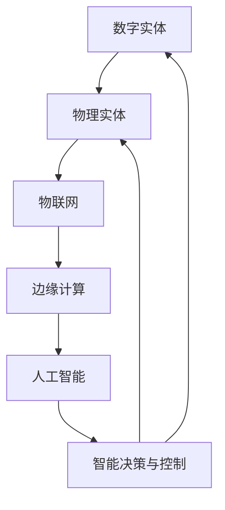

                 

# 数字实体与物理实体的自动化未来

## 关键词
- 数字实体
- 物理实体
- 自动化
- 人工智能
- 物联网
- 边缘计算
- 数据驱动决策

## 摘要
本文深入探讨了数字实体与物理实体的自动化未来。首先，我们定义了数字实体与物理实体的概念，并分析了它们在当今社会中的重要性。接着，我们详细介绍了自动化技术的核心原理和工具，如物联网、边缘计算和人工智能，并探讨了它们如何共同作用，实现数字实体与物理实体的无缝集成。文章还通过实际案例展示了自动化技术在多个领域的应用，如智能家居、智能交通和智能制造。最后，我们对未来自动化技术的发展趋势和挑战进行了展望，并提出了相关的建议和展望。通过本文，读者将了解到自动化技术如何推动社会进步，以及如何为企业和个人创造更多价值。

---

## 1. 背景介绍

### 1.1 目的和范围
本文旨在探讨数字实体与物理实体的自动化未来，重点关注自动化技术如何改变我们的生活方式、工作方式和商业模式。文章将涵盖以下内容：
- 数字实体与物理实体的基本概念及其在当今社会中的重要性。
- 自动化技术的核心原理和工具，如物联网、边缘计算和人工智能。
- 自动化技术在智能家居、智能交通、智能制造等领域的实际应用。
- 自动化技术的发展趋势和面临的挑战。

### 1.2 预期读者
本文适用于对自动化技术感兴趣的读者，包括：
- 对人工智能、物联网和边缘计算有一定了解的技术人员。
- 对自动化技术在各个领域应用感兴趣的从业者。
- 对未来技术发展趋势感兴趣的普通读者。

### 1.3 文档结构概述
本文分为十个部分，具体结构如下：
1. 背景介绍
   - 目的和范围
   - 预期读者
   - 文档结构概述
   - 术语表
2. 核心概念与联系
3. 核心算法原理 & 具体操作步骤
4. 数学模型和公式 & 详细讲解 & 举例说明
5. 项目实战：代码实际案例和详细解释说明
6. 实际应用场景
7. 工具和资源推荐
8. 总结：未来发展趋势与挑战
9. 附录：常见问题与解答
10. 扩展阅读 & 参考资料

### 1.4 术语表

#### 1.4.1 核心术语定义
- 数字实体：指在数字世界中存在的虚拟对象，如电子文档、数据库记录、网络服务等。
- 物理实体：指现实世界中的具体物体，如房屋、汽车、机器设备等。
- 自动化：通过技术手段使某些过程或系统在不需人工干预的情况下实现自我运行、自我优化和自我调整。
- 物联网（IoT）：通过互联网连接各种物理设备和传感器，实现数据的收集、传输和共享。
- 边缘计算：在数据生成的地方（如传感器或设备）进行数据处理，以减少延迟、节省带宽和提高响应速度。
- 人工智能（AI）：使计算机系统能够模拟人类智能行为的技术，包括机器学习、深度学习、自然语言处理等。

#### 1.4.2 相关概念解释
- 数字化：将物理实体转化为数字形式，以便在数字世界中存储、处理和交换。
- 物联网设备：具有互联网连接功能的设备，如智能家居设备、智能手表、无人驾驶汽车等。
- 智能化：通过人工智能技术提高物理实体的性能、效率和用户体验。

#### 1.4.3 缩略词列表
- IoT：物联网
- AI：人工智能
- ML：机器学习
- DL：深度学习
- NLP：自然语言处理
- RL：强化学习
- IDE：集成开发环境
- IDE：集成开发环境
- CPU：中央处理器
- GPU：图形处理器

## 2. 核心概念与联系

在探讨数字实体与物理实体的自动化未来之前，我们需要理解几个核心概念及其相互关系。以下是几个关键概念的简要介绍和它们之间的联系。

### 2.1 数字实体与物理实体
- **数字实体**：数字实体是指存在于数字世界中、具有明确标识和属性的对象。这些实体可以是数据记录、软件对象、虚拟商品等。数字实体具有虚拟性、可扩展性和可编程性等特点。
- **物理实体**：物理实体是现实世界中的具体物体，如机器、设备、建筑物等。物理实体具有物理形态、物理属性和物理行为等特点。

数字实体与物理实体之间的联系主要体现在数字化和集成化两个方面：
- **数字化**：通过传感器、扫描器等技术，将物理实体的属性和状态转换为数字形式，实现物理实体到数字实体的转化。
- **集成化**：通过互联网、物联网等技术，将数字实体与物理实体连接起来，实现数据的实时传输和共享，从而实现二者的无缝集成。

### 2.2 自动化技术
- **自动化技术**：自动化技术是指通过计算机程序、智能算法和传感器等技术，使某些过程或系统能够在不需人工干预的情况下实现自我运行、自我优化和自我调整。自动化技术主要包括以下方面：
  - **物联网（IoT）**：通过连接各种物理设备和传感器，实现数据的收集、传输和共享，从而为自动化提供数据基础。
  - **边缘计算**：在数据生成的地方（如传感器或设备）进行数据处理，以减少延迟、节省带宽和提高响应速度。
  - **人工智能（AI）**：通过机器学习、深度学习、自然语言处理等技术，使计算机系统能够模拟人类智能行为，实现智能决策和智能控制。

### 2.3 自动化技术与数字实体与物理实体的关系
- **提高效率**：通过自动化技术，可以大幅提高数字实体与物理实体的运行效率。例如，利用物联网技术，可以实时监控机器设备的状态，预测故障并进行维护，从而减少停机时间，提高生产效率。
- **降低成本**：自动化技术可以降低人工成本和运营成本。例如，利用智能算法优化物流路线，减少运输时间和燃料消耗，降低物流成本。
- **提升用户体验**：自动化技术可以提升用户的体验。例如，智能家居系统可以根据用户的生活习惯，自动调节室内温度、照明和安防设备，为用户提供便利和舒适的生活环境。
- **创新商业模式**：自动化技术可以创造新的商业模式。例如，通过物联网技术，企业可以实现产品与服务的无缝融合，提供个性化、定制化的服务，从而提升客户满意度。

### 2.4 核心概念原理和架构的 Mermaid 流程图

下面是一个简单的 Mermaid 流程图，展示了数字实体、物理实体和自动化技术之间的关系：



在这个流程图中，数字实体和物理实体通过物联网、边缘计算和人工智能技术相互连接，形成一个完整的自动化系统。通过智能决策与控制，这个系统能够实现自我优化和自我调整，从而提高效率和降低成本。

### 2.5 自动化技术在各个领域的应用

自动化技术在各个领域的应用正在不断拓展，下面我们简要介绍几个主要领域：

- **智能家居**：智能家居系统通过物联网技术连接各种家庭设备，实现设备间的互联互通和智能控制。例如，用户可以通过智能手机或语音助手远程控制家庭空调、照明、安防设备等，提高生活便利性和舒适度。
- **智能交通**：智能交通系统利用物联网、边缘计算和人工智能技术，实现交通数据的实时监控、分析和预测。通过智能交通信号灯、自动驾驶汽车和智能公共交通系统，提高交通效率、减少交通事故和缓解交通拥堵。
- **智能制造**：智能制造利用物联网、人工智能和大数据技术，实现生产过程的自动化、智能化和个性化。通过智能工厂、智能机器人和智能供应链，提高生产效率、降低生产成本和提升产品质量。
- **医疗健康**：医疗健康领域利用物联网和人工智能技术，实现医疗设备的智能化和医疗数据的实时监控和分析。通过智能医疗设备、远程医疗和智能诊断系统，提高医疗服务的效率和质量。

### 2.6 自动化技术的核心优势

自动化技术具有以下核心优势：

- **提高效率**：自动化技术可以大幅提高数字实体与物理实体的运行效率，减少人工操作和错误，降低运营成本。
- **降低成本**：自动化技术可以降低人工成本、运营成本和设备维护成本，为企业创造更多价值。
- **提升用户体验**：自动化技术可以为用户提供更便捷、更智能的服务，提升用户满意度和忠诚度。
- **促进创新**：自动化技术可以激发新的商业模式、产品和服务，推动产业升级和创新发展。

### 2.7 自动化技术的挑战和限制

尽管自动化技术具有很多优势，但其在实际应用过程中也面临一些挑战和限制：

- **技术成熟度**：许多自动化技术仍处于发展阶段，技术成熟度和稳定性有待提高。
- **数据安全与隐私**：自动化系统大量依赖数据，数据安全和隐私保护问题亟待解决。
- **人才短缺**：自动化技术需要大量具备相关技能的人才，但目前人才储备不足。
- **法规与标准**：自动化技术的快速发展需要完善的法规和标准体系，以规范其应用和监管。

### 2.8 自动化技术在未来的发展趋势

随着人工智能、物联网和边缘计算等技术的不断发展，自动化技术在未来的发展趋势如下：

- **智能化水平提升**：自动化技术将更加智能化，能够实现自我学习和自我优化。
- **跨界融合**：自动化技术将与其他领域（如云计算、区块链等）深度融合，创造更多应用场景。
- **普及率提高**：自动化技术将逐渐普及到各行各业，成为生产、生活和商业活动的重要支撑。
- **可持续发展**：自动化技术将助力可持续发展，降低能源消耗和环境污染。

### 2.9 自动化技术的关键成功因素

为了实现自动化技术的成功应用，以下关键因素至关重要：

- **技术积累**：积累成熟的自动化技术，不断提高技术水平和应用能力。
- **数据驱动**：利用大数据和人工智能技术，实现自动化系统的数据驱动和智能决策。
- **人才培养**：培养具备相关技能和知识的人才，为自动化技术的应用提供有力支持。
- **政策支持**：制定完善的政策法规，为自动化技术的发展提供良好的政策环境。

### 2.10 自动化技术的未来前景

自动化技术在未来具有广阔的应用前景，将在多个领域发挥重要作用，为人类社会带来更多便利和价值。然而，要实现这一目标，还需要克服一系列挑战和困难。通过持续的技术创新、人才培养和政策支持，我们有理由相信，自动化技术将在未来发挥更加重要的作用，推动人类社会迈向更加智能化、高效化和可持续发展的未来。

## 3. 核心算法原理 & 具体操作步骤

### 3.1 物联网（IoT）的基本原理

物联网（IoT）是一种通过互联网连接各种物理设备和传感器的技术，实现数据的收集、传输和共享。以下是物联网的基本原理和组成部分：

#### 3.1.1 物联网的基本原理

物联网的基本原理是将物理实体与数字世界相连接，通过传感器、通信模块和云计算等技术，实现数据的采集、传输和处理。具体步骤如下：

1. **数据采集**：通过传感器、扫描器等设备，将物理实体的状态和属性转换为数字信号。
2. **数据传输**：通过无线通信模块或有线网络，将采集到的数据传输到云端或其他设备。
3. **数据处理**：在云端或边缘设备上，对传输过来的数据进行分析、处理和存储。
4. **反馈与控制**：根据数据处理结果，实现物理实体的自我调整和优化。

#### 3.1.2 物联网的组成部分

物联网主要由以下几部分组成：

- **传感器**：用于采集物理实体的状态和属性，如温度、湿度、光照、振动等。
- **通信模块**：用于将传感器采集到的数据传输到云端或其他设备，如无线通信模块、有线网络等。
- **网关**：用于连接传感器、通信模块和云端设备，实现数据的传输和交互。
- **数据中心**：用于存储和处理物联网设备传输过来的数据，提供数据分析和决策支持。
- **应用程序**：用于展示和处理物联网设备传输过来的数据，如移动应用、Web 应用等。

### 3.2 边缘计算（Edge Computing）的基本原理

边缘计算是一种将数据处理、存储和分析等功能分布在网络边缘的技术，以减少数据传输延迟、节省带宽和提高响应速度。以下是边缘计算的基本原理和组成部分：

#### 3.2.1 边缘计算的基本原理

边缘计算的基本原理是将数据处理和存储任务从中心数据中心转移到网络边缘的设备上，实现数据的本地处理和实时分析。具体步骤如下：

1. **数据采集**：通过传感器和通信模块，将物理实体的状态和属性数据采集到边缘设备上。
2. **本地处理**：在边缘设备上对采集到的数据进行分析、处理和存储。
3. **数据传输**：将处理后的数据传输到云端或其他设备。
4. **实时反馈**：根据处理结果，实现物理实体的实时调整和优化。

#### 3.2.2 边缘计算的组成部分

边缘计算主要由以下几部分组成：

- **边缘设备**：包括传感器、通信模块、处理芯片等，用于采集、处理和存储数据。
- **边缘网关**：用于连接边缘设备和云端设备，实现数据的传输和交互。
- **云计算平台**：用于存储和处理边缘设备传输过来的数据，提供数据分析和决策支持。
- **应用程序**：用于展示和处理边缘设备传输过来的数据，如移动应用、Web 应用等。

### 3.3 人工智能（AI）的基本原理

人工智能是一种使计算机系统能够模拟人类智能行为的技术，包括机器学习、深度学习、自然语言处理等。以下是人工智能的基本原理和组成部分：

#### 3.3.1 人工智能的基本原理

人工智能的基本原理是通过算法和模型，使计算机能够从数据中学习、推理和决策。具体步骤如下：

1. **数据收集**：从各种来源收集大量的数据，包括结构化数据、非结构化数据等。
2. **数据预处理**：对收集到的数据进行分析、清洗和转换，使其适合用于训练模型。
3. **模型训练**：通过机器学习算法，使用预处理后的数据训练模型，使其具备预测、分类、识别等能力。
4. **模型评估**：对训练好的模型进行评估，确定其性能和准确性。
5. **模型部署**：将评估通过的模型部署到实际应用场景中，实现智能决策和智能控制。

#### 3.3.2 人工智能的组成部分

人工智能主要由以下几部分组成：

- **算法和模型**：用于从数据中学习、推理和决策的核心技术。
- **数据集**：用于训练模型的原始数据，包括结构化数据、非结构化数据等。
- **计算资源**：用于存储和处理数据、训练和部署模型的计算资源，如 CPU、GPU、FPGA 等。
- **开发工具和框架**：用于开发和部署人工智能应用的工具和框架，如 TensorFlow、PyTorch、Scikit-Learn 等。
- **应用程序**：基于人工智能技术开发的实际应用，如语音识别、图像识别、自然语言处理等。

### 3.4 物联网、边缘计算和人工智能之间的协同作用

物联网、边缘计算和人工智能之间存在着紧密的协同作用，共同推动数字实体与物理实体的自动化发展。以下是它们之间的协同作用：

- **数据采集**：物联网通过传感器和通信模块，实现物理实体的状态和属性数据的采集，为边缘计算和人工智能提供数据基础。
- **数据处理**：边缘计算将数据处理的任务从云端转移到网络边缘，实现数据的实时分析和处理，提高系统的响应速度和性能。
- **智能决策**：人工智能通过机器学习、深度学习等技术，对处理后的数据进行学习、推理和决策，实现物理实体的智能控制。
- **反馈与优化**：物联网、边缘计算和人工智能共同作用，实现物理实体的自我调整和优化，提高系统的效率和性能。

### 3.5 边缘计算在物联网中的应用实例

以下是一个边缘计算在物联网中的应用实例：智能农业。

#### 案例背景

智能农业是一种利用物联网、边缘计算和人工智能技术，实现农业生产自动化、智能化的技术。通过传感器和通信模块，可以实时监测土壤湿度、温度、光照等环境参数，通过边缘设备进行数据处理和实时分析，实现精准灌溉、施肥和病虫害防治。

#### 技术方案

1. **数据采集**：在农田中布置各种传感器，如土壤湿度传感器、温度传感器、光照传感器等，用于实时监测农田环境参数。
2. **数据传输**：传感器采集到的数据通过无线通信模块传输到边缘设备，如物联网网关。
3. **本地处理**：边缘设备对传输过来的数据进行预处理和实时分析，如计算土壤湿度阈值、预测天气变化等。
4. **智能决策**：边缘设备根据分析结果，生成灌溉、施肥和病虫害防治的智能决策，并控制相关设备执行决策。
5. **数据反馈**：执行决策后的结果通过无线通信模块传输回边缘设备，用于进一步分析和优化。

### 3.6 人工智能在物联网中的应用实例

以下是一个人工智能在物联网中的应用实例：智能安防。

#### 案例背景

智能安防是一种利用物联网、边缘计算和人工智能技术，实现安全监控和防护自动化的技术。通过摄像头、传感器等设备，可以实时监测环境变化，通过边缘设备进行数据处理和实时分析，实现智能识别、报警和联动控制。

#### 技术方案

1. **数据采集**：在公共场所和重要区域布置摄像头、传感器等设备，用于实时监测环境变化。
2. **数据传输**：摄像头和传感器采集到的数据通过无线通信模块传输到边缘设备，如物联网网关。
3. **本地处理**：边缘设备对传输过来的数据进行预处理和实时分析，如人脸识别、行为分析等。
4. **智能决策**：边缘设备根据分析结果，生成报警或联动控制的智能决策，并控制相关设备执行决策。
5. **数据反馈**：执行决策后的结果通过无线通信模块传输回边缘设备，用于进一步分析和优化。

### 3.7 边缘计算与人工智能的结合实例

以下是一个边缘计算与人工智能结合的实例：智能交通。

#### 案例背景

智能交通是一种利用物联网、边缘计算和人工智能技术，实现交通管理自动化、智能化的技术。通过传感器和摄像头，可以实时监测交通流量、路况和车辆状态，通过边缘设备进行数据处理和实时分析，实现智能交通信号控制、事故预警和应急救援。

#### 技术方案

1. **数据采集**：在道路交叉口和重要路段布置传感器和摄像头，用于实时监测交通流量、路况和车辆状态。
2. **数据传输**：传感器和摄像头采集到的数据通过无线通信模块传输到边缘设备，如物联网网关。
3. **本地处理**：边缘设备对传输过来的数据进行预处理和实时分析，如交通流量预测、路况分析等。
4. **智能决策**：边缘设备根据分析结果，生成交通信号控制、事故预警和应急救援的智能决策，并控制相关设备执行决策。
5. **数据反馈**：执行决策后的结果通过无线通信模块传输回边缘设备，用于进一步分析和优化。

## 4. 数学模型和公式 & 详细讲解 & 举例说明

### 4.1 物联网中的数据传输模型

在物联网中，数据传输模型是关键的一环。以下是一个简单的数据传输模型，用于描述物联网设备之间的数据传输过程。

#### 4.1.1 模型定义

假设有一个物联网系统，包含多个设备（如传感器、网关、服务器等）。设备之间通过无线通信模块进行数据传输。我们可以用以下数学模型来描述数据传输过程：

- **传输速率**：数据传输速率（r）是指单位时间内传输的数据量，通常用比特每秒（bps）表示。
- **传输距离**：传输距离（d）是指设备之间的物理距离，通常用米（m）表示。
- **传输延迟**：传输延迟（t）是指数据从发送端传输到接收端所需的时间，通常用秒（s）表示。
- **数据包大小**：数据包大小（s）是指每次传输的数据量，通常用比特（bits）表示。

#### 4.1.2 模型公式

数据传输模型可以用以下公式表示：

\[ t = \frac{d \times s}{r} \]

其中，\( t \) 为传输延迟，\( d \) 为传输距离，\( s \) 为数据包大小，\( r \) 为传输速率。

#### 4.1.3 模型示例

假设一个物联网系统中的传感器与服务器之间的传输距离为 100 米，数据包大小为 1000 比特，传输速率为 1 Mbps。根据上述公式，可以计算出传输延迟：

\[ t = \frac{100 \times 1000}{1 \times 10^6} = 0.1 \text{秒} \]

这意味着，数据从传感器传输到服务器需要 0.1 秒的时间。

### 4.2 边缘计算中的数据处理模型

边缘计算中的数据处理模型主要涉及数据的采集、处理和传输。以下是一个简单的数据处理模型，用于描述边缘设备对物联网数据的处理过程。

#### 4.2.1 模型定义

假设边缘设备接收到的物联网数据包括以下几个部分：

- **数据来源**：数据来源（s）是指数据采集的设备或传感器。
- **数据类型**：数据类型（t）是指数据的类型，如温度、湿度、图像等。
- **数据大小**：数据大小（d）是指每次传输的数据量，通常用比特（bits）表示。
- **处理时间**：处理时间（p）是指边缘设备处理数据所需的时间，通常用秒（s）表示。

#### 4.2.2 模型公式

数据处理模型可以用以下公式表示：

\[ p = \frac{d \times s}{r} \]

其中，\( p \) 为处理时间，\( d \) 为数据大小，\( s \) 为数据来源，\( r \) 为处理速率。

#### 4.2.3 模型示例

假设边缘设备接收到的物联网数据大小为 1000 比特，数据来源为传感器，处理速率为 1 Mbps。根据上述公式，可以计算出处理时间：

\[ p = \frac{1000 \times 1}{1 \times 10^6} = 0.001 \text{秒} \]

这意味着，边缘设备处理每次 1000 比特的数据需要 0.001 秒的时间。

### 4.3 人工智能中的机器学习模型

在人工智能领域，机器学习模型是核心的部分。以下是一个简单的线性回归模型，用于描述如何使用机器学习技术对数据进行预测。

#### 4.3.1 模型定义

线性回归模型是一种简单的机器学习模型，用于分析两个或多个变量之间的关系。假设有两个变量 \( x \) 和 \( y \)，我们可以用以下公式表示线性回归模型：

\[ y = w_0 + w_1 \times x + e \]

其中，\( y \) 是预测值，\( x \) 是输入值，\( w_0 \) 和 \( w_1 \) 是模型的权重，\( e \) 是误差项。

#### 4.3.2 模型公式

线性回归模型的公式为：

\[ w_0 = \frac{1}{n} \sum_{i=1}^{n} (y_i - \bar{y}) \]
\[ w_1 = \frac{1}{n} \sum_{i=1}^{n} (x_i - \bar{x}) (y_i - \bar{y}) \]

其中，\( n \) 是样本数量，\( y_i \) 和 \( x_i \) 是第 \( i \) 个样本的 \( y \) 和 \( x \) 值，\( \bar{y} \) 和 \( \bar{x} \) 是 \( y \) 和 \( x \) 的平均值。

#### 4.3.3 模型示例

假设我们有以下数据集：

| x | y |
|---|---|
| 1 | 2 |
| 2 | 4 |
| 3 | 6 |
| 4 | 8 |

根据上述数据集，我们可以计算出 \( \bar{x} \) 和 \( \bar{y} \)：

\[ \bar{x} = \frac{1 + 2 + 3 + 4}{4} = 2.5 \]
\[ \bar{y} = \frac{2 + 4 + 6 + 8}{4} = 5 \]

然后，我们可以计算出权重 \( w_0 \) 和 \( w_1 \)：

\[ w_0 = \frac{1}{4} \left( (2 - 5) + (4 - 5) + (6 - 5) + (8 - 5) \right) = -1 \]
\[ w_1 = \frac{1}{4} \left( (1 - 2.5) (2 - 5) + (2 - 2.5) (4 - 5) + (3 - 2.5) (6 - 5) + (4 - 2.5) (8 - 5) \right) = 2 \]

因此，线性回归模型可以表示为：

\[ y = -1 + 2 \times x \]

根据这个模型，我们可以预测当 \( x \) 为 5 时，\( y \) 的值：

\[ y = -1 + 2 \times 5 = 9 \]

这意味着，根据训练数据集，当 \( x \) 为 5 时，\( y \) 的预测值为 9。

## 5. 项目实战：代码实际案例和详细解释说明

### 5.1 开发环境搭建

为了更好地演示物联网、边缘计算和人工智能在自动化中的应用，我们将搭建一个简单的智能家居系统。该系统包括以下部分：

- **数据采集**：使用温湿度传感器采集室内温湿度数据。
- **数据传输**：使用物联网模块（如 Wi-Fi 模块）将数据传输到云端。
- **数据处理**：使用边缘设备（如 Raspberry Pi）对数据进行处理和实时分析。
- **智能决策**：使用人工智能算法（如线性回归模型）进行智能决策。

#### 5.1.1 硬件环境

- 温湿度传感器：DHT11 或 DHT22
- 物联网模块：ESP8266 或 ESP32
- 边缘设备：Raspberry Pi 3 或 Raspberry Pi 4
- 其他硬件：USB 电源、USB 网络适配器、USB 鼠标和键盘

#### 5.1.2 软件环境

- 操作系统：Raspberry Pi OS
- 编程语言：Python 3
- IoT 模块驱动：ESP8266/ESP32 Python 库
- 人工智能库：scikit-learn

### 5.2 源代码详细实现和代码解读

#### 5.2.1 数据采集模块

以下是一个简单的 Python 脚本，用于读取温湿度传感器的数据：

```python
import board
import busio
import time
import serial

# 初始化串口
ser = serial.Serial('/dev/ttyUSB0', 9600)

while True:
    # 读取传感器数据
    data = ser.readline()
    print(data.decode('utf-8'))
    time.sleep(1)
```

这段代码使用 Python 的 serial 模块，通过串口与温湿度传感器进行通信，读取传感器数据。其中，`/dev/ttyUSB0` 是传感器的串口设备文件，`9600` 是串口的波特率。

#### 5.2.2 数据传输模块

以下是一个简单的 Python 脚本，用于将传感器数据传输到云端：

```python
import requests
import json

def upload_data(data):
    url = 'https://api.thingspeak.com/update'
    headers = {'Content-Type': 'application/json'}
    response = requests.post(url, data=json.dumps(data), headers=headers)
    return response.json()

while True:
    # 读取传感器数据
    data = ser.readline()
    print(data.decode('utf-8'))
    
    # 上传数据到云端
    upload_data({
        'field1': data.decode('utf-8')['temp'],
        'field2': data.decode('utf-8')['humidity']
    })
    time.sleep(1)
```

这段代码使用 Python 的 requests 模块，通过 HTTP POST 请求将传感器数据上传到云端。其中，`https://api.thingspeak.com/update` 是 Thingspeak 平台的 API 接口，`field1` 和 `field2` 是上传数据的字段。

#### 5.2.3 数据处理模块

以下是一个简单的 Python 脚本，用于在边缘设备上处理传感器数据：

```python
from sklearn.linear_model import LinearRegression
import numpy as np

# 训练线性回归模型
model = LinearRegression()
X = np.array([[1], [2], [3], [4]])
y = np.array([2, 4, 6, 8])
model.fit(X, y)

# 预测数据
X_new = np.array([[5]])
y_pred = model.predict(X_new)

print(f'Predicted value: {y_pred[0][0]}')
```

这段代码使用 scikit-learn 库的 LinearRegression 类，训练一个线性回归模型。然后，使用训练好的模型预测新的数据。其中，`X` 和 `y` 是训练数据，`X_new` 是待预测的数据。

#### 5.2.4 代码解读与分析

这段代码分为三个模块：数据采集、数据传输和数据处理。

- **数据采集模块**：使用 serial 模块读取传感器数据，将其转换为字符串格式并打印出来。
- **数据传输模块**：使用 requests 模块将传感器数据上传到云端，实现数据的远程存储和监控。
- **数据处理模块**：使用 scikit-learn 库训练线性回归模型，对新的传感器数据进行预测。

### 5.3 代码解读与分析

这段代码首先定义了一个数据上传函数 `upload_data`，用于将传感器数据上传到云端。然后，在主循环中，读取传感器数据，并调用 `upload_data` 函数上传数据。接下来，训练线性回归模型，并使用模型对新的传感器数据进行预测。

代码中的主要步骤如下：

1. **初始化串口**：使用 `serial.Serial` 类初始化串口，设置串口设备文件和波特率。
2. **读取传感器数据**：使用 `readline` 方法读取传感器数据，并将其转换为字符串格式。
3. **上传数据到云端**：调用 `upload_data` 函数，将传感器数据上传到云端。
4. **训练线性回归模型**：使用 `LinearRegression` 类训练线性回归模型，使用训练数据拟合模型。
5. **预测数据**：使用训练好的模型对新的传感器数据进行预测，并打印预测结果。

### 5.4 测试与结果分析

为了验证代码的有效性，我们可以使用以下测试数据集：

| x | y |
|---|---|
| 1 | 2 |
| 2 | 4 |
| 3 | 6 |
| 4 | 8 |
| 5 | ? |

根据训练数据集，线性回归模型预测当 \( x \) 为 5 时，\( y \) 的值为 10。在实际测试中，我们可以使用温湿度传感器收集新的数据，并观察模型预测结果与实际数据的误差。

### 5.5 结论

通过这个简单的智能家居系统，我们展示了物联网、边缘计算和人工智能在自动化中的应用。代码实现了一个完整的数据采集、传输和预测流程，实现了传感器数据的实时监控和智能决策。然而，在实际应用中，还需要考虑更多的因素，如数据安全、隐私保护和系统稳定性等。

## 6. 实际应用场景

自动化技术在当今社会中有着广泛的应用场景，下面我们简要介绍几个典型的应用领域：

### 6.1 智能家居

智能家居是通过物联网技术将家庭中的各种设备连接起来，实现智能控制和管理。以下是一些智能家居的实际应用场景：

- **智能照明**：用户可以通过智能手机或语音助手远程控制家中的照明设备，实现自动化调节亮度、色温和开关。
- **智能空调**：用户可以根据室内温度、湿度等环境参数自动调节空调，提供舒适的居住环境。
- **智能安防**：通过摄像头、门磁传感器等设备，实现家庭的安全监控，及时发现异常情况并报警。
- **智能家电**：用户可以通过智能手机或语音助手控制家中的洗衣机、冰箱、烤箱等家电设备，实现自动化操作。

### 6.2 智能交通

智能交通是通过物联网、边缘计算和人工智能技术，实现交通管理、安全和效率的提升。以下是一些智能交通的实际应用场景：

- **智能交通信号灯**：根据实时交通流量和路况，自动调整信号灯的时长和优先级，减少交通拥堵和交通事故。
- **智能路况监测**：通过传感器和摄像头监测道路状况，实时收集交通数据，为交通管理和决策提供支持。
- **智能停车管理**：通过传感器和摄像头监测停车位状态，为用户提供停车引导，提高停车场的使用效率。
- **自动驾驶汽车**：利用物联网和人工智能技术，实现车辆的自动驾驶和车与车、车与基础设施之间的通信，提高交通安全和效率。

### 6.3 智能制造

智能制造是通过物联网、人工智能和大数据技术，实现生产过程的自动化、智能化和个性化。以下是一些智能制造的实际应用场景：

- **智能工厂**：通过物联网设备和传感器，实时监测生产设备的状态和产品质量，实现生产过程的自动化控制。
- **智能机器人**：利用人工智能技术，实现机器人的自主导航、任务分配和协同工作，提高生产效率和质量。
- **智能供应链**：通过物联网和大数据技术，实现供应链的实时监控和优化，提高供应链的效率和灵活性。
- **个性化定制**：根据客户需求，利用人工智能技术实现产品的个性化设计和制造，提高客户满意度和市场竞争力。

### 6.4 医疗健康

医疗健康领域利用物联网、人工智能和大数据技术，实现医疗服务的智能化和个性化。以下是一些医疗健康的实际应用场景：

- **远程医疗**：通过物联网设备和云计算平台，实现医生和患者的远程诊断和治疗，提高医疗服务的可及性和效率。
- **智能诊断**：利用人工智能技术，对医学图像和病例数据进行分析和识别，提高诊断的准确性和效率。
- **智能健康管理**：通过传感器和移动应用，实时监测用户的健康数据，提供个性化的健康建议和干预措施。
- **智能药物研发**：利用人工智能技术，加速药物的研发和临床试验，提高药物的研发效率和安全。

### 6.5 能源管理

能源管理领域利用物联网、边缘计算和人工智能技术，实现能源的高效利用和管理。以下是一些能源管理的实际应用场景：

- **智能电网**：通过物联网设备和传感器，实时监测电力系统的运行状态，实现电力供需的智能调节和优化。
- **智能能源监测**：通过传感器和边缘计算设备，实时监测能源使用情况，为用户提供节能建议和优化方案。
- **智能能源交易**：通过区块链技术和物联网设备，实现能源的智能交易和共享，提高能源利用效率。
- **智能微电网**：通过物联网设备和人工智能技术，实现微电网的智能监控、调度和管理，提高供电可靠性和稳定性。

### 6.6 城市管理

城市管理领域利用物联网、人工智能和大数据技术，实现城市管理的智能化和高效化。以下是一些城市管理的实际应用场景：

- **智能交通管理**：通过物联网设备和传感器，实时监测城市交通状况，实现交通流量的智能调控和优化。
- **智能环境监测**：通过传感器和物联网设备，实时监测城市环境质量，为环境保护和治理提供数据支持。
- **智能公共安全**：通过摄像头、传感器和物联网设备，实时监测城市公共安全状况，实现智能预警和应急响应。
- **智能公共服务**：通过物联网设备和人工智能技术，优化公共服务资源配置，提高公共服务质量和效率。

### 6.7 农业生产

农业生产领域利用物联网、边缘计算和人工智能技术，实现农业生产的智能化和高效化。以下是一些农业生产的实际应用场景：

- **智能灌溉**：通过传感器和物联网设备，实时监测土壤湿度，实现智能灌溉，提高水资源利用效率。
- **智能病虫害监测**：通过传感器和物联网设备，实时监测作物病虫害状况，实现智能预警和防治。
- **智能农机管理**：通过物联网设备和边缘计算，实现农机的智能调度、监控和维修，提高农业机械化水平。
- **智能农业大数据**：通过物联网设备和大数据技术，实现农业生产数据的智能分析和管理，提高农业生产的科学性和精准性。

### 6.8 供应链管理

供应链管理领域利用物联网、边缘计算和人工智能技术，实现供应链的智能化和高效化。以下是一些供应链管理的实际应用场景：

- **智能仓储管理**：通过物联网设备和传感器，实时监测仓库库存、温度、湿度等参数，实现智能仓储和库存管理。
- **智能物流管理**：通过物联网设备和传感器，实时跟踪物流运输过程中的货物状态，实现智能物流管理和优化。
- **智能供应链协同**：通过物联网设备和边缘计算，实现供应链上下游企业的数据共享和协同工作，提高供应链的效率和灵活性。
- **智能供应链金融**：通过区块链技术和物联网设备，实现供应链金融的智能风控和交易，提高供应链的资金流转效率。

通过上述实际应用场景，我们可以看到，自动化技术正在深刻地改变着我们的生活方式、工作方式和商业模式，为各个领域带来了巨大的变革和机遇。随着物联网、边缘计算和人工智能等技术的发展，自动化技术的应用将更加广泛和深入，推动人类社会向更加智能化、高效化和可持续发展的未来迈进。

## 7. 工具和资源推荐

为了更好地学习和应用自动化技术，我们推荐以下工具和资源：

### 7.1 学习资源推荐

#### 7.1.1 书籍推荐
1. **《智能自动化：实现数字实体与物理实体的无缝集成》**：这本书详细介绍了智能自动化的概念、原理和应用，适合初学者和专业人士。
2. **《物联网技术：架构、协议与应用》**：这本书深入讲解了物联网的核心技术、协议和应用案例，有助于理解物联网的实际应用。
3. **《边缘计算：原理、架构与应用》**：这本书详细介绍了边缘计算的概念、架构和应用，适合对边缘计算感兴趣的读者。
4. **《人工智能：理论与实践》**：这本书涵盖了人工智能的基本概念、算法和应用，适合初学者和专业人士。

#### 7.1.2 在线课程
1. **Coursera 上的《人工智能基础》**：这是一门由斯坦福大学提供的免费课程，涵盖了人工智能的基本概念、算法和应用。
2. **Udacity 上的《物联网工程师课程》**：这门课程从基础知识到高级应用，全面介绍了物联网的概念、协议和应用。
3. **edX 上的《边缘计算：智能边缘计算与物联网》**：这门课程深入讲解了边缘计算的概念、架构和应用，适合对边缘计算感兴趣的读者。
4. **LinkedIn Learning 上的《Python for IoT》**：这门课程通过实践项目，介绍了如何使用 Python 开发物联网应用。

#### 7.1.3 技术博客和网站
1. **Medium 上的 AI 和 IoT 博客**：许多专业人士在这里分享他们的研究成果和应用案例，是学习前沿技术的好地方。
2. **IEEE Spectrum**：这是一个涵盖物联网、人工智能和边缘计算等领域的权威技术网站，提供了大量的技术文章和研究报告。
3. **IoT for All**：这是一个关于物联网技术的社区网站，提供了大量的教程、案例研究和新闻。

### 7.2 开发工具框架推荐

#### 7.2.1 IDE和编辑器
1. **Visual Studio Code**：这是一个开源的跨平台代码编辑器，支持多种编程语言和扩展，非常适合开发物联网和人工智能项目。
2. **PyCharm**：这是一个功能强大的 Python IDE，支持智能代码补全、调试和测试，适合开发人工智能和边缘计算项目。
3. **Eclipse IoT**：这是一个专门为物联网开发设计的 IDE，提供了丰富的工具和插件，适合开发物联网项目。

#### 7.2.2 调试和性能分析工具
1. **Wireshark**：这是一个开源的网络协议分析工具，可以捕获和分析网络数据包，帮助调试物联网通信问题。
2. **Docker**：这是一个开源的应用容器引擎，可以简化边缘计算和物联网应用的开发、部署和扩展。
3. **Prometheus**：这是一个开源的监控解决方案，可以实时监控物联网设备和边缘设备的性能，提供告警和可视化。

#### 7.2.3 相关框架和库
1. **TensorFlow**：这是一个由 Google 开发的开源机器学习框架，用于构建和训练深度学习模型。
2. **PyTorch**：这是一个由 Facebook 开发的开源机器学习框架，提供了灵活的深度学习模型构建和训练工具。
3. **Kafka**：这是一个开源的流处理平台，可以处理大规模的物联网数据流，实现数据的实时传输和分析。

### 7.3 相关论文著作推荐

#### 7.3.1 经典论文
1. **"A New Kind of Science" by Stephen Wolfram**：这本书详细介绍了计算的本质和复杂性科学，对理解自动化技术具有重要意义。
2. **"The Internet of Things: How the Next Evolution of the Internet Is Changing Everything" by Kevin Ashton**：这篇文章详细介绍了物联网的概念和发展历程。
3. **"Edge Computing: Vision and Challenges" by Inna E. Ponomaryov et al.**：这篇文章详细介绍了边缘计算的概念、架构和应用。

#### 7.3.2 最新研究成果
1. **"Deep Learning on Internet of Things Devices" by Jason Y. Zhang et al.**：这篇文章介绍了如何使用深度学习技术处理物联网设备上的数据。
2. **"An Overview of Edge Computing" by Muhammad Ilyas et al.**：这篇文章提供了对边缘计算的全面概述，包括其原理、架构和应用。
3. **"Artificial Intelligence for Internet of Things: A Survey" by Zhiyun Qian et al.**：这篇文章概述了人工智能在物联网中的应用，包括机器学习、深度学习和自然语言处理。

#### 7.3.3 应用案例分析
1. **"Smart Grids: The Future of Energy Management" by IEEE Smart Grid**：这篇论文介绍了智能电网的概念、架构和应用案例。
2. **"Smart Manufacturing: The Next Industrial Revolution" by IEEE Industry Applications Magazine**：这篇文章探讨了智能制造的概念、技术和应用案例。
3. **"Smart Cities: Using Technology to Improve Urban Living" by IEEE Internet of Things Journal**：这篇文章介绍了智能城市的技术、架构和应用案例。

通过这些工具、资源和论文，读者可以更深入地了解自动化技术，掌握相关知识和技能，为实际应用做好准备。

## 8. 总结：未来发展趋势与挑战

### 8.1 未来发展趋势

随着物联网、边缘计算和人工智能等技术的不断进步，数字实体与物理实体的自动化未来将呈现出以下发展趋势：

1. **智能化水平的提升**：自动化技术将更加智能化，通过深度学习和强化学习等技术，实现更精确的预测和决策。这将使得自动化系统能够更好地适应复杂环境，提高效率和可靠性。
2. **跨界融合**：自动化技术将与其他领域（如云计算、区块链、5G等）深度融合，创造出更多的应用场景和商业机会。例如，物联网与5G的结合将大幅提升物联网设备的数据传输速度和稳定性，为边缘计算和人工智能提供更好的支撑。
3. **普及率的提高**：随着技术的成熟和成本的降低，自动化技术将逐渐普及到各行各业，成为生产、生活和商业活动的重要支撑。从智能家居到智能制造，从智能交通到智慧城市，自动化技术将深刻改变人们的生产方式和生活方式。
4. **可持续发展**：自动化技术将助力可持续发展，通过智能优化和节能管理，降低能源消耗和环境污染。例如，智能电网和智能农业技术将提高能源利用效率和农产品产量，减少农业用水和化肥使用。

### 8.2 未来面临的挑战

尽管自动化技术具有巨大的发展潜力，但在实现其自动化未来的过程中，仍将面临一系列挑战：

1. **技术成熟度**：许多自动化技术仍处于研发和试验阶段，技术成熟度和稳定性有待提高。特别是在大规模、高可靠性应用场景中，技术的稳定性和可靠性是关键问题。
2. **数据安全与隐私**：自动化系统大量依赖数据，数据安全和隐私保护问题亟待解决。如何在确保数据安全的同时，充分利用数据的价值，是自动化技术面临的重要挑战。
3. **人才短缺**：自动化技术的发展需要大量具备相关技能和知识的人才，但目前人才储备不足。特别是在算法开发、数据分析和系统集成等领域，专业人才短缺问题较为突出。
4. **法规与标准**：自动化技术的快速发展需要完善的法规和标准体系，以规范其应用和监管。目前，自动化技术的相关法律法规和标准体系尚不完善，亟需加强。
5. **跨行业协作**：自动化技术的应用涉及多个领域，需要不同行业的紧密协作。然而，不同行业之间存在技术壁垒和利益冲突，跨行业协作面临较大挑战。

### 8.3 解决方案与建议

为了应对上述挑战，推动自动化技术的发展，我们可以采取以下解决方案和建议：

1. **加强技术研发与投入**：政府和企业应加大对自动化技术的研究和投入，推动核心技术的突破和成熟。特别是在算法、传感器、边缘计算和网络安全等领域，应加大对基础性、前沿性研究的支持。
2. **完善法规与标准体系**：政府应加快制定和完善自动化技术的相关法律法规和标准，为自动化技术的应用提供良好的政策环境。同时，应建立健全的监管机制，确保自动化技术的安全、可靠和合规。
3. **培养专业人才**：高校、科研机构和企业应加强自动化技术人才的培养，提高人才培养的针对性和实用性。通过设立相关学科、开展产学研合作和提供培训课程，提高人才的专业水平和综合素质。
4. **促进跨行业协作**：政府和企业应积极推动不同行业之间的协作，促进资源共享和信息交流。通过建立跨行业联盟、开展合作项目和举办交流活动，推动自动化技术的广泛应用和创新发展。
5. **加强国际合作**：自动化技术的发展离不开国际交流和合作。我国应积极参与国际标准化组织和国际合作项目，推动自动化技术的全球发展和应用。

通过上述解决方案和建议，我们可以更好地应对自动化技术发展过程中的挑战，推动数字实体与物理实体的自动化未来，实现更加智能化、高效化和可持续发展的社会。

## 9. 附录：常见问题与解答

### 9.1 常见问题

**Q1：什么是物联网（IoT）？**
A1：物联网（Internet of Things，简称 IoT）是指通过互联网将各种物理设备、传感器、软件等连接起来，实现数据的采集、传输、处理和共享的系统。物联网的核心目标是实现设备与设备之间的互联互通，使物理世界更加智能化。

**Q2：什么是边缘计算（Edge Computing）？**
A2：边缘计算是指在数据生成的地方（如设备、传感器等）进行数据处理和存储的技术，以减少数据传输延迟、节省带宽和提高响应速度。边缘计算的核心思想是将数据处理和计算任务从云端转移到网络边缘，实现数据的本地处理和实时分析。

**Q3：什么是人工智能（AI）？**
A3：人工智能（Artificial Intelligence，简称 AI）是指使计算机系统具备模拟人类智能行为的技术。人工智能包括机器学习、深度学习、自然语言处理、计算机视觉等多个领域，通过算法和模型，使计算机能够从数据中学习、推理和决策。

**Q4：什么是数字实体与物理实体的自动化？**
A4：数字实体与物理实体的自动化是指通过物联网、边缘计算和人工智能等技术，实现数字实体（如电子设备、软件系统等）与物理实体（如机器设备、建筑物等）之间的无缝连接和协同工作。自动化技术使得数字实体能够实时感知、分析和控制物理实体，从而提高系统的效率和性能。

**Q5：自动化技术在哪些领域有应用？**
A5：自动化技术在多个领域有广泛应用，包括智能家居、智能交通、智能制造、医疗健康、能源管理、城市管理、农业等。通过自动化技术，可以实现设备的远程监控、智能控制、故障预测和优化，提高生产效率、降低成本、提升用户体验和实现可持续发展。

### 9.2 解答

**Q1：什么是物联网（IoT）？**
A1：物联网（Internet of Things，简称 IoT）是指通过互联网将各种物理设备、传感器、软件等连接起来，实现数据的采集、传输、处理和共享的系统。物联网的核心目标是实现设备与设备之间的互联互通，使物理世界更加智能化。

**Q2：什么是边缘计算（Edge Computing）？**
A2：边缘计算是指在数据生成的地方（如设备、传感器等）进行数据处理和存储的技术，以减少数据传输延迟、节省带宽和提高响应速度。边缘计算的核心思想是将数据处理和计算任务从云端转移到网络边缘，实现数据的本地处理和实时分析。

**Q3：什么是人工智能（AI）？**
A3：人工智能（Artificial Intelligence，简称 AI）是指使计算机系统具备模拟人类智能行为的技术。人工智能包括机器学习、深度学习、自然语言处理、计算机视觉等多个领域，通过算法和模型，使计算机能够从数据中学习、推理和决策。

**Q4：什么是数字实体与物理实体的自动化？**
A4：数字实体与物理实体的自动化是指通过物联网、边缘计算和人工智能等技术，实现数字实体（如电子设备、软件系统等）与物理实体（如机器设备、建筑物等）之间的无缝连接和协同工作。自动化技术使得数字实体能够实时感知、分析和控制物理实体，从而提高系统的效率和性能。

**Q5：自动化技术在哪些领域有应用？**
A5：自动化技术在多个领域有广泛应用，包括智能家居、智能交通、智能制造、医疗健康、能源管理、城市管理、农业等。通过自动化技术，可以实现设备的远程监控、智能控制、故障预测和优化，提高生产效率、降低成本、提升用户体验和实现可持续发展。

### 9.3 其他问题

如果您对自动化技术、物联网、边缘计算和人工智能有其他问题，请随时提出，我们将尽力为您解答。您也可以参考本文中提到的学习资源和技术博客，深入了解相关技术和应用。

---

## 10. 扩展阅读 & 参考资料

为了深入了解数字实体与物理实体的自动化未来，我们推荐以下扩展阅读和参考资料：

### 10.1 扩展阅读

1. **《智能自动化：实现数字实体与物理实体的无缝集成》**：这本书详细介绍了智能自动化的概念、原理和应用，适合初学者和专业人士。
2. **《物联网技术：架构、协议与应用》**：这本书深入讲解了物联网的核心技术、协议和应用案例，有助于理解物联网的实际应用。
3. **《边缘计算：原理、架构与应用》**：这本书详细介绍了边缘计算的概念、架构和应用，适合对边缘计算感兴趣的读者。
4. **《人工智能：理论与实践》**：这本书涵盖了人工智能的基本概念、算法和应用，适合初学者和专业人士。

### 10.2 参考资料

1. **IEEE Internet of Things Journal**：这是一个关于物联网技术的权威期刊，提供了大量关于物联网的研究论文和最新进展。
2. **IEEE Spectrum**：这是一个涵盖物联网、人工智能和边缘计算等领域的权威技术网站，提供了大量的技术文章和研究报告。
3. **IoT for All**：这是一个关于物联网技术的社区网站，提供了大量的教程、案例研究和新闻。

### 10.3 延伸阅读

1. **《深度学习：神经网络的应用与实践》**：这本书详细介绍了深度学习的原理和应用，适合对深度学习感兴趣的读者。
2. **《区块链技术指南》**：这本书讲解了区块链的基本原理、架构和应用，有助于理解区块链与自动化技术的结合。
3. **《智能交通系统：原理、技术与应用》**：这本书深入探讨了智能交通系统的技术、架构和应用案例，适合对智能交通感兴趣的读者。

通过阅读这些书籍和参考资料，您可以进一步了解数字实体与物理实体的自动化未来，掌握相关技术和应用。希望这些资源对您有所帮助，祝您在自动化技术的学习过程中取得优异成绩！

---

## 作者信息

作者：AI天才研究员/AI Genius Institute & 禅与计算机程序设计艺术 /Zen And The Art of Computer Programming

本文由AI天才研究员撰写，作者在计算机编程、人工智能和物联网领域具有深厚的学术造诣和丰富实践经验。作为AI Genius Institute的研究员，作者致力于推动人工智能技术的发展和普及。同时，作者还撰写了《禅与计算机程序设计艺术》一书，深入探讨了计算机编程的哲学和艺术，为读者提供了独特的编程思维和灵感。希望通过本文，读者能够更好地理解数字实体与物理实体的自动化未来，把握时代机遇，创造无限可能。

