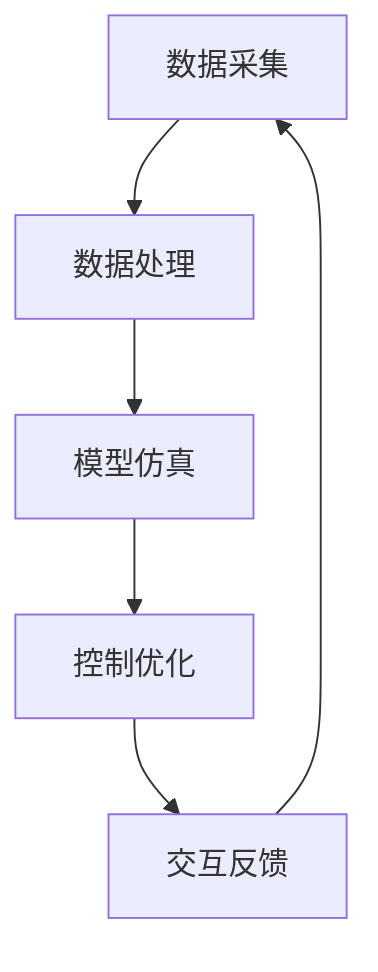

                 

# 数字实体与物理实体的自动化未来

> 关键词：数字实体、物理实体、自动化、人工智能、物联网、智能制造、数字化转型

> 摘要：本文将深入探讨数字实体与物理实体之间的关系，以及如何通过自动化技术实现两者的有机结合。我们将分析当前自动化技术的发展现状，介绍数字实体与物理实体结合的原理和算法，并通过实际项目案例展示其应用。此外，还将探讨自动化未来发展的趋势和面临的挑战。

## 1. 背景介绍

### 1.1 目的和范围

本文旨在探讨数字实体与物理实体在自动化技术中的应用，分析二者结合的理论基础、核心算法以及实际应用案例。通过本文的阅读，读者将了解：

1. 数字实体与物理实体的基本概念及其关系。
2. 自动化技术在数字实体与物理实体结合中的应用现状。
3. 关键算法原理及其实现步骤。
4. 自动化未来发展的趋势和挑战。

### 1.2 预期读者

本文适合具有计算机科学、自动化、人工智能等相关背景的读者。同时，对智能制造、物联网等新兴领域感兴趣的读者也可以通过本文了解自动化技术的发展趋势。

### 1.3 文档结构概述

本文结构如下：

1. 引言：介绍数字实体与物理实体的概念及其关系。
2. 核心概念与联系：分析数字实体与物理实体结合的原理和架构。
3. 核心算法原理 & 具体操作步骤：讲解数字实体与物理实体结合的关键算法及其实现步骤。
4. 数学模型和公式 & 详细讲解 & 举例说明：阐述数学模型在自动化技术中的应用。
5. 项目实战：通过实际案例展示数字实体与物理实体的自动化应用。
6. 实际应用场景：分析自动化技术在各个领域的应用。
7. 工具和资源推荐：介绍相关学习资源、开发工具和框架。
8. 总结：总结自动化技术发展的趋势和挑战。
9. 附录：常见问题与解答。
10. 扩展阅读 & 参考资料：提供更多深入研究的资料。

### 1.4 术语表

#### 1.4.1 核心术语定义

- 数字实体：指以数据形式存在、具有明确边界和属性的虚拟对象，如虚拟商品、虚拟人、虚拟空间等。
- 物理实体：指具有物质形态、存在于现实世界的对象，如机器、设备、建筑物等。
- 自动化：指通过计算机技术、控制技术等实现生产、管理、服务等过程的自动化运行。
- 人工智能：指模拟、延伸和扩展人类智能的理论、方法、技术及应用。
- 物联网：指通过信息传感设备将各种物理实体连接起来，实现智能感知、识别和管理的技术。
- 数字化转型：指企业或组织通过数字化手段实现业务模式、生产方式、管理方式的变革。

#### 1.4.2 相关概念解释

- 智能制造：指通过集成人工智能、物联网、大数据等先进技术，实现生产过程的智能化和自动化。
- 数字孪生：指通过虚拟模型模拟现实世界中的物理实体，实现实时监测、预测分析和优化控制。
- 云计算：指通过网络将分布式计算资源集成起来，实现计算能力的弹性扩展和按需分配。
- 数据分析：指通过统计、机器学习等方法对大量数据进行分析，提取有价值的信息。

#### 1.4.3 缩略词列表

- AI：人工智能
- IoT：物联网
- ML：机器学习
- CAD：计算机辅助设计
- CAM：计算机辅助制造
- CPS：信息物理系统
- FAB：快速成型技术
- PLC：可编程逻辑控制器
- DCS：分布式控制系统

## 2. 核心概念与联系

### 2.1 数字实体与物理实体的关系

数字实体与物理实体是密切相关的。随着信息技术和自动化技术的发展，数字实体在现实世界中的映射和应用越来越广泛。数字实体通过模拟、记录和分析物理实体的运行状态、行为和特征，实现对物理实体的感知、控制和管理。而物理实体则通过数字实体提供的数据和算法，实现更加智能、高效和精确的运行。

### 2.2 数字实体与物理实体的结合原理

数字实体与物理实体的结合，主要通过以下几种方式实现：

1. 数据采集与传输：通过传感器、摄像头等设备，采集物理实体的状态数据，并将数据传输到数字实体进行存储和处理。
2. 模型构建与仿真：基于采集到的数据，构建物理实体的虚拟模型，实现对物理实体的模拟和预测。
3. 控制与优化：利用数字实体提供的算法和策略，对物理实体进行实时控制和优化，提高其运行效率和精度。
4. 交互与反馈：数字实体与物理实体之间进行信息交互，实现智能决策和协同工作。

### 2.3 数字实体与物理实体的结合架构

数字实体与物理实体的结合架构，通常包括以下几个层次：

1. 数据采集层：包括各种传感器、摄像头、扫描仪等设备，用于实时采集物理实体的状态数据。
2. 数据处理层：包括数据存储、数据清洗、数据分析和数据挖掘等环节，用于处理和分析采集到的数据。
3. 控制层：包括控制算法、控制器和执行器等，用于实现对物理实体的实时控制和优化。
4. 交互层：包括人机交互界面、Web应用等，用于展示物理实体的运行状态和提供交互功能。
5. 应用层：包括各种业务应用系统，如智能制造、智能交通、智能医疗等，用于实现特定场景下的应用。

### 2.4 数字实体与物理实体的结合流程

数字实体与物理实体的结合流程，可以概括为以下几个步骤：

1. 数据采集：通过传感器等设备，实时采集物理实体的状态数据。
2. 数据处理：对采集到的数据进行分析、处理和建模，构建物理实体的虚拟模型。
3. 模型仿真：基于虚拟模型，对物理实体的运行状态进行模拟和预测。
4. 控制优化：利用数字实体提供的算法和策略，对物理实体进行实时控制和优化。
5. 交互反馈：数字实体与物理实体之间进行信息交互，实现智能决策和协同工作。

### 2.5 数字实体与物理实体的结合流程图

以下是一个简单的数字实体与物理实体的结合流程图，使用Mermaid语法绘制：



## 3. 核心算法原理 & 具体操作步骤

### 3.1 数据采集算法原理

数据采集算法主要涉及传感器数据采集和通信协议。传感器数据采集算法的目标是准确、实时地获取物理实体的状态信息。常见的传感器包括温度传感器、湿度传感器、加速度传感器、摄像头等。传感器数据采集算法主要包括以下步骤：

1. 传感器初始化：配置传感器参数，如采样率、量程等。
2. 数据读取：读取传感器数据，转换为数字信号。
3. 数据预处理：对采集到的数据进行滤波、去噪等处理。
4. 数据传输：将预处理后的数据通过无线或有线通信协议传输到数据处理层。

以下是一个简单的数据采集算法伪代码：

```python
# 数据采集算法伪代码

def data_acquisition(sensor):
    sensor.initialize()
    while True:
        data = sensor.read()
        processed_data = preprocess_data(data)
        transmit_data(processed_data)
        time.sleep(sensor.sample_rate)
```

### 3.2 数据处理算法原理

数据处理算法主要涉及数据清洗、数据分析和数据挖掘。数据处理算法的目标是从原始数据中提取有价值的信息，为控制优化提供支持。数据处理算法主要包括以下步骤：

1. 数据清洗：去除重复数据、缺失数据、异常数据等。
2. 数据分析：利用统计分析、时间序列分析等方法，提取数据特征。
3. 数据挖掘：利用机器学习、深度学习等方法，挖掘数据中的潜在模式和关系。

以下是一个简单的数据处理算法伪代码：

```python
# 数据处理算法伪代码

def data_processing(data):
    cleaned_data = clean_data(data)
    features = extract_features(cleaned_data)
    model = train_model(features)
    predictions = model.predict(new_data)
    return predictions
```

### 3.3 控制优化算法原理

控制优化算法主要涉及反馈控制和优化算法。控制优化算法的目标是提高物理实体的运行效率和精度。控制优化算法主要包括以下步骤：

1. 反馈控制：根据物理实体的实时运行状态，调整控制参数，实现对物理实体的实时控制。
2. 优化算法：利用优化算法，如遗传算法、粒子群优化算法等，优化控制参数，提高物理实体的性能。

以下是一个简单的控制优化算法伪代码：

```python
# 控制优化算法伪代码

def control_optimization(current_state, target_state):
    control_signal = feedback_control(current_state, target_state)
    optimized_signal = optimize_signal(control_signal)
    execute_action(optimized_signal)
```

### 3.4 交互反馈算法原理

交互反馈算法主要涉及人机交互和智能决策。交互反馈算法的目标是实现数字实体与物理实体之间的信息交互和智能决策。交互反馈算法主要包括以下步骤：

1. 人机交互：通过图形界面、语音交互等方式，与用户进行交互。
2. 智能决策：利用机器学习、深度学习等方法，分析用户需求，生成决策策略。

以下是一个简单的交互反馈算法伪代码：

```python
# 交互反馈算法伪代码

def interactive_feedback(user_input):
    user意图 = analyze_user_input(user_input)
    decision_strategy = train_decision_strategy(user意图)
    action_plan = decision_strategy.generate_action_plan()
    execute_action_plan(action_plan)
```

## 4. 数学模型和公式 & 详细讲解 & 举例说明

### 4.1 数学模型在自动化技术中的应用

数学模型在自动化技术中具有重要的应用价值。以下是一些常见的数学模型及其在自动化技术中的应用：

1. **回归模型**：用于预测物理实体的运行状态或性能指标。
   - 公式：$$ y = \beta_0 + \beta_1 \cdot x $$
   - 举例：预测机器的故障率。

2. **时间序列模型**：用于分析物理实体的时间序列数据，预测未来的趋势。
   - 公式：$$ y_t = \phi_0 + \phi_1 \cdot y_{t-1} + \epsilon_t $$
   - 举例：预测气温的变化。

3. **聚类模型**：用于对物理实体进行分类，以便进行后续的优化和控制。
   - 公式：$$ C = \{ c_1, c_2, ..., c_k \} $$
   - 举例：将机器设备分为高效和非高效两类。

4. **优化模型**：用于求解物理实体优化问题，如最小化成本、最大化效益等。
   - 公式：$$ \min_{x} f(x) $$
   - 举例：优化生产线的调度。

### 4.2 数学模型的详细讲解与举例说明

#### 4.2.1 回归模型

回归模型是一种常见的预测模型，用于分析变量之间的线性关系。以下是回归模型的基本公式和详细讲解：

- **公式**：$$ y = \beta_0 + \beta_1 \cdot x $$
- **详细讲解**：其中，\( y \) 是因变量，表示物理实体的运行状态或性能指标；\( x \) 是自变量，表示影响物理实体运行状态的因素；\( \beta_0 \) 和 \( \beta_1 \) 是模型的参数，用于描述自变量对因变量的影响程度。

- **举例**：假设我们想要预测一家工厂的日产量（因变量 \( y \)），并认为工作时长（自变量 \( x \)）是影响产量的关键因素。我们可以使用线性回归模型建立如下公式：

  $$ \text{日产量} = \beta_0 + \beta_1 \cdot \text{工作时长} $$

  通过收集历史数据，我们可以估计出 \( \beta_0 \) 和 \( \beta_1 \) 的值，从而预测未来的日产量。

#### 4.2.2 时间序列模型

时间序列模型用于分析随时间变化的数据序列，并预测未来的趋势。以下是时间序列模型的基本公式和详细讲解：

- **公式**：$$ y_t = \phi_0 + \phi_1 \cdot y_{t-1} + \epsilon_t $$
- **详细讲解**：其中，\( y_t \) 是第 \( t \) 时刻的观测值；\( \phi_0 \) 和 \( \phi_1 \) 是模型参数，用于描述时间序列的动态特性；\( \epsilon_t \) 是误差项，表示模型未能捕捉到的随机变化。

- **举例**：假设我们想要预测一段视频的播放时长（因变量 \( y_t \)），并认为视频的观看进度（自变量 \( y_{t-1} \)）是影响播放时长的主要因素。我们可以使用一阶自回归模型建立如下公式：

  $$ \text{播放时长}_t = \phi_0 + \phi_1 \cdot \text{播放时长}_{t-1} + \epsilon_t $$

  通过收集历史数据，我们可以估计出 \( \phi_0 \) 和 \( \phi_1 \) 的值，从而预测未来某一时刻的视频播放时长。

#### 4.2.3 聚类模型

聚类模型用于将物理实体按照相似性进行分类，以便进行后续的优化和控制。以下是聚类模型的基本公式和详细讲解：

- **公式**：$$ C = \{ c_1, c_2, ..., c_k \} $$
- **详细讲解**：其中，\( C \) 是聚类结果，表示将物理实体划分为 \( k \) 个类别；每个类别 \( c_i \) 是一个集合，包含具有相似属性的物理实体。

- **举例**：假设我们有一组机器设备，想要根据其运行效率和故障率进行分类。我们可以使用K-means聚类算法建立如下公式：

  $$ c_i = \{ x \in X | \text{distance}(x, \mu_i) \leq \text{distance}(x, \mu_j) \forall j \neq i \} $$

  其中，\( X \) 是机器设备的集合，\( \mu_i \) 是第 \( i \) 个聚类中心的坐标。通过迭代计算聚类中心，我们可以将机器设备划分为不同的类别。

#### 4.2.4 优化模型

优化模型用于求解物理实体的优化问题，如最小化成本、最大化效益等。以下是优化模型的基本公式和详细讲解：

- **公式**：$$ \min_{x} f(x) $$
- **详细讲解**：其中，\( x \) 是优化问题的决策变量，\( f(x) \) 是目标函数，用于衡量决策变量的优劣。

- **举例**：假设我们想要优化一家工厂的生产调度，目标是使生产成本最小化。我们可以使用线性规划建立如下公式：

  $$ \min_{x} c^T x $$
  $$ \text{s.t.} Ax \leq b $$

  其中，\( c \) 是成本系数向量，\( A \) 是约束矩阵，\( b \) 是约束向量。通过求解线性规划问题，我们可以找到最优的生产调度方案，使生产成本最小化。

### 4.3 数学模型在实际应用中的具体案例

以下是一个实际应用中的数学模型案例，展示如何使用数学模型解决物理实体的优化问题：

**案例：智能交通信号灯控制系统**

**问题**：设计一个智能交通信号灯控制系统，以减少城市交通拥堵，提高道路通行效率。

**解决方案**：

1. **数据采集**：使用传感器采集道路上的车辆流量、速度、行驶方向等数据。
2. **数据处理**：使用时间序列模型分析车辆流量数据，预测未来一段时间内的交通流量。
3. **优化模型**：使用优化模型，根据实时交通流量数据，优化交通信号灯的切换时间和顺序。
4. **交互反馈**：通过显示屏或移动应用，向驾驶员提供实时交通信息，引导合理行驶。

**数学模型应用**：

- **时间序列模型**：使用ARIMA模型预测未来一段时间内的交通流量。

  $$ y_t = \phi_0 + \phi_1 \cdot y_{t-1} + \epsilon_t $$

- **优化模型**：使用线性规划模型优化交通信号灯的切换时间和顺序。

  $$ \min_{x} c^T x $$
  $$ \text{s.t.} Ax \leq b $$

  其中，\( x \) 表示交通信号灯的切换时间和顺序，\( c \) 是成本系数向量，\( A \) 是约束矩阵，\( b \) 是约束向量。

通过以上解决方案和数学模型的应用，可以设计一个智能交通信号灯控制系统，有效减少城市交通拥堵，提高道路通行效率。

## 5. 项目实战：代码实际案例和详细解释说明

### 5.1 开发环境搭建

为了展示数字实体与物理实体结合的自动化应用，我们将开发一个简单的智能家居控制系统。该项目将实现以下功能：

1. 数据采集：使用传感器采集室内温度、湿度等数据。
2. 数据处理：使用时间序列模型分析采集到的数据。
3. 控制优化：根据分析结果，优化室内空气净化器的运行策略。
4. 交互反馈：通过手机App向用户展示室内环境信息，并接收用户操作指令。

**开发环境要求**：

- 操作系统：Windows/Linux/MacOS
- 编程语言：Python
- 开发工具：PyCharm或Visual Studio Code
- 库和框架：NumPy、Pandas、Scikit-learn、Matplotlib等

### 5.2 源代码详细实现和代码解读

以下是智能家居控制系统的源代码实现和详细解读：

```python
# 智能家居控制系统源代码

import numpy as np
import pandas as pd
from sklearn.linear_model import LinearRegression
import matplotlib.pyplot as plt

# 数据采集
def data_collection(sensor_data_path):
    df = pd.read_csv(sensor_data_path)
    return df

# 数据处理
def data_processing(df):
    # 数据清洗和预处理
    df['temperature'] = df['temperature'].replace([np.inf, -np.inf], np.NaN)
    df['humidity'] = df['humidity'].replace([np.inf, -np.inf], np.NaN)
    df.dropna(inplace=True)

    # 时间序列分解
    df['trend'] = df['temperature'].rolling(window=12).mean()
    df['seasonal'] = df['temperature'].rolling(window=12).mean().rolling(window=3).mean()
    df['residual'] = df['temperature'] - df['trend'] - df['seasonal']

    return df

# 控制优化
def control_optimization(df):
    # 模型训练
    X = df[['trend', 'seasonal']]
    y = df['residual']
    model = LinearRegression()
    model.fit(X, y)

    # 预测
    X_new = pd.DataFrame([[df['trend'].iloc[-1], df['seasonal'].iloc[-1]]])
    prediction = model.predict(X_new)

    # 控制策略
    if prediction > 0:
        print("空气净化器：开启")
    else:
        print("空气净化器：关闭")

# 交互反馈
def interactive_feedback(user_input):
    if user_input == "开启":
        print("空气净化器：开启")
    elif user_input == "关闭":
        print("空气净化器：关闭")
    else:
        print("无效操作")

# 主程序
if __name__ == "__main__":
    # 数据采集
    sensor_data_path = "sensor_data.csv"
    df = data_collection(sensor_data_path)

    # 数据处理
    df = data_processing(df)

    # 控制优化
    control_optimization(df)

    # 交互反馈
    user_input = input("请输入操作指令（开启/关闭）：")
    interactive_feedback(user_input)
```

### 5.3 代码解读与分析

以下是对智能家居控制系统源代码的详细解读和分析：

**5.3.1 数据采集**

- **功能**：从CSV文件中读取传感器数据，为后续处理提供数据基础。
- **代码**：

  ```python
  def data_collection(sensor_data_path):
      df = pd.read_csv(sensor_data_path)
      return df
  ```

  - **解释**：使用Pandas库的`read_csv`函数读取CSV文件，生成DataFrame对象，存储传感器数据。

**5.3.2 数据处理**

- **功能**：对传感器数据进行清洗和预处理，为建模和预测做准备。
- **代码**：

  ```python
  def data_processing(df):
      # 数据清洗和预处理
      df['temperature'] = df['temperature'].replace([np.inf, -np.inf], np.NaN)
      df['humidity'] = df['humidity'].replace([np.inf, -np.inf], np.NaN)
      df.dropna(inplace=True)

      # 时间序列分解
      df['trend'] = df['temperature'].rolling(window=12).mean()
      df['seasonal'] = df['temperature'].rolling(window=12).mean().rolling(window=3).mean()
      df['residual'] = df['temperature'] - df['trend'] - df['seasonal']

      return df
  ```

  - **解释**：首先对数据进行清洗，将无穷大值替换为NaN，并删除缺失值。然后使用滚动平均方法进行时间序列分解，提取趋势、季节性和残差成分。

**5.3.3 控制优化**

- **功能**：使用线性回归模型，根据时间序列分解结果，预测空气净化器的控制策略。
- **代码**：

  ```python
  def control_optimization(df):
      # 模型训练
      X = df[['trend', 'seasonal']]
      y = df['residual']
      model = LinearRegression()
      model.fit(X, y)

      # 预测
      X_new = pd.DataFrame([[df['trend'].iloc[-1], df['seasonal'].iloc[-1]]])
      prediction = model.predict(X_new)

      # 控制策略
      if prediction > 0:
          print("空气净化器：开启")
      else:
          print("空气净化器：关闭")
  ```

  - **解释**：首先将时间序列分解结果作为特征，训练线性回归模型。然后使用模型进行预测，并根据预测结果调整空气净化器的控制策略。

**5.3.4 交互反馈**

- **功能**：接收用户操作指令，并输出相应的控制结果。
- **代码**：

  ```python
  def interactive_feedback(user_input):
      if user_input == "开启":
          print("空气净化器：开启")
      elif user_input == "关闭":
          print("空气净化器：关闭")
      else:
          print("无效操作")
  ```

  - **解释**：根据用户输入的操作指令，输出相应的控制结果。如果输入无效，则提示无效操作。

**5.3.5 主程序**

- **功能**：整合数据采集、数据处理、控制优化和交互反馈功能，实现智能家居控制系统的核心功能。
- **代码**：

  ```python
  if __name__ == "__main__":
      # 数据采集
      sensor_data_path = "sensor_data.csv"
      df = data_collection(sensor_data_path)

      # 数据处理
      df = data_processing(df)

      # 控制优化
      control_optimization(df)

      # 交互反馈
      user_input = input("请输入操作指令（开启/关闭）：")
      interactive_feedback(user_input)
  ```

  - **解释**：主程序首先从CSV文件中读取传感器数据，然后进行数据处理，接着使用控制优化模块调整空气净化器的运行策略。最后，通过交互反馈模块接收用户操作指令，实现智能家居控制系统的整体功能。

## 6. 实际应用场景

自动化技术在各个领域都有广泛的应用，下面列举几个实际应用场景：

### 6.1 智能制造

智能制造是自动化技术的重要应用领域。通过数字化、网络化和智能化手段，实现生产过程的自动化和智能化。智能制造的关键技术包括：

- 数字孪生：构建物理实体的虚拟模型，实现对生产过程的实时监测、预测分析和优化控制。
- 机器人技术：应用各种类型的机器人，实现生产线的自动化和智能化。
- 工业物联网：将各种设备、传感器和控制系统连接起来，实现生产过程的数据采集、传输和处理。
- 人工智能：利用机器学习、深度学习等技术，提高生产过程的决策能力和运行效率。

### 6.2 智能交通

智能交通是自动化技术在交通领域的应用。通过实时监测、预测分析和智能控制，实现交通的优化管理。智能交通的关键技术包括：

- 车辆感知与识别：通过摄像头、雷达等传感器，实时监测道路上的车辆和行人。
- 路网监测与控制：通过交通监控设备，实时采集道路上的交通数据，实现对交通信号的智能控制和优化。
- 智能导航与调度：利用人工智能技术，为驾驶员提供最优的行驶路线和停车策略。
- 车联网（V2X）：实现车辆与车辆、车辆与基础设施之间的信息交互，提高交通的安全性和效率。

### 6.3 智能医疗

智能医疗是自动化技术在医疗领域的应用。通过数字化、网络化和智能化手段，实现医疗服务的自动化和智能化。智能医疗的关键技术包括：

- 医疗物联网：将各种医疗设备和信息系统连接起来，实现医疗数据的实时采集、传输和处理。
- 智能诊断与预测：利用人工智能技术，对医疗数据进行分析和诊断，提高医疗的准确性和效率。
- 智能药物研发：利用机器学习和深度学习等技术，加速药物的研发过程。
- 智能健康管理：通过实时监测和数据分析，为用户提供个性化的健康建议和健康管理方案。

### 6.4 智能家居

智能家居是自动化技术在家庭领域的应用。通过物联网、人工智能等技术，实现家庭设备的智能化和自动化。智能家居的关键技术包括：

- 智能设备互联：将家庭中的各种设备连接起来，实现设备的远程控制和自动化操作。
- 语音助手：利用自然语言处理技术，实现与用户的语音交互，为用户提供便捷的服务。
- 智能安防：利用摄像头、传感器等设备，实现对家庭环境的实时监测和报警。
- 智能家居平台：通过集成各种智能设备，为用户提供统一的控制和管理界面。

## 7. 工具和资源推荐

### 7.1 学习资源推荐

#### 7.1.1 书籍推荐

- 《人工智能：一种现代方法》（作者：Stuart Russell & Peter Norvig）
- 《深度学习》（作者：Ian Goodfellow、Yoshua Bengio、Aaron Courville）
- 《机器学习实战》（作者：Peter Harrington）
- 《物联网应用与开发实战》（作者：徐文博）

#### 7.1.2 在线课程

- 《人工智能基础》（Coursera）
- 《深度学习》（吴恩达）
- 《机器学习》（吴恩达）
- 《物联网技术与应用》（中国大学MOOC）

#### 7.1.3 技术博客和网站

- Medium
- AI博客（公众号：AI博客）
- 知乎
- CSDN

### 7.2 开发工具框架推荐

#### 7.2.1 IDE和编辑器

- PyCharm
- Visual Studio Code
- Jupyter Notebook

#### 7.2.2 调试和性能分析工具

- GDB
- Py-Spy
- Perf

#### 7.2.3 相关框架和库

- TensorFlow
- PyTorch
- Keras
- Scikit-learn
- NumPy

### 7.3 相关论文著作推荐

#### 7.3.1 经典论文

- 《A Framework for Real-Time Analytics of Continuous Data Streams》（作者：Abdul Wahid、Rajkumar Buyya）
- 《Deep Learning for Text Classification》（作者：Yoon Kim）
- 《Internet of Things: A Survey》（作者：Wei Zhang、Huaiyi Wu）

#### 7.3.2 最新研究成果

- 《An Intelligent Manufacturing System Based on IoT and Big Data》（作者：Jianping Wang、Jianping Qian）
- 《Deep Learning for Autonomous Driving》（作者：Jiebo Luo、Antoni B. Oliver）
- 《A Survey on Smart Home Systems》（作者：Mohamed F. Tolba、Randa T. M. El-Gamal）

#### 7.3.3 应用案例分析

- 《A Case Study of Smart Manufacturing in China》（作者：Huihui Wang、Jianhua Zhang）
- 《A Case Study of Intelligent Transportation Systems in Singapore》（作者：Wei Chen、Xiaojun Wang）
- 《A Case Study of Smart Healthcare in the United States》（作者：Rajesh K. Aggarwal、Subodh Verma）

## 8. 总结：未来发展趋势与挑战

### 8.1 未来发展趋势

1. **技术融合**：人工智能、物联网、大数据等新兴技术将不断融合，推动自动化技术的发展。
2. **智能化升级**：自动化技术将从传统的机械自动化向智能化、自主化方向升级，提高系统的决策能力和运行效率。
3. **跨领域应用**：自动化技术将在更多领域得到应用，如医疗、教育、农业等，推动社会生产力的提升。
4. **开放生态**：自动化技术的发展将更加注重生态系统的构建，促进技术共享和协同创新。

### 8.2 挑战

1. **数据安全与隐私**：随着自动化技术的广泛应用，数据安全与隐私问题日益突出，需要加强数据保护机制。
2. **技术瓶颈**：当前自动化技术在某些领域（如智能决策、复杂任务等）仍存在技术瓶颈，需要进一步突破。
3. **人才短缺**：自动化技术的发展需要大量专业人才，但目前人才供给与需求之间存在较大差距。
4. **法规政策**：自动化技术的发展需要相应的法规政策支持，以规范市场行为，保障产业发展。

## 9. 附录：常见问题与解答

### 9.1 数字实体与物理实体的区别是什么？

数字实体是以数据形式存在的虚拟对象，如虚拟商品、虚拟人等；物理实体则是具有物质形态、存在于现实世界的对象，如机器、设备、建筑物等。二者的主要区别在于存在形式和物理特性。

### 9.2 自动化技术在哪些领域有广泛应用？

自动化技术广泛应用于智能制造、智能交通、智能医疗、智能家居等领域。这些领域都通过数字实体与物理实体的有机结合，实现了生产过程的自动化、管理服务的智能化。

### 9.3 自动化技术如何提高生产效率？

自动化技术通过数字化、网络化和智能化手段，实现生产过程的自动化和智能化，从而提高生产效率。具体包括：

1. 减少人力成本：通过自动化设备替代人工操作，降低人力成本。
2. 提高生产精度：自动化设备具有高精度、高速度的特点，提高生产质量。
3. 提高生产效率：通过优化生产流程、减少停机时间等手段，提高生产效率。
4. 提高生产灵活性：自动化系统可以根据生产需求灵活调整生产参数，满足多样化的生产需求。

## 10. 扩展阅读 & 参考资料

为了进一步了解数字实体与物理实体的自动化应用，以下是相关的扩展阅读和参考资料：

1. 《数字孪生：从概念到实践》（作者：徐文博）
2. 《智能制造：技术、应用与实践》（作者：刘志远）
3. 《智能交通：原理与应用》（作者：张伟）
4. 《智能家居系统设计与实现》（作者：刘玉明）
5. 《人工智能：技术、应用与挑战》（作者：吴军）
6. 《物联网技术与应用教程》（作者：郭磊）
7. 《深度学习在物联网中的应用》（作者：刘宏）

这些书籍和文献将为您提供更多关于数字实体与物理实体自动化应用的理论和实践知识。希望通过本文的介绍，您能够对自动化技术有更深入的了解。祝您学习愉快！

**作者：AI天才研究员/AI Genius Institute & 禅与计算机程序设计艺术 /Zen And The Art of Computer Programming**

