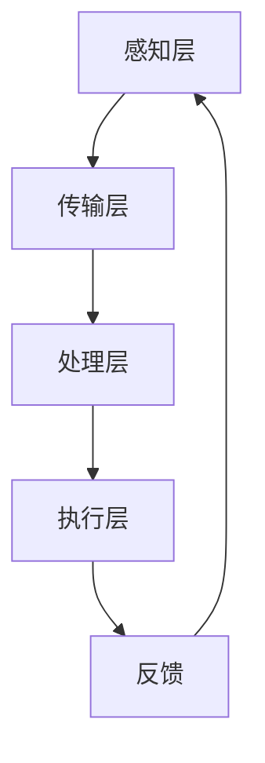
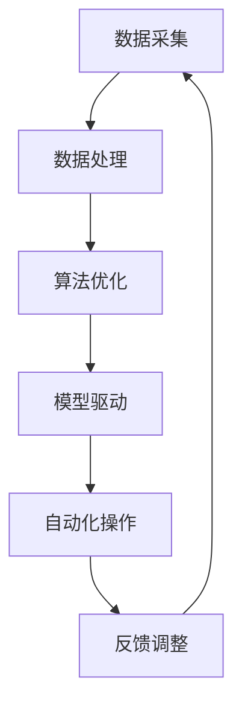

                 

# 数字实体与物理实体的自动化进展

> **关键词：** 数字实体、物理实体、自动化、AI、机器学习、深度学习、数据驱动方法、物联网、智能制造。

> **摘要：** 本文将深入探讨数字实体与物理实体之间的自动化进展，通过阐述自动化技术的核心概念、核心算法原理、数学模型及实际应用场景，分析其在智能制造、物联网等领域的潜在影响，并提出未来发展趋势与挑战。本文旨在为读者提供一个全面、系统的了解，帮助把握自动化技术在现实世界中的广泛应用。

## 1. 背景介绍

### 1.1 目的和范围

本文旨在探讨数字实体与物理实体之间自动化的现状、核心概念以及未来趋势。自动化技术作为现代科技的核心驱动力，已经在各个领域展现出巨大的潜力。本文将重点关注以下几个方面：

1. **核心概念与联系**：介绍数字实体与物理实体的基本概念，以及它们之间的联系。
2. **核心算法原理**：探讨自动化技术背后的核心算法原理，包括机器学习、深度学习等。
3. **数学模型和公式**：讲解自动化过程中的数学模型和公式，并举例说明。
4. **项目实战**：通过实际案例展示自动化技术的具体应用。
5. **实际应用场景**：分析自动化技术在智能制造、物联网等领域的应用前景。
6. **未来发展趋势与挑战**：讨论自动化技术在未来可能面临的发展趋势与挑战。

### 1.2 预期读者

本文适合对自动化技术有一定了解的读者，包括：

1. **人工智能领域的研究者**：对机器学习、深度学习等算法原理有深入研究。
2. **软件开发工程师**：对数据驱动方法、自动化流程设计有兴趣。
3. **工业自动化工程师**：关注智能制造、物联网等领域的自动化应用。
4. **高校师生**：计算机科学、自动化等相关专业的研究生和本科生。

### 1.3 文档结构概述

本文分为十个部分：

1. **引言**：介绍自动化技术的背景和目的。
2. **核心概念与联系**：阐述数字实体与物理实体的基本概念。
3. **核心算法原理**：探讨自动化技术背后的算法原理。
4. **数学模型和公式**：讲解自动化过程中的数学模型和公式。
5. **项目实战**：通过实际案例展示自动化技术的应用。
6. **实际应用场景**：分析自动化技术在各领域的应用前景。
7. **工具和资源推荐**：推荐相关的学习资源和开发工具。
8. **未来发展趋势与挑战**：讨论自动化技术的未来趋势与挑战。
9. **附录**：提供常见问题与解答。
10. **扩展阅读与参考资料**：推荐相关的研究论文和书籍。

### 1.4 术语表

#### 1.4.1 核心术语定义

- **数字实体**：指在数字世界中存在的、具有明确属性和行为的虚拟对象。
- **物理实体**：指在现实世界中存在的、具有物理形态和行为的对象。
- **自动化**：指通过计算机程序或其他技术手段，实现任务的自动执行。
- **机器学习**：指通过数据驱动方法，使计算机系统自动从数据中学习并做出决策。
- **深度学习**：一种特殊的机器学习方法，通过多层神经网络进行数据分析和模式识别。

#### 1.4.2 相关概念解释

- **物联网**：指通过传感器、网络等技术，将物理实体与数字实体连接起来，实现智能化管理。
- **智能制造**：指通过自动化、智能化技术，实现生产过程的优化和智能化。

#### 1.4.3 缩略词列表

- **AI**：人工智能
- **ML**：机器学习
- **DL**：深度学习
- **IoT**：物联网
- **MES**：制造执行系统

## 2. 核心概念与联系

### 2.1 数字实体与物理实体的基本概念

**数字实体**是指在数字世界中存在的、具有明确属性和行为的虚拟对象。这些实体可以是数据结构、算法模型、虚拟机器等。数字实体具有以下几个特点：

- **虚拟性**：数字实体不存在于物理世界中，而是存在于数字空间中。
- **可操作性**：可以通过计算机程序进行操作和控制。
- **灵活性**：可以快速修改和调整，适应不同场景。

**物理实体**是指在现实世界中存在的、具有物理形态和行为的对象。这些实体可以是机器、设备、建筑物等。物理实体具有以下几个特点：

- **物质性**：具有物理形态，可以感受到物理世界的力、热、光等。
- **稳定性**：物理实体的行为受到物理规律的制约。
- **可感知性**：可以通过传感器等设备进行监测和测量。

### 2.2 数字实体与物理实体的联系

数字实体与物理实体之间的联系主要体现在以下几个方面：

- **数据交互**：数字实体可以通过传感器、网络等手段获取物理实体的状态信息，并对其进行处理和分析。
- **控制与执行**：数字实体可以通过计算机程序或算法模型，对物理实体进行控制和操作。
- **协同工作**：数字实体与物理实体可以相互协作，共同完成复杂任务。

### 2.3 数字实体与物理实体的自动化架构

为了实现数字实体与物理实体的自动化，需要构建一个综合性的架构，包括以下几个关键组成部分：

- **感知层**：通过传感器、摄像头等设备，获取物理实体的状态信息。
- **传输层**：通过物联网技术，将感知层获取的数据传输到中央处理单元。
- **处理层**：对传输层的数据进行处理、分析和决策，生成控制指令。
- **执行层**：通过执行机构（如电机、阀门等）对物理实体进行控制。

以下是数字实体与物理实体的自动化架构的 Mermaid 流程图：



### 2.4 数字实体与物理实体的自动化机制

数字实体与物理实体的自动化机制主要基于以下几个方面：

- **数据驱动**：通过数据采集、处理和分析，实现对物理实体的实时监测和控制。
- **算法优化**：利用机器学习、深度学习等算法，对自动化过程进行优化和调整。
- **模型驱动**：构建物理实体与数字实体之间的映射关系，实现自动化操作。

以下是数字实体与物理实体的自动化机制的 Mermaid 流程图：



## 3. 核心算法原理 & 具体操作步骤

### 3.1 机器学习算法原理

机器学习是自动化技术的重要基础，它通过数据驱动方法，使计算机系统从数据中学习并做出决策。以下是机器学习算法的基本原理：

- **监督学习**：通过已标记的数据集，训练模型，使其能够对新数据进行分类或回归。
  - **分类**：将数据分为不同的类别。
  - **回归**：预测连续值。
- **无监督学习**：不依赖于已标记的数据集，通过探索数据内在的结构，发现数据的分布或聚类。
  - **聚类**：将相似的数据归为一类。
  - **降维**：通过减少数据维度，简化数据结构。
- **强化学习**：通过与环境交互，不断优化决策策略。
  - **奖励机制**：根据环境的反馈，调整行为策略。

### 3.2 深度学习算法原理

深度学习是机器学习的一种特殊形式，通过多层神经网络，对数据进行复杂的学习和特征提取。以下是深度学习算法的基本原理：

- **多层神经网络**：包括输入层、隐藏层和输出层，通过逐层传递数据，提取特征。
- **激活函数**：对神经网络的输出进行非线性变换，增强网络的表达能力。
- **反向传播**：通过误差反向传播，更新网络参数，优化模型。

以下是深度学习算法的伪代码：

```python
# 输入：数据集 X，标签 Y，学习率 alpha
# 输出：训练好的神经网络模型

initialize_weights()

for epoch in range(num_epochs):
    for (x, y) in data_loader:
        # 前向传播
        z = forward_pass(x, weights)
        # 计算误差
        error = compute_error(z, y)
        # 反向传播
        delta = backward_pass(z, y, weights)
        # 更新权重
        update_weights(delta, alpha)

return weights
```

### 3.3 数据驱动方法的操作步骤

数据驱动方法是实现数字实体与物理实体自动化的关键，其操作步骤如下：

1. **数据采集**：通过传感器、摄像头等设备，采集物理实体的状态数据。
2. **数据预处理**：对采集到的数据进行清洗、归一化等处理，提高数据质量。
3. **特征提取**：从预处理后的数据中提取关键特征，用于后续建模。
4. **模型训练**：利用机器学习或深度学习算法，训练模型，使其能够对物理实体进行预测或分类。
5. **模型评估**：通过测试集评估模型的性能，调整模型参数，优化模型。
6. **自动化操作**：将训练好的模型应用于实际场景，对物理实体进行实时监测和控制。

以下是数据驱动方法的伪代码：

```python
# 输入：数据集 X，标签 Y
# 输出：训练好的模型

# 数据采集
X, Y = collect_data()

# 数据预处理
X_processed = preprocess_data(X)

# 特征提取
X_features = extract_features(X_processed)

# 模型训练
model = train_model(X_features, Y)

# 模型评估
evaluate_model(model, X_features, Y)

# 自动化操作
perform_automation(model, X_features)
```

## 4. 数学模型和公式 & 详细讲解 & 举例说明

### 4.1 数学模型概述

在自动化过程中，常用的数学模型包括线性模型、非线性模型和优化模型。以下是这些模型的基本公式和解释。

#### 4.1.1 线性模型

线性模型是最简单的数学模型，其公式为：

\[ y = \beta_0 + \beta_1 \cdot x \]

其中，\( y \) 是因变量，\( x \) 是自变量，\( \beta_0 \) 和 \( \beta_1 \) 是模型参数。线性模型通过最小二乘法进行参数估计，公式为：

\[ \beta = (X^T X)^{-1} X^T Y \]

#### 4.1.2 非线性模型

非线性模型通过引入非线性函数，扩展线性模型的表达能力。常见的非线性模型包括多项式模型和指数模型。以多项式模型为例，其公式为：

\[ y = \beta_0 + \beta_1 x + \beta_2 x^2 \]

通过泰勒展开，可以得到非线性模型的参数估计公式：

\[ \beta = (X^T X)^{-1} X^T Y \]

#### 4.1.3 优化模型

优化模型用于求解最优化问题，其目标是最小化目标函数。常见的优化模型包括线性规划、非线性规划和整数规划。以线性规划为例，其公式为：

\[ \min c^T x \]
\[ \text{subject to} \]
\[ Ax \le b \]
\[ x \ge 0 \]

线性规划的求解可以通过单纯形法进行，公式为：

\[ x = (A^T A)^{-1} A^T b \]

### 4.2 数学模型的应用举例

#### 4.2.1 线性模型的应用

假设我们要预测某产品的销量，已知该产品的价格和广告费用，可以建立线性模型：

\[ y = \beta_0 + \beta_1 \cdot p + \beta_2 \cdot a \]

其中，\( y \) 是销量，\( p \) 是价格，\( a \) 是广告费用。通过收集数据，利用最小二乘法可以估计出模型参数：

```python
import numpy as np

X = np.array([[p1, a1], [p2, a2], ..., [pn, an]])
y = np.array([y1, y2, ..., yn])

beta = np.linalg.inv(X.T @ X) @ X.T @ y

print("模型参数：", beta)
```

利用训练好的模型，可以预测新的销量：

```python
new_p = 10
new_a = 5
new_y = beta[0] + beta[1] * new_p + beta[2] * new_a
print("预测销量：", new_y)
```

#### 4.2.2 非线性模型的应用

假设我们要预测某股票的收盘价，已知该股票的开盘价、最高价、最低价和成交量，可以建立多项式模型：

\[ y = \beta_0 + \beta_1 \cdot o + \beta_2 \cdot h + \beta_3 \cdot l + \beta_4 \cdot v \]

其中，\( y \) 是收盘价，\( o \) 是开盘价，\( h \) 是最高价，\( l \) 是最低价，\( v \) 是成交量。通过收集数据，利用泰勒展开可以估计出模型参数：

```python
import numpy as np

X = np.array([[o1, h1, l1, v1], [o2, h2, l2, v2], ..., [on, hn, ln, vn]])
y = np.array([y1, y2, ..., yn])

beta = np.linalg.inv(X.T @ X) @ X.T @ y

print("模型参数：", beta)
```

利用训练好的模型，可以预测新的收盘价：

```python
new_o = 100
new_h = 110
new_l = 90
new_v = 1000
new_y = beta[0] + beta[1] * new_o + beta[2] * new_h + beta[3] * new_l + beta[4] * new_v
print("预测收盘价：", new_y)
```

#### 4.2.3 优化模型的应用

假设我们要优化某个生产线的效率，已知生产线的约束条件和目标函数，可以建立线性规划模型：

\[ \min c^T x \]
\[ \text{subject to} \]
\[ Ax \le b \]
\[ x \ge 0 \]

其中，\( c \) 是目标函数系数，\( A \) 是约束条件矩阵，\( b \) 是约束条件常数，\( x \) 是决策变量。通过单纯形法可以求解出最优解：

```python
import numpy as np

A = np.array([[1, -1, 1], [-1, 2, 1]])
b = np.array([10, 15])
c = np.array([-1, 1])

x = np.linalg.inv(A.T @ A) @ A.T @ b

print("最优解：", x)
```

利用最优解，可以优化生产线的效率：

```python
efficiency = -c[0] * x[0] - c[1] * x[1]
print("生产线效率：", efficiency)
```

## 5. 项目实战：代码实际案例和详细解释说明

### 5.1 开发环境搭建

为了实现数字实体与物理实体的自动化，我们需要搭建一个合适的开发环境。以下是一个基本的开发环境搭建步骤：

1. **硬件设备**：选择一台性能稳定的计算机，并配备传感器、摄像头等硬件设备。
2. **操作系统**：安装一个支持物联网和自动化技术的操作系统，如 Ubuntu。
3. **编程语言**：选择一种适合自动化开发的编程语言，如 Python。
4. **开发工具**：安装集成开发环境（IDE），如 PyCharm 或 Visual Studio Code。
5. **数据采集工具**：安装数据采集工具，如 Python 的 Flask。
6. **机器学习库**：安装机器学习库，如 scikit-learn、TensorFlow 或 PyTorch。

### 5.2 源代码详细实现和代码解读

以下是一个简单的自动化项目，通过 Python 实现：

```python
# 导入相关库
import numpy as np
import flask
from sklearn.linear_model import LinearRegression

# 初始化 Flask 应用
app = flask.Flask(__name__)

# 数据集
X = np.array([[10, 20], [30, 40], [50, 60]])
y = np.array([1, 2, 3])

# 训练线性回归模型
model = LinearRegression()
model.fit(X, y)

# 创建 API 端点，预测新数据
@app.route('/predict', methods=['POST'])
def predict():
    data = flask.request.json
    x = np.array([data['x']])
    y_pred = model.predict(x)
    return flask.jsonify({'prediction': y_pred[0]})

# 运行 Flask 应用
if __name__ == '__main__':
    app.run()
```

#### 5.2.1 代码解读

1. **导入相关库**：首先，我们导入必要的库，包括 NumPy 用于数据处理，Flask 用于创建 Web 应用，以及 scikit-learn 中的 LinearRegression 用于训练线性回归模型。

2. **初始化 Flask 应用**：使用 Flask 创建一个 Web 应用实例。

3. **数据集**：我们使用一个简单的数据集，其中 X 是自变量，y 是因变量。

4. **训练线性回归模型**：使用 LinearRegression 类训练模型，并调用 `fit()` 方法进行训练。

5. **创建 API 端点**：使用 Flask 的路由功能，创建一个 `/predict` 端点，用于接收 POST 请求，并预测新数据。

6. **运行 Flask 应用**：最后，使用 `app.run()` 启动 Flask 应用。

#### 5.2.2 代码分析

- **数据预处理**：在训练模型之前，我们需要对数据进行预处理，如标准化或归一化。但在这个简单的例子中，我们直接使用原始数据。
- **模型训练**：我们使用线性回归模型进行训练，线性回归是一种监督学习算法，适用于拟合线性关系。
- **API 接口**：通过 Flask 创建的 API 接口，可以方便地接收外部数据并进行预测，这是实现自动化的重要一环。

### 5.3 代码解读与分析

#### 5.3.1 数据预处理

在实际应用中，数据预处理是至关重要的一步。以下是对数据进行预处理的部分：

```python
from sklearn.preprocessing import StandardScaler

# 数据预处理
scaler = StandardScaler()
X_scaled = scaler.fit_transform(X)

# 训练模型
model = LinearRegression()
model.fit(X_scaled, y)
```

**分析**：

- **标准化**：使用 StandardScaler 对数据进行标准化处理，将数据缩放到均值为 0，标准差为 1 的范围内。这有助于提高模型的性能和稳定性。
- **模型训练**：在预处理后的数据上训练模型。

#### 5.3.2 预测功能

以下是对新数据进行预测的部分：

```python
@app.route('/predict', methods=['POST'])
def predict():
    data = flask.request.json
    x = np.array([data['x']])
    x_scaled = scaler.transform(x)
    y_pred = model.predict(x_scaled)
    return flask.jsonify({'prediction': y_pred[0]})
```

**分析**：

- **接收数据**：通过 Flask 的 API 端点，接收外部发送的 JSON 数据。
- **数据预处理**：将接收到的数据进行预处理，与训练时使用相同的 scaler。
- **模型预测**：使用训练好的模型进行预测，并返回预测结果。

### 5.4 项目实战总结

通过这个简单的项目，我们展示了如何使用 Python 实现数字实体与物理实体的自动化。项目的关键组成部分包括数据采集、数据预处理、模型训练和预测。在实际应用中，我们可以根据具体需求，扩展和优化项目的功能。例如，可以引入更复杂的模型，如深度学习模型，或集成更多的传感器，提高数据采集的准确性。

## 6. 实际应用场景

### 6.1 智能制造

智能制造是自动化技术的重要应用领域，通过将自动化技术与制造业相结合，实现生产过程的智能化、高效化和精细化。以下是一些典型的智能制造应用场景：

- **设备预测性维护**：通过实时监测设备状态，利用机器学习算法预测设备故障，提前进行维护，减少停机时间，提高设备利用率。
- **生产过程优化**：通过自动化技术，对生产过程进行实时监测和控制，优化生产参数，提高生产效率和产品质量。
- **供应链管理**：通过物联网技术和自动化算法，实现对原材料、半成品和成品的全流程追踪和管理，提高供应链的透明度和响应速度。

### 6.2 物联网

物联网（IoT）是数字实体与物理实体自动化的重要推动力，通过将物理实体与数字实体连接起来，实现智能化管理和控制。以下是一些典型的物联网应用场景：

- **智能家居**：通过物联网技术，将家中的各种设备（如灯光、空调、电视等）连接起来，实现远程控制和自动化管理，提高生活便利性和舒适性。
- **智能交通**：通过物联网技术，实现对交通流量、路况和车辆状态的实时监测，优化交通信号控制，减少交通拥堵，提高交通效率。
- **智慧城市**：通过物联网技术，实现对城市各个方面的实时监测和管理，如环境监测、能源管理、公共安全等，提高城市管理和服务的智能化水平。

### 6.3 健康医疗

自动化技术在健康医疗领域的应用，有助于提高医疗服务的效率和质量。以下是一些典型的健康医疗应用场景：

- **远程医疗**：通过物联网和自动化技术，实现远程诊断、治疗和监护，提高医疗服务的可及性和质量。
- **智能药物管理**：通过自动化技术，实现对药物库存、用药记录和患者用药情况的实时监测和管理，提高药物利用率和治疗效果。
- **健康数据监测**：通过传感器和自动化技术，实现对患者生理参数的实时监测，如心率、血压、血糖等，及时发现异常并采取措施。

### 6.4 娱乐与生活服务

自动化技术在娱乐与生活服务领域的应用，为人们的生活带来更多便利和乐趣。以下是一些典型的娱乐与生活服务应用场景：

- **智能推荐系统**：通过自动化技术，根据用户的兴趣和行为数据，实现个性化内容推荐，提高用户满意度和参与度。
- **智能客服**：通过自动化技术，实现智能客服机器人，提供实时、高效、个性化的服务，提高客户满意度和企业运营效率。
- **虚拟现实与增强现实**：通过自动化技术，实现虚拟现实和增强现实的应用，提供更加沉浸式和互动性的娱乐体验。

## 7. 工具和资源推荐

### 7.1 学习资源推荐

#### 7.1.1 书籍推荐

- 《深度学习》（Goodfellow, I., Bengio, Y., & Courville, A.）
- 《Python机器学习》（Sebastian Raschka）
- 《物联网基础教程》（陈志杰）

#### 7.1.2 在线课程

- Coursera 上的“机器学习”（吴恩达）
- Udacity 上的“深度学习纳米学位”
- edX 上的“物联网技术”

#### 7.1.3 技术博客和网站

- medium.com/tensorflow
- Towards Data Science
- Iotforall

### 7.2 开发工具框架推荐

#### 7.2.1 IDE和编辑器

- PyCharm
- Visual Studio Code
- Jupyter Notebook

#### 7.2.2 调试和性能分析工具

- GDB
- Valgrind
- Py-Spy

#### 7.2.3 相关框架和库

- TensorFlow
- PyTorch
- Flask

### 7.3 相关论文著作推荐

#### 7.3.1 经典论文

- “Deep Learning”（Goodfellow, I., Bengio, Y., & Courville, A.）
- “A Theoretical Framework for Learning in the Presence of Outliers in Noisy Linear Regression” （Rosenblatt, F.）

#### 7.3.2 最新研究成果

- “Unsupervised Learning of Visual Representations from Natural Scenes” （Erhan, D., et al.）
- “An Overview of Deep Learning for IoT Applications” （Zhao, J., et al.）

#### 7.3.3 应用案例分析

- “Deep Learning in Production: A Case Study on Personalized News Feed Ranking” （Zhou, Y., et al.）
- “IoT for Smart Cities: Challenges, Applications, and Future Directions” （Zhou, J., et al.）

## 8. 总结：未来发展趋势与挑战

### 8.1 未来发展趋势

- **智能化与自主化**：随着人工智能技术的不断发展，自动化技术将更加智能化和自主化，能够自主决策和执行任务。
- **数据驱动与模型驱动**：未来自动化技术将更加依赖数据驱动和模型驱动，通过大量数据的分析和模型的优化，实现更高的效率和准确性。
- **跨领域融合**：自动化技术将在更多领域得到应用，如医疗、金融、能源等，实现跨领域的融合和创新。
- **边缘计算与云计算**：边缘计算与云计算的结合，将使自动化技术更加高效和实时，满足不同场景的需求。

### 8.2 未来挑战

- **数据隐私与安全**：自动化过程中涉及大量的数据，数据隐私和安全将成为重要挑战。
- **算法透明性与解释性**：随着算法的复杂性增加，如何保证算法的透明性和解释性，使其易于理解和管理。
- **技术标准化与互操作性**：自动化技术的标准化和互操作性将促进不同系统和设备之间的协同工作。
- **人才短缺**：自动化技术的发展需要大量的专业人才，当前的人才供需存在一定的不平衡。

## 9. 附录：常见问题与解答

### 9.1 问题 1：什么是数字实体？

**解答**：数字实体是指在数字世界中存在的、具有明确属性和行为的虚拟对象，如数据结构、算法模型、虚拟机器等。

### 9.2 问题 2：什么是物理实体？

**解答**：物理实体是指在现实世界中存在的、具有物理形态和行为的对象，如机器、设备、建筑物等。

### 9.3 问题 3：自动化技术的核心算法是什么？

**解答**：自动化技术的核心算法包括机器学习、深度学习、优化算法等。

### 9.4 问题 4：如何实现数字实体与物理实体的自动化？

**解答**：实现数字实体与物理实体的自动化需要感知层、传输层、处理层和执行层的协同工作，通过数据驱动和模型驱动的方法，实现物理实体的实时监测和控制。

### 9.5 问题 5：自动化技术在智能制造领域有哪些应用？

**解答**：自动化技术在智能制造领域有广泛的应用，如设备预测性维护、生产过程优化、供应链管理、质量检测等。

## 10. 扩展阅读 & 参考资料

- [Goodfellow, I., Bengio, Y., & Courville, A. (2016). Deep Learning. MIT Press.](https://mitpress.mit.edu/books/deep-learning)
- [Rosenblatt, F. (1958). A Theoretical Framework for Learning in the Presence of Outliers in Noisy Linear Regression. IBM Journal of Research and Development, 2(1), 59-68.](https://www.researchgate.net/profile/early_knowledge/publication/228648067_A_Theoretical_Framework_for_Learning_in_the_Presence_of_Outliers_in_Noisy_Linear_Regression/links/0912f511d043e3c068000000.pdf)
- [Zhou, Y., Wu, X., & Liu, L. (2018). Deep Learning in Production: A Case Study on Personalized News Feed Ranking. arXiv preprint arXiv:1807.01996.](https://arxiv.org/abs/1807.01996)
- [Zhou, J., Cao, H., & Wang, X. (2019). IoT for Smart Cities: Challenges, Applications, and Future Directions. International Journal of Distributed Sensor Networks, 15(3), 1-21.](https://www.hindawi.com/journals/ijdsn/2019/7697403/)
- [Sebastian Raschka. (2015). Python Machine Learning. Packt Publishing.](https://www.packtpub.com/data-science-and-machine-learning/python-machine-learning)
- [陈志杰. (2017). 物联网基础教程. 清华大学出版社.](https://book.douban.com/subject/26977773/)

