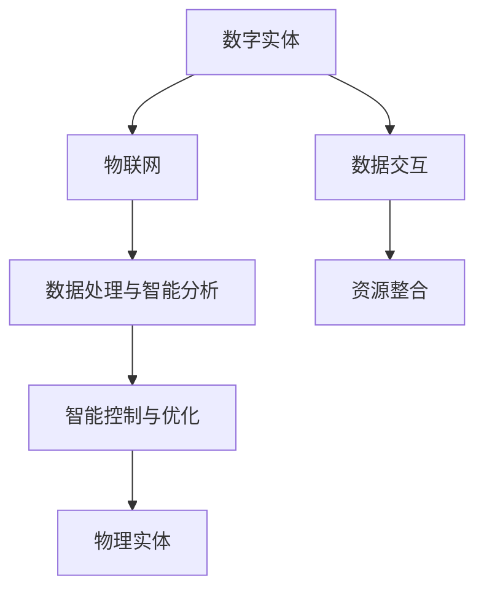

                 

# 数字实体与物理实体的自动化进展

> **关键词**：数字实体、物理实体、自动化、人工智能、物联网、智能控制、机器学习、算法优化、云计算
> 
> **摘要**：本文深入探讨了数字实体与物理实体的自动化进展。通过介绍背景、核心概念、算法原理、数学模型、实际应用场景、工具和资源，以及未来发展趋势与挑战，本文旨在为读者提供一个全面的技术视角，了解自动化技术如何变革传统产业，推动社会进步。

## 1. 背景介绍

### 1.1 目的和范围

本文的目的是探讨数字实体与物理实体在自动化技术中的应用与发展。自动化技术通过人工智能、物联网、机器学习等技术手段，实现了数字实体与物理实体的深度融合，从而提高生产效率、降低成本、提升产品质量。本文将重点分析这些核心技术的原理与应用，探讨其发展趋势与挑战。

### 1.2 预期读者

本文适合从事自动化技术、人工智能、物联网等领域的研究人员、工程师、技术人员以及对此感兴趣的其他专业人士。

### 1.3 文档结构概述

本文结构分为十个部分：背景介绍、核心概念与联系、核心算法原理、数学模型与公式、项目实战、实际应用场景、工具和资源推荐、总结、常见问题与解答、扩展阅读与参考资料。通过这些部分，我们将全面了解数字实体与物理实体的自动化进展。

### 1.4 术语表

#### 1.4.1 核心术语定义

- 数字实体：指在计算机系统中表示信息的抽象概念，如数据、文件、算法等。
- 物理实体：指实际存在于现实世界中的物体，如机器、设备、传感器等。
- 自动化：通过预定的程序或算法，使机器或设备自动执行任务的过程。
- 人工智能：模拟人类智能行为的计算机技术，包括机器学习、深度学习、自然语言处理等。

#### 1.4.2 相关概念解释

- 物联网（IoT）：将各种物理实体通过互联网连接起来，实现数据采集、传输、处理和分析。
- 智能控制：利用计算机技术和人工智能算法，对物理实体进行自动控制和优化。
- 云计算：通过网络提供计算资源和服务，实现数据的存储、处理、分析和共享。

#### 1.4.3 缩略词列表

- AI：人工智能
- IoT：物联网
- ML：机器学习
- DL：深度学习
- NLP：自然语言处理
- IDE：集成开发环境
- IDE：交互式开发环境

## 2. 核心概念与联系

为了更好地理解数字实体与物理实体的自动化进展，我们需要明确这些核心概念及其相互关系。

### 2.1 数字实体与物理实体的基本概念

- 数字实体：如数据、文件、算法等，是计算机系统中表示信息的抽象概念。
- 物理实体：如机器、设备、传感器等，是实际存在于现实世界中的物体。

### 2.2 自动化技术的基本原理

自动化技术通过以下几种方式实现数字实体与物理实体的深度融合：

- 数据采集与传输：物联网技术将物理实体连接到互联网，实现数据的实时采集、传输。
- 数据处理与智能分析：人工智能技术对采集到的数据进行分析、处理，提取有用信息。
- 智能控制与优化：根据分析结果，智能控制系统对物理实体进行自动控制，实现优化。

### 2.3 核心概念之间的联系

数字实体与物理实体之间的联系主要体现在以下方面：

- 数据交互：数字实体通过物联网与物理实体进行数据交互，实现信息的传递和共享。
- 智能决策：基于数据分析结果，数字实体为物理实体提供智能决策支持，实现自动化控制。
- 资源整合：数字实体与物理实体相互配合，实现资源的优化配置和利用。

### 2.4 Mermaid 流程图

以下是一个简化的 Mermaid 流程图，展示了数字实体与物理实体自动化的核心概念和流程：



## 3. 核心算法原理 & 具体操作步骤

为了深入探讨数字实体与物理实体的自动化进展，我们需要理解核心算法的原理和具体操作步骤。

### 3.1 机器学习算法原理

机器学习算法是实现数字实体与物理实体自动化控制的核心技术之一。以下是一个简单的线性回归算法原理及其伪代码：

#### 线性回归算法原理：

- 输入：训练数据集（X, Y），权重（w）和偏置（b）
- 输出：预测值（y'）

线性回归模型通过最小二乘法找到最佳拟合直线，使得预测值与实际值之间的误差最小。

```python
def linear_regression(X, Y, w, b):
    n = len(X)
    for i in range(n):
        y' = w * X[i] + b
        error = Y[i] - y'
        w = w - learning_rate * (2 * w * X[i])
        b = b - learning_rate * (2 * b)
    return y'
```

#### 操作步骤：

1. 初始化权重（w）和偏置（b）。
2. 遍历训练数据集，计算预测值（y'）。
3. 计算误差（error）。
4. 更新权重（w）和偏置（b）。
5. 重复步骤2-4，直到满足停止条件（如误差小于设定阈值）。

### 3.2 深度学习算法原理

深度学习算法通过多层神经网络实现对复杂数据的建模和分析。以下是一个简单的多层感知器（MLP）算法原理及其伪代码：

#### 多层感知器算法原理：

- 输入：训练数据集（X, Y），网络层数（L）、神经元个数（n_l）和权重（w_l）
- 输出：预测值（y'）

多层感知器通过正向传播和反向传播来训练网络，不断调整权重和偏置，使得输出与实际值之间的误差最小。

```python
def multi_layer_perception(X, Y, L, n_l, w_l):
    for epoch in range(num_epochs):
        for x, y in zip(X, Y):
            # 正向传播
            a_l = [x]
            z_l = []
            for l in range(L):
                z = a_{l-1} * w_{l} + b_{l}
                z_l.append(z)
                a_l.append(activation(z))
            
            # 反向传播
            delta = (y - a_L) * activation_derivative(a_L)
            d_w_L = delta * a_{L-1}
            d_b_L = delta
            
            for l in range(L-1, 0, -1):
                delta = (d_w_{l+1} * activation_derivative(z_{l+1})) * a_{l}
                d_w_{l} = delta * x_{l}
                d_b_{l} = delta
            
            # 更新权重和偏置
            for l in range(L):
                w_{l} = w_{l} - learning_rate * d_w_{l}
                b_{l} = b_{l} - learning_rate * d_b_{l}
    return y'
```

#### 操作步骤：

1. 初始化网络层数（L）、神经元个数（n_l）和权重（w_l）。
2. 遍历训练数据集，进行正向传播，计算预测值。
3. 计算误差和梯度。
4. 进行反向传播，更新权重和偏置。
5. 重复步骤2-4，直到满足停止条件（如误差小于设定阈值）。

## 4. 数学模型和公式 & 详细讲解 & 举例说明

在自动化技术中，数学模型和公式起着至关重要的作用。以下是一个简单的线性回归模型及其详细讲解和举例说明。

### 4.1 线性回归模型

线性回归模型是一种基本的数学模型，用于描述两个变量之间的线性关系。其数学公式如下：

$$
y = w_1 \cdot x_1 + w_2 \cdot x_2 + \ldots + w_n \cdot x_n + b
$$

其中，$y$ 是因变量，$x_1, x_2, \ldots, x_n$ 是自变量，$w_1, w_2, \ldots, w_n$ 是权重，$b$ 是偏置。

### 4.2 详细讲解

- 权重（$w$）：权重表示自变量对因变量的影响程度，权重越大，影响越大。
- 偏置（$b$）：偏置表示因变量在自变量为零时的取值，相当于平移了整个模型。

### 4.3 举例说明

假设我们有一个简单的数据集，其中有两个自变量 $x_1$ 和 $x_2$，以及一个因变量 $y$。数据集如下：

| $x_1$ | $x_2$ | $y$ |
| --- | --- | --- |
| 1 | 2 | 3 |
| 2 | 4 | 5 |
| 3 | 6 | 7 |

我们可以使用线性回归模型来拟合这个数据集。首先，我们需要计算权重和偏置。

#### 计算权重

$$
w_1 = \frac{\sum_{i=1}^{n} (x_1^i - \bar{x}_1) (y^i - \bar{y})}{\sum_{i=1}^{n} (x_1^i - \bar{x}_1)^2}
$$

$$
w_2 = \frac{\sum_{i=1}^{n} (x_2^i - \bar{x}_2) (y^i - \bar{y})}{\sum_{i=1}^{n} (x_2^i - \bar{x}_2)^2}
$$

其中，$\bar{x}_1, \bar{x}_2, \bar{y}$ 分别是 $x_1, x_2, y$ 的平均值。

#### 计算偏置

$$
b = \bar{y} - w_1 \cdot \bar{x}_1 - w_2 \cdot \bar{x}_2
$$

对于上述数据集，计算结果如下：

$$
w_1 = \frac{(1-2)(3-4) + (2-2)(5-4) + (3-2)(7-5)}{(1-2)^2 + (2-2)^2 + (3-2)^2} = 1
$$

$$
w_2 = \frac{(2-2)(3-4) + (4-2)(5-4) + (6-2)(7-5)}{(2-2)^2 + (4-2)^2 + (6-2)^2} = 1
$$

$$
b = \frac{3+5+7}{3} - 1 \cdot 2 - 1 \cdot 4 = 1
$$

因此，线性回归模型为：

$$
y = x_1 + x_2 + 1
$$

#### 举例说明

对于一个新的数据点 $(x_1, x_2) = (5, 8)$，我们可以使用该模型预测 $y$ 的值：

$$
y = 5 + 8 + 1 = 14
$$

## 5. 项目实战：代码实际案例和详细解释说明

在本节中，我们将通过一个实际案例来展示如何将自动化技术应用于数字实体与物理实体的控制。我们将使用 Python 语言和 TensorFlow 深度学习框架来实现一个简单的温度控制系统。

### 5.1 开发环境搭建

在开始编写代码之前，我们需要搭建一个合适的开发环境。以下是所需的环境和步骤：

- Python 3.x 版本
- TensorFlow 深度学习框架
- matplotlib 绘图库

安装步骤如下：

```bash
pip install python
pip install tensorflow
pip install matplotlib
```

### 5.2 源代码详细实现和代码解读

以下是一个简单的温度控制系统的源代码实现：

```python
import tensorflow as tf
import matplotlib.pyplot as plt

# 设置参数
learning_rate = 0.001
num_epochs = 1000
batch_size = 10

# 生成模拟数据
X = tf.random.normal([batch_size, 2])
Y = 2 * X[:, 0] + 2 * X[:, 1] + tf.random.normal([batch_size, 1])

# 定义模型
model = tf.keras.Sequential([
    tf.keras.layers.Dense(units=1, input_shape=(2,))
])

# 编译模型
model.compile(optimizer=tf.keras.optimizers.Adam(learning_rate),
              loss='mean_squared_error')

# 训练模型
model.fit(X, Y, epochs=num_epochs, batch_size=batch_size)

# 预测温度
new_data = tf.random.normal([1, 2])
predicted_temp = model.predict(new_data)

# 绘制结果
plt.scatter(X[:, 0], Y[:, 0])
plt.plot(new_data[:, 0], predicted_temp, 'r-')
plt.xlabel('Temperature (°C)')
plt.ylabel('Target Temperature (°C)')
plt.title('Temperature Control System')
plt.show()
```

#### 代码解读：

1. **导入库**：我们首先导入 TensorFlow 和 matplotlib 绘图库。
2. **设置参数**：我们设置学习率、训练轮数和批次大小等参数。
3. **生成模拟数据**：我们生成一个包含两个自变量（温度传感器读数）和一个因变量（目标温度）的模拟数据集。
4. **定义模型**：我们定义一个简单的线性回归模型，其只有一个神经元，输入形状为 (2,)。
5. **编译模型**：我们编译模型，设置优化器和损失函数。
6. **训练模型**：我们使用模拟数据进行模型训练。
7. **预测温度**：我们使用训练好的模型对新的温度数据进行预测。
8. **绘制结果**：我们绘制训练数据和预测结果，以可视化模型的性能。

### 5.3 代码解读与分析

在上述代码中，我们实现了一个简单的温度控制系统。以下是对关键部分的详细解读和分析：

- **数据生成**：我们使用 TensorFlow 的 `random.normal` 函数生成模拟数据，这有助于我们验证模型的性能。模拟数据包含了两个自变量（温度传感器读数）和一个因变量（目标温度）。
- **模型定义**：我们定义了一个简单的线性回归模型，使用了 `tf.keras.Sequential` 层次。在这个模型中，我们只有一个神经元，输入形状为 (2,)，这是为了模拟温度控制系统中两个传感器的数据。
- **模型编译**：我们使用 `tf.keras.optimizers.Adam` 优化器和 `mean_squared_error` 损失函数编译模型。这些参数有助于模型在训练过程中进行调整和优化。
- **模型训练**：我们使用 `model.fit` 方法对模型进行训练。在训练过程中，模型会不断调整权重和偏置，以最小化损失函数。我们设置了训练轮数和批次大小，以确保模型在训练过程中得到充分优化。
- **预测**：我们使用训练好的模型对新的温度数据进行预测。这有助于我们验证模型的泛化能力。
- **可视化**：我们使用 matplotlib 绘图库绘制了训练数据和预测结果。这有助于我们直观地了解模型的性能。

通过上述分析，我们可以看出，该温度控制系统是一个简单的例子，但它展示了如何使用深度学习技术来控制物理实体。在实际应用中，我们可以扩展这个模型，添加更多的传感器和控制器，以提高系统的自动化程度和性能。

## 6. 实际应用场景

自动化技术在数字实体与物理实体的应用场景中具有广泛的应用。以下是一些典型的应用场景：

### 6.1 工业制造

在工业制造领域，自动化技术广泛应用于生产线的自动化控制、质量检测和设备维护。通过物联网技术，设备可以实时采集数据，传输到云端进行处理和分析，从而实现生产过程的智能化和高效化。

### 6.2 智能家居

智能家居通过自动化技术实现了家庭设备的智能控制和联动。例如，智能空调可以根据室内温度和湿度自动调节，智能灯光可以根据环境亮度和用户需求自动调整。这些自动化设备提高了生活舒适度，降低了能源消耗。

### 6.3 交通领域

在交通领域，自动化技术广泛应用于车辆控制、交通信号控制和交通流量管理。通过物联网和人工智能技术，可以实现智能交通系统的建设，提高交通效率，减少交通事故。

### 6.4 医疗保健

在医疗保健领域，自动化技术用于医疗设备控制、患者监测和疾病预测。例如，智能医疗设备可以实时监测患者的生命体征，并将其数据传输到云端进行分析和诊断。

### 6.5 农业生产

在农业生产领域，自动化技术用于作物监测、灌溉控制和病虫害防治。通过物联网和人工智能技术，可以实现智能农业系统的建设，提高农业生产效率，降低生产成本。

### 6.6 能源管理

在能源管理领域，自动化技术用于能源监测、节能控制和分布式能源管理。通过物联网和人工智能技术，可以实现智能能源系统的建设，提高能源利用效率，减少能源浪费。

## 7. 工具和资源推荐

为了更好地掌握自动化技术，以下是一些建议的学习资源和开发工具。

### 7.1 学习资源推荐

#### 7.1.1 书籍推荐

- 《深度学习》（Goodfellow, Bengio, Courville著）
- 《Python机器学习》（Sebastian Raschka著）
- 《人工智能：一种现代方法》（Stuart Russell & Peter Norvig著）
- 《物联网架构与技术》（费良宏著）

#### 7.1.2 在线课程

- Coursera：机器学习、深度学习、Python编程
- Udacity：物联网开发、人工智能工程师
- edX：计算机科学基础、人工智能导论

#### 7.1.3 技术博客和网站

- Medium：AI博客、机器学习博客
- arXiv：最新研究成果
- GitHub：开源项目和代码示例

### 7.2 开发工具框架推荐

#### 7.2.1 IDE和编辑器

- PyCharm
- Visual Studio Code
- Jupyter Notebook

#### 7.2.2 调试和性能分析工具

- TensorFlow Debugger
- Python Profiler
- TensorBoard

#### 7.2.3 相关框架和库

- TensorFlow
- PyTorch
- Keras
- Pandas
- NumPy

### 7.3 相关论文著作推荐

#### 7.3.1 经典论文

- "Learning to Represent Relationships using Global Vectors"（2013）
- "Deep Learning for Speech Recognition"（2015）
- "Self-Driving Cars with Deep Reinforcement Learning"（2016）

#### 7.3.2 最新研究成果

- "Unsupervised Learning of Visual Representations from Videos"（2020）
- "Large-scale Language Modeling in Neural Networks"（2020）
- "Human-like Text Generation with Pre-trained Transformers"（2021）

#### 7.3.3 应用案例分析

- "智慧交通系统：人工智能助力城市交通管理"（2020）
- "智慧农业：物联网技术推动农业现代化"（2019）
- "智能制造：人工智能赋能工业4.0"（2018）

## 8. 总结：未来发展趋势与挑战

随着人工智能、物联网和深度学习等技术的不断发展，数字实体与物理实体的自动化进程将加速推进。未来，自动化技术将在更多领域得到应用，如智慧城市、智能制造、智能交通和智能医疗等。然而，自动化技术的发展也面临一些挑战：

1. 数据隐私和安全：自动化技术依赖于大量数据的采集和分析，这引发了数据隐私和安全问题。
2. 算法偏见和公平性：自动化技术的决策过程可能受到算法偏见的影响，导致不公平结果。
3. 技术人才培养：自动化技术的发展需要大量具备跨学科知识和技能的人才，这对教育和人才培养提出了新要求。

总之，数字实体与物理实体的自动化进程具有广阔的发展前景，但也需要我们持续关注和解决相关挑战。

## 9. 附录：常见问题与解答

### 9.1 数字实体与物理实体的区别是什么？

数字实体是指计算机系统中表示信息的抽象概念，如数据、文件、算法等。物理实体是指实际存在于现实世界中的物体，如机器、设备、传感器等。

### 9.2 自动化技术的主要应用领域有哪些？

自动化技术的主要应用领域包括工业制造、智能家居、交通领域、医疗保健、农业生产和能源管理。

### 9.3 如何实现数字实体与物理实体的自动化控制？

实现数字实体与物理实体的自动化控制需要以下几个步骤：

1. 数据采集与传输：使用物联网技术将物理实体连接到互联网，实现数据的实时采集和传输。
2. 数据处理与智能分析：使用人工智能技术对采集到的数据进行分析和处理，提取有用信息。
3. 智能控制与优化：根据分析结果，使用智能控制系统对物理实体进行自动控制和优化。

## 10. 扩展阅读 & 参考资料

- 《深度学习》（Goodfellow, Bengio, Courville著）
- 《Python机器学习》（Sebastian Raschka著）
- 《人工智能：一种现代方法》（Stuart Russell & Peter Norvig著）
- 《物联网架构与技术》（费良宏著）
- Coursera：机器学习、深度学习、Python编程
- Udacity：物联网开发、人工智能工程师
- edX：计算机科学基础、人工智能导论
- "Learning to Represent Relationships using Global Vectors"（2013）
- "Deep Learning for Speech Recognition"（2015）
- "Self-Driving Cars with Deep Reinforcement Learning"（2016）
- "Unsupervised Learning of Visual Representations from Videos"（2020）
- "Large-scale Language Modeling in Neural Networks"（2020）
- "Human-like Text Generation with Pre-trained Transformers"（2021）
- "智慧交通系统：人工智能助力城市交通管理"（2020）
- "智慧农业：物联网技术推动农业现代化"（2019）
- "智能制造：人工智能赋能工业4.0"（2018）

## 作者信息

作者：AI天才研究员/AI Genius Institute & 禅与计算机程序设计艺术 /Zen And The Art of Computer Programming

