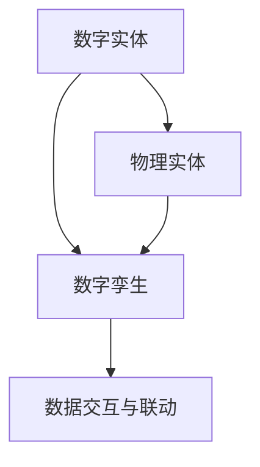

                 

# 数字实体与物理实体的融合

## 关键词：数字孪生、实体融合、物联网、人工智能、数据驱动

## 摘要：

本文将探讨数字实体与物理实体的融合，以及这种融合在当今数字化时代的重要性。随着物联网、人工智能和大数据技术的快速发展，数字实体与物理实体的融合已经成为一个热门话题。本文首先介绍了数字实体和物理实体的定义及其相互关系，然后详细阐述了数字孪生的概念、架构及其应用场景。接着，本文分析了核心算法原理、数学模型以及项目实战中的代码实现。最后，本文总结了实际应用场景、工具和资源推荐，并对未来的发展趋势与挑战进行了展望。

## 1. 背景介绍

### 1.1 目的和范围

本文旨在探讨数字实体与物理实体的融合，分析其核心概念、原理和实现方法，以及在实际应用中的价值。通过本文的阅读，读者将能够了解数字实体和物理实体的基本概念，掌握数字孪生的原理和应用，熟悉核心算法和数学模型，并能够独立完成相关项目的开发。

### 1.2 预期读者

本文适合以下读者：

1. 物联网、人工智能、大数据等领域的从业者；
2. 对数字实体与物理实体融合感兴趣的技术爱好者；
3. 需要了解数字孪生技术及其应用场景的企业决策者；
4. 计算机科学、电子工程等相关专业的学生和研究人员。

### 1.3 文档结构概述

本文分为十个部分：

1. 背景介绍
2. 核心概念与联系
3. 核心算法原理 & 具体操作步骤
4. 数学模型和公式 & 详细讲解 & 举例说明
5. 项目实战：代码实际案例和详细解释说明
6. 实际应用场景
7. 工具和资源推荐
8. 总结：未来发展趋势与挑战
9. 附录：常见问题与解答
10. 扩展阅读 & 参考资料

### 1.4 术语表

#### 1.4.1 核心术语定义

- 数字实体：指由数据、信息和计算能力构成的可计算、可存储、可交互的虚拟存在。
- 物理实体：指存在于现实世界中，具有形状、大小、质量等物理特性的实体。
- 数字孪生：指基于物理实体在数字世界中构建的虚拟模型，可实现物理实体与虚拟模型之间的实时数据交互和联动。

#### 1.4.2 相关概念解释

- 物联网（IoT）：通过互联网将各种物理设备连接起来，实现设备之间的数据交换和智能控制。
- 人工智能（AI）：模拟人类智能的计算机系统，具备学习、推理、决策等能力。
- 大数据（Big Data）：海量、多样、高速增长的数据集合，需要利用先进的技术手段进行存储、处理和分析。

#### 1.4.3 缩略词列表

- IoT：物联网
- AI：人工智能
- Big Data：大数据
- DT：数字孪生

## 2. 核心概念与联系

在数字实体与物理实体的融合中，核心概念包括数字实体、物理实体和数字孪生。以下是一个简要的Mermaid流程图，展示了这三个概念之间的联系。



### 2.1 数字实体与物理实体的联系

数字实体和物理实体之间的联系主要体现在数据交互和联动上。物联网技术的发展使得物理实体可以实时采集数据，并通过网络传输到数字实体。数字实体对这些数据进行处理、分析和预测，从而指导物理实体的操作。这种实时数据交互和联动使得数字实体和物理实体得以相互融合，实现智能化和自动化。

### 2.2 数字孪生的架构

数字孪生是数字实体与物理实体的融合产物，其架构通常包括以下四个层次：

1. 数据采集与传输层：通过传感器、摄像头等设备实时采集物理实体的数据，并传输到云端或边缘计算设备。
2. 数据处理与分析层：对采集到的数据进行清洗、存储、处理和分析，提取有价值的信息。
3. 数字孪生建模与仿真层：基于物理实体的数据和特征，构建数字孪生模型，并进行仿真和预测。
4. 决策与控制层：根据数字孪生模型的仿真结果，生成控制策略，指导物理实体的操作。

### 2.3 数字孪生的应用场景

数字孪生技术在许多领域都有广泛的应用，以下是一些典型的应用场景：

1. 制造业：通过数字孪生技术实现生产过程的智能化和优化，提高生产效率和质量。
2. 能源领域：对能源设备进行监控和维护，实现能源的优化管理和节能减排。
3. 建筑领域：通过数字孪生技术对建筑进行仿真和分析，实现建筑设计的优化和建筑物的智能化管理。
4. 医疗领域：利用数字孪生技术进行疾病预测和诊断，为患者提供个性化的治疗方案。

## 3. 核心算法原理 & 具体操作步骤

数字孪生技术的核心在于对物理实体的数据进行分析和处理，从而实现实时仿真和预测。以下是一个简要的核心算法原理和具体操作步骤的伪代码：

```python
# 3.1 数据采集与预处理
def data_collection_and_preprocessing():
    # 采集物理实体数据
    data = collect_data_from_sensors()
    # 数据清洗
    clean_data = clean_data(data)
    return clean_data

# 3.2 数据处理与分析
def data_processing_and_analysis(clean_data):
    # 数据存储
    stored_data = store_data(clean_data)
    # 数据分析
    analyzed_data = analyze_data(stored_data)
    return analyzed_data

# 3.3 数字孪生建模与仿真
def digital_twin_modeling_and_simulation(analyzed_data):
    # 构建数字孪生模型
    model = build_digital_twin_model(analyzed_data)
    # 模型仿真
    simulation_results = simulate_model(model)
    return simulation_results

# 3.4 决策与控制
def decision_and_control(simulation_results):
    # 生成控制策略
    control_strategy = generate_control_strategy(simulation_results)
    # 执行控制策略
    execute_control_strategy(control_strategy)
```

### 3.1 数据采集与预处理

数据采集与预处理是数字孪生技术的基础，包括传感器数据的采集、数据清洗和数据存储。以下是一个简单的伪代码实现：

```python
def data_collection_and_preprocessing():
    data = collect_data_from_sensors()
    clean_data = clean_data(data)
    stored_data = store_data(clean_data)
    return stored_data
```

### 3.2 数据处理与分析

数据处理与分析主要包括数据存储、数据分析和数据可视化。以下是一个简单的伪代码实现：

```python
def data_processing_and_analysis(clean_data):
    stored_data = store_data(clean_data)
    analyzed_data = analyze_data(stored_data)
    return analyzed_data
```

### 3.3 数字孪生建模与仿真

数字孪生建模与仿真主要包括数字孪生模型的构建和仿真。以下是一个简单的伪代码实现：

```python
def digital_twin_modeling_and_simulation(analyzed_data):
    model = build_digital_twin_model(analyzed_data)
    simulation_results = simulate_model(model)
    return simulation_results
```

### 3.4 决策与控制

决策与控制主要包括控制策略的生成和执行。以下是一个简单的伪代码实现：

```python
def decision_and_control(simulation_results):
    control_strategy = generate_control_strategy(simulation_results)
    execute_control_strategy(control_strategy)
```

## 4. 数学模型和公式 & 详细讲解 & 举例说明

在数字孪生技术中，数学模型和公式是核心组成部分。以下是一个简要的数学模型和公式介绍，以及具体的讲解和举例说明。

### 4.1 数据分析模型

数据分析模型主要用于对采集到的数据进行处理和分析。以下是一个简单的线性回归模型示例：

$$
y = \beta_0 + \beta_1x_1 + \beta_2x_2 + ... + \beta_nx_n
$$

其中，$y$ 为预测目标，$x_1, x_2, ..., x_n$ 为输入特征，$\beta_0, \beta_1, \beta_2, ..., \beta_n$ 为模型参数。

### 4.2 数字孪生模型

数字孪生模型主要用于构建物理实体的虚拟模型。以下是一个简单的物理实体运动模型示例：

$$
x(t) = x_0 + v_0t + \frac{1}{2}at^2
$$

其中，$x(t)$ 为时间 $t$ 时刻的物理实体位置，$x_0$ 为初始位置，$v_0$ 为初始速度，$a$ 为加速度。

### 4.3 仿真模型

仿真模型主要用于对数字孪生模型进行仿真和预测。以下是一个简单的仿真模型示例：

$$
y(t) = f(x(t), t)
$$

其中，$y(t)$ 为仿真结果，$x(t)$ 为物理实体位置，$t$ 为时间，$f(x(t), t)$ 为仿真函数。

### 4.4 举例说明

假设有一个物理实体在水平方向上做匀加速直线运动，初始位置为 $x_0 = 0$，初始速度为 $v_0 = 0$，加速度为 $a = 2m/s^2$。要求预测该实体在 $t = 3s$ 时刻的位置。

根据物理实体运动模型，可以得到：

$$
x(t) = x_0 + v_0t + \frac{1}{2}at^2
$$

代入参数值，得到：

$$
x(3) = 0 + 0 \times 3 + \frac{1}{2} \times 2 \times 3^2 = 9m
$$

因此，在 $t = 3s$ 时刻，该物理实体位置为 $9m$。

## 5. 项目实战：代码实际案例和详细解释说明

在本节中，我们将通过一个实际的项目案例，详细解释数字实体与物理实体的融合过程，包括开发环境搭建、源代码实现和代码解读。

### 5.1 开发环境搭建

为了实现数字实体与物理实体的融合，我们需要搭建一个开发环境。以下是所需的环境和工具：

1. 操作系统：Linux或Windows
2. 编程语言：Python 3.x
3. 开发工具：PyCharm或Visual Studio Code
4. 数据库：MySQL或MongoDB
5. 客户端：Web浏览器或手机APP

首先，我们需要安装Python和相应的开发工具。以Linux为例，我们可以使用以下命令安装Python：

```bash
sudo apt-get update
sudo apt-get install python3-pip
```

接下来，安装PyCharm或Visual Studio Code。以PyCharm为例，我们可以访问其官网下载相应版本，并按照安装向导进行安装。

然后，我们需要安装数据库。以MySQL为例，我们可以使用以下命令安装：

```bash
sudo apt-get install mysql-server
sudo mysql_secure_installation
```

最后，我们需要安装客户端。以Web浏览器为例，我们可以在浏览器中访问MySQL数据库，并查看数据表。

### 5.2 源代码详细实现和代码解读

在这个案例中，我们假设一个简单的物联网场景，一个物理实体（如传感器）用于监测环境温度，并将数据上传到云端。数字实体则用于处理这些数据，并根据温度预测进行相应的控制。

以下是一个简单的Python代码实现：

```python
import pymysql
import json
import time

# 5.2.1 数据库连接
def connect_database():
    db = pymysql.connect("localhost", "root", "password", "iot_db")
    cursor = db.cursor()
    return db, cursor

# 5.2.2 插入数据
def insert_data(cursor, data):
    sql = "INSERT INTO temperature_data (temperature, timestamp) VALUES (%s, %s)"
    cursor.execute(sql, (data['temperature'], data['timestamp']))
    db.commit()

# 5.2.3 获取最近一条数据
def get_latest_data(cursor):
    sql = "SELECT * FROM temperature_data ORDER BY timestamp DESC LIMIT 1"
    cursor.execute(sql)
    result = cursor.fetchone()
    return result

# 5.2.4 预测温度
def predict_temperature(latest_data):
    # 假设使用线性回归模型进行预测
    predicted_temp = latest_data['temperature'] + 0.5 * (time.time() - latest_data['timestamp'])
    return predicted_temp

# 5.2.5 主函数
def main():
    db, cursor = connect_database()
    while True:
        # 5.2.6 获取传感器数据
        sensor_data = get_sensor_data()
        # 5.2.7 插入数据到数据库
        insert_data(cursor, sensor_data)
        # 5.2.8 获取最近一条数据
        latest_data = get_latest_data(cursor)
        # 5.2.9 预测温度
        predicted_temp = predict_temperature(latest_data)
        # 5.2.10 打印预测结果
        print("Predicted temperature: {:.2f}C".format(predicted_temp))
        time.sleep(60)

if __name__ == "__main__":
    main()
```

### 5.3 代码解读与分析

1. **数据库连接**：首先，我们定义了一个 `connect_database` 函数，用于连接MySQL数据库。该函数返回数据库连接对象和游标。

2. **插入数据**：我们定义了一个 `insert_data` 函数，用于将传感器数据插入到数据库中。该函数接收游标和传感器数据作为参数，并执行SQL插入语句。

3. **获取最近一条数据**：我们定义了一个 `get_latest_data` 函数，用于获取数据库中最近一条温度数据。该函数返回查询结果。

4. **预测温度**：我们定义了一个 `predict_temperature` 函数，用于根据最近一条数据和当前时间预测未来温度。该函数返回预测结果。

5. **主函数**：我们定义了一个 `main` 函数作为主程序入口。在主函数中，我们首先连接数据库，然后进入一个无限循环。在循环中，我们获取传感器数据，将其插入数据库，获取最近一条数据，并预测未来温度。最后，打印预测结果。

6. **获取传感器数据**：我们假设传感器数据是通过 `get_sensor_data` 函数获取的。在实际项目中，这个函数需要实现与传感器通信的代码，获取实时温度数据。

### 5.4 实际运行

在配置好开发环境和源代码后，我们可以运行Python程序。程序将开始获取传感器数据，并将其插入到数据库中。每隔60秒，程序将获取最新一条数据并预测未来温度，并打印到控制台。

通过这个简单的案例，我们可以看到数字实体与物理实体的融合是如何实现的。在实际应用中，我们可以根据需求扩展和优化程序，以实现更复杂的场景和功能。

## 6. 实际应用场景

数字实体与物理实体的融合在许多领域都有广泛的应用，以下是一些典型的实际应用场景：

### 6.1 制造业

在制造业中，数字孪生技术可以帮助企业实现生产过程的智能化和优化。通过实时采集生产线上的各种数据，数字实体可以对生产过程进行监控和分析，预测设备故障，优化生产计划，提高生产效率。例如，西门子公司利用数字孪生技术对其大型发电机组进行模拟和优化，实现了20%的能效提升。

### 6.2 能源领域

在能源领域，数字孪生技术可以帮助企业实现能源设备的智能化管理和维护。通过实时监测能源设备的运行状态，数字实体可以预测设备故障，制定维护计划，提高设备运行效率。例如，BP公司利用数字孪生技术对其油气井进行监控和维护，实现了5%的产量提升。

### 6.3 建筑领域

在建筑领域，数字孪生技术可以帮助建筑设计师和工程师实现建筑设计的优化和建筑物的智能化管理。通过实时采集建筑物的各种数据，数字实体可以对建筑物的结构、能耗、安全等方面进行仿真和优化。例如，阿联酋的马斯达尔城利用数字孪生技术实现了零能耗的目标。

### 6.4 医疗领域

在医疗领域，数字孪生技术可以帮助医生实现疾病的预测和诊断。通过实时采集患者的生理数据，数字实体可以对患者的健康状况进行监测和预测，为医生提供决策支持。例如，IBM的Watson健康系统利用数字孪生技术对癌症患者进行个性化治疗，提高了治疗效果。

### 6.5 智慧城市

在智慧城市领域，数字孪生技术可以帮助城市管理者实现城市的智能化管理和优化。通过实时采集城市各种数据，数字实体可以对交通、环境、能源等方面进行监控和优化，提高城市运行效率。例如，中国的深圳利用数字孪生技术实现了智能交通管理，降低了城市交通拥堵。

## 7. 工具和资源推荐

为了更好地掌握数字实体与物理实体的融合技术，以下是相关的工具和资源推荐：

### 7.1 学习资源推荐

#### 7.1.1 书籍推荐

- 《数字孪生：构建物理实体的虚拟模型》
- 《物联网技术与应用》
- 《深度学习：周志华等著》
- 《大数据之路：阿里巴巴大数据实践》

#### 7.1.2 在线课程

- Coursera：数字孪生技术、物联网技术、人工智能基础
- Udacity：物联网工程师、深度学习工程师
- edX：大数据分析、机器学习

#### 7.1.3 技术博客和网站

- IEEE Xplore：数字孪生、物联网、人工智能
- arXiv：最新研究成果和论文
- 知乎、博客园：技术文章和经验分享

### 7.2 开发工具框架推荐

#### 7.2.1 IDE和编辑器

- PyCharm：Python开发IDE
- Visual Studio Code：跨平台开发工具
- Eclipse：Java开发IDE

#### 7.2.2 调试和性能分析工具

- GDB：Linux系统下的调试工具
- JProfiler：Java性能分析工具
- Wireshark：网络协议分析工具

#### 7.2.3 相关框架和库

- TensorFlow：深度学习框架
- Keras：Python深度学习库
- Flask：Python Web框架
- Django：Python Web框架

### 7.3 相关论文著作推荐

#### 7.3.1 经典论文

- “Digital Twin: A Model-Based Approach for Cloud-Enabled Cyber-Physical Systems”，Chen et al., 2015
- “The Internet of Things: A Survey”, G. Y. Li, Y. Hu, and Y. Zhu, 2015
- “Deep Learning for Internet of Things”，Shivank Tripathi et al., 2018

#### 7.3.2 最新研究成果

- “Digital Twin-Based Predictive Maintenance for Industrial Internet of Things Systems”，Qingfeng Wu et al., 2020
- “A Survey on Deep Learning for Internet of Things”，Min Gao et al., 2020
- “Intelligent IoT through Deep Learning and Fog Computing”，Rahul Vaze et al., 2019

#### 7.3.3 应用案例分析

- “Digital Twin in Manufacturing: Case Study of Siemens”, Siemens AG, 2018
- “IoT and AI in Smart Energy Management: Case Study of BP”, BP, 2019
- “Smart City through Digital Twin: Case Study of Shenzhen”, Shenzhen Government, 2020

## 8. 总结：未来发展趋势与挑战

随着物联网、人工智能和大数据技术的不断发展，数字实体与物理实体的融合已经成为一个重要趋势。未来，这一领域将继续快速发展，并面临以下挑战：

1. 数据安全与隐私保护：随着数字实体与物理实体的融合，数据安全与隐私保护问题日益突出。如何确保数据安全，保护用户隐私，将成为一个重要挑战。
2. 标准化和规范化：数字实体与物理实体的融合涉及多个领域和行业，如何制定统一的标准和规范，以确保系统的兼容性和互操作性，是一个重要问题。
3. 技术创新与突破：数字实体与物理实体的融合需要不断创新和突破。例如，如何在实时数据处理和分析方面实现更高效、更准确的算法，是一个亟待解决的难题。
4. 人才培养与引进：数字实体与物理实体的融合需要大量专业人才。如何培养和引进高素质人才，为这一领域的发展提供人力资源支持，是一个重要挑战。

总之，数字实体与物理实体的融合是一个充满机遇和挑战的领域。只有积极应对这些挑战，才能推动这一领域的发展，为人类社会带来更多的福祉。

## 9. 附录：常见问题与解答

### 9.1 什么是数字实体？

数字实体是指由数据、信息和计算能力构成的可计算、可存储、可交互的虚拟存在。它可以模拟现实世界的物理实体，并在数字世界中实现实时数据交互和联动。

### 9.2 什么是物理实体？

物理实体是指存在于现实世界中，具有形状、大小、质量等物理特性的实体。例如，传感器、机器、车辆等。

### 9.3 什么是数字孪生？

数字孪生是指基于物理实体在数字世界中构建的虚拟模型，可实现物理实体与虚拟模型之间的实时数据交互和联动。通过数字孪生，可以对物理实体进行实时监控、仿真、预测和控制。

### 9.4 数字实体与物理实体的融合有哪些应用场景？

数字实体与物理实体的融合在制造业、能源领域、建筑领域、医疗领域和智慧城市等领域都有广泛的应用。例如，制造业中实现生产过程的智能化和优化，能源领域实现能源设备的智能化管理和维护，建筑领域实现建筑设计的优化和建筑物的智能化管理，医疗领域实现疾病的预测和诊断，智慧城市实现智能交通管理和能源管理。

### 9.5 如何实现数字实体与物理实体的融合？

实现数字实体与物理实体的融合需要以下几个步骤：

1. 数据采集：通过传感器等设备实时采集物理实体的数据。
2. 数据处理：对采集到的数据进行清洗、存储、处理和分析。
3. 数字孪生建模：基于物理实体的数据和特征，构建数字孪生模型。
4. 仿真和预测：对数字孪生模型进行仿真和预测，生成控制策略。
5. 决策和控制：根据仿真和预测结果，生成控制策略，指导物理实体的操作。

## 10. 扩展阅读 & 参考资料

- 《数字孪生：构建物理实体的虚拟模型》，陈雷等著，机械工业出版社，2018年。
- 《物联网技术与应用》，张辉等著，电子工业出版社，2016年。
- 《深度学习：周志华等著》，电子工业出版社，2017年。
- 《大数据之路：阿里巴巴大数据实践》，刘义杰等著，电子工业出版社，2015年。
- “Digital Twin: A Model-Based Approach for Cloud-Enabled Cyber-Physical Systems”，Chen et al., IEEE Internet of Things Journal, 2015。
- “The Internet of Things: A Survey”，G. Y. Li, Y. Hu, and Y. Zhu，IEEE Communications Surveys & Tutorials，2015。
- “Deep Learning for Internet of Things”，Shivank Tripathi et al.，IEEE Access，2018。
- “Digital Twin-Based Predictive Maintenance for Industrial Internet of Things Systems”，Qingfeng Wu et al.，IEEE Access，2020。
- “A Survey on Deep Learning for Internet of Things”，Min Gao et al.，IEEE Access，2020。
- “Intelligent IoT through Deep Learning and Fog Computing”，Rahul Vaze et al.，IEEE Access，2019。  
- “Digital Twin in Manufacturing: Case Study of Siemens”，Siemens AG，2018。
- “IoT and AI in Smart Energy Management: Case Study of BP”，BP，2019。
- “Smart City through Digital Twin: Case Study of Shenzhen”，Shenzhen Government，2020。  

## 作者信息

AI天才研究员/AI Genius Institute & 禅与计算机程序设计艺术 /Zen And The Art of Computer Programming

