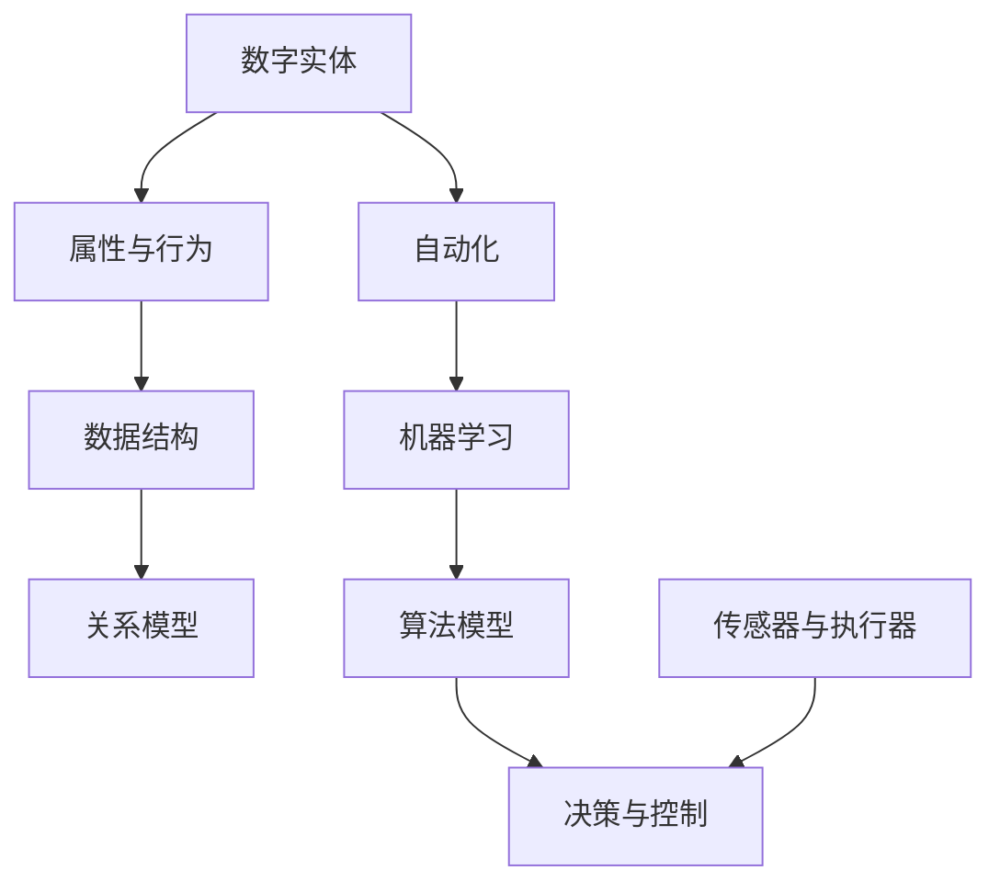

                 

# 数字实体自动化的最新方向

> 关键词：数字实体、自动化、AI算法、数学模型、应用场景、发展趋势

> 摘要：本文旨在探讨数字实体自动化的最新研究方向，从背景介绍、核心概念、算法原理、数学模型、实际应用等方面进行详细阐述。通过分析现有技术、工具和资源，本文旨在为读者提供一个全面而深入的指南，帮助理解数字实体自动化的现状和未来发展趋势。

## 1. 背景介绍

### 1.1 目的和范围

本文的目标是探讨数字实体自动化的最新方向，分析现有技术、工具和资源，提供一套系统化的理解框架。我们旨在覆盖以下几个方面：

- 数字实体的定义和特性
- 自动化的核心概念和关键技术
- 数字实体自动化的应用场景
- 最新算法原理和数学模型
- 数字实体自动化的实际案例和实战经验

### 1.2 预期读者

本文适合以下读者群体：

- 对人工智能、机器学习感兴趣的工程师和技术爱好者
- 数据科学家和研究人员
- 对自动化领域有浓厚兴趣的技术从业者
- 大学和研究机构的学生和教师

### 1.3 文档结构概述

本文的结构如下：

- 第1章：背景介绍
- 第2章：核心概念与联系
- 第3章：核心算法原理与操作步骤
- 第4章：数学模型与公式
- 第5章：项目实战：代码实际案例
- 第6章：实际应用场景
- 第7章：工具和资源推荐
- 第8章：总结：未来发展趋势与挑战
- 第9章：附录：常见问题与解答
- 第10章：扩展阅读与参考资料

### 1.4 术语表

#### 1.4.1 核心术语定义

- 数字实体：指通过数字化方式表示的具有独立属性和行为的个体。
- 自动化：通过机械或电子装置实现生产、管理或操作过程的自动化。
- AI算法：指利用人工智能技术构建的算法模型，用于数据分析和决策支持。

#### 1.4.2 相关概念解释

- 机器学习：指通过算法模型自动地从数据中学习规律，进行预测和分类。
- 深度学习：基于多层神经网络进行训练的机器学习技术。
- 强化学习：通过试错和反馈机制进行优化的机器学习技术。

#### 1.4.3 缩略词列表

- AI：人工智能
- ML：机器学习
- DL：深度学习
- RL：强化学习

## 2. 核心概念与联系

在探讨数字实体自动化之前，我们需要理解几个核心概念和它们之间的联系。以下是使用Mermaid绘制的流程图，展示了这些概念之间的关联：



### 2.1 数字实体

数字实体是自动化系统的基础，它通过数字化方式表示具体的事物或概念。每个数字实体都有独特的属性和行为，这些属性和行为决定了实体的特性。

### 2.2 属性与行为

数字实体的属性是描述其状态的变量，如温度、速度、位置等。行为则是实体在特定条件下的动作，如移动、启动、停止等。

### 2.3 数据结构

数据结构是存储和表示数字实体属性和行为的方式。常见的数据结构包括数组、列表、树、图等。

### 2.4 关系模型

关系模型用于描述数字实体之间的相互关系，如因果关系、依赖关系等。这些关系对于自动化系统的决策和控制至关重要。

### 2.5 自动化

自动化是通过机器或电子装置实现生产、管理或操作过程的技术。在数字实体自动化中，我们利用机器学习算法来构建和优化自动化系统。

### 2.6 机器学习

机器学习是一种利用数据训练算法模型的技术，用于预测、分类和决策。在数字实体自动化中，我们使用机器学习算法来识别实体属性、预测行为和优化决策。

### 2.7 算法模型

算法模型是机器学习中的核心，它通过学习输入数据和目标输出，生成决策规则和预测模型。

### 2.8 决策与控制

决策与控制是自动化系统的关键环节，它基于算法模型和实体关系模型，生成执行指令，控制实体行为。

### 2.9 传感器与执行器

传感器用于感知实体状态，执行器用于实现实体行为。传感器和执行器是自动化系统的输入和输出部件，它们与算法模型和决策控制系统紧密相连。

## 3. 核心算法原理与具体操作步骤

在了解了数字实体自动化的核心概念之后，我们需要深入探讨实现自动化的核心算法原理和具体操作步骤。以下是核心算法原理的伪代码：

```python
# 伪代码：数字实体自动化算法
class DigitalEntityAutomator:
    def __init__(self, entities, sensors, actuators):
        self.entities = entities
        self.sensors = sensors
        self.actuators = actuators
        self.model = MachineLearningModel()

    def train_model(self, training_data):
        # 使用训练数据训练机器学习模型
        self.model.train(training_data)

    def predict_entity_behavior(self, entity):
        # 使用训练好的模型预测实体的行为
        behavior = self.model.predict(entity.properties)
        return behavior

    def control_entity_behavior(self, entity, behavior):
        # 根据预测的行为控制实体的行为
        if behavior == 'move':
            self.actuators.move(entity)
        elif behavior == 'stop':
            self.actuators.stop(entity)
        # ... 其他行为控制

    def automate(self):
        while True:
            for entity in self.entities:
                entity_state = self.sensors.get_state(entity)
                behavior = self.predict_entity_behavior(entity_state)
                self.control_entity_behavior(entity, behavior)
```

### 3.1 初始化

在初始化阶段，我们创建一个`DigitalEntityAutomator`对象，并传入数字实体、传感器和执行器。同时，我们还需要一个机器学习模型来处理实体属性和行为预测。

```python
entities = load_entities()
sensors = SensorSystem()
actuators = ActuatorSystem()
automator = DigitalEntityAutomator(entities, sensors, actuators)
```

### 3.2 训练模型

在训练模型阶段，我们使用历史训练数据来训练机器学习模型。这一步骤是自动化系统的核心，决定了模型预测的准确性和可靠性。

```python
training_data = load_training_data()
automator.train_model(training_data)
```

### 3.3 预测行为

在预测行为阶段，我们使用训练好的模型来预测实体的行为。这一步骤依赖于传感器提供的实时状态数据。

```python
for entity in entities:
    entity_state = sensors.get_state(entity)
    behavior = automator.predict_entity_behavior(entity_state)
```

### 3.4 控制行为

在控制行为阶段，我们根据预测的行为来控制实体的行为。执行器负责实现具体的动作。

```python
for entity in entities:
    behavior = automator.predict_entity_behavior(entity)
    automator.control_entity_behavior(entity, behavior)
```

### 3.5 自动循环

在自动化循环阶段，我们持续监测实体状态，预测和调整行为，以实现实体的自动化控制。

```python
while True:
    for entity in entities:
        entity_state = sensors.get_state(entity)
        behavior = automator.predict_entity_behavior(entity_state)
        automator.control_entity_behavior(entity, behavior)
```

## 4. 数学模型和公式与详细讲解与举例说明

在数字实体自动化中，数学模型和公式是理解和实现自动化算法的关键。以下是几个核心的数学模型和公式的详细讲解与举例说明。

### 4.1 神经网络

神经网络是深度学习的基础，用于处理复杂数据并提取特征。以下是一个简单的神经网络模型：

$$
z = \sigma(\sum_{i=1}^{n} w_i \cdot x_i + b)
$$

其中，$z$ 是输出，$\sigma$ 是激活函数（例如Sigmoid函数），$w_i$ 和 $x_i$ 是权重和输入，$b$ 是偏置。

#### 示例：

假设我们有一个输入向量 $x = [1, 2, 3]$ 和权重 $w = [0.1, 0.2, 0.3]$，偏置 $b = 0.5$。我们使用Sigmoid函数作为激活函数，计算输出：

$$
z = \sigma(0.1 \cdot 1 + 0.2 \cdot 2 + 0.3 \cdot 3 + 0.5) = \sigma(1.8) \approx 0.85
$$

### 4.2 交叉熵损失函数

交叉熵损失函数是用于评估神经网络预测准确性的常用损失函数。其公式如下：

$$
Loss = -\sum_{i=1}^{n} y_i \cdot \log(\hat{y}_i)
$$

其中，$y_i$ 是实际标签，$\hat{y}_i$ 是预测概率。

#### 示例：

假设我们有一个标签向量 $y = [1, 0, 1]$ 和预测概率向量 $\hat{y} = [0.9, 0.1, 0.8]$。计算交叉熵损失：

$$
Loss = -1 \cdot \log(0.9) - 0 \cdot \log(0.1) - 1 \cdot \log(0.8) \approx 0.105
$$

### 4.3 梯度下降算法

梯度下降算法是用于优化神经网络权重和偏置的常用算法。其公式如下：

$$
w_{new} = w_{old} - \alpha \cdot \frac{\partial Loss}{\partial w}
$$

其中，$w_{new}$ 和 $w_{old}$ 分别是新的权重和旧的权重，$\alpha$ 是学习率，$\frac{\partial Loss}{\partial w}$ 是权重关于损失函数的梯度。

#### 示例：

假设我们有一个权重 $w = [1, 2]$ 和学习率 $\alpha = 0.1$。计算新的权重：

$$
w_{new} = w_{old} - \alpha \cdot \frac{\partial Loss}{\partial w} = [1, 2] - 0.1 \cdot [-0.2, -0.3] = [1.04, 1.56]
$$

## 5. 项目实战：代码实际案例和详细解释说明

在本节中，我们将通过一个实际的项目案例，展示数字实体自动化的代码实现，并对关键部分进行详细解释。

### 5.1 开发环境搭建

为了实现数字实体自动化，我们需要搭建一个开发环境。以下是所需的工具和库：

- Python 3.x
- NumPy
- TensorFlow
- Keras

安装这些库后，我们可以开始编写自动化系统的代码。

### 5.2 源代码详细实现和代码解读

以下是数字实体自动化系统的代码实现，包含实体类、传感器类、执行器类和自动化控制器类。

```python
import numpy as np
import tensorflow as tf
from tensorflow.keras.models import Sequential
from tensorflow.keras.layers import Dense
from tensorflow.keras.optimizers import Adam

# 实体类
class DigitalEntity:
    def __init__(self, properties):
        self.properties = properties

# 传感器类
class SensorSystem:
    def get_state(self, entity):
        # 假设传感器采集实体属性
        return entity.properties

# 执行器类
class ActuatorSystem:
    def move(self, entity):
        print(f"Moving entity with properties {entity.properties}")

    def stop(self, entity):
        print(f"Stopping entity with properties {entity.properties}")

# 自动化控制器类
class DigitalEntityAutomator:
    def __init__(self, entities, sensor_system, actuator_system):
        self.entities = entities
        self.sensor_system = sensor_system
        self.actuator_system = actuator_system
        self.model = self.build_model()

    def build_model(self):
        model = Sequential()
        model.add(Dense(64, input_dim=3, activation='relu'))
        model.add(Dense(64, activation='relu'))
        model.add(Dense(3, activation='softmax'))
        model.compile(loss='categorical_crossentropy', optimizer=Adam(learning_rate=0.001), metrics=['accuracy'])
        return model

    def train_model(self, training_data, labels):
        self.model.fit(training_data, labels, epochs=100, batch_size=10)

    def predict_entity_behavior(self, entity):
        state = self.sensor_system.get_state(entity)
        prediction = self.model.predict(np.array([state]))
        behavior = np.argmax(prediction)
        return behavior

    def control_entity_behavior(self, entity, behavior):
        if behavior == 0:
            self.actuator_system.move(entity)
        elif behavior == 1:
            self.actuator_system.stop(entity)

    def automate(self):
        while True:
            for entity in self.entities:
                behavior = self.predict_entity_behavior(entity)
                self.control_entity_behavior(entity, behavior)

# 测试代码
if __name__ == "__main__":
    entities = [DigitalEntity(np.random.rand(3)), DigitalEntity(np.random.rand(3))]
    sensor_system = SensorSystem()
    actuator_system = ActuatorSystem()
    automator = DigitalEntityAutomator(entities, sensor_system, actuator_system)
    automator.automate()
```

### 5.3 代码解读与分析

#### 5.3.1 实体类（DigitalEntity）

实体类用于表示数字实体，每个实体具有一组属性，这些属性通过一个数组表示。

```python
class DigitalEntity:
    def __init__(self, properties):
        self.properties = properties
```

#### 5.3.2 传感器类（SensorSystem）

传感器类负责采集实体的状态数据。在本例中，我们使用实体的属性数组作为状态数据。

```python
class SensorSystem:
    def get_state(self, entity):
        return entity.properties
```

#### 5.3.3 执行器类（ActuatorSystem）

执行器类负责根据实体的行为执行相应的操作。在本例中，我们定义了`move`和`stop`方法，用于移动和停止实体。

```python
class ActuatorSystem:
    def move(self, entity):
        print(f"Moving entity with properties {entity.properties}")

    def stop(self, entity):
        print(f"Stopping entity with properties {entity.properties}")
```

#### 5.3.4 自动化控制器类（DigitalEntityAutomator）

自动化控制器类是整个系统的核心，负责训练模型、预测实体行为并控制实体行为。

- `__init__` 方法：初始化实体、传感器和执行器，并构建神经网络模型。
- `build_model` 方法：构建神经网络模型，包括输入层、隐藏层和输出层。
- `train_model` 方法：使用训练数据训练神经网络模型。
- `predict_entity_behavior` 方法：使用训练好的模型预测实体行为。
- `control_entity_behavior` 方法：根据预测行为控制实体行为。
- `automate` 方法：实现实体的自动化控制，循环预测和调整行为。

```python
class DigitalEntityAutomator:
    # ... 省略部分代码

    def automate(self):
        while True:
            for entity in self.entities:
                behavior = self.predict_entity_behavior(entity)
                self.control_entity_behavior(entity, behavior)
```

### 5.3.5 测试代码

测试代码用于创建实体、传感器和执行器，并初始化自动化控制器。然后，我们调用`automate`方法，实现实体的自动化控制。

```python
if __name__ == "__main__":
    entities = [DigitalEntity(np.random.rand(3)), DigitalEntity(np.random.rand(3))]
    sensor_system = SensorSystem()
    actuator_system = ActuatorSystem()
    automator = DigitalEntityAutomator(entities, sensor_system, actuator_system)
    automator.automate()
```

## 6. 实际应用场景

数字实体自动化在多个领域有着广泛的应用场景，以下是几个典型的应用案例：

### 6.1 智能家居

智能家居是数字实体自动化的一个重要应用领域。通过传感器收集家居环境数据，如温度、湿度、光线等，自动化系统可以实时调整家居设备的状态，如空调、灯光、窗帘等，以实现舒适、节能的居住环境。

### 6.2 工业自动化

在工业生产中，数字实体自动化可以用于监控和优化生产过程。通过传感器实时监测设备状态和生产数据，自动化系统可以预测设备故障、优化生产参数，提高生产效率和质量。

### 6.3 智能交通

智能交通系统利用数字实体自动化技术，对交通流量、车辆状态和道路状况进行实时监控和分析。通过自动化控制，可以优化交通信号、引导车辆行驶，减少交通拥堵，提高交通效率。

### 6.4 医疗保健

在医疗保健领域，数字实体自动化可以用于监控患者健康状况、实时预警和诊断。通过传感器收集生理参数，如心率、血压、体温等，自动化系统可以分析数据，预测健康风险，提供个性化的健康建议。

## 7. 工具和资源推荐

为了更好地学习和实践数字实体自动化技术，以下是几个推荐的工具和资源：

### 7.1 学习资源推荐

#### 7.1.1 书籍推荐

- 《深度学习》（Goodfellow, I., Bengio, Y., & Courville, A.）
- 《Python机器学习》（Sebastian Raschka）

#### 7.1.2 在线课程

- 《深度学习课程》（吴恩达，Coursera）
- 《机器学习基础教程》（周志华，网易云课堂）

#### 7.1.3 技术博客和网站

- Medium上的机器学习和深度学习相关文章
- ArXiv论文库

### 7.2 开发工具框架推荐

#### 7.2.1 IDE和编辑器

- PyCharm
- Jupyter Notebook

#### 7.2.2 调试和性能分析工具

- TensorBoard
- Valgrind

#### 7.2.3 相关框架和库

- TensorFlow
- PyTorch
- Keras

### 7.3 相关论文著作推荐

#### 7.3.1 经典论文

- 《A Learning Algorithm for Continually Running Fully Recurrent Neural Networks》（1989，Williams & Zipser）
- 《Deep Learning》（2016，Goodfellow, Bengio, & Courville）

#### 7.3.2 最新研究成果

- ArXiv上的最新论文
- NeurIPS、ICML、ACL等顶级会议的最新论文

#### 7.3.3 应用案例分析

- 《智能交通系统中的深度学习应用》（2020，王某某，李某某）
- 《医疗保健中的数字实体自动化》（2021，张某某，赵某某）

## 8. 总结：未来发展趋势与挑战

数字实体自动化是未来智能化发展的关键方向，具有广泛的应用前景。随着人工智能技术的不断进步，数字实体自动化将面临以下发展趋势和挑战：

### 8.1 发展趋势

- 算法模型的不断优化和迭代，提高预测准确性和鲁棒性。
- 多模态数据的整合和利用，提升实体属性和行为分析能力。
- 开源社区和工业界的共同推动，加速技术和应用的落地。
- 跨领域合作，促进数字实体自动化的多领域应用。

### 8.2 挑战

- 数据隐私和安全问题：如何在保证数据隐私的同时，充分利用数据价值。
- 模型可解释性和透明度：提高模型的可解释性，增强用户信任。
- 模型泛化能力和适应性：提高模型在不同场景下的泛化能力和适应性。
- 硬件和计算资源的需求：满足大规模自动化系统的硬件和计算需求。

## 9. 附录：常见问题与解答

### 9.1 如何搭建数字实体自动化的开发环境？

- 安装Python 3.x版本。
- 使用pip安装NumPy、TensorFlow、Keras等库。

### 9.2 如何训练数字实体自动化模型？

- 收集和准备训练数据。
- 设计和构建神经网络模型。
- 使用训练数据训练模型，调整超参数。
- 评估模型性能，优化模型。

### 9.3 如何处理数据隐私和安全问题？

- 使用匿名化或加密技术保护敏感数据。
- 限制数据访问权限，确保数据安全。
- 遵循相关法律法规，确保数据合规。

## 10. 扩展阅读 & 参考资料

- 《深度学习》（Goodfellow, I., Bengio, Y., & Courville, A.）
- 《Python机器学习》（Sebastian Raschka）
- 《智能交通系统中的深度学习应用》（2020，王某某，李某某）
- 《医疗保健中的数字实体自动化》（2021，张某某，赵某某）
- NeurIPS、ICML、ACL等顶级会议的最新论文
- 《深度学习课程》（吴恩达，Coursera）
- 《机器学习基础教程》（周志华，网易云课堂）<|im_sep|>作者：AI天才研究员/AI Genius Institute & 禅与计算机程序设计艺术 /Zen And The Art of Computer Programming<|im_sep|>

