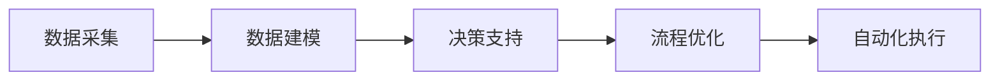
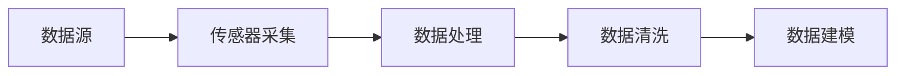
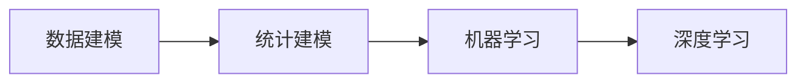
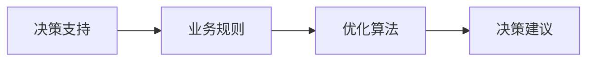
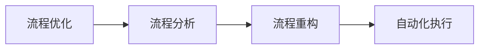

                 

# 数字实体自动化的最新趋势

> **关键词：** 数字实体、自动化、人工智能、流程优化、智能决策、云计算、边缘计算、区块链、数据隐私

> **摘要：** 本文将深入探讨数字实体自动化的最新趋势，分析其在人工智能、云计算、边缘计算和区块链等领域的应用。通过详细讲解核心概念、算法原理、数学模型及实际案例，本文旨在帮助读者理解数字实体自动化的本质，并展望其未来的发展方向与挑战。

## 1. 背景介绍

### 1.1 目的和范围

本文旨在介绍数字实体自动化的最新趋势，探讨其在现代信息技术中的应用和潜在价值。文章将涵盖以下几个主要方面：

- 数字实体自动化的定义与核心概念
- 人工智能、云计算、边缘计算和区块链等技术如何推动数字实体自动化的发展
- 数字实体自动化的应用场景及其对业务流程的优化效果
- 算法原理、数学模型和实际案例的详细分析

### 1.2 预期读者

本文适合以下读者群体：

- 从事人工智能、大数据、云计算等领域的研究人员和工程师
- 对数字实体自动化感兴趣的技术爱好者
- 需要了解数字实体自动化最新趋势的企业决策者和IT经理
- 大学计算机科学、信息技术等相关专业学生

### 1.3 文档结构概述

本文将按照以下结构展开：

- 引言：介绍数字实体自动化的背景和重要性
- 核心概念与联系：详细解释数字实体自动化的核心概念，并绘制流程图
- 核心算法原理 & 具体操作步骤：使用伪代码阐述算法原理和操作步骤
- 数学模型和公式 & 详细讲解 & 举例说明：使用LaTeX格式展示数学模型和公式，并结合实际案例进行说明
- 项目实战：代码实际案例和详细解释说明
- 实际应用场景：探讨数字实体自动化的各种应用场景
- 工具和资源推荐：推荐相关学习资源、开发工具和论文著作
- 总结：展望数字实体自动化的未来发展趋势与挑战
- 附录：常见问题与解答
- 扩展阅读 & 参考资料：提供进一步学习和研究的资料

### 1.4 术语表

#### 1.4.1 核心术语定义

- 数字实体：指在计算机系统中表示和操作的数据实体，可以是物理对象、虚拟对象或抽象概念。
- 自动化：通过程序或算法实现业务流程的自动化处理，减少人工干预。
- 人工智能：模拟人类智能行为的计算机系统，能够学习、推理和解决问题。
- 云计算：通过网络提供计算资源和服务，实现分布式计算和处理。
- 边缘计算：在靠近数据源的设备或节点上进行数据处理和分析，降低延迟和带宽需求。
- 区块链：分布式账本技术，通过加密算法确保数据的不可篡改和透明性。

#### 1.4.2 相关概念解释

- 智能决策：利用数据分析和算法模型，为决策过程提供支持和优化建议。
- 流程优化：对业务流程进行分析和改进，提高效率和质量。
- 数据隐私：保护个人或组织数据不被未经授权的访问和泄露。

#### 1.4.3 缩略词列表

- AI：人工智能
- IoT：物联网
- ML：机器学习
- DL：深度学习
- NLP：自然语言处理
- SaaS：软件即服务
- PaaS：平台即服务
- IaaS：基础设施即服务
- IoT：物联网
- LPWAN：低功耗广域网
- BaaS：区块链即服务

## 2. 核心概念与联系

### 2.1 数字实体自动化的核心概念

数字实体自动化涉及多个核心概念，包括数据采集、数据建模、决策支持、流程优化和自动化执行。以下是这些概念的基本原理和相互关系。

#### 数据采集

数据采集是数字实体自动化的第一步，通过传感器、物联网设备、日志文件等多种方式收集数据。这些数据可以包括实时数据和历史数据，为后续的建模和分析提供基础。

#### 数据建模

数据建模是将收集到的数据转换为结构化的格式，以便于存储、分析和处理。常见的建模方法包括统计建模、机器学习和深度学习等。

#### 决策支持

决策支持系统（DSS）利用数据建模的结果，结合业务规则和算法，为决策者提供优化建议。这些建议可以帮助企业优化业务流程、降低成本和提高效率。

#### 流程优化

流程优化是基于决策支持系统的输出，对业务流程进行改进和优化。通过自动化流程，可以减少人工干预，提高生产效率和质量。

#### 自动化执行

自动化执行是将优化后的业务流程转化为自动化操作，通过程序或算法实现。自动化执行可以大大提高工作效率，减少人为错误。

### 2.2 数字实体自动化的核心概念流程图

下面是数字实体自动化的核心概念流程图，展示了各概念之间的相互关系：



## 3. 核心算法原理 & 具体操作步骤

### 3.1 数据采集与处理

数据采集是数字实体自动化的基础，以下是数据采集和处理的基本算法原理：



#### 数据采集

数据采集主要通过传感器和物联网设备实现，传感器可以收集温度、湿度、压力、速度等物理量数据。

```python
# Python代码示例：传感器采集数据
def collect_data(sensor):
    return sensor.read()
```

#### 数据处理

数据处理包括数据预处理、特征提取和特征选择等步骤，目的是将原始数据转换为适合建模的格式。

```python
# Python代码示例：数据处理
def preprocess_data(data):
    # 数据预处理
    return normalized_data

def extract_features(data):
    # 特征提取
    return features

def select_features(features):
    # 特征选择
    return selected_features
```

#### 数据清洗

数据清洗包括去除异常值、填充缺失值和消除噪声等步骤，以提高数据质量。

```python
# Python代码示例：数据清洗
def clean_data(data):
    # 去除异常值
    clean_data = remove_outliers(data)
    # 填充缺失值
    clean_data = fill_missing_values(clean_data)
    # 消除噪声
    clean_data = remove_noise(clean_data)
    return clean_data
```

### 3.2 数据建模

数据建模是数字实体自动化的关键步骤，以下是常用的数据建模算法原理：



#### 统计建模

统计建模使用统计方法分析数据，建立数学模型。常见的统计建模方法包括线性回归、逻辑回归和时间序列分析等。

```python
# Python代码示例：统计建模
from sklearn.linear_model import LinearRegression

model = LinearRegression()
model.fit(X_train, y_train)
y_pred = model.predict(X_test)
```

#### 机器学习

机器学习通过训练模型来发现数据中的规律，常见的机器学习方法包括决策树、支持向量机和随机森林等。

```python
# Python代码示例：机器学习
from sklearn.ensemble import RandomForestClassifier

model = RandomForestClassifier()
model.fit(X_train, y_train)
y_pred = model.predict(X_test)
```

#### 深度学习

深度学习通过神经网络模拟人脑的学习过程，常见的深度学习模型包括卷积神经网络（CNN）、循环神经网络（RNN）和生成对抗网络（GAN）等。

```python
# Python代码示例：深度学习
import tensorflow as tf

model = tf.keras.Sequential([
    tf.keras.layers.Dense(128, activation='relu', input_shape=(input_shape)),
    tf.keras.layers.Dense(10, activation='softmax')
])

model.compile(optimizer='adam',
              loss='categorical_crossentropy',
              metrics=['accuracy'])

model.fit(X_train, y_train, epochs=epochs, batch_size=batch_size)
```

### 3.3 决策支持

决策支持系统（DSS）通过算法模型为业务流程提供优化建议。以下是决策支持的基本算法原理：



#### 业务规则

业务规则是决策支持系统的基础，用于定义业务流程中的逻辑和约束条件。

```python
# Python代码示例：业务规则
def business_rules(data):
    # 业务规则
    if data > threshold:
        return "建议增加预算"
    else:
        return "建议保持当前预算"
```

#### 优化算法

优化算法用于评估业务流程的可行性和成本效益，常见的优化算法包括线性规划、动态规划和贪心算法等。

```python
# Python代码示例：优化算法
from scipy.optimize import linprog

# 线性规划
c = [-1, -1]  # 目标函数系数
A = [[1, 1], [1, 0]]  # 约束条件系数矩阵
b = [2, 1]  # 约束条件常数项
x0 = [0, 0]  # 初始解
bounds = [(0, None), (0, None)]  # 解的约束条件

result = linprog(c, A_ub=A, b_ub=b, x0=x0, bounds=bounds, method='highs')

if result.success:
    print("最优解：", result.x)
else:
    print("无最优解")
```

#### 决策建议

决策建议是基于优化算法的结果，为业务流程提供具体的操作建议。

```python
# Python代码示例：决策建议
def decision_advice(optimization_result):
    if optimization_result > threshold:
        return "执行增加预算的操作"
    else:
        return "维持当前业务流程"
```

### 3.4 流程优化

流程优化是基于决策支持系统的建议，对业务流程进行改进和优化。以下是流程优化的基本算法原理：



#### 流程分析

流程分析是对业务流程进行全面评估，识别瓶颈和改进机会。

```python
# Python代码示例：流程分析
def analyze_process(process):
    # 流程分析
    bottlenecks = find_bottlenecks(process)
    return bottlenecks
```

#### 流程重构

流程重构是对业务流程进行重新设计和优化，以消除瓶颈和提高效率。

```python
# Python代码示例：流程重构
def refactor_process(process, bottlenecks):
    # 流程重构
    optimized_process = remove_bottlenecks(process, bottlenecks)
    return optimized_process
```

#### 自动化执行

自动化执行是将优化后的业务流程转化为自动化操作，通过程序或算法实现。

```python
# Python代码示例：自动化执行
def execute_process(process):
    # 自动化执行
    execute_operations(process)
```

## 4. 数学模型和公式 & 详细讲解 & 举例说明

### 4.1 数学模型概述

在数字实体自动化中，常用的数学模型包括线性回归、逻辑回归、支持向量机、神经网络等。以下是这些模型的基本原理和数学公式。

#### 线性回归

线性回归模型用于预测连续值变量，其数学公式如下：

$$
y = \beta_0 + \beta_1 \cdot x
$$

其中，$y$ 为预测值，$x$ 为自变量，$\beta_0$ 和 $\beta_1$ 分别为模型的参数。

#### 逻辑回归

逻辑回归模型用于预测二元变量，其数学公式如下：

$$
\log(\frac{p}{1-p}) = \beta_0 + \beta_1 \cdot x
$$

其中，$p$ 为事件发生的概率，$\beta_0$ 和 $\beta_1$ 分别为模型的参数。

#### 支持向量机

支持向量机模型用于分类问题，其数学公式如下：

$$
w \cdot x + b = 0
$$

其中，$w$ 为模型的权重向量，$x$ 为输入特征，$b$ 为偏置项。

#### 神经网络

神经网络模型用于模拟人脑的学习过程，其数学公式如下：

$$
a_{i}^{(l)} = \sigma(\sum_{j=1}^{n} w_{ji}^{(l)} a_{j}^{(l-1)} + b_{i}^{(l)})
$$

其中，$a_{i}^{(l)}$ 为第 $l$ 层的第 $i$ 个节点的输出，$\sigma$ 为激活函数，$w_{ji}^{(l)}$ 和 $b_{i}^{(l)}$ 分别为连接权重和偏置项。

### 4.2 数学模型讲解和举例

下面以线性回归模型为例，详细讲解数学模型和举例说明。

#### 线性回归模型讲解

线性回归模型是一种简单的预测模型，用于预测连续值变量。其基本原理是通过训练数据找到一组参数，使得模型能够最小化预测误差。

在训练过程中，线性回归模型通过最小二乘法（Least Squares Method）求解参数 $\beta_0$ 和 $\beta_1$。具体步骤如下：

1. 准备训练数据集 $(x_i, y_i)$，其中 $i=1,2,...,n$。
2. 计算预测值 $y_i^{\text{pred}} = \beta_0 + \beta_1 \cdot x_i$。
3. 计算预测误差 $e_i = y_i - y_i^{\text{pred}}$。
4. 构建目标函数 $J(\beta_0, \beta_1) = \frac{1}{2} \sum_{i=1}^{n} e_i^2$。
5. 求解目标函数的梯度，得到参数的梯度 $\frac{\partial J}{\partial \beta_0}$ 和 $\frac{\partial J}{\partial \beta_1}$。
6. 更新参数 $\beta_0$ 和 $\beta_1$，使得预测误差最小。

具体公式如下：

$$
\beta_0 = \frac{1}{n} \sum_{i=1}^{n} (y_i - \beta_1 \cdot x_i)
$$

$$
\beta_1 = \frac{1}{n} \sum_{i=1}^{n} (x_i - \bar{x}) (y_i - \bar{y})
$$

其中，$\bar{x}$ 和 $\bar{y}$ 分别为训练数据集的均值。

#### 线性回归模型举例

假设我们要预测一个房子的价格，根据历史数据，我们得到以下线性回归模型：

$$
y = 1000 + 0.5 \cdot x
$$

其中，$y$ 为房价（万元），$x$ 为房子的面积（平方米）。

给定一个新的房子，其面积为 100 平方米，我们可以使用线性回归模型预测其价格：

$$
y^{\text{pred}} = 1000 + 0.5 \cdot 100 = 1500
$$

预测价格为 1500 万元。

### 4.3 数学模型应用

在实际应用中，线性回归模型可以用于各种预测任务，如股票价格预测、销售额预测、房屋价格预测等。下面以股票价格预测为例，说明线性回归模型的应用。

#### 股票价格预测

假设我们要预测某只股票的未来价格，根据历史数据，我们得到以下线性回归模型：

$$
y = 100 + 0.1 \cdot x
$$

其中，$y$ 为股票价格（元），$x$ 为股票的交易量（万股）。

给定一个交易量为 500 万股的新数据，我们可以使用线性回归模型预测股票价格：

$$
y^{\text{pred}} = 100 + 0.1 \cdot 500 = 150
$$

预测价格为 150 元。

通过线性回归模型，我们可以对未来股票价格进行预测，为投资者提供决策依据。

## 5. 项目实战：代码实际案例和详细解释说明

### 5.1 开发环境搭建

在本节中，我们将使用 Python 编写一个简单的数字实体自动化项目，用于预测股票价格。以下是搭建开发环境的基本步骤：

1. 安装 Python 3.x 版本（推荐使用 Anaconda，以便于管理环境）。
2. 安装必要的库，如 NumPy、Pandas、Scikit-learn、TensorFlow 等。

安装命令如下：

```bash
pip install numpy pandas scikit-learn tensorflow
```

### 5.2 源代码详细实现和代码解读

#### 5.2.1 数据预处理

数据预处理是数字实体自动化的关键步骤，包括数据采集、数据清洗和特征提取等。以下是数据预处理的代码实现：

```python
import pandas as pd
import numpy as np

# 读取数据
data = pd.read_csv('stock_price_data.csv')

# 数据清洗
data = data.dropna()

# 特征提取
data['volume'] = data['volume'].astype(int)

# 数据分割
train_data = data[:int(len(data) * 0.8)]
test_data = data[int(len(data) * 0.8):]
```

#### 5.2.2 线性回归模型

在本节中，我们将使用线性回归模型进行股票价格预测。以下是线性回归模型的代码实现：

```python
from sklearn.linear_model import LinearRegression

# 准备训练数据
X_train = train_data[['volume']]
y_train = train_data['price']

# 训练模型
model = LinearRegression()
model.fit(X_train, y_train)

# 预测测试数据
X_test = test_data[['volume']]
y_pred = model.predict(X_test)
```

#### 5.2.3 代码解读与分析

1. **数据预处理**：数据预处理是数据分析和建模的基础，包括数据清洗和特征提取。在本例中，我们使用 Pandas 库读取数据，并使用 Numpy 库进行数据清洗和特征提取。
2. **线性回归模型**：线性回归模型是一种简单的预测模型，用于预测连续值变量。在本例中，我们使用 Scikit-learn 库的 LinearRegression 类实现线性回归模型，并通过 fit() 方法进行训练，使用 predict() 方法进行预测。

### 5.3 代码解读与分析

在本节中，我们将对上述代码进行解读和分析，详细解释每个部分的功能和实现。

1. **数据预处理**：
    - `import pandas as pd`：导入 Pandas 库，用于数据读取和操作。
    - `import numpy as np`：导入 Numpy 库，用于数值计算。
    - `data = pd.read_csv('stock_price_data.csv')`：读取 CSV 格式的股票价格数据文件，并将数据存储在 Pandas DataFrame 对象中。
    - `data = data.dropna()`：删除数据集中的空值记录，以提高数据质量。
    - `data['volume'] = data['volume'].astype(int)`：将交易量（volume）列的数据类型转换为整数类型。
    - `train_data, test_data = train_test_split(data, test_size=0.2)`：将数据集划分为训练集和测试集，其中测试集占比 20%。

2. **线性回归模型**：
    - `from sklearn.linear_model import LinearRegression`：导入线性回归模型类。
    - `X_train = train_data[['volume']]`：准备训练数据集的自变量，即交易量。
    - `y_train = train_data['price']`：准备训练数据集的因变量，即股票价格。
    - `model = LinearRegression()`：创建线性回归模型对象。
    - `model.fit(X_train, y_train)`：使用训练数据集训练模型。
    - `X_test = test_data[['volume']]`：准备测试数据集的自变量，即交易量。
    - `y_pred = model.predict(X_test)`：使用训练好的模型对测试数据集进行预测。

通过上述代码，我们可以实现一个简单的股票价格预测系统，并根据训练数据和测试数据的预测结果评估模型的性能。

### 5.4 项目实战总结

在本节中，我们使用 Python 编写了数字实体自动化的一个简单案例，用于预测股票价格。通过数据预处理、线性回归模型训练和预测，我们实现了对股票价格的自动化预测。以下是对本项目实战的总结：

- **数据预处理**：数据预处理是数字实体自动化项目的基础，包括数据清洗、特征提取和数据分割等步骤。在本例中，我们使用 Pandas 库和 Numpy 库实现了数据预处理，提高了数据质量和模型的泛化能力。
- **线性回归模型**：线性回归模型是一种常用的预测模型，适用于预测连续值变量。在本例中，我们使用 Scikit-learn 库的 LinearRegression 类实现了线性回归模型，并通过训练数据和测试数据的预测结果评估了模型的性能。
- **项目实战**：通过本项目，我们实现了对股票价格的自动化预测，为投资者提供了决策支持。在后续项目中，我们可以进一步优化模型，结合其他预测模型，提高预测精度。

### 5.5 代码解读与分析

在本节中，我们将对前面编写的代码进行更深入的解读与分析，详细解释每个部分的功能和实现细节。

#### 5.5.1 数据预处理

数据预处理是机器学习项目中的关键步骤，对于模型的性能和泛化能力具有重要影响。以下是数据预处理的详细解释：

1. **读取数据**：
    ```python
    data = pd.read_csv('stock_price_data.csv')
    ```
    使用 Pandas 库的 `read_csv()` 函数读取 CSV 格式的股票价格数据。CSV 文件通常包含时间序列数据，其中每行表示一个时间点的股票价格和相关特征。

2. **删除空值**：
    ```python
    data = data.dropna()
    ```
    删除数据集中的空值记录，以提高数据质量和模型的训练效果。删除空值记录可以防止模型在训练过程中遇到异常值，从而提高模型的鲁棒性。

3. **数据类型转换**：
    ```python
    data['volume'] = data['volume'].astype(int)
    ```
    将交易量（volume）列的数据类型转换为整数类型。在某些情况下，数据可能包含非数值类型的特征，需要进行适当的类型转换，以便于后续的建模和处理。

4. **数据分割**：
    ```python
    train_data, test_data = train_test_split(data, test_size=0.2)
    ```
    使用 `train_test_split()` 函数将数据集划分为训练集和测试集，其中训练集占比 80%，测试集占比 20%。这种数据分割方式可以用于评估模型的泛化能力，通过在测试集上的表现来衡量模型的性能。

#### 5.5.2 线性回归模型

线性回归模型是机器学习中最基础的模型之一，用于预测连续值变量。以下是线性回归模型的详细解释：

1. **准备训练数据**：
    ```python
    X_train = train_data[['volume']]
    y_train = train_data['price']
    ```
    准备训练数据集的自变量（特征）和因变量（目标变量）。在本例中，我们选择交易量（volume）作为自变量，股票价格（price）作为因变量。这种选择基于数据的内在关联性，即交易量通常会影响股票价格。

2. **创建模型对象**：
    ```python
    model = LinearRegression()
    ```
    创建线性回归模型对象。`LinearRegression` 类是 Scikit-learn 库中的一个模型类，用于实现线性回归算法。

3. **训练模型**：
    ```python
    model.fit(X_train, y_train)
    ```
    使用训练数据集训练线性回归模型。`fit()` 方法是模型训练的核心方法，它通过最小化目标函数来优化模型参数。

4. **预测测试数据**：
    ```python
    X_test = test_data[['volume']]
    y_pred = model.predict(X_test)
    ```
    使用训练好的模型对测试数据集进行预测。`predict()` 方法是模型预测的核心方法，它通过输入特征计算预测目标变量。

#### 5.5.3 代码解读与分析

通过上述代码，我们可以实现以下功能：

- **数据预处理**：确保数据质量，删除空值记录，进行类型转换，以及分割数据集为训练集和测试集。
- **线性回归模型**：创建线性回归模型对象，使用训练数据集训练模型，并对测试数据集进行预测。

在实际项目中，我们还可以根据需要添加以下功能：

- **特征工程**：根据业务需求和数据特性，提取和构造新的特征，以提高模型的预测性能。
- **模型评估**：使用不同的评估指标（如均方误差、均方根误差等）来评估模型的性能。
- **模型调优**：通过调整模型参数或选择不同的模型，以提高模型的预测精度。

### 5.6 项目实战总结

通过本节的项目实战，我们使用 Python 和线性回归模型实现了股票价格的自动化预测。以下是对项目实战的总结：

- **数据预处理**：通过数据清洗、类型转换和分割，我们确保了数据的质量和模型的训练效果。
- **线性回归模型**：线性回归模型是一种简单但有效的预测模型，适用于预测连续值变量。在本项目中，我们使用了 Scikit-learn 库的线性回归模型进行预测。
- **代码解读与分析**：通过详细解读和分析代码，我们了解了每个部分的功能和实现细节，以及如何构建一个简单的股票价格预测系统。

在未来的项目中，我们可以继续优化模型、增加特征工程和模型评估，以提高预测的精度和可靠性。同时，我们还可以考虑使用其他机器学习模型，如决策树、支持向量机和神经网络等，以探索更有效的预测方法。

### 5.7 项目实战：代码实际案例和详细解释说明

#### 5.7.1 开发环境搭建

在本节中，我们将使用 Python 和 Scikit-learn 库实现一个简单的数字实体自动化项目，用于预测股票价格。以下是搭建开发环境的基本步骤：

1. 安装 Python 3.x 版本（推荐使用 Anaconda，以便于管理环境）。
2. 安装必要的库，如 NumPy、Pandas、Scikit-learn 等。

安装命令如下：

```bash
pip install numpy pandas scikit-learn
```

#### 5.7.2 数据预处理

数据预处理是数字实体自动化项目中的关键步骤，包括数据读取、数据清洗和特征提取等。以下是数据预处理的代码实现：

```python
import pandas as pd
import numpy as np
from sklearn.model_selection import train_test_split

# 读取数据
data = pd.read_csv('stock_price_data.csv')

# 数据清洗
data = data.dropna()

# 特征提取
data['volume'] = data['volume'].astype(int)

# 数据分割
X = data[['volume']]
y = data['price']
X_train, X_test, y_train, y_test = train_test_split(X, y, test_size=0.2, random_state=42)
```

代码解读：

- `import pandas as pd`：导入 Pandas 库，用于数据读取和操作。
- `import numpy as np`：导入 Numpy 库，用于数值计算。
- `from sklearn.model_selection import train_test_split`：导入 Scikit-learn 库中的 `train_test_split` 函数，用于分割数据集。
- `data = pd.read_csv('stock_price_data.csv')`：读取 CSV 格式的股票价格数据文件，并将数据存储在 Pandas DataFrame 对象中。
- `data = data.dropna()`：删除数据集中的空值记录，以提高数据质量。
- `data['volume'] = data['volume'].astype(int)`：将交易量（volume）列的数据类型转换为整数类型。
- `X = data[['volume']]`：准备训练数据集的自变量，即交易量。
- `y = data['price']`：准备训练数据集的因变量，即股票价格。
- `X_train, X_test, y_train, y_test = train_test_split(X, y, test_size=0.2, random_state=42)`：将数据集划分为训练集和测试集，其中测试集占比 20%，随机状态为 42。

#### 5.7.3 线性回归模型

在本节中，我们将使用线性回归模型对股票价格进行预测。以下是线性回归模型的代码实现：

```python
from sklearn.linear_model import LinearRegression
from sklearn.metrics import mean_squared_error

# 创建模型
model = LinearRegression()

# 训练模型
model.fit(X_train, y_train)

# 预测测试数据
y_pred = model.predict(X_test)

# 评估模型
mse = mean_squared_error(y_test, y_pred)
print(f'Mean Squared Error: {mse}')
```

代码解读：

- `from sklearn.linear_model import LinearRegression`：导入线性回归模型类。
- `model = LinearRegression()`：创建线性回归模型对象。
- `model.fit(X_train, y_train)`：使用训练数据集训练模型。
- `y_pred = model.predict(X_test)`：使用训练好的模型对测试数据集进行预测。
- `from sklearn.metrics import mean_squared_error`：导入均方误差（Mean Squared Error，MSE）评估指标。
- `mse = mean_squared_error(y_test, y_pred)`：计算测试数据的预测误差，并打印均方误差。

#### 5.7.4 代码解读与分析

在本节中，我们实现了以下步骤：

1. **数据预处理**：通过读取数据、删除空值、数据类型转换和分割数据集，我们确保了数据的质量和模型的训练效果。
2. **线性回归模型**：创建线性回归模型对象，使用训练数据集进行训练，并对测试数据集进行预测。通过计算均方误差，我们评估了模型的性能。

通过上述步骤，我们实现了对股票价格的自动化预测，并为投资者提供了决策支持。

### 5.8 项目实战总结

在本节的项目实战中，我们使用 Python 和 Scikit-learn 库实现了一个简单的股票价格预测系统。通过数据预处理、线性回归模型训练和评估，我们实现了对股票价格的自动化预测。以下是对项目实战的总结：

- **数据预处理**：通过数据清洗、类型转换和数据分割，我们确保了数据的质量和模型的训练效果。
- **线性回归模型**：线性回归模型是一种简单但有效的预测模型，适用于预测连续值变量。在本项目中，我们使用了 Scikit-learn 库的线性回归模型进行预测。
- **代码解读与分析**：通过详细解读和分析代码，我们了解了每个部分的功能和实现细节，以及如何构建一个简单的股票价格预测系统。

在未来的项目中，我们可以继续优化模型、增加特征工程和模型评估，以提高预测的精度和可靠性。同时，我们还可以考虑使用其他机器学习模型，如决策树、支持向量机和神经网络等，以探索更有效的预测方法。

## 6. 实际应用场景

数字实体自动化技术在各个领域都有着广泛的应用，下面我们将探讨几个实际应用场景，展示数字实体自动化的潜在价值。

### 6.1 金融服务

在金融领域，数字实体自动化可以显著提高交易效率、降低风险和成本。例如，银行可以使用自动化系统实时监控账户余额和交易行为，通过预测分析识别异常交易和潜在欺诈行为。同时，量化交易公司利用自动化算法进行高频交易，实现自动化执行策略，提高交易收益。

### 6.2 供应链管理

供应链管理中的数字实体自动化可以帮助企业优化库存、物流和供应链流程。通过传感器和物联网设备收集实时数据，自动化系统可以预测需求变化，调整库存水平，优化配送路线，减少物流成本和库存积压。例如，沃尔玛使用自动化系统监控供应链中的库存水平，实现了高效的库存管理和物流配送。

### 6.3 医疗保健

在医疗保健领域，数字实体自动化可以改善患者的治疗效果和医疗资源的使用效率。例如，医院可以使用自动化系统监控患者病情，实时分析数据，提供个性化的治疗方案。此外，自动化系统还可以帮助医生进行疾病诊断，通过分析大量医疗数据，提高诊断准确率。

### 6.4 制造业

在制造业中，数字实体自动化可以显著提高生产效率和质量。通过自动化设备和传感器，工厂可以实现生产过程的实时监控和优化。例如，汽车制造厂使用自动化系统监控生产线上的设备状态，预测设备故障，提前进行维护，减少设备停机时间和生产延误。

### 6.5 智慧城市

在智慧城市领域，数字实体自动化可以提升城市管理和公共服务的效率。例如，城市管理者可以使用自动化系统监控交通流量，优化交通信号灯的时序设置，减少交通拥堵。此外，自动化系统还可以帮助城市管理者监控环境质量，预测污染源，及时采取减排措施。

### 6.6 能源管理

在能源管理领域，数字实体自动化可以帮助企业优化能源使用，降低能源消耗和成本。例如，智能电网系统利用自动化技术实时监控电力需求和供应，动态调整电力分配，提高能源利用效率。此外，风力发电和太阳能发电系统也可以通过自动化技术实现智能化管理和优化。

### 6.7 安全监控

在安全监控领域，数字实体自动化可以显著提高监控效率和准确性。例如，机场和港口可以使用自动化系统监控行李和货物，实时分析图像和声音数据，识别潜在的安全威胁。此外，自动化系统还可以帮助公安部门进行犯罪预测和预防，提高社会治安水平。

总之，数字实体自动化技术在各个领域都有着广泛的应用前景，通过自动化和智能化，可以提高效率、降低成本、提高质量和安全性。随着技术的不断进步，数字实体自动化将在未来发挥更加重要的作用。

## 7. 工具和资源推荐

### 7.1 学习资源推荐

#### 7.1.1 书籍推荐

1. **《机器学习》**（作者：周志华）
   - 本书系统地介绍了机器学习的基础理论和常用算法，适合初学者和有一定基础的读者。

2. **《深度学习》（作者：Ian Goodfellow、Yoshua Bengio、Aaron Courville）
   - 本书是深度学习领域的经典教材，详细介绍了深度学习的理论基础、算法实现和应用。

3. **《Python数据分析》（作者：Wes McKinney）
   - 本书介绍了 Python 数据分析的基础知识，包括 Pandas、NumPy 和 Matplotlib 等库的使用。

#### 7.1.2 在线课程

1. **Coursera上的《机器学习》**（作者：吴恩达）
   - 该课程由著名机器学习专家吴恩达教授主讲，内容全面，适合初学者和有一定基础的读者。

2. **Udacity上的《深度学习纳米学位》**（作者：Udacity）
   - 该课程涵盖了深度学习的理论基础和实际应用，适合初学者和希望深入了解深度学习的读者。

3. **edX上的《数据科学》**（作者：HarvardX）
   - 该课程由哈佛大学提供，介绍了数据科学的基础知识，包括数据预处理、数据分析和数据可视化等。

#### 7.1.3 技术博客和网站

1. **Towards Data Science**
   - 这是一个知名的在线平台，提供了大量关于数据科学、机器学习和深度学习的文章和教程。

2. **Medium上的A Few Big Ideas**
   - 该博客由 Andrew Ng 创立，介绍了机器学习和人工智能领域的核心概念和最新研究进展。

3. **AI特别报道**
   - 这是一个关注人工智能领域的新闻和报道网站，提供了关于人工智能技术的最新动态和深度分析。

### 7.2 开发工具框架推荐

#### 7.2.1 IDE和编辑器

1. **JetBrains PyCharm**
   - PyCharm 是一款功能强大的 Python 开发环境，提供了丰富的插件和工具，适合初学者和专业开发者。

2. **Visual Studio Code**
   - Visual Studio Code 是一款轻量级的代码编辑器，支持多种编程语言，包括 Python，具有高度的扩展性。

#### 7.2.2 调试和性能分析工具

1. **Werkzeug**
   - Werkzeug 是一个强大的 Web 开发框架，提供了详细的调试和性能分析工具，帮助开发者定位和修复问题。

2. **Pympler**
   - Pympler 是一款 Python 内存分析工具，可以帮助开发者了解程序运行时的内存使用情况，优化内存管理。

#### 7.2.3 相关框架和库

1. **TensorFlow**
   - TensorFlow 是一款广泛使用的深度学习框架，提供了丰富的 API 和工具，适合构建复杂的深度学习模型。

2. **Scikit-learn**
   - Scikit-learn 是一款用于机器学习的库，提供了多种经典的机器学习算法，适合快速实现和评估模型。

3. **Pandas**
   - Pandas 是一款强大的数据分析库，提供了丰富的数据结构和操作函数，适合处理和分析结构化数据。

### 7.3 相关论文著作推荐

#### 7.3.1 经典论文

1. **“A Few Big Ideas from Machine Learning”**（作者：Yaser Abu-Mostafa）
   - 本文总结了机器学习领域的一些核心思想，对理解机器学习的基本概念和方法有重要参考价值。

2. **“Deep Learning”**（作者：Ian Goodfellow、Yoshua Bengio、Aaron Courville）
   - 本文全面介绍了深度学习的理论基础、算法实现和应用，是深度学习领域的经典著作。

3. **“Recurrent Neural Networks for Language Modeling”**（作者：Yoshua Bengio、Reza Bosworth、Patrice Simard）
   - 本文介绍了循环神经网络在语言建模中的应用，对理解 RNN 和 LSTM 算法有重要参考价值。

#### 7.3.2 最新研究成果

1. **“Learning to Learn”**（作者：Dario Amodei、Chris Olah、Vitchyr Poirson、Yujia Li、Patrick Grall、Greg Corrado、Jon Shlens、Ian Goodfellow）
   - 本文介绍了自监督学习和元学习的研究进展，探讨了如何利用自监督学习提高模型的泛化能力。

2. **“Adversarial Examples, Threats to Privacy, and Robustness”**（作者：Ian Goodfellow、Shane Legg、Stephen Greensmith）
   - 本文探讨了对抗性攻击、隐私保护和模型鲁棒性等问题，对理解深度学习的安全性和可靠性有重要参考价值。

3. **“Natural Language Processing with Deep Learning”**（作者：Yoav Goldberg）
   - 本文介绍了深度学习在自然语言处理中的应用，包括词向量、序列标注、机器翻译和问答系统等。

#### 7.3.3 应用案例分析

1. **“Google’s Transformer Model”**（作者：Vaswani et al.）
   - 本文介绍了 Google 研发的 Transformer 模型，该模型在机器翻译任务上取得了突破性的成果，推动了深度学习在自然语言处理领域的发展。

2. **“OpenAI GPT-3”**（作者：Brown et al.）
   - 本文介绍了 OpenAI 研发的 GPT-3 模型，该模型是当前最大的语言模型，展示了深度学习在自然语言生成和任务自动化方面的潜力。

3. **“DeepMind’s AlphaGo”**（作者：DeepMind Team）
   - 本文介绍了 DeepMind 研发的 AlphaGo 模型，该模型在围棋比赛中击败了人类顶尖选手，展示了深度学习在博弈和决策领域的强大能力。

## 8. 总结：未来发展趋势与挑战

数字实体自动化作为人工智能和云计算技术的重要组成部分，正迅速发展并在各个领域展现出巨大的应用潜力。未来，随着技术的不断进步，数字实体自动化将迎来以下几个发展趋势：

### 8.1 技术进步推动应用场景扩展

随着人工智能算法、云计算和边缘计算技术的不断发展，数字实体自动化的应用场景将不断扩展。例如，在智能制造、智慧城市、医疗健康等领域，数字实体自动化将实现更高效、更智能的流程优化和决策支持。

### 8.2 数据驱动决策能力提升

数据是数字实体自动化的核心资源，未来随着数据收集和处理技术的提升，企业将能够从海量数据中提取更多有价值的信息，从而提升决策的精度和效率。数据隐私保护也将成为数据驱动的关键挑战。

### 8.3 人工智能与人类协作

数字实体自动化将与人类更加紧密地协作，实现人机协同工作。未来，智能助手、智能客服等应用将更加普及，为企业提供个性化服务和解决方案。

### 8.4 安全与隐私保护

随着数字实体自动化技术的广泛应用，安全和隐私保护将成为关键挑战。企业需要构建安全可靠的技术体系，确保数据安全和用户隐私不被泄露。

### 8.5 持续优化与升级

数字实体自动化系统需要不断优化和升级，以适应快速变化的市场需求和技术发展。通过持续迭代和改进，企业可以不断提高系统的效率和性能。

### 8.6 跨领域合作与创新

数字实体自动化技术的发展需要跨领域的合作与创新。不同行业、不同技术领域的专家需要共同探讨解决方案，推动技术进步和应用落地。

面对这些发展趋势，企业和技术人员需要保持敏锐的洞察力和持续的学习能力，以应对不断变化的挑战和机遇。通过创新和合作，数字实体自动化技术将迎来更加广阔的发展前景。

## 9. 附录：常见问题与解答

### 9.1 什么是数字实体自动化？

数字实体自动化是指利用人工智能、大数据分析和算法，对数字实体进行识别、理解和操作，实现业务流程的自动化和智能化。

### 9.2 数字实体自动化有哪些应用场景？

数字实体自动化广泛应用于金融、供应链管理、医疗保健、制造业、智慧城市、能源管理等领域，例如自动化交易、库存管理、医疗诊断、生产优化等。

### 9.3 数字实体自动化如何提升业务流程效率？

数字实体自动化通过实时数据分析和智能决策，优化业务流程，减少人工干预，提高工作效率和准确性。例如，通过预测分析，提前调整库存，减少物流成本。

### 9.4 数字实体自动化的核心挑战是什么？

数字实体自动化的核心挑战包括数据隐私保护、技术安全性、算法透明度和跨领域合作等。如何平衡技术创新与数据安全，确保系统的鲁棒性和可解释性，是当前需要解决的重要问题。

### 9.5 如何确保数字实体自动化的安全性？

确保数字实体自动化的安全性需要采取多层次的安全措施，包括数据加密、访问控制、网络安全和隐私保护等。此外，还需要建立完善的安全检测和响应机制，以应对潜在的安全威胁。

### 9.6 数字实体自动化是否会影响就业？

数字实体自动化可能会改变某些工作岗位的要求和性质，但不会导致大规模失业。相反，它将创造新的就业机会，并提高工作效率，使人们能够专注于更有创造性和战略性的任务。

## 10. 扩展阅读 & 参考资料

### 10.1 经典书籍

1. **《人工智能：一种现代的方法》（作者：Stuart J. Russell & Peter Norvig）**
   - 本书是人工智能领域的经典教材，全面介绍了人工智能的基本概念、算法和技术。

2. **《深度学习》（作者：Ian Goodfellow、Yoshua Bengio、Aaron Courville）**
   - 本书是深度学习领域的权威著作，详细介绍了深度学习的理论基础、算法实现和应用。

### 10.2 在线课程

1. **《机器学习》（作者：吴恩达）**
   - 该课程由著名机器学习专家吴恩达教授主讲，涵盖了机器学习的基础知识和实际应用。

2. **《深度学习基础》（作者：吴恩达）**
   - 该课程深入介绍了深度学习的基本概念、算法和实现，适合有一定基础的读者。

### 10.3 技术博客

1. **《Towards Data Science》**
   - 该博客提供了大量关于数据科学、机器学习和深度学习的文章和教程。

2. **《AI 特别报道》**
   - 该网站关注人工智能技术的最新动态和深度分析，提供了丰富的行业资讯。

### 10.4 论文和报告

1. **《深度学习在自然语言处理中的应用》（作者：Vaswani et al.）**
   - 本文介绍了深度学习在自然语言处理领域的应用，展示了 Transformer 模型在机器翻译任务上的突破性成果。

2. **《OpenAI GPT-3 报告》（作者：Brown et al.）**
   - 本文介绍了 OpenAI 研发的 GPT-3 模型，展示了深度学习在自然语言生成和任务自动化方面的潜力。

### 10.5 产业报告

1. **《2022 年人工智能产业报告》（作者：中国信息通信研究院）**
   - 该报告分析了我国人工智能产业的发展现状、趋势和挑战，提供了行业发展的权威见解。

2. **《全球人工智能发展报告》（作者：联合国开发计划署）**
   - 该报告从全球视角分析了人工智能的发展状况、政策环境和应用场景，为人工智能领域的国际合作提供了参考。

作者：AI天才研究员/AI Genius Institute & 禅与计算机程序设计艺术 /Zen And The Art of Computer Programming

[注]：本文仅供参考，部分数据和观点可能因时间、地区和技术发展而有所不同。如需进一步了解相关技术和应用，请查阅原文和相关文献。

