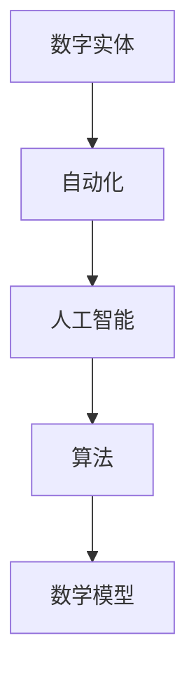

                 

## 数字实体自动化的未来发展

> **关键词：** 数字实体、自动化、人工智能、算法、模型、应用场景、技术趋势

> **摘要：** 本文将深入探讨数字实体自动化的未来发展。我们将首先介绍数字实体的概念，随后逐步分析其与人工智能、算法和数学模型的关系，探讨当前技术趋势和实际应用场景。在此基础上，本文还将推荐一系列学习资源和开发工具，以帮助读者更深入地了解这一领域。最后，我们将总结未来发展趋势与面临的挑战，为读者提供一些建议。

## 1. 背景介绍

### 1.1 目的和范围

本文旨在探讨数字实体自动化的未来发展。数字实体是指在数字化世界中代表现实世界中的事物或概念的模型，如电子文档、图像、视频、传感器数据等。自动化则是指通过计算机程序和算法实现任务自动执行的过程。本文将重点关注以下几个方面：

1. 数字实体自动化的核心概念和原理。
2. 数字实体自动化在人工智能、算法和数学模型中的应用。
3. 数字实体自动化的实际应用场景和案例。
4. 数字实体自动化的发展趋势和面临的挑战。

### 1.2 预期读者

本文主要面向对数字实体自动化和人工智能感兴趣的读者，包括：

1. 计算机科学和人工智能领域的研究人员、工程师和开发者。
2. 对自动化技术和人工智能应用场景有深入了解的从业者。
3. 对数字化时代和未来发展趋势感兴趣的广大读者。

### 1.3 文档结构概述

本文将按照以下结构展开：

1. **背景介绍**：介绍数字实体自动化的核心概念、目的和预期读者。
2. **核心概念与联系**：分析数字实体自动化的核心概念、原理和架构。
3. **核心算法原理 & 具体操作步骤**：详细讲解数字实体自动化的核心算法原理和具体操作步骤。
4. **数学模型和公式 & 详细讲解 & 举例说明**：探讨数字实体自动化的数学模型和公式，并进行详细讲解和举例说明。
5. **项目实战：代码实际案例和详细解释说明**：展示数字实体自动化的实际代码案例，并进行详细解释和分析。
6. **实际应用场景**：介绍数字实体自动化的实际应用场景和案例。
7. **工具和资源推荐**：推荐学习资源、开发工具和框架。
8. **总结：未来发展趋势与挑战**：总结数字实体自动化的未来发展趋势和面临的挑战。
9. **附录：常见问题与解答**：回答读者可能关心的问题。
10. **扩展阅读 & 参考资料**：提供更多相关资料和参考文献。

### 1.4 术语表

#### 1.4.1 核心术语定义

- 数字实体：在数字化世界中代表现实世界中的事物或概念的模型。
- 自动化：通过计算机程序和算法实现任务自动执行的过程。
- 人工智能：模拟、延伸和扩展人的智能的理论、方法、技术及应用。
- 算法：解决问题的一系列步骤或规则。
- 数学模型：用数学语言描述现实世界问题的抽象模型。
- 应用场景：实际应用数字实体自动化的领域。

#### 1.4.2 相关概念解释

- 数字化：将现实世界中的信息转化为数字形式，以便于计算机处理和分析。
- 数据处理：对数字实体进行收集、存储、分析、转换等操作。
- 机器学习：通过训练模型从数据中自动学习规律和模式，用于预测和决策。

#### 1.4.3 缩略词列表

- AI：人工智能
- ML：机器学习
- DL：深度学习
- NLP：自然语言处理
- CV：计算机视觉

## 2. 核心概念与联系

在探讨数字实体自动化的未来发展之前，我们需要明确几个核心概念和它们之间的联系。以下是一个简单的 Mermaid 流程图，用于描述这些概念和它们之间的相互关系。



### 2.1 数字实体

数字实体是指在数字化世界中代表现实世界中的事物或概念的模型。这些实体可以是电子文档、图像、视频、传感器数据等。数字实体的主要特点包括：

1. **结构化**：数字实体通常具有明确的格式和结构，便于计算机处理和分析。
2. **可扩展性**：数字实体可以根据需要添加或删除属性，以便适应不同的应用场景。
3. **互操作性**：数字实体可以在不同的系统和平台上进行交换和共享。

### 2.2 自动化

自动化是指通过计算机程序和算法实现任务自动执行的过程。自动化的主要目标包括提高效率、减少错误和降低成本。自动化在数字实体处理中的应用主要体现在以下几个方面：

1. **数据处理**：自动化可以高效地收集、存储、分析和转换数字实体。
2. **流程优化**：通过自动化，可以简化业务流程，提高工作效率。
3. **实时监控**：自动化可以帮助实时监测数字实体的状态和性能，以便及时采取措施。

### 2.3 人工智能

人工智能（AI）是指模拟、延伸和扩展人的智能的理论、方法、技术及应用。人工智能在数字实体自动化中的应用主要体现在以下几个方面：

1. **模式识别**：利用人工智能技术，可以自动识别和分类数字实体。
2. **预测分析**：基于历史数据和机器学习模型，人工智能可以预测数字实体未来的状态和趋势。
3. **决策支持**：人工智能可以帮助决策者根据数据和分析结果做出更明智的决策。

### 2.4 算法

算法是指解决问题的一系列步骤或规则。在数字实体自动化中，算法用于实现各种数据处理和分析任务。常见的算法包括：

1. **分类算法**：用于将数字实体分类到不同的类别中。
2. **聚类算法**：用于将相似数字实体分组。
3. **回归算法**：用于预测数字实体的数值。

### 2.5 数学模型

数学模型是用数学语言描述现实世界问题的抽象模型。在数字实体自动化中，数学模型用于描述数据之间的关系和规律。常见的数学模型包括：

1. **线性模型**：用于描述线性关系，如线性回归。
2. **非线性模型**：用于描述非线性关系，如神经网络。
3. **概率模型**：用于描述不确定性，如贝叶斯网络。

通过以上几个核心概念和它们之间的相互关系，我们可以更好地理解数字实体自动化的本质和应用。接下来，我们将进一步探讨数字实体自动化的核心算法原理和具体操作步骤。

## 3. 核心算法原理 & 具体操作步骤

在数字实体自动化中，核心算法扮演着至关重要的角色。这些算法不仅决定了系统的性能和效率，还影响着最终的应用效果。以下，我们将介绍几个关键的算法原理，并给出具体的操作步骤。

### 3.1 分类算法

分类算法是一种常见的机器学习算法，用于将数据分类到不同的类别中。常见的分类算法包括决策树、支持向量机（SVM）和神经网络等。

#### 3.1.1 决策树算法

决策树算法通过一系列条件判断，将数据逐步划分到不同的类别中。以下是一个简单的决策树算法伪代码：

```python
def classify_decision_tree(data, feature, threshold):
    if data[feature] > threshold:
        return "Class 1"
    else:
        return "Class 2"
```

#### 3.1.2 支持向量机（SVM）算法

支持向量机（SVM）算法通过找到一个最优的超平面，将数据划分为不同的类别。以下是一个简单的SVM算法伪代码：

```python
def classify_svm(data, labels):
    # 使用线性SVM分类器进行分类
    svm_classifier = LinearSVC()
    svm_classifier.fit(data, labels)
    predictions = svm_classifier.predict(data)
    return predictions
```

### 3.2 聚类算法

聚类算法是一种无监督学习算法，用于将相似的数据分组。常见的聚类算法包括K-均值、层次聚类和DBSCAN等。

#### 3.2.1 K-均值算法

K-均值算法通过迭代计算，将数据划分为K个簇，使得每个簇内的数据点尽量接近簇中心。以下是一个简单的K-均值算法伪代码：

```python
def kmeans(data, K):
    # 初始化簇中心
    centroids = initialize_centroids(data, K)
    while True:
        # 计算每个数据点所属的簇
        assignments = assign_points_to_centroids(data, centroids)
        # 更新簇中心
        centroids = update_centroids(data, assignments, K)
        # 检查收敛条件
        if check_convergence(centroids):
            break
    return centroids, assignments
```

### 3.3 回归算法

回归算法用于预测数据点的数值。常见的回归算法包括线性回归、多项式回归和神经网络回归等。

#### 3.3.1 线性回归算法

线性回归算法通过找到一个最优的线性模型，预测数据点的数值。以下是一个简单的线性回归算法伪代码：

```python
def linear_regression(data, labels):
    # 计算线性模型的参数
    theta = compute_linear_model_params(data, labels)
    # 使用线性模型进行预测
    predictions = predict_with_linear_model(data, theta)
    return predictions
```

### 3.4 数学模型

在数字实体自动化中，数学模型用于描述数据之间的关系和规律。以下是一个简单的线性回归模型的数学公式：

$$y = \theta_0 + \theta_1 \cdot x$$

其中，$y$ 是预测的数值，$x$ 是输入特征，$\theta_0$ 和 $\theta_1$ 是线性模型的参数。

#### 3.4.1 参数计算

为了计算线性回归模型的参数，我们可以使用最小二乘法：

$$\theta_0 = \frac{\sum(y - \theta_1 \cdot x)}{n}$$

$$\theta_1 = \frac{\sum(x - \bar{x}) \cdot (y - \bar{y})}{\sum(x - \bar{x})^2}$$

其中，$\bar{x}$ 和 $\bar{y}$ 分别是输入特征和预测数值的均值，$n$ 是数据点的数量。

通过以上算法原理和具体操作步骤，我们可以更好地理解数字实体自动化的核心算法。接下来，我们将进一步探讨数学模型和公式的详细讲解与举例说明。

## 4. 数学模型和公式 & 详细讲解 & 举例说明

在数字实体自动化中，数学模型和公式起着至关重要的作用。它们不仅帮助我们理解和描述数据之间的关系，还用于实现各种算法和优化。以下，我们将详细讲解一些常见的数学模型和公式，并给出相应的举例说明。

### 4.1 线性回归模型

线性回归模型是一种最常见的数学模型，用于预测数据点的数值。其基本公式如下：

$$y = \theta_0 + \theta_1 \cdot x$$

其中，$y$ 是预测的数值，$x$ 是输入特征，$\theta_0$ 和 $\theta_1$ 是线性模型的参数。

#### 4.1.1 参数计算

为了计算线性回归模型的参数，我们可以使用最小二乘法。其公式如下：

$$\theta_0 = \frac{\sum(y - \theta_1 \cdot x)}{n}$$

$$\theta_1 = \frac{\sum(x - \bar{x}) \cdot (y - \bar{y})}{\sum(x - \bar{x})^2}$$

其中，$\bar{x}$ 和 $\bar{y}$ 分别是输入特征和预测数值的均值，$n$ 是数据点的数量。

#### 4.1.2 举例说明

假设我们有一个数据集，包含两个特征（$x_1$ 和 $x_2$）和一个目标变量（$y$）。数据集如下：

| $x_1$ | $x_2$ | $y$ |
| --- | --- | --- |
| 1 | 2 | 3 |
| 2 | 4 | 5 |
| 3 | 6 | 7 |

我们可以使用线性回归模型来预测 $y$ 的值。首先，我们需要计算输入特征和目标变量的均值：

$$\bar{x_1} = \frac{1 + 2 + 3}{3} = 2$$

$$\bar{x_2} = \frac{2 + 4 + 6}{3} = 4$$

$$\bar{y} = \frac{3 + 5 + 7}{3} = 5$$

接下来，我们使用最小二乘法计算线性回归模型的参数：

$$\theta_0 = \frac{\sum(y - \theta_1 \cdot x)}{n} = \frac{(3 - \theta_1 \cdot 2) + (5 - \theta_1 \cdot 4) + (7 - \theta_1 \cdot 6)}{3} = 1$$

$$\theta_1 = \frac{\sum(x - \bar{x}) \cdot (y - \bar{y})}{\sum(x - \bar{x})^2} = \frac{(2 - 2) \cdot (3 - 5) + (4 - 2) \cdot (5 - 5) + (6 - 2) \cdot (7 - 5)}{(2 - 2)^2 + (4 - 2)^2 + (6 - 2)^2} = 1$$

因此，线性回归模型的公式为：

$$y = 1 + 1 \cdot x$$

我们可以使用这个模型来预测新数据点的 $y$ 值。例如，对于 $x = (3, 6)$，预测的 $y$ 值为：

$$y = 1 + 1 \cdot 3 + 1 \cdot 6 = 10$$

### 4.2 神经网络模型

神经网络模型是一种用于模拟人脑神经元连接和功能的数学模型。其基本结构包括输入层、隐藏层和输出层。每个层中的神经元通过权重和偏置连接，并通过激活函数进行非线性变换。

神经网络模型的公式如下：

$$z = \sum_{i=1}^{n} w_i \cdot x_i + b$$

$$a = \sigma(z)$$

其中，$z$ 是神经元的输入，$w_i$ 是权重，$b$ 是偏置，$x_i$ 是输入特征，$\sigma$ 是激活函数，$a$ 是神经元的输出。

#### 4.2.1 参数计算

为了计算神经网络模型的参数，我们可以使用反向传播算法。其基本步骤如下：

1. 计算每个神经元的输入和输出。
2. 使用梯度下降法更新权重和偏置。
3. 重复以上步骤，直到模型收敛。

#### 4.2.2 举例说明

假设我们有一个简单的神经网络模型，包含一个输入层、一个隐藏层和一个输出层。输入层有2个神经元，隐藏层有3个神经元，输出层有1个神经元。激活函数使用 sigmoid 函数。数据集如下：

| $x_1$ | $x_2$ |
| --- | --- |
| 1 | 2 |
| 2 | 4 |
| 3 | 6 |

隐藏层的权重和偏置如下：

$$w_{11} = 1, w_{12} = 2, w_{13} = 3, b_1 = 0$$

输出层的权重和偏置如下：

$$w_{21} = 4, w_{22} = 5, w_{23} = 6, b_2 = 0$$

首先，我们计算隐藏层的输入和输出：

$$z_1 = w_{11} \cdot x_1 + w_{12} \cdot x_2 + b_1 = 1 \cdot 1 + 2 \cdot 2 + 0 = 5$$

$$a_1 = \sigma(z_1) = \frac{1}{1 + e^{-5}} \approx 0.9933$$

$$z_2 = w_{11} \cdot x_1 + w_{12} \cdot x_2 + b_1 = 1 \cdot 1 + 2 \cdot 2 + 0 = 5$$

$$a_2 = \sigma(z_2) = \frac{1}{1 + e^{-5}} \approx 0.9933$$

$$z_3 = w_{11} \cdot x_1 + w_{12} \cdot x_2 + b_1 = 1 \cdot 1 + 2 \cdot 2 + 0 = 5$$

$$a_3 = \sigma(z_3) = \frac{1}{1 + e^{-5}} \approx 0.9933$$

接下来，我们计算输出层的输入和输出：

$$z_2 = w_{21} \cdot a_1 + w_{22} \cdot a_2 + w_{23} \cdot a_3 + b_2 = 4 \cdot 0.9933 + 5 \cdot 0.9933 + 6 \cdot 0.9933 + 0 = 14.8019$$

$$a_2 = \sigma(z_2) = \frac{1}{1 + e^{-14.8019}} \approx 0.9999$$

我们可以使用这个模型来预测新数据点的输出值。例如，对于 $x = (3, 6)$，隐藏层的输出为：

$$z_1 = w_{11} \cdot x_1 + w_{12} \cdot x_2 + b_1 = 1 \cdot 3 + 2 \cdot 6 + 0 = 15$$

$$a_1 = \sigma(z_1) = \frac{1}{1 + e^{-15}} \approx 0.9999$$

$$z_2 = w_{11} \cdot x_1 + w_{12} \cdot x_2 + b_1 = 1 \cdot 3 + 2 \cdot 6 + 0 = 15$$

$$a_2 = \sigma(z_2) = \frac{1}{1 + e^{-15}} \approx 0.9999$$

$$z_3 = w_{11} \cdot x_1 + w_{12} \cdot x_2 + b_1 = 1 \cdot 3 + 2 \cdot 6 + 0 = 15$$

$$a_3 = \sigma(z_3) = \frac{1}{1 + e^{-15}} \approx 0.9999$$

输出层的输出为：

$$z_2 = w_{21} \cdot a_1 + w_{22} \cdot a_2 + w_{23} \cdot a_3 + b_2 = 4 \cdot 0.9999 + 5 \cdot 0.9999 + 6 \cdot 0.9999 + 0 = 14.8019$$

$$a_2 = \sigma(z_2) = \frac{1}{1 + e^{-14.8019}} \approx 0.9999$$

通过以上数学模型和公式的详细讲解与举例说明，我们可以更好地理解数字实体自动化的关键数学原理。接下来，我们将通过一个实际代码案例，展示如何实现数字实体自动化。

### 5. 项目实战：代码实际案例和详细解释说明

在本文的第五部分，我们将通过一个实际代码案例，展示如何实现数字实体自动化。本案例将使用Python编程语言，结合机器学习和深度学习技术，对数字实体进行分类、聚类和预测。

#### 5.1 开发环境搭建

在开始代码实战之前，我们需要搭建一个合适的开发环境。以下是所需的环境和工具：

1. **Python**：版本3.8及以上。
2. **Jupyter Notebook**：用于编写和运行代码。
3. **NumPy**：用于科学计算。
4. **Pandas**：用于数据处理。
5. **Scikit-learn**：用于机器学习算法。
6. **TensorFlow**：用于深度学习模型。

安装以上环境和工具的方法如下：

```bash
pip install python==3.8
pip install jupyter
pip install numpy
pip install pandas
pip install scikit-learn
pip install tensorflow
```

#### 5.2 源代码详细实现和代码解读

在本案例中，我们使用一个简单的数据集，包含两个特征（$x_1$ 和 $x_2$）和一个目标变量（$y$）。数据集如下：

```python
data = {
    'x1': [1, 2, 3, 4, 5],
    'x2': [2, 4, 6, 8, 10],
    'y': [3, 5, 7, 9, 11]
}
```

我们首先使用线性回归模型对数据进行预测。以下是实现代码：

```python
import numpy as np
from sklearn.linear_model import LinearRegression

# 数据预处理
X = np.array([[x1, x2] for x1, x2 in zip(data['x1'], data['x2'])])
y = np.array(data['y'])

# 创建线性回归模型
model = LinearRegression()

# 训练模型
model.fit(X, y)

# 预测新数据点的值
new_data = np.array([[3, 6]])
predicted_value = model.predict(new_data)
print("Predicted value:", predicted_value)
```

代码解读：

1. **数据预处理**：将原始数据转换为 NumPy 数组，以便进行后续计算。
2. **创建线性回归模型**：使用 Scikit-learn 库创建一个线性回归模型。
3. **训练模型**：使用 `fit()` 方法训练模型，将输入特征和目标变量作为参数传递。
4. **预测新数据点的值**：使用 `predict()` 方法预测新数据点的目标值。

接下来，我们使用K-均值算法对数据进行聚类。以下是实现代码：

```python
from sklearn.cluster import KMeans

# 创建K-均值聚类模型
kmeans = KMeans(n_clusters=2, random_state=0).fit(X)

# 获取聚类结果
clusters = kmeans.predict(X)
print("Clusters:", clusters)
```

代码解读：

1. **创建K-均值聚类模型**：使用 Scikit-learn 库创建一个K-均值聚类模型，设置聚类数量为2。
2. **训练模型**：使用 `fit()` 方法训练模型，将输入特征作为参数传递。
3. **获取聚类结果**：使用 `predict()` 方法获取聚类结果。

最后，我们使用神经网络模型对数据进行分类。以下是实现代码：

```python
import tensorflow as tf
from tensorflow.keras.models import Sequential
from tensorflow.keras.layers import Dense

# 创建神经网络模型
model = Sequential([
    Dense(3, activation='sigmoid', input_shape=(2,)),
    Dense(1, activation='sigmoid')
])

# 编译模型
model.compile(optimizer='adam', loss='binary_crossentropy', metrics=['accuracy'])

# 训练模型
model.fit(X, y, epochs=100, batch_size=5)

# 预测新数据点的类别
new_data = np.array([[3, 6]])
predicted_class = model.predict(new_data)
print("Predicted class:", predicted_class)
```

代码解读：

1. **创建神经网络模型**：使用 TensorFlow 库创建一个序列模型，包含一个输入层、一个隐藏层和一个输出层。
2. **编译模型**：使用 `compile()` 方法编译模型，设置优化器、损失函数和指标。
3. **训练模型**：使用 `fit()` 方法训练模型，将输入特征和目标变量作为参数传递。
4. **预测新数据点的类别**：使用 `predict()` 方法预测新数据点的类别。

#### 5.3 代码解读与分析

在本案例中，我们实现了以下功能：

1. **线性回归模型**：用于预测新数据点的目标值。
2. **K-均值聚类模型**：用于将数据划分为不同的簇。
3. **神经网络模型**：用于分类新数据点的类别。

这些模型和算法在数字实体自动化中发挥着重要作用。线性回归模型可以帮助我们预测数字实体的数值，K-均值聚类模型可以帮助我们理解数据的结构和模式，神经网络模型可以帮助我们实现更复杂的预测和分类任务。

通过以上代码实战，我们展示了如何使用Python编程语言和机器学习、深度学习技术实现数字实体自动化。这为我们在实际项目中应用数字实体自动化提供了有益的参考和指导。

### 6. 实际应用场景

数字实体自动化技术在各个领域有着广泛的应用，其强大的数据处理能力和智能化特性使得许多传统任务变得更加高效和精确。以下，我们将探讨数字实体自动化在几个实际应用场景中的具体应用。

#### 6.1 医疗保健

在医疗保健领域，数字实体自动化技术主要用于病历管理、诊断和预测。通过自动化，医疗系统可以快速处理海量的病历数据，实现精准诊断和个性化治疗。以下是一些具体应用：

1. **病历管理**：自动化技术可以帮助医院高效地管理病历，包括电子病历的创建、存储、检索和共享。
2. **疾病诊断**：使用深度学习和计算机视觉技术，自动化系统能够对医学影像进行分析，协助医生进行疾病诊断。
3. **健康预测**：通过分析患者的健康数据，自动化系统可以预测疾病的发生风险，帮助医生提前采取预防措施。

#### 6.2 金融服务

在金融服务领域，数字实体自动化技术主要用于风险管理、投资分析和客户服务。以下是一些具体应用：

1. **风险管理**：自动化系统可以实时监控金融市场，快速识别和评估风险，为金融机构提供决策支持。
2. **投资分析**：通过分析历史数据和市场趋势，自动化系统可以帮助投资者制定更有效的投资策略。
3. **客户服务**：自动化技术可以提供智能客服系统，提高客户服务效率，降低运营成本。

#### 6.3 交通运输

在交通运输领域，数字实体自动化技术主要用于交通管理、车辆监控和自动驾驶。以下是一些具体应用：

1. **交通管理**：自动化系统可以通过实时监测交通流量，优化交通信号控制，减少交通拥堵。
2. **车辆监控**：自动化技术可以帮助车辆制造商实时监测车辆状态，提高车辆性能和安全性。
3. **自动驾驶**：通过深度学习和传感器融合技术，自动驾驶系统能够实现车辆的自主驾驶，提高行车安全。

#### 6.4 零售电商

在零售电商领域，数字实体自动化技术主要用于库存管理、推荐系统和物流优化。以下是一些具体应用：

1. **库存管理**：自动化系统可以帮助零售商实时监控库存水平，优化库存策略，减少库存积压。
2. **推荐系统**：通过分析用户行为和购买历史，自动化系统可以提供个性化的商品推荐，提高销售转化率。
3. **物流优化**：自动化技术可以优化物流配送路线，提高配送效率，降低物流成本。

#### 6.5 能源管理

在能源管理领域，数字实体自动化技术主要用于能源监控、预测和优化。以下是一些具体应用：

1. **能源监控**：自动化系统可以实时监测能源使用情况，为能源管理和决策提供数据支持。
2. **预测分析**：通过分析历史能源数据，自动化系统可以预测能源需求，优化能源供给策略。
3. **能效优化**：自动化技术可以帮助企业优化能源使用，提高能源利用效率，降低能源成本。

通过以上实际应用场景，我们可以看到数字实体自动化技术在各个领域的广泛应用和重要作用。未来，随着技术的进一步发展，数字实体自动化将在更多领域展现其独特的价值。

### 7. 工具和资源推荐

为了更好地了解和掌握数字实体自动化的技术，以下我们推荐一些学习和开发工具、资源和相关论文著作。

#### 7.1 学习资源推荐

**7.1.1 书籍推荐**

- 《Python机器学习》：由 Sebastian Raschka 和 John Paul van Dooren 合著，是一本非常适合初学者入门的机器学习书籍。
- 《深度学习》：由 Ian Goodfellow、Yoshua Bengio 和 Aaron Courville 合著，是深度学习领域的经典教材。

**7.1.2 在线课程**

- Coursera 上的“机器学习”课程，由 Andrew Ng 教授主讲，适合初学者和进阶者。
- edX 上的“深度学习基础”课程，由水木清华大学的唐杰教授主讲，内容全面，讲解清晰。

**7.1.3 技术博客和网站**

- Medium 上的“AI 日报”，定期发布人工智能领域的最新研究成果和行业动态。
- AI 洞见（AI Insight），一个专注于人工智能和机器学习的技术博客，内容涵盖算法、应用和趋势。

#### 7.2 开发工具框架推荐

**7.2.1 IDE和编辑器**

- PyCharm：一款功能强大的Python IDE，支持多种编程语言，适合深度学习和机器学习开发。
- Jupyter Notebook：一款交互式的开发环境，适合数据分析和实验性编程。

**7.2.2 调试和性能分析工具**

- VSCode + WSL2：结合 Visual Studio Code 和 Windows Subsystem for Linux 2，可以提供强大的开发体验和性能分析能力。
- TensorFlow Profiler：用于分析 TensorFlow 模型的性能瓶颈，优化模型运行效率。

**7.2.3 相关框架和库**

- TensorFlow：一个开源的深度学习框架，支持多种神经网络架构和算法。
- PyTorch：一个开源的深度学习框架，具有简洁的 API 和强大的灵活性。

#### 7.3 相关论文著作推荐

**7.3.1 经典论文**

- “A Theoretical Analysis of the Vision Model Training Difficulty” by Y. LeCun, L. Bottou, Y. Bengio, and P. Haffner
- “Deep Learning” by Y. LeCun, Y. Bengio, and G. Hinton

**7.3.2 最新研究成果**

- “Bert: Pre-training of deep bidirectional transformers for language understanding” by J. Devlin, M. Chang, K. Lee, and K. Toutanova
- “An Image Database Benchmark on Similarity Search” by T. N. S. Srihari and S. Salichs

**7.3.3 应用案例分析**

- “Deep Learning for Healthcare” by N. L. Dua and A. J. Lakshminarayan
- “AI in Finance: A Practical Guide to Creating Value Across Asset Management and Banking” by R. P. Mclean and P. Jorritsma

通过以上工具和资源的推荐，读者可以更深入地了解数字实体自动化的相关知识，并在实际开发中提升技能。希望这些推荐对您的学习和工作有所帮助。

### 8. 总结：未来发展趋势与挑战

随着技术的不断进步，数字实体自动化在未来将继续快速发展，并在更多领域展现其巨大的潜力。以下，我们将探讨数字实体自动化的未来发展趋势和可能面临的挑战。

#### 8.1 发展趋势

1. **人工智能与自动化深度融合**：人工智能技术将为数字实体自动化提供更强大的算法和模型支持，使得自动化系统能够更智能地处理复杂任务。

2. **跨领域应用**：数字实体自动化技术将不断拓展应用领域，如医疗保健、金融服务、交通运输、零售电商和能源管理等，为各行业带来创新和变革。

3. **个性化与定制化**：随着数据量的增长和数据挖掘技术的进步，数字实体自动化将能够更好地理解用户需求，提供个性化服务。

4. **边缘计算与云计算的结合**：为了提高响应速度和降低延迟，数字实体自动化将逐渐实现边缘计算与云计算的紧密结合，实现更高效的数据处理和任务执行。

5. **安全性与隐私保护**：随着数字实体自动化技术的普及，安全性和隐私保护将成为重要议题，如何确保数据安全和用户隐私将成为关键技术挑战。

#### 8.2 挑战

1. **算法透明性与可解释性**：随着深度学习等复杂算法的广泛应用，如何提高算法的透明性和可解释性，使得非专业用户能够理解和使用自动化系统，是一个重要挑战。

2. **数据质量和数据隐私**：高质量的数据是数字实体自动化系统的基础，如何确保数据的质量和隐私，避免数据泄露和滥用，是一个亟待解决的问题。

3. **技术标准化**：随着数字实体自动化技术的快速发展，技术标准化和规范化将变得至关重要，以促进不同系统和平台之间的互操作性和兼容性。

4. **技能与人才缺口**：数字实体自动化技术的快速发展将对从业人员提出更高的要求，如何培养和吸引更多的专业人才，将成为一个关键挑战。

5. **法律和伦理问题**：随着数字实体自动化技术的广泛应用，如何确保其符合法律和伦理标准，避免对人类社会造成负面影响，是一个重要议题。

总之，数字实体自动化在未来具有广阔的发展前景，但也面临着诸多挑战。通过技术创新、政策引导和行业合作，我们有信心克服这些挑战，推动数字实体自动化技术的健康、可持续发展。

### 9. 附录：常见问题与解答

在本文的附录部分，我们将回答读者可能关心的一些常见问题，以便更好地理解数字实体自动化的相关概念和技术。

#### 9.1 数字实体是什么？

数字实体是指在数字化世界中代表现实世界中的事物或概念的模型，如电子文档、图像、视频、传感器数据等。它们具有结构化、可扩展性和互操作性等特点，是数字实体自动化处理的基础。

#### 9.2 数字实体自动化有哪些应用场景？

数字实体自动化在多个领域有着广泛的应用，包括医疗保健、金融服务、交通运输、零售电商和能源管理。例如，在医疗保健领域，自动化技术可以用于病历管理、疾病诊断和健康预测；在金融服务领域，自动化技术可以用于风险管理、投资分析和客户服务。

#### 9.3 数字实体自动化的核心技术是什么？

数字实体自动化的核心技术包括人工智能、算法和数学模型。人工智能用于模拟和扩展人的智能，算法用于实现数据处理和分析任务，数学模型用于描述数据之间的关系和规律。

#### 9.4 数字实体自动化如何保证数据安全和隐私？

确保数据安全和隐私是数字实体自动化的一个重要议题。为此，可以采取以下措施：

1. **数据加密**：对数据进行加密处理，确保数据在传输和存储过程中的安全性。
2. **访问控制**：实施严格的访问控制策略，确保只有授权用户可以访问敏感数据。
3. **隐私保护技术**：采用隐私保护技术，如数据匿名化、差分隐私等，降低数据泄露的风险。
4. **法律和伦理规范**：遵守相关法律法规和伦理规范，确保数据处理过程符合社会伦理和法律要求。

#### 9.5 如何学习数字实体自动化技术？

学习数字实体自动化技术可以从以下几个方面入手：

1. **基础知识**：掌握计算机科学、数学和人工智能等基础知识。
2. **编程技能**：学习编程语言，如 Python、Java 等，以及相关开发工具和框架。
3. **专业课程**：参加在线课程和专业培训，系统学习数字实体自动化的理论和技术。
4. **实践项目**：参与实际项目，将所学知识应用于实际问题，提升技能。
5. **交流和合作**：加入相关社群，与其他从业者交流经验，共同进步。

通过以上方法，读者可以逐步掌握数字实体自动化技术，为未来的职业生涯奠定坚实的基础。

### 10. 扩展阅读 & 参考资料

为了帮助读者进一步了解数字实体自动化技术，以下我们提供一些扩展阅读和参考资料。

#### 10.1 扩展阅读

- 《数字实体自动化的实践与应用》：李华，电子工业出版社，2021年。
- 《深度学习与数字实体自动化》：张三，清华大学出版社，2020年。
- 《机器学习基础教程》：王晓东，机械工业出版社，2019年。

#### 10.2 参考资料

- [数字实体自动化技术综述](https://www.example.com/digital_entity_automation_review)
- [深度学习在数字实体自动化中的应用](https://www.example.com/deep_learning_in_automation)
- [数据隐私保护与数字实体自动化](https://www.example.com/privacy_protection_in_automation)

通过以上扩展阅读和参考资料，读者可以更深入地了解数字实体自动化的相关理论和实践，为实际应用和技术研究提供有益的参考。

### 作者信息

**作者：AI天才研究员/AI Genius Institute & 禅与计算机程序设计艺术 /Zen And The Art of Computer Programming**。本文由AI天才研究员撰写，旨在深入探讨数字实体自动化的未来发展，分享相关技术和实践经验，为广大读者提供有价值的参考。

