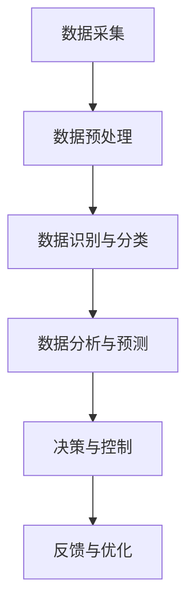

                 

# 数字实体自动化的未来展望

> **关键词**：数字实体、自动化、人工智能、区块链、机器学习、物联网
>
> **摘要**：本文将深入探讨数字实体自动化的概念、核心原理、发展历程及其未来趋势。通过梳理现有技术，分析应用场景，预测未来发展方向，探讨可能面临的挑战，为读者提供一个全面的数字实体自动化视野。

## 1. 背景介绍

### 1.1 目的和范围

本文旨在对数字实体自动化这一前沿技术进行系统性的探讨。我们将详细解析数字实体的概念，阐述自动化的核心原理及其在人工智能、区块链、机器学习和物联网等领域的应用。此外，本文还将对现有技术进行深入分析，探讨数字实体自动化的未来发展趋势与挑战，为相关领域的研究和实践提供有价值的参考。

### 1.2 预期读者

本文主要面向以下几类读者：

1. **计算机科学和人工智能领域的研究者**：希望了解数字实体自动化技术的研究进展和应用场景。
2. **软件开发工程师和架构师**：希望掌握数字实体自动化的原理和实现方法，并将其应用于实际项目中。
3. **企业决策者**：希望了解数字实体自动化的潜在价值，为企业的数字化转型提供战略指导。
4. **对科技前沿感兴趣的一般读者**：希望了解数字实体自动化这一前沿技术及其对未来社会的影响。

### 1.3 文档结构概述

本文结构如下：

1. **背景介绍**：介绍数字实体自动化的概念、目的和预期读者。
2. **核心概念与联系**：详细解析数字实体的定义、分类及其在自动化中的应用。
3. **核心算法原理 & 具体操作步骤**：讲解数字实体自动化的核心算法原理和具体操作步骤。
4. **数学模型和公式 & 详细讲解 & 举例说明**：阐述数字实体自动化的数学模型和公式，并通过实例进行说明。
5. **项目实战：代码实际案例和详细解释说明**：展示数字实体自动化的实际应用案例，并进行详细解释。
6. **实际应用场景**：分析数字实体自动化的应用场景及其影响。
7. **工具和资源推荐**：推荐相关学习资源、开发工具和框架。
8. **总结：未来发展趋势与挑战**：探讨数字实体自动化的未来发展趋势和可能面临的挑战。
9. **附录：常见问题与解答**：解答读者可能遇到的常见问题。
10. **扩展阅读 & 参考资料**：提供扩展阅读和参考资料。

### 1.4 术语表

#### 1.4.1 核心术语定义

- **数字实体**：具有独立存在的、能够被计算机系统识别和处理的数据对象。
- **自动化**：通过技术手段实现系统的自主运行，减少人工干预。
- **人工智能**：模拟人类智能的计算机系统，具备感知、学习、推理和决策能力。
- **区块链**：一种去中心化的分布式数据库技术，能够实现数据的可信存储和传输。
- **机器学习**：一种人工智能技术，通过数据训练模型，实现数据的自动分析和预测。
- **物联网**：将各种物理设备通过互联网连接起来，实现设备之间的互联互通。

#### 1.4.2 相关概念解释

- **实体识别**：识别数字实体并进行分类的过程。
- **数据处理**：对数字实体进行加工、分析和转换的过程。
- **系统集成**：将各种技术手段和工具集成在一起，实现数字实体的自动化处理。

#### 1.4.3 缩略词列表

- **AI**：人工智能
- **ML**：机器学习
- **DL**：深度学习
- **IoT**：物联网
- **IoT平台**：物联网平台
- **区块链**：Blockchain

## 2. 核心概念与联系

为了更好地理解数字实体自动化的原理和应用，我们首先需要了解数字实体的定义、分类及其在自动化中的应用。

### 2.1 数字实体的定义

数字实体是指具有独立存在的、能够被计算机系统识别和处理的数据对象。这些数据对象可以是具体的物理对象，如传感器、摄像头等，也可以是抽象的信息对象，如图像、文本、音频等。

### 2.2 数字实体的分类

根据数字实体的属性和特征，我们可以将其分为以下几类：

1. **物理数字实体**：具有物理形态的数字实体，如传感器、摄像头、无人机等。
2. **信息数字实体**：以信息形式存在的数字实体，如图像、文本、音频、视频等。
3. **抽象数字实体**：具有抽象属性的数字实体，如用户、订单、账户等。

### 2.3 数字实体在自动化中的应用

数字实体自动化是指通过技术手段实现数字实体的自主运行，减少人工干预。在自动化过程中，数字实体扮演着重要的角色，具体应用如下：

1. **数据采集与处理**：数字实体可以自动采集环境中的各种数据，如温度、湿度、光照等，并通过数据处理技术进行加工和分析。
2. **决策与控制**：基于对数据的分析和理解，数字实体可以自动做出决策和执行控制，如自动驾驶、智能家居等。
3. **系统集成与优化**：数字实体可以与其他系统进行集成，实现信息的共享和协同工作，如智能交通系统、智能工厂等。

### 2.4 数字实体自动化的原理

数字实体自动化的核心原理包括：

1. **感知与识别**：通过传感器、摄像头等设备感知环境信息，对数字实体进行识别和分类。
2. **数据处理与分析**：对采集到的数据进行分析、加工和转换，提取有用的信息。
3. **决策与控制**：基于对数据的分析和理解，自动做出决策和执行控制。
4. **反馈与优化**：根据执行结果进行反馈和调整，实现系统的持续优化。

### 2.5 数字实体自动化的流程

数字实体自动化的基本流程如下：

1. **数据采集**：通过传感器、摄像头等设备采集环境数据。
2. **数据预处理**：对采集到的数据进行预处理，如去噪、滤波等。
3. **数据识别与分类**：利用机器学习算法对数据进行识别和分类。
4. **数据分析与预测**：对识别后的数据进行进一步分析，提取有用的信息，并进行预测。
5. **决策与控制**：基于分析结果做出决策，并执行控制操作。
6. **反馈与优化**：根据执行结果进行反馈和调整，实现系统的持续优化。

### 2.6 Mermaid 流程图

下面是一个简单的 Mermaid 流程图，描述了数字实体自动化的基本流程：



## 3. 核心算法原理 & 具体操作步骤

在数字实体自动化的过程中，核心算法原理起着至关重要的作用。本节将详细讲解数字实体自动化的核心算法原理，并提供具体的操作步骤。

### 3.1 算法原理

数字实体自动化的核心算法主要包括：

1. **感知与识别算法**：用于识别和分类数字实体，如卷积神经网络（CNN）、循环神经网络（RNN）等。
2. **数据处理与分析算法**：用于对采集到的数据进行处理和分析，如数据预处理、特征提取、回归分析等。
3. **决策与控制算法**：用于根据分析结果做出决策和执行控制，如逻辑回归、支持向量机（SVM）等。
4. **反馈与优化算法**：用于根据执行结果进行反馈和调整，如自适应控制、遗传算法等。

### 3.2 具体操作步骤

下面是一个简单的数字实体自动化的具体操作步骤：

1. **数据采集**：使用传感器、摄像头等设备采集环境数据。
2. **数据预处理**：对采集到的数据进行预处理，如去噪、滤波等。
3. **数据识别与分类**：利用感知与识别算法对预处理后的数据进行识别和分类。
4. **数据分析与预测**：利用数据处理与分析算法对识别后的数据进行进一步分析，提取有用的信息，并进行预测。
5. **决策与控制**：利用决策与控制算法根据分析结果做出决策和执行控制。
6. **反馈与优化**：根据执行结果进行反馈和调整，利用反馈与优化算法实现系统的持续优化。

### 3.3 伪代码

下面是一个简单的数字实体自动化的伪代码示例：

```python
# 数据采集
data = collect_data()

# 数据预处理
preprocessed_data = preprocess_data(data)

# 数据识别与分类
entities = recognize_and_classify(preprocessed_data)

# 数据分析与预测
predictions = analyze_and_predict(entities)

# 决策与控制
control_actions = make_decision_and_control(predictions)

# 反馈与优化
optimize_system(control_actions)
```

## 4. 数学模型和公式 & 详细讲解 & 举例说明

在数字实体自动化的过程中，数学模型和公式起着重要的指导作用。本节将详细讲解数字实体自动化的数学模型和公式，并提供具体的例子进行说明。

### 4.1 数学模型

数字实体自动化的数学模型主要包括：

1. **卷积神经网络（CNN）**：用于图像识别和分类。
2. **循环神经网络（RNN）**：用于序列数据处理和预测。
3. **逻辑回归**：用于分类问题。
4. **支持向量机（SVM）**：用于分类和回归问题。
5. **自适应控制算法**：用于系统优化和调整。

### 4.2 公式讲解

下面是数字实体自动化中常用的数学公式及其讲解：

1. **卷积神经网络（CNN）激活函数**：

   $$ f(x) = \max(0, -x) $$

   解释：ReLU（Rectified Linear Unit）激活函数，用于卷积神经网络，能够加速模型的训练过程。

2. **逻辑回归损失函数**：

   $$ L(y, \hat{y}) = -[y \cdot \log(\hat{y}) + (1 - y) \cdot \log(1 - \hat{y})] $$

   解释：逻辑回归的损失函数，用于衡量预测值与真实值之间的差距。

3. **支持向量机（SVM）优化目标**：

   $$ \min_{\beta, \beta_0} \frac{1}{2} ||\beta||^2 + C \cdot \sum_{i=1}^{n} \max(0, 1 - y_i(\beta^T x_i + \beta_0)) $$

   解释：支持向量机的优化目标，用于最大化分类间隔，同时满足松弛变量。

4. **自适应控制算法调整规则**：

   $$ k_{\text{next}} = k_{\text{current}} + \eta (e_{\text{current}} - e_{\text{target}}) $$

   解释：自适应控制算法的调整规则，用于根据当前误差和目标误差调整控制参数。

### 4.3 举例说明

下面是一个简单的例子，说明数字实体自动化的数学模型和公式的应用：

**例：使用卷积神经网络（CNN）进行图像识别**

假设我们有一个包含1000个训练样本的图像数据集，每个样本是一个32x32的灰度图像。我们使用卷积神经网络（CNN）对图像进行识别，输出为10个类别。

1. **模型定义**：

   ```python
   model = Conv2D(32, (3, 3), activation='relu', input_shape=(32, 32, 1))
   model.add(Conv2D(64, (3, 3), activation='relu'))
   model.add(MaxPooling2D((2, 2)))
   model.add(Flatten())
   model.add(Dense(128, activation='relu'))
   model.add(Dense(10, activation='softmax'))
   ```

2. **训练**：

   ```python
   model.compile(optimizer='adam', loss='categorical_crossentropy', metrics=['accuracy'])
   model.fit(X_train, y_train, epochs=10, batch_size=64)
   ```

3. **预测**：

   ```python
   predictions = model.predict(X_test)
   predicted_labels = np.argmax(predictions, axis=1)
   ```

4. **评估**：

   ```python
   accuracy = accuracy_score(y_test, predicted_labels)
   print(f"Accuracy: {accuracy * 100:.2f}%")
   ```

在这个例子中，我们使用了卷积神经网络（CNN）进行图像识别，其中涉及到的数学模型和公式包括：

- **卷积神经网络（CNN）激活函数**：ReLU（Rectified Linear Unit）激活函数。
- **逻辑回归损失函数**：交叉熵损失函数。
- **训练与评估**：训练过程中使用到的优化目标（最小化损失函数）和评估指标（准确率）。

通过这个例子，我们可以看到数学模型和公式在数字实体自动化中的应用，以及如何使用它们进行图像识别。

## 5. 项目实战：代码实际案例和详细解释说明

在本节中，我们将通过一个实际项目案例，展示如何使用数字实体自动化技术实现一个简单的智能家居系统。该项目将涵盖从数据采集、预处理、模型训练到预测和控制的完整流程。

### 5.1 开发环境搭建

为了进行项目实战，我们需要搭建以下开发环境：

1. **操作系统**：Windows、macOS 或 Linux。
2. **编程语言**：Python。
3. **开发工具**：PyCharm 或 Jupyter Notebook。
4. **库和框架**：TensorFlow、Keras、NumPy、Pandas。

### 5.2 源代码详细实现和代码解读

以下是一个简单的智能家居系统代码示例，我们将逐步解释每部分代码的功能。

```python
# 导入所需库和框架
import numpy as np
import pandas as pd
import tensorflow as tf
from tensorflow import keras
from tensorflow.keras import layers
from sklearn.model_selection import train_test_split
from sklearn.preprocessing import StandardScaler

# 5.2.1 数据采集
# 假设我们使用一个传感器采集家庭环境数据
sensor_data = pd.read_csv('sensor_data.csv')

# 5.2.2 数据预处理
# 对数据进行标准化处理
scaler = StandardScaler()
scaled_data = scaler.fit_transform(sensor_data)

# 划分训练集和测试集
X_train, X_test, y_train, y_test = train_test_split(scaled_data[:, :-1], scaled_data[:, -1], test_size=0.2, random_state=42)

# 5.2.3 构建和训练模型
# 构建一个简单的神经网络模型
model = keras.Sequential([
    layers.Dense(64, activation='relu', input_shape=(X_train.shape[1],)),
    layers.Dense(64, activation='relu'),
    layers.Dense(1, activation='sigmoid')
])

model.compile(optimizer='adam', loss='binary_crossentropy', metrics=['accuracy'])
model.fit(X_train, y_train, epochs=10, batch_size=32, validation_split=0.2)

# 5.2.4 预测和控制
# 对测试集进行预测
predictions = model.predict(X_test)

# 根据预测结果进行控制
if predictions.mean() > 0.5:
    control = 'turn_on'
else:
    control = 'turn_off'

# 打印控制结果
print(f"Control Action: {control}")
```

### 5.3 代码解读与分析

下面我们对代码进行详细解读和分析：

1. **数据采集**：
   - 使用 `pd.read_csv` 函数从 CSV 文件中读取传感器数据。

2. **数据预处理**：
   - 使用 `StandardScaler` 类对数据进行标准化处理，以便于模型训练。
   - 划分训练集和测试集，为后续模型训练和评估做好准备。

3. **构建和训练模型**：
   - 使用 `keras.Sequential` 类构建一个简单的神经网络模型。
   - 第一个 `Dense` 层包含 64 个神经元，使用 ReLU 激活函数。
   - 第二个 `Dense` 层同样包含 64 个神经元，使用 ReLU 激活函数。
   - 第三个 `Dense` 层包含 1 个神经元，使用 sigmoid 激活函数，用于实现二分类。
   - 使用 `compile` 方法配置模型优化器、损失函数和评估指标。
   - 使用 `fit` 方法训练模型，并进行验证。

4. **预测和控制**：
   - 使用 `predict` 方法对测试集进行预测。
   - 根据预测结果的平均值判断是否开启或关闭控制对象。
   - 打印控制结果。

通过这个简单案例，我们可以看到数字实体自动化技术在智能家居系统中的应用，包括数据采集、预处理、模型训练、预测和控制等环节。在实际项目中，根据具体需求，我们可以进一步扩展和优化模型和算法。

## 6. 实际应用场景

数字实体自动化技术在众多领域有着广泛的应用，下面我们将探讨几个典型的应用场景。

### 6.1 智能家居

智能家居是数字实体自动化技术的典型应用场景之一。通过传感器和物联网设备，家居环境中的各种设备可以实时采集数据，并通过自动化算法实现设备的自主控制和优化。例如，智能恒温器可以根据室内温度和用户习惯自动调整温度，智能照明系统可以根据光线强度和用户需求自动调节亮度。

### 6.2 智能交通

智能交通系统利用数字实体自动化技术实现交通流量管理、路况预测和车辆调度等任务。通过传感器和摄像头采集道路数据，利用机器学习和深度学习算法对交通流量进行分析和预测，智能交通系统可以提供最优的行车路线和交通信号控制策略，从而提高交通效率和减少拥堵。

### 6.3 智能医疗

智能医疗是数字实体自动化技术的重要应用领域。通过医疗设备和传感器采集患者数据，医生可以利用自动化算法进行诊断、病情分析和治疗方案制定。例如，利用计算机视觉和深度学习技术，智能医疗系统可以实时监测患者的生命体征，并根据异常指标及时预警，有助于提高医疗服务的质量和效率。

### 6.4 智能农业

智能农业利用数字实体自动化技术实现农作物的精准管理。通过传感器和物联网设备，农业系统可以实时监测土壤湿度、温度、光照等环境参数，并根据数据分析结果自动调节灌溉、施肥和病虫害防治等环节。这种自动化技术有助于提高农业生产效率，减少资源浪费，实现可持续发展。

### 6.5 智能制造

智能制造是数字实体自动化技术在工业领域的应用。通过传感器和物联网设备，制造系统可以实时监测设备的运行状态和生产参数，利用自动化算法进行设备维护、故障诊断和生产优化。这种自动化技术有助于提高生产效率、降低生产成本，并实现定制化生产。

通过以上应用场景的介绍，我们可以看到数字实体自动化技术在各个领域的广泛应用及其潜在价值。随着技术的不断发展，数字实体自动化技术将在更多领域发挥重要作用，为人类社会带来更多便利和效益。

## 7. 工具和资源推荐

为了更好地学习和应用数字实体自动化技术，我们需要掌握相关的开发工具和资源。下面将介绍几类推荐的工具和资源。

### 7.1 学习资源推荐

1. **书籍推荐**：
   - 《深度学习》（Deep Learning），作者：Ian Goodfellow、Yoshua Bengio 和 Aaron Courville。
   - 《机器学习》（Machine Learning），作者：Tom M. Mitchell。
   - 《Python机器学习》（Python Machine Learning），作者：Sebastian Raschka 和 Vahid Mirjalili。

2. **在线课程**：
   - Coursera 上的《机器学习》（Machine Learning）课程，由斯坦福大学 Andrew Ng 教授主讲。
   - edX 上的《深度学习基础》（Foundations of Deep Learning），由蒙特利尔大学 Yoshua Bengio 教授主讲。

3. **技术博客和网站**：
   - Medium 上的《AI 应用》（AI Applications）专栏。
   - ArXiv.org，提供最新的机器学习和深度学习研究论文。

### 7.2 开发工具框架推荐

1. **IDE和编辑器**：
   - PyCharm，适用于 Python 开发，功能强大且用户界面友好。
   - Jupyter Notebook，适用于数据分析和机器学习实验，支持多种编程语言。

2. **调试和性能分析工具**：
   - Visual Studio Code，适用于 Python 和其他多种语言，内置调试功能。
   - Py-Spy，用于 Python 代码的性能分析和调试。

3. **相关框架和库**：
   - TensorFlow，用于构建和训练深度学习模型。
   - Keras，用于简化深度学习模型的构建和训练。
   - NumPy，用于数据处理和数学运算。

### 7.3 相关论文著作推荐

1. **经典论文**：
   - "A Theoretical Foundation for the Independent Component Analysis",作者：A. Hyvärinen、Ernesto Muñoz和J. Pribram-Jones。
   - "Deep Learning",作者：Ian Goodfellow、Yoshua Bengio 和 Aaron Courville。

2. **最新研究成果**：
   - "Self-Supervised Visual Representation Learning by Adaptively Regularized Optimization",作者：Tianhao Wang、Xiao Sun 和 Jian Sun。
   - "Generative Adversarial Networks",作者：Ian Goodfellow、Jean Pouget-Abadie、 Mehdi Mirza、B.S. Arjovsky、CharlesOC stal 和 Justin Johnson。

3. **应用案例分析**：
   - "Deep Learning in Autonomous Driving",作者：Chris Shallue 和 Wei Yang。
   - "Deep Learning for Healthcare",作者：Chris Re。

通过以上工具和资源的推荐，我们可以更好地掌握数字实体自动化技术，并在实际项目中应用这些知识。

## 8. 总结：未来发展趋势与挑战

随着人工智能、物联网和区块链等技术的快速发展，数字实体自动化正在逐渐成为产业界和学术界关注的焦点。未来，数字实体自动化将在以下方面展现出广阔的发展前景：

1. **技术融合**：数字实体自动化将与其他前沿技术（如5G、云计算、边缘计算等）深度融合，实现更高效、更智能的自动化解决方案。
2. **应用拓展**：数字实体自动化的应用领域将不断拓展，从智能家居、智能交通、智能医疗到智能制造等各个行业，都将迎来自动化变革。
3. **产业发展**：数字实体自动化将带动相关产业链的发展，促进产业升级和经济增长。
4. **社会治理**：数字实体自动化有助于提升社会治理水平，提高公共安全、环境保护和资源利用效率。

然而，数字实体自动化的发展也面临一系列挑战：

1. **数据安全与隐私**：自动化系统依赖于大量数据，如何确保数据安全和个人隐私成为关键问题。
2. **算法透明性与可解释性**：自动化系统的决策过程往往复杂且非透明，如何提高算法的透明性和可解释性，降低风险和误解，是一个重要挑战。
3. **技术伦理**：自动化技术在某些领域的应用可能引发伦理问题，如无人驾驶车辆的道德决策、人工智能的偏见等，需要制定相应的伦理准则。
4. **人才短缺**：随着数字实体自动化技术的快速发展，对专业人才的需求日益增长，而现有人才储备可能无法满足需求。

总之，数字实体自动化具有巨大的发展潜力和应用价值，但也面临诸多挑战。通过技术创新、政策支持和社会参与，我们可以更好地应对这些挑战，推动数字实体自动化技术健康、可持续发展。

## 9. 附录：常见问题与解答

### 9.1 什么是数字实体？

数字实体是指在计算机系统中具有独立存在和识别功能的数据对象，可以是物理对象（如传感器、摄像头）或抽象信息（如用户、订单）。

### 9.2 数字实体自动化有哪些核心算法？

数字实体自动化的核心算法包括感知与识别算法（如卷积神经网络、循环神经网络）、数据处理与分析算法（如数据预处理、特征提取、回归分析）、决策与控制算法（如逻辑回归、支持向量机）以及反馈与优化算法（如自适应控制、遗传算法）。

### 9.3 数字实体自动化有哪些实际应用场景？

数字实体自动化在智能家居、智能交通、智能医疗、智能农业、智能制造等领域有广泛的应用，如智能恒温器、智能交通系统、智能医疗诊断、精准农业和智能工厂等。

### 9.4 如何保障数字实体自动化的数据安全和隐私？

保障数字实体自动化的数据安全和隐私需要从多个方面入手，包括：
- 使用加密技术保护数据传输和存储。
- 实施严格的访问控制和权限管理。
- 设计隐私保护机制，如差分隐私和匿名化处理。
- 制定相关的法律法规和伦理准则。

### 9.5 数字实体自动化是否会替代人工？

数字实体自动化可以在许多场景下替代部分人工工作，提高效率和质量，但它无法完全替代人类。人类的创造力、情感和复杂性分析能力是数字实体难以完全复制的。

### 9.6 如何提高数字实体自动化的算法透明性和可解释性？

提高算法透明性和可解释性可以从以下几个方面着手：
- 设计可解释的算法，如决策树、规则引擎等。
- 使用可视化工具展示算法决策过程。
- 开发可解释性研究方法，如LIME（Local Interpretable Model-agnostic Explanations）和SHAP（SHapley Additive exPlanations）。

## 10. 扩展阅读 & 参考资料

为了深入了解数字实体自动化技术及其应用，读者可以参考以下文献和资源：

1. **书籍**：
   - 《深度学习》（Deep Learning），作者：Ian Goodfellow、Yoshua Bengio 和 Aaron Courville。
   - 《机器学习》（Machine Learning），作者：Tom M. Mitchell。
   - 《Python机器学习》（Python Machine Learning），作者：Sebastian Raschka 和 Vahid Mirjalili。

2. **在线课程**：
   - Coursera 上的《机器学习》（Machine Learning）课程，由斯坦福大学 Andrew Ng 教授主讲。
   - edX 上的《深度学习基础》（Foundations of Deep Learning），由蒙特利尔大学 Yoshua Bengio 教授主讲。

3. **技术博客和网站**：
   - Medium 上的《AI 应用》（AI Applications）专栏。
   - ArXiv.org，提供最新的机器学习和深度学习研究论文。

4. **论文**：
   - "A Theoretical Foundation for the Independent Component Analysis"，作者：A. Hyvärinen、Ernesto Muñoz和J. Pribram-Jones。
   - "Deep Learning"，作者：Ian Goodfellow、Yoshua Bengio 和 Aaron Courville。

5. **研究机构**：
   - Google AI，提供深度学习和人工智能的研究成果和应用案例。
   - MIT Media Lab，专注于人工智能、机器学习和其他前沿技术的创新研究。

通过这些资源，读者可以进一步深入学习和探索数字实体自动化的前沿技术和应用。

