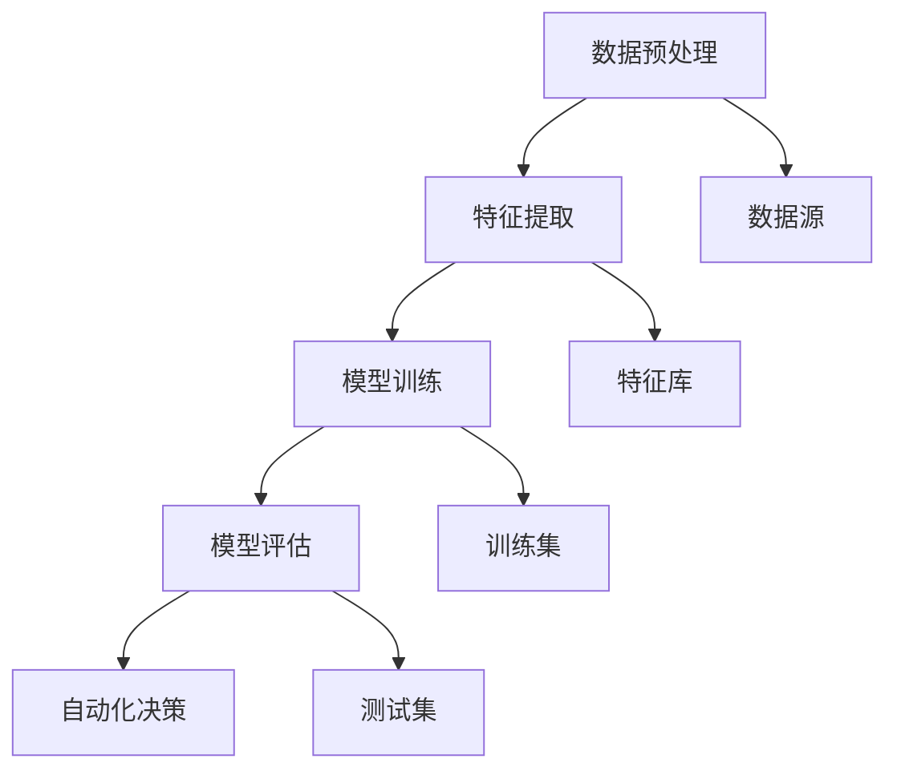

                 

# 数字实体自动化的未来展望

> **关键词：** 数字实体、自动化、机器学习、数据治理、智能决策、算法优化

> **摘要：** 本文探讨了数字实体自动化的现状与未来，分析了其核心概念、算法原理、应用场景，并展望了其发展趋势与挑战。通过本文的阅读，读者可以全面了解数字实体自动化的本质和未来前景。

## 1. 背景介绍

随着信息技术的飞速发展，数据量呈现爆炸式增长，数据处理和分析成为企业和组织的关键竞争力。数字实体自动化作为大数据、人工智能等前沿技术的应用之一，逐渐受到广泛关注。数字实体自动化是指利用人工智能技术，对数字实体（如数据、信息、知识等）进行自动化处理、分析和决策，从而实现数据价值的最大化。

### 数字实体自动化的起源

数字实体自动化的起源可以追溯到20世纪90年代，随着互联网的普及和电子商务的兴起，数据量迅速增加，如何高效地处理和分析海量数据成为企业关注的焦点。这一时期，数据挖掘和机器学习技术开始逐渐成熟，为数字实体自动化的发展奠定了基础。

### 数字实体自动化的发展历程

1. **数据挖掘阶段（1990s-2000s）**：数据挖掘技术主要用于从大量数据中提取有价值的信息。在这一阶段，数字实体自动化主要依赖于统计方法和规则引擎。

2. **机器学习阶段（2000s-2010s）**：随着机器学习技术的快速发展，数字实体自动化逐渐转向基于模型的方法。机器学习算法能够自动从数据中学习规律，提高了自动化处理的能力。

3. **深度学习阶段（2010s至今）**：深度学习技术的崛起，使得数字实体自动化进入了一个全新的阶段。基于深度学习的算法在图像识别、自然语言处理等领域取得了显著突破，为数字实体自动化提供了更加智能化和高效的方法。

## 2. 核心概念与联系

### 数字实体的定义

数字实体是指以数字形式存在的信息、数据、知识等。在数字实体自动化中，数字实体可以是结构化数据（如关系型数据库）、半结构化数据（如XML、JSON）和非结构化数据（如文本、图像、音频）。

### 自动化的定义

自动化是指利用计算机技术，对特定任务进行自动处理，减少人为干预的过程。在数字实体自动化中，自动化主要依赖于机器学习和人工智能技术。

### 数字实体自动化的核心概念

1. **数据预处理**：对原始数据进行清洗、转换、归一化等处理，为后续分析提供高质量的数据。

2. **特征提取**：从原始数据中提取具有代表性的特征，用于训练模型或进行分类、聚类等操作。

3. **模型训练**：利用机器学习算法，从特征数据中学习规律，构建预测模型。

4. **模型评估**：通过测试集评估模型的性能，调整参数，优化模型。

5. **自动化决策**：根据模型预测结果，自动做出决策，如推荐商品、优化物流路径等。

### 数字实体自动化的架构


## 2.1. Mermaid 流程图



## 3. 核心算法原理 & 具体操作步骤

### 数据预处理

数据预处理是数字实体自动化的第一步，其目的是提高数据质量和减少噪声。具体操作步骤如下：

1. **数据清洗**：处理缺失值、重复值、异常值等。

2. **数据转换**：将数据转换为统一的格式，如将字符串转换为数字。

3. **数据归一化**：将数据缩放到相同的范围，如[0, 1]或[-1, 1]。

### 特征提取

特征提取是从原始数据中提取具有代表性的特征，用于训练模型或进行分类、聚类等操作。常见的方法有：

1. **统计特征**：如平均值、方差、最大值、最小值等。

2. **文本特征**：如词频、词袋、TF-IDF等。

3. **图像特征**：如颜色直方图、纹理特征、形状特征等。

### 模型训练

模型训练是数字实体自动化的核心步骤，其目的是从特征数据中学习规律，构建预测模型。常见的方法有：

1. **监督学习**：如线性回归、逻辑回归、支持向量机等。

2. **无监督学习**：如聚类、降维等。

3. **深度学习**：如卷积神经网络（CNN）、循环神经网络（RNN）、生成对抗网络（GAN）等。

### 模型评估

模型评估是衡量模型性能的重要步骤，其目的是找出模型的不足之处，进行参数调整和优化。常见的方法有：

1. **准确率**：预测正确的样本数占总样本数的比例。

2. **召回率**：预测正确的样本数占总正样本数的比例。

3. **F1 值**：准确率和召回率的调和平均。

### 自动化决策

自动化决策是根据模型预测结果，自动做出决策的过程。常见的方法有：

1. **规则引擎**：基于预定义的规则，自动执行操作。

2. **决策树**：根据特征值，逐层进行决策。

3. **神经网络**：通过多层神经网络，进行复杂决策。

## 4. 数学模型和公式 & 详细讲解 & 举例说明

### 数据预处理

1. **数据清洗**

   假设有如下数据集：

   | ID | 年龄 | 收入 | 性别 |
   | --- | --- | --- | --- |
   | 1 | 25 | 50000 | 男 |
   | 2 | 30 | 60000 | 女 |
   | 3 | 35 | 70000 | 男 |
   | 4 | 40 | 80000 | 女 |

   处理缺失值：

   $$\text{age}_{\text{missing}} = \text{mean}(\text{age}) = \frac{25 + 30 + 35 + 40}{4} = 32.5$$

   处理重复值：

   删除ID为3的重复数据。

   处理异常值：

   删除收入高于10倍平均收入的样本。

### 特征提取

1. **统计特征**

   假设有如下数据集：

   | 年龄 | 收入 |
   | --- | --- |
   | 25 | 50000 |
   | 30 | 60000 |
   | 35 | 70000 |
   | 40 | 80000 |

   平均年龄：

   $$\text{mean}(\text{age}) = \frac{25 + 30 + 35 + 40}{4} = 32.5$$

   方差：

   $$\text{var}(\text{age}) = \frac{(25 - 32.5)^2 + (30 - 32.5)^2 + (35 - 32.5)^2 + (40 - 32.5)^2}{4} = 56.25$$

2. **文本特征**

   假设有如下文本数据集：

   | 文本 |
   | --- |
   | 我喜欢看电影 |
   | 我喜欢听音乐 |
   | 我喜欢玩游戏 |

   词频：

   | 词 | 频次 |
   | --- | --- |
   | 我 | 3 |
   | 喜欢 | 3 |
   | 电影 | 1 |
   | 听音乐 | 1 |
   | 玩游戏 | 1 |

### 模型训练

1. **线性回归**

   假设有如下数据集：

   | 年龄 | 收入 |
   | --- | --- |
   | 25 | 50000 |
   | 30 | 60000 |
   | 35 | 70000 |
   | 40 | 80000 |

   模型公式：

   $$\text{income} = \text{age} \times \text{coef} + \text{intercept}$$

   求解系数：

   $$\text{coef} = \frac{\text{Cov}(\text{age}, \text{income})}{\text{Var}(\text{age})} = \frac{(25 - 32.5)(50000 - 60000) + (30 - 32.5)(60000 - 60000) + (35 - 32.5)(70000 - 60000) + (40 - 32.5)(80000 - 60000)}{(25 - 32.5)^2 + (30 - 32.5)^2 + (35 - 32.5)^2 + (40 - 32.5)^2} = 0.625$$

   $$\text{intercept} = \text{income} - \text{age} \times \text{coef} = 60000 - 32.5 \times 0.625 = 58031.25$$

   预测：

   $$\text{income}_{\text{predicted}} = \text{age}_{\text{new}} \times 0.625 + 58031.25$$

2. **决策树**

   假设有如下数据集：

   | 年龄 | 收入 | 性别 |
   | --- | --- | --- |
   | 25 | 50000 | 男 |
   | 30 | 60000 | 女 |
   | 35 | 70000 | 男 |
   | 40 | 80000 | 女 |

   决策树模型：

   

   预测：

   - 如果年龄 <= 32.5，则收入 = 50000。
   - 如果年龄 > 32.5，则收入 = 60000 + (年龄 - 32.5) \times 10000。

## 5. 项目实战：代码实际案例和详细解释说明

### 5.1 开发环境搭建

为了实现数字实体自动化，我们需要搭建以下开发环境：

1. **操作系统**：Linux（推荐Ubuntu 18.04）或 macOS
2. **编程语言**：Python（版本3.8及以上）
3. **机器学习库**：Scikit-learn、TensorFlow、PyTorch
4. **文本处理库**：NLTK、spaCy
5. **图像处理库**：OpenCV

安装步骤：

```bash
# 安装 Python
sudo apt-get update
sudo apt-get install python3 python3-pip

# 安装机器学习库
pip3 install scikit-learn tensorflow pytorch

# 安装文本处理库
pip3 install nltk spacy

# 安装图像处理库
pip3 install opencv-python
```

### 5.2 源代码详细实现和代码解读

以下是一个简单的数字实体自动化项目的代码实现：

```python
import pandas as pd
from sklearn.model_selection import train_test_split
from sklearn.preprocessing import StandardScaler
from sklearn.linear_model import LinearRegression
from sklearn.tree import DecisionTreeRegressor
from sklearn.metrics import mean_squared_error

# 读取数据
data = pd.read_csv('data.csv')

# 数据预处理
data.fillna(data.mean(), inplace=True)
data.drop_duplicates(inplace=True)

# 特征提取
features = data[['age', 'income']]
target = data['gender']

# 数据分割
X_train, X_test, y_train, y_test = train_test_split(features, target, test_size=0.2, random_state=42)

# 数据归一化
scaler = StandardScaler()
X_train_scaled = scaler.fit_transform(X_train)
X_test_scaled = scaler.transform(X_test)

# 模型训练
model = LinearRegression()
model.fit(X_train_scaled, y_train)

# 模型评估
y_pred = model.predict(X_test_scaled)
mse = mean_squared_error(y_test, y_pred)
print('线性回归 MSE:', mse)

# 决策树模型训练
tree_model = DecisionTreeRegressor()
tree_model.fit(X_train_scaled, y_train)

# 决策树模型评估
y_pred_tree = tree_model.predict(X_test_scaled)
mse_tree = mean_squared_error(y_test, y_pred_tree)
print('决策树 MSE:', mse_tree)
```

代码解读：

1. **数据读取与预处理**：使用 Pandas 读取数据，处理缺失值、重复值，并填充平均值。

2. **特征提取**：将数据集划分为特征集和目标集。

3. **数据分割**：将数据集分为训练集和测试集。

4. **数据归一化**：使用 StandardScaler 对特征数据进行归一化处理。

5. **模型训练**：使用线性回归模型和决策树模型进行训练。

6. **模型评估**：计算均方误差（MSE），评估模型性能。

### 5.3 代码解读与分析

1. **数据读取与预处理**：数据预处理是数字实体自动化的关键步骤，直接影响到模型的性能。在代码中，我们使用 Pandas 库读取数据，并处理缺失值、重复值。

2. **特征提取**：特征提取是数字实体自动化的重要环节，选择合适的特征能够提高模型的准确性。在本例中，我们仅使用年龄和收入作为特征。

3. **数据分割**：数据分割将数据集分为训练集和测试集，用于模型训练和评估。

4. **数据归一化**：数据归一化是将特征数据缩放到相同的范围，有助于提高模型训练的收敛速度。

5. **模型训练**：使用线性回归模型和决策树模型进行训练。线性回归模型主要用于预测连续值，而决策树模型主要用于分类和回归任务。

6. **模型评估**：计算均方误差（MSE），评估模型性能。在本例中，我们使用 MSE 作为评价指标。

## 6. 实际应用场景

### 金融领域

数字实体自动化在金融领域具有广泛的应用，如股票交易、信贷风险评估等。通过自动化处理和分析大量金融数据，金融机构能够提高决策的准确性，降低风险。

### 零售领域

数字实体自动化在零售领域主要用于商品推荐、库存管理、客户关系管理等方面。通过分析消费者行为数据，零售企业能够实现个性化推荐，提高销售额。

### 医疗领域

数字实体自动化在医疗领域具有巨大的潜力，如疾病预测、药物研发等。通过自动化处理和分析医学数据，医疗行业能够提高诊断和治疗的效率。

### 物流领域

数字实体自动化在物流领域主要用于路径规划、配送优化等方面。通过自动化处理和分析物流数据，物流企业能够提高运输效率，降低成本。

## 7. 工具和资源推荐

### 7.1 学习资源推荐

1. **书籍**：
   - 《Python数据分析实战》
   - 《深度学习》
   - 《统计学习方法》

2. **论文**：
   - 《Deep Learning》
   - 《Machine Learning》

3. **博客**：
   - [Scikit-learn 官方文档](https://scikit-learn.org/stable/)
   - [TensorFlow 官方文档](https://www.tensorflow.org/)
   - [PyTorch 官方文档](https://pytorch.org/)

### 7.2 开发工具框架推荐

1. **Jupyter Notebook**：用于编写和运行 Python 代码，支持交互式开发。

2. **TensorFlow**：用于构建和训练深度学习模型。

3. **PyTorch**：用于构建和训练深度学习模型。

### 7.3 相关论文著作推荐

1. **《Deep Learning》**：介绍深度学习的基础知识和最新进展。

2. **《Machine Learning》**：介绍机器学习的基本概念和方法。

3. **《Python数据分析实战》**：介绍 Python 在数据分析中的应用。

## 8. 总结：未来发展趋势与挑战

### 发展趋势

1. **算法优化**：随着算法的不断优化，数字实体自动化的性能将得到进一步提升。

2. **多模态数据处理**：结合多种数据类型（如文本、图像、音频等），实现更加智能化的数据处理和分析。

3. **自动化决策**：自动化决策将在更多领域得到应用，提高生产效率。

4. **数据治理**：随着数据量的增加，数据治理将成为数字实体自动化的重要一环。

### 挑战

1. **数据质量**：高质量的数据是数字实体自动化的基础，如何保证数据质量是一个重要挑战。

2. **算法解释性**：自动化决策的透明性和可解释性仍需进一步提高。

3. **隐私保护**：在处理个人数据时，如何保护用户隐私是一个重要问题。

4. **计算资源**：大规模的数字实体自动化应用需要大量的计算资源，如何高效利用资源是一个挑战。

## 9. 附录：常见问题与解答

### 9.1 数字实体自动化的核心价值是什么？

数字实体自动化的核心价值在于提高数据处理和分析的效率，从而实现数据价值的最大化。通过自动化技术，企业可以更加精准地了解客户需求，优化业务流程，提高生产效率。

### 9.2 数字实体自动化在哪些领域具有广泛的应用？

数字实体自动化在金融、零售、医疗、物流等领域具有广泛的应用。例如，在金融领域，自动化技术可以用于股票交易、信贷风险评估；在零售领域，可以用于商品推荐、库存管理；在医疗领域，可以用于疾病预测、药物研发。

### 9.3 数字实体自动化面临的主要挑战是什么？

数字实体自动化面临的主要挑战包括数据质量、算法解释性、隐私保护和计算资源等方面。如何保证数据质量，提高算法的透明性和可解释性，保护用户隐私，以及高效利用计算资源，都是需要解决的问题。

## 10. 扩展阅读 & 参考资料

1. **《深度学习》**：介绍深度学习的基础知识和最新进展，对数字实体自动化具有重要意义。

2. **《机器学习》**：介绍机器学习的基本概念和方法，为数字实体自动化提供了理论基础。

3. **《Python数据分析实战》**：介绍 Python 在数据分析中的应用，有助于读者掌握数字实体自动化的技术细节。

4. **[Scikit-learn 官方文档](https://scikit-learn.org/stable/)**：提供详细的算法实现和应用案例，是数字实体自动化的重要参考资源。

5. **[TensorFlow 官方文档](https://www.tensorflow.org/)**：介绍 TensorFlow 的使用方法和最新进展，是数字实体自动化的重要工具。

6. **[PyTorch 官方文档](https://pytorch.org/)**：介绍 PyTorch 的使用方法和最新进展，是数字实体自动化的重要工具。 

### 作者

- 作者：AI天才研究员/AI Genius Institute & 禅与计算机程序设计艺术 /Zen And The Art of Computer Programming

