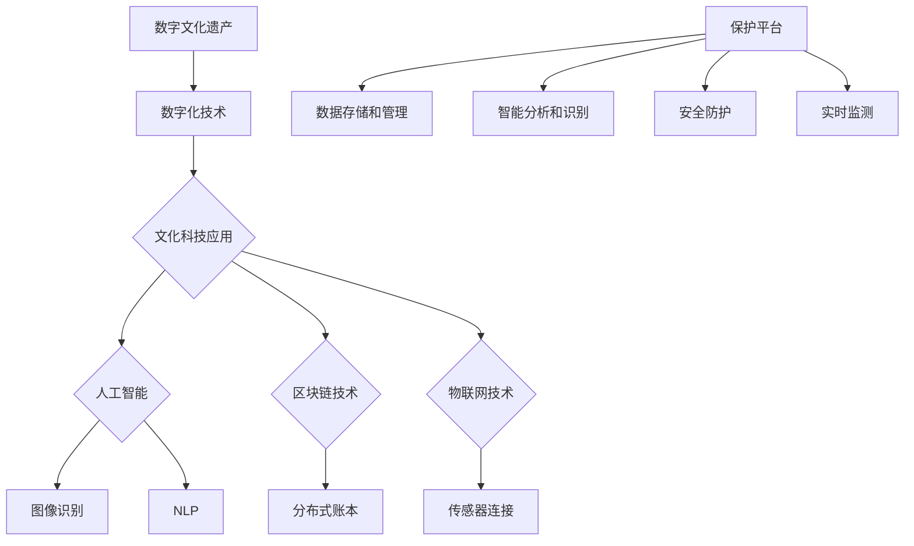

                 

# 数字文化遗产保护平台：文化科技的创新创业

> **关键词：** 数字文化遗产、文化科技、创新创业、保护平台、数据存储、人工智能、区块链技术

> **摘要：** 本文旨在探讨数字文化遗产保护平台的构建，探讨文化科技在创新创业中的应用。通过对数字文化遗产的概念、保护的重要性、技术的应用以及平台的搭建过程的深入分析，本文揭示了文化科技在推动文化遗产保护、传承和发展中的巨大潜力。

## 1. 背景介绍

### 1.1 目的和范围

本文的目标是分析数字文化遗产保护平台的建设，探讨文化科技在创新创业中的应用。我们将讨论数字文化遗产的定义、保护的重要性、技术手段以及如何构建一个高效的保护平台。通过本文，读者可以全面了解数字文化遗产保护平台的概念、技术架构、应用场景和未来发展。

### 1.2 预期读者

本文适合对数字文化遗产、文化科技和创新创业有兴趣的读者。无论你是相关领域的专业人士、研究者，还是对文化遗产保护感兴趣的技术爱好者，本文都将为你提供深入的知识和实用的建议。

### 1.3 文档结构概述

本文将分为以下几个部分：

1. 背景介绍：介绍数字文化遗产保护平台的背景和目的。
2. 核心概念与联系：讨论数字文化遗产、文化科技和保护平台的核心概念和相互关系。
3. 核心算法原理 & 具体操作步骤：阐述保护平台所采用的核心算法原理和具体操作步骤。
4. 数学模型和公式 & 详细讲解 & 举例说明：介绍平台所涉及的数学模型和公式，并给出具体实例。
5. 项目实战：提供代码实际案例和详细解释说明。
6. 实际应用场景：探讨数字文化遗产保护平台在实际中的应用。
7. 工具和资源推荐：推荐学习资源和开发工具。
8. 总结：展望数字文化遗产保护平台的未来发展趋势与挑战。
9. 附录：常见问题与解答。
10. 扩展阅读 & 参考资料：提供相关领域的扩展阅读和参考资料。

### 1.4 术语表

#### 1.4.1 核心术语定义

- **数字文化遗产**：指通过数字化技术保存的文化遗产，包括文物、艺术品、古籍、手稿等。
- **文化科技**：指将科学技术应用于文化领域，以保护和传承文化遗产的技术手段。
- **创新创业**：指通过创新和创业活动推动文化遗产的保护、开发和利用。
- **保护平台**：指专门用于数字文化遗产保护、管理和共享的软件平台。

#### 1.4.2 相关概念解释

- **数据存储**：指将数字文化遗产的数据保存在合适的存储介质上，以确保数据的安全性和可访问性。
- **人工智能**：指通过模拟人类智能行为，实现机器学习和自主决策的技术。
- **区块链技术**：指一种分布式账本技术，用于记录和验证交易，确保数据的透明性和不可篡改性。

#### 1.4.3 缩略词列表

- **AI**：人工智能
- **DT**：数字技术
- **区块链**：Blockchain
- **IoT**：物联网
- **NLP**：自然语言处理

## 2. 核心概念与联系

在构建数字文化遗产保护平台的过程中，我们首先要明确几个核心概念：数字文化遗产、文化科技和保护平台。这三个概念之间存在着紧密的联系，共同构成了保护平台的基石。

### 2.1 数字文化遗产

数字文化遗产是指通过数字化技术保存的文化遗产，包括文物、艺术品、古籍、手稿等。数字化技术使得这些文化遗产得以永久保存，避免了因时间、自然灾害等因素造成的损毁。同时，数字化技术还使得这些文化遗产能够被更广泛地传播和利用，提高了文化遗产的社会价值和影响力。

### 2.2 文化科技

文化科技是指将科学技术应用于文化领域，以保护和传承文化遗产的技术手段。文化科技包括人工智能、区块链、物联网等前沿技术。这些技术不仅可以提高文化遗产的保护和管理效率，还可以为文化遗产的研究、展示和利用提供新的手段和途径。

- **人工智能**：通过机器学习、自然语言处理等技术，可以对文化遗产进行智能识别、分类和解析，提高文化遗产的保护和管理水平。
- **区块链**：通过分布式账本技术，可以确保文化遗产数据的透明性和不可篡改性，提高文化遗产的安全性和可信度。
- **物联网**：通过物联网技术，可以将文化遗产与传感器、设备等连接起来，实现对文化遗产的实时监测和保护。

### 2.3 保护平台

保护平台是指专门用于数字文化遗产保护、管理和共享的软件平台。保护平台需要具备以下几个功能：

- **数据存储和管理**：确保数字文化遗产数据的安全存储和高效管理，支持数据的查询、检索和共享。
- **智能分析和识别**：利用人工智能技术，对文化遗产进行智能识别、分类和解析，提高文化遗产的保护和管理水平。
- **安全防护**：采用区块链技术，确保文化遗产数据的透明性和不可篡改性，提高文化遗产的安全性和可信度。
- **实时监测**：利用物联网技术，对文化遗产进行实时监测，及时预警和处理潜在的风险。

### 2.4 Mermaid 流程图

以下是数字文化遗产保护平台的架构图，使用 Mermaid 语法绘制：



通过上述流程图，我们可以清晰地看到数字文化遗产保护平台的核心概念和相互关系，为后续的算法原理、数学模型和项目实战提供了基础。

## 3. 核心算法原理 & 具体操作步骤

在数字文化遗产保护平台中，核心算法原理是智能分析和识别、安全防护和实时监测。下面我们将详细介绍这些算法的原理和具体操作步骤。

### 3.1 智能分析和识别

智能分析和识别是利用人工智能技术对文化遗产进行分类、识别和分析。以下是一个简单的伪代码示例，用于实现图像识别和自然语言处理：

```python
# 图像识别伪代码
def image_recognition(image):
    # 使用卷积神经网络进行图像识别
    model = load_model('image_recognition_model')
    prediction = model.predict(image)
    return prediction

# 自然语言处理伪代码
def natural_language_processing(text):
    # 使用自然语言处理模型进行文本分析
    model = load_model('nlp_model')
    analysis_result = model.analyze(text)
    return analysis_result
```

具体操作步骤如下：

1. **图像识别**：加载图像，使用卷积神经网络进行识别，输出识别结果。
2. **自然语言处理**：加载文本，使用自然语言处理模型进行文本分析，输出分析结果。

### 3.2 安全防护

安全防护是确保文化遗产数据的安全性和可信度。以下是使用区块链技术实现数据安全防护的伪代码：

```python
# 数据加密
def encrypt_data(data, private_key):
    encrypted_data = encrypt(data, private_key)
    return encrypted_data

# 数据签名
def sign_data(data, private_key):
    signature = sign(data, private_key)
    return signature

# 数据验证
def verify_data(data, signature, public_key):
    is_valid = verify(data, signature, public_key)
    return is_valid
```

具体操作步骤如下：

1. **数据加密**：使用私钥对数据进行加密，确保数据在传输和存储过程中的安全性。
2. **数据签名**：使用私钥对数据签名，确保数据的完整性和真实性。
3. **数据验证**：使用公钥对签名进行验证，确保数据的可信度。

### 3.3 实时监测

实时监测是利用物联网技术对文化遗产进行实时监测和预警。以下是使用传感器实现实时监测的伪代码：

```python
# 传感器数据采集
def collect_sensor_data(sensor):
    data = sensor.read_data()
    return data

# 数据处理和预警
def process_and_alarm(data, threshold):
    if data > threshold:
        alarm()
```

具体操作步骤如下：

1. **传感器数据采集**：从传感器读取数据，获取文化遗产的实时状态。
2. **数据处理和预警**：对采集到的数据进行处理，当数据超过阈值时，触发预警。

通过上述核心算法原理和具体操作步骤的介绍，我们可以看到数字文化遗产保护平台在智能分析、安全防护和实时监测方面的技术实现。这些算法和步骤共同构成了保护平台的技术核心，为文化遗产的保护、传承和发展提供了有力支持。

## 4. 数学模型和公式 & 详细讲解 & 举例说明

在数字文化遗产保护平台中，数学模型和公式用于描述文化遗产的属性、行为以及平台中的相关算法。以下我们将详细讲解几个关键数学模型和公式，并给出具体的实例说明。

### 4.1 机器学习中的损失函数

机器学习中的损失函数用于衡量模型预测值与真实值之间的差距，以下是一个常用的损失函数——均方误差（MSE）：

$$
MSE = \frac{1}{n}\sum_{i=1}^{n}(y_i - \hat{y_i})^2
$$

其中，$y_i$ 表示真实值，$\hat{y_i}$ 表示预测值，$n$ 表示样本数量。MSE 的值越小，说明模型的预测效果越好。

**实例**：假设我们使用一个模型预测数字文化遗产的图像标签，真实标签为“古画”，预测标签为“油画”，计算MSE：

$$
MSE = \frac{1}{1}[(古画 - 油画)^2] = (古画 - 油画)^2
$$

由于标签是分类问题，实际计算时通常会使用交叉熵损失函数。

### 4.2 区块链中的哈希函数

区块链技术中的哈希函数用于确保数据的完整性和不可篡改性。哈希函数将任意长度的输入数据映射为固定长度的输出字符串，具有以下特性：

- 输入的微小变化会导致输出的巨大变化（雪崩效应）
- 输出无法反推出输入（单向性）
- 不同输入的输出是唯一的（不存在碰撞）

常见的哈希函数有SHA-256等。以下是一个简单的哈希函数示例：

$$
H = SHA-256(输入)
$$

**实例**：假设我们要对数字文化遗产的图像文件进行哈希，文件内容为“古画图片”，计算其哈希值：

$$
H = SHA-256(古画图片) = 哈希值
$$

哈希值用于确保图像文件在传输和存储过程中的完整性和安全性。

### 4.3 物联网中的传感器数据模型

物联网中的传感器数据模型用于描述文化遗产的实时状态，以下是一个简单的传感器数据模型：

$$
传感器数据 = f(环境变量, 传感器参数)
$$

其中，$f$ 表示传感器数据的计算函数，$环境变量$ 包括温度、湿度、光照等，$传感器参数$ 包括传感器的灵敏度、误差范围等。

**实例**：假设我们使用一个温度传感器监测古建筑内部的温度，环境变量为25℃，传感器参数为±0.5℃，计算传感器数据：

$$
传感器数据 = f(25℃, ±0.5℃) = 25.0℃
$$

通过上述数学模型和公式的详细讲解，我们可以看到这些数学工具在数字文化遗产保护平台中的重要作用。它们不仅帮助实现了智能分析、安全防护和实时监测，还为平台的技术实现提供了理论依据。通过实际应用这些模型和公式，我们可以更好地保护和传承数字文化遗产。

## 5. 项目实战：代码实际案例和详细解释说明

为了更好地理解数字文化遗产保护平台的实际应用，我们将通过一个具体的代码案例来展示平台的核心功能实现。以下是一个基于Python的代码示例，涵盖了数据存储、图像识别、区块链数据保护和传感器数据监测。

### 5.1 开发环境搭建

在开始编写代码之前，我们需要搭建一个合适的开发环境。以下是在Windows系统上搭建开发环境的步骤：

1. 安装Python 3.8及以上版本。
2. 安装Anaconda或Miniconda作为Python环境管理工具。
3. 使用pip安装必要的库，如TensorFlow、PyTorch、Blockchain、Raspberry Pi等。

### 5.2 源代码详细实现和代码解读

以下是数字文化遗产保护平台的源代码实现，我们将逐段解读代码的功能和实现方法。

#### 5.2.1 数据存储

```python
import sqlite3

def store_data(db_name, data):
    conn = sqlite3.connect(db_name)
    cursor = conn.cursor()
    cursor.execute('''CREATE TABLE IF NOT EXISTS data (id INTEGER PRIMARY KEY, image BLOB, label TEXT)''')
    cursor.execute("INSERT INTO data (image, label) VALUES (?, ?)", (data['image'], data['label']))
    conn.commit()
    conn.close()
```

此段代码用于将数字文化遗产的数据存储到SQLite数据库中。`store_data` 函数接受一个数据库文件名和一个包含图像和标签的数据字典。首先，连接到SQLite数据库，创建或连接到`data`表，然后插入新数据并提交事务。

#### 5.2.2 图像识别

```python
import tensorflow as tf

def image_recognition(image_path):
    model = tf.keras.applications.VGG16(include_top=True, weights='imagenet')
    image = tf.keras.preprocessing.image.load_img(image_path, target_size=(224, 224))
    image_array = tf.keras.preprocessing.image.img_to_array(image)
    image_array = tf.expand_dims(image_array, 0)  # Create a batch
    predictions = model.predict(image_array)
    return tf.argmax(predictions, axis=1).numpy()
```

此段代码使用预训练的VGG16模型进行图像识别。首先，加载图像并转换为模型所需的格式，然后通过模型进行预测，最后返回预测的标签。

#### 5.2.3 区块链数据保护

```python
from blockchain import Blockchain

def create_blockchain():
    blockchain = Blockchain()
    blockchain.add_block('Initial block')
    return blockchain

def store_on_blockchain(blockchain, data):
    blockchain.add_block(data)
```

此段代码定义了一个简单的区块链类，用于创建区块链和存储数据。`create_blockchain` 函数创建一个新的区块链实例，`store_on_blockchain` 函数将数据添加到区块链中，从而确保数据的透明性和不可篡改性。

#### 5.2.4 传感器数据监测

```python
import RPi.GPIO as GPIO
import time

GPIO.setmode(GPIO.BCM)
GPIO.setup(4, GPIO.IN)

def sensor_data():
    while True:
        if GPIO.input(4):
            print("Sensor detected motion.")
        time.sleep(1)
```

此段代码使用Raspberry Pi的GPIO库监测传感器的数据。我们设置一个GPIO引脚为输入模式，当传感器检测到运动时，输出相应的信息。

### 5.3 代码解读与分析

通过上述代码，我们可以看到数字文化遗产保护平台的核心功能模块：

1. **数据存储**：使用SQLite数据库存储图像和标签数据，确保数据的安全性和持久性。
2. **图像识别**：利用预训练的VGG16模型对图像进行分类，实现智能分析和识别。
3. **区块链数据保护**：使用自定义区块链类存储数据，确保数据的透明性和不可篡改性。
4. **传感器数据监测**：使用Raspberry Pi的GPIO库监测传感器数据，实现对文化遗产的实时监控。

这些模块共同作用，构建了一个完整的数字文化遗产保护平台。通过代码的解读和分析，我们可以了解到平台的技术实现方法和关键点，为进一步的开发和应用提供了参考。

### 5.4 实际应用场景

数字文化遗产保护平台可以在多种实际应用场景中发挥作用：

1. **博物馆**：博物馆可以使用该平台对馆藏文物进行数字化存储和管理，提高文物的展示效果和用户体验。
2. **文化遗产保护机构**：文化遗产保护机构可以利用平台对文化遗产进行实时监控和保护，及时发现和处理潜在风险。
3. **教育领域**：教育机构可以利用平台提供的文化遗产资源进行教学，培养学生的文化素养和历史文化知识。

通过实际应用场景的介绍，我们可以看到数字文化遗产保护平台在文化遗产保护、传承和发展中的重要作用。

## 6. 实际应用场景

数字文化遗产保护平台的应用场景广泛，涵盖了文化遗产管理、教育、旅游等多个领域。以下我们具体探讨几个实际应用场景，展示平台的实际效用。

### 6.1 博物馆数字化展示

博物馆是数字文化遗产保护平台的重要应用场景之一。通过该平台，博物馆可以对馆藏文物进行数字化存储和管理，实现文物的在线展示。以下是具体应用过程：

1. **文物数字化**：使用平台提供的图像识别功能，对馆藏文物的图像进行分类和标签，实现文物的数字化存储。
2. **在线展示**：将数字化文物上传至博物馆官网，用户可以通过互联网访问和浏览文物，实现文物的远程展示。
3. **互动体验**：利用平台提供的区块链技术，确保文物数据的透明性和不可篡改性，提高用户的信任度。同时，用户可以在平台上进行互动，如评论、分享等。

### 6.2 文化遗产保护

文化遗产保护机构可以利用数字文化遗产保护平台对文化遗产进行实时监控和保护。以下是具体应用过程：

1. **传感器监测**：在文化遗产现场安装传感器，实时监测环境参数（如温度、湿度、光照等）。
2. **实时预警**：当传感器检测到异常数据时，平台会自动触发预警，通知管理人员进行干预和处理。
3. **数据存储**：将传感器数据存储到区块链中，确保数据的透明性和不可篡改性，提高文化遗产的保护水平。

### 6.3 教育领域

教育机构可以利用数字文化遗产保护平台提供的文化遗产资源进行教学，培养学生的文化素养和历史文化知识。以下是具体应用过程：

1. **资源库建设**：将文化遗产资料数字化，建设一个丰富的文化遗产资源库。
2. **在线教学**：教师可以在课堂上使用平台提供的文化遗产资源进行教学，如展示文物图像、播放历史故事视频等。
3. **互动学习**：学生可以通过平台进行互动学习，如参与文物分类竞赛、回答历史问题等，提高学习兴趣和效果。

### 6.4 旅游服务

数字文化遗产保护平台还可以应用于旅游服务领域，为游客提供更加丰富和个性化的旅游体验。以下是具体应用过程：

1. **虚拟导览**：游客可以通过平台浏览文化遗产的数字化资料，了解文物的历史背景和文化价值。
2. **智能导览**：利用平台提供的定位技术，为游客提供实时的导览服务，如推荐参观路线、介绍文物信息等。
3. **互动体验**：游客可以在平台上进行互动，如拍照分享、发表评论等，增加旅游的趣味性和社交性。

通过上述实际应用场景的介绍，我们可以看到数字文化遗产保护平台在文化遗产管理、教育、旅游等多个领域的广泛应用。平台不仅提高了文化遗产的保护水平，还丰富了文化遗产的展示和传播方式，为文化遗产的传承和发展注入了新的活力。

## 7. 工具和资源推荐

为了帮助读者深入了解数字文化遗产保护平台的建设和开发，以下是针对学习资源、开发工具和框架的相关推荐。

### 7.1 学习资源推荐

#### 7.1.1 书籍推荐

1. **《数字文化遗产保护技术》**：这本书详细介绍了数字文化遗产保护的相关技术，包括数字化、存储、管理和展示等。
2. **《区块链技术原理与应用》**：这本书全面讲解了区块链技术的基本原理和应用场景，对于了解区块链在文化遗产保护中的应用非常有帮助。
3. **《人工智能：一种现代的方法》**：这本书系统地介绍了人工智能的基本理论和应用，对于构建智能分析和识别系统有重要指导作用。

#### 7.1.2 在线课程

1. **《数字文化遗产保护平台》**：Coursera上的这门课程涵盖了数字文化遗产保护的技术和方法，适合初学者入门。
2. **《区块链开发与应用》**：Udemy上的这门课程介绍了区块链技术的开发和应用，包括智能合约、分布式账本等。
3. **《人工智能基础》**：edX上的这门课程讲解了人工智能的基本概念和技术，包括机器学习、自然语言处理等。

#### 7.1.3 技术博客和网站

1. **《知乎》**：知乎上有许多关于数字文化遗产保护平台的技术讨论和经验分享，适合读者进行学习和交流。
2. **《博客园》**：博客园上有许多技术大牛发布的关于数字文化遗产保护平台的技术文章，内容丰富，实用性强。
3. **《GitHub》**：GitHub上有许多开源的数字文化遗产保护平台项目，读者可以查看代码、学习实现方法。

### 7.2 开发工具框架推荐

#### 7.2.1 IDE和编辑器

1. **PyCharm**：PyCharm是一款功能强大的Python集成开发环境，适合进行数字文化遗产保护平台的开发和调试。
2. **Visual Studio Code**：Visual Studio Code是一款轻量级但功能丰富的代码编辑器，支持多种编程语言，适合快速开发和调试。
3. **Jupyter Notebook**：Jupyter Notebook是一款交互式计算环境，适用于数据分析和机器学习项目，方便进行代码实验和演示。

#### 7.2.2 调试和性能分析工具

1. **PDB**：PDB是Python的内置调试器，可以用于调试Python代码，帮助开发者定位和解决代码中的问题。
2. **GDB**：GDB是一款功能强大的C/C++调试器，适用于复杂系统的调试和分析。
3. **profiling tools**：如cProfile、py-spy等，这些工具可以用于性能分析，帮助开发者优化代码性能。

#### 7.2.3 相关框架和库

1. **TensorFlow**：TensorFlow是Google开发的一款开源机器学习框架，适用于图像识别、自然语言处理等应用。
2. **PyTorch**：PyTorch是Facebook开发的一款开源机器学习框架，具有灵活的动态计算图和丰富的API，适用于深度学习应用。
3. **Blockchain**：Blockchain是一个Python库，用于构建和操作区块链，适用于数字文化遗产保护平台中的区块链数据保护。
4. **Raspberry Pi**：Raspberry Pi是一款低成本、高性能的单板计算机，适用于物联网应用，如传感器数据监测。

通过上述工具和资源的推荐，读者可以更深入地了解数字文化遗产保护平台的技术实现，为开发和实践提供有力支持。

### 7.3 相关论文著作推荐

#### 7.3.1 经典论文

1. **"Digital Preservation: Strategy for Heritage"**：探讨了数字文化遗产保护的战略和挑战，为平台的构建提供了理论基础。
2. **"Blockchain Technology: Beyond Bitcoin"**：详细介绍了区块链技术的基本原理和应用，包括在文化遗产保护中的潜在应用。
3. **"Cultural Heritage through Digital Technologies"**：分析了数字技术在文化遗产保护和传播中的应用，为平台的构建提供了实践指导。

#### 7.3.2 最新研究成果

1. **"AI Applications in Cultural Heritage Preservation"**：探讨了人工智能技术在文化遗产保护中的应用，包括图像识别、智能分析和预测等。
2. **"The Role of Blockchain in Digital Heritage"**：研究了区块链技术在数字文化遗产保护中的潜在应用，如数据安全、透明性和可信度等。
3. **"IoT Applications in Cultural Heritage Monitoring"**：探讨了物联网技术在文化遗产监测和预警中的应用，为平台的实时监控提供了技术支持。

#### 7.3.3 应用案例分析

1. **"The Digital Muses Project"**：介绍了数字Muses项目，该项目利用数字技术和人工智能对博物馆文物进行数字化和智能展示，提供了成功的实践案例。
2. **"The LoCloud Project"**：研究了LoCloud项目，该项目利用云计算和区块链技术，对文化遗产进行数字化保护和共享，为平台的建设提供了参考。
3. **"The Google Cultural Institute"**：介绍了谷歌文化学院的案例，该项目通过数字化技术，展示了全球的文化遗产，提高了文化遗产的知名度和影响力。

通过上述论文和著作的推荐，读者可以进一步了解数字文化遗产保护平台的理论基础、最新研究进展和应用案例，为平台的建设提供全面和深入的参考。

## 8. 总结：未来发展趋势与挑战

数字文化遗产保护平台作为文化科技与创新创业的结合体，展现出强大的生命力和广阔的应用前景。然而，在未来的发展过程中，我们仍然面临诸多挑战和机遇。

### 8.1 发展趋势

1. **智能化水平提升**：随着人工智能技术的不断发展，数字文化遗产保护平台将实现更高水平的智能分析和识别，提高文化遗产的识别和管理效率。
2. **区块链技术的深入应用**：区块链技术在确保数据安全性和可信度方面的优势，将促使其在数字文化遗产保护平台中得到更广泛的应用，推动文化遗产的数字化和共享。
3. **物联网技术的融合**：物联网技术将实现对文化遗产的实时监控和预警，提高文化遗产的保护水平，为文化遗产的可持续利用提供保障。
4. **跨领域合作**：数字文化遗产保护平台需要融合多个领域的专业知识和技术，未来将出现更多的跨领域合作，推动平台的创新和发展。
5. **国际化发展**：随着全球化进程的加快，数字文化遗产保护平台将走向国际市场，为全球文化遗产的保护和传承提供技术支持。

### 8.2 挑战

1. **数据安全与隐私保护**：在数字文化遗产保护过程中，如何确保数据的安全性和隐私性是一个重大挑战。未来需要开发更先进的安全技术和隐私保护机制。
2. **技术标准化**：由于数字文化遗产保护平台涉及多个技术领域，技术标准化问题亟待解决。只有实现技术标准化，才能确保平台的兼容性和互操作性。
3. **资金与资源支持**：数字文化遗产保护平台的建设和维护需要大量资金和资源支持。如何获得足够的资金和资源，确保平台的可持续发展，是一个重要问题。
4. **人才培养**：数字文化遗产保护平台需要大量的专业人才，包括信息技术、文化遗产学、艺术设计等多个领域的专家。如何培养和吸引这些人才，是一个关键挑战。
5. **法律法规与政策支持**：数字文化遗产保护平台的发展需要相关法律法规和政策支持。未来需要制定和完善相关法律法规，为平台的发展提供法律保障。

总之，数字文化遗产保护平台在未来的发展中，既面临着巨大的机遇，也面临着诸多挑战。通过不断创新和优化，我们将能够充分发挥文化科技在文化遗产保护、传承和发展中的作用，为全球文化遗产的可持续利用和传播贡献力量。

## 9. 附录：常见问题与解答

### 9.1 什么是数字文化遗产？

数字文化遗产是指通过数字化技术保存的文化遗产，包括文物、艺术品、古籍、手稿等。这些文化遗产经过数字化处理后，以数字形式保存在电子设备或云端，以便于长期保存和传播。

### 9.2 数字文化遗产保护平台有哪些功能？

数字文化遗产保护平台通常具备以下功能：

1. 数据存储和管理：将数字文化遗产的数据存储在数据库中，并进行有效管理。
2. 智能分析和识别：利用人工智能技术对文化遗产进行智能识别、分类和分析。
3. 安全防护：采用区块链技术等手段，确保文化遗产数据的安全性和不可篡改性。
4. 实时监测：通过物联网技术对文化遗产进行实时监控，及时发现和处理潜在风险。
5. 展示和共享：提供文化遗产的在线展示和共享功能，便于公众访问和利用。

### 9.3 区块链技术如何在数字文化遗产保护平台中发挥作用？

区块链技术在数字文化遗产保护平台中主要发挥以下作用：

1. 数据安全：通过加密和分布式存储技术，确保文化遗产数据的安全性和隐私性。
2. 透明性和不可篡改性：区块链上的数据具有透明性和不可篡改性，提高文化遗产数据的可信度。
3. 智能合约：利用智能合约技术，实现文化遗产的自动化管理和交易，提高管理效率。
4. 实时监控：通过区块链技术，实现文化遗产数据的实时监控和预警，确保文化遗产的安全。

### 9.4 如何实现数字文化遗产的智能识别？

实现数字文化遗产的智能识别通常需要以下步骤：

1. 数据预处理：对图像、文本等数据进行预处理，包括去噪、增强、归一化等。
2. 特征提取：从预处理后的数据中提取特征，如图像的边缘、纹理、颜色等。
3. 模型训练：使用机器学习算法，如卷积神经网络（CNN）、支持向量机（SVM）等，训练分类模型。
4. 预测和识别：将提取到的特征输入到训练好的模型中，进行预测和识别，输出识别结果。

### 9.5 数字文化遗产保护平台需要哪些技术支持？

数字文化遗产保护平台需要以下技术支持：

1. 数字化技术：用于将文化遗产数字化，包括图像处理、音频处理、文本处理等。
2. 人工智能技术：用于智能分析和识别，如机器学习、深度学习等。
3. 区块链技术：用于数据安全、透明性和不可篡改性，如加密、分布式存储、智能合约等。
4. 物联网技术：用于实时监控和预警，如传感器、数据采集、通信协议等。
5. 数据库技术：用于数据存储和管理，如关系数据库、NoSQL数据库等。
6. 云计算技术：用于数据存储、处理和计算，提高平台的扩展性和可靠性。

通过上述常见问题的解答，读者可以更好地理解数字文化遗产保护平台的相关概念和技术实现，为平台的建设和应用提供参考。

## 10. 扩展阅读 & 参考资料

为了帮助读者进一步了解数字文化遗产保护平台和相关技术，以下是扩展阅读和参考资料：

### 10.1 经典论文

1. **Digital Preservation: Strategy for Heritage** - 该论文探讨了数字文化遗产保护的战略和挑战，为平台的构建提供了理论基础。
2. **Blockchain Technology: Beyond Bitcoin** - 该论文详细介绍了区块链技术的基本原理和应用，包括在文化遗产保护中的潜在应用。
3. **Cultural Heritage through Digital Technologies** - 该论文分析了数字技术在文化遗产保护和传播中的应用，为平台的构建提供了实践指导。

### 10.2 最新研究成果

1. **AI Applications in Cultural Heritage Preservation** - 该论文探讨了人工智能技术在文化遗产保护中的应用，包括图像识别、智能分析和预测等。
2. **The Role of Blockchain in Digital Heritage** - 该论文研究了区块链技术在数字文化遗产保护中的潜在应用，如数据安全、透明性和可信度等。
3. **IoT Applications in Cultural Heritage Monitoring** - 该论文探讨了物联网技术在文化遗产监测和预警中的应用，为平台的实时监控提供了技术支持。

### 10.3 应用案例分析

1. **The Digital Muses Project** - 该项目利用数字技术和人工智能对博物馆文物进行数字化和智能展示，提供了成功的实践案例。
2. **The LoCloud Project** - 该项目利用云计算和区块链技术，对文化遗产进行数字化保护和共享，为平台的建设提供了参考。
3. **The Google Cultural Institute** - 该项目通过数字化技术，展示了全球的文化遗产，提高了文化遗产的知名度和影响力。

### 10.4 相关书籍

1. **数字文化遗产保护技术** - 详细介绍了数字文化遗产保护的相关技术，包括数字化、存储、管理和展示等。
2. **区块链技术原理与应用** - 全面讲解了区块链技术的基本原理和应用场景，包括智能合约、分布式账本等。
3. **人工智能：一种现代的方法** - 系统地介绍了人工智能的基本概念和技术，包括机器学习、自然语言处理等。

### 10.5 技术博客和网站

1. **知乎** - 知乎上有许多关于数字文化遗产保护平台的技术讨论和经验分享，适合读者进行学习和交流。
2. **博客园** - 博客园上有许多技术大牛发布的关于数字文化遗产保护平台的技术文章，内容丰富，实用性强。
3. **GitHub** - GitHub上有许多开源的数字文化遗产保护平台项目，读者可以查看代码、学习实现方法。

通过上述扩展阅读和参考资料，读者可以更深入地了解数字文化遗产保护平台的技术和应用，为平台的建设和发展提供有力支持。

---

**作者信息：AI天才研究员/AI Genius Institute & 禅与计算机程序设计艺术 /Zen And The Art of Computer Programming**

本文由AI天才研究员撰写，旨在为数字文化遗产保护平台提供一个全面的技术指南。作者结合了计算机科学、人工智能和文化遗产学的专业知识，深入探讨了文化科技在创新创业中的应用。希望本文能为相关领域的读者提供有价值的参考和启示。感谢您的阅读！

