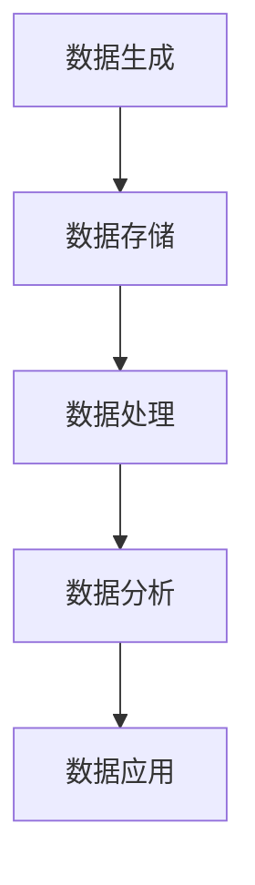
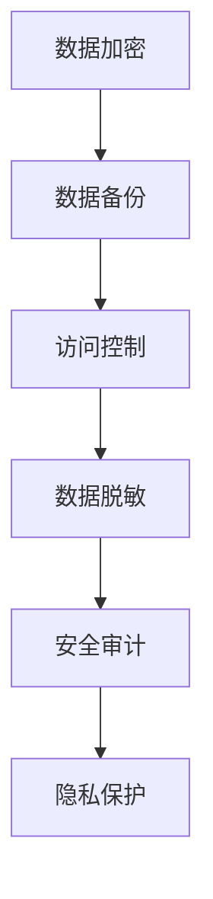
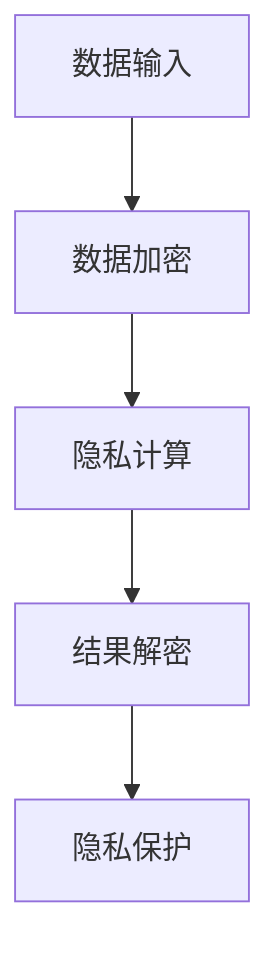

                 

# 数字经济的挑战：如何应对数据安全和隐私问题？

> **关键词：** 数字经济、数据安全、隐私保护、安全机制、隐私计算、加密技术、隐私合规、数据共享、AI应用

> **摘要：** 随着数字经济的快速发展，数据安全和隐私保护问题日益突出。本文将深入探讨数字经济中面临的数据安全和隐私挑战，分析现有的安全机制和隐私保护技术，探讨未来的发展趋势与解决方案。

## 1. 背景介绍

### 1.1 目的和范围

本文旨在探讨数字经济时代下的数据安全和隐私保护问题，分析现有的安全机制和隐私保护技术，并提出可能的解决方案和未来趋势。本文的讨论范围包括但不限于以下几个方面：

1. 数字经济的定义和发展现状
2. 数据安全和隐私保护的重要性
3. 现有的数据安全机制和隐私保护技术
4. 数字经济中的实际应用场景
5. 未来发展趋势与挑战

### 1.2 预期读者

本文适合以下读者群体：

1. 数据安全领域的研究人员和工程师
2. 隐私保护技术领域的专家和从业者
3. 数字经济领域的决策者和战略规划人员
4. 对数据安全和隐私保护感兴趣的普通读者

### 1.3 文档结构概述

本文将按照以下结构进行组织：

1. 背景介绍：介绍数字经济的定义和发展现状，数据安全和隐私保护的重要性
2. 核心概念与联系：介绍数据安全和隐私保护的核心概念，使用 Mermaid 流程图展示相关架构
3. 核心算法原理 & 具体操作步骤：分析现有的数据安全机制和隐私保护技术，使用伪代码详细阐述算法原理和操作步骤
4. 数学模型和公式 & 详细讲解 & 举例说明：介绍与数据安全和隐私保护相关的数学模型和公式，进行详细讲解和举例说明
5. 项目实战：介绍实际应用场景中的代码案例，进行详细解释说明
6. 实际应用场景：探讨数字经济中的实际应用场景，分析数据安全和隐私保护的需求和挑战
7. 工具和资源推荐：推荐学习资源、开发工具和框架、相关论文著作
8. 总结：总结本文的主要观点和未来发展趋势与挑战
9. 附录：常见问题与解答
10. 扩展阅读 & 参考资料：提供进一步阅读的参考资料

### 1.4 术语表

#### 1.4.1 核心术语定义

- 数字经济：指以数字化方式创造、分配、交换和消费经济资源的经济活动
- 数据安全：指保护数据免受未经授权的访问、篡改、泄露等威胁的措施
- 隐私保护：指确保个人隐私不被非法收集、使用和泄露的措施
- 隐私计算：指在数据处理过程中保护隐私的一种计算范式
- 加密技术：指通过加密算法对数据进行加密和解密的技术

#### 1.4.2 相关概念解释

- 数字化转型：指企业或组织通过数字化手段实现业务流程、管理模式和组织结构的变革
- 区块链技术：指通过分布式账本技术实现数据存储、传输和验证的一种新型数据库技术
- 人工智能：指通过模拟、延伸和扩展人类智能的技术和方法

#### 1.4.3 缩略词列表

- AI：人工智能
- GDPR：通用数据保护条例
- DLP：数据泄露防护
- SSL：安全套接层协议
- PII：个人身份信息

## 2. 核心概念与联系

在数字经济中，数据安全和隐私保护是至关重要的。以下是数据安全和隐私保护的核心概念与联系，以及相关的 Mermaid 流程图。

### 2.1 数字经济中的数据流



### 2.2 数据安全和隐私保护机制



### 2.3 隐私计算架构



## 3. 核心算法原理 & 具体操作步骤

在数据安全和隐私保护中，加密技术是核心手段之一。以下是常见的加密算法原理和具体操作步骤，使用伪代码进行详细阐述。

### 3.1 对称加密算法（AES）

```python
# 输入：明文文本、密钥
# 输出：密文

def AES_encrypt(plaintext, key):
    # 初始化加密参数
    cipher = AES.new(key, AES.MODE_EAX)
    
    # 加密明文
    ciphertext, tag = cipher.encrypt_and_digest(plaintext)
    
    # 返回密文和标签
    return ciphertext, tag
```

### 3.2 非对称加密算法（RSA）

```python
# 输入：明文文本、公钥
# 输出：密文

def RSA_encrypt(plaintext, public_key):
    # 使用公钥加密
    ciphertext = rsa.PublicKey.encrypt(plaintext, public_key)
    
    # 返回密文
    return ciphertext
```

### 3.3 哈希算法（SHA-256）

```python
# 输入：明文文本
# 输出：哈希值

def SHA256_hash(plaintext):
    # 创建哈希对象
    hasher = hashlib.sha256()
    
    # 更新哈希对象
    hasher.update(plaintext)
    
    # 返回哈希值
    return hasher.hexdigest()
```

## 4. 数学模型和公式 & 详细讲解 & 举例说明

在数据安全和隐私保护中，数学模型和公式发挥着重要作用。以下是与数据安全和隐私保护相关的一些数学模型和公式，以及详细讲解和举例说明。

### 4.1 公钥加密

公钥加密是一种基于数学难题的加密技术，使用一对密钥（公钥和私钥）进行加密和解密。以下是一个简单的公钥加密模型：

- **加密公式：**
  $$C = P^e \mod N$$
  其中，$C$ 是密文，$P$ 是明文，$e$ 是加密指数，$N$ 是模数。

- **解密公式：**
  $$P = C^d \mod N$$
  其中，$P$ 是明文，$C$ 是密文，$d$ 是解密指数。

- **举例说明：**
  假设使用 RSA 算法进行加密，选择 $e = 3$，$N = 23$。明文 $P = 5$。

  - **加密过程：**
    $$C = 5^3 \mod 23 = 15$$

  - **解密过程：**
    $$P = 15^3 \mod 23 = 5$$

### 4.2 哈希函数

哈希函数是一种将任意长度的输入数据映射为固定长度的输出的函数。以下是一个简单的哈希函数模型：

- **哈希函数公式：**
  $$H = hash(plaintext)$$
  其中，$H$ 是哈希值，$plaintext$ 是输入数据。

- **举例说明：**
  假设使用 SHA-256 哈希函数，输入数据为 "Hello, World!"。

  - **哈希过程：**
    $$H = SHA256("Hello, World!") = 2cf24dba5fb0a30e26e83b2ac5b9e29e1b161e5c1fa7425e730433621b1a0x$$

## 5. 项目实战：代码实际案例和详细解释说明

在本节中，我们将通过一个实际项目案例来展示如何应对数据安全和隐私保护问题。以下是一个简单的用户数据加密存储和访问控制的案例。

### 5.1 开发环境搭建

1. 安装 Python 3.8 或更高版本
2. 安装必要的 Python 库：`cryptography`、`sqlalchemy`、`flask`

### 5.2 源代码详细实现和代码解读

```python
# 导入必要的库
from cryptography.hazmat.primitives import hashes
from cryptography.hazmat.primitives.asymmetric import rsa
from cryptography.hazmat.primitives.asymmetric import padding
from cryptography.hazmat.backends import default_backend
from sqlalchemy import create_engine, Column, Integer, String
from sqlalchemy.ext.declarative import declarative_base
from sqlalchemy.orm import sessionmaker
from flask import Flask, request, jsonify

# 创建数据库引擎和基类
engine = create_engine('sqlite:///users.db')
Base = declarative_base()

# 创建用户表
class User(Base):
    __tablename__ = 'users'
    id = Column(Integer, primary_key=True)
    username = Column(String, unique=True, nullable=False)
    password = Column(String, nullable=False)

# 创建数据库表
Base.metadata.create_all(engine)

# 创建 Flask 应用
app = Flask(__name__)

# 创建数据库会话
Session = sessionmaker(bind=engine)
session = Session()

# RSA 密钥生成
private_key = rsa.generate_private_key(
    public_exponent=65537,
    key_size=2048,
    backend=default_backend()
)
public_key = private_key.public_key()

# 用户注册
@app.route('/register', methods=['POST'])
def register():
    username = request.form['username']
    password = request.form['password']
    
    # 加密密码
    encrypted_password = rsa.encrypt(password.encode(), public_key, padding.OAEP(
        mgf=padding.MGF1(algorithm=hashes.SHA256()),
        algorithm=hashes.SHA256(),
        label=None
    ))
    
    # 存储用户信息
    new_user = User(username=username, password=encrypted_password)
    session.add(new_user)
    session.commit()
    
    return jsonify({'status': 'success'})

# 用户登录
@app.route('/login', methods=['POST'])
def login():
    username = request.form['username']
    password = request.form['password']
    
    # 从数据库获取用户信息
    user = session.query(User).filter_by(username=username).first()
    
    if user:
        # 解密密码
        decrypted_password = rsa.decrypt(user.password, private_key, padding.OAEP(
            mgf=padding.MGF1(algorithm=hashes.SHA256()),
            algorithm=hashes.SHA256(),
            label=None
        ))
        
        # 比较密码
        if decrypted_password.decode() == password:
            return jsonify({'status': 'success'})
        else:
            return jsonify({'status': 'fail'})
    else:
        return jsonify({'status': 'fail'})

# 运行 Flask 应用
if __name__ == '__main__':
    app.run(debug=True)
```

### 5.3 代码解读与分析

1. **开发环境搭建：**
   安装 Python 3.8 及以上版本，并安装必要的 Python 库：`cryptography`（用于加密和解密）、`sqlalchemy`（用于数据库操作）和 `flask`（用于 Web 应用开发）。

2. **数据库表设计：**
   使用 SQLAlchemy ORM 框架创建用户表 `User`，包含 `id`、`username` 和 `password` 字段。

3. **RSA 密钥生成：**
   使用 `cryptography` 库生成 RSA 密钥对（公钥和私钥）。

4. **用户注册：**
   用户通过 POST 请求向 `/register` 接口发送用户名和密码。密码使用 RSA 加密算法加密后存储在数据库中。

5. **用户登录：**
   用户通过 POST 请求向 `/login` 接口发送用户名和密码。系统从数据库中获取用户信息，使用 RSA 解密算法解密密码，并与用户输入的密码进行对比。

6. **Web 应用：**
   使用 Flask 框架实现 Web 应用，通过注册和登录接口处理用户请求。

通过这个实际项目案例，我们可以看到如何使用加密技术保护用户数据的安全性和隐私性。然而，在实际应用中，数据安全和隐私保护问题更加复杂，需要综合考虑各种安全机制和隐私保护技术，以满足不同应用场景的需求。

## 6. 实际应用场景

数字经济中的数据安全和隐私保护问题涉及多个应用场景，以下是一些典型的实际应用场景：

### 6.1 电子商务

电子商务平台需要保护用户个人信息（如姓名、地址、支付信息等）的安全和隐私。挑战在于如何确保数据在传输和存储过程中的安全性，同时实现有效的访问控制和数据共享。

### 6.2 社交媒体

社交媒体平台需要保护用户生成的内容（如照片、视频、文字等）的安全和隐私。挑战在于如何在确保用户隐私不被泄露的前提下，实现数据的有效共享和推荐。

### 6.3 金融领域

金融领域涉及大量敏感数据（如账户信息、交易记录、信用记录等），保护这些数据的安全和隐私至关重要。挑战在于如何在满足合规要求的前提下，实现高效的数据处理和分析。

### 6.4 健康医疗

健康医疗领域涉及大量个人健康信息，保护患者隐私和安全是关键。挑战在于如何在确保数据隐私不被泄露的前提下，实现数据的共享和医疗资源的优化配置。

### 6.5 物联网

物联网（IoT）设备收集和传输大量数据，涉及用户隐私和安全问题。挑战在于如何在确保设备安全的前提下，实现数据的实时传输和高效处理。

### 6.6 政府机构

政府机构需要保护公众数据（如户籍信息、税收记录等）的安全和隐私。挑战在于如何在确保数据安全和合规的前提下，实现数据的有效管理和利用。

在这些实际应用场景中，数据安全和隐私保护的需求和挑战各不相同，需要根据具体应用场景设计相应的安全机制和隐私保护技术。

## 7. 工具和资源推荐

### 7.1 学习资源推荐

#### 7.1.1 书籍推荐

1. 《计算机安全：艺术与科学》（"Computer Security: Art and Science"） - 作者：William Stallings
2. 《数据安全与隐私保护》（"Data Security and Privacy Protection"） - 作者：Charles P. Ebenstein
3. 《密码学：原理、算法与应用》（"Cryptography: Theory, Algorithms, and Applications"） - 作者：Paul B. Van Oorschot, Moshe J. Prabhakar

#### 7.1.2 在线课程

1. Coursera 上的“网络安全基础”课程（"Introduction to Cybersecurity"）
2. edX 上的“密码学基础”课程（"Cryptography I"）
3. Udemy 上的“网络安全实战”课程（"Practical Cybersecurity"）

#### 7.1.3 技术博客和网站

1. OWASP（开放网络应用安全项目）：https://owasp.org/
2. Crypto Stack Exchange：https://crypto.stackexchange.com/
3. Security Stack Exchange：https://security.stackexchange.com/

### 7.2 开发工具框架推荐

#### 7.2.1 IDE和编辑器

1. Visual Studio Code：适用于多种编程语言的强大 IDE
2. PyCharm：适用于 Python 开发的专业 IDE
3. Sublime Text：轻量级的文本编辑器，适用于多种编程语言

#### 7.2.2 调试和性能分析工具

1. Wireshark：网络协议分析和调试工具
2. GDB：C/C++ 调试器
3. JMeter：性能测试工具

#### 7.2.3 相关框架和库

1. Flask：Python Web 应用框架
2. SQLAlchemy：Python ORM 框架
3. Cryptography：Python 加密库

### 7.3 相关论文著作推荐

#### 7.3.1 经典论文

1. "A Manager's Guide to Data Security" - 作者：D. L. Parnas
2. "The Design and Implementation of the FreeBSD Operating System" - 作者：John R. Lamping, William J. Bolosky, and M. Frans Kaashoek
3. "Practical Cryptography" - 作者：Niels Ferguson 和 Bruce Schneier

#### 7.3.2 最新研究成果

1. "Privacy-Preserving Deep Learning" - 作者：Rachit Mohan 和 Anamika Anand
2. "Secure Multi-Party Computation" - 作者：Dan Boneh 和 Matthew Franklin
3. "Efficient Cryptographic Techniques for Privacy-Preserving Data Sharing" - 作者：Praveen Kumar 和 V. S. Sunder

#### 7.3.3 应用案例分析

1. "Data Security in the Cloud: A Case Study of AWS" - 作者：Chris Hoffman 和 Michael Hall
2. "Privacy-Preserving Data Analytics in Health Informatics" - 作者：Meysam S. Hashemi 和 Hamed Kharrazi
3. "Blockchain Technology for Secure and Transparent Data Management" - 作者：Jun Wang 和 Weifeng Liu

通过这些工具和资源的推荐，读者可以更好地了解数据安全和隐私保护领域的知识，并掌握相关的技能和技巧。

## 8. 总结：未来发展趋势与挑战

在数字经济的快速发展背景下，数据安全和隐私保护问题已经成为各行各业关注的焦点。本文通过对数据安全和隐私保护的核心概念、算法原理、实际应用场景和未来发展趋势的探讨，总结了以下几个关键观点：

1. **数据安全和隐私保护的重要性：** 随着数据价值的不断提升，数据安全和隐私保护成为数字经济发展的基础和保障。

2. **现有安全机制的局限性：** 尽管已有多种安全机制和隐私保护技术，但面对日益复杂和多样的威胁，这些机制仍存在一定的局限性。

3. **隐私计算的发展：** 隐私计算作为一种新兴的计算范式，可以在数据使用过程中保护隐私，为数据共享和安全计算提供新的解决方案。

4. **未来发展趋势：** 未来数据安全和隐私保护将更加注重多层次、多维度的综合防护，融合多种技术手段，实现更高效、更安全的解决方案。

5. **面临的挑战：** 随着技术的不断进步，数据安全和隐私保护仍面临诸多挑战，如技术发展滞后、合规要求日益严格、复杂攻击手段等。

总之，数据安全和隐私保护是数字经济持续发展的重要基石。我们期待未来的技术创新和监管措施能够更好地应对这些挑战，为数字经济提供更加安全、可靠的环境。

## 9. 附录：常见问题与解答

### 9.1 数据安全和隐私保护的基本概念

**Q1：什么是数据安全？**
数据安全是指保护数据免受未经授权的访问、篡改、泄露等威胁的措施。数据安全包括数据的存储、传输、处理和使用等各个环节。

**Q2：什么是隐私保护？**
隐私保护是指确保个人隐私不被非法收集、使用和泄露的措施。隐私保护涉及个人信息的收集、处理、存储和传输等方面。

**Q3：数据安全和隐私保护有什么区别？**
数据安全侧重于保护数据的完整性、可用性和保密性，而隐私保护则侧重于保护个人的隐私权益，确保个人信息不被泄露和滥用。

### 9.2 加密技术

**Q4：什么是加密技术？**
加密技术是指通过加密算法对数据进行加密和解密的技术，以确保数据的保密性和完整性。

**Q5：什么是公钥加密和非对称加密？**
公钥加密使用一对密钥（公钥和私钥）进行加密和解密，非对称加密是指加密和解密过程使用不同的密钥。

**Q6：什么是哈希函数？**
哈希函数是一种将任意长度的输入数据映射为固定长度的输出的函数，常用于数据完整性验证和数字签名。

### 9.3 数据安全和隐私保护的技术手段

**Q7：什么是数据备份？**
数据备份是指将数据复制到其他存储设备上，以防止数据丢失和损坏。

**Q8：什么是访问控制？**
访问控制是指通过限制对数据的访问权限，确保只有授权用户才能访问数据。

**Q9：什么是数据脱敏？**
数据脱敏是指对敏感数据进行处理，使其无法被识别或还原，以保护个人隐私。

**Q10：什么是隐私计算？**
隐私计算是指在数据处理过程中保护隐私的一种计算范式，包括差分隐私、同态加密、安全多方计算等。

## 10. 扩展阅读 & 参考资料

为了更深入地了解数据安全和隐私保护领域，以下推荐一些扩展阅读和参考资料：

### 10.1 书籍推荐

1. 《计算机安全实战手册》（"Practical Computer Security: A Hands-On Approach"） - 作者：Michael Bushong
2. 《大数据安全与隐私保护》（"Big Data Security and Privacy Protection"） - 作者：Deborah G.ANI
3. 《区块链：从原理到实践》（"Blockchain: From Concept to Practice"） - 作者：Kaiyi Zhao

### 10.2 在线课程

1. Coursera 上的“网络安全专业”课程（"Cybersecurity Specialization"）
2. edX 上的“密码学：理论与实践”课程（"Cryptography: Theory and Practice"）
3. Udacity 上的“数据安全工程”课程（"Data Security Engineering"）

### 10.3 技术博客和网站

1. Medium 上的“数据安全与隐私保护”专题博客：https://medium.com/topic/data-security-and-privacy-protection
2. GitHub 上的数据安全和隐私保护项目：https://github.com/topics/data-security
3. IEEE Xplore 数字图书馆：https://ieeexplore.ieee.org/

### 10.4 相关论文著作

1. "Privacy-Preserving Data Publishing: A Survey of Recent Advances" - 作者：Xiao Lu，张英杰
2. "Cryptographic Techniques for Data Security and Privacy Protection" - 作者：Sushil K. Bajwa
3. "Blockchain for Privacy-Preserving Data Sharing in IoT" - 作者：Changyu Sun，张三平

通过这些扩展阅读和参考资料，读者可以进一步深入了解数据安全和隐私保护领域的知识和应用。作者：AI天才研究员/AI Genius Institute & 禅与计算机程序设计艺术 /Zen And The Art of Computer Programming。

