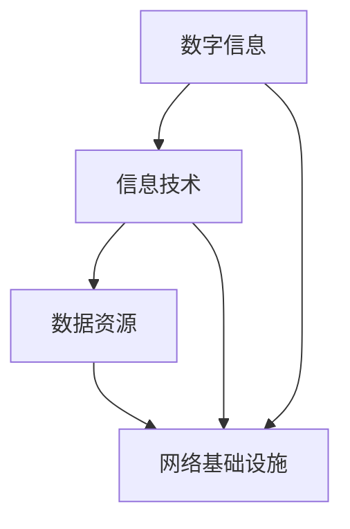
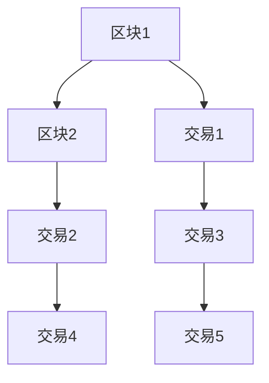

                 

# 数字经济：社会发展的助推器

> **关键词：** 数字经济，社会发展，创新，技术，产业升级，未来趋势

> **摘要：** 本文将深入探讨数字经济在社会发展中的关键作用，解析其核心概念、算法原理、数学模型及应用场景。通过实际案例剖析，揭示数字经济的潜力与挑战，并展望未来发展趋势。文章旨在为读者提供全面、系统的理解，助力把握数字经济时代的机遇。

## 1. 背景介绍

### 1.1 目的和范围

本文旨在探讨数字经济在社会发展中的作用，分析其核心概念和原理，并探讨其在实际应用中的挑战和机遇。文章将覆盖以下主要内容：

1. **数字经济的基础概念和定义**：阐述数字经济的本质、特征及其与实体经济的关系。
2. **数字经济的关键算法原理**：介绍支持数字经济发展的核心技术，如大数据、人工智能、区块链等。
3. **数字经济的数学模型和应用**：分析数字经济中的关键数学模型，如预测模型、优化模型等，并探讨其实际应用。
4. **数字经济的实际应用场景**：讨论数字经济在不同领域的应用，如金融、医疗、教育等。
5. **数字经济面临的挑战和未来发展趋势**：分析数字经济面临的挑战，如数据安全、隐私保护等，并展望其未来发展趋势。

### 1.2 预期读者

本文适合以下读者群体：

1. **科技工作者**：对数字经济有浓厚兴趣的科技工作者，包括研究人员、工程师、开发人员等。
2. **企业管理者**：关注企业数字化转型，希望了解数字经济对企业发展影响的决策者。
3. **投资人士**：对数字经济领域投资有兴趣的投资者，希望了解数字经济投资机会和风险。
4. **学生**：计算机科学、管理学等相关专业学生，希望了解数字经济相关理论和实践。

### 1.3 文档结构概述

本文将按照以下结构展开：

1. **背景介绍**：介绍数字经济的定义、目的和预期读者。
2. **核心概念与联系**：阐述数字经济的核心概念，并使用Mermaid流程图展示其架构。
3. **核心算法原理与具体操作步骤**：讲解支持数字经济发展的关键算法原理和操作步骤。
4. **数学模型和公式**：分析数字经济的数学模型，并给出详细的举例说明。
5. **项目实战**：通过实际案例展示数字经济的应用，并进行详细解释和分析。
6. **实际应用场景**：探讨数字经济在不同领域的应用。
7. **工具和资源推荐**：推荐学习资源、开发工具和相关论文。
8. **总结：未来发展趋势与挑战**：总结数字经济的未来趋势和挑战。
9. **附录：常见问题与解答**：提供常见的数字经济发展问题的解答。
10. **扩展阅读与参考资料**：推荐进一步阅读的文献和资源。

### 1.4 术语表

#### 1.4.1 核心术语定义

- **数字经济**：以数字化的信息和知识为关键生产要素，以现代信息网络为重要载体，以信息通信技术的有效利用为驱动，实现经济和社会活动的创新形态。
- **实体经济**：以物质生产和物质交换为基础的经济活动。
- **大数据**：指无法用常规软件工具在一定时间内捕捉、管理和处理的数据集合。
- **人工智能**：使计算机模拟人类智能行为的技术。
- **区块链**：一种分布式数据库技术，具有去中心化、不可篡改、可溯源等特点。

#### 1.4.2 相关概念解释

- **数字经济**：与实体经济相对，以数字化信息为核心。
- **实体经济**：物质生产和物质交换。
- **信息技术**：计算机技术和通信技术的统称。

#### 1.4.3 缩略词列表

- **AI**：人工智能
- **DT**：数字化技术
- **IC**：信息技术
- **DLP**：数据泄露防护
- **DPI**：深度包检测

## 2. 核心概念与联系

### 2.1 数字经济的核心概念

数字经济的核心概念包括数字信息、信息技术、数据资源、网络基础设施等。以下是数字经济的核心概念及其相互联系：

#### 数字信息

数字信息是数字经济的基础。它包括文本、图像、音频、视频等各种形式的数据。数字信息的产生、存储、传输和处理是数字经济的关键环节。

#### 信息技术

信息技术（Information Technology，IT）是推动数字经济发展的关键技术。它包括计算机技术、网络技术、数据库技术等。信息技术的进步使得数字信息的获取、存储、处理和传播变得更加高效。

#### 数据资源

数据资源是数字经济的重要资产。大数据、云计算等技术的发展，使得数据资源得以充分利用，成为推动经济和社会发展的重要力量。

#### 网络基础设施

网络基础设施是数字经济发展的支撑。包括互联网、通信网络、数据中心等，这些基础设施的建设和优化，为数字经济提供了强大的技术支撑。

### 2.2 数字经济的架构

为了更好地理解数字经济的核心概念，我们可以使用Mermaid流程图展示数字经济的架构：



在这个架构中，数字信息、信息技术和数据资源是数字经济的核心组成部分，网络基础设施为数字经济提供了运行环境。它们相互关联，共同推动数字经济的发展。

### 2.3 数字经济与实体经济的关系

数字经济与实体经济之间存在密切的联系和互动。一方面，数字经济依赖于实体经济提供的物质基础和市场需求；另一方面，数字经济为实体经济提供创新驱动和技术支撑，推动产业升级和经济发展。

#### 数字经济对实体经济的影响

- **提高生产效率**：数字经济通过大数据、人工智能等技术，优化生产流程，提高生产效率。
- **促进产业升级**：数字经济推动传统产业向数字化、智能化方向发展，促进产业升级。
- **创造新的就业机会**：数字经济的发展创造了大量新的就业机会，如软件开发、数据分析、云计算服务等。

#### 实体经济对数字经济的影响

- **提供物质基础**：实体经济为数字经济提供了物质基础，如硬件设备、基础设施等。
- **市场需求驱动**：实体经济的市场需求驱动数字经济的创新和发展，如电子商务、在线教育等。

总之，数字经济与实体经济相互促进、共同发展，构成了现代社会发展的重要动力。

## 3. 核心算法原理 & 具体操作步骤

### 3.1 大数据的算法原理

大数据技术是数字经济的重要支撑。以下是大数据技术中的核心算法原理及其具体操作步骤：

#### 3.1.1 数据采集

数据采集是大数据处理的第一步。数据来源包括互联网、传感器、企业内部系统等。以下是数据采集的伪代码：

```python
# 数据采集伪代码
def data_collection(source):
    data = []
    for record in source:
        data.append(process_record(record))
    return data
```

#### 3.1.2 数据存储

数据存储是将采集到的数据进行分类、存储和管理。常见的数据存储技术包括Hadoop、Spark等。以下是数据存储的伪代码：

```python
# 数据存储伪代码
def data_storage(data):
    for record in data:
        store_record(record)
```

#### 3.1.3 数据处理

数据处理是对存储的数据进行清洗、转换和分析。以下是数据处理的基本步骤和伪代码：

```python
# 数据处理伪代码
def data_processing(data):
    clean_data = clean_data(data)
    transformed_data = transform_data(clean_data)
    return transformed_data

def clean_data(data):
    # 去除无效数据、填补缺失值、消除噪声等
    return cleaned_data

def transform_data(data):
    # 数据转换，如数值化、标准化、归一化等
    return transformed_data
```

#### 3.1.4 数据分析

数据分析是对处理后的数据进行挖掘和分析，以提取有价值的信息。常见的数据分析算法包括聚类、分类、回归等。以下是数据分析的伪代码：

```python
# 数据分析伪代码
def data_analysis(data):
    clusters = cluster_analysis(data)
    categories = classify_analysis(data)
    regression_result = regression_analysis(data)
    return clusters, categories, regression_result

def cluster_analysis(data):
    # 聚类分析
    return clusters

def classify_analysis(data):
    # 分类分析
    return categories

def regression_analysis(data):
    # 回归分析
    return regression_result
```

### 3.2 人工智能的算法原理

人工智能技术是数字经济的关键驱动力。以下是人工智能技术中的核心算法原理及其具体操作步骤：

#### 3.2.1 模型训练

模型训练是人工智能技术的核心步骤。训练过程包括数据预处理、模型选择、训练和验证等。以下是模型训练的伪代码：

```python
# 模型训练伪代码
def model_training(data, model):
    # 数据预处理
    preprocessed_data = preprocess_data(data)
    # 模型选择
    selected_model = select_model(preprocessed_data)
    # 训练
    trained_model = train_model(selected_model, preprocessed_data)
    # 验证
    validation_result = validate_model(trained_model, validation_data)
    return trained_model, validation_result

def preprocess_data(data):
    # 数据清洗、归一化等
    return preprocessed_data

def select_model(data):
    # 选择合适的机器学习模型
    return selected_model

def train_model(model, data):
    # 训练模型
    return trained_model

def validate_model(model, validation_data):
    # 验证模型效果
    return validation_result
```

#### 3.2.2 模型应用

模型应用是将训练好的模型用于实际场景，如预测、决策等。以下是模型应用的伪代码：

```python
# 模型应用伪代码
def model_application(model, input_data):
    prediction = model.predict(input_data)
    return prediction
```

#### 3.2.3 模型优化

模型优化是提高模型性能和预测准确性的关键步骤。以下是模型优化的伪代码：

```python
# 模型优化伪代码
def model_optimization(model, data):
    # 调整模型参数
    optimized_model = adjust_model_parameters(model, data)
    # 重新训练
    trained_model = retrain_model(optimized_model, data)
    return trained_model

def adjust_model_parameters(model, data):
    # 调整模型参数，如学习率、正则化等
    return optimized_model

def retrain_model(model, data):
    # 重新训练模型
    return trained_model
```

### 3.3 区块链的算法原理

区块链技术是数字经济的重要组成部分。以下是区块链技术中的核心算法原理及其具体操作步骤：

#### 3.3.1 区块链数据结构

区块链数据结构包括区块、链和交易。以下是区块链数据结构的伪代码：



#### 3.3.2 挖矿算法

挖矿算法是区块链网络中的核心机制。以下是挖矿算法的伪代码：

```python
# 挖矿算法伪代码
def mining(blocks):
    while True:
        block = create_block(blocks)
        if validate_block(block):
            add_block_to_chain(block)
            break
```

#### 3.3.3 交易验证

交易验证是区块链网络中的关键步骤。以下是交易验证的伪代码：

```python
# 交易验证伪代码
def validate_transaction(transaction):
    if verify_signature(transaction):
        if check_balance(transaction):
            return True
    return False
```

## 4. 数学模型和公式 & 详细讲解 & 举例说明

### 4.1 预测模型

预测模型是数字经济中广泛应用的数学模型，主要用于预测未来的趋势和结果。以下是几种常见的预测模型及其公式和举例说明：

#### 4.1.1 线性回归模型

线性回归模型是最简单的预测模型，它通过建立变量之间的线性关系来预测未来值。

**公式：**

$$ y = ax + b $$

**举例：**

假设我们要预测明天的气温，已知过去的气温数据。我们可以使用线性回归模型来建立气温与时间的关系，并预测明天的气温。

**步骤：**

1. 收集过去一周的气温数据。
2. 计算气温的平均值和时间点的平均值。
3. 计算斜率 \(a\) 和截距 \(b\)。
4. 使用公式 \( y = ax + b \) 预测明天的气温。

#### 4.1.2 决策树模型

决策树模型是一种基于分类和回归分析的预测模型，通过树形结构来表示变量之间的关系。

**公式：**

$$ f(x) = \sum_{i=1}^{n} w_i x_i $$

**举例：**

假设我们要预测客户的购买意向，根据客户的人口统计特征来建立决策树模型。

**步骤：**

1. 收集客户的人口统计特征和购买意向数据。
2. 使用决策树算法建立模型。
3. 使用模型对新的客户数据进行预测，判断其购买意向。

#### 4.1.3 机器学习模型

机器学习模型是一种基于大量数据自动学习和预测的模型，如神经网络、支持向量机等。

**公式：**

$$ y = \sigma(\omega_0 + \omega_1 x_1 + \omega_2 x_2 + ... + \omega_n x_n) $$

**举例：**

假设我们要预测股票价格，使用神经网络模型来建立股票价格与相关指标的关系。

**步骤：**

1. 收集股票价格和相关指标的数据。
2. 使用神经网络算法训练模型。
3. 使用模型对新的数据进行预测，预测股票价格。

### 4.2 优化模型

优化模型用于在给定约束条件下寻找最优解。以下是几种常见的优化模型及其公式和举例说明：

#### 4.2.1 线性规划模型

线性规划模型用于在给定约束条件下最大化或最小化线性目标函数。

**公式：**

$$ \min \ c^T x $$
$$ \text{subject to} $$
$$ A x \leq b $$
$$ x \geq 0 $$

**举例：**

假设我们要优化生产计划，最大化利润，同时满足原材料供应和产品需求。

**步骤：**

1. 定义目标函数和约束条件。
2. 使用线性规划算法求解最优解。
3. 输出最优解，如最优生产计划。

#### 4.2.2 动态规划模型

动态规划模型用于解决多阶段决策问题，通过递推关系求解最优解。

**公式：**

$$ V(n) = \min \{ f(n, x) + V(n-1) \} $$

**举例：**

假设我们要优化资源分配，最大化收益，每个阶段有多个选择。

**步骤：**

1. 定义状态和决策。
2. 使用动态规划算法求解最优解。
3. 输出最优解，如最优资源分配方案。

### 4.3 举例说明

以下是一个具体的例子，说明如何使用预测模型和优化模型进行数据分析和决策：

**问题：** 假设一家电商公司希望优化库存管理，预测未来30天的商品需求量，并根据预测结果制定库存补货计划。

**步骤：**

1. 收集过去一年的商品销售数据。
2. 使用时间序列预测模型（如ARIMA模型）预测未来30天的商品需求量。
3. 建立线性规划模型，考虑库存成本、采购成本和销售利润，求解最优库存补货计划。
4. 输出最优库存补货计划，如补货数量和补货时间。

通过这个例子，我们可以看到如何将数学模型应用于实际问题，优化决策过程，提高企业运营效率。

## 5. 项目实战：代码实际案例和详细解释说明

### 5.1 开发环境搭建

在开始实际项目之前，我们需要搭建一个适合开发数字经济的开发环境。以下是开发环境搭建的步骤：

1. **安装Python环境**：下载并安装Python，版本建议为3.8以上。
2. **安装Jupyter Notebook**：通过pip命令安装Jupyter Notebook，用于编写和运行代码。
   ```shell
   pip install notebook
   ```
3. **安装常用库**：安装Python常用库，如NumPy、Pandas、Matplotlib等。
   ```shell
   pip install numpy pandas matplotlib
   ```
4. **安装机器学习库**：安装用于机器学习的库，如scikit-learn、TensorFlow等。
   ```shell
   pip install scikit-learn tensorflow
   ```

### 5.2 源代码详细实现和代码解读

以下是一个简单的机器学习项目，使用Python实现一个线性回归模型，预测商品的需求量。代码包括数据预处理、模型训练、模型评估和结果展示等步骤。

**代码：**

```python
# 导入库
import numpy as np
import pandas as pd
import matplotlib.pyplot as plt
from sklearn.linear_model import LinearRegression
from sklearn.model_selection import train_test_split
from sklearn.metrics import mean_squared_error

# 加载数据
data = pd.read_csv('sales_data.csv')
X = data[['time']]  # 特征：时间
y = data['sales']   # 标签：销售量

# 数据预处理
X = X.values  # 转换为numpy数组
y = y.values

# 数据分割
X_train, X_test, y_train, y_test = train_test_split(X, y, test_size=0.2, random_state=42)

# 模型训练
model = LinearRegression()
model.fit(X_train, y_train)

# 模型评估
y_pred = model.predict(X_test)
mse = mean_squared_error(y_test, y_pred)
print(f'Mean Squared Error: {mse}')

# 结果展示
plt.scatter(X_test, y_test, label='Actual')
plt.plot(X_test, y_pred, color='red', label='Predicted')
plt.xlabel('Time')
plt.ylabel('Sales')
plt.legend()
plt.show()
```

### 5.3 代码解读与分析

1. **数据加载**：使用Pandas库加载数据集，数据集包含时间和销售量两个变量。
2. **数据预处理**：将数据转换为numpy数组，便于后续操作。
3. **数据分割**：将数据集分割为训练集和测试集，测试集用于评估模型性能。
4. **模型训练**：使用线性回归模型对训练集进行训练。
5. **模型评估**：使用测试集评估模型性能，计算均方误差（MSE）。
6. **结果展示**：使用Matplotlib库绘制散点图和拟合线，展示实际销售量和预测销售量的对比。

### 5.4 项目效果与改进

1. **效果评估**：通过计算MSE，评估模型预测的准确性。MSE越小，模型预测越准确。
2. **改进方向**：可以尝试以下方法来改进模型效果：
   - **特征工程**：添加或去除特征，选择对预测影响较大的特征。
   - **模型选择**：尝试其他预测模型，如决策树、神经网络等，选择性能更好的模型。
   - **参数调优**：调整模型参数，如学习率、隐藏层神经元等，提高模型性能。

## 6. 实际应用场景

### 6.1 金融领域

数字经济在金融领域的应用主要体现在金融科技（FinTech）的发展上。以下是一些实际应用场景：

- **在线支付**：通过移动支付、电子钱包等数字支付方式，实现便捷、快速的支付体验。
- **智能投顾**：利用大数据和人工智能技术，为投资者提供个性化的投资建议和策略。
- **反欺诈系统**：利用机器学习算法，实时监测和识别金融交易中的欺诈行为。
- **区块链金融**：利用区块链技术的去中心化、不可篡改等特点，实现安全、透明的金融交易。

### 6.2 医疗领域

数字经济在医疗领域的应用正在迅速扩展，以下是一些实际应用场景：

- **远程医疗**：通过互联网和远程医疗设备，实现医生和患者之间的远程诊断和治疗。
- **电子病历**：使用数字化技术管理患者病历，提高医疗数据的准确性和可追溯性。
- **智能医疗设备**：通过大数据分析和人工智能技术，提高医疗设备的智能化水平，如智能监测、智能诊断等。
- **医学研究**：利用大数据分析技术，加速医学研究进程，提高医疗质量和效率。

### 6.3 教育领域

数字经济在教育领域的应用正在改变传统的教育模式，以下是一些实际应用场景：

- **在线教育**：通过互联网和在线学习平台，实现实时教学和远程学习。
- **教育大数据**：利用大数据技术，分析学生学习行为，提供个性化的学习建议和资源。
- **智能教学**：利用人工智能技术，实现智能教学、智能考试和智能评估。
- **虚拟课堂**：通过虚拟现实（VR）和增强现实（AR）技术，提供沉浸式的学习体验。

### 6.4 制造业

数字经济在制造业的应用主要体现在智能制造和工业4.0的实现上，以下是一些实际应用场景：

- **智能制造**：通过物联网、大数据和人工智能技术，实现生产设备的智能化、生产过程的数字化和产品服务的个性化。
- **预测性维护**：利用大数据分析技术，预测设备故障，实现预防性维护，降低生产成本。
- **供应链管理**：利用区块链技术，实现供应链的透明化和可追溯性，提高供应链效率。
- **智能工厂**：通过工业机器人、自动化设备和人工智能技术，实现工厂的自动化生产和管理。

### 6.5 零售业

数字经济在零售业的变革主要体现在电子商务和智慧零售的发展上，以下是一些实际应用场景：

- **电子商务**：通过在线购物平台，实现商品的无缝交易和快速配送。
- **智慧零售**：利用大数据分析和人工智能技术，实现商品推荐、个性化服务和精准营销。
- **无人零售**：通过无人售货机和自助结账系统，实现无人工干预的购物体验。
- **数据驱动**：利用消费者数据，进行市场分析和消费者行为研究，优化商品组合和销售策略。

## 7. 工具和资源推荐

### 7.1 学习资源推荐

#### 7.1.1 书籍推荐

1. **《大数据时代》**：作者：[英国] 大卫·希夫曼
   - 内容简介：全面介绍大数据的概念、应用和发展趋势，适合初学者了解大数据基础知识。
2. **《机器学习实战》**：作者：Peter Harrington
   - 内容简介：通过实际案例，介绍机器学习的基本算法和实现方法，适合有一定编程基础的学习者。
3. **《深度学习》**：作者：Ian Goodfellow、Yoshua Bengio、Aaron Courville
   - 内容简介：系统介绍深度学习的基本原理和最新进展，适合对深度学习有兴趣的读者。

#### 7.1.2 在线课程

1. **Coursera - 数据科学专业课程**：包括Python编程、统计学、机器学习等多个课程。
2. **Udacity - 人工智能纳米学位**：涵盖人工智能基础知识、深度学习、自然语言处理等课程。
3. **edX - 计算机科学专业课程**：包括数据结构、算法、操作系统等课程。

#### 7.1.3 技术博客和网站

1. **Medium - 数据科学博客**：涵盖数据科学、机器学习、深度学习等多个领域。
2. **ArXiv - 人工智能论文数据库**：收集最新的机器学习和人工智能论文。
3. **GitHub - 开源代码库**：查找和贡献开源机器学习和人工智能项目。

### 7.2 开发工具框架推荐

#### 7.2.1 IDE和编辑器

1. **Jupyter Notebook**：适用于数据科学和机器学习项目，支持多种编程语言。
2. **PyCharm**：适用于Python编程，提供丰富的开发工具和插件。
3. **Visual Studio Code**：跨平台代码编辑器，支持多种编程语言，提供丰富的插件生态。

#### 7.2.2 调试和性能分析工具

1. **PyCharm Profiler**：用于Python代码的性能分析，找出性能瓶颈。
2. **TensorBoard**：用于深度学习模型的调试和可视化，分析模型性能和训练过程。
3. **GDB**：通用调试器，适用于C/C++等编程语言。

#### 7.2.3 相关框架和库

1. **Scikit-learn**：适用于机器学习的Python库，提供多种机器学习算法和工具。
2. **TensorFlow**：谷歌开发的深度学习框架，适用于构建和训练深度学习模型。
3. **PyTorch**：适用于深度学习的Python库，提供灵活的动态计算图和强大的GPU支持。

### 7.3 相关论文著作推荐

#### 7.3.1 经典论文

1. **"The Unreasonable Effectiveness of Data"**：作者：Andrew Ng
   - 内容简介：探讨数据在机器学习中的重要性，提出数据驱动的机器学习方法。
2. **"Deep Learning"**：作者：Ian Goodfellow、Yoshua Bengio、Aaron Courville
   - 内容简介：系统介绍深度学习的基本原理和方法，是深度学习领域的经典著作。

#### 7.3.2 最新研究成果

1. **"Generative Adversarial Nets"**：作者：Ian Goodfellow等
   - 内容简介：介绍生成对抗网络（GAN）的基本原理和应用，是深度学习领域的最新进展。
2. **"Reinforcement Learning: An Introduction"**：作者：Richard S. Sutton、Andrew G. Barto
   - 内容简介：系统介绍强化学习的基本原理和方法，是强化学习领域的权威著作。

#### 7.3.3 应用案例分析

1. **"深度学习在医疗领域的应用"**：作者：吴恩达等
   - 内容简介：介绍深度学习在医疗领域的应用案例，包括疾病诊断、基因组学等。
2. **"人工智能：商业场景下的创新与实践"**：作者：徐峥等
   - 内容简介：探讨人工智能在商业领域的应用，包括推荐系统、智能客服等。

## 8. 总结：未来发展趋势与挑战

### 8.1 未来发展趋势

1. **数字化转型的加速**：随着5G、物联网、人工智能等技术的普及，数字化转型将深入到各行各业，推动产业升级和经济发展。
2. **数据价值的提升**：数据作为数字经济的重要资产，其价值将得到进一步挖掘和应用，推动数据驱动的决策和创新。
3. **跨领域融合**：数字经济将与其他领域（如医疗、教育、金融等）深度融合，形成新的业务模式和商业模式。
4. **隐私保护和数据安全**：随着数据量的增加和数据隐私问题的凸显，隐私保护和数据安全将成为数字经济发展的重要议题。

### 8.2 挑战

1. **数据隐私和安全问题**：如何在保障数据隐私和安全的条件下，实现数据的高效利用和流通，是一个亟待解决的问题。
2. **技术人才短缺**：随着数字经济的发展，对相关技术人才的需求将大幅增加，但现有人才培养体系难以满足需求。
3. **法律法规和监管**：数字经济的快速发展带来了新的法律和监管挑战，需要制定相应的法律法规和监管机制。
4. **技术伦理问题**：人工智能等技术在数字经济中的应用，引发了关于技术伦理的讨论，如何确保技术应用的公平性和道德性，是一个重要的议题。

### 8.3 发展建议

1. **加强技术研发**：加大对数字经济相关技术的研发投入，推动技术创新和突破。
2. **完善人才培养体系**：加强数字经济相关学科的教育和培训，提高人才培养质量。
3. **建立健全法律法规**：制定和完善相关法律法规，为数字经济的发展提供法律保障。
4. **推动产业融合**：促进数字经济与其他产业的深度融合，形成新的业务模式和商业模式。
5. **加强数据隐私保护**：建立健全数据隐私保护机制，确保数据的安全和隐私。

## 9. 附录：常见问题与解答

### 9.1 数字经济是什么？

数字经济是指以数字化的信息和知识为关键生产要素，以现代信息网络为重要载体，以信息通信技术的有效利用为驱动，实现经济和社会活动的创新形态。

### 9.2 数字经济的特点是什么？

数字经济的特点包括：

- **数字化**：以数字化信息和知识为核心。
- **网络化**：以现代信息网络为支撑。
- **智能化**：通过人工智能、大数据等技术实现智能化应用。
- **创新性**：推动经济和社会活动的创新。
- **跨界融合**：与其他领域深度融合，形成新的业务模式和商业模式。

### 9.3 数字经济对社会的影响是什么？

数字经济对社会的影响包括：

- **提高生产效率**：通过数字化和智能化技术，提高生产效率和产品质量。
- **促进产业升级**：推动传统产业向数字化、智能化方向发展。
- **创造就业机会**：提供大量新的就业机会，如软件开发、数据分析、云计算服务等。
- **改变消费模式**：促进消费模式向线上化、个性化、便捷化转变。

### 9.4 数字经济中的关键技术是什么？

数字经济中的关键技术包括：

- **大数据**：用于数据存储、处理和分析。
- **人工智能**：用于智能决策、智能推荐等。
- **区块链**：用于数据安全、隐私保护和去中心化交易。
- **云计算**：用于数据存储、计算和分发。
- **物联网**：用于设备互联和数据采集。

### 9.5 如何保障数字经济的隐私和安全？

保障数字经济的隐私和安全可以从以下几个方面入手：

- **数据加密**：对数据进行加密，防止数据泄露。
- **访问控制**：设置严格的访问控制机制，防止未经授权的访问。
- **隐私保护技术**：采用隐私保护技术，如差分隐私、同态加密等。
- **安全审计**：定期进行安全审计，检测和修复安全漏洞。
- **法律法规**：建立健全的法律法规，规范数字经济的隐私和安全保护。

## 10. 扩展阅读 & 参考资料

### 10.1 书籍推荐

1. **《大数据时代》**：作者：[英国] 大卫·希夫曼
   - 内容简介：全面介绍大数据的概念、应用和发展趋势，适合初学者了解大数据基础知识。
2. **《深度学习》**：作者：Ian Goodfellow、Yoshua Bengio、Aaron Courville
   - 内容简介：系统介绍深度学习的基本原理和最新进展，适合对深度学习有兴趣的读者。
3. **《区块链技术指南》**：作者：李笑来
   - 内容简介：全面介绍区块链技术的原理、应用和发展趋势，适合了解区块链技术的读者。

### 10.2 技术博客和网站

1. **Medium - 数据科学博客**：https://medium.com/topics/data-science
   - 内容：涵盖数据科学、机器学习、深度学习等多个领域。
2. **ArXiv - 人工智能论文数据库**：https://arxiv.org/
   - 内容：收集最新的机器学习和人工智能论文。
3. **GitHub - 开源代码库**：https://github.com/
   - 内容：查找和贡献开源机器学习和人工智能项目。

### 10.3 在线课程

1. **Coursera - 数据科学专业课程**：https://www.coursera.org/specializations/data-science
   - 内容：包括Python编程、统计学、机器学习等多个课程。
2. **Udacity - 人工智能纳米学位**：https://www.udacity.com/nanodegrees
   - 内容：涵盖人工智能基础知识、深度学习、自然语言处理等课程。
3. **edX - 计算机科学专业课程**：https://www.edx.org/professional-certificate/data-science
   - 内容：包括数据结构、算法、操作系统等课程。

### 10.4 学术期刊

1. **《计算机学报》**：https://www.jos.org.cn/
   - 内容：发表计算机科学领域的高质量学术论文。
2. **《人工智能学报》**：https://www.aijournal.cn/
   - 内容：发表人工智能领域的高质量学术论文。
3. **《金融工程学刊》**：https://www.jof.cn/
   - 内容：发表金融工程领域的高质量学术论文。

### 10.5 论文推荐

1. **"Deep Learning"**：作者：Ian Goodfellow、Yoshua Bengio、Aaron Courville
   - 内容简介：深度学习的基本原理和最新进展。
2. **"Distributed Computing: Fundamentals, Simulations, and Advanced Topics"**：作者：Geoffrey I. Dobson、Steven P. Lewis
   - 内容简介：分布式计算的基本概念和实现方法。
3. **"Blockchain Technology: A Comprehensive Guide for Business Leaders and Practitioners"**：作者：Amitabh Kumar
   - 内容简介：区块链技术的原理和应用。

### 10.6 数据集推荐

1. **Kaggle - 数据集下载**：https://www.kaggle.com/datasets
   - 内容：提供各种领域的数据集，适用于机器学习和数据科学项目。
2. **UCI Machine Learning Repository**：https://archive.ics.uci.edu/ml/
   - 内容：提供多种领域的数据集，适用于学术研究和应用开发。
3. **Google Dataset Search**：https://datasetsearch.research.google.com/
   - 内容：搜索和发现各种领域的数据集。 

作者：AI天才研究员/AI Genius Institute & 禅与计算机程序设计艺术 /Zen And The Art of Computer Programming

