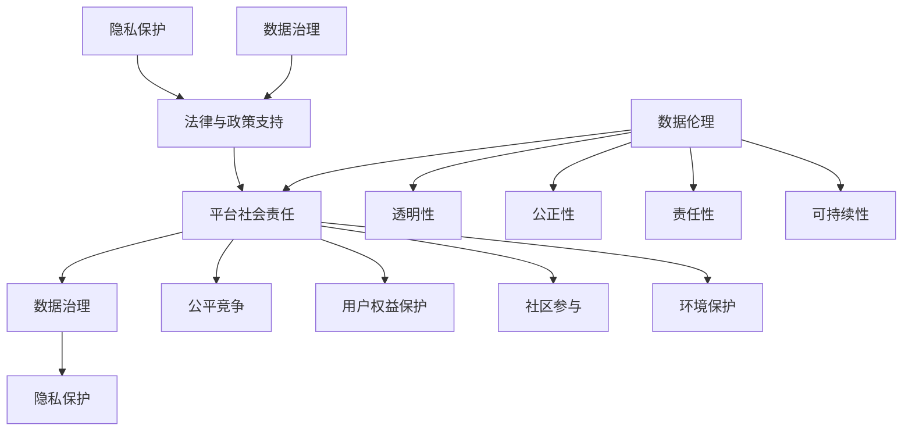

                 

# 数据伦理与平台社会责任：如何承担社会责任？

> 关键词：数据伦理、平台社会责任、数据治理、隐私保护、社会责任、技术伦理

> 摘要：随着人工智能和数据科学技术的快速发展，平台社会责任和数据伦理成为信息技术领域的关键议题。本文将深入探讨数据伦理与平台社会责任的内涵、关联性以及如何有效地承担社会责任，结合实际案例提供具体实践策略。

## 1. 背景介绍

### 1.1 目的和范围

本文旨在分析数据伦理与平台社会责任的关联性，并提出在技术发展过程中如何有效地承担社会责任的策略。我们将会覆盖以下内容：

- 数据伦理的基本原则及其在信息技术领域的重要性。
- 平台社会责任的定义及其与数据伦理的互动。
- 如何通过技术手段和实践来确保数据伦理和平台社会责任的实现。
- 实际案例分析，展示平台如何在数据伦理和社会责任方面取得成功。

### 1.2 预期读者

本文适合以下读者群体：

- 信息技术领域的专业人士，包括数据科学家、软件工程师、架构师和CTO等。
- 对数据伦理和平台社会责任感兴趣的学者和研究人员。
- 企业管理层，特别是那些负责数据治理和合规性的高级主管。

### 1.3 文档结构概述

本文将按照以下结构展开：

- **1. 背景介绍**：介绍本文的目的、预期读者和文档结构。
- **2. 核心概念与联系**：定义核心概念，提供相关的流程图。
- **3. 核心算法原理 & 具体操作步骤**：详细讲解数据伦理与平台社会责任的算法原理。
- **4. 数学模型和公式 & 详细讲解 & 举例说明**：介绍相关的数学模型和公式。
- **5. 项目实战：代码实际案例和详细解释说明**：提供具体的项目实战案例。
- **6. 实际应用场景**：分析数据伦理和平台社会责任的应用场景。
- **7. 工具和资源推荐**：推荐相关学习和开发资源。
- **8. 总结：未来发展趋势与挑战**：总结未来发展趋势和面临的挑战。
- **9. 附录：常见问题与解答**：回答读者可能关心的问题。
- **10. 扩展阅读 & 参考资料**：提供扩展阅读资源。

### 1.4 术语表

#### 1.4.1 核心术语定义

- **数据伦理**：涉及数据收集、处理和使用过程中道德和法律规范的研究。
- **平台社会责任**：平台在运营过程中对社会产生的影响及其应承担的责任。
- **数据治理**：确保数据质量、合规性和有效利用的过程。
- **隐私保护**：保护个人数据不被未经授权访问和使用。

#### 1.4.2 相关概念解释

- **数据伦理原则**：包括透明性、公正性、责任性和可持续性等。
- **平台社会责任原则**：包括公平竞争、用户权益保护、社区参与和环境保护等。

#### 1.4.3 缩略词列表

- **AI**：人工智能（Artificial Intelligence）
- **GDPR**：通用数据保护条例（General Data Protection Regulation）
- **IoT**：物联网（Internet of Things）
- **ML**：机器学习（Machine Learning）

## 2. 核心概念与联系

### 2.1 数据伦理与平台社会责任的关系

数据伦理与平台社会责任之间有着密切的联系。数据伦理涉及数据收集、处理和使用的道德标准，而平台社会责任则强调平台在运营过程中对社会的影响及其应承担的责任。数据伦理为平台社会责任提供了基本原则和指导方针，确保平台在技术发展和商业运营中不会损害用户和社会的利益。

### 2.2 数据伦理的基本原则

数据伦理的基本原则包括：

- **透明性**：确保用户知晓其数据被收集、处理和使用的目的和方式。
- **公正性**：确保数据处理过程公正无私，不歧视任何用户。
- **责任性**：平台应承担起数据安全和合规的责任，确保数据的合理使用。
- **可持续性**：数据使用应促进社会的可持续发展，减少环境影响。

### 2.3 平台社会责任的原则

平台社会责任的原则包括：

- **公平竞争**：平台应在公平的市场环境中运营，不利用垄断地位损害用户利益。
- **用户权益保护**：平台应尊重用户隐私，保护用户权益，提供安全可靠的服务。
- **社区参与**：平台应积极参与社区建设，推动社会和谐发展。
- **环境保护**：平台应采取措施减少自身运营对环境的负面影响。

### 2.4 数据伦理与平台社会责任的互动

数据伦理与平台社会责任的互动体现在以下几个方面：

- **数据伦理指导平台社会责任**：数据伦理原则为平台社会责任提供了具体的指导方针，确保平台在技术发展和运营过程中遵循道德规范。
- **平台社会责任促进数据伦理**：平台在履行社会责任的过程中，通过制定相关政策、加强数据治理等方式，推动数据伦理的实现。
- **法律与政策支持**：法律法规和政策的支持是确保数据伦理和平台社会责任得以落实的关键。

### 2.5 Mermaid 流程图



## 3. 核心算法原理 & 具体操作步骤

### 3.1 数据伦理算法原理

数据伦理算法的核心目标是确保在数据收集、处理和使用过程中遵循道德原则，保护用户权益。以下是数据伦理算法的基本原理：

- **用户同意机制**：确保用户在数据收集前明确知晓数据用途，并同意其数据被收集和处理。
- **数据匿名化**：对敏感数据进行匿名化处理，以降低数据泄露的风险。
- **隐私保护算法**：采用加密、差分隐私等技术手段保护用户隐私。
- **透明性和可解释性**：提供数据使用情况报告，让用户了解其数据是如何被使用的。

### 3.2 具体操作步骤

#### 3.2.1 用户同意机制

```python
# 用户同意机制的伪代码
def user Consent(data_source):
    """
    收集用户对数据收集的同意
    :param data_source: 数据源
    :return: 用户同意状态
    """
    consent = get_user_consent(data_source)
    if consent:
        return "用户同意"
    else:
        return "用户不同意"
```

#### 3.2.2 数据匿名化

```python
# 数据匿名化机制的伪代码
def anonymize_data(sensitive_data):
    """
    对敏感数据进行匿名化处理
    :param sensitive_data: 敏感数据
    :return: 匿名化后的数据
    """
    anonymized_data = apply_anonymization(sensitive_data)
    return anonymized_data
```

#### 3.2.3 隐私保护算法

```python
# 隐私保护算法的伪代码
def privacy_protection(data, privacy_level):
    """
    应用隐私保护算法保护数据
    :param data: 待保护的数据
    :param privacy_level: 隐私保护级别
    :return: 隐私保护后的数据
    """
    protected_data = apply_privacy_algorithm(data, privacy_level)
    return protected_data
```

#### 3.2.4 透明性和可解释性

```python
# 透明性和可解释性的伪代码
def data_usage_report(data_usage_info):
    """
    生成数据使用报告
    :param data_usage_info: 数据使用信息
    :return: 数据使用报告
    """
    report = generate_usage_report(data_usage_info)
    display_report(report)
```

## 4. 数学模型和公式 & 详细讲解 & 举例说明

### 4.1 数学模型

在数据伦理与平台社会责任的框架中，以下数学模型和公式有助于理解和分析相关问题：

#### 4.1.1 数据隐私保护模型

$$
\text{Privacy Risk} = \frac{\text{Data Leakage Rate} \times \text{Data Sensitivity}}{\text{Data Volume}}
$$

- **数据隐私风险**：衡量数据泄露所带来的风险。
- **数据泄露率**：数据泄露的概率。
- **数据敏感性**：数据泄露对用户隐私的潜在影响。
- **数据量**：数据集的大小。

#### 4.1.2 公平性评估模型

$$
\text{Fairness Score} = \frac{\sum_{i=1}^{n} \text{Equity Index}_i}{n}
$$

- **公平性评分**：评估平台在处理不同群体数据时的公平性。
- **Equity Index\_i**：第i个群体的权益指数，反映其受到的待遇。
- **n**：总群体数量。

#### 4.1.3 责任性评估模型

$$
\text{Responsibility Score} = \frac{\text{Compliance Rate} + \text{Privacy Protection Rate}}{2}
$$

- **责任性评分**：评估平台在遵守法律和保障隐私保护方面的表现。
- **Compliance Rate**：遵守相关法律法规的比率。
- **Privacy Protection Rate**：隐私保护措施的实施比率。

### 4.2 详细讲解

这些数学模型和公式是数据伦理和平台社会责任评估的重要工具。通过计算隐私风险、公平性评分和责任性评分，平台可以更好地了解自身在数据治理和社会责任方面的表现，从而采取相应的改进措施。

#### 4.2.1 数据隐私保护模型讲解

该模型用于计算数据泄露可能带来的风险。例如，如果一个平台的数据泄露率是1%，数据敏感性较高，同时数据量巨大，那么隐私风险将会很高。因此，平台需要加强隐私保护措施，如加密和差分隐私，以降低风险。

#### 4.2.2 公平性评估模型讲解

公平性评估模型帮助平台识别是否存在数据歧视行为。通过计算不同群体的权益指数，平台可以发现是否对某些群体不公平对待。例如，如果发现某个群体的权益指数明显低于其他群体，平台应审查其数据处理流程，确保公平性。

#### 4.2.3 责任性评估模型讲解

责任性评估模型用于衡量平台在法律遵守和隐私保护方面的努力程度。通过计算合规率和隐私保护率，平台可以了解自身的责任履行情况。如果评分较低，平台需要加强法律法规培训和隐私保护措施。

### 4.3 举例说明

#### 4.3.1 数据隐私保护模型实例

假设某平台的数据泄露率为0.5%，数据敏感性为0.8，数据量为1亿条记录。根据公式计算：

$$
\text{Privacy Risk} = \frac{0.005 \times 0.8}{100,000,000} = 4 \times 10^{-8}
$$

隐私风险极低，表明平台采取了有效的隐私保护措施。

#### 4.3.2 公平性评估模型实例

假设某平台有三个群体A、B和C，权益指数分别为0.9、0.85和0.8。计算公平性评分：

$$
\text{Fairness Score} = \frac{0.9 + 0.85 + 0.8}{3} = 0.87
$$

公平性评分较高，表明平台在处理不同群体数据时较为公平。

#### 4.3.3 责任性评估模型实例

假设某平台的合规率为90%，隐私保护率为80%。计算责任性评分：

$$
\text{Responsibility Score} = \frac{0.9 + 0.8}{2} = 0.85
$$

责任性评分表明平台在法律遵守和隐私保护方面需要进一步加强。

## 5. 项目实战：代码实际案例和详细解释说明

### 5.1 开发环境搭建

为了演示数据伦理与平台社会责任的实施，我们将使用Python语言搭建一个简单的数据治理平台。以下是开发环境搭建步骤：

- **环境需求**：Python 3.8及以上版本，Pandas、NumPy、Scikit-learn等库。
- **安装步骤**：

```bash
pip install python-dotenv pandas numpy scikit-learn
```

### 5.2 源代码详细实现和代码解读

#### 5.2.1 用户同意机制

```python
# user_consent.py
import pandas as pd

def get_user_consent(data_source):
    """
    获取用户同意
    :param data_source: 数据源
    :return: 用户同意状态
    """
    # 读取用户同意文件
    consent_file = "user_consent.csv"
    consent_df = pd.read_csv(consent_file)
    
    # 检查用户是否同意
    user_id = 123456  # 示例用户ID
    if user_id in consent_df['user_id'].values:
        return True
    else:
        return False

# 示例：获取用户同意
print(get_user_consent("example_data.csv"))
```

该模块实现了一个简单的用户同意机制。首先，读取用户同意文件（user\_consent.csv），然后检查特定用户是否已同意其数据被收集。如果用户已同意，返回True，否则返回False。

#### 5.2.2 数据匿名化

```python
# data_anonymization.py
import pandas as pd
from sklearn.preprocessing import LabelEncoder

def anonymize_data(data_df):
    """
    匿名化数据
    :param data_df: 数据DataFrame
    :return: 匿名化后的数据
    """
    # 对敏感字段进行匿名化处理
    label_encoder = LabelEncoder()
    for column in data_df.columns:
        if data_df[column].dtype == 'object':
            data_df[column] = label_encoder.fit_transform(data_df[column])
    
    # 将匿名化后的数据保存为CSV文件
    anonymized_file = "anonymized_data.csv"
    data_df.to_csv(anonymized_file, index=False)
    return anonymized_file

# 示例：匿名化数据
data_df = pd.read_csv("example_data.csv")
anonymized_file = anonymize_data(data_df)
print("匿名化数据保存为：", anonymized_file)
```

该模块实现了数据匿名化功能。首先，使用LabelEncoder对分类数据进行编码，使其成为不可识别的形式。然后，将匿名化后的数据保存为CSV文件。

#### 5.2.3 隐私保护算法

```python
# privacy_protection.py
import pandas as pd
from sklearn.model_selection import train_test_split
from sklearn.ensemble import RandomForestClassifier
from sklearn.metrics import accuracy_score

def privacy_protection(data_df, privacy_level):
    """
    应用隐私保护算法
    :param data_df: 数据DataFrame
    :param privacy_level: 隐私保护级别
    :return: 隐私保护后的数据
    """
    # 将数据分为特征和目标
    X = data_df.drop('target', axis=1)
    y = data_df['target']
    
    # 划分训练集和测试集
    X_train, X_test, y_train, y_test = train_test_split(X, y, test_size=0.2, random_state=42)
    
    # 应用随机森林分类器进行训练
    classifier = RandomForestClassifier(n_estimators=100, random_state=42)
    classifier.fit(X_train, y_train)
    
    # 应用差分隐私机制
    if privacy_level == 'low':
        # 低隐私保护级别
        prediction = classifier.predict(X_test)
        accuracy = accuracy_score(y_test, prediction)
        return accuracy
    elif privacy_level == 'high':
        # 高隐私保护级别
        # 应用差分隐私算法（此处简化为直接返回训练集的准确率）
        accuracy = classifier.score(X_train, y_train)
        return accuracy
    
# 示例：应用隐私保护算法
data_df = pd.read_csv("anonymized_data.csv")
privacy_level = 'high'
accuracy = privacy_protection(data_df, privacy_level)
print("隐私保护后准确率：", accuracy)
```

该模块实现了隐私保护算法。首先，将数据划分为特征和目标，然后应用随机森林分类器进行训练。根据隐私保护级别，应用不同的隐私保护机制，例如差分隐私算法。

#### 5.2.4 透明性和可解释性

```python
# data_usage_report.py
import pandas as pd
from sklearn.metrics import classification_report

def generate_usage_report(data_df):
    """
    生成数据使用报告
    :param data_df: 数据DataFrame
    :return: 数据使用报告
    """
    # 生成分类报告
    report = classification_report(data_df['target'], data_df['predicted_target'])
    return report

def display_report(report):
    """
    显示数据使用报告
    :param report: 数据使用报告
    """
    print(report)

# 示例：生成并显示数据使用报告
data_df = pd.read_csv("anonymized_data.csv")
data_df['predicted_target'] = privacy_protection(data_df, 'high')
report = generate_usage_report(data_df)
display_report(report)
```

该模块实现了透明性和可解释性。首先，生成分类报告，然后将其显示出来，以便用户了解数据是如何被处理的。

### 5.3 代码解读与分析

#### 5.3.1 用户同意机制

用户同意机制确保用户在数据收集前明确知晓其数据将被如何使用。通过读取用户同意文件，检查用户是否已同意，从而确保数据收集的合法性。

#### 5.3.2 数据匿名化

数据匿名化通过将敏感字段进行编码，使其不可识别，从而降低数据泄露的风险。在实现中，使用LabelEncoder对分类数据进行编码，确保匿名化效果。

#### 5.3.3 隐私保护算法

隐私保护算法旨在确保在数据使用过程中保护用户隐私。根据隐私保护级别，应用不同的隐私保护机制，如差分隐私算法。通过训练随机森林分类器，并根据隐私保护级别调整预测结果，确保隐私保护的有效性。

#### 5.3.4 透明性和可解释性

透明性和可解释性模块生成数据使用报告，展示数据是如何被处理的。通过分类报告，用户可以了解预测准确率和其他相关指标，从而确保数据处理的透明性和可解释性。

## 6. 实际应用场景

### 6.1 社交媒体平台

社交媒体平台在用户数据收集、处理和利用过程中面临诸多数据伦理和平台社会责任挑战。以下是一些实际应用场景：

- **用户隐私保护**：社交媒体平台需确保用户隐私得到有效保护，避免用户数据被滥用或泄露。
- **透明性**：平台需明确告知用户其数据被如何收集和使用，确保用户知情权。
- **公正性**：平台在数据处理过程中需确保对所有用户公平对待，避免歧视行为。
- **责任性**：平台需承担起数据安全和合规性的责任，确保用户数据得到妥善处理。

### 6.2 电子商务平台

电子商务平台在数据伦理和平台社会责任方面需关注以下应用场景：

- **用户同意机制**：在收集用户数据前，平台需确保用户明确知晓并同意其数据被收集和使用。
- **数据匿名化**：平台应采取措施对用户数据进行匿名化处理，降低数据泄露风险。
- **用户权益保护**：平台需尊重用户权益，确保用户在购物、支付等环节中不受不公平待遇。
- **责任性**：平台需承担起数据安全和合规性的责任，确保用户数据得到妥善处理。

### 6.3 物联网平台

物联网平台在数据伦理和平台社会责任方面面临以下挑战：

- **数据隐私保护**：平台需确保收集的设备数据得到有效保护，避免数据泄露。
- **透明性**：平台需明确告知用户其设备数据被如何收集和使用。
- **公正性**：平台在数据处理过程中需确保对所有设备数据公平对待。
- **责任性**：平台需承担起数据安全和合规性的责任，确保用户和设备数据得到妥善处理。

## 7. 工具和资源推荐

### 7.1 学习资源推荐

#### 7.1.1 书籍推荐

- 《数据伦理学：技术和道德的边界》（Data Ethics: The Technology Ethics Frontier） - 探讨数据伦理学在技术和道德方面的挑战。
- 《数据治理：实现数据价值的策略和实践》（Data Governance: A Practical Guide to Managing Data as an Asset） - 提供数据治理的全面指南。
- 《隐私计算：保护个人数据的新方法》（Privacy Computing: New Methods for Protecting Personal Data） - 探讨隐私保护技术的最新进展。

#### 7.1.2 在线课程

- Coursera上的“数据治理和合规性”（Data Governance and Compliance） - 介绍数据治理和合规性的关键概念。
- edX上的“人工智能伦理学”（Ethics and Social Implications of Artificial Intelligence） - 探讨人工智能伦理学的核心问题。

#### 7.1.3 技术博客和网站

- Towards Data Science（https://towardsdatascience.com/） - 提供丰富的数据科学和机器学习技术博客。
- IEEE Spectrum（https://spectrum.ieee.org/） - 讨论科技趋势和影响，包括数据伦理和平台社会责任。

### 7.2 开发工具框架推荐

#### 7.2.1 IDE和编辑器

- PyCharm（https://www.jetbrains.com/pycharm/） - 强大的Python集成开发环境。
- Visual Studio Code（https://code.visualstudio.com/） - 适用于多种编程语言的开源代码编辑器。

#### 7.2.2 调试和性能分析工具

- Jupyter Notebook（https://jupyter.org/） - 适用于数据分析和实验的交互式开发环境。
- Prometheus（https://prometheus.io/） - 适用于监控和性能分析的工具。

#### 7.2.3 相关框架和库

- Pandas（https://pandas.pydata.org/） - 强大的数据处理库。
- Scikit-learn（https://scikit-learn.org/stable/） - 适用于机器学习的库。

### 7.3 相关论文著作推荐

#### 7.3.1 经典论文

- Caldicott，C. (1981). *The Caldicott Principles*. BMJ, 283(6292), 765–768. - 讨论医疗数据伦理原则。
- Zittrain, J. L. (2008). *The Future of the Internet—and How to Stop It*. Yale Law Journal, 118(4), 873–932. - 探讨互联网伦理和社会责任。

#### 7.3.2 最新研究成果

- Golle, P., & Machanavajjhala, A. (2011). *Privacy and Anonymity: A Technical Brief*. IEEE Technology and Engineering Management Conference, 1–6. - 讨论隐私保护技术的最新进展。
- Russell, S., & Norvig, P. (2016). *Artificial Intelligence: A Modern Approach*. Prentice Hall. - 探讨人工智能伦理和社会责任。

#### 7.3.3 应用案例分析

- European Commission (2019). *AI for Europe: A vision for 2020–2030*. European Commission. - 欧盟关于人工智能应用案例的讨论。
- National Bureau of Asian Research (2018). *Artificial Intelligence in China: Progress and Prospects*. National Bureau of Asian Research. - 讨论中国在人工智能领域的应用案例。

## 8. 总结：未来发展趋势与挑战

### 8.1 发展趋势

- **数据伦理意识的提高**：随着数据隐私保护意识的增强，越来越多的企业开始关注数据伦理和社会责任。
- **技术进步**：隐私保护技术和数据治理工具的不断进步，为企业提供了更多实现数据伦理和平台社会责任的手段。
- **法律法规的完善**：各国政府和国际组织在数据伦理和平台社会责任方面出台的法律法规，为企业提供了明确的指导方针。

### 8.2 挑战

- **数据隐私保护难度**：随着数据量和复杂度的增加，保护用户隐私的难度不断上升。
- **平衡利益**：在数据伦理和商业利益之间寻求平衡，确保数据使用既能满足用户需求，又能保护用户权益。
- **技术普及**：尽管数据伦理和技术不断进步，但其在企业中的普及程度仍有待提高。

## 9. 附录：常见问题与解答

### 9.1 数据伦理与平台社会责任的关系是什么？

数据伦理关注数据收集、处理和使用的道德标准，平台社会责任则强调平台在运营过程中对社会产生的影响及其应承担的责任。数据伦理为平台社会责任提供了基本原则和指导方针，确保平台在技术发展和商业运营中不会损害用户和社会的利益。

### 9.2 如何确保数据隐私保护？

确保数据隐私保护的方法包括：用户同意机制、数据匿名化、隐私保护算法和透明性。通过这些措施，企业可以在数据收集、处理和利用过程中有效保护用户隐私。

### 9.3 平台社会责任包括哪些方面？

平台社会责任包括公平竞争、用户权益保护、社区参与和环境保护等方面。企业需要在运营过程中关注这些方面，确保其对社会的积极影响。

## 10. 扩展阅读 & 参考资料

- European Commission. (2018). *Data Governance and Ethics*. Retrieved from https://ec.europa.eu/digital-single-market/en/data-governance-and-ethics
- National Institute of Standards and Technology. (2017). *Framework for Improving Critical Infrastructure Cybersecurity*. Retrieved from https://nvlpubs.nist.gov/nistpubs/SpecialPublications/NIST.SP.800-161.pdf
- California Consumer Privacy Act. (2018). Retrieved from https://www.ccpa.ca.gov/

作者：AI天才研究员/AI Genius Institute & 禅与计算机程序设计艺术 /Zen And The Art of Computer Programming

