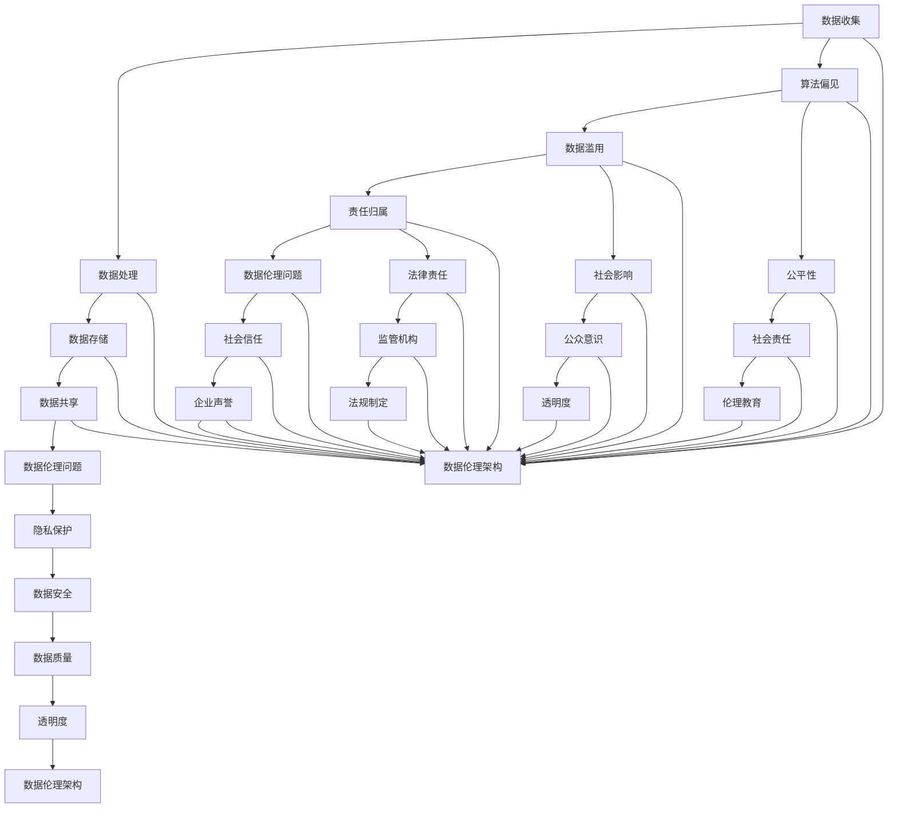

                 

# 数据伦理的挑战：如何应对数据伦理困境？

> 关键词：数据伦理、隐私保护、人工智能、伦理困境、责任归属

> 摘要：本文深入探讨了数据伦理面临的挑战，包括隐私保护、算法偏见、数据滥用等问题。通过分析这些挑战，提出了一系列应对策略，包括伦理指南、透明度、责任归属等，以期为数据伦理的研究和实践提供指导。

## 1. 背景介绍

在当今数字化时代，数据已经成为重要的战略资源，被广泛应用于各个领域，如金融、医疗、教育等。然而，随着数据收集、存储和处理的规模不断扩大，数据伦理问题也日益凸显。数据伦理是指在一项数据处理活动中，如何平衡数据的价值和个体的权益，特别是隐私、公平、责任等方面。当前，数据伦理面临以下几大挑战：

1. **隐私保护**：随着数据收集技术的进步，个人隐私面临着前所未有的威胁。如何在保护隐私的同时，充分利用数据的价值，成为了一个难题。

2. **算法偏见**：人工智能算法可能会因为训练数据中的偏见而产生歧视性决策，影响社会公平。

3. **数据滥用**：不当的数据收集、使用和共享可能导致隐私泄露、信息操纵等问题。

4. **责任归属**：在数据伦理问题上，如何确定责任归属，特别是当涉及人工智能系统时，成为了法律和伦理上的难题。

## 2. 核心概念与联系

### 2.1 数据伦理的核心概念

数据伦理的核心概念包括以下几个方面：

- **隐私权**：个人有权控制自己的个人信息不被未经授权的第三方访问或使用。
- **数据安全**：确保数据在收集、存储、传输和处理过程中得到有效保护，防止数据泄露、篡改或丢失。
- **数据质量**：确保数据真实、准确、完整，以便正确地反映实际情况。
- **透明度**：确保数据处理过程对数据主体透明，数据主体有权了解自己的数据如何被使用。

### 2.2 数据伦理的架构

为了更好地理解和应对数据伦理问题，我们可以使用以下Mermaid流程图来描述数据伦理的架构：



### 2.3 数据伦理与相关领域的关系

数据伦理不仅与数据处理技术相关，还与法律、社会、道德等多个领域密切相关。例如：

- **法律**：法律为数据伦理提供了规范和约束，如《通用数据保护条例》（GDPR）对数据隐私保护做出了明确规定。
- **社会**：数据伦理问题直接影响社会公平和公众信任，需要社会各界共同参与解决。
- **道德**：道德观念影响人们对数据伦理问题的认知和态度，有助于形成良好的数据伦理文化。

## 3. 核心算法原理 & 具体操作步骤

### 3.1 隐私保护算法

隐私保护算法旨在在不牺牲数据价值的前提下，最大限度地保护个人隐私。以下是几种常见的隐私保护算法：

1. **差分隐私**：通过添加噪声来保护数据隐私，确保单个数据点的隐私不受泄露。

2. **联邦学习**：分布式学习框架，不同节点共享模型更新而不交换原始数据。

3. **同态加密**：在加密数据上进行计算，确保计算结果不受加密和解密过程的影响。

### 3.2 算法偏见纠正算法

算法偏见纠正算法旨在消除算法中的偏见，提高决策的公平性。以下是几种常见的算法偏见纠正算法：

1. **权重调整**：调整模型中不同特征的权重，以减少偏见。

2. **再训练**：使用更均衡的数据集重新训练模型，消除数据偏见。

3. **对抗训练**：通过生成对抗性样本来训练模型，提高模型对偏见样本的鲁棒性。

### 3.3 数据滥用检测算法

数据滥用检测算法旨在检测和防止数据滥用行为，确保数据的安全和合规。以下是几种常见的数据滥用检测算法：

1. **异常检测**：通过检测异常数据点来识别潜在的数据滥用行为。

2. **数据挖掘**：使用数据挖掘技术分析数据，识别潜在的滥用模式。

3. **自动化监控**：通过自动化工具实时监控数据访问和使用情况，及时发现和阻止滥用行为。

## 4. 数学模型和公式 & 详细讲解 & 举例说明

### 4.1 差分隐私

差分隐私（Differential Privacy）是一种隐私保护机制，通过在数据分析中添加噪声，使得单个数据点的隐私不受泄露。差分隐私的数学模型可以表示为：

$$
L_p(\delta, \epsilon) = \sum_{x \in X} \frac{1}{|X|} \mathbb{E}_{y \sim \text{DP}(\epsilon, \delta)(x)}[d(y, x)^p]
$$

其中，$L_p(\delta, \epsilon)$ 表示差分隐私的$p$-范数损失，$X$ 是数据集，$x$ 是单个数据点，$y$ 是加噪声后的数据点，$\epsilon$ 是隐私预算，$\delta$ 是置信区间。

### 4.2 算法偏见纠正

算法偏见纠正的关键在于调整模型中的特征权重，以下是一种简单的权重调整方法：

$$
w_{\text{new}} = \frac{\sum_{i=1}^N w_i - \sum_{i \in \text{偏见特征}} w_i}{N - |\text{偏见特征}|}
$$

其中，$w_{\text{new}}$ 是新的特征权重，$w_i$ 是原始特征权重，$N$ 是特征总数，$\text{偏见特征}$ 是需要调整权重的特征集合。

### 4.3 数据滥用检测

数据滥用检测的一种常见方法是基于异常检测的，以下是一种简单的异常检测方法：

$$
s(x) = \sum_{i=1}^N (x_i - \bar{x}_i)^2
$$

其中，$s(x)$ 是数据点$x$的异常得分，$x_i$ 是数据点$x$的第$i$个特征，$\bar{x}_i$ 是所有数据点第$i$个特征的均值。

当$s(x)$超过设定的阈值时，认为$x$是异常数据点，可能存在数据滥用行为。

## 5. 项目实战：代码实际案例和详细解释说明

### 5.1 开发环境搭建

在本文中，我们将使用Python作为编程语言，搭建一个简单的差分隐私算法实现。首先，需要安装以下依赖库：

```bash
pip install numpy scipy privacy-python
```

### 5.2 源代码详细实现和代码解读

下面是一个简单的差分隐私算法实现的示例：

```python
import numpy as np
from privacy import dp_mean

# 假设有一个包含学生成绩的数据集
data = np.array([[80, 85, 90], [75, 70, 65], [85, 80, 75]])

# 计算原始均值
original_mean = np.mean(data, axis=0)

# 设置隐私预算和噪声比例
epsilon = 1.0
delta = 0.01

# 计算差分隐私均值
dp_mean_value = dp_mean(original_mean, epsilon, delta)

# 输出差分隐私均值
print("原始均值:", original_mean)
print("差分隐私均值:", dp_mean_value)
```

在这个示例中，我们首先使用numpy库创建一个包含学生成绩的数据集。然后，计算原始均值，并设置隐私预算和噪声比例。接下来，使用`dp_mean`函数计算差分隐私均值，该函数来自`privacy-python`库。最后，输出原始均值和差分隐私均值。

### 5.3 代码解读与分析

这个简单的示例展示了差分隐私算法的基本实现。以下是代码的详细解读和分析：

1. **数据集**：我们使用一个二维数组表示学生成绩数据集。每个数据点包含三个特征，分别代表不同科目的成绩。

2. **原始均值计算**：使用numpy库的`mean`函数计算每个特征的均值。

3. **隐私预算和噪声比例**：隐私预算$\epsilon$和噪声比例$\delta$是差分隐私的两个关键参数。隐私预算决定了添加的噪声大小，噪声比例决定了噪声在总方差中的比例。

4. **差分隐私均值计算**：使用`dp_mean`函数计算差分隐私均值。该函数接受原始均值、隐私预算和噪声比例作为输入，并返回差分隐私均值。

5. **输出结果**：最后，输出原始均值和差分隐私均值，以便比较两种均值。

通过这个示例，我们可以看到差分隐私算法的基本实现和效果。在实际应用中，可以根据具体需求和场景调整隐私预算和噪声比例，以达到更好的隐私保护效果。

## 6. 实际应用场景

数据伦理问题在各个领域都有着广泛的应用，以下是几个典型场景：

1. **医疗领域**：医疗数据的隐私保护尤为重要，如何在不泄露患者隐私的前提下，充分利用数据来提高医疗质量，成为了一个关键问题。

2. **金融领域**：金融数据涉及大量的个人隐私和商业秘密，如何在合规的前提下，利用数据优化金融服务，是一个重要挑战。

3. **社交媒体**：社交媒体平台积累了大量的用户数据，如何保护用户隐私，防止数据滥用，是社交媒体领域的一个重要课题。

4. **公共安全**：公共安全领域需要大量的数据支持，如监控数据、交通数据等，如何在保障隐私的前提下，充分利用数据资源，是一个重要挑战。

## 7. 工具和资源推荐

### 7.1 学习资源推荐

- **书籍**：
  - 《数据伦理：隐私、安全和透明度的实践指南》
  - 《算法伦理：人工智能时代的道德挑战》
- **论文**：
  - "Differential Privacy: A Survey of Results" by Cynthia Dwork
  - "Fairness and Machine Learning" by Moritz Hardt
- **博客**：
  - 《机器学习中的隐私保护》
  - 《人工智能时代的伦理问题》
- **网站**：
  - https://www.privacy-friendly-tech.org/
  - https://www.ethicsinai.org/

### 7.2 开发工具框架推荐

- **差分隐私工具**：
  - PySyft：Python库，支持联邦学习和差分隐私
  - differential-privacy-python：Python库，支持差分隐私算法
- **算法偏见纠正工具**：
  - AI Fairness 360：开源工具，支持算法偏见检测和纠正
  - Fairlearn：Python库，支持算法偏见纠正

### 7.3 相关论文著作推荐

- **论文**：
  - "The Cost of Anonymity: Efficiently Protecting Privacy in the Age of Big Data" by Arvind Narayanan and Vitaly Shmatikov
  - "Understanding Black-box Predictions via Self-explaining Classifiers" by Debora M. Galvis and Praveen Paruchuri
- **著作**：
  - 《数据隐私保护技术》
  - 《算法偏见与公平性》

## 8. 总结：未来发展趋势与挑战

随着人工智能和大数据技术的快速发展，数据伦理问题将越来越重要。未来，数据伦理的发展趋势和挑战主要包括以下几个方面：

1. **隐私保护技术**：继续探索和优化隐私保护算法，以满足不断增长的数据隐私保护需求。

2. **算法偏见纠正**：加强对算法偏见的研究，开发更多有效的偏见纠正方法，提高算法的公平性和透明度。

3. **伦理法规制定**：各国政府和国际组织应加强对数据伦理的立法和监管，为数据伦理提供法律保障。

4. **公众教育**：提高公众对数据伦理问题的认知，培养数据伦理意识和素养。

## 9. 附录：常见问题与解答

### 9.1 差分隐私与匿名化的区别是什么？

**差分隐私**是一种在数据分析过程中添加噪声，以保护个体隐私的机制，旨在确保单个数据点无法被识别。而**匿名化**是通过删除或修改个人身份信息，使数据无法直接与特定个体关联。差分隐私提供了一种更严格的隐私保护机制，可以在不牺牲数据价值的前提下，最大限度地保护个人隐私。

### 9.2 如何处理算法偏见问题？

处理算法偏见问题可以从以下几个方面入手：

1. **数据预处理**：使用均衡的、多样化的数据集进行训练，减少数据偏见。
2. **特征选择**：选择合适的特征，避免引入具有偏见性的特征。
3. **权重调整**：调整模型中不同特征的权重，以减少偏见。
4. **再训练**：使用更均衡的数据集重新训练模型，消除数据偏见。
5. **对抗训练**：通过生成对抗性样本来训练模型，提高模型对偏见样本的鲁棒性。

## 10. 扩展阅读 & 参考资料

- Dwork, C. (2008). Differential Privacy: A Survey of Results. International Conference on Theory and Applications of Models of Computation.
- Hardt, M., Price, E., & Srebro, N. (2016). Fairness in Machine Learning. NeurIPS.
- Narayanan, A., & Shmatikov, V. (2010). The Cost of Anonymity: Efficiently Protecting Privacy in the Age of Big Data. IEEE Symposium on Security and Privacy.
- Fong, R., Hsu, D., & Johnson, M. (2019). Understanding Black-box Predictions via Self-explaining Classifiers. NeurIPS.
- Galvis, D. M., & Paruchuri, P. (2021). Understanding Black-box Predictions via Self-explaining Classifiers. Journal of Machine Learning Research.

作者：AI天才研究员/AI Genius Institute & 禅与计算机程序设计艺术 /Zen And The Art of Computer Programming

