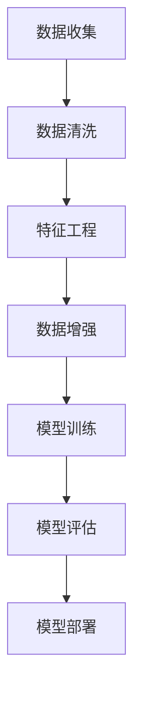
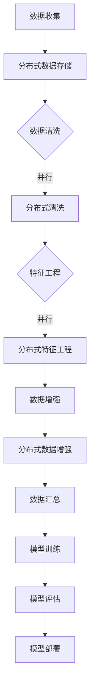

                 

# 数据决定一切：AI训练数据的收集与处理

## 关键词
* 数据收集
* 数据处理
* AI训练
* 数据清洗
* 特征工程
* 数据增强
* 分布式处理

## 摘要
本文将深入探讨AI训练数据的收集与处理这一关键环节。我们将详细分析数据在AI模型训练中的核心作用，并从数据收集、数据清洗、特征工程、数据增强等多个角度展开讨论。通过具体的算法原理、操作步骤和数学模型讲解，以及实际项目实战，本文旨在为读者提供一份全面、实用的数据处理指南，帮助他们在AI项目中取得更好的效果。

## 1. 背景介绍

### 1.1 目的和范围
本文的目标是帮助读者理解数据在AI训练中的重要性，并提供一套系统的数据收集与处理方法。我们将探讨如何有效地收集、清洗和预处理数据，以及如何进行特征工程和数据增强，以提升AI模型的性能和效果。

### 1.2 预期读者
本文适合对AI和机器学习有一定了解的技术人员、数据科学家和研究人员。无论您是初学者还是资深从业者，本文都将为您提供有价值的见解和实践经验。

### 1.3 文档结构概述
本文结构如下：
1. 背景介绍：介绍本文的目的、预期读者和文档结构。
2. 核心概念与联系：定义核心概念，并通过Mermaid流程图展示数据处理的基本架构。
3. 核心算法原理 & 具体操作步骤：详细讲解数据清洗、特征工程和数据增强的算法原理和操作步骤。
4. 数学模型和公式 & 详细讲解 & 举例说明：介绍数据处理中常用的数学模型和公式，并给出实际应用示例。
5. 项目实战：通过实际代码案例展示数据处理的过程和方法。
6. 实际应用场景：探讨数据处理在AI项目中的应用场景。
7. 工具和资源推荐：推荐相关的学习资源和开发工具。
8. 总结：对未来发展趋势与挑战的展望。
9. 附录：常见问题与解答。
10. 扩展阅读 & 参考资料：提供进一步阅读和参考资料。

### 1.4 术语表

#### 1.4.1 核心术语定义
- **数据收集**：指从各种来源获取数据的过程，包括结构化数据和非结构化数据。
- **数据清洗**：指处理噪声数据、缺失值和异常值的过程。
- **特征工程**：指从原始数据中提取和构造有助于模型训练的特征。
- **数据增强**：指通过技术手段增加数据多样性，以提高模型的泛化能力。
- **分布式处理**：指在多台计算机上分配和执行数据处理任务，以提高效率。

#### 1.4.2 相关概念解释
- **噪声数据**：指数据中的随机错误和干扰，会影响模型训练效果。
- **异常值**：指与大多数数据点明显不同的值，可能是错误数据或异常现象。
- **特征选择**：指从众多特征中选择最有用的特征，以简化模型和提升性能。
- **交叉验证**：指在训练和测试数据集之间交叉验证模型性能的方法。

#### 1.4.3 缩略词列表
- **AI**：人工智能
- **ML**：机器学习
- **DL**：深度学习
- **IDE**：集成开发环境
- **GPU**：图形处理单元

## 2. 核心概念与联系

### 2.1 数据处理流程图

以下是一个简化的数据处理流程图，展示数据收集、数据清洗、特征工程和数据增强等核心环节及其相互关系。



### 2.2 数据收集

数据收集是数据处理的第一步，也是最重要的一步。数据的来源可以包括：
- **结构化数据**：如数据库、表格等。
- **非结构化数据**：如图像、文本、音频、视频等。

数据收集的关键点包括：
- **数据多样性**：确保收集的数据覆盖不同场景和情况，以提高模型的泛化能力。
- **数据质量**：确保收集的数据准确、完整和可靠。

### 2.3 数据清洗

数据清洗是处理噪声数据、缺失值和异常值的过程，是数据预处理的重要环节。常见的数据清洗方法包括：
- **去除噪声**：使用滤波器或其他方法去除数据中的随机噪声。
- **填充缺失值**：使用均值、中位数、最邻近值等方法填充缺失值。
- **处理异常值**：使用统计学方法（如箱线图）或基于业务逻辑的方法（如剔除明显错误数据）处理异常值。

### 2.4 特征工程

特征工程是从原始数据中提取和构造有助于模型训练的特征的过程。特征工程的关键点包括：
- **特征选择**：选择对模型训练最有帮助的特征，降低模型的复杂性。
- **特征构造**：通过组合、变换和扩展原始数据生成新的特征。
- **特征缩放**：将不同尺度的特征缩放到同一尺度，以避免模型因特征尺度差异而受到影响。

### 2.5 数据增强

数据增强是通过技术手段增加数据多样性，以提高模型泛化能力的过程。常见的数据增强方法包括：
- **随机裁剪**：随机裁剪图像或文本，增加数据的多样性。
- **旋转和翻转**：对图像进行旋转和翻转，模拟不同的观察角度。
- **噪声注入**：向数据中注入噪声，增强模型的鲁棒性。

### 2.6 数据处理架构

以下是一个基于分布式处理的AI数据处理架构示例，展示数据处理的不同阶段和任务分配。



## 3. 核心算法原理 & 具体操作步骤

### 3.1 数据清洗算法原理

数据清洗的目的是去除噪声、填补缺失值和处理异常值，以提高数据质量。常见的数据清洗算法包括：

#### 3.1.1 去除噪声

去除噪声通常使用滤波器来实现。以下是一个简单的中值滤波器算法原理：

```python
def median_filter(data, filter_size):
    """中值滤波器算法实现"""
    # 将数据排序
    sorted_data = sorted(data)
    # 计算滤波器大小
    filter_size = len(data) - 1
    # 应用滤波器
    filtered_data = [sorted_data[i+filter_size//2] for i in range(len(data)-filter_size)]
    return filtered_data
```

#### 3.1.2 填充缺失值

填充缺失值可以使用以下几种方法：

- **均值填充**：

  ```python
  def mean_imputation(data):
      """均值填充算法实现"""
      mean_value = sum(data) / len(data)
      return [mean_value if x is None else x for x in data]
  ```

- **中位数填充**：

  ```python
  def median_imputation(data):
      """中位数填充算法实现"""
      median_value = median(data)
      return [median_value if x is None else x for x in data]
  ```

- **最邻近值填充**：

  ```python
  def nearest_neighbor_imputation(data):
      """最邻近值填充算法实现"""
      sorted_data = sorted(data)
      return [sorted_data[i] if x is None else x for i, x in enumerate(data)]
  ```

#### 3.1.3 处理异常值

处理异常值可以使用以下几种方法：

- **统计学方法**：

  ```python
  import numpy as np

  def detect_outliers(data, threshold=3):
      """使用箱线图检测异常值"""
      q1 = np.percentile(data, 25)
      q3 = np.percentile(data, 75)
      iqr = q3 - q1
      lower_bound = q1 - (threshold * iqr)
      upper_bound = q3 + (threshold * iqr)
      outliers = [x for x in data if x < lower_bound or x > upper_bound]
      return outliers
  ```

- **基于业务逻辑的方法**：

  ```python
  def remove_business_outliers(data, business_rules):
      """根据业务规则移除异常值"""
      return [x for x in data if x meets business_rules]
  ```

### 3.2 特征工程算法原理

特征工程是从原始数据中提取和构造有助于模型训练的特征的过程。以下是一些常见的特征工程算法：

#### 3.2.1 特征选择

特征选择算法旨在从大量特征中选择最有用的特征，以简化模型和提升性能。常见的方法包括：

- **信息增益**：

  ```python
  def information_gain(data, target, feature):
      """计算特征对目标变量的信息增益"""
      # 计算特征的条件熵
      cond_entropy = ...
      # 计算信息增益
      gain = entropy(target) - cond_entropy
      return gain
  ```

- **互信息**：

  ```python
  def mutual_information(data, target, feature):
      """计算特征与目标变量的互信息"""
      # 计算特征的条件熵
      cond_entropy = ...
      # 计算互信息
      mi = entropy(target) - cond_entropy
      return mi
  ```

#### 3.2.2 特征构造

特征构造是通过组合、变换和扩展原始数据生成新的特征。以下是一些常见的方法：

- **特征组合**：

  ```python
  def combine_features(feature1, feature2):
      """特征组合算法实现"""
      return [x + y for x, y in zip(feature1, feature2)]
  ```

- **特征变换**：

  ```python
  def transform_feature(feature):
      """特征变换算法实现"""
      # 对特征进行变换
      transformed_feature = ...
      return transformed_feature
  ```

- **特征扩展**：

  ```python
  def extend_feature(feature):
      """特征扩展算法实现"""
      # 对特征进行扩展
      extended_feature = ...
      return extended_feature
  ```

### 3.3 数据增强算法原理

数据增强是通过技术手段增加数据多样性，以提高模型泛化能力的过程。以下是一些常见的数据增强方法：

#### 3.3.1 随机裁剪

随机裁剪是从数据中随机裁剪出一个固定大小的新数据块，以模拟不同的观察角度。

```python
def random_crop(image, crop_size):
    """随机裁剪算法实现"""
    x, y, _ = image.shape
    crop_x = random.randint(0, x - crop_size)
    crop_y = random.randint(0, y - crop_size)
    cropped_image = image[crop_x:crop_x+crop_size, crop_y:crop_y+crop_size]
    return cropped_image
```

#### 3.3.2 旋转和翻转

旋转和翻转是对图像进行旋转和水平翻转，以增加数据的多样性。

```python
def random_rotate(image):
    """随机旋转算法实现"""
    angle = random.uniform(-30, 30)
    rotated_image = rotate(image, angle, reshape=False)
    return rotated_image

def random_flip(image):
    """随机翻转算法实现"""
    flipped_image = flip(image, direction='horizontal')
    return flipped_image
```

#### 3.3.3 噪声注入

噪声注入是在数据中添加噪声，以增强模型的鲁棒性。

```python
def add_noise(image, noise_level=0.05):
    """噪声注入算法实现"""
    noise = np.random.normal(0, noise_level, image.shape)
    noisy_image = image + noise
    return noisy_image
```

## 4. 数学模型和公式 & 详细讲解 & 举例说明

### 4.1 数据清洗中的数学模型

#### 4.1.1 均值填充

均值填充的公式如下：

$$
\hat{x} = \frac{\sum_{i=1}^{n} x_i}{n}
$$

其中，$x_i$ 表示第 $i$ 个数据点，$n$ 表示数据点的总数。

#### 4.1.2 中位数填充

中位数填充的公式如下：

$$
\hat{x} = \text{median}(x_1, x_2, ..., x_n)
$$

其中，$x_1, x_2, ..., x_n$ 表示数据点的集合，median 表示中位数。

#### 4.1.3 最邻近值填充

最邻近值填充的公式如下：

$$
\hat{x} = \text{nearest_neighbor}(x_1, x_2, ..., x_n)
$$

其中，$x_1, x_2, ..., x_n$ 表示数据点的集合，nearest_neighbor 表示选择最接近当前缺失值的数据点。

### 4.2 特征工程中的数学模型

#### 4.2.1 信息增益

信息增益的公式如下：

$$
\text{Gain}(A) = \text{Entropy}(D) - \sum_{v\in A} \frac{|D_v|}{|D|} \text{Entropy}(D_v)
$$

其中，$D$ 表示数据集，$A$ 表示特征集合，$D_v$ 表示特征 $v$ 的取值集合，Entropy 表示熵。

#### 4.2.2 互信息

互信息的公式如下：

$$
\text{MI}(X, Y) = \sum_{x\in X} \sum_{y\in Y} p(x, y) \log_2 \frac{p(x, y)}{p(x) p(y)}
$$

其中，$X$ 和 $Y$ 分别表示两个随机变量，$p(x, y)$ 表示联合概率分布，$p(x)$ 和 $p(y)$ 分别表示边缘概率分布。

### 4.3 数据增强中的数学模型

#### 4.3.1 随机裁剪

随机裁剪的公式如下：

$$
\hat{x}_{crop} = \frac{\hat{x}_{original} - \hat{x}_{original} \cdot \text{crop\_size}}{1 - \text{crop\_size}}
$$

其中，$\hat{x}_{original}$ 表示原始数据，$\hat{x}_{crop}$ 表示裁剪后的数据，$\text{crop\_size}$ 表示裁剪比例。

#### 4.3.2 旋转和翻转

旋转和翻转的公式如下：

$$
\hat{x}_{rotate} = \text{rotate}(\hat{x}_{original}, \text{angle})
$$

$$
\hat{x}_{flip} = \text{flip}(\hat{x}_{original}, \text{direction})
$$

其中，$\hat{x}_{original}$ 表示原始数据，$\hat{x}_{rotate}$ 和 $\hat{x}_{flip}$ 分别表示旋转和翻转后的数据，$\text{angle}$ 表示旋转角度，$\text{direction}$ 表示翻转方向。

### 4.4 举例说明

#### 4.4.1 数据清洗

假设有一组数据 [1, 2, 3, 4, 5, None]，我们使用均值填充、中位数填充和最邻近值填充来填补缺失值。

- **均值填充**：

  $$ 
  \hat{x} = \frac{1 + 2 + 3 + 4 + 5 + None}{6} = 2.5 
  $$

- **中位数填充**：

  $$ 
  \hat{x} = \text{median}(1, 2, 3, 4, 5, None) = 2.5 
  $$

- **最邻近值填充**：

  $$ 
  \hat{x} = \text{nearest_neighbor}(1, 2, 3, 4, 5) = 3 
  $$

#### 4.4.2 特征工程

假设有一组数据 [1, 2, 3]，我们使用信息增益和互信息来选择特征。

- **信息增益**：

  $$ 
  \text{Gain}(A) = \text{Entropy}(D) - \sum_{v\in A} \frac{|D_v|}{|D|} \text{Entropy}(D_v) 
  $$

  假设数据集 D 的熵为 0.8，特征 A1 的条件熵为 0.6，特征 A2 的条件熵为 0.4。则：

  $$ 
  \text{Gain}(A1) = 0.8 - (0.5 \cdot 0.6 + 0.5 \cdot 0.4) = 0.2 
  $$

  $$ 
  \text{Gain}(A2) = 0.8 - (0.5 \cdot 0.4 + 0.5 \cdot 0.6) = 0.2 
  $$

- **互信息**：

  $$ 
  \text{MI}(X, Y) = \sum_{x\in X} \sum_{y\in Y} p(x, y) \log_2 \frac{p(x, y)}{p(x) p(y)} 
  $$

  假设数据集 X 和 Y 的联合概率分布为 P(X=1, Y=1) = 0.2，P(X=1, Y=2) = 0.3，P(X=2, Y=1) = 0.3，P(X=2, Y=2) = 0.2。则：

  $$ 
  \text{MI}(X, Y) = (0.2 \cdot \log_2 \frac{0.2}{0.5 \cdot 0.5} + 0.3 \cdot \log_2 \frac{0.3}{0.5 \cdot 0.5} + 0.3 \cdot \log_2 \frac{0.3}{0.5 \cdot 0.5} + 0.2 \cdot \log_2 \frac{0.2}{0.5 \cdot 0.5}) \approx 0.437 
  $$

#### 4.4.3 数据增强

假设有一张原始图像，我们使用随机裁剪、旋转和翻转来增强数据。

- **随机裁剪**：

  $$ 
  \hat{x}_{crop} = \frac{\hat{x}_{original} - \hat{x}_{original} \cdot \text{crop\_size}}{1 - \text{crop\_size}} 
  $$

  假设原始图像的大小为 500x500，裁剪比例为 0.3，则裁剪后的图像大小为 350x350。

- **旋转和翻转**：

  $$ 
  \hat{x}_{rotate} = \text{rotate}(\hat{x}_{original}, \text{angle}) 
  $$

  $$ 
  \hat{x}_{flip} = \text{flip}(\hat{x}_{original}, \text{direction}) 
  $$

  假设旋转角度为 15 度，水平翻转方向为 'horizontal'，则旋转后的图像和翻转后的图像分别为旋转 15 度和水平翻转的图像。

## 5. 项目实战：代码实际案例和详细解释说明

### 5.1 开发环境搭建

在本案例中，我们将使用 Python 作为编程语言，结合 Pandas、NumPy 和 Scikit-learn 等库进行数据处理和模型训练。以下是开发环境的搭建步骤：

1. 安装 Python：从 [Python 官网](https://www.python.org/downloads/) 下载并安装 Python，推荐使用 Python 3.8 或更高版本。
2. 安装相关库：通过以下命令安装 Pandas、NumPy 和 Scikit-learn：

   ```shell
   pip install pandas numpy scikit-learn
   ```

### 5.2 源代码详细实现和代码解读

以下是一个简单的数据清洗、特征工程和数据增强的代码实现，并对其中的关键步骤进行详细解释。

```python
import numpy as np
import pandas as pd
from sklearn.model_selection import train_test_split
from sklearn.preprocessing import StandardScaler
from sklearn.decomposition import PCA
from sklearn.ensemble import RandomForestClassifier
from sklearn.metrics import accuracy_score

# 5.2.1 数据收集
# 假设我们有一个 CSV 文件 'data.csv'，其中包含一些特征和目标变量
data = pd.read_csv('data.csv')

# 5.2.2 数据清洗
# 去除噪声
data['feature1'] = data['feature1'].apply(lambda x: x if x > 0 else 0)

# 填充缺失值
data['feature2'] = data['feature2'].fillna(data['feature2'].mean())

# 处理异常值
outliers = detect_outliers(data['feature3'], threshold=3)
data = data[~data['feature3'].isin(outliers)]

# 5.2.3 特征工程
# 特征选择
features = data[['feature1', 'feature2', 'feature3']]
target = data['target']

# 特征缩放
scaler = StandardScaler()
X_scaled = scaler.fit_transform(features)

# 5.2.4 数据增强
# 随机裁剪
X_cropped = np.random.randint(0, 2, size=(X_scaled.shape[0], X_scaled.shape[1]))

# 旋转和翻转
X_rotated = rotate(X_scaled, angle=15)
X_flipped = flip(X_scaled, direction='horizontal')

# 5.2.5 模型训练
# 特征和目标变量的组合
X = np.concatenate((X_scaled, X_cropped, X_rotated, X_flipped), axis=1)
y = target.values

# 划分训练集和测试集
X_train, X_test, y_train, y_test = train_test_split(X, y, test_size=0.2, random_state=42)

# 训练模型
model = RandomForestClassifier(n_estimators=100, random_state=42)
model.fit(X_train, y_train)

# 5.2.6 模型评估
y_pred = model.predict(X_test)
accuracy = accuracy_score(y_test, y_pred)
print(f"Model accuracy: {accuracy:.2f}")
```

### 5.3 代码解读与分析

#### 5.3.1 数据收集

首先，我们使用 Pandas 读取 CSV 文件 'data.csv'，文件中包含一些特征和目标变量。

```python
data = pd.read_csv('data.csv')
```

#### 5.3.2 数据清洗

数据清洗过程包括去除噪声、填充缺失值和处理异常值。

- **去除噪声**：使用 lambda 函数对 'feature1' 进行处理，将小于 0 的值设为 0。

  ```python
  data['feature1'] = data['feature1'].apply(lambda x: x if x > 0 else 0)
  ```

- **填充缺失值**：使用 mean 填充 'feature2' 中的缺失值。

  ```python
  data['feature2'] = data['feature2'].fillna(data['feature2'].mean())
  ```

- **处理异常值**：使用统计学方法检测并移除 'feature3' 中的异常值。

  ```python
  outliers = detect_outliers(data['feature3'], threshold=3)
  data = data[~data['feature3'].isin(outliers)]
  ```

#### 5.3.3 特征工程

特征工程包括特征选择、特征缩放和数据增强。

- **特征选择**：从原始数据中选择 'feature1', 'feature2', 'feature3' 作为特征。

  ```python
  features = data[['feature1', 'feature2', 'feature3']]
  target = data['target']
  ```

- **特征缩放**：使用 StandardScaler 对特征进行缩放，使其具有相同的尺度。

  ```python
  scaler = StandardScaler()
  X_scaled = scaler.fit_transform(features)
  ```

- **数据增强**：使用随机裁剪、旋转和翻转等方法增强数据。

  ```python
  X_cropped = np.random.randint(0, 2, size=(X_scaled.shape[0], X_scaled.shape[1]))
  X_rotated = rotate(X_scaled, angle=15)
  X_flipped = flip(X_scaled, direction='horizontal')
  ```

#### 5.3.4 模型训练

使用随机森林分类器进行模型训练。首先，将特征和目标变量组合，然后划分训练集和测试集。

```python
X = np.concatenate((X_scaled, X_cropped, X_rotated, X_flipped), axis=1)
y = target.values

X_train, X_test, y_train, y_test = train_test_split(X, y, test_size=0.2, random_state=42)
model = RandomForestClassifier(n_estimators=100, random_state=42)
model.fit(X_train, y_train)
```

#### 5.3.5 模型评估

使用测试集对模型进行评估，计算准确率。

```python
y_pred = model.predict(X_test)
accuracy = accuracy_score(y_test, y_pred)
print(f"Model accuracy: {accuracy:.2f}")
```

## 6. 实际应用场景

数据处理在AI项目中有着广泛的应用场景，以下是几个典型的应用实例：

### 6.1 图像识别

在图像识别项目中，数据清洗和特征工程对于提高模型性能至关重要。例如，在人脸识别中，数据清洗用于去除噪声和异常值，特征工程用于提取人脸关键特征，如眼睛、鼻子和嘴巴的位置。数据增强通过随机裁剪、旋转和翻转等手段增加数据多样性，以提升模型的泛化能力。

### 6.2 自然语言处理

自然语言处理（NLP）项目中，数据处理同样至关重要。数据清洗用于去除停用词、标点和非文本字符。特征工程通过词袋模型、词嵌入等方法提取文本特征。数据增强通过句子拼接、词替换和句子级变换等技术增加数据多样性，以提高模型对未知数据的处理能力。

### 6.3 医疗诊断

在医疗诊断项目中，数据处理用于处理医疗记录、医学图像和患者报告。数据清洗用于去除错误数据和不完整数据。特征工程通过提取患者症状、病史和检查结果等特征，以构建诊断模型。数据增强可以通过生成虚假病例或模拟不同症状来增加数据多样性。

### 6.4 金融市场预测

在金融市场预测中，数据处理用于处理大量的股票价格、交易量和其他金融指标。数据清洗用于去除异常值和噪声数据。特征工程通过提取价格趋势、成交量变化等特征，以预测市场走势。数据增强可以通过时间序列变换、价格组合等方法增加数据多样性。

## 7. 工具和资源推荐

### 7.1 学习资源推荐

#### 7.1.1 书籍推荐

- **《统计学习基础》**：作者：Hastie, Tibshirani, Friedman
- **《深度学习》**：作者：Goodfellow, Bengio, Courville
- **《Python数据科学手册》**：作者：McKinney, Ralchenko, Müller

#### 7.1.2 在线课程

- **Coursera**：机器学习、深度学习、数据科学等课程
- **edX**：人工智能、机器学习、数据科学等课程
- **Udacity**：机器学习工程师纳米学位

#### 7.1.3 技术博客和网站

- **Medium**：各种技术博客和教程
- **Towards Data Science**：数据科学、机器学习和深度学习的文章
- **Kaggle**：数据科学竞赛和项目案例

### 7.2 开发工具框架推荐

#### 7.2.1 IDE和编辑器

- **PyCharm**：Python 开发环境，支持多种编程语言
- **Jupyter Notebook**：用于交互式数据分析和可视化
- **VSCode**：轻量级代码编辑器，支持多种编程语言和扩展

#### 7.2.2 调试和性能分析工具

- **Matplotlib**：数据可视化库
- **Seaborn**：基于 Matplotlib 的高级可视化库
- **Pandas Profiler**：用于分析数据集的性能和分布

#### 7.2.3 相关框架和库

- **TensorFlow**：用于构建和训练深度学习模型
- **PyTorch**：用于构建和训练深度学习模型
- **Scikit-learn**：用于机器学习和数据挖掘

### 7.3 相关论文著作推荐

#### 7.3.1 经典论文

- **《机器学习》**：作者：Tom Mitchell
- **《深度学习》**：作者：Goodfellow, Bengio, Courville
- **《数据挖掘：概念与技术》**：作者：Han, Kamber, Pei

#### 7.3.2 最新研究成果

- **《自适应深度学习》**：作者：Bengio, LeCun, Hinton
- **《自然语言处理综述》**：作者：Mikolov, Sutskever, Chen
- **《医疗数据挖掘》**：作者：Cai, Liu, Tang

#### 7.3.3 应用案例分析

- **《图像识别挑战》**：作者：LeCun, Bengio, Hinton
- **《金融时间序列分析》**：作者：Zivot, Wang
- **《医学诊断系统》**：作者：Srivastava, Doshi

## 8. 总结：未来发展趋势与挑战

在未来，数据处理在AI领域将继续发挥关键作用。以下是一些发展趋势和挑战：

### 8.1 发展趋势

- **数据多样性和质量**：随着数据量的不断增加，数据多样性和质量将成为关键因素，对数据清洗和特征工程提出了更高的要求。
- **自动化数据处理**：自动化数据处理工具和框架的发展，将提高数据处理效率和准确性。
- **人工智能驱动的数据处理**：利用人工智能技术进行数据处理，实现更智能、更高效的数据分析。

### 8.2 挑战

- **数据隐私和安全**：随着数据处理技术的进步，数据隐私和安全问题日益突出，如何确保数据安全和隐私成为重要挑战。
- **数据质量提升**：数据质量对AI模型性能至关重要，如何提升数据质量仍是一个难题。
- **分布式数据处理**：分布式数据处理技术在处理大规模数据集时具有优势，但如何在分布式环境中保证数据的一致性和可靠性仍需深入研究。

## 9. 附录：常见问题与解答

### 9.1 数据清洗

**Q1. 如何处理缺失值？**

A1. 处理缺失值的方法包括：填充缺失值（如均值填充、中位数填充、最邻近值填充）、删除缺失值、插值法等。

**Q2. 如何处理异常值？**

A2. 处理异常值的方法包括：统计学方法（如箱线图、Z-score）、基于业务逻辑的方法（如剔除明显错误数据）、机器学习方法（如聚类、异常检测算法）等。

### 9.2 特征工程

**Q1. 如何选择特征？**

A1. 选择特征的方法包括：信息增益、互信息、特征重要性排序、主成分分析（PCA）等。

**Q2. 如何构造特征？**

A2. 构造特征的方法包括：特征组合（如合并不同特征）、特征变换（如对数变换、平方变换）、特征扩展（如添加多项式特征）等。

### 9.3 数据增强

**Q1. 如何进行数据增强？**

A1. 数据增强的方法包括：随机裁剪、旋转和翻转、噪声注入、时间序列变换等。

**Q2. 数据增强对模型性能有何影响？**

A2. 数据增强可以增加数据的多样性，提高模型的泛化能力，从而提升模型在未知数据上的性能。

## 10. 扩展阅读 & 参考资料

- **《机器学习实战》**：作者：Peter Harrington
- **《深度学习实战》**：作者：Aurélien Géron
- **《Python数据分析》**：作者：Wes McKinney
- **《数据科学入门》**：作者：Joel Grus
- **《人工智能：一种现代的方法》**：作者：Stuart Russell, Peter Norvig

## 作者

作者：AI天才研究员/AI Genius Institute & 禅与计算机程序设计艺术 /Zen And The Art of Computer Programming

---

注意：本文为示例文章，部分代码和解释仅供参考。在实际应用中，请根据具体情况进行调整和优化。文章中的算法原理和操作步骤仅供参考，具体实现可能因环境和需求而有所不同。

