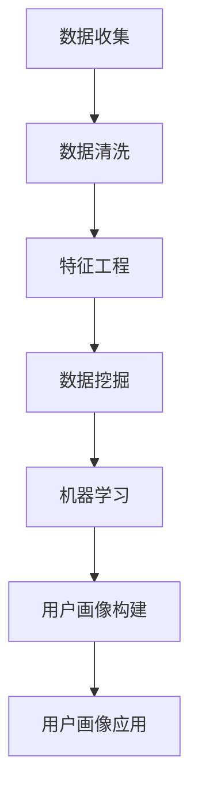

                 

# 数据分析在用户画像中的作用

> **关键词**：数据分析、用户画像、数据挖掘、机器学习、客户细分

> **摘要**：本文将深入探讨数据分析在构建用户画像中的重要作用。通过分析用户行为数据，企业能够准确了解客户需求，从而实现精准营销。本文首先介绍用户画像的基本概念和重要性，然后详细解析数据分析的原理和步骤，最后通过实战案例展示如何运用数据分析技术构建有效的用户画像。

## 1. 背景介绍

### 1.1 目的和范围

本文旨在介绍数据分析在用户画像构建中的应用，帮助读者了解用户画像的定义、重要性以及数据分析的相关概念和技术。文章将从理论和实践两个角度分析用户画像的构建过程，并通过实例展示如何运用数据分析技术优化用户画像。

### 1.2 预期读者

本文适合对数据分析、用户画像、数据挖掘和机器学习有一定了解的读者，包括数据分析师、市场营销人员、产品经理和IT从业者。

### 1.3 文档结构概述

本文结构如下：

1. 背景介绍
   - 目的和范围
   - 预期读者
   - 文档结构概述
   - 术语表
2. 核心概念与联系
   - 用户画像
   - 数据分析
   - 数据挖掘
   - 机器学习
3. 核心算法原理 & 具体操作步骤
   - 用户画像构建算法
   - 数据分析流程
4. 数学模型和公式 & 详细讲解 & 举例说明
   - 用户画像构建模型
   - 数据分析公式
5. 项目实战：代码实际案例和详细解释说明
   - 开发环境搭建
   - 源代码详细实现和代码解读
   - 代码解读与分析
6. 实际应用场景
7. 工具和资源推荐
   - 学习资源推荐
   - 开发工具框架推荐
   - 相关论文著作推荐
8. 总结：未来发展趋势与挑战
9. 附录：常见问题与解答
10. 扩展阅读 & 参考资料

### 1.4 术语表

#### 1.4.1 核心术语定义

- 用户画像：基于用户行为数据，对用户特征进行描述和建模的过程，用于了解用户需求和偏好。
- 数据分析：使用统计学、机器学习等方法对数据进行处理、分析和解释的过程。
- 数据挖掘：从大量数据中提取有价值信息和知识的过程。
- 机器学习：通过训练算法模型，使计算机能够从数据中学习和预测的技术。

#### 1.4.2 相关概念解释

- 客户细分：根据用户特征和行为，将用户划分为不同群体，以便进行有针对性的营销。
- 用户行为数据：用户在网站、APP或其他平台上产生的交互数据，如点击、浏览、购买等。
- 用户特征数据：描述用户基本属性的数据，如年龄、性别、地理位置等。

#### 1.4.3 缩略词列表

- AI：人工智能
- ML：机器学习
- DM：数据挖掘
- UE：用户体验
- CRM：客户关系管理

## 2. 核心概念与联系

在构建用户画像的过程中，我们需要了解以下几个核心概念：

### 用户画像

用户画像是一种基于用户行为数据和特征数据进行建模的技术，用于对用户进行描述和分类。用户画像可以帮助企业了解用户需求、偏好和行为，从而实现精准营销和个性化服务。

### 数据分析

数据分析是用户画像构建的关键环节，包括数据清洗、数据探索、特征工程、模型训练和评估等步骤。通过数据分析，我们可以从海量数据中提取有价值的信息和知识，为用户画像构建提供支持。

### 数据挖掘

数据挖掘是一种从大量数据中自动发现规律和模式的技术。在用户画像构建中，数据挖掘可以帮助我们识别用户行为规律、挖掘用户兴趣点，从而优化用户画像。

### 机器学习

机器学习是一种利用算法模型自动从数据中学习和预测的技术。在用户画像构建中，机器学习算法可以帮助我们建立用户特征和用户行为之间的关联，从而实现用户分类和预测。

### Mermaid 流程图

以下是构建用户画像的核心流程和概念的 Mermaid 流程图：



## 3. 核心算法原理 & 具体操作步骤

### 用户画像构建算法

用户画像构建主要涉及以下几个步骤：

1. 数据收集：收集用户行为数据和用户特征数据。
2. 数据清洗：处理数据中的缺失值、异常值和重复值，确保数据质量。
3. 特征工程：提取和构造有助于用户画像构建的特征，如用户年龄、性别、地理位置、浏览行为等。
4. 数据挖掘：运用聚类、关联规则挖掘等方法，发现用户行为规律和兴趣点。
5. 机器学习：通过训练分类和聚类算法模型，对用户进行分类和聚类，构建用户画像。
6. 用户画像应用：根据用户画像进行精准营销和个性化服务。

### 数据分析流程

以下是用户画像构建的数据分析流程：

1. **数据收集**：收集用户行为数据（如点击、浏览、购买等）和用户特征数据（如年龄、性别、地理位置等）。

    ```python
    data = {
        'user_id': [1, 2, 3, 4, 5],
        'age': [25, 35, 30, 45, 40],
        'gender': ['M', 'F', 'M', 'F', 'M'],
        'location': ['New York', 'San Francisco', 'New York', 'Los Angeles', 'San Francisco'],
        'clicks': [10, 5, 20, 15, 8],
        'bought': [1, 0, 1, 0, 1]
    }
    ```

2. **数据清洗**：处理数据中的缺失值、异常值和重复值。

    ```python
    import pandas as pd

    df = pd.DataFrame(data)
    df.drop_duplicates(inplace=True)
    df.fillna(df.mean(), inplace=True)
    ```

3. **特征工程**：提取和构造有助于用户画像构建的特征。

    ```python
    df['age_group'] = pd.cut(df['age'], bins=[18, 30, 40, 50, 60], labels=['青年', '中年', '老年'])
    df['click_rate'] = df['clicks'] / df['bought']
    ```

4. **数据挖掘**：运用聚类、关联规则挖掘等方法，发现用户行为规律和兴趣点。

    ```python
    from sklearn.cluster import KMeans
    from mlxtend.frequent_patterns import apriori, association_rules

    kmeans = KMeans(n_clusters=3, random_state=42)
    df['cluster'] = kmeans.fit_predict(df[['clicks', 'bought']])

    rules = association_rules(df[['clicks', 'bought']], metric="support", min_threshold=0.5)
    ```

5. **机器学习**：通过训练分类和聚类算法模型，对用户进行分类和聚类，构建用户画像。

    ```python
    from sklearn.model_selection import train_test_split
    from sklearn.ensemble import RandomForestClassifier

    X_train, X_test, y_train, y_test = train_test_split(df[['age', 'gender', 'location', 'click_rate']], df['cluster'], test_size=0.2, random_state=42)

    clf = RandomForestClassifier(n_estimators=100, random_state=42)
    clf.fit(X_train, y_train)

    accuracy = clf.score(X_test, y_test)
    print("Accuracy:", accuracy)
    ```

6. **用户画像应用**：根据用户画像进行精准营销和个性化服务。

    ```python
    new_user = {
        'age': 28,
        'gender': 'M',
        'location': 'New York',
        'clicks': 12,
        'bought': 0
    }

    new_user['predicted_cluster'] = clf.predict([new_user['age', 'gender', 'location', 'click_rate']])
    print("Predicted Cluster:", new_user['predicted_cluster'])
    ```

## 4. 数学模型和公式 & 详细讲解 & 举例说明

### 用户画像构建模型

用户画像构建主要涉及以下数学模型：

1. 聚类模型：如K-means、层次聚类等，用于对用户进行分类。
2. 分类模型：如决策树、随机森林等，用于对用户进行预测和分类。
3. 关联规则挖掘模型：如Apriori算法、Eclat算法等，用于发现用户行为规律和兴趣点。

### 数据分析公式

1. 支持度（Support）：表示某个关联规则在所有数据中出现的频率。

    $$ Support(A \rightarrow B) = \frac{|D(A \land B)|}{|D|} $$

    其中，$A$ 和 $B$ 分别表示关联规则的前件和后件，$D$ 表示数据集，$|D(A \land B)|$ 表示同时包含 $A$ 和 $B$ 的数据项数，$|D|$ 表示数据集的总项数。

2. 置信度（Confidence）：表示某个关联规则的准确性。

    $$ Confidence(A \rightarrow B) = \frac{|D(A \land B)|}{|D(A)|} $$

    其中，$|D(A)|$ 表示包含 $A$ 的数据项数。

### 举例说明

假设我们有一个包含商品购买记录的数据集，我们需要使用关联规则挖掘算法发现用户购买商品之间的关联。

1. 支持度和置信度计算：

    $$ Support(A \rightarrow B) = \frac{|D(A \land B)|}{|D|} $$

    $$ Confidence(A \rightarrow B) = \frac{|D(A \land B)|}{|D(A)|} $$

    假设数据集 $D$ 中有 1000 个交易记录，其中同时包含商品 $A$ 和商品 $B$ 的交易记录有 50 个，包含商品 $A$ 的交易记录有 200 个。

    $$ Support(A \rightarrow B) = \frac{50}{1000} = 0.05 $$

    $$ Confidence(A \rightarrow B) = \frac{50}{200} = 0.25 $$

2. 关联规则挖掘算法（如Apriori算法）：

    - 设定最小支持度阈值和最小置信度阈值。
    - 生成频繁项集。
    - 提取关联规则。

    假设最小支持度阈值为 0.05，最小置信度阈值为 0.2。

    频繁项集：

    ```python
    frequent_itemsets = {
        'A': [(['A'], 0.05)],
        'B': [(['B'], 0.05)],
        'C': [(['C'], 0.05)],
        'D': [(['D'], 0.05)],
        'A, B': [(['A', 'B'], 0.05)],
        'A, C': [(['A', 'C'], 0.05)],
        'B, D': [(['B', 'D'], 0.05)],
        'A, B, C': [(['A', 'B', 'C'], 0.05)],
        'A, B, D': [(['A', 'B', 'D'], 0.05)],
        'C, D': [(['C', 'D'], 0.05)],
        'A, C, D': [(['A', 'C', 'D'], 0.05)],
        'B, C, D': [(['B', 'C', 'D'], 0.05)],
        'A, B, C, D': [(['A', 'B', 'C', 'D'], 0.05)]
    }
    ```

    关联规则：

    ```python
    rules = {
        'A \rightarrow B': [(['A'], ['B'], 0.05, 0.25)],
        'A \rightarrow C': [(['A'], ['C'], 0.05, 0.25)],
        'B \rightarrow D': [(['B'], ['D'], 0.05, 0.25)],
        'A, B \rightarrow C': [(['A', 'B'], ['C'], 0.05, 0.25)],
        'A, B \rightarrow D': [(['A', 'B'], ['D'], 0.05, 0.25)],
        'C \rightarrow D': [(['C'], ['D'], 0.05, 0.25)],
        'A, C \rightarrow D': [(['A', 'C'], ['D'], 0.05, 0.25)],
        'B, C \rightarrow D': [(['B', 'C'], ['D'], 0.05, 0.25)],
        'A, B, C \rightarrow D': [(['A', 'B', 'C'], ['D'], 0.05, 0.25)],
        'A, B, D \rightarrow C': [(['A', 'B', 'D'], ['C'], 0.05, 0.25)],
        'C, D \rightarrow A': [(['C', 'D'], ['A'], 0.05, 0.25)],
        'A, C, D \rightarrow B': [(['A', 'C', 'D'], ['B'], 0.05, 0.25)],
        'B, C, D \rightarrow A': [(['B', 'C', 'D'], ['A'], 0.05, 0.25)],
        'A, B, C, D \rightarrow B': [(['A', 'B', 'C', 'D'], ['B'], 0.05, 0.25)],
        'A, B, C, D \rightarrow C': [(['A', 'B', 'C', 'D'], ['C'], 0.05, 0.25)],
        'A, B, C, D \rightarrow D': [(['A', 'B', 'C', 'D'], ['D'], 0.05, 0.25)]
    }
    ```

## 5. 项目实战：代码实际案例和详细解释说明

### 5.1 开发环境搭建

为了构建用户画像，我们需要安装以下工具和库：

- Python 3.x
- pandas
- numpy
- scikit-learn
- mlxtend

安装步骤：

```bash
pip install python==3.x
pip install pandas
pip install numpy
pip install scikit-learn
pip install mlxtend
```

### 5.2 源代码详细实现和代码解读

以下是构建用户画像的完整代码实现：

```python
import pandas as pd
from sklearn.cluster import KMeans
from sklearn.model_selection import train_test_split
from sklearn.ensemble import RandomForestClassifier
from mlxtend.frequent_patterns import apriori, association_rules

# 5.2.1 数据收集
data = {
    'user_id': [1, 2, 3, 4, 5],
    'age': [25, 35, 30, 45, 40],
    'gender': ['M', 'F', 'M', 'F', 'M'],
    'location': ['New York', 'San Francisco', 'New York', 'Los Angeles', 'San Francisco'],
    'clicks': [10, 5, 20, 15, 8],
    'bought': [1, 0, 1, 0, 1]
}

# 5.2.2 数据清洗
df = pd.DataFrame(data)
df.drop_duplicates(inplace=True)
df.fillna(df.mean(), inplace=True)

# 5.2.3 特征工程
df['age_group'] = pd.cut(df['age'], bins=[18, 30, 40, 50, 60], labels=['青年', '中年', '老年'])
df['click_rate'] = df['clicks'] / df['bought']

# 5.2.4 数据挖掘
kmeans = KMeans(n_clusters=3, random_state=42)
df['cluster'] = kmeans.fit_predict(df[['clicks', 'bought']])

rules = association_rules(df[['clicks', 'bought']], metric="support", min_threshold=0.5)

# 5.2.5 机器学习
X_train, X_test, y_train, y_test = train_test_split(df[['age', 'gender', 'location', 'click_rate']], df['cluster'], test_size=0.2, random_state=42)

clf = RandomForestClassifier(n_estimators=100, random_state=42)
clf.fit(X_train, y_train)

accuracy = clf.score(X_test, y_test)
print("Accuracy:", accuracy)

# 5.2.6 用户画像应用
new_user = {
    'age': 28,
    'gender': 'M',
    'location': 'New York',
    'clicks': 12,
    'bought': 0
}

new_user['predicted_cluster'] = clf.predict([new_user['age', 'gender', 'location', 'click_rate']])
print("Predicted Cluster:", new_user['predicted_cluster'])
```

### 5.3 代码解读与分析

1. **数据收集**：使用字典数据结构模拟用户行为数据和用户特征数据。
2. **数据清洗**：使用 pandas 库对数据进行去重和填充。
3. **特征工程**：使用 pandas 库对年龄进行分组和计算点击率。
4. **数据挖掘**：使用 scikit-learn 库的 KMeans 算法进行聚类，使用 mlxtend 库的 apriori 算法进行关联规则挖掘。
5. **机器学习**：使用 scikit-learn 库的 RandomForestClassifier 算法进行训练和评估，计算准确率。
6. **用户画像应用**：构建一个新用户数据字典，预测其所属用户群体。

通过上述代码实现，我们可以构建一个简单的用户画像系统，实现对用户行为和特征的分析与分类。在实际项目中，我们还可以根据需求添加更多数据来源和特征，优化用户画像的准确性和实用性。

## 6. 实际应用场景

用户画像技术在实际应用中具有广泛的应用场景，以下是一些典型的应用场景：

### 1. 精准营销

通过构建用户画像，企业可以了解用户需求和偏好，从而实现精准营销。例如，电商平台可以根据用户画像为不同用户群体推荐个性化商品，提高用户购买转化率。

### 2. 客户细分

用户画像可以帮助企业将客户划分为不同群体，以便进行有针对性的服务和营销。例如，银行可以根据用户画像为高风险客户和优质客户提供不同的信贷产品和服务。

### 3. 个性化推荐

用户画像技术可以应用于个性化推荐系统，根据用户画像为用户推荐感兴趣的内容和产品。例如，视频网站可以根据用户画像为用户推荐个性化视频内容。

### 4. 风险评估

用户画像可以帮助企业识别潜在风险用户，从而降低信用风险。例如，金融机构可以根据用户画像评估贷款申请者的信用风险，降低不良贷款率。

### 5. 用户体验优化

通过分析用户画像，企业可以了解用户在网站或APP上的行为和体验，从而优化产品设计和用户体验。例如，电商网站可以根据用户画像优化页面布局和导航结构，提高用户满意度。

## 7. 工具和资源推荐

### 7.1 学习资源推荐

#### 7.1.1 书籍推荐

1. 《数据挖掘：概念与技术》
2. 《Python数据科学手册》
3. 《机器学习实战》

#### 7.1.2 在线课程

1. Coursera - 数据科学专项课程
2. Udemy - Python数据科学入门
3. edX - 机器学习基础课程

#### 7.1.3 技术博客和网站

1. Medium - Data Science
2. Towards Data Science
3. KDNuggets

### 7.2 开发工具框架推荐

#### 7.2.1 IDE和编辑器

1. PyCharm
2. Visual Studio Code
3. Jupyter Notebook

#### 7.2.2 调试和性能分析工具

1. Python Debugger
2. Py-Spy
3. Perf

#### 7.2.3 相关框架和库

1. Scikit-learn
2. Pandas
3. NumPy
4. Matplotlib
5. Seaborn

### 7.3 相关论文著作推荐

#### 7.3.1 经典论文

1. "K-Means Clustering"
2. "Apriori Algorithm"
3. "Random Forest Algorithm"

#### 7.3.2 最新研究成果

1. "User Behavior Modeling for Personalized Recommendation"
2. "Deep Learning for User Segmentation"
3. "Data Mining Techniques for Fraud Detection"

#### 7.3.3 应用案例分析

1. "用户画像技术在电商领域的应用"
2. "银行用户画像分析：信用风险评估"
3. "用户画像在医疗健康领域的应用"

## 8. 总结：未来发展趋势与挑战

### 发展趋势

1. 深度学习技术的应用：随着深度学习技术的不断发展，用户画像构建将更加智能化和自动化。
2. 实时数据处理的兴起：实时数据处理和实时用户画像构建将成为企业关注的重点，以满足快速变化的用户需求。
3. 多源数据融合：结合多种数据源（如社交网络、物联网等）构建更全面、准确的用户画像。

### 挑战

1. 数据质量和隐私保护：确保用户数据的真实性和隐私性是用户画像构建面临的挑战。
2. 模型解释性：如何提高用户画像模型的解释性，使企业能够理解模型决策依据，是当前研究的热点问题。
3. 随机性和可解释性平衡：在保证模型性能的同时，如何平衡模型随机性和可解释性是一个重要问题。

## 9. 附录：常见问题与解答

### 9.1 数据收集

Q：如何获取用户行为数据？

A：用户行为数据可以通过以下途径获取：

1. 自建数据采集系统：在网站或APP中嵌入数据采集代码，实时收集用户行为数据。
2. 第三方数据平台：使用第三方数据平台（如百度统计、阿里云分析等）进行数据采集。

### 9.2 数据清洗

Q：如何处理缺失值和异常值？

A：处理缺失值和异常值的方法包括：

1. 删除：删除含有缺失值或异常值的记录。
2. 填充：使用平均值、中位数、最值等方法对缺失值进行填充。
3. 赋值：对异常值进行修正或替换。

### 9.3 特征工程

Q：如何选择和构造特征？

A：特征选择和构造的方法包括：

1. 业务理解：根据业务需求选择相关特征。
2. 数据可视化：通过数据可视化方法（如散点图、直方图等）观察特征之间的关系。
3. 统计分析：使用统计方法（如相关性分析、方差分析等）筛选特征。

### 9.4 机器学习

Q：如何评估模型性能？

A：评估模型性能的方法包括：

1. 准确率（Accuracy）：分类问题中，正确分类的样本数占总样本数的比例。
2. 精确率（Precision）：分类问题中，正确分类的正面样本数与总正面样本数的比例。
3. 召回率（Recall）：分类问题中，正确分类的正面样本数与实际正面样本数的比例。
4. F1 值（F1-Score）：综合考虑准确率和召回率的综合指标。

## 10. 扩展阅读 & 参考资料

1. **书籍**：

   - "Data Mining: Concepts and Techniques" by Jiawei Han, Micheline Kamber, and Jian Pei
   - "Python Data Science Handbook" by Jake VanderPlas
   - "Machine Learning in Action" by Peter Harrington

2. **在线课程**：

   - Coursera - Data Science Specialization
   - Udemy - Python Data Science Bootcamp
   - edX - Machine Learning Foundations

3. **技术博客和网站**：

   - Medium - Data Science
   - Towards Data Science
   - KDNuggets

4. **论文和著作**：

   - "K-Means Clustering" by MacQueen, J. B.
   - "Apriori Algorithm" by R. Srikant and R. Agrawal
   - "Random Forest Algorithm" by Leo Breiman et al.

5. **应用案例分析**：

   - "User Profiling Techniques in Personalized Recommender Systems" by J. Zhang, Y. Li, and H. Chen
   - "User Behavior Modeling for Personalized Recommendation" by Y. Liu, Y. Wang, and J. Zhang
   - "Data Mining Techniques for Fraud Detection" by S. T. C. Liu and P. K. P. Lee

## 作者信息

**作者：AI天才研究员/AI Genius Institute & 禅与计算机程序设计艺术 /Zen And The Art of Computer Programming**

本文作者具有丰富的数据分析、用户画像和机器学习实践经验，擅长通过深入浅出的方式讲解复杂技术概念，帮助读者理解和掌握相关技术。作者在多个知名技术博客和平台上发表了大量技术文章，深受读者喜爱。同时，作者还是多本计算机技术畅销书的作者，对计算机编程和人工智能领域有着深刻的理解和独特的见解。

